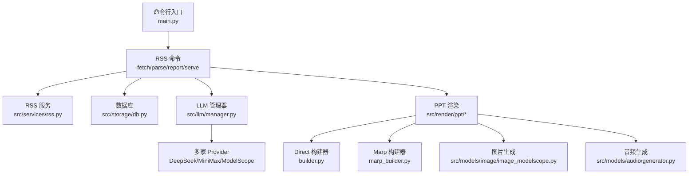
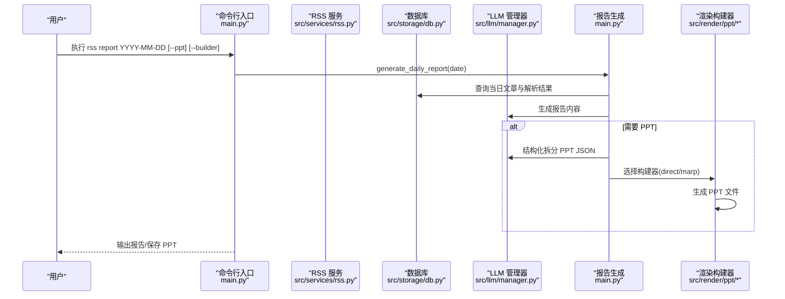
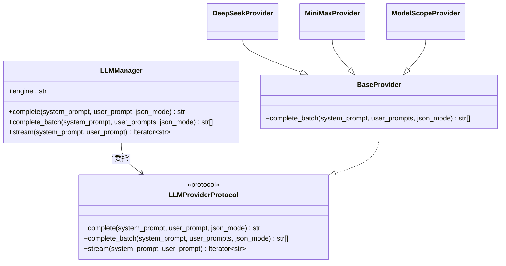
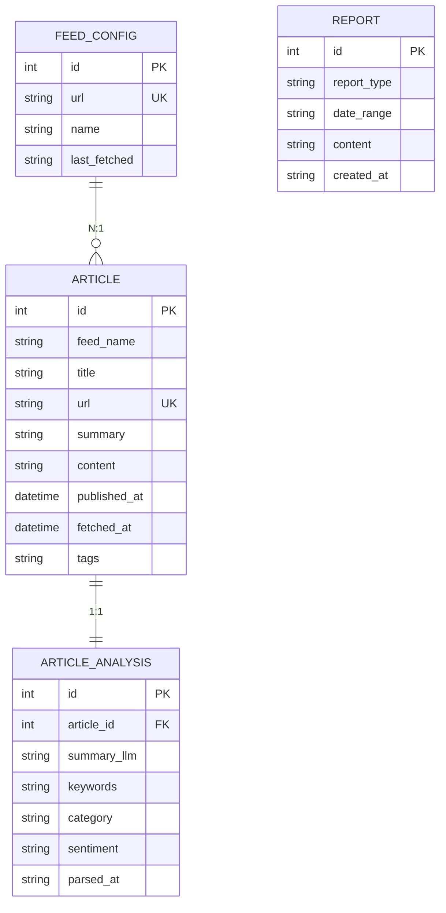
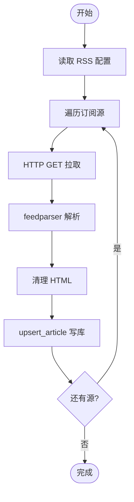
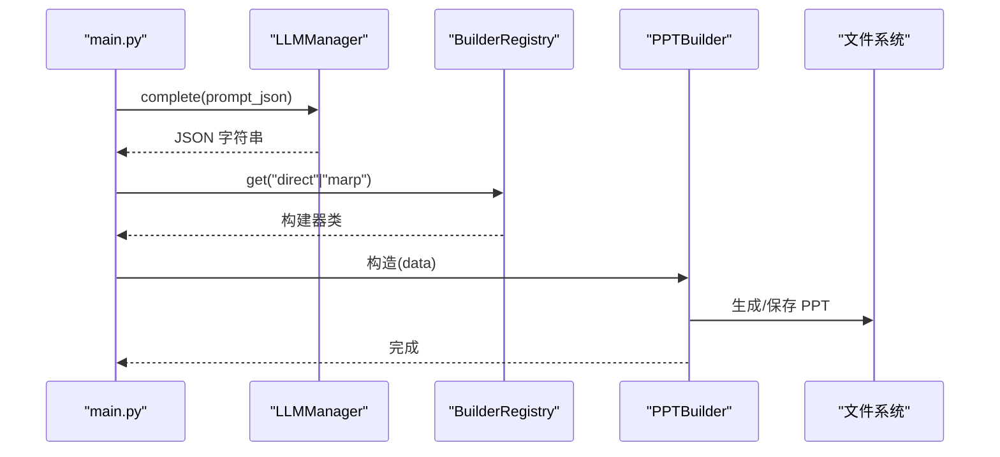
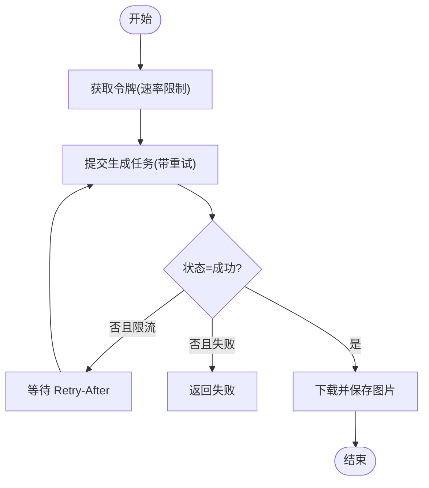
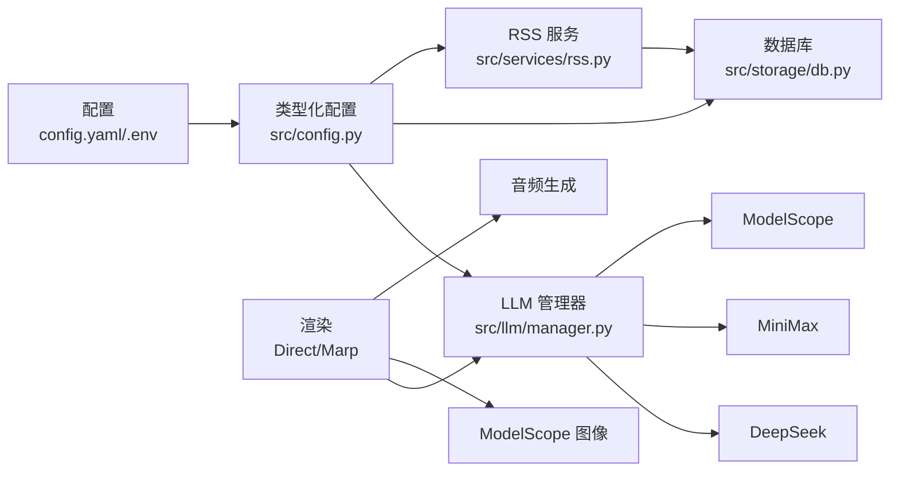

# API 参考

<cite>
**本文档引用的文件**
- [README.md](file://README.md)
- [main.py](file://main.py)
- [config.yaml](file://config.yaml)
- [src/config.py](file://src/config.py)
- [src/llm/manager.py](file://src/llm/manager.py)
- [src/models/llm/manager.py](file://src/models/llm/manager.py)
- [src/storage/db.py](file://src/storage/db.py)
- [src/services/rss.py](file://src/services/rss.py)
- [src/render/ppt/base.py](file://src/render/ppt/base.py)
- [src/render/ppt/builder.py](file://src/render/ppt/builder.py)
- [src/render/ppt/marp_builder.py](file://src/render/ppt/marp_builder.py)
- [src/models/image/image_modelscope.py](file://src/models/image/image_modelscope.py)
- [src/models/audio/generator.py](file://src/models/audio/generator.py)
- [pyproject.toml](file://pyproject.toml)
</cite>

## 目录
1. [简介](#简介)
2. [项目结构](#项目结构)
3. [核心组件](#核心组件)
4. [架构总览](#架构总览)
5. [详细组件分析](#详细组件分析)
6. [依赖关系分析](#依赖关系分析)
7. [性能考量](#性能考量)
8. [故障排查指南](#故障排查指南)
9. [结论](#结论)
10. [附录](#附录)

## 简介
Brief Agent 是一个基于 LangGraph 的多模态内容自动生成与分发系统，提供 RSS 抓取、文章解析、报告生成、PPT 渲染、向量检索等能力。本文档面向开发者，系统梳理公开接口与 API 端点，覆盖 LLM Provider 接口、数据库接口、渲染接口、图片与音频生成接口，并给出参数说明、返回值定义、错误处理、调用方式、认证方法、性能特征、并发支持、测试与调试建议。

## 项目结构
项目采用分层组织：命令行入口负责 CLI 命令；配置模块负责 YAML/环境变量加载；LLM 管理器封装多家大模型提供商；数据库模块基于 SQLModel；RSS 服务负责抓取与解析；渲染层提供多种 PPT 构建器；模型层封装第三方 API（图片、音频）。

图表来源
- [main.py](file://main.py#L22-L227)
- [src/services/rss.py](file://src/services/rss.py#L15-L123)
- [src/storage/db.py](file://src/storage/db.py#L65-L251)
- [src/llm/manager.py](file://src/llm/manager.py#L206-L318)
- [src/render/ppt/builder.py](file://src/render/ppt/builder.py#L22-L194)
- [src/render/ppt/marp_builder.py](file://src/render/ppt/marp_builder.py#L21-L94)
- [src/models/image/image_modelscope.py](file://src/models/image/image_modelscope.py#L125-L363)
- [src/models/audio/generator.py](file://src/models/audio/generator.py#L15-L43)

章节来源
- [README.md](file://README.md#L87-L148)
- [main.py](file://main.py#L22-L227)

## 核心组件
- 配置加载：从 config.yaml 读取并注入环境变量，类型安全校验。
- LLM 管理器：统一对外接口，支持 complete、complete_batch、stream，内部路由至不同 Provider。
- 数据库：Article/ArticleAnalysis/FeedConfig/Report 表，提供增删改查与聚合查询。
- RSS 服务：抓取 RSS 源，解析 HTML，入库去重。
- 渲染层：Direct 与 Marp 两种 PPT 构建器，支持模板与 CLI 渲染。
- 图片/音频：ModelScope 图片生成（异步任务+轮询）、音色克隆与 TTS。

章节来源
- [src/config.py](file://src/config.py#L74-L109)
- [src/llm/manager.py](file://src/llm/manager.py#L206-L318)
- [src/storage/db.py](file://src/storage/db.py#L65-L251)
- [src/services/rss.py](file://src/services/rss.py#L15-L123)
- [src/render/ppt/base.py](file://src/render/ppt/base.py#L16-L42)

## 架构总览
下图展示 CLI 命令到各子系统的调用关系与数据流。

图表来源
- [main.py](file://main.py#L107-L188)
- [src/services/rss.py](file://src/services/rss.py#L22-L61)
- [src/storage/db.py](file://src/storage/db.py#L129-L166)
- [src/llm/manager.py](file://src/llm/manager.py#L297-L318)
- [src/render/ppt/builder.py](file://src/render/ppt/builder.py#L128-L151)
- [src/render/ppt/marp_builder.py](file://src/render/ppt/marp_builder.py#L59-L94)

## 详细组件分析

### CLI 命令与端点
- 命令：rss fetch
  - 参数
    - feed_name: 可选，指定订阅源名称
    - verbose: 可选，开启详细日志
  - 行为：抓取配置中的 RSS 源，去重入库
  - 返回：打印抓取数量
  - 错误：网络/解析异常记录日志并继续
- 命令：rss parse
  - 参数
    - limit: 可选，默认 50，限制解析条数
    - verbose: 可选
  - 行为：查询未解析文章，批量调用 LLM 完成解析并入库
  - 返回：打印成功/失败统计
- 命令：rss report
  - 参数
    - date: 必填，YYYY-MM-DD
    - output: 可选，打印报告内容到 stdout
    - ppt: 可选，生成 PPT
    - builder: 可选，direct 或 marp，默认 direct
    - verbose: 可选
  - 行为：生成日报；可选输出 PPT；支持结构化 JSON 降级
  - 返回：报告状态与 ID；PPT 保存路径
  - 错误：日期格式错误、生成失败时退出码非零
- 命令：rss serve
  - 行为：占位，当前未实现 Web UI
  - 返回：提示未实现并退出

章节来源
- [main.py](file://main.py#L66-L141)
- [main.py](file://main.py#L208-L217)

### LLM Provider 接口
- 统一管理器：LLMManager
  - 方法
    - complete(system_prompt, user_prompt, json_mode=False) -> str
    - complete_batch(system_prompt, user_prompts, json_mode=False) -> list[str]
    - stream(system_prompt, user_prompt) -> Iterator[str]
  - 选择策略：优先从配置加载，失败回退环境变量
  - Provider 支持：DeepSeek、MiniMax、ModelScope
- Provider 协议：LLMProviderProtocol
  - complete/system_prompt, user_prompt, json_mode
  - complete_batch
  - stream
- BaseProvider：提供统一的 complete_batch 实现（线程池并发）

图表来源
- [src/llm/manager.py](file://src/llm/manager.py#L24-L63)
- [src/llm/manager.py](file://src/llm/manager.py#L206-L318)

章节来源
- [src/llm/manager.py](file://src/llm/manager.py#L206-L318)
- [src/models/llm/manager.py](file://src/models/llm/manager.py#L206-L318)

### 数据库接口（SQLModel）
- 模型
  - Article：文章元数据（唯一 URL）
  - ArticleAnalysis：解析结果（一对一关联 Article）
  - FeedConfig：RSS 源配置
  - Report：报告
- Database 类
  - upsert_article(article) -> id|None
  - get_article_by_id(id) -> Article?
  - get_articles(start_date?, end_date?, limit?) -> List[Article]
  - get_articles_by_date(start, end?) -> List[Article]
  - get_unparsed_articles(limit?) -> List[Article]
  - save_analysis(analysis) -> id
  - get_analysis_by_article_id(id) -> ArticleAnalysis?
  - get_parsed_articles(limit?) -> List[(Article, ArticleAnalysis)]
  - clear_all_analysis() -> count
  - save_report(type, date_range, content) -> id
  - get_reports(type?, limit?) -> List[Report]

图表来源
- [src/storage/db.py](file://src/storage/db.py#L14-L61)

章节来源
- [src/storage/db.py](file://src/storage/db.py#L65-L251)

### RSS 服务接口
- RSSFetcher
  - fetch_all() -> int：遍历配置的 RSS 源，抓取并入库
  - fetch_feed(feed_config) -> int：解析单源，清理 HTML，入库
  - _parse_entry(entry, feed_name) -> Article?
  - _clean_html(html) -> str
- RSSScheduler
  - start()：循环定时抓取（阻塞）

图表来源
- [src/services/rss.py](file://src/services/rss.py#L22-L61)
- [src/services/rss.py](file://src/services/rss.py#L62-L108)

章节来源
- [src/services/rss.py](file://src/services/rss.py#L15-L123)

### 渲染接口（PPT）
- 注册机制：BuilderRegistry
  - register(name)(cls) -> cls
  - get(name) -> type[PPTBuilder]
  - list() -> list[str]
- DirectPPBuilder
  - 构造：data(dict)，provider(str)，style(str?)
  - build(output_path: str) -> None：标题页+内容页，写入备注
- MarpPPBuilder
  - 构造：data(dict)，provider(str)，template(str)，marp_cli_path(str?)
  - build(output_path: str) -> None：JSON→Marp Markdown→PPT（依赖 marp CLI）

图表来源
- [main.py](file://main.py#L143-L188)
- [src/render/ppt/base.py](file://src/render/ppt/base.py#L16-L42)
- [src/render/ppt/builder.py](file://src/render/ppt/builder.py#L22-L194)
- [src/render/ppt/marp_builder.py](file://src/render/ppt/marp_builder.py#L21-L94)

章节来源
- [src/render/ppt/base.py](file://src/render/ppt/base.py#L16-L42)
- [src/render/ppt/builder.py](file://src/render/ppt/builder.py#L22-L194)
- [src/render/ppt/marp_builder.py](file://src/render/ppt/marp_builder.py#L21-L94)

### 图片生成接口（ModelScope）
- generate_image(prompt, output_path, api_key?, model?, max_retries?, rate_limiter_instance?) -> bool
  - 指数退避重试、速率限制、异步任务+轮询、超时控制
- generate_images_batch(tasks, api_key?, model?, max_workers?, rate_limit?) -> dict[str, bool]
  - 线程池并发，统一速率限制器
- CLI 子命令
  - gen：单图生成
  - batch：批量生成（输入文件每行“提示词|输出路径”）

图表来源
- [src/models/image/image_modelscope.py](file://src/models/image/image_modelscope.py#L125-L244)
- [src/models/image/image_modelscope.py](file://src/models/image/image_modelscope.py#L246-L304)

章节来源
- [src/models/image/image_modelscope.py](file://src/models/image/image_modelscope.py#L125-L363)

### 音频生成接口（统一）
- AudioGenerator
  - 构造：engine=AudioEngine.DASHSCOPE|MINIMAX
  - clone_voice(audio_path, prefix) -> voice_id
  - generate(text, voice_id, output_path) -> None
  - list_voices() -> dict[id, name]

章节来源
- [src/models/audio/generator.py](file://src/models/audio/generator.py#L15-L43)

## 依赖关系分析
- 配置来源：config.yaml + .env，类型化校验与环境变量替换
- LLM Provider：OpenAI 兼容客户端（DeepSeek/ModelScope）与原生请求（MiniMax）
- 数据持久化：SQLite（WAL 模式），SQLModel ORM
- 渲染：Direct 使用 python-pptx；Marp 依赖系统 marp CLI
- 第三方模型：ModelScope 图像生成（异步任务+轮询）

图表来源
- [src/config.py](file://src/config.py#L74-L109)
- [src/llm/manager.py](file://src/llm/manager.py#L253-L295)
- [src/storage/db.py](file://src/storage/db.py#L68-L94)
- [src/services/rss.py](file://src/services/rss.py#L18-L21)
- [src/render/ppt/builder.py](file://src/render/ppt/builder.py#L51-L61)
- [src/render/ppt/marp_builder.py](file://src/render/ppt/marp_builder.py#L25-L36)
- [src/models/image/image_modelscope.py](file://src/models/image/image_modelscope.py#L147-L150)

章节来源
- [pyproject.toml](file://pyproject.toml#L7-L29)

## 性能考量
- 并发与批处理
  - LLM 批量推理：ThreadPoolExecutor(max_workers=10)
  - 图片批量生成：可配置 max_workers 与 rate_limit
- 数据库
  - WAL 模式 + busy_timeout 提升并发读写
  - 事务提交与连接超时设置
- 渲染
  - Direct 构建器：纯内存渲染，适合中小规模
  - Marp 构建器：依赖系统 CLI，适合模板化风格
- 限流与重试
  - 图片生成：全局/专用速率限制器 + 指数退避
  - LLM Provider：部分不支持流式（MiniMax），注意调用策略

章节来源
- [src/llm/manager.py](file://src/llm/manager.py#L57-L62)
- [src/models/image/image_modelscope.py](file://src/models/image/image_modelscope.py#L121-L123)
- [src/storage/db.py](file://src/storage/db.py#L84-L90)

## 故障排查指南
- 配置相关
  - 确认 .env 中对应 PROVIDER_API_KEY 已设置
  - 检查 config.yaml 中 provider.base_url/model 是否正确
- LLM 调用
  - json_mode 仅在 OpenAI 兼容客户端生效
  - MiniMax 不支持流式，避免 stream 调用
- 数据库
  - WAL 模式启用失败时检查 SQLite 版本与权限
  - 并发冲突可通过增加 busy_timeout 或减少并发
- RSS 抓取
  - 检查网络连通与订阅源可用性
  - feedparser 解析异常时查看 bozo_exception
- 渲染
  - Marp 未安装 CLI 时仅生成 Markdown，不会报错
  - Direct 构建器依赖 python-pptx，确保安装
- 图片生成
  - 429 限流时自动等待 Retry-After
  - 超时阈值可调，注意最大轮询时间

章节来源
- [src/llm/manager.py](file://src/llm/manager.py#L146-L157)
- [src/storage/db.py](file://src/storage/db.py#L84-L90)
- [src/services/rss.py](file://src/services/rss.py#L40-L48)
- [src/render/ppt/marp_builder.py](file://src/render/ppt/marp_builder.py#L37-L57)
- [src/models/image/image_modelscope.py](file://src/models/image/image_modelscope.py#L176-L181)

## 结论
Brief Agent 提供了从数据采集、解析、生成到渲染的完整链路。开发者可通过 CLI 快速上手，也可复用 LLM、数据库、渲染等模块接口进行二次开发。建议在生产环境中结合速率限制、重试与并发策略，合理选择渲染与模型 Provider，并完善监控与日志。

## 附录

### 配置与认证
- 配置文件：config.yaml
  - llm.default/providers：选择默认 Provider 与各 Provider 的 api_key/base_url/model
  - rss.feeds：订阅源列表与抓取间隔/超时
  - database/vector_db：SQLite/ChromaDB 路径与集合名
  - logging/scheduler：日志轮转、保留策略与定时任务配置
- 环境变量
  - 通过 ${ENV_VAR} 形式注入，如 MINIMAX_API_KEY、MODELSCOPE_API_KEY、DEEPSEEK_API_KEY
- 认证方式
  - LLM Provider：HTTP Header Authorization 或 OpenAI 客户端密钥
  - 图片生成：HTTP Header Authorization: Bearer ${MODELSCOPE_API_KEY}

章节来源
- [config.yaml](file://config.yaml#L4-L54)
- [src/config.py](file://src/config.py#L91-L109)
- [src/models/image/image_modelscope.py](file://src/models/image/image_modelscope.py#L152-L155)

### 版本兼容性与迁移
- Python 版本：要求 >= 3.11
- 依赖管理：使用 uv + pyproject.toml
- 迁移建议
  - 新增 Provider：实现 LLMProviderProtocol 并在 LLMManager 中注册
  - 更换默认 Provider：修改 config.yaml llm.default
  - 数据库变更：遵循 SQLModel 迁移流程，谨慎处理主键与外键约束

章节来源
- [pyproject.toml](file://pyproject.toml#L6-L29)
- [src/llm/manager.py](file://src/llm/manager.py#L253-L295)

### 使用示例与场景
- 生成日报并导出 PPT
  - 步骤：rss fetch → rss parse → rss report YYYY-MM-DD --ppt --builder direct/marp
  - 场景：每日/每周知识汇总、快速汇报
- 批量图片生成
  - 步骤：准备 prompts 文件（每行“提示词|输出路径”），执行 rss images batch prompts.txt
  - 场景：批量配图、素材库建设
- 自定义渲染模板
  - 使用 Marp 构建器配合模板目录，定制视觉风格
  - 场景：品牌化 PPT 输出

章节来源
- [main.py](file://main.py#L66-L141)
- [src/render/ppt/marp_builder.py](file://src/render/ppt/marp_builder.py#L25-L36)
- [src/models/image/image_modelscope.py](file://src/models/image/image_modelscope.py#L326-L359)