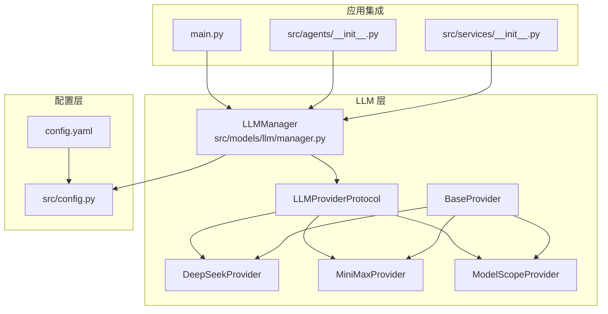
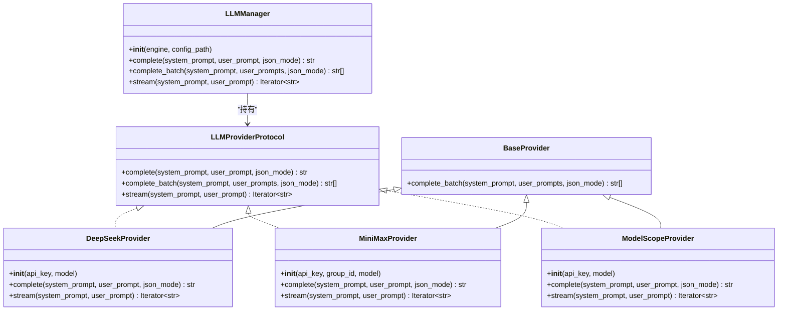
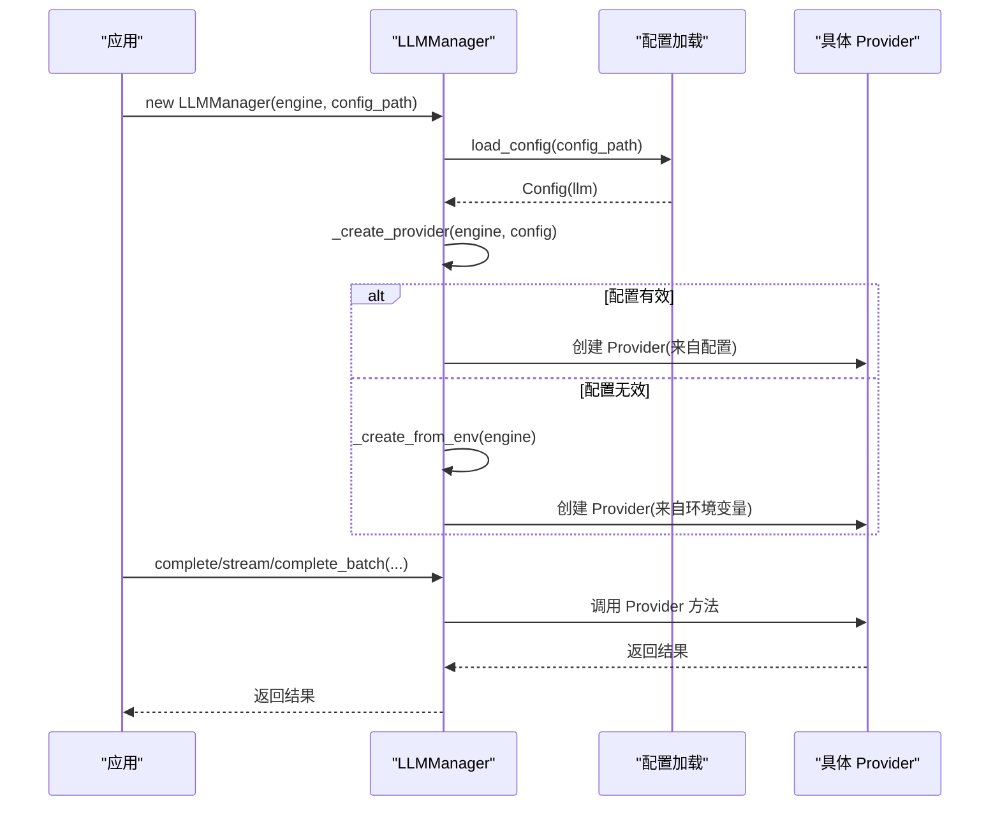
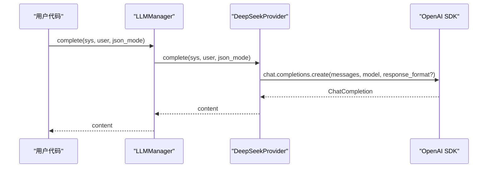

# LLM 接口

<cite>
**本文引用的文件**
- [src/llm/manager.py](file://src/llm/manager.py)
- [src/models/llm/manager.py](file://src/models/llm/manager.py)
- [src/llm/__init__.py](file://src/llm/__init__.py)
- [src/models/llm/__init__.py](file://src/models/llm/__init__.py)
- [src/config.py](file://src/config.py)
- [config.yaml](file://config.yaml)
- [main.py](file://main.py)
- [src/agents/__init__.py](file://src/agents/__init__.py)
- [src/services/__init__.py](file://src/services/__init__.py)
</cite>

## 目录
1. [简介](#简介)
2. [项目结构](#项目结构)
3. [核心组件](#核心组件)
4. [架构总览](#架构总览)
5. [详细组件分析](#详细组件分析)
6. [依赖关系分析](#依赖关系分析)
7. [性能考量](#性能考量)
8. [故障排查指南](#故障排查指南)
9. [结论](#结论)
10. [附录](#附录)

## 简介
本文件面向 LLM Provider 接口的使用者与维护者，系统性梳理 LLMProviderProtocol 协议与 LLMManager 管理器的设计与实现，覆盖以下主题：
- 协议定义：complete、complete_batch、stream 三类方法的参数规范、返回值类型与行为约定
- Provider 实现：DeepSeekProvider、MiniMaxProvider、ModelScopeProvider 的特性差异与调用方式
- 配置与切换：基于 config.yaml 的 Provider 选择与回退策略（环境变量）
- JSON 模式支持与响应格式
- 错误处理与异常场景
- 使用示例：初始化、单次推理、批量处理、流式生成

## 项目结构
围绕 LLM 的核心代码位于 src/models/llm/manager.py，同时保留了向后兼容的 src/llm/manager.py 与导入入口。配置由 config.yaml 与 src/config.py 提供。

图表来源
- [src/models/llm/manager.py](file://src/models/llm/manager.py#L24-L41)
- [src/models/llm/manager.py](file://src/models/llm/manager.py#L45-L63)
- [src/models/llm/manager.py](file://src/models/llm/manager.py#L67-L104)
- [src/models/llm/manager.py](file://src/models/llm/manager.py#L108-L157)
- [src/models/llm/manager.py](file://src/models/llm/manager.py#L162-L202)
- [src/models/llm/manager.py](file://src/models/llm/manager.py#L206-L317)
- [src/config.py](file://src/config.py#L74-L88)
- [config.yaml](file://config.yaml#L4-L21)
- [main.py](file://main.py#L149-L152)
- [src/agents/__init__.py](file://src/agents/__init__.py#L9-L14)
- [src/services/__init__.py](file://src/services/__init__.py#L8-L10)

章节来源
- [src/models/llm/manager.py](file://src/models/llm/manager.py#L1-L318)
- [src/config.py](file://src/config.py#L1-L109)
- [config.yaml](file://config.yaml#L1-L54)
- [main.py](file://main.py#L149-L152)
- [src/agents/__init__.py](file://src/agents/__init__.py#L1-L15)
- [src/services/__init__.py](file://src/services/__init__.py#L1-L11)

## 核心组件
- LLMProviderProtocol：定义统一的 Provider 接口，包含 complete、complete_batch、stream 三个方法
- BaseProvider：提供统一的批量推理实现（ThreadPoolExecutor）
- Provider 实现：
  - DeepSeekProvider：基于 OpenAI SDK，支持 JSON 模式
  - MiniMaxProvider：基于 HTTP 请求，不支持流式
  - ModelScopeProvider：基于 OpenAI SDK，支持 JSON 模式
- LLMManager：负责从配置或环境变量创建具体 Provider，并对外暴露 complete、complete_batch、stream

章节来源
- [src/models/llm/manager.py](file://src/models/llm/manager.py#L24-L41)
- [src/models/llm/manager.py](file://src/models/llm/manager.py#L45-L63)
- [src/models/llm/manager.py](file://src/models/llm/manager.py#L67-L104)
- [src/models/llm/manager.py](file://src/models/llm/manager.py#L108-L157)
- [src/models/llm/manager.py](file://src/models/llm/manager.py#L162-L202)
- [src/models/llm/manager.py](file://src/models/llm/manager.py#L206-L317)

## 架构总览
下面以类图展示协议、基类与各 Provider 的关系，以及 LLMManager 的装配过程。

图表来源
- [src/models/llm/manager.py](file://src/models/llm/manager.py#L24-L41)
- [src/models/llm/manager.py](file://src/models/llm/manager.py#L45-L63)
- [src/models/llm/manager.py](file://src/models/llm/manager.py#L67-L104)
- [src/models/llm/manager.py](file://src/models/llm/manager.py#L108-L157)
- [src/models/llm/manager.py](file://src/models/llm/manager.py#L162-L202)
- [src/models/llm/manager.py](file://src/models/llm/manager.py#L206-L317)

## 详细组件分析

### 协议与基类
- LLMProviderProtocol
  - 参数
    - system_prompt: 系统提示词
    - user_prompt: 用户输入
    - json_mode: 是否启用 JSON 模式（仅部分 Provider 支持）
  - 返回值
    - complete: str
    - complete_batch: list[str]
    - stream: 迭代器 Iterator[str]
- BaseProvider.complete_batch
  - 使用线程池并发调用 complete，统计成功数量并记录日志

章节来源
- [src/models/llm/manager.py](file://src/models/llm/manager.py#L24-L41)
- [src/models/llm/manager.py](file://src/models/llm/manager.py#L45-L63)

### Provider 实现对比

#### DeepSeekProvider
- 初始化
  - 接受 api_key 与 model，默认模型名
  - 基于 OpenAI SDK，base_url 指向 DeepSeek
- complete
  - 构造消息数组，按需设置 response_format 为 JSON 模式
  - 返回 choices[0].message.content
- stream
  - 使用 OpenAI SDK 的流式接口，逐块产出 delta.content

章节来源
- [src/models/llm/manager.py](file://src/models/llm/manager.py#L67-L104)

#### MiniMaxProvider
- 初始化
  - 接受 api_key、group_id、model
  - 使用 HTTP 请求调用 /chat_completion_v2
- complete
  - 发送 JSON 负载，校验状态码与响应结构，提取 content
  - 若响应为空或状态码非 200，抛出 RuntimeError
- stream
  - 当前不支持流式，返回空迭代器并记录警告

章节来源
- [src/models/llm/manager.py](file://src/models/llm/manager.py#L108-L157)

#### ModelScopeProvider
- 初始化
  - 接受 api_key 与 model
  - 基于 OpenAI SDK，base_url 指向 ModelScope
- complete
  - 构造消息数组，按需设置 response_format 为 JSON 模式
  - 返回 choices[0].message.content
- stream
  - 使用 OpenAI SDK 的流式接口，逐块产出 delta.content

章节来源
- [src/models/llm/manager.py](file://src/models/llm/manager.py#L162-L202)

### LLMManager：配置与切换
- 初始化
  - 通过 engine 选择 Provider（minimax/deepseek/modelscope）
  - 优先从 config.yaml 加载配置，若失败则回退到环境变量
- Provider 创建
  - _create_provider：读取配置中的 providers 节点，按 engine 选择对应 Provider
  - _create_from_env：从环境变量读取 API Key 与 GroupId（MiniMax）
- 方法代理
  - complete、complete_batch、stream 直接委托给当前 Provider

章节来源
- [src/models/llm/manager.py](file://src/models/llm/manager.py#L206-L317)
- [src/config.py](file://src/config.py#L74-L88)
- [config.yaml](file://config.yaml#L4-L21)

## 依赖关系分析
- 配置加载
  - LLMManager 依赖 src/config.py 的 load_config，将 config.yaml 中的 llm 节点映射为 Pydantic 模型
- Provider 选择
  - config.yaml 的 llm.default 决定默认引擎
  - providers 节点提供各 Provider 的 api_key、base_url、model 等
- 应用集成
  - main.py 在生成 PPT 的流程中使用 LLMManager
  - src/agents/__init__.py 与 src/services/__init__.py 提供便捷访问

图表来源
- [src/models/llm/manager.py](file://src/models/llm/manager.py#L243-L295)
- [src/config.py](file://src/config.py#L74-L88)
- [config.yaml](file://config.yaml#L4-L21)

章节来源
- [src/models/llm/manager.py](file://src/models/llm/manager.py#L243-L295)
- [src/config.py](file://src/config.py#L74-L88)
- [config.yaml](file://config.yaml#L4-L21)

## 性能考量
- 批量推理
  - BaseProvider 使用 ThreadPoolExecutor(max_workers=10) 并发执行，适合 CPU 密集度较低的网络请求场景
  - 注意：并发数与网络带宽、目标服务限流策略匹配，避免被限速
- 流式生成
  - DeepSeekProvider 与 ModelScopeProvider 支持流式，适合实时渲染
  - MiniMaxProvider 当前不支持流式，返回空迭代器
- JSON 模式
  - 仅 DeepSeek 与 ModelScope 支持 response_format=json_object，减少后处理成本
  - MiniMax 不支持 JSON 模式，需在应用侧进行 JSON 解析与校验

章节来源
- [src/models/llm/manager.py](file://src/models/llm/manager.py#L48-L62)
- [src/models/llm/manager.py](file://src/models/llm/manager.py#L79-L92)
- [src/models/llm/manager.py](file://src/models/llm/manager.py#L177-L190)
- [src/models/llm/manager.py](file://src/models/llm/manager.py#L154-L157)

## 故障排查指南
- 配置加载失败
  - 现象：_create_provider 抛出异常，日志记录 warning，回退到环境变量
  - 处理：检查 config.yaml 的 llm 节点与环境变量是否正确
- API Key 缺失
  - 现象：Provider 初始化时报错，提示需要配置 API Key
  - 处理：在 config.yaml 或环境变量中补全对应 Key
- MiniMax 响应为空或状态码非 200
  - 现象：抛出 RuntimeError，提示“响应为空”或“API 错误”
  - 处理：检查请求负载、模型名与权限
- 流式不支持
  - 现象：MiniMaxProvider 的 stream 返回空迭代器并记录警告
  - 处理：改用 complete 或切换到支持流式的 Provider

章节来源
- [src/models/llm/manager.py](file://src/models/llm/manager.py#L276-L278)
- [src/models/llm/manager.py](file://src/models/llm/manager.py#L73-L74)
- [src/models/llm/manager.py](file://src/models/llm/manager.py#L114-L115)
- [src/models/llm/manager.py](file://src/models/llm/manager.py#L146-L151)
- [src/models/llm/manager.py](file://src/models/llm/manager.py#L155-L157)

## 结论
- LLMProviderProtocol 提供统一抽象，屏蔽底层差异
- LLMManager 通过配置与环境变量实现灵活的 Provider 切换
- DeepSeek 与 ModelScope 支持 JSON 模式与流式，适合结构化输出与实时交互
- MiniMax 当前不支持流式，但可通过 JSON 模式提升稳定性
- 建议在生产环境中结合限流策略与重试机制，确保稳定性

## 附录

### API 定义与参数规范
- LLMProviderProtocol
  - complete(system_prompt: str, user_prompt: str, json_mode: bool = False) -> str
  - complete_batch(system_prompt: str, user_prompts: list[str], json_mode: bool = False) -> list[str]
  - stream(system_prompt: str, user_prompt: str) -> Iterator[str]
- BaseProvider.complete_batch
  - 使用线程池并发调用，返回同序结果列表

章节来源
- [src/models/llm/manager.py](file://src/models/llm/manager.py#L24-L41)
- [src/models/llm/manager.py](file://src/models/llm/manager.py#L48-L62)

### Provider 特定配置与调用方式
- DeepSeekProvider
  - 初始化：api_key, model
  - 调用：complete/stream 支持 JSON 模式
- MiniMaxProvider
  - 初始化：api_key, group_id, model
  - 调用：complete 支持 JSON 模式；stream 不支持
- ModelScopeProvider
  - 初始化：api_key, model
  - 调用：complete/stream 支持 JSON 模式

章节来源
- [src/models/llm/manager.py](file://src/models/llm/manager.py#L70-L77)
- [src/models/llm/manager.py](file://src/models/llm/manager.py#L113-L123)
- [src/models/llm/manager.py](file://src/models/llm/manager.py#L165-L175)

### JSON 模式支持与响应格式
- 支持 JSON 模式的 Provider
  - DeepSeekProvider：通过 response_format={"type": "json_object"}
  - ModelScopeProvider：通过 response_format={"type": "json_object"}
- MiniMaxProvider：不支持 JSON 模式，需在应用侧解析 JSON
- 响应格式
  - complete 返回字符串内容
  - stream 返回字符片段迭代器

章节来源
- [src/models/llm/manager.py](file://src/models/llm/manager.py#L88-L89)
- [src/models/llm/manager.py](file://src/models/llm/manager.py#L186-L187)
- [src/models/llm/manager.py](file://src/models/llm/manager.py#L94-L103)
- [src/models/llm/manager.py](file://src/models/llm/manager.py#L192-L201)

### Provider 选择与切换配置
- 默认引擎
  - config.yaml 的 llm.default 指定默认 Provider
- Provider 列表
  - config.yaml 的 llm.providers 下的 minimax/deepseek/modelscope 节点提供配置
- 回退策略
  - 若配置加载失败，LLMManager 回退到环境变量（如 MINIMAX_API_KEY、MODELSCOPE_API_KEY、DEEPSEEK_API_KEY）

章节来源
- [config.yaml](file://config.yaml#L4-L21)
- [src/models/llm/manager.py](file://src/models/llm/manager.py#L257-L280)

### 使用示例（路径指引）
- 初始化不同 Provider
  - 使用 LLMManager("deepseek")、LLMManager("minimax")、LLMManager("modelscope")
  - 示例参考：main.py 中的 PPT 生成流程
- 执行单次推理
  - llm.complete(system_prompt, user_prompt, json_mode=False)
- 批量处理
  - llm.complete_batch(system_prompt, user_prompts, json_mode=False)
- 流式生成
  - for chunk in llm.stream(system_prompt, user_prompt): print(chunk, end="", flush=True)

章节来源
- [main.py](file://main.py#L149-L152)
- [src/models/llm/manager.py](file://src/models/llm/manager.py#L297-L317)

### 代码级调用序列（示例）

图表来源
- [src/models/llm/manager.py](file://src/models/llm/manager.py#L79-L92)
- [src/models/llm/manager.py](file://src/models/llm/manager.py#L88-L89)