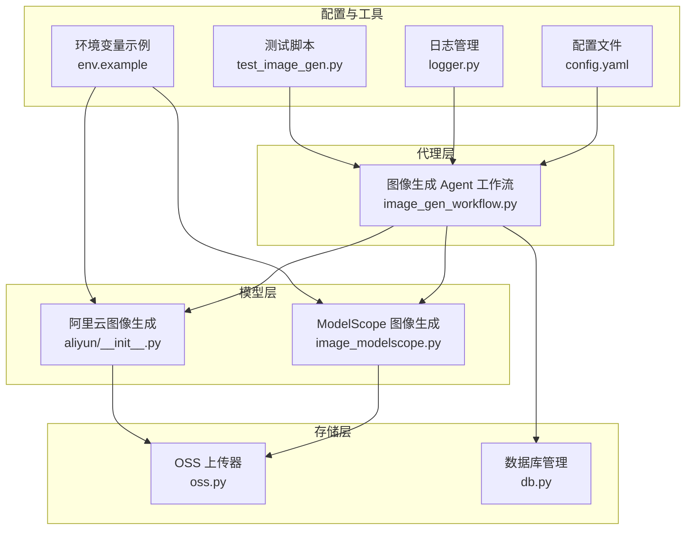
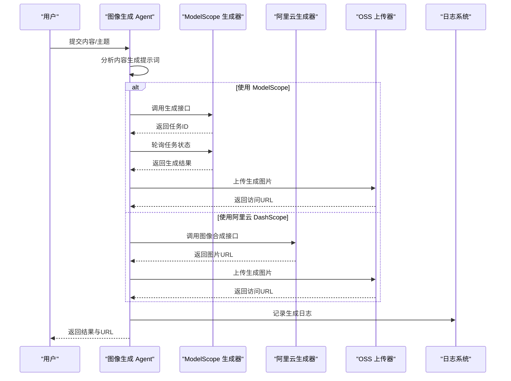
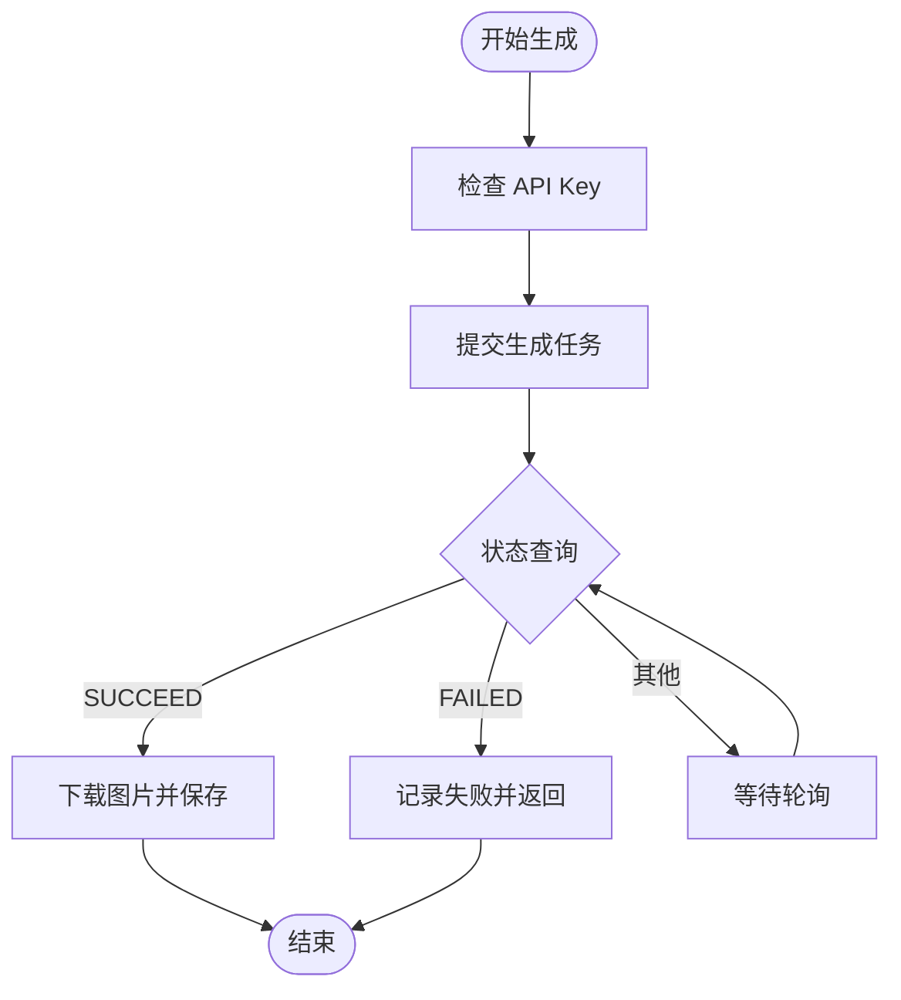
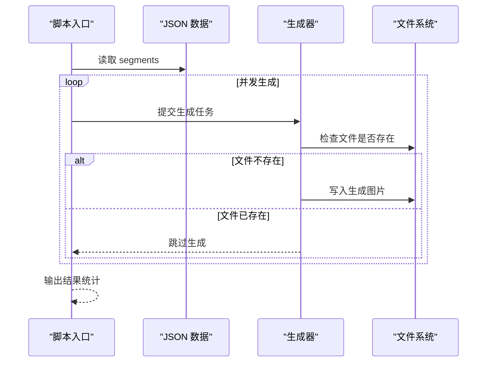
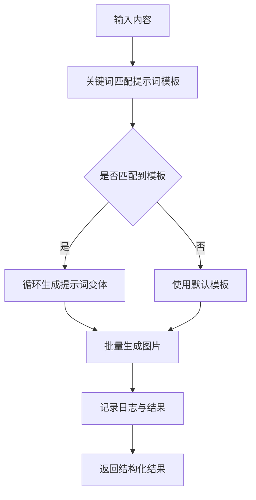
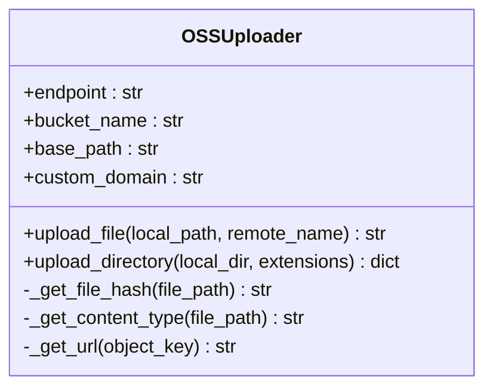
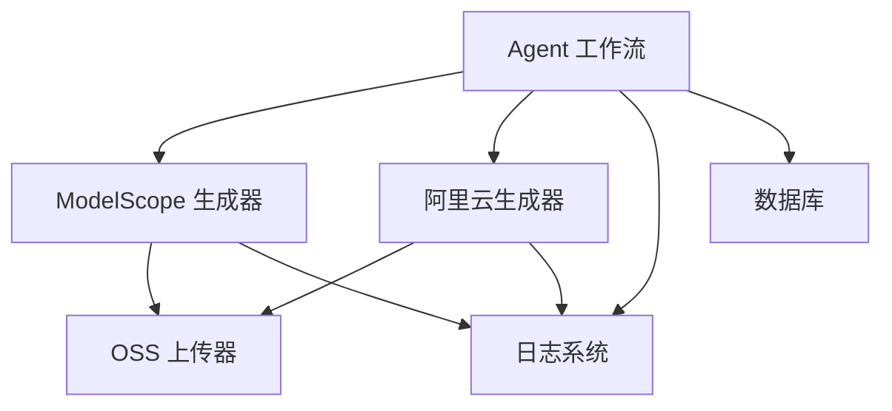

# 图像生成接口

<cite>
**本文档引用的文件**
- [src/models/image/__init__.py](file://src/models/image/__init__.py)
- [src/models/image/image_modelscope.py](file://src/models/image/image_modelscope.py)
- [src/models/image/oss.py](file://src/models/image/oss.py)
- [src/models/image/aliyun/__init__.py](file://src/models/image/aliyun/__init__.py)
- [src/agents/image_gen_workflow.py](file://src/agents/image_gen_workflow.py)
- [scripts/test_image_gen.py](file://scripts/test_image_gen.py)
- [config.yaml](file://config.yaml)
- [env.example](file://env.example)
- [src/storage/logger.py](file://src/storage/logger.py)
- [src/storage/db.py](file://src/storage/db.py)
</cite>

## 目录
1. [简介](#简介)
2. [项目结构](#项目结构)
3. [核心组件](#核心组件)
4. [架构概览](#架构概览)
5. [详细组件分析](#详细组件分析)
6. [依赖关系分析](#依赖关系分析)
7. [性能考量](#性能考量)
8. [故障排除指南](#故障排除指南)
9. [结论](#结论)
10. [附录](#附录)

## 简介
本文件为图像生成接口的 API 文档，涵盖基于 ModelScope 和阿里云 DashScope 的图像生成服务集成，包括输入参数、输出格式、质量控制选项、批量处理与并发控制、缓存策略以及存储管理与访问权限控制。文档同时提供 Agent 协调机制说明与工作流集成方案，帮助开发者快速上手并稳定部署图像生成能力。

## 项目结构
该项目采用模块化组织，图像生成相关功能主要分布在以下位置：
- 模型层：ModelScope 图像生成与阿里云 DashScope 图像生成
- 代理层：图像生成 Agent 工作流，负责提示词分析与生成协调
- 存储层：OSS 上传与本地文件管理
- 配置层：环境变量与 YAML 配置文件
- 工具脚本：测试与演示脚本

**图表来源**
- [src/models/image/image_modelscope.py](file://src/models/image/image_modelscope.py#L1-L363)
- [src/models/image/aliyun/__init__.py](file://src/models/image/aliyun/__init__.py#L1-L126)
- [src/agents/image_gen_workflow.py](file://src/agents/image_gen_workflow.py#L1-L198)
- [src/models/image/oss.py](file://src/models/image/oss.py#L1-L158)
- [src/storage/db.py](file://src/storage/db.py#L1-L251)
- [config.yaml](file://config.yaml#L1-L54)
- [env.example](file://env.example#L1-L10)
- [src/storage/logger.py](file://src/storage/logger.py#L1-L39)
- [scripts/test_image_gen.py](file://scripts/test_image_gen.py#L1-L99)

**章节来源**
- [src/models/image/__init__.py](file://src/models/image/__init__.py#L1-L31)
- [src/models/image/image_modelscope.py](file://src/models/image/image_modelscope.py#L1-L363)
- [src/models/image/oss.py](file://src/models/image/oss.py#L1-L158)
- [src/models/image/aliyun/__init__.py](file://src/models/image/aliyun/__init__.py#L1-L126)
- [src/agents/image_gen_workflow.py](file://src/agents/image_gen_workflow.py#L1-L198)
- [config.yaml](file://config.yaml#L1-L54)
- [env.example](file://env.example#L1-L10)
- [src/storage/logger.py](file://src/storage/logger.py#L1-L39)
- [src/storage/db.py](file://src/storage/db.py#L1-L251)
- [scripts/test_image_gen.py](file://scripts/test_image_gen.py#L1-L99)

## 核心组件
- ModelScope 图像生成模块：提供单张与批量图像生成，内置指数退避重试与速率限制。
- 阿里云图像生成模块：基于 DashScope 的图像合成，支持并发与限流处理。
- 图像生成 Agent 工作流：根据内容自动分析并生成配图，支持快速生成与批量生成。
- OSS 上传模块：提供文件上传、去重、路径组织与 URL 生成。
- 配置与环境：通过 .env 与 config.yaml 管理 API Key 与运行参数。
- 日志与数据库：统一日志输出与 SQLite 数据库存储。

**章节来源**
- [src/models/image/image_modelscope.py](file://src/models/image/image_modelscope.py#L1-L363)
- [src/models/image/aliyun/__init__.py](file://src/models/image/aliyun/__init__.py#L1-L126)
- [src/agents/image_gen_workflow.py](file://src/agents/image_gen_workflow.py#L1-L198)
- [src/models/image/oss.py](file://src/models/image/oss.py#L1-L158)
- [config.yaml](file://config.yaml#L1-L54)
- [env.example](file://env.example#L1-L10)
- [src/storage/logger.py](file://src/storage/logger.py#L1-L39)
- [src/storage/db.py](file://src/storage/db.py#L1-L251)

## 架构概览
图像生成的整体流程如下：
- 输入内容由 Agent 分析，生成提示词模板
- 调用图像生成模型（ModelScope 或阿里云 DashScope）进行异步生成
- 生成完成后保存至本地或上传至 OSS
- 记录日志与状态，支持批量与并发控制

**图表来源**
- [src/agents/image_gen_workflow.py](file://src/agents/image_gen_workflow.py#L48-L139)
- [src/models/image/image_modelscope.py](file://src/models/image/image_modelscope.py#L125-L243)
- [src/models/image/aliyun/__init__.py](file://src/models/image/aliyun/__init__.py#L31-L89)
- [src/models/image/oss.py](file://src/models/image/oss.py#L54-L93)
- [src/storage/logger.py](file://src/storage/logger.py#L8-L38)

## 详细组件分析

### ModelScope 图像生成模块
- 功能概述
  - 支持单张与批量图像生成
  - 内置指数退避重试与速率限制
  - 异步任务轮询与超时控制
- 关键参数
  - prompt：图像提示词
  - output_path：输出文件路径
  - api_key：ModelScope API Key
  - model：模型 ID（默认 Z-Image-Turbo）
  - max_retries：最大重试次数
  - rate_limiter_instance：自定义速率限制器
- 输出格式
  - 生成的图片保存为本地文件（JPG）
- 质量控制
  - 通过提示词约束“无文字”、“无水印”等
  - 限流与超时保障稳定性
- 批量处理
  - ThreadPoolExecutor 并发生成
  - 可配置并发数与速率限制
- 缓存策略
  - 本地文件缓存（按输出路径）
  - OSS 去重上传（基于文件哈希）

**图表来源**
- [src/models/image/image_modelscope.py](file://src/models/image/image_modelscope.py#L125-L243)

**章节来源**
- [src/models/image/image_modelscope.py](file://src/models/image/image_modelscope.py#L1-L363)

### 阿里云图像生成模块
- 功能概述
  - 基于 DashScope 的图像合成
  - 统一风格提示词（黑白线稿、简洁背景等）
  - 并发控制与限流处理
- 关键参数
  - JSON_PATH：包含段落信息的 JSON 文件路径
  - OUTPUT_DIR：输出目录
  - MAX_WORKERS：并发数
  - STYLE_PREFIX/SUFFIX：统一风格提示词前后缀
- 输出格式
  - 生成的图片保存为本地文件（JPG）
- 质量控制
  - 固定尺寸（1024x1024）
  - 严格提示词约束（无文字、无水印等）
- 批量处理
  - 读取 JSON 中的 segments 并并发生成
  - 去重检查（文件存在性与大小）

**图表来源**
- [src/models/image/aliyun/__init__.py](file://src/models/image/aliyun/__init__.py#L91-L123)

**章节来源**
- [src/models/image/aliyun/__init__.py](file://src/models/image/aliyun/__init__.py#L1-L126)

### 图像生成 Agent 工作流
- 功能概述
  - 根据内容自动匹配提示词模板
  - 支持批量生成与快速生成
  - 结果结构化返回（路径、提示词、索引）
- 关键参数
  - content：输入内容
  - output_dir：输出目录
  - count：生成图片数量
  - api_key：API Key
- 输出格式
  - 返回包含成功状态、生成图片列表与计数的结果对象
- 质量控制
  - 使用预设提示词模板确保“无文字”等约束
  - 可通过 style 参数选择不同风格
- 工作流集成
  - 与日志系统集成，记录生成过程
  - 可与数据库模块配合存储元数据

**图表来源**
- [src/agents/image_gen_workflow.py](file://src/agents/image_gen_workflow.py#L48-L139)

**章节来源**
- [src/agents/image_gen_workflow.py](file://src/agents/image_gen_workflow.py#L1-L198)

### OSS 上传模块
- 功能概述
  - 将本地图片上传至阿里云 OSS
  - 基于文件哈希去重，避免重复上传
  - 自动生成日期前缀与安全文件名
- 关键参数
  - access_key_id/secret：OSS 凭证
  - endpoint：OSS Endpoint
  - bucket_name：Bucket 名称
  - base_path：上传路径前缀
  - custom_domain：自定义域名（可选）
- 输出格式
  - 返回公开访问 URL
- 存储管理
  - 日期分桶（YYYYMM）
  - 文件名包含哈希，避免冲突
- 权限控制
  - 通过 OSS Bucket 策略与 CDN 配置控制访问权限

**图表来源**
- [src/models/image/oss.py](file://src/models/image/oss.py#L13-L158)

**章节来源**
- [src/models/image/oss.py](file://src/models/image/oss.py#L1-L158)

### 配置与环境
- 环境变量
  - MODELSCOPE_API_KEY：ModelScope API Key
  - MINIMAX_API_KEY：Minimax API Key
  - OSS_*：OSS 相关配置（ID、Secret、Endpoint、Bucket、BasePath、CustomDomain）
- 配置文件
  - config.yaml：LLM 提供商配置、RSS 源、数据库、向量数据库、日志与调度器设置

**章节来源**
- [env.example](file://env.example#L1-L10)
- [config.yaml](file://config.yaml#L1-L54)

## 依赖关系分析
- 组件耦合
  - Agent 工作流依赖图像生成模块（ModelScope 或阿里云）
  - OSS 上传器可独立使用，也可作为生成流程的一部分
  - 日志系统贯穿各模块，便于追踪与排障
- 外部依赖
  - ModelScope API、阿里云 DashScope API
  - 阿里云 OSS SDK
  - Python 标准库与第三方库（requests、PIL、typer、oss2、loguru 等）

**图表来源**
- [src/agents/image_gen_workflow.py](file://src/agents/image_gen_workflow.py#L1-L198)
- [src/models/image/image_modelscope.py](file://src/models/image/image_modelscope.py#L1-L363)
- [src/models/image/aliyun/__init__.py](file://src/models/image/aliyun/__init__.py#L1-L126)
- [src/models/image/oss.py](file://src/models/image/oss.py#L1-L158)
- [src/storage/logger.py](file://src/storage/logger.py#L1-L39)
- [src/storage/db.py](file://src/storage/db.py#L1-L251)

**章节来源**
- [src/agents/image_gen_workflow.py](file://src/agents/image_gen_workflow.py#L1-L198)
- [src/models/image/image_modelscope.py](file://src/models/image/image_modelscope.py#L1-L363)
- [src/models/image/aliyun/__init__.py](file://src/models/image/aliyun/__init__.py#L1-L126)
- [src/models/image/oss.py](file://src/models/image/oss.py#L1-L158)
- [src/storage/logger.py](file://src/storage/logger.py#L1-L39)
- [src/storage/db.py](file://src/storage/db.py#L1-L251)

## 性能考量
- 并发与限流
  - ModelScope：默认每秒 2 次请求，可通过 RateLimiter 控制
  - 阿里云：默认并发数较低以避免限流
- 超时与重试
  - 请求超时与指数退避重试，避免瞬时故障影响整体流程
- 批量处理
  - ThreadPoolExecutor 并发生成，合理设置 workers 与 rate_limit
- 存储优化
  - OSS 去重上传减少带宽消耗
  - 日期分桶便于归档与清理

[本节为通用性能建议，无需特定文件引用]

## 故障排除指南
- 常见问题
  - API Key 未配置：检查 .env 文件中的 MODELSCOPE_API_KEY 或 DASHSCOPE_API_KEY
  - 限流错误：调整并发数与速率限制，或增加等待时间
  - 文件上传失败：确认 OSS 凭证与 Bucket 权限
- 日志定位
  - 使用日志系统查看生成状态与错误信息
  - Agent 工作流会记录每个步骤的状态与结果
- 数据库辅助
  - 可结合数据库模块记录生成元数据，便于回溯与重跑

**章节来源**
- [scripts/test_image_gen.py](file://scripts/test_image_gen.py#L54-L62)
- [src/storage/logger.py](file://src/storage/logger.py#L8-L38)
- [src/storage/db.py](file://src/storage/db.py#L1-L251)

## 结论
本图像生成接口提供了从内容分析到图片生成、上传与存储的完整链路，支持多种提供商与并发控制，并具备完善的日志与配置体系。通过合理的参数配置与质量约束，可在保证稳定性的同时提升生成效率与一致性。

[本节为总结性内容，无需特定文件引用]

## 附录

### API 接口定义与使用方法

- ModelScope 单张生成
  - 函数：generate_image(prompt, output_path, api_key, model, max_retries, rate_limiter_instance)
  - 输入参数
    - prompt：图像提示词
    - output_path：输出文件路径
    - api_key：ModelScope API Key
    - model：模型 ID（默认 Z-Image-Turbo）
    - max_retries：最大重试次数
    - rate_limiter_instance：速率限制器实例
  - 输出
    - 布尔值：是否成功
  - 使用示例
    - 参考：[scripts/test_image_gen.py](file://scripts/test_image_gen.py#L64-L68)

- ModelScope 批量生成
  - 函数：generate_images_batch(tasks, api_key, model, max_workers, rate_limit)
  - 输入参数
    - tasks：[(prompt, output_path), ...] 列表
    - api_key：API Key
    - model：模型 ID
    - max_workers：最大并发数
    - rate_limit：速率限制（请求/秒）
  - 输出
    - {output_path: success} 字典
  - 使用示例
    - 参考：[src/models/image/image_modelscope.py](file://src/models/image/image_modelscope.py#L246-L303)

- 阿里云图像生成（脚本）
  - 函数：generate_single_task(seg)、main()
  - 输入参数
    - JSON_PATH：包含段落信息的 JSON 文件路径
    - OUTPUT_DIR：输出目录
    - MAX_WORKERS：并发数
  - 输出
    - 生成图片并返回状态信息
  - 使用示例
    - 参考：[src/models/image/aliyun/__init__.py](file://src/models/image/aliyun/__init__.py#L91-L123)

- 图像生成 Agent
  - 函数：generate_image_agent(content, output_dir, count, api_key)、quick_generate(topic, style, output_path, api_key)
  - 输入参数
    - content：输入内容
    - output_dir：输出目录
    - count：生成图片数量
    - api_key：API Key
    - topic/style：主题与风格
  - 输出
    - 结构化结果对象（success、images、count、requested）
  - 使用示例
    - 参考：[src/agents/image_gen_workflow.py](file://src/agents/image_gen_workflow.py#L82-L139)

- OSS 上传
  - 类：OSSUploader
  - 方法：upload_file(local_path, remote_name)、upload_directory(local_dir, extensions)
  - 输入参数
    - access_key_id/secret、endpoint、bucket_name、base_path、custom_domain
  - 输出
    - 公开访问 URL
  - 使用示例
    - 参考：[src/models/image/oss.py](file://src/models/image/oss.py#L54-L93)

**章节来源**
- [src/models/image/image_modelscope.py](file://src/models/image/image_modelscope.py#L125-L303)
- [src/models/image/aliyun/__init__.py](file://src/models/image/aliyun/__init__.py#L31-L123)
- [src/agents/image_gen_workflow.py](file://src/agents/image_gen_workflow.py#L82-L172)
- [src/models/image/oss.py](file://src/models/image/oss.py#L54-L128)
- [scripts/test_image_gen.py](file://scripts/test_image_gen.py#L64-L68)

### 不同图像提供商的集成方式与配置参数
- ModelScope
  - 配置：MODELSCOPE_API_KEY
  - 默认模型：Z-Image-Turbo
  - 速率限制：默认每秒 2 次
  - 使用：generate_image() 与 generate_images_batch()
- 阿里云 DashScope
  - 配置：DASHSCOPE_API_KEY
  - 默认模型：wanx2.1-t2i-plus
  - 统一风格提示词：黑白线稿、简洁背景、无文字、无水印
  - 使用：脚本入口 main() 与 generate_single_task()

**章节来源**
- [env.example](file://env.example#L1-L10)
- [src/models/image/image_modelscope.py](file://src/models/image/image_modelscope.py#L30-L42)
- [src/models/image/aliyun/__init__.py](file://src/models/image/aliyun/__init__.py#L13-L25)

### 图像质量控制选项
- 提示词约束
  - “无文字”、“无水印”、“无签名”等
  - 阿里云固定风格提示词前后缀
- 尺寸与格式
  - ModelScope：保存为 JPG
  - 阿里云：固定 1024x1024
- 限流与超时
  - 速率限制与指数退避重试
  - 请求超时与轮询超时控制

**章节来源**
- [src/models/image/aliyun/__init__.py](file://src/models/image/aliyun/__init__.py#L23-L25)
- [src/models/image/image_modelscope.py](file://src/models/image/image_modelscope.py#L176-L181)

### 批量处理与并发控制
- ModelScope
  - ThreadPoolExecutor 并发生成
  - 可配置并发数与速率限制
- 阿里云
  - 低并发以避免限流
  - 去重检查（文件存在性与大小）

**章节来源**
- [src/models/image/image_modelscope.py](file://src/models/image/image_modelscope.py#L273-L303)
- [src/models/image/aliyun/__init__.py](file://src/models/image/aliyun/__init__.py#L99-L111)

### 缓存策略实现细节
- 本地缓存
  - 按输出路径保存生成图片
- OSS 去重
  - 基于文件 MD5 哈希与日期前缀避免重复上传
  - 支持自定义域名与默认域名访问

**章节来源**
- [src/models/image/oss.py](file://src/models/image/oss.py#L44-L93)

### 图像文件存储管理与访问权限控制
- 存储管理
  - 日期分桶（YYYYMM）
  - 安全文件名（hash_原文件名）
- 访问权限控制
  - 通过 OSS Bucket 策略与 CDN 配置控制访问
  - 支持自定义域名与默认域名访问

**章节来源**
- [src/models/image/oss.py](file://src/models/image/oss.py#L69-L101)

### 图像生成工作流集成与 Agent 协调机制
- Agent 协调
  - 内容分析与提示词生成
  - 批量生成与结果汇总
- 日志与数据库
  - 统一日志输出
  - 可选数据库存储元数据

**章节来源**
- [src/agents/image_gen_workflow.py](file://src/agents/image_gen_workflow.py#L48-L139)
- [src/storage/logger.py](file://src/storage/logger.py#L8-L38)
- [src/storage/db.py](file://src/storage/db.py#L1-L251)