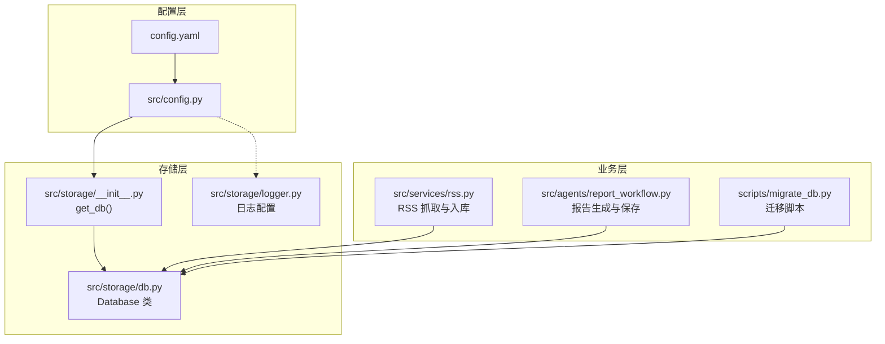
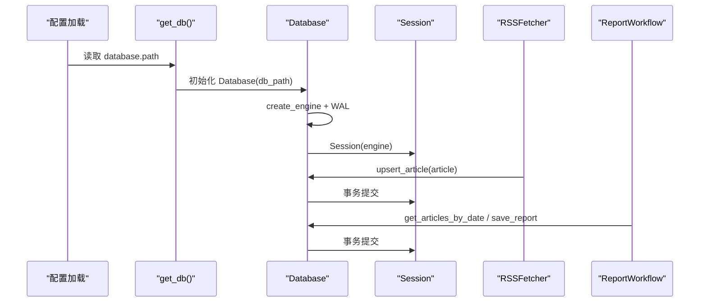
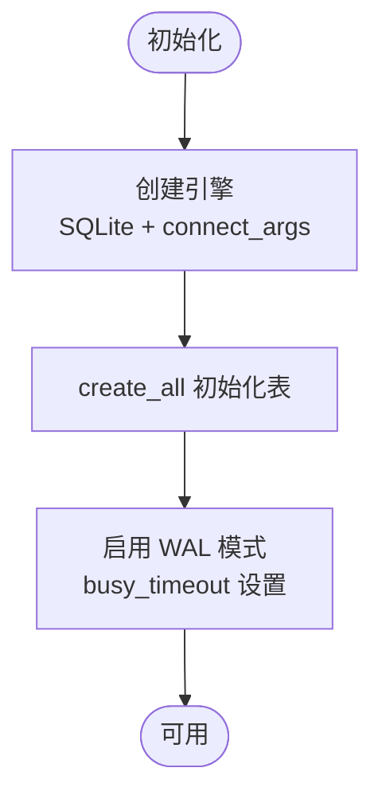
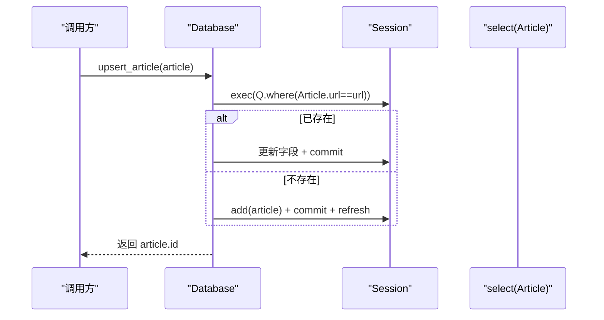
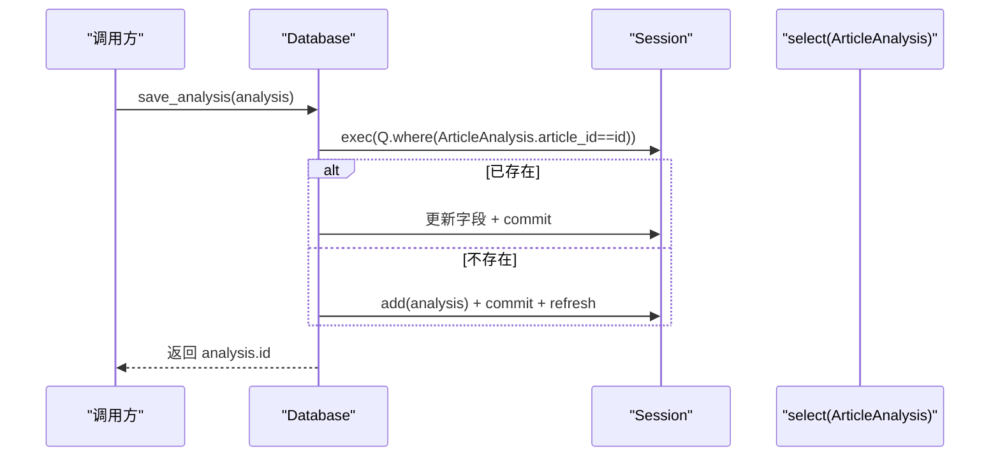
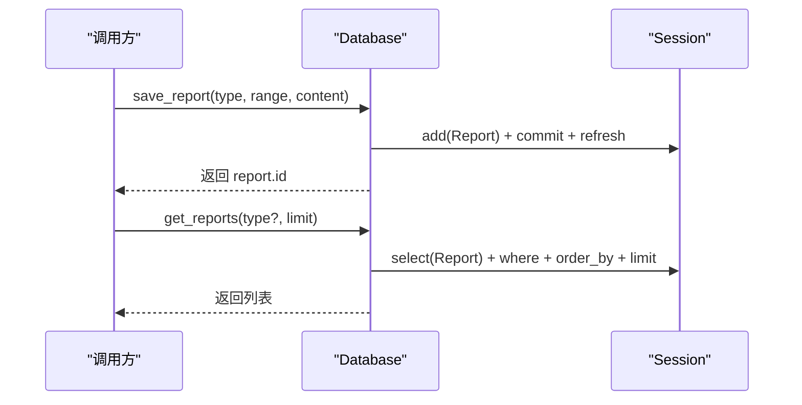
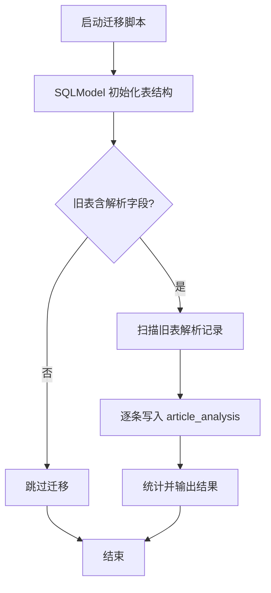
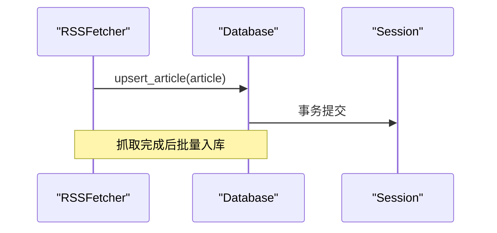
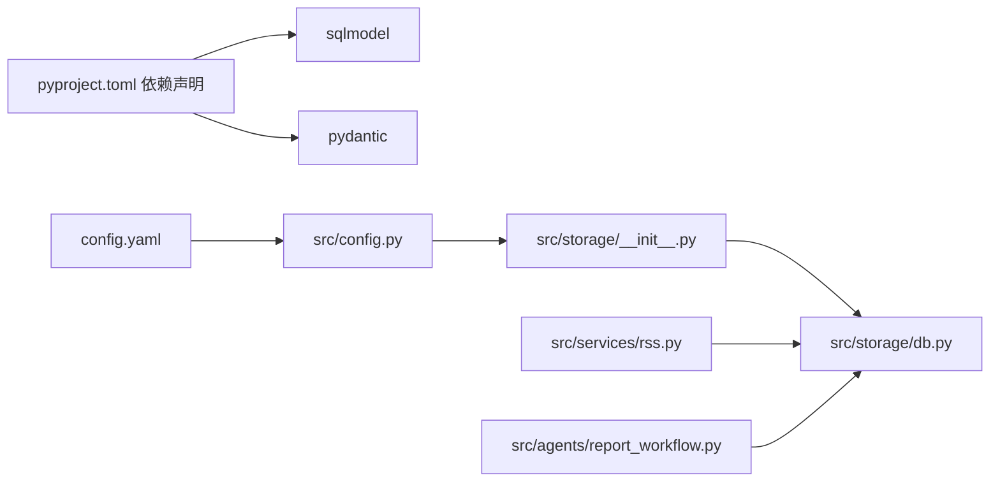

# 数据库接口

<cite>
**本文引用的文件**
- [src/storage/db.py](file://src/storage/db.py)
- [src/storage/__init__.py](file://src/storage/__init__.py)
- [scripts/migrate_db.py](file://scripts/migrate_db.py)
- [src/config.py](file://src/config.py)
- [config.yaml](file://config.yaml)
- [src/services/rss.py](file://src/services/rss.py)
- [src/agents/report_workflow.py](file://src/agents/report_workflow.py)
- [src/storage/logger.py](file://src/storage/logger.py)
- [pyproject.toml](file://pyproject.toml)
</cite>

## 目录
1. [简介](#简介)
2. [项目结构](#项目结构)
3. [核心组件](#核心组件)
4. [架构总览](#架构总览)
5. [详细组件分析](#详细组件分析)
6. [依赖分析](#依赖分析)
7. [性能考量](#性能考量)
8. [故障排查指南](#故障排查指南)
9. [结论](#结论)
10. [附录](#附录)

## 简介
本文件面向数据库接口的 API 文档，聚焦 SQLModel ORM 的使用与最佳实践，覆盖以下方面：
- 数据模型定义：Article、ArticleAnalysis、FeedConfig、Report 的字段与关系映射
- 数据库连接与初始化：SQLite 引擎、WAL 模式、超时设置
- CRUD 操作：文章、解析结果、报告的增删改查与批量处理
- 迁移与版本演进：从旧表结构到新表结构的迁移脚本
- 事务与并发：基于 SQLModel Session 的事务模型与 SQLite 并发策略
- 查询优化与约束：唯一性约束、外键关系、子查询与联表查询
- 配置与连接池：通过配置文件集中管理数据库路径，结合 WAL 提升并发
- 日志与可观测性：日志配置与错误处理

## 项目结构
数据库相关能力集中在 storage 子模块，配合配置加载与迁移脚本，形成“配置 → 连接 → 模型 → 业务”的清晰分层。



**图表来源**
- [src/storage/db.py](file://src/storage/db.py#L65-L93)
- [src/storage/__init__.py](file://src/storage/__init__.py#L8-L13)
- [src/config.py](file://src/config.py#L65-L88)
- [config.yaml](file://config.yaml#L34-L35)
- [src/services/rss.py](file://src/services/rss.py#L18-L21)
- [src/agents/report_workflow.py](file://src/agents/report_workflow.py#L40-L43)
- [scripts/migrate_db.py](file://scripts/migrate_db.py#L15-L26)
- [src/storage/logger.py](file://src/storage/logger.py#L8-L38)

**章节来源**
- [src/storage/db.py](file://src/storage/db.py#L1-L251)
- [src/storage/__init__.py](file://src/storage/__init__.py#L1-L14)
- [src/config.py](file://src/config.py#L1-L109)
- [config.yaml](file://config.yaml#L1-L54)
- [src/services/rss.py](file://src/services/rss.py#L1-L123)
- [src/agents/report_workflow.py](file://src/agents/report_workflow.py#L1-L266)
- [scripts/migrate_db.py](file://scripts/migrate_db.py#L1-L91)
- [src/storage/logger.py](file://src/storage/logger.py#L1-L39)

## 核心组件
- 数据模型
  - Article：RSS 原文，主键自增，url 唯一；包含标题、摘要、正文、发布/抓取时间、标签等
  - ArticleAnalysis：文章解析结果，一对一关联 Article（article_id 唯一且外键），包含 LLM 摘要、关键词、分类、情感、解析时间
  - FeedConfig：RSS 源配置，url 唯一
  - Report：报告，包含类型、日期范围、内容与创建时间
- 数据库管理
  - Database：封装引擎创建、表初始化、WAL 启用、Session 获取与 CRUD 方法
- 连接与配置
  - get_db：从配置文件加载数据库路径并返回 Database 单例
  - 配置文件 config.yaml 与 src/config.py：集中管理数据库路径

**章节来源**
- [src/storage/db.py](file://src/storage/db.py#L14-L61)
- [src/storage/db.py](file://src/storage/db.py#L65-L93)
- [src/storage/__init__.py](file://src/storage/__init__.py#L8-L13)
- [src/config.py](file://src/config.py#L43-L45)
- [config.yaml](file://config.yaml#L34-L35)

## 架构总览
下图展示从配置到数据库访问的整体流程，以及 RSS 抓取与报告生成如何复用数据库接口。



**图表来源**
- [src/storage/__init__.py](file://src/storage/__init__.py#L8-L13)
- [src/storage/db.py](file://src/storage/db.py#L68-L93)
- [src/services/rss.py](file://src/services/rss.py#L56-L60)
- [src/agents/report_workflow.py](file://src/agents/report_workflow.py#L170-L177)

## 详细组件分析

### 数据模型与关系映射
- Article
  - 主键：id
  - 唯一键：url
  - 时间字段：published_at、fetched_at
  - 标签：逗号分隔字符串
- ArticleAnalysis
  - 主键：id
  - 唯一键：article_id（外键指向 articles.id）
  - 结果字段：summary_llm、keywords、category、sentiment、parsed_at
- FeedConfig
  - 主键：id
  - 唯一键：url
- Report
  - 主键：id
  - 字段：report_type、date_range、content、created_at

```mermaid
erDiagram
ARTICLES {
int id PK
string url UK
string title
datetime published_at
datetime fetched_at
string tags
}
ARTICLE_ANALYSIS {
int id PK
int article_id UK FK
string summary_llm
string keywords
string category
string sentiment
string parsed_at
}
FEED_CONFIGS {
int id PK
string url UK
string name
string last_fetched
}
REPORTS {
int id PK
string report_type
string date_range
string content
string created_at
}
ARTICLES ||--|| ARTICLE_ANALYSIS : "一对一解析"
```

**图表来源**
- [src/storage/db.py](file://src/storage/db.py#L14-L61)

**章节来源**
- [src/storage/db.py](file://src/storage/db.py#L14-L61)

### 数据库连接与初始化
- 引擎创建
  - SQLite 路径：由配置提供
  - 连接参数：禁用 echo，设置超时与线程检查关闭
- 初始化表
  - 通过 SQLModel.metadata.create_all 创建所有表
- 启用 WAL
  - PRAGMA journal_mode=WAL
  - PRAGMA busy_timeout=30000，缓解锁等待
- Session 管理
  - 每次操作使用独立 Session，确保事务隔离



**图表来源**
- [src/storage/db.py](file://src/storage/db.py#L68-L93)

**章节来源**
- [src/storage/db.py](file://src/storage/db.py#L68-L93)
- [src/storage/__init__.py](file://src/storage/__init__.py#L8-L13)
- [src/config.py](file://src/config.py#L43-L45)
- [config.yaml](file://config.yaml#L34-L35)

### CRUD 操作 API

#### Article 相关
- upsert_article(article)
  - 按 url 查找，存在则更新字段并提交；否则插入并返回 id
- get_article_by_id(id)
  - 按主键获取
- get_articles(start_date, end_date, limit)
  - 支持日期范围过滤、倒序、限制数量
- get_articles_by_date(start, end?)
  - 字符串日期格式 YYYY-MM-DD 的便捷查询
- get_unparsed_articles(limit)
  - 子查询排除已在 article_analysis 中存在的文章



**图表来源**
- [src/storage/db.py](file://src/storage/db.py#L97-L122)

**章节来源**
- [src/storage/db.py](file://src/storage/db.py#L97-L165)

#### ArticleAnalysis 相关
- save_analysis(analysis)
  - 按 article_id 查找，存在则更新，否则插入
- get_analysis_by_article_id(article_id)
- get_parsed_articles(limit)
  - 联表查询返回文章与解析结果元组
- clear_all_analysis()
  - 清空解析表用于重跑



**图表来源**
- [src/storage/db.py](file://src/storage/db.py#L169-L191)

**章节来源**
- [src/storage/db.py](file://src/storage/db.py#L169-L223)

#### Report 相关
- save_report(report_type, date_range, content)
  - 自动填充 created_at，返回 id
- get_reports(report_type?, limit)
  - 可选按类型过滤、倒序、限制数量



**图表来源**
- [src/storage/db.py](file://src/storage/db.py#L227-L250)

**章节来源**
- [src/storage/db.py](file://src/storage/db.py#L225-L250)

### 迁移与版本演进
- 迁移步骤
  - 使用 SQLModel 先创建新表结构（article_analysis 等）
  - 检查旧表是否包含解析相关字段
  - 将符合条件的旧记录迁移到新表
  - 统计并输出迁移结果
- 适用场景
  - 新增解析结果表、拆分字段、规范化数据结构



**图表来源**
- [scripts/migrate_db.py](file://scripts/migrate_db.py#L15-L86)

**章节来源**
- [scripts/migrate_db.py](file://scripts/migrate_db.py#L1-L91)

### 事务处理与并发控制
- 事务模型
  - 每个方法内部使用 with Session(...) 管理事务，确保原子性
- 并发策略
  - WAL 模式提升并发读写能力
  - busy_timeout 增加锁等待时间，降低超时概率
- 注意事项
  - SQLite 在高并发写入场景仍有限制，建议结合业务节奏控制写入频率

**章节来源**
- [src/storage/db.py](file://src/storage/db.py#L68-L93)
- [src/storage/db.py](file://src/storage/db.py#L97-L122)
- [src/storage/db.py](file://src/storage/db.py#L169-L191)
- [src/storage/db.py](file://src/storage/db.py#L227-L250)

### 查询优化与约束
- 唯一性约束
  - Article.url、ArticleAnalysis.article_id、FeedConfig.url
- 外键关系
  - ArticleAnalysis.article_id → articles.id
- 子查询与联表
  - 未解析文章查询使用子查询排除已解析 ID
  - 已解析文章查询使用 join 返回双实体元组
- 日期范围与排序
  - 支持按 published_at 倒序与 limit 控制

**章节来源**
- [src/storage/db.py](file://src/storage/db.py#L14-L61)
- [src/storage/db.py](file://src/storage/db.py#L153-L165)
- [src/storage/db.py](file://src/storage/db.py#L206-L214)

### 数据验证与约束实现
- Pydantic 配置模型
  - DatabaseConfig.path 作为数据库路径来源
  - 配置加载时支持环境变量替换
- SQLModel 约束
  - Field(unique=True) 实现唯一性
  - Field(foreign_key="..") 实现外键
- 业务层约束
  - RSS 抓取时对摘要/正文长度截断，避免过大数据
  - 报告保存时自动填充 created_at

**章节来源**
- [src/config.py](file://src/config.py#L43-L45)
- [src/config.py](file://src/config.py#L74-L108)
- [src/storage/db.py](file://src/storage/db.py#L14-L61)
- [src/services/rss.py](file://src/services/rss.py#L89-L98)
- [src/storage/db.py](file://src/storage/db.py#L230-L235)

### 使用示例与集成点
- RSS 抓取入库
  - RSSFetcher 在解析后逐条调用 upsert_article 写入数据库
- 报告生成与保存
  - ReportWorkflow 从数据库获取已解析文章，生成内容后调用 save_report 保存



**图表来源**
- [src/services/rss.py](file://src/services/rss.py#L56-L60)
- [src/storage/db.py](file://src/storage/db.py#L97-L122)

**章节来源**
- [src/services/rss.py](file://src/services/rss.py#L18-L60)
- [src/agents/report_workflow.py](file://src/agents/report_workflow.py#L170-L177)

## 依赖分析
- 外部依赖
  - SQLModel 0.0.31，基于 SQLAlchemy
  - Pydantic 用于配置校验
- 内部依赖
  - config.yaml → src/config.py → storage/__init__.py → storage/db.py
  - RSS 与 Report 工作流均通过 get_db() 获取 Database 单例



**图表来源**
- [pyproject.toml](file://pyproject.toml#L26-L28)
- [src/config.py](file://src/config.py#L65-L88)
- [src/storage/__init__.py](file://src/storage/__init__.py#L8-L13)
- [src/storage/db.py](file://src/storage/db.py#L65-L93)
- [src/services/rss.py](file://src/services/rss.py#L10-L12)
- [src/agents/report_workflow.py](file://src/agents/report_workflow.py#L19-L22)

**章节来源**
- [pyproject.toml](file://pyproject.toml#L1-L49)
- [src/config.py](file://src/config.py#L65-L88)
- [src/storage/__init__.py](file://src/storage/__init__.py#L1-L14)
- [src/storage/db.py](file://src/storage/db.py#L1-L251)
- [src/services/rss.py](file://src/services/rss.py#L1-L123)
- [src/agents/report_workflow.py](file://src/agents/report_workflow.py#L1-L266)

## 性能考量
- 连接与并发
  - 使用 WAL 模式与 busy_timeout，适合多读写场景
  - SQLite 仍不适用于极高并发写入，建议控制写入节奏
- 查询优化
  - 合理使用索引字段（如 published_at、url）以减少扫描
  - 子查询与联表查询注意数据量，必要时增加 limit
- 数据大小
  - 对长文本字段（摘要/正文）进行截断，避免单行过大影响性能
- 事务粒度
  - 将多次写入合并为单事务，减少提交次数

[本节为通用性能建议，无需特定文件引用]

## 故障排查指南
- 连接超时
  - 检查 busy_timeout 设置与数据库文件所在磁盘性能
  - 确认多进程/多线程访问时未同时占用数据库文件
- 唯一约束冲突
  - Article.url 唯一冲突：确认 URL 去重逻辑或清洗规则
  - ArticleAnalysis.article_id 唯一冲突：确认上游是否重复解析
- 迁移失败
  - 检查旧表字段是否存在
  - 确认迁移脚本运行前已初始化新表结构
- 日志定位
  - 使用日志模块配置文件路径、轮转与保留策略，便于问题回溯

**章节来源**
- [src/storage/db.py](file://src/storage/db.py#L84-L93)
- [src/storage/logger.py](file://src/storage/logger.py#L8-L38)
- [scripts/migrate_db.py](file://scripts/migrate_db.py#L15-L86)

## 结论
本数据库接口以 SQLModel 为核心，围绕 SQLite 提供了完整的模型定义、连接管理、CRUD 操作与迁移机制。通过 WAL 模式与合理的事务/查询策略，满足 RSS 数据采集与报告生成的日常需求。建议在生产环境中结合业务写入节奏与监控指标持续优化，并在需要更高并发时考虑切换到更合适的数据库引擎。

## 附录
- 配置项
  - database.path：数据库文件路径（相对/绝对均可）
- 常用操作路径
  - 获取数据库实例：src/storage/__init__.py::get_db()
  - 初始化与 WAL：src/storage/db.py::Database.__init__()
  - 文章入库：src/storage/db.py::upsert_article()
  - 报告保存：src/storage/db.py::save_report()

**章节来源**
- [config.yaml](file://config.yaml#L34-L35)
- [src/storage/__init__.py](file://src/storage/__init__.py#L8-L13)
- [src/storage/db.py](file://src/storage/db.py#L68-L93)
- [src/storage/db.py](file://src/storage/db.py#L97-L122)
- [src/storage/db.py](file://src/storage/db.py#L227-L250)