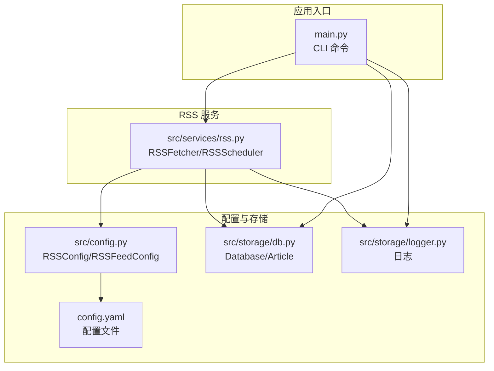
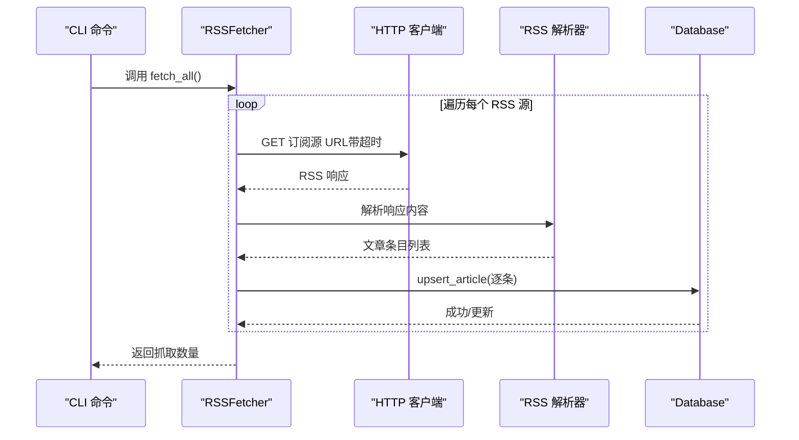
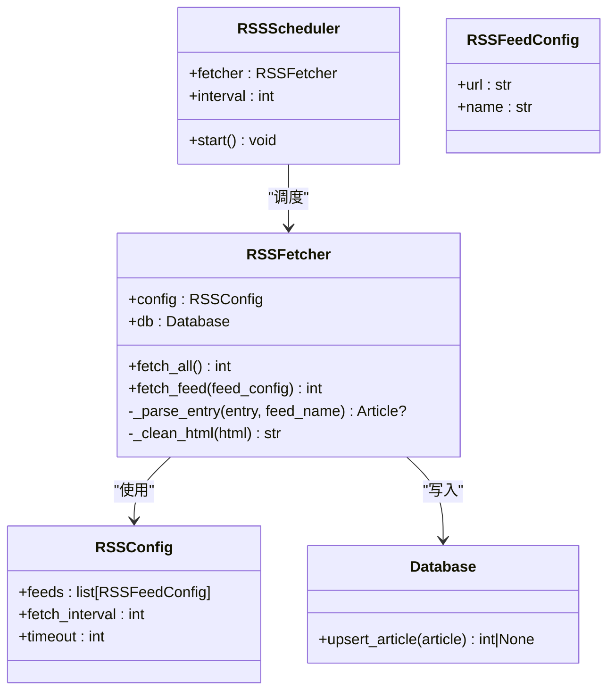

# 服务接口

<cite>
**本文引用的文件**
- [src/services/rss.py](file://src/services/rss.py)
- [src/config.py](file://src/config.py)
- [config.yaml](file://config.yaml)
- [main.py](file://main.py)
- [src/storage/db.py](file://src/storage/db.py)
- [src/storage/logger.py](file://src/storage/logger.py)
- [scripts/fetch_sample.py](file://scripts/fetch_sample.py)
- [README.md](file://README.md)
- [env.example](file://env.example)
</cite>

## 目录
1. [简介](#简介)
2. [项目结构](#项目结构)
3. [核心组件](#核心组件)
4. [架构总览](#架构总览)
5. [详细组件分析](#详细组件分析)
6. [依赖关系分析](#依赖关系分析)
7. [性能考量](#性能考量)
8. [故障排查指南](#故障排查指南)
9. [结论](#结论)
10. [附录](#附录)

## 简介
本文件面向 RSS 服务接口的 API 文档，聚焦于 RSS 抓取、解析与处理能力，涵盖订阅源管理、内容获取、数据入库与清理等流程；同时说明配置参数、超时设置、错误处理机制，并提供使用示例、异常恢复策略、性能监控与日志记录方法，以及部署与扩展最佳实践。

## 项目结构
RSS 服务位于 src/services/rss.py，配合配置加载、数据库与日志模块协同工作。CLI 入口 main.py 提供 rss fetch/parse/report 等命令，便于本地运行与集成。



图表来源
- [src/services/rss.py](file://src/services/rss.py#L1-L123)
- [src/config.py](file://src/config.py#L32-L41)
- [config.yaml](file://config.yaml#L24-L31)
- [main.py](file://main.py#L66-L82)
- [src/storage/db.py](file://src/storage/db.py#L65-L90)
- [src/storage/logger.py](file://src/storage/logger.py#L8-L39)

章节来源
- [src/services/rss.py](file://src/services/rss.py#L1-L123)
- [src/config.py](file://src/config.py#L32-L41)
- [config.yaml](file://config.yaml#L24-L31)
- [main.py](file://main.py#L66-L82)
- [src/storage/db.py](file://src/storage/db.py#L65-L90)
- [src/storage/logger.py](file://src/storage/logger.py#L8-L39)

## 核心组件
- RSS 抓取器：负责遍历配置的 RSS 源，抓取、解析、清洗并入库。
- 定时调度器：基于间隔循环触发抓取任务。
- 配置模型：定义 RSS 订阅源、抓取间隔与超时等参数。
- 数据库：提供文章 Upsert、查询与清理等能力。
- 日志：集中化日志输出与轮转。

章节来源
- [src/services/rss.py](file://src/services/rss.py#L15-L108)
- [src/services/rss.py](file://src/services/rss.py#L110-L123)
- [src/config.py](file://src/config.py#L32-L41)
- [src/storage/db.py](file://src/storage/db.py#L97-L123)
- [src/storage/logger.py](file://src/storage/logger.py#L8-L39)

## 架构总览
RSS 服务通过 CLI 命令触发，内部以 RSSFetcher 为核心，结合 RSSConfig、Database 与日志模块协作完成数据采集与入库；RSSScheduler 提供周期性抓取能力。



图表来源
- [src/services/rss.py](file://src/services/rss.py#L22-L60)
- [src/storage/db.py](file://src/storage/db.py#L97-L123)

章节来源
- [src/services/rss.py](file://src/services/rss.py#L22-L60)
- [src/storage/db.py](file://src/storage/db.py#L97-L123)

## 详细组件分析

### RSS 抓取器（RSSFetcher）
职责与行为
- 遍历 RSSConfig.feeds，逐个抓取订阅源。
- 使用 httpx 客户端发起请求，遵循重定向，超时由 RSSConfig.timeout 控制。
- 使用 feedparser 解析响应，若存在 bozo 异常则记录错误并跳过该源。
- 解析每个条目为 Article，清洗 HTML 摘要/内容，提取发布时间与标签，批量 upsert 到数据库。
- 返回本次抓取新增/更新的文章数量。

关键点
- 超时控制：通过 httpx.Client(timeout=...) 应用 RSSConfig.timeout。
- 错误处理：网络异常与解析异常均记录日志并继续下一个源。
- 数据清洗：摘要与内容最大长度截断，标签转为逗号分隔字符串。
- 去重与幂等：upsert_article 基于 URL 唯一键进行插入或更新。



图表来源
- [src/services/rss.py](file://src/services/rss.py#L15-L108)
- [src/services/rss.py](file://src/services/rss.py#L110-L123)
- [src/config.py](file://src/config.py#L32-L41)
- [src/storage/db.py](file://src/storage/db.py#L97-L123)

章节来源
- [src/services/rss.py](file://src/services/rss.py#L15-L108)
- [src/config.py](file://src/config.py#L32-L41)
- [src/storage/db.py](file://src/storage/db.py#L97-L123)

### 定时调度器（RSSScheduler）
职责与行为
- 以固定间隔循环调用 RSSFetcher.fetch_all()。
- 适用于本地守护进程场景，持续抓取最新内容。

注意
- 该实现为阻塞式循环，适合轻量部署或演示用途；生产建议使用更健壮的任务调度系统（如 Celery、APScheduler 或系统级定时任务）。

章节来源
- [src/services/rss.py](file://src/services/rss.py#L110-L123)

### 配置模型与配置文件
配置模型
- RSSConfig：包含订阅源列表、抓取间隔、超时。
- RSSFeedConfig：单个订阅源的 URL 与名称。

配置文件（config.yaml）
- rss.feeds：订阅源数组，每个元素包含 url 与 name。
- rss.fetch_interval：抓取间隔（秒）。
- rss.timeout：HTTP 请求超时（秒）。
- database.path：SQLite 数据库存储路径。
- logging.*：日志级别、文件路径、轮转大小与保留天数。

章节来源
- [src/config.py](file://src/config.py#L32-L41)
- [config.yaml](file://config.yaml#L24-L31)
- [config.yaml](file://config.yaml#L34-L47)

### 数据库与数据模型
数据模型
- Article：原始 RSS 文章，字段包含来源名、标题、URL、摘要、内容、发布时间、抓取时间、标签等。
- ArticleAnalysis：文章解析结果（可重跑），用于后续报告生成。
- FeedConfig：RSS 源配置（当前实现中未在 RSS 服务中直接使用，但存在于存储模块）。
- Report：报告实体。

数据库能力
- upsert_article：基于 URL 唯一键插入或更新。
- get_articles/get_articles_by_date：按时间范围查询文章。
- get_unparsed_articles：查询未解析文章集合。
- save_analysis/get_analysis_by_article_id：保存/查询解析结果。
- clear_all_analysis：清空解析结果，便于重跑。
- save_report/get_reports：保存/查询报告。

章节来源
- [src/storage/db.py](file://src/storage/db.py#L14-L61)
- [src/storage/db.py](file://src/storage/db.py#L97-L123)
- [src/storage/db.py](file://src/storage/db.py#L153-L166)
- [src/storage/db.py](file://src/storage/db.py#L169-L192)
- [src/storage/db.py](file://src/storage/db.py#L216-L224)
- [src/storage/db.py](file://src/storage/db.py#L227-L251)

### 日志与监控
日志
- 使用 loguru，支持文件轮转与保留策略，同时输出到控制台。
- CLI 中通过 setup_logger 初始化日志配置，支持旋转大小与保留天数。

监控建议
- 可在 RSSFetcher.fetch_all/fetch_feed 中增加计数器与耗时指标，结合日志输出形成基础监控。
- 建议引入 metrics 框架（如 Prometheus）与告警通道，实现异常阈值报警。

章节来源
- [src/storage/logger.py](file://src/storage/logger.py#L8-L39)
- [src/services/rss.py](file://src/services/rss.py#L22-L32)
- [config.yaml](file://config.yaml#L43-L47)

## 依赖关系分析
RSS 服务的依赖关系如下：

```mermaid
graph LR
RSS["RSSFetcher/RSSScheduler"] --> CFG["RSSConfig/RSSFeedConfig"]
RSS --> DB["Database/Article"]
RSS --> LOG["logger"]
MAIN["CLI main.py"] --> RSS
MAIN --> DB
MAIN --> LOG
CFG <-- YAML["config.yaml"] --> CFG
```

图表来源
- [src/services/rss.py](file://src/services/rss.py#L10-L12)
- [src/config.py](file://src/config.py#L32-L41)
- [config.yaml](file://config.yaml#L24-L31)
- [main.py](file://main.py#L66-L82)

章节来源
- [src/services/rss.py](file://src/services/rss.py#L10-L12)
- [src/config.py](file://src/config.py#L32-L41)
- [config.yaml](file://config.yaml#L24-L31)
- [main.py](file://main.py#L66-L82)

## 性能考量
- 网络与解析
  - 超时设置：RSSConfig.timeout 控制 HTTP 请求超时，避免阻塞。
  - 解析健壮性：遇到 bozo 异常会记录错误并跳过该源，保证整体稳定性。
- 数据库
  - WAL 模式与 busy_timeout 提升并发读写性能。
  - upsert_article 基于 URL 唯一键，避免重复写入。
- 批量入库
  - 逐条 upsert，可考虑批量写入以减少事务开销（当前实现为逐条提交）。
- 日志
  - 文件轮转与保留策略降低磁盘占用，建议结合监控指标观察吞吐与延迟。

章节来源
- [src/services/rss.py](file://src/services/rss.py#L37-L42)
- [src/storage/db.py](file://src/storage/db.py#L72-L90)
- [src/storage/db.py](file://src/storage/db.py#L97-L123)
- [config.yaml](file://config.yaml#L43-L47)

## 故障排查指南
常见问题与处理
- 网络请求失败
  - 现象：抓取日志出现请求失败错误。
  - 排查：检查 RSSConfig.timeout 是否过小、网络连通性、订阅源可达性。
  - 处理：适当增大 timeout，确认 URL 正确且允许重定向。
- RSS 解析失败
  - 现象：日志显示 bozo 异常。
  - 排查：确认订阅源返回格式是否符合标准。
  - 处理：跳过该源或调整解析策略（当前实现会记录错误并继续）。
- 数据库写入异常
  - 现象：upsert 失败或锁等待。
  - 排查：检查数据库路径权限、WAL 模式与 busy_timeout 设置。
  - 处理：确保数据库目录存在且可写，必要时重启服务。
- 日志未输出或过大
  - 现象：日志文件未生成或体积过大。
  - 排查：检查 logging.* 配置与磁盘空间。
  - 处理：调整 rotation 与 retention，确保日志目录存在。

章节来源
- [src/services/rss.py](file://src/services/rss.py#L37-L48)
- [src/storage/db.py](file://src/storage/db.py#L72-L90)
- [src/storage/logger.py](file://src/storage/logger.py#L8-L39)
- [config.yaml](file://config.yaml#L43-L47)

## 结论
RSS 服务提供了简洁可靠的订阅源抓取与入库能力，结合配置化参数、日志与数据库，满足日常内容采集与报告生成需求。建议在生产环境中引入更稳健的调度与监控体系，并根据流量与数据规模优化数据库与网络参数。

## 附录

### API 使用示例
- 抓取所有 RSS 源
  - CLI：rss fetch
  - 作用：遍历配置中的订阅源，抓取并入库。
- 解析未处理文章
  - CLI：rss parse [--limit N]
  - 作用：从数据库中获取未解析文章，调用 LLM 进行解析并保存结果。
- 生成日报/周报
  - CLI：rss report YYYY-MM-DD [--output] [--ppt] [--builder direct|marp]
  - 作用：生成指定日期的报告，并可选导出 PPT。
- 启动 Web 服务（占位）
  - CLI：rss serve [--host] [--port]
  - 说明：当前为占位命令，不提供 Web UI。

章节来源
- [main.py](file://main.py#L66-L82)
- [main.py](file://main.py#L84-L105)
- [main.py](file://main.py#L107-L141)
- [main.py](file://main.py#L208-L218)

### 配置参数说明
- RSS 订阅源
  - rss.feeds：数组，包含 url 与 name。
  - rss.fetch_interval：抓取间隔（秒）。
  - rss.timeout：HTTP 请求超时（秒）。
- 数据库
  - database.path：SQLite 数据库路径。
- 日志
  - logging.level：日志级别。
  - logging.file：日志文件路径。
  - logging.rotation：日志轮转大小。
  - logging.retention：日志保留天数。
- 环境变量
  - MINIMAX_API_KEY、MODELSCOPE_API_KEY 等（用于 LLM 配置，RSS 服务本身不直接使用）。

章节来源
- [config.yaml](file://config.yaml#L24-L31)
- [config.yaml](file://config.yaml#L34-L47)
- [env.example](file://env.example#L5-L6)

### 定时任务与异常恢复
- 定时任务
  - RSSScheduler.start() 提供阻塞式循环，按 interval 抓取。
  - 建议在生产中使用 systemd/cron 或任务调度平台替代。
- 异常恢复
  - 单个订阅源失败不影响其他源；可通过重新运行 rss fetch 恢复。
  - 若需重跑解析，可使用 rss parse 限制条数并观察结果。
  - 清理解析结果：调用数据库清理接口（clear_all_analysis）后重跑解析。

章节来源
- [src/services/rss.py](file://src/services/rss.py#L117-L122)
- [src/storage/db.py](file://src/storage/db.py#L216-L224)

### 部署与扩展最佳实践
- 部署
  - 使用 uv 管理依赖与运行。
  - 将 RSSScheduler 放置于守护进程或容器中，结合系统定时任务。
  - 确保 data/sqlite、data/logs、data/chroma 目录存在且可写。
- 扩展
  - 增加订阅源：在 config.yaml 的 rss.feeds 中追加。
  - 调整抓取频率：修改 rss.fetch_interval。
  - 调整超时：修改 rss.timeout。
  - 监控与告警：接入日志轮转与指标系统，设置异常阈值。
  - 数据库优化：根据吞吐量调整 WAL 与 busy_timeout，必要时迁移至更高性能数据库。

章节来源
- [README.md](file://README.md#L17-L85)
- [config.yaml](file://config.yaml#L24-L31)
- [config.yaml](file://config.yaml#L34-L47)
- [src/storage/db.py](file://src/storage/db.py#L72-L90)