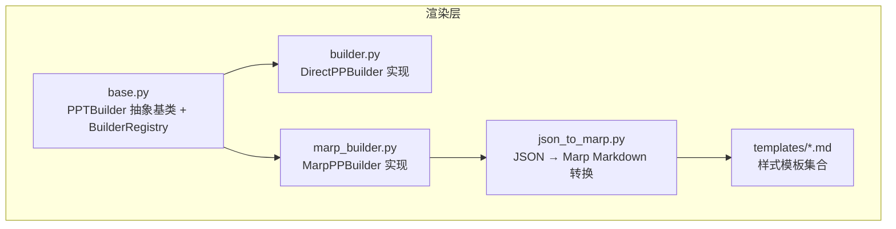
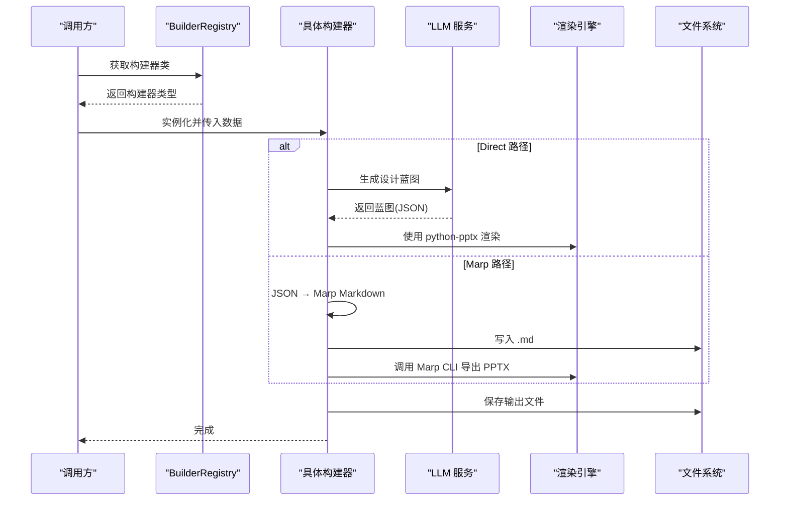
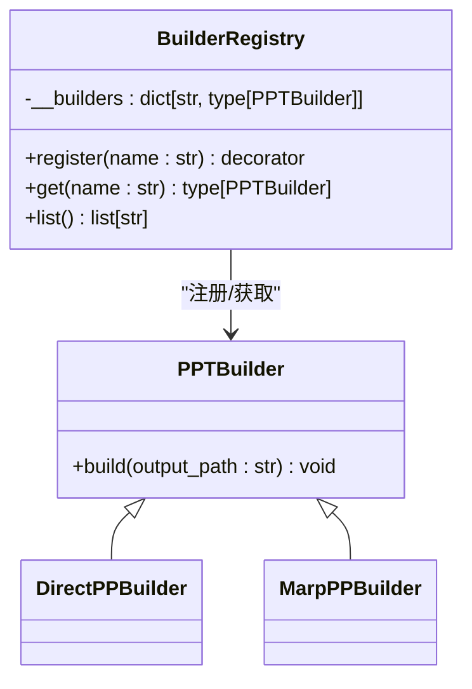
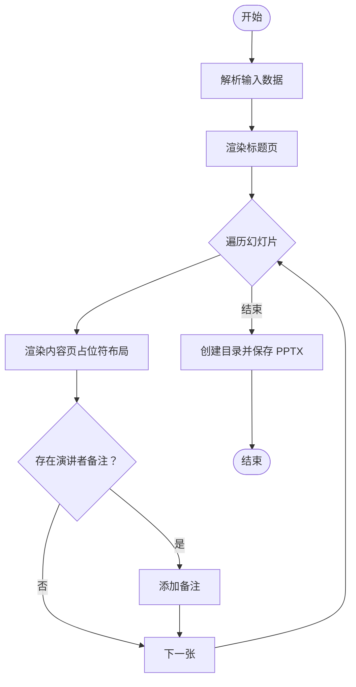
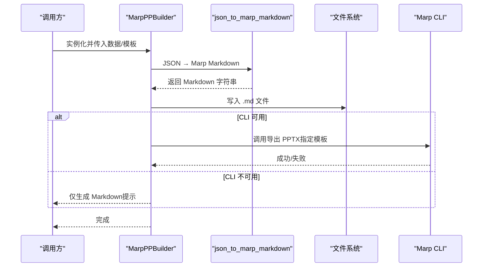
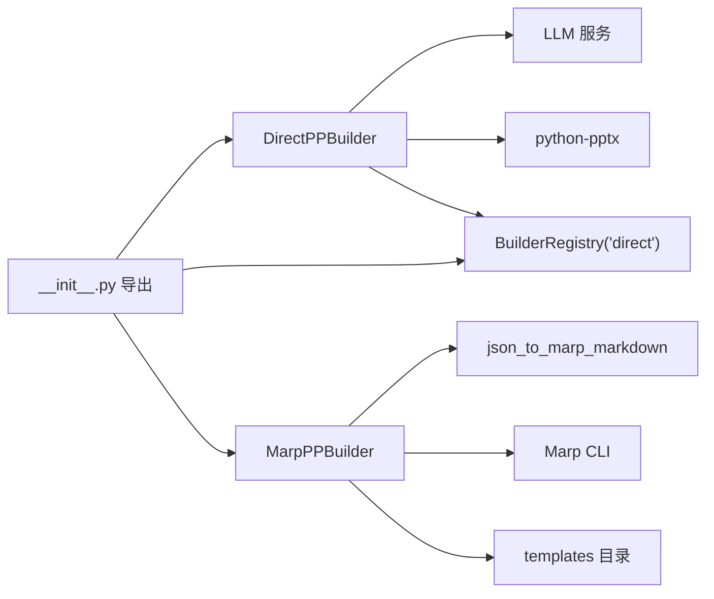

# 渲染接口

<cite>
**本文引用的文件**
- [src/render/ppt/base.py](file://src/render/ppt/base.py)
- [src/render/ppt/builder.py](file://src/render/ppt/builder.py)
- [src/render/ppt/marp_builder.py](file://src/render/ppt/marp_builder.py)
- [src/render/ppt/json_to_marp.py](file://src/render/ppt/json_to_marp.py)
- [src/render/ppt/__init__.py](file://src/render/ppt/__init__.py)
- [src/render/ppt/templates/default.md](file://src/render/ppt/templates/default.md)
- [src/render/ppt/templates/corporate.md](file://src/render/ppt/templates/corporate.md)
- [src/render/ppt/templates/dark.md](file://src/render/ppt/templates/dark.md)
- [src/render/ppt/templates/gradient.md](file://src/render/ppt/templates/gradient.md)
- [src/render/ppt/templates/minimal.md](file://src/render/ppt/templates/minimal.md)
- [scripts/test_templates.py](file://scripts/test_templates.py)
- [README.md](file://README.md)
</cite>

## 目录
1. [简介](#简介)
2. [项目结构](#项目结构)
3. [核心组件](#核心组件)
4. [架构总览](#架构总览)
5. [详细组件分析](#详细组件分析)
6. [依赖关系分析](#依赖关系分析)
7. [性能与内存优化](#性能与内存优化)
8. [故障排查指南](#故障排查指南)
9. [结论](#结论)
10. [附录](#附录)

## 简介
本文件面向 PPT 渲染接口的 API 文档，聚焦于 PPTBuilder 抽象基类与两种渲染器实现：DirectPPTBuilder（基于 LLM 的直接渲染）与 MarpPPTBuilder（JSON → Marp Markdown → PPT）。文档覆盖接口定义、实现差异、使用场景、模板系统、多格式输出与文件保存机制，并提供性能优化与内存管理最佳实践。

## 项目结构
渲染层位于 src/render/ppt，包含抽象基类、两个具体构建器、JSON 到 Marp 的转换器以及一组可复用的样式模板。

图表来源
- [src/render/ppt/base.py](file://src/render/ppt/base.py#L7-L41)
- [src/render/ppt/builder.py](file://src/render/ppt/builder.py#L22-L194)
- [src/render/ppt/marp_builder.py](file://src/render/ppt/marp_builder.py#L21-L94)
- [src/render/ppt/json_to_marp.py](file://src/render/ppt/json_to_marp.py#L39-L110)
- [src/render/ppt/templates/default.md](file://src/render/ppt/templates/default.md#L1-L36)

章节来源
- [src/render/ppt/__init__.py](file://src/render/ppt/__init__.py#L1-L20)
- [README.md](file://README.md#L129-L142)

## 核心组件
- PPTBuilder 抽象基类：定义统一的构建接口 build。
- BuilderRegistry 注册表：提供构建器的注册、获取与枚举能力。
- DirectPPBuilder：通过 LLM 生成设计蓝图，直接使用 python-pptx 渲染。
- MarpPPBuilder：将 JSON 数据转换为 Marp Markdown，再由 Marp CLI 导出为 PPT。
- json_to_marp_markdown：负责将结构化数据转为带模板样式的 Marp Markdown。
- 模板系统：内置五种样式模板，支持主题色切换与页面分类。

章节来源
- [src/render/ppt/base.py](file://src/render/ppt/base.py#L7-L41)
- [src/render/ppt/builder.py](file://src/render/ppt/builder.py#L22-L194)
- [src/render/ppt/marp_builder.py](file://src/render/ppt/marp_builder.py#L21-L94)
- [src/render/ppt/json_to_marp.py](file://src/render/ppt/json_to_marp.py#L39-L110)

## 架构总览
渲染流程分为两条路径：
- 直接渲染路径：数据 → LLM 设计蓝图 → python-pptx 渲染 → PPTX 文件。
- Marp 路径：数据 → JSON → Marp Markdown → 模板样式注入 → Marp CLI 渲染 → PPTX 文件。

图表来源
- [src/render/ppt/base.py](file://src/render/ppt/base.py#L31-L41)
- [src/render/ppt/builder.py](file://src/render/ppt/builder.py#L75-L151)
- [src/render/ppt/marp_builder.py](file://src/render/ppt/marp_builder.py#L59-L94)
- [src/render/ppt/json_to_marp.py](file://src/render/ppt/json_to_marp.py#L39-L110)

## 详细组件分析

### PPTBuilder 抽象基类与注册机制
- PPTBuilder：定义统一的 build 接口，用于接收输出路径并生成最终文件。
- BuilderRegistry：提供装饰器注册、按名获取、枚举可用构建器的能力；若名称不存在则抛出错误。

图表来源
- [src/render/ppt/base.py](file://src/render/ppt/base.py#L7-L41)

章节来源
- [src/render/ppt/base.py](file://src/render/ppt/base.py#L7-L41)

### DirectPPBuilder（直接渲染）
- 角色定位：适合需要直接控制 PPT 内容与布局的场景，无需外部 CLI。
- 关键特性：
  - 使用 LLM 生成“设计蓝图”（包含标题、正文元素、图片位置等），然后直接渲染。
  - 固定布局：标题页与内容页使用 Presentation 内置布局。
  - 支持为每页添加演讲者备注（notes slide）。
  - 自动创建输出目录并保存 PPTX。
- 输入数据结构：包含标题与幻灯片数组，每张幻灯片包含标题、关键信息、要点列表与演讲者备注。
- 输出：PPTX 文件。

图表来源
- [src/render/ppt/builder.py](file://src/render/ppt/builder.py#L128-L151)
- [src/render/ppt/builder.py](file://src/render/ppt/builder.py#L161-L184)

章节来源
- [src/render/ppt/builder.py](file://src/render/ppt/builder.py#L22-L194)

### MarpPPBuilder（Marp Markdown 渲染）
- 角色定位：适合需要丰富样式与主题切换的场景，依赖 Marp CLI。
- 关键特性：
  - 将 JSON 数据转换为 Marp Markdown，并注入模板样式。
  - 支持选择模板（default/minimal/corporate/gradient/dark）。
  - 自动查找 Marp CLI，若未安装则仅生成 Markdown 文件。
  - 通过命令行调用 Marp CLI 导出 PPTX。
- 输入数据结构：与 DirectPPBuilder 相同。
- 输出：PPTX 文件（若安装 Marp CLI）或仅生成 Markdown 文件。

图表来源
- [src/render/ppt/marp_builder.py](file://src/render/ppt/marp_builder.py#L59-L94)
- [src/render/ppt/json_to_marp.py](file://src/render/ppt/json_to_marp.py#L39-L110)

章节来源
- [src/render/ppt/marp_builder.py](file://src/render/ppt/marp_builder.py#L21-L94)
- [src/render/ppt/json_to_marp.py](file://src/render/ppt/json_to_marp.py#L39-L110)

### 模板系统与自定义模板
- 模板文件：位于 templates 目录，包含 default、minimal、corporate、gradient、dark 五种风格。
- 注入机制：json_to_marp_markdown 读取模板文件中的 <style> 部分并注入到生成的 Markdown 中。
- 页面分类：封面、内容页（偶数页应用暗色主题）、结尾页。
- 自定义模板步骤：
  1. 在 templates 目录新增 .md 文件，包含 <style> 样式块。
  2. 在构造 MarpPPBuilder 时指定 template 参数为新模板名。
  3. 重新运行构建流程以验证效果。

章节来源
- [src/render/ppt/json_to_marp.py](file://src/render/ppt/json_to_marp.py#L26-L36)
- [src/render/ppt/json_to_marp.py](file://src/render/ppt/json_to_marp.py#L39-L110)
- [src/render/ppt/templates/default.md](file://src/render/ppt/templates/default.md#L1-L36)
- [src/render/ppt/templates/corporate.md](file://src/render/ppt/templates/corporate.md#L1-L35)
- [src/render/ppt/templates/dark.md](file://src/render/ppt/templates/dark.md#L1-L37)
- [src/render/ppt/templates/gradient.md](file://src/render/ppt/templates/gradient.md#L1-L35)
- [src/render/ppt/templates/minimal.md](file://src/render/ppt/templates/minimal.md#L1-L35)

### 多格式输出与文件保存机制
- DirectPPBuilder：直接保存 PPTX 文件，自动创建输出目录。
- MarpPPBuilder：
  - 若 Marp CLI 可用：先生成 .md，再导出 PPTX。
  - 若不可用：仅生成 .md 文件并记录警告。
- 调试与验证：示例脚本会打印生成的 Markdown 前若干行，并检查输出文件大小与存在性。

章节来源
- [src/render/ppt/builder.py](file://src/render/ppt/builder.py#L149-L151)
- [src/render/ppt/marp_builder.py](file://src/render/ppt/marp_builder.py#L61-L72)
- [scripts/test_templates.py](file://scripts/test_templates.py#L72-L98)

## 依赖关系分析
- DirectPPBuilder 依赖：
  - LLM 服务（通过 get_llm 获取）。
  - python-pptx（Presentation、Inches、Pt 等）。
  - BuilderRegistry（注册名为 "direct"）。
- MarpPPBuilder 依赖：
  - json_to_marp_markdown。
  - 子进程调用 Marp CLI。
  - 模板目录（TEMPLATES_DIR）。
- 模块导出：__init__.py 暴露 PPTBuilder、BuilderRegistry、DirectPPBuilder、MarpPPBuilder、json_to_marp_markdown。

图表来源
- [src/render/ppt/builder.py](file://src/render/ppt/builder.py#L16-L17)
- [src/render/ppt/marp_builder.py](file://src/render/ppt/marp_builder.py#L11-L12)
- [src/render/ppt/__init__.py](file://src/render/ppt/__init__.py#L8-L19)

章节来源
- [src/render/ppt/__init__.py](file://src/render/ppt/__init__.py#L8-L19)

## 性能与内存优化
- LLM 调用频率控制：DirectPPBuilder 在渲染每张幻灯片前会请求一次蓝图，建议在上层聚合数据或缓存结果以减少重复调用。
- Marp 渲染成本：Marp 路径涉及子进程调用与磁盘 IO，建议批量生成时合并多次调用，避免频繁启动 CLI。
- 模板样式注入：json_to_marp_markdown 会在每次构建时读取模板文件，建议在应用生命周期内缓存模板样式字符串，减少重复 IO。
- 文件保存策略：DirectPPBuilder 已自动创建父目录，MarpPPBuilder 会先写入 .md 再导出 PPTX，注意磁盘空间与权限。
- 内存管理：避免一次性加载大量图片或超大 JSON；必要时分批处理或延迟加载。

## 故障排查指南
- Marp CLI 未安装：
  - 现象：仅生成 Markdown，无 PPTX。
  - 处理：安装 Marp CLI 后重试；或改用 DirectPPBuilder。
- 模板名称无效：
  - 现象：BuilderRegistry.get 抛出错误。
  - 处理：确认模板名存在于注册表或 templates 目录。
- LLM 返回非 JSON：
  - 现象：DirectPPBuilder 记录 JSON 解析失败并回退。
  - 处理：检查提示词与 LLM provider 配置。
- 输出路径权限不足：
  - 现象：保存失败。
  - 处理：确保输出目录存在且有写权限。

章节来源
- [src/render/ppt/marp_builder.py](file://src/render/ppt/marp_builder.py#L37-L39)
- [src/render/ppt/base.py](file://src/render/ppt/base.py#L32-L36)
- [src/render/ppt/builder.py](file://src/render/ppt/builder.py#L79-L83)
- [scripts/test_templates.py](file://scripts/test_templates.py#L94-L98)

## 结论
- DirectPPBuilder 适合需要直接控制布局与快速生成的场景，依赖 LLM 生成设计蓝图。
- MarpPPBuilder 适合需要丰富样式与主题切换的场景，依赖 Marp CLI，支持多模板与页面分类。
- 两者均通过 BuilderRegistry 注册与获取，便于扩展新的渲染器实现。
- 建议根据团队对样式与工具链的要求选择合适路径，并结合性能与内存优化策略提升稳定性与效率。

## 附录

### API 定义与使用要点
- PPTBuilder.build(output_path: str)：统一构建入口，输出文件由具体实现决定。
- BuilderRegistry.register(name: str)：装饰器注册构建器类型。
- BuilderRegistry.get(name: str)：按名称获取构建器类型。
- BuilderRegistry.list()：返回可用构建器名称列表。

章节来源
- [src/render/ppt/base.py](file://src/render/ppt/base.py#L10-L41)

### 使用示例（路径指引）
- 直接渲染（DirectPPBuilder）：
  - 示例脚本展示了如何实例化并构建 PPTX，包含数据结构与输出路径。
  - 参考路径：[scripts/test_templates.py](file://scripts/test_templates.py#L64-L84)
- Marp 渲染（MarpPPBuilder）：
  - 示例脚本展示了如何选择模板并构建 PPTX，同时生成 Markdown 以便预览。
  - 参考路径：[scripts/test_templates.py](file://scripts/test_templates.py#L64-L84)
- 模板系统：
  - 通过指定 template 参数选择内置模板（default/minimal/corporate/gradient/dark）。
  - 参考路径：[src/render/ppt/marp_builder.py](file://src/render/ppt/marp_builder.py#L29-L35)

### 模板开发指南
- 新增模板：在 templates 目录新增 .md 文件，包含 <style> 样式块。
- 应用模板：在构造 MarpPPBuilder 时传入 template 参数。
- 页面分类：封面、内容页（偶数页暗色主题）、结尾页。
- 参考路径：
  - [src/render/ppt/json_to_marp.py](file://src/render/ppt/json_to_marp.py#L39-L110)
  - [src/render/ppt/templates/default.md](file://src/render/ppt/templates/default.md#L1-L36)