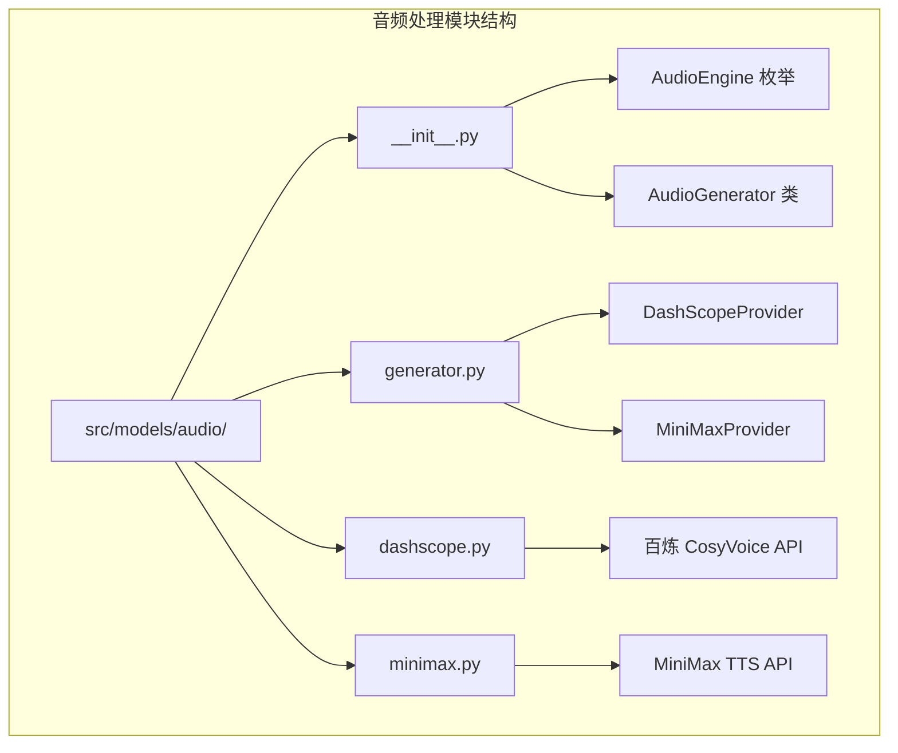
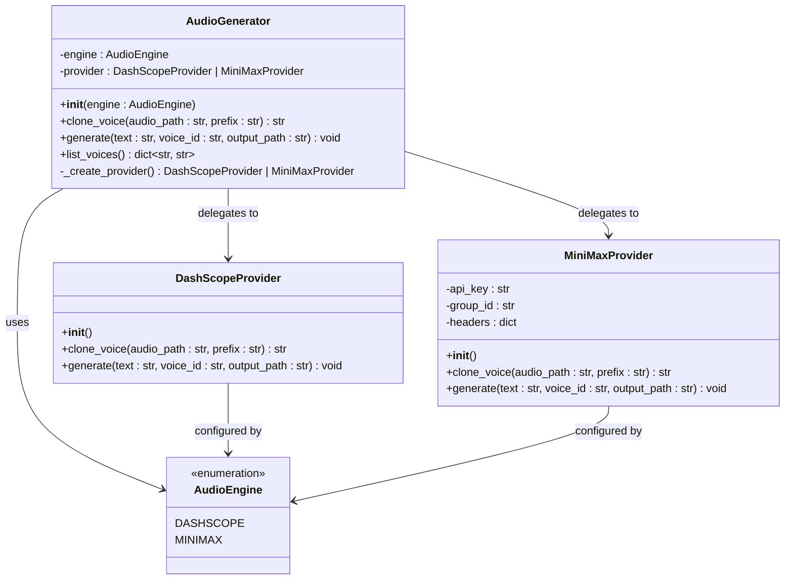
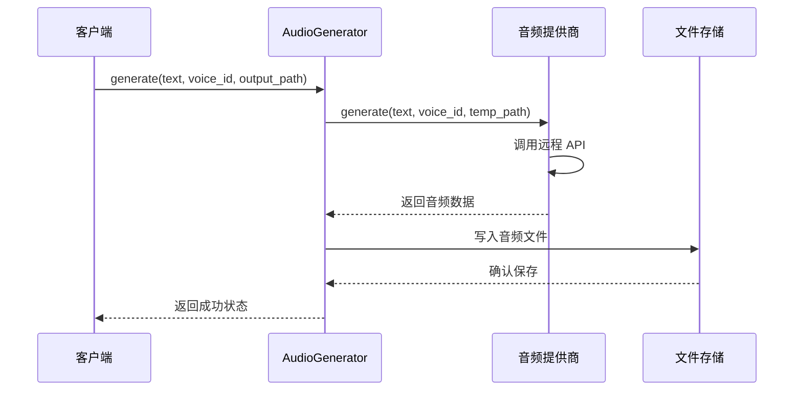
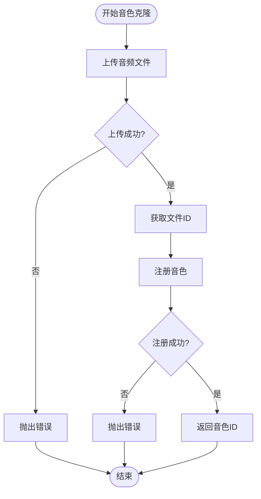
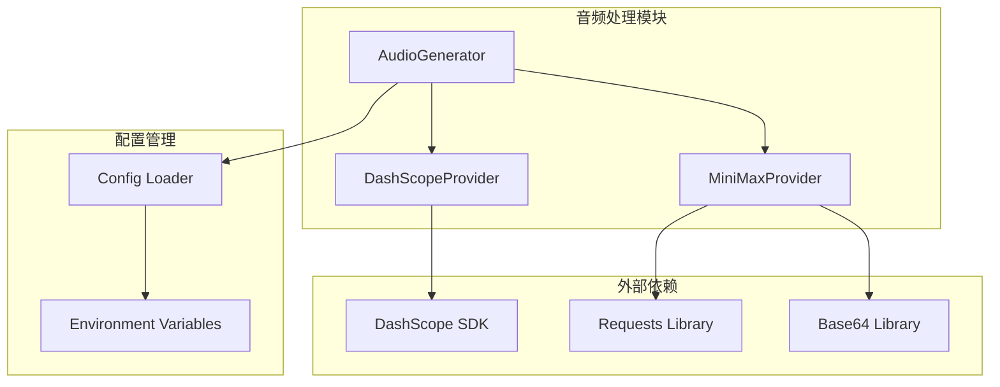

# 音频处理接口

<cite>
**本文档引用的文件**
- [src/models/audio/generator.py](file://src/models/audio/generator.py)
- [src/models/audio/dashscope.py](file://src/models/audio/dashscope.py)
- [src/models/audio/minimax.py](file://src/models/audio/minimax.py)
- [src/models/audio/__init__.py](file://src/models/audio/__init__.py)
- [src/config.py](file://src/config.py)
- [config.yaml](file://config.yaml)
- [README.md](file://README.md)
</cite>

## 目录
1. [简介](#简介)
2. [项目结构](#项目结构)
3. [核心组件](#核心组件)
4. [架构概览](#架构概览)
5. [详细组件分析](#详细组件分析)
6. [依赖关系分析](#依赖关系分析)
7. [性能考虑](#性能考虑)
8. [故障排除指南](#故障排除指南)
9. [结论](#结论)

## 简介

音频处理接口是一个基于 Python 的统一音频生成系统，支持多种音频提供商的集成。该系统提供了语音合成、音色克隆和音频文件管理功能，采用模块化的架构设计，支持百炼 CosyVoice 和 MiniMax 两种音频引擎。

系统的主要特点包括：
- 统一的音频生成接口，支持多种音频提供商
- 音色克隆功能，允许用户注册自定义音色
- 标准化的音频文件输出格式
- 环境变量配置管理
- 错误处理和异常管理

## 项目结构

音频处理模块位于 `src/models/audio/` 目录下，采用清晰的分层架构：

**图表来源**
- [src/models/audio/generator.py](file://src/models/audio/generator.py#L1-L43)
- [src/models/audio/dashscope.py](file://src/models/audio/dashscope.py#L1-L55)
- [src/models/audio/minimax.py](file://src/models/audio/minimax.py#L1-L100)

**章节来源**
- [src/models/audio/generator.py](file://src/models/audio/generator.py#L1-L43)
- [src/models/audio/dashscope.py](file://src/models/audio/dashscope.py#L1-L55)
- [src/models/audio/minimax.py](file://src/models/audio/minimax.py#L1-L100)

## 核心组件

音频处理系统由以下核心组件构成：

### AudioEngine 枚举
定义了支持的音频引擎类型：
- `DASHSCOPE`: 百炼 CosyVoice 引擎
- `MINIMAX`: MiniMax TTS 引擎

### AudioGenerator 统一生成器
提供统一的音频生成接口，内部委托给具体的音频提供商实现。

### 音频提供商
- **DashScopeProvider**: 基于百炼平台的 CosyVoice 语音合成服务
- **MiniMaxProvider**: 基于 MiniMax 平台的 TTS 服务

**章节来源**
- [src/models/audio/generator.py](file://src/models/audio/generator.py#L10-L43)

## 架构概览

系统采用工厂模式和策略模式相结合的设计：

**图表来源**
- [src/models/audio/generator.py](file://src/models/audio/generator.py#L15-L43)
- [src/models/audio/dashscope.py](file://src/models/audio/dashscope.py#L22-L55)
- [src/models/audio/minimax.py](file://src/models/audio/minimax.py#L20-L100)

## 详细组件分析

### AudioGenerator 统一生成器

AudioGenerator 是整个音频处理系统的核心控制器，负责协调不同音频提供商的服务。

#### 主要功能
- **音色克隆**: 支持注册用户提供的音频样本，生成自定义音色
- **音频生成**: 将文本转换为音频文件
- **音色管理**: 提供可用音色列表查询功能

#### 接口定义

**图表来源**
- [src/models/audio/generator.py](file://src/models/audio/generator.py#L36-L38)
- [src/models/audio/dashscope.py](file://src/models/audio/dashscope.py#L42-L55)
- [src/models/audio/minimax.py](file://src/models/audio/minimax.py#L66-L100)

**章节来源**
- [src/models/audio/generator.py](file://src/models/audio/generator.py#L15-L43)

### DashScopeProvider 百炼 CosyVoice 集成

DashScopeProvider 实现了对百炼平台 CosyVoice 服务的集成。

#### 预置音色配置
系统支持以下预置音色：
- 龙小淳 - 温柔女声
- 龙老铁 - 东北老铁  
- 龙叔 - 成熟男声
- 龙小夏 - 活泼女声
- 龙小白 - 知性女声
- 龙小晨 - 阳光男声
- Stella - 知性女声(英文)

#### 音频生成参数
- **模型**: `cosyvoice-v1`
- **采样率**: 22050 Hz
- **声道**: 单声道
- **比特率**: 256 kbps
- **格式**: MP3

**章节来源**
- [src/models/audio/dashscope.py](file://src/models/audio/dashscope.py#L11-L19)
- [src/models/audio/dashscope.py](file://src/models/audio/dashscope.py#L44-L48)

### MiniMaxProvider MiniMax 集成

MiniMaxProvider 实现了对 MiniMax 平台 TTS 服务的集成。

#### 预置音色配置
- Shaun - 磁性男声
- Annie - 知性女声
- Buster - 浑厚男声
- Crystal - 清亮女声

#### 音频生成参数
- **模型**: `speech-01-turbo`
- **默认音色**: male-shaun
- **支持的音色**: 预置音色或自定义音色

#### API 端点
- **音色克隆**: `/files/upload` 和 `/voice_clone`
- **音频生成**: `/t2a_v2`

**章节来源**
- [src/models/audio/minimax.py](file://src/models/audio/minimax.py#L12-L17)
- [src/models/audio/minimax.py](file://src/models/audio/minimax.py#L72-L76)

### 音色克隆流程

音色克隆功能允许用户通过提供音频样本创建自定义音色：

**图表来源**
- [src/models/audio/minimax.py](file://src/models/audio/minimax.py#L33-L64)
- [src/models/audio/dashscope.py](file://src/models/audio/dashscope.py#L31-L40)

**章节来源**
- [src/models/audio/minimax.py](file://src/models/audio/minimax.py#L33-L64)
- [src/models/audio/dashscope.py](file://src/models/audio/dashscope.py#L31-L40)

## 依赖关系分析

音频处理系统与其他模块的依赖关系如下：

**图表来源**
- [src/models/audio/generator.py](file://src/models/audio/generator.py#L6-L7)
- [src/models/audio/dashscope.py](file://src/models/audio/dashscope.py#L7-L8)
- [src/models/audio/minimax.py](file://src/models/audio/minimax.py#L7-L8)

### 外部依赖

系统依赖以下外部库：
- **dashscope**: 百炼平台 SDK
- **requests**: HTTP 请求库
- **python-dotenv**: 环境变量加载
- **pydantic**: 配置验证

**章节来源**
- [src/models/audio/dashscope.py](file://src/models/audio/dashscope.py#L7-L8)
- [src/models/audio/minimax.py](file://src/models/audio/minimax.py#L7-L8)
- [src/config.py](file://src/config.py#L10-L11)

## 性能考虑

### 并发处理
- 系统采用单线程同步调用，适合中小规模音频生成需求
- 对于高并发场景，建议在应用层实现队列管理和限流控制

### 缓存策略
- 音频文件生成后直接写入磁盘，无内置缓存机制
- 建议在应用层实现音频文件缓存和重复利用

### 错误恢复
- 网络请求包含超时和重试机制
- API 调用失败时提供详细的错误信息

## 故障排除指南

### 常见问题及解决方案

#### 环境变量配置错误
**问题**: 启动时抛出 API Key 缺失错误
**解决方案**: 
1. 检查 `.env` 文件中的 API Key 配置
2. 确保环境变量正确加载
3. 验证 API Key 的有效性

#### 音频生成失败
**问题**: 音频合成过程中出现 RuntimeError
**可能原因**:
- 网络连接问题
- API Key 权限不足
- 输入文本格式不正确
- 音色 ID 不存在

**解决步骤**:
1. 检查网络连接状态
2. 验证 API Key 权限
3. 确认音色列表的有效性
4. 查看详细的错误日志

#### 音色克隆失败
**问题**: 音色注册过程中出现错误
**可能原因**:
- 音频文件格式不支持
- 音频文件过大
- 服务器响应异常

**解决步骤**:
1. 确认音频文件格式符合要求
2. 检查音频文件大小限制
3. 重新尝试音色克隆过程

**章节来源**
- [src/models/audio/dashscope.py](file://src/models/audio/dashscope.py#L25-L29)
- [src/models/audio/minimax.py](file://src/models/audio/minimax.py#L23-L27)

## 结论

音频处理接口提供了一个完整、可扩展的音频生成解决方案，具有以下优势：

### 技术优势
- **统一接口**: 通过 AudioGenerator 提供一致的 API 接口
- **多提供商支持**: 支持百炼和 MiniMax 两大音频平台
- **模块化设计**: 清晰的职责分离和可扩展的架构
- **错误处理**: 完善的异常处理和错误信息反馈

### 应用场景
- 语音合成服务
- 个性化音色生成
- 多媒体内容制作
- AI 辅助教学应用

### 扩展建议
- 添加更多音频提供商支持
- 实现批量音频处理功能
- 集成音频质量评估算法
- 添加音频格式转换能力

该系统为构建多媒体应用提供了坚实的基础，开发者可以根据具体需求进行定制和扩展。