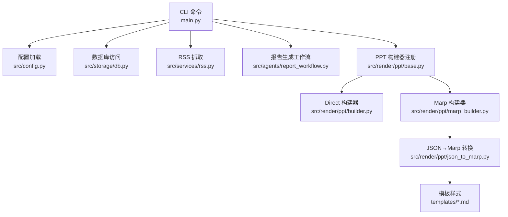
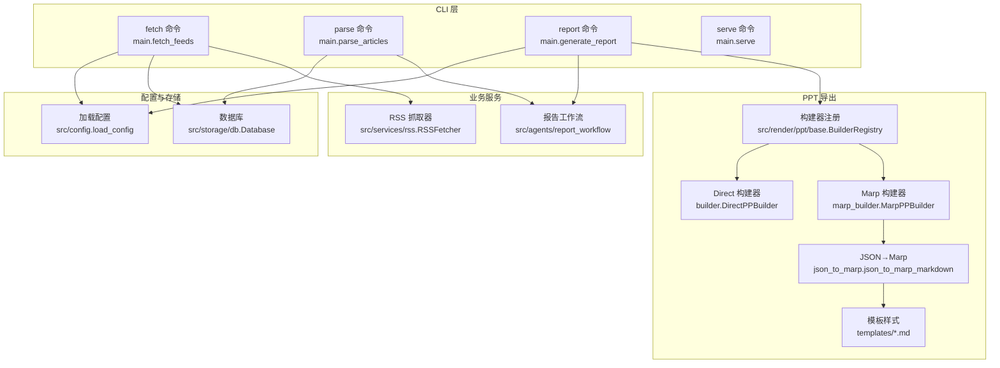
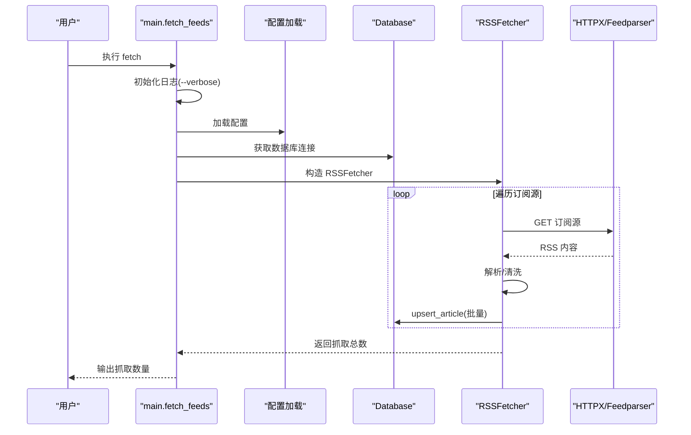
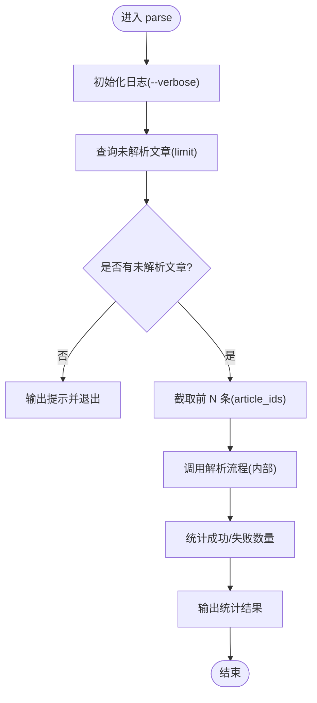
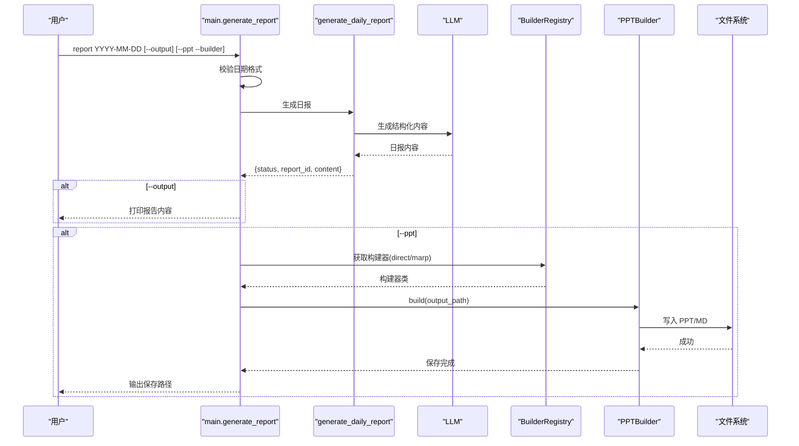
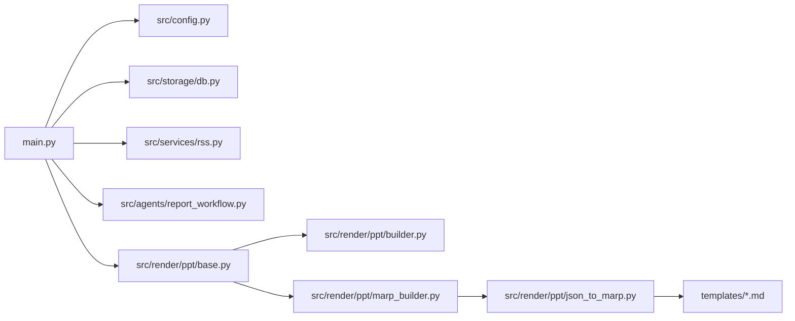

# CLI 命令参考

<cite>
**本文档引用的文件**
- [main.py](file://main.py)
- [README.md](file://README.md)
- [pyproject.toml](file://pyproject.toml)
- [config.yaml](file://config.yaml)
- [src/config.py](file://src/config.py)
- [src/storage/db.py](file://src/storage/db.py)
- [src/services/rss.py](file://src/services/rss.py)
- [src/agents/report_workflow.py](file://src/agents/report_workflow.py)
- [src/render/ppt/base.py](file://src/render/ppt/base.py)
- [src/render/ppt/builder.py](file://src/render/ppt/builder.py)
- [src/render/ppt/marp_builder.py](file://src/render/ppt/marp_builder.py)
- [src/render/ppt/json_to_marp.py](file://src/render/ppt/json_to_marp.py)
- [src/render/ppt/templates/default.md](file://src/render/ppt/templates/default.md)
- [src/render/ppt/templates/corporate.md](file://src/render/ppt/templates/corporate.md)
- [src/render/ppt/templates/dark.md](file://src/render/ppt/templates/dark.md)
</cite>

## 目录
1. [简介](#简介)
2. [项目结构](#项目结构)
3. [核心组件](#核心组件)
4. [架构总览](#架构总览)
5. [详细组件分析](#详细组件分析)
6. [依赖关系分析](#依赖关系分析)
7. [性能考量](#性能考量)
8. [故障排查指南](#故障排查指南)
9. [结论](#结论)
10. [附录](#附录)

## 简介
Brief Agent CLI 是一个基于 Typer 的命令行工具，用于 RSS 内容采集、智能解析与日报/周报生成，并可选导出为 PPT。核心命令包括：
- fetch：抓取 RSS 订阅源并入库
- parse：批量调用 LLM 解析未处理文章
- report：按日期生成日报，支持输出到控制台与生成 PPT
- serve：占位的 Web 服务入口（当前未实现）

该工具通过配置文件与环境变量驱动，支持多种 LLM 提供商与 RSS 源配置，具备日志记录与错误处理能力。

## 项目结构
- CLI 入口位于 main.py，使用 Typer 定义子命令与参数
- 配置由 config.yaml 提供，通过 src/config.py 进行类型化加载与环境变量替换
- 数据持久化使用 SQLite（SQLModel），表结构见 src/storage/db.py
- RSS 抓取与解析逻辑位于 src/services/rss.py 与 src/agents/report_workflow.py
- PPT 导出支持两种构建器：Direct（直接渲染）与 Marp（Markdown 渲染），位于 src/render/ppt/

图表来源
- [main.py](file://main.py#L220-L227)
- [src/config.py](file://src/config.py#L74-L88)
- [src/storage/db.py](file://src/storage/db.py#L65-L94)
- [src/services/rss.py](file://src/services/rss.py#L15-L32)
- [src/agents/report_workflow.py](file://src/agents/report_workflow.py#L186-L201)
- [src/render/ppt/base.py](file://src/render/ppt/base.py#L16-L41)
- [src/render/ppt/builder.py](file://src/render/ppt/builder.py#L22-L24)
- [src/render/ppt/marp_builder.py](file://src/render/ppt/marp_builder.py#L21-L23)
- [src/render/ppt/json_to_marp.py](file://src/render/ppt/json_to_marp.py#L39-L110)

章节来源
- [main.py](file://main.py#L1-L227)
- [README.md](file://README.md#L87-L148)

## 核心组件
- CLI 应用与命令
  - 应用名与帮助信息由 Typer 定义
  - 子命令：fetch、parse、report、serve
- 配置系统
  - YAML 配置文件 + 环境变量替换
  - 类型化配置模型，便于强约束与 IDE 支持
- 数据层
  - SQLite + SQLModel，支持 WAL 模式与超时设置
  - 文章、解析结果、报告三类核心表
- RSS 抓取
  - feedparser 解析，BeautifulSoup 清洗，HTTPX 请求
  - 支持超时与 Bozo 异常处理
- 报告生成工作流
  - LangGraph 状态机：收集→组织→生成→保存
  - LLM 生成结构化日报，清洗<think>标签
- PPT 导出
  - Direct：LLM 生成设计蓝图，python-pptx 直接渲染
  - Marp：JSON→Marp Markdown→PPT（依赖 marp CLI）

章节来源
- [main.py](file://main.py#L22-L26)
- [src/config.py](file://src/config.py#L65-L72)
- [src/storage/db.py](file://src/storage/db.py#L65-L90)
- [src/services/rss.py](file://src/services/rss.py#L15-L32)
- [src/agents/report_workflow.py](file://src/agents/report_workflow.py#L186-L201)
- [src/render/ppt/builder.py](file://src/render/ppt/builder.py#L22-L24)
- [src/render/ppt/marp_builder.py](file://src/render/ppt/marp_builder.py#L21-L23)

## 架构总览
下图展示了 CLI 命令与内部模块的交互关系，以及 PPT 导出的两条路径。

图表来源
- [main.py](file://main.py#L66-L82)
- [main.py](file://main.py#L84-L105)
- [main.py](file://main.py#L107-L141)
- [main.py](file://main.py#L208-L217)
- [src/config.py](file://src/config.py#L74-L88)
- [src/storage/db.py](file://src/storage/db.py#L65-L94)
- [src/services/rss.py](file://src/services/rss.py#L15-L32)
- [src/agents/report_workflow.py](file://src/agents/report_workflow.py#L186-L201)
- [src/render/ppt/base.py](file://src/render/ppt/base.py#L16-L41)
- [src/render/ppt/builder.py](file://src/render/ppt/builder.py#L22-L24)
- [src/render/ppt/marp_builder.py](file://src/render/ppt/marp_builder.py#L21-L23)
- [src/render/ppt/json_to_marp.py](file://src/render/ppt/json_to_marp.py#L39-L110)

## 详细组件分析

### fetch 命令
- 作用：抓取配置中的 RSS 订阅源，去重入库
- 参数与选项
  - 参数
    - feed_name（可选）：指定订阅源名称；不传则抓取全部
  - 选项
    - --verbose/-v：开启详细日志
- 执行流程
  1) 初始化日志（根据 --verbose 或配置）
  2) 加载配置与数据库连接
  3) 构造 RSSFetcher，遍历订阅源抓取
  4) 将解析后的文章通过 upsert 写入数据库
  5) 输出抓取数量
- 错误处理
  - HTTP 请求异常、RSS 解析异常均记录错误并跳过该源
- 性能与最佳实践
  - 合理设置 RSS 超时与抓取间隔
  - 大量订阅源时建议分批或按需指定 feed_name
- 使用示例
  - 抓取全部：uv run python main.py fetch
  - 指定源：uv run python main.py fetch "少数派"

章节来源
- [main.py](file://main.py#L66-L82)
- [src/services/rss.py](file://src/services/rss.py#L22-L32)
- [src/services/rss.py](file://src/services/rss.py#L34-L60)
- [src/storage/db.py](file://src/storage/db.py#L97-L122)

#### fetch 命令序列图

图表来源
- [main.py](file://main.py#L66-L82)
- [src/services/rss.py](file://src/services/rss.py#L22-L60)
- [src/storage/db.py](file://src/storage/db.py#L97-L122)

### parse 命令
- 作用：批量调用 LLM 解析未处理文章，生成摘要、关键词、分类等
- 参数与选项
  - --limit/-l：最大解析数量（默认 50）
  - --verbose/-v：开启详细日志
- 执行流程
  1) 初始化日志
  2) 获取未解析文章列表（按发布时间倒序）
  3) 截取前 N 条（受 --limit 限制）
  4) 调用解析流程（内部函数，不暴露为 CLI）
  5) 统计成功/失败数量并输出
- 错误处理
  - 若无未解析文章，直接提示并退出
  - 解析失败计入失败计数
- 性能与最佳实践
  - 合理设置 --limit，避免一次性解析过多导致 LLM 调用成本过高
  - 结合 fetch 与 parse 的节奏，保证数据及时可用
- 使用示例
  - 解析最多 100 条：uv run python main.py parse --limit 100
  - 仅看日志：uv run python main.py parse --verbose

章节来源
- [main.py](file://main.py#L84-L105)
- [src/storage/db.py](file://src/storage/db.py#L153-L165)

#### parse 命令流程图

图表来源
- [main.py](file://main.py#L84-L105)
- [src/storage/db.py](file://src/storage/db.py#L153-L165)

### report 命令
- 作用：按指定日期生成日报，可选择打印到控制台与生成 PPT
- 参数与选项
  - 参数
    - date（必需，YYYY-MM-DD）：报告日期
  - 选项
    - --output/-o：打印报告内容到 stdout
    - --ppt/-p：生成 PPT 文件
    - --builder/-b：PPT 构建器（direct 或 marp，默认 direct）
    - --verbose/-v：开启详细日志
- 执行流程
  1) 初始化日志
  2) 校验日期格式
  3) 调用 generate_daily_report(date)
  4) 若成功：
     - 输出报告 ID
     - 若 --output：打印报告正文
     - 若 --ppt：调用 PPT 生成流程
  5) 若失败：输出错误并退出码 1
- PPT 生成流程
  1) LLM 将日报内容结构化为幻灯片 JSON（降级：标题拆分）
  2) 选择构建器（direct 或 marp）
  3) direct：直接渲染 PPT（python-pptx）
  4) marp：JSON→Marp Markdown→PPT（依赖 marp CLI）
- 错误处理
  - 日期格式错误：提示并退出
  - LLM 返回非 JSON：降级为简单结构化
  - marp CLI 未安装：记录警告并保存 Markdown
- 性能与最佳实践
  - 使用 --builder marp 且已安装 marp CLI，可获得更丰富的模板样式
  - 生成 PPT 前先确保 parse 已完成，以获得更高质量的摘要
- 使用示例
  - 生成并打印：uv run python main.py report 2026-01-11 --output
  - 生成并导出 PPT（direct）：uv run python main.py report 2026-01-11 --ppt
  - 生成并导出 PPT（marp + 模板）：uv run python main.py report 2026-01-11 --ppt --builder marp

章节来源
- [main.py](file://main.py#L107-L141)
- [main.py](file://main.py#L143-L188)
- [src/agents/report_workflow.py](file://src/agents/report_workflow.py#L217-L237)
- [src/render/ppt/base.py](file://src/render/ppt/base.py#L32-L36)
- [src/render/ppt/builder.py](file://src/render/ppt/builder.py#L128-L151)
- [src/render/ppt/marp_builder.py](file://src/render/ppt/marp_builder.py#L59-L94)
- [src/render/ppt/json_to_marp.py](file://src/render/ppt/json_to_marp.py#L39-L110)

#### report 命令序列图

图表来源
- [main.py](file://main.py#L107-L141)
- [src/agents/report_workflow.py](file://src/agents/report_workflow.py#L217-L237)
- [src/render/ppt/base.py](file://src/render/ppt/base.py#L32-L36)
- [src/render/ppt/builder.py](file://src/render/ppt/builder.py#L128-L151)
- [src/render/ppt/marp_builder.py](file://src/render/ppt/marp_builder.py#L59-L94)

### serve 命令
- 作用：占位的 Web 服务入口（当前未实现）
- 参数与选项
  - --host：绑定主机（默认 0.0.0.0）
  - --port：绑定端口（默认 8000）
  - --verbose/-v：开启详细日志
- 当前行为：输出启动信息并退出（退出码 1）
- 使用示例
  - uv run python main.py serve --host 0.0.0.0 --port 8000

章节来源
- [main.py](file://main.py#L208-L217)

## 依赖关系分析
- CLI 与配置
  - main.py 通过 load_config 读取 config.yaml，并在日志初始化时使用
- CLI 与存储
  - fetch/parse/report 均依赖 get_db 获取数据库连接
  - db.py 提供 upsert_article、get_unparsed_articles、save_report 等接口
- CLI 与业务
  - fetch → RSSFetcher → feedparser/BeautifulSoup/HTTPX
  - report → generate_daily_report → LangGraph 工作流
- CLI 与 PPT
  - BuilderRegistry 统一管理构建器，direct/marp 两种实现
  - marp 路径依赖 marp CLI 与模板样式文件

图表来源
- [main.py](file://main.py#L14-L21)
- [src/config.py](file://src/config.py#L74-L88)
- [src/storage/db.py](file://src/storage/db.py#L65-L94)
- [src/services/rss.py](file://src/services/rss.py#L15-L32)
- [src/agents/report_workflow.py](file://src/agents/report_workflow.py#L186-L201)
- [src/render/ppt/base.py](file://src/render/ppt/base.py#L16-L41)
- [src/render/ppt/builder.py](file://src/render/ppt/builder.py#L22-L24)
- [src/render/ppt/marp_builder.py](file://src/render/ppt/marp_builder.py#L21-L23)
- [src/render/ppt/json_to_marp.py](file://src/render/ppt/json_to_marp.py#L39-L110)

章节来源
- [pyproject.toml](file://pyproject.toml#L31-L32)
- [main.py](file://main.py#L14-L21)

## 性能考量
- 数据库
  - 启用 WAL 模式与 busy_timeout，提升并发读写稳定性
  - upsert_article 采用“存在即更新”的策略，减少重复写入
- RSS 抓取
  - 设置合理超时，避免阻塞
  - 失败订阅源不影响其他源的抓取
- 报告生成
  - LangGraph 工作流按节点顺序执行，避免不必要的重复计算
  - LLM 输出清洗，移除<think>标签，减少后续处理负担
- PPT 导出
  - direct：python-pptx 直接渲染，无需外部 CLI，但样式较固定
  - marp：依赖 marp CLI，可使用丰富模板样式，但需额外安装与等待渲染

[本节为通用指导，不直接分析具体文件]

## 故障排查指南
- 日期格式错误
  - 现象：report 命令提示日期格式无效并退出
  - 处理：确保使用 YYYY-MM-DD 格式
- LLM 返回格式错误
  - 现象：PPT 结构化阶段 JSON 解析失败
  - 处理：触发降级方案，按标题拆分生成幻灯片
- marp CLI 未安装
  - 现象：Marp 构建器仅保存 Markdown，无 PPT 输出
  - 处理：安装 marp CLI 或改用 direct 构建器
- HTTP 请求失败
  - 现象：RSS 抓取记录错误日志
  - 处理：检查网络、订阅源 URL 与超时设置
- 无未解析文章
  - 现象：parse 命令提示无未解析文章
  - 处理：先执行 fetch 与 parse，确保有可解析数据

章节来源
- [main.py](file://main.py#L118-L123)
- [main.py](file://main.py#L155-L161)
- [src/render/ppt/marp_builder.py](file://src/render/ppt/marp_builder.py#L37-L57)
- [src/services/rss.py](file://src/services/rss.py#L40-L48)
- [main.py](file://main.py#L94-L96)

## 结论
Brief Agent CLI 提供了从 RSS 采集、智能解析到报告生成与 PPT 导出的一体化命令行体验。通过清晰的命令划分、类型化配置与模块化设计，用户可以灵活地在不同阶段组合使用命令，并根据需求选择合适的 PPT 导出方式。建议在生产环境中结合定时任务与日志监控，持续优化 LLM 与数据库性能。

[本节为总结性内容，不直接分析具体文件]

## 附录

### 命令与参数速查
- fetch
  - 参数：feed_name（可选）
  - 选项：--verbose/-v
  - 示例：uv run python main.py fetch
- parse
  - 选项：--limit/-l（默认 50）、--verbose/-v
  - 示例：uv run python main.py parse --limit 100
- report
  - 参数：date（必需，YYYY-MM-DD）
  - 选项：--output/-o、--ppt/-p、--builder/-b（direct|marp）、--verbose/-v
  - 示例：uv run python main.py report 2026-01-11 --ppt --builder marp
- serve
  - 选项：--host、--port、--verbose/-v
  - 示例：uv run python main.py serve --host 0.0.0.0 --port 8000

章节来源
- [main.py](file://main.py#L66-L82)
- [main.py](file://main.py#L84-L105)
- [main.py](file://main.py#L107-L141)
- [main.py](file://main.py#L208-L217)

### 配置与环境
- 配置文件位置与关键字段
  - llm.providers：支持 minimax、modelscope、deepseek
  - rss.feeds：订阅源列表
  - database.path：SQLite 路径
  - logging.*：日志级别、轮转大小与保留天数
- 环境变量
  - 通过 ${ENV_VAR} 形式在配置中引用
- 安装与运行
  - 使用 uv 同步依赖并运行 CLI

章节来源
- [config.yaml](file://config.yaml#L1-L54)
- [src/config.py](file://src/config.py#L74-L88)
- [README.md](file://README.md#L17-L85)
- [pyproject.toml](file://pyproject.toml#L31-L32)

### PPT 构建器与模板
- 构建器
  - direct：基于 LLM 的设计蓝图，python-pptx 直接渲染
  - marp：JSON→Marp Markdown→PPT，支持模板样式
- 模板样式
  - default、corporate、dark 等内置模板
  - 模板通过 <style> 注入，支持主题切换

章节来源
- [src/render/ppt/base.py](file://src/render/ppt/base.py#L16-L41)
- [src/render/ppt/builder.py](file://src/render/ppt/builder.py#L22-L24)
- [src/render/ppt/marp_builder.py](file://src/render/ppt/marp_builder.py#L21-L23)
- [src/render/ppt/json_to_marp.py](file://src/render/ppt/json_to_marp.py#L26-L36)
- [src/render/ppt/templates/default.md](file://src/render/ppt/templates/default.md#L1-L36)
- [src/render/ppt/templates/corporate.md](file://src/render/ppt/templates/corporate.md#L1-L35)
- [src/render/ppt/templates/dark.md](file://src/render/ppt/templates/dark.md#L1-L37)