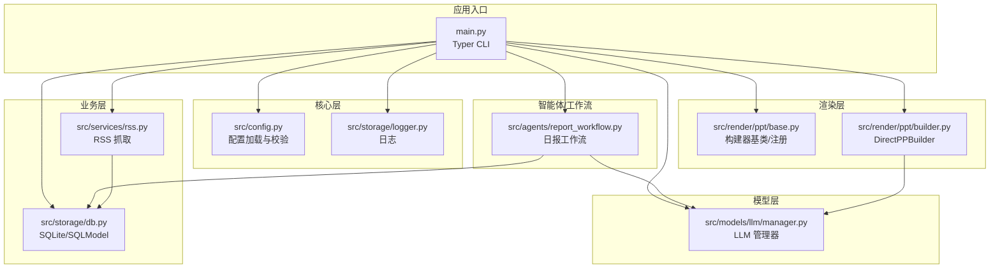
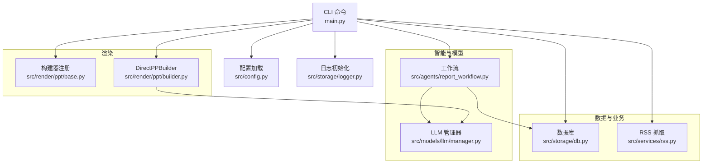
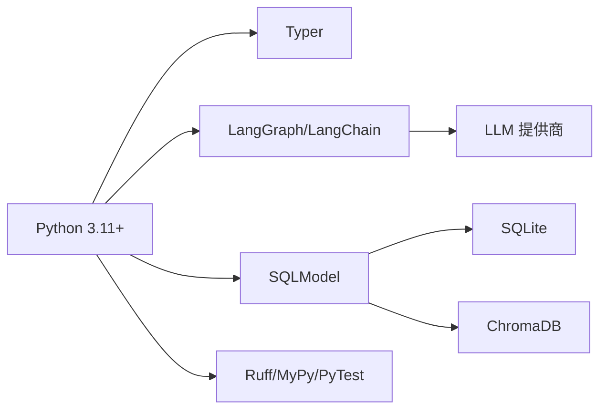

# 代码规范与质量

<cite>
**本文引用的文件**
- [README.md](file://README.md)
- [pyproject.toml](file://pyproject.toml)
- [uv.toml](file://uv.toml)
- [main.py](file://main.py)
- [src/config.py](file://src/config.py)
- [src/models/llm/manager.py](file://src/models/llm/manager.py)
- [src/storage/db.py](file://src/storage/db.py)
- [src/services/rss.py](file://src/services/rss.py)
- [src/storage/logger.py](file://src/storage/logger.py)
- [src/render/ppt/base.py](file://src/render/ppt/base.py)
- [src/render/ppt/builder.py](file://src/render/ppt/builder.py)
- [src/agents/report_workflow.py](file://src/agents/report_workflow.py)
- [scripts/fetch_sample.py](file://scripts/fetch_sample.py)
- [skills/code_review/skill.yaml](file://skills/code_review/skill.yaml)
- [skills/test_gen/skill.yaml](file://skills/test_gen/skill.yaml)
- [skills/visual-review/skill.yaml](file://skills/visual-review/skill.yaml)
- [src/prompts/generate_slides_from_script.md](file://src/prompts/generate_slides_from_script.md)
</cite>

## 目录
1. [引言](#引言)
2. [项目结构](#项目结构)
3. [核心组件](#核心组件)
4. [架构总览](#架构总览)
5. [详细组件分析](#详细组件分析)
6. [依赖分析](#依赖分析)
7. [性能考量](#性能考量)
8. [故障排查指南](#故障排查指南)
9. [结论](#结论)
10. [附录](#附录)

## 引言
本文件旨在为 Brief Agent 项目建立统一的代码规范与质量标准，覆盖 Python 代码风格、Ruff 格式化、MyPy 类型检查、Git 提交与分支管理、代码审查清单、目录结构组织原则、重构指导与反模式识别，以及静态分析工具的使用与配置。文档以仓库现有实现为依据，结合开发流程与最佳实践，帮助团队在保持一致性的同时提升可维护性与可靠性。

## 项目结构
Brief Agent 采用“功能域+分层”的组织方式：
- src/ 为核心源码包，按领域与职责划分：
  - agents/：基于 LangGraph 的工作流与智能体
  - models/：外部模型 API 封装（LLM、图像、音频）
  - services/：业务服务（RSS 抓取等）
  - storage/：数据持久化与日志
  - render/：渲染层（PPT 构建与模板）
  - prompts/：提示词模板
- scripts/：辅助脚本（示例抓取、迁移等）
- skills/：Claude Code Skills（代码审查、测试生成、视觉审查）
- 根目录：入口脚本、配置与工具配置（pyproject.toml、uv.toml）

图表来源
- [main.py](file://main.py#L1-L227)
- [src/config.py](file://src/config.py#L1-L109)
- [src/storage/logger.py](file://src/storage/logger.py#L1-L39)
- [src/services/rss.py](file://src/services/rss.py#L1-L123)
- [src/storage/db.py](file://src/storage/db.py#L1-L251)
- [src/models/llm/manager.py](file://src/models/llm/manager.py#L1-L318)
- [src/render/ppt/base.py](file://src/render/ppt/base.py#L1-L42)
- [src/render/ppt/builder.py](file://src/render/ppt/builder.py#L1-L194)
- [src/agents/report_workflow.py](file://src/agents/report_workflow.py#L1-L266)

章节来源
- [README.md](file://README.md#L87-L148)

## 核心组件
- CLI 入口与命令：Typer CLI 定义 fetch、parse、report、serve 等命令，负责日志初始化、参数校验与调用工作流。
- 配置系统：基于 Pydantic 的配置模型，支持 YAML 配置与环境变量替换。
- 数据层：SQLModel + SQLite，提供文章、解析结果、报告等表及常用 CRUD。
- LLM 管理：统一接口与多种提供商适配，支持单次、批量与流式生成。
- RSS 服务：HTTP 抓取、HTML 清洗、入库。
- 渲染层：PPT 构建器注册与直渲染实现，支持模板与提示词驱动。
- 工作流：LangGraph 日报生成工作流，串联收集、组织、生成、保存节点。

章节来源
- [main.py](file://main.py#L1-L227)
- [src/config.py](file://src/config.py#L1-L109)
- [src/storage/db.py](file://src/storage/db.py#L1-L251)
- [src/models/llm/manager.py](file://src/models/llm/manager.py#L1-L318)
- [src/services/rss.py](file://src/services/rss.py#L1-L123)
- [src/render/ppt/base.py](file://src/render/ppt/base.py#L1-L42)
- [src/render/ppt/builder.py](file://src/render/ppt/builder.py#L1-L194)
- [src/agents/report_workflow.py](file://src/agents/report_workflow.py#L1-L266)

## 架构总览
Brief Agent 采用“CLI → 配置/日志 → 业务服务 → 数据层 → 模型层 → 渲染层/工作流”的分层架构。数据与模型交互通过统一的配置与日志模块贯穿，保证可观测性与可维护性。

图表来源
- [main.py](file://main.py#L1-L227)
- [src/config.py](file://src/config.py#L1-L109)
- [src/storage/logger.py](file://src/storage/logger.py#L1-L39)
- [src/storage/db.py](file://src/storage/db.py#L1-L251)
- [src/services/rss.py](file://src/services/rss.py#L1-L123)
- [src/agents/report_workflow.py](file://src/agents/report_workflow.py#L1-L266)
- [src/models/llm/manager.py](file://src/models/llm/manager.py#L1-L318)
- [src/render/ppt/base.py](file://src/render/ppt/base.py#L1-L42)
- [src/render/ppt/builder.py](file://src/render/ppt/builder.py#L1-L194)

## 详细组件分析

### Python 代码风格规范
- 命名约定
  - 模块与包：小写下划线（如 models/llm、render/ppt）
  - 类名：大驼峰（如 Database、RSSFetcher、LLMManager）
  - 函数与方法：小写下划线（如 fetch_all、upsert_article、complete）
  - 常量：全大写（如 DEFAULT_STYLE）
  - 私有成员：前缀下划线（如 _create_provider、_get_env_or_default）
- 缩进与行宽
  - 使用 4 空格缩进
  - 行长度不超过 100（Ruff 配置）
- 注释与文档字符串
  - 模块顶部使用三引号文档字符串说明模块用途与职责
  - 公开类与函数提供清晰 docstring，说明输入、行为与输出
  - 注释用于解释复杂逻辑或边界条件
- 导入顺序
  - 标准库 → 第三方库 → 项目内相对导入
  - 同类之间按字母序排列
- 类型注解
  - 函数参数、返回值、属性均应标注类型
  - 使用 typing.List、typing.Optional、typing.Iterator 等
  - TypedDict 用于状态结构（如 DailyReportState）

章节来源
- [pyproject.toml](file://pyproject.toml#L42-L44)
- [src/models/llm/manager.py](file://src/models/llm/manager.py#L1-L318)
- [src/storage/db.py](file://src/storage/db.py#L1-L251)
- [src/render/ppt/builder.py](file://src/render/ppt/builder.py#L1-L194)
- [src/agents/report_workflow.py](file://src/agents/report_workflow.py#L1-L266)

### Ruff 代码格式化与检查
- 配置
  - 行宽：100
  - 目标版本：Python 3.11
- 使用方法
  - 检查：ruff check src/
  - 自动修复：ruff check --fix src/
  - 与 mypy 协同：先 ruff fix，再 mypy
- 最佳实践
  - 在 CI 中强制执行 ruff check
  - 本地 pre-commit 集成（建议）
  - 仅对 src/ 目录执行，避免污染第三方代码

章节来源
- [pyproject.toml](file://pyproject.toml#L42-L44)
- [README.md](file://README.md#L219-L230)

### MyPy 类型检查配置与最佳实践
- 配置
  - 作为 dev 依赖存在，建议在 CI 中运行
  - 与 Ruff 协同：先格式化，再类型检查
- 最佳实践
  - 为所有公共 API 提供完整类型注解
  - 使用泛型与 Protocol 约束接口
  - 对动态行为（如反射）使用 Any 时提供明确注释
  - 逐步提升严格度（strict 可选）

章节来源
- [pyproject.toml](file://pyproject.toml#L39-L39)
- [src/models/llm/manager.py](file://src/models/llm/manager.py#L1-L318)
- [src/config.py](file://src/config.py#L1-L109)

### Git 提交规范与分支管理策略
- 提交信息格式
  - 类型: 简短主题
  - 详细说明（必要时）
  - 关联 Issue（可选）
- 分支命名
  - feat/xxx：新功能
  - fix/xxx：缺陷修复
  - refactor/xxx：重构
  - docs/xxx：文档
  - test/xxx：测试
- 合并与审查
  - PR 需通过 CI（lint、mypy、pytest）
  - 至少一名 reviewer 同意
  - 合并前确保提交信息清晰、分支命名规范

章节来源
- [README.md](file://README.md#L219-L230)

### 代码审查清单与质量检查要点
- 代码风格
  - 是否符合 Ruff 行宽与缩进规则
  - 是否存在冗余空行与未使用导入
- 类型安全
  - 是否缺失关键类型注解
  - 是否滥用 Any
- 可靠性
  - 错误处理是否完备（网络请求、API 响应、JSON 解析）
  - 是否存在资源泄漏（未关闭的连接/会话）
- 可维护性
  - 函数是否过长（建议单函数不超过约 50 行）
  - 是否存在重复逻辑（可抽取为私有函数）
- 可观测性
  - 是否使用统一日志接口
  - 是否记录关键事件与耗时

章节来源
- [src/services/rss.py](file://src/services/rss.py#L1-L123)
- [src/storage/db.py](file://src/storage/db.py#L1-L251)
- [src/render/ppt/builder.py](file://src/render/ppt/builder.py#L1-L194)
- [src/storage/logger.py](file://src/storage/logger.py#L1-L39)

### 目录结构组织原则与模块划分标准
- 按职责划分：agents（智能体/工作流）、models（外部模型封装）、services（业务服务）、storage（数据与日志）、render（渲染）、prompts（提示词）
- 包与模块：使用 __init__.py 明确包边界；子包内部按功能进一步细分
- 配置与脚本：根目录放置入口与工具配置；scripts/ 放置一次性或辅助脚本
- 技能与提示词：skills/ 与 prompts/ 独立管理，便于 AI 协作与复用

章节来源
- [README.md](file://README.md#L87-L148)
- [src/render/ppt/base.py](file://src/render/ppt/base.py#L1-L42)
- [src/prompts/generate_slides_from_script.md](file://src/prompts/generate_slides_from_script.md#L1-L62)

### 代码重构指导与反模式识别
- 重构指导
  - 将重复逻辑抽取为私有函数或工具模块
  - 使用 Protocol/抽象基类约束接口，降低耦合
  - 将长函数拆分为更小的职责单一函数
  - 为易变配置（URL、路径、阈值）集中管理
- 反模式识别
  - 过度使用全局变量（如在工作流中直接导入模块而非通过依赖注入）
  - 在 CLI 中混入业务逻辑（应通过服务层与工作流隔离）
  - 忽视异常处理（网络请求、JSON 解析、文件 IO）
  - 硬编码字符串与魔法数字（应抽取为常量或配置）

章节来源
- [src/agents/report_workflow.py](file://src/agents/report_workflow.py#L1-L266)
- [src/render/ppt/builder.py](file://src/render/ppt/builder.py#L1-L194)
- [src/services/rss.py](file://src/services/rss.py#L1-L123)

### 静态分析工具使用指南与配置
- Ruff
  - 检查：ruff check src/
  - 修复：ruff check --fix src/
  - 集成：CI 中强制执行
- MyPy
  - 运行：mypy src/
  - 建议：与 Ruff 顺序配合（先 ruff，再 mypy）
- PyTest
  - 运行：uv run pytest tests/
  - 配置：asyncio_mode = auto，testpaths = ["tests"]

章节来源
- [pyproject.toml](file://pyproject.toml#L39-L39)
- [pyproject.toml](file://pyproject.toml#L46-L48)
- [README.md](file://README.md#L228-L236)

## 依赖分析
- 语言与框架
  - Python 3.11+，Typer（CLI）、LangGraph/LangChain（工作流与 LLM）、SQLModel（ORM）
- 数据与存储
  - SQLite（SQLModel）、ChromaDB（向量检索）
- 外部服务
  - LLM 提供商（MiniMax、ModelScope、DeepSeek）、RSS 源、OSS/对象存储（图像）
- 工具链
  - Ruff（格式化与检查）、MyPy（类型检查）、PyTest（单元测试）

图表来源
- [pyproject.toml](file://pyproject.toml#L1-L49)

章节来源
- [pyproject.toml](file://pyproject.toml#L1-L49)

## 性能考量
- I/O 与并发
  - RSS 抓取使用 httpx Client 并设置超时；建议在高并发场景引入限流与重试
- 数据库
  - SQLite 启用 WAL 模式与 busy_timeout，提升并发读写稳定性
- LLM 调用
  - 批量推理使用线程池，注意提供商速率限制与费用控制
- 渲染
  - PPT 构建涉及图片与文本布局，建议缓存中间产物与模板

章节来源
- [src/storage/db.py](file://src/storage/db.py#L65-L90)
- [src/models/llm/manager.py](file://src/models/llm/manager.py#L48-L62)
- [src/render/ppt/builder.py](file://src/render/ppt/builder.py#L128-L151)

## 故障排查指南
- CLI 参数错误
  - 日期格式错误：检查 report 命令参数格式
- LLM 配置缺失
  - 确认 .env 或 config.yaml 中提供商 API Key 已配置
- 数据库连接
  - 检查数据库路径与权限，确认 WAL 模式启用
- RSS 抓取失败
  - 检查网络与目标站点可用性，查看日志中的 HTTP 错误
- PPT 生成异常
  - 检查 LLM 返回 JSON 格式，必要时启用降级方案

章节来源
- [main.py](file://main.py#L107-L141)
- [src/config.py](file://src/config.py#L74-L109)
- [src/storage/db.py](file://src/storage/db.py#L65-L90)
- [src/services/rss.py](file://src/services/rss.py#L34-L61)
- [src/render/ppt/builder.py](file://src/render/ppt/builder.py#L75-L84)

## 结论
通过统一的代码风格、Ruff 与 MyPy 的静态保障、规范的 Git 流程与代码审查、清晰的目录结构与模块划分，Brief Agent 能够在持续演进中保持高质量与高可维护性。建议在 CI 中强制执行 lint 与类型检查，并逐步引入更严格的测试覆盖率与性能监控。

## 附录
- Claude Code Skills
  - code-review：安全性、正确性、性能与规范检查
  - test-gen：基于核心业务生成 pytest 测试
  - visual-review：审查 PPT/Marp 生成效果
- 提示词模板
  - generate_slides_from_script.md：Marp 幻灯片生成提示词

章节来源
- [skills/code_review/skill.yaml](file://skills/code_review/skill.yaml#L1-L4)
- [skills/test_gen/skill.yaml](file://skills/test_gen/skill.yaml#L1-L4)
- [skills/visual-review/skill.yaml](file://skills/visual-review/skill.yaml#L1-L4)
- [src/prompts/generate_slides_from_script.md](file://src/prompts/generate_slides_from_script.md#L1-L62)