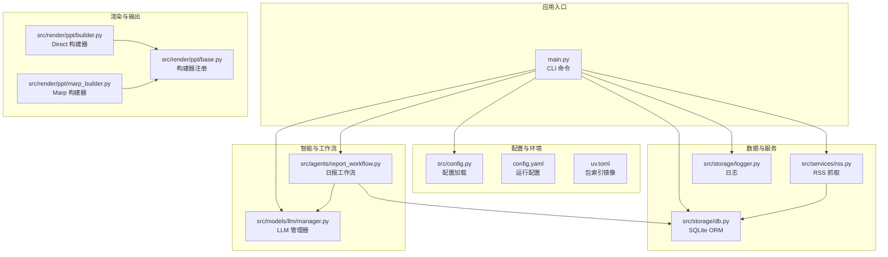
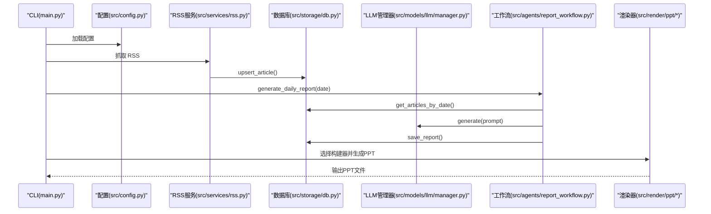
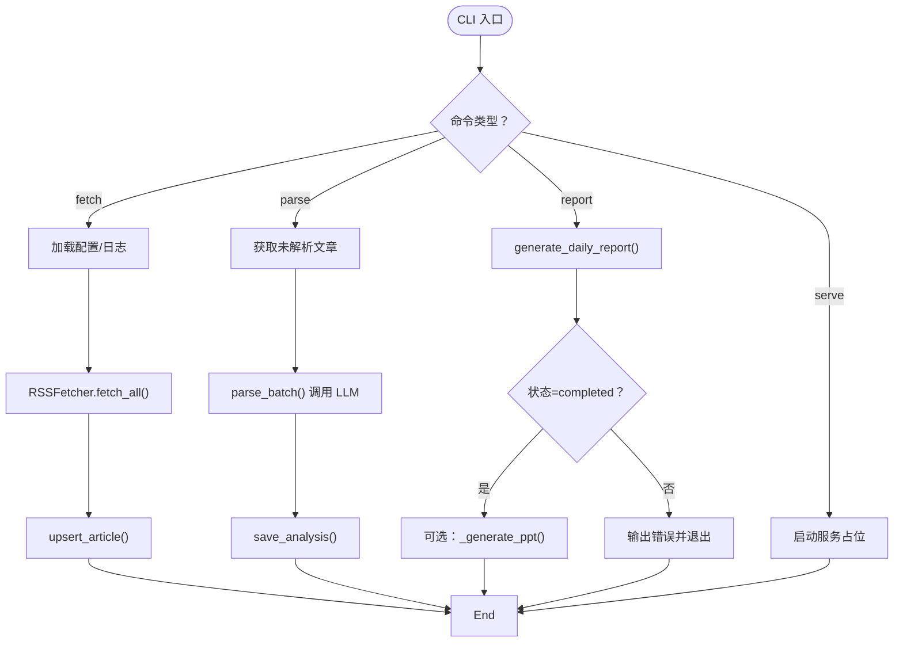
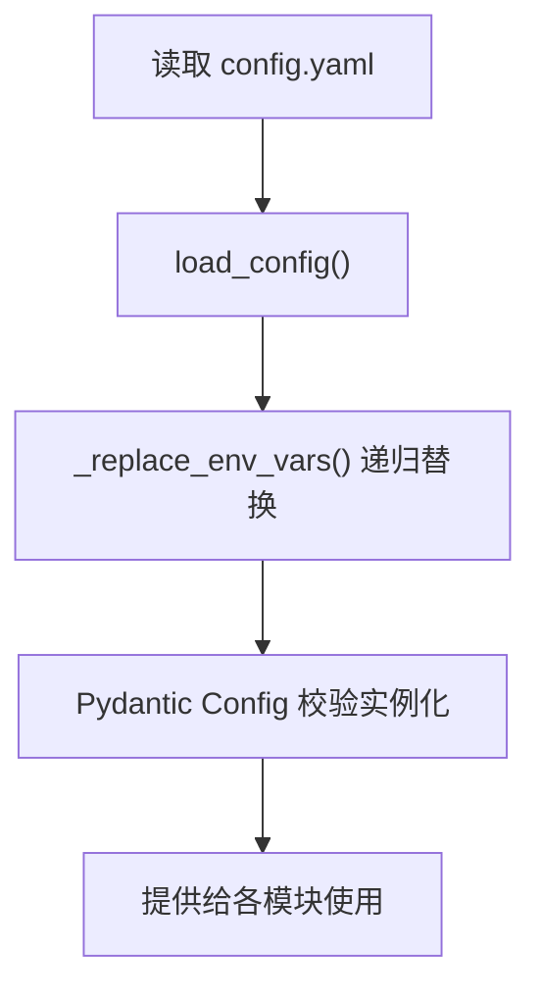
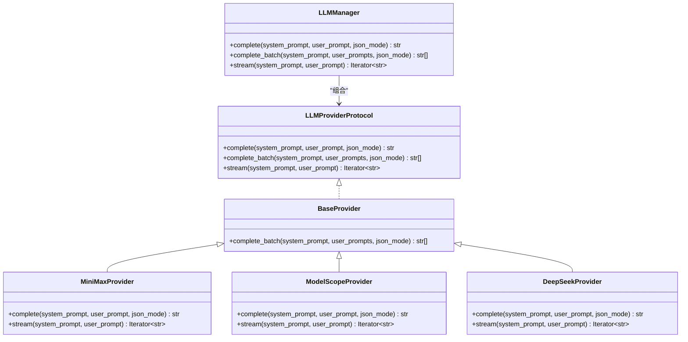
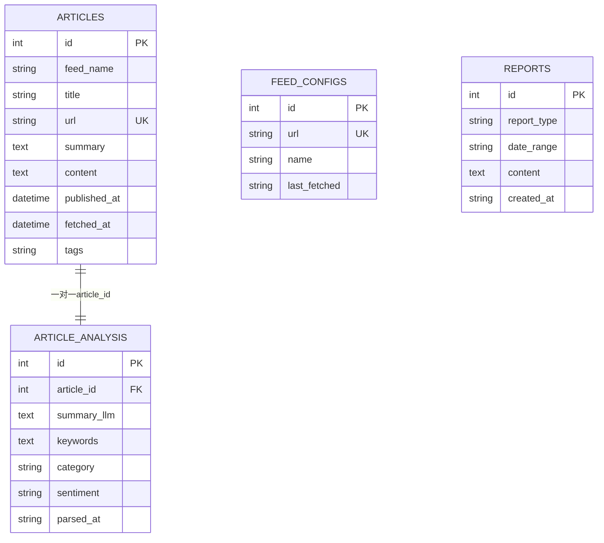
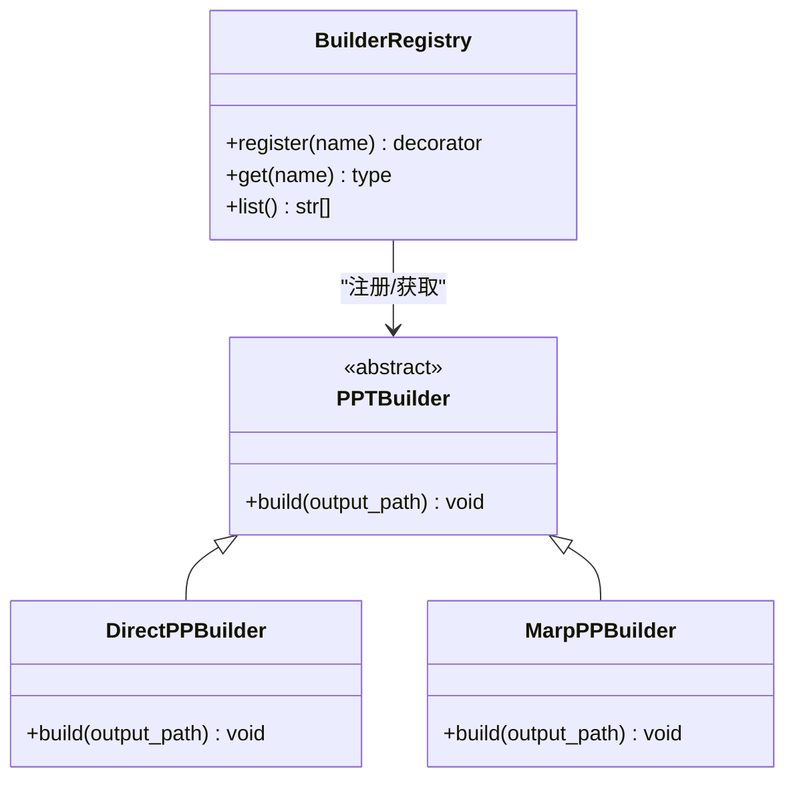
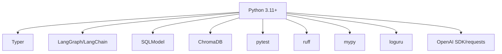

# 开发指南

<cite>
**本文档引用的文件**
- [README.md](file://README.md)
- [pyproject.toml](file://pyproject.toml)
- [config.yaml](file://config.yaml)
- [main.py](file://main.py)
- [src/config.py](file://src/config.py)
- [src/agents/report_workflow.py](file://src/agents/report_workflow.py)
- [src/models/llm/manager.py](file://src/models/llm/manager.py)
- [src/storage/db.py](file://src/storage/db.py)
- [src/services/rss.py](file://src/services/rss.py)
- [src/render/ppt/base.py](file://src/render/ppt/base.py)
- [src/render/ppt/builder.py](file://src/render/ppt/builder.py)
- [src/render/ppt/marp_builder.py](file://src/render/ppt/marp_builder.py)
- [scripts/fetch_sample.py](file://scripts/fetch_sample.py)
- [skills/test_gen/instructions.md](file://skills/test_gen/instructions.md)
- [uv.toml](file://uv.toml)
</cite>

## 目录
1. [简介](#简介)
2. [项目结构](#项目结构)
3. [核心组件](#核心组件)
4. [架构总览](#架构总览)
5. [详细组件分析](#详细组件分析)
6. [依赖关系分析](#依赖关系分析)
7. [性能考量](#性能考量)
8. [故障排查指南](#故障排查指南)
9. [结论](#结论)
10. [附录](#附录)

## 简介
Brief Agent 是一个基于 LangGraph 的多模态内容自动生成与分发平台，支持 RSS 多源采集、AI 智能分析、短视频脚本生成、视频渲染输出、RAG 向量化检索、日报/周报生成以及定时任务调度。本文档面向新加入的开发者，提供从环境搭建、开发工具使用、代码贡献流程、模块组织原则、扩展开发方法、测试策略、调试与性能分析到常见问题解决的完整指南。

## 项目结构
项目采用“功能域+分层”的组织方式，核心目录与职责如下：
- scripts/：辅助脚本（示例抓取、模板测试等）
- skills/：Claude Code Skills（代码审查、测试生成、视觉审查）
- src/：核心源码
  - agents/：基于 LangGraph 的工作流（日报生成、文章解析、图片生成）
  - models/llm/：统一 LLM Provider 管理（Minimax、ModelScope、DeepSeek）
  - models/image/audio/：图像/音频模型 API 封装
  - services/：业务服务（RSS 抓取）
  - storage/：数据存储（SQLite、ChromaDB、日志）
  - render/ppt/：PPT 渲染（Direct 构建器、Marp 构建器、模板）
  - prompts/：提示词模板
- 根目录：入口脚本、配置文件、依赖与工具配置

图表来源
- [main.py](file://main.py#L1-L227)
- [src/config.py](file://src/config.py#L74-L109)
- [src/agents/report_workflow.py](file://src/agents/report_workflow.py#L1-L266)
- [src/models/llm/manager.py](file://src/models/llm/manager.py#L206-L318)
- [src/storage/db.py](file://src/storage/db.py#L65-L251)
- [src/services/rss.py](file://src/services/rss.py#L15-L123)
- [src/render/ppt/base.py](file://src/render/ppt/base.py#L16-L42)
- [src/render/ppt/builder.py](file://src/render/ppt/builder.py#L22-L194)
- [src/render/ppt/marp_builder.py](file://src/render/ppt/marp_builder.py#L21-L94)

章节来源
- [README.md](file://README.md#L87-L148)

## 核心组件
- CLI 与命令入口：提供 fetch、parse、report、serve 等命令，负责日志初始化、配置加载、工作流编排与 PPT 输出。
- 配置系统：通过 Pydantic 模型校验 config.yaml，支持环境变量占位符替换。
- LLM 管理器：统一抽象不同 Provider 的接口，支持单次、批量与流式调用，并内置 BaseProvider 批量执行实现。
- 数据层：SQLModel + SQLite 管理文章、解析结果与报告；ChromaDB 用于 RAG 向量化检索。
- RSS 服务：HTTP 抓取、HTML 清洗、入库去重。
- 渲染层：Direct 构建器（python-pptx）、Marp 构建器（Marp CLI），并通过注册表扩展新构建器。

章节来源
- [main.py](file://main.py#L14-L227)
- [src/config.py](file://src/config.py#L74-L109)
- [src/models/llm/manager.py](file://src/models/llm/manager.py#L206-L318)
- [src/storage/db.py](file://src/storage/db.py#L65-L251)
- [src/services/rss.py](file://src/services/rss.py#L15-L123)
- [src/render/ppt/base.py](file://src/render/ppt/base.py#L16-L42)

## 架构总览
Brief Agent 的运行时由 CLI 驱动，围绕“采集-解析-生成-保存-渲染”闭环展开。LangGraph 工作流串联数据访问与 LLM 推理，渲染层将结构化结果输出为 PPT。

图表来源
- [main.py](file://main.py#L66-L141)
- [src/agents/report_workflow.py](file://src/agents/report_workflow.py#L217-L237)
- [src/services/rss.py](file://src/services/rss.py#L22-L60)
- [src/storage/db.py](file://src/storage/db.py#L147-L151)
- [src/models/llm/manager.py](file://src/models/llm/manager.py#L297-L317)
- [src/render/ppt/base.py](file://src/render/ppt/base.py#L32-L36)

## 详细组件分析

### CLI 与命令流程
- fetch：调用 RSS 抓取器，批量入库。
- parse：从数据库获取未解析文章，调用 LLM 批量解析。
- report：执行日报工作流，生成报告并可选输出 PPT。
- serve：预留 Web 服务入口。

图表来源
- [main.py](file://main.py#L66-L141)
- [src/agents/report_workflow.py](file://src/agents/report_workflow.py#L217-L237)

章节来源
- [main.py](file://main.py#L66-L141)

### 配置加载与环境变量替换
- 通过 Pydantic 模型定义配置结构，支持嵌套字段与默认值。
- 支持在配置中使用 ${ENV_VAR} 形式的环境变量占位符，运行时替换。

图表来源
- [src/config.py](file://src/config.py#L74-L109)

章节来源
- [src/config.py](file://src/config.py#L74-L109)
- [config.yaml](file://config.yaml#L1-L54)

### LLM 管理器与 Provider 抽象
- 统一协议 LLMProviderProtocol 定义 complete、complete_batch、stream。
- BaseProvider 提供线程池批量执行的通用实现。
- 支持 MiniMax、ModelScope、DeepSeek 三种 Provider，可通过配置或环境变量初始化。
- LLMManager 负责根据引擎名选择具体 Provider，并提供 complete、batch、stream 三类接口。

图表来源
- [src/models/llm/manager.py](file://src/models/llm/manager.py#L24-L318)

章节来源
- [src/models/llm/manager.py](file://src/models/llm/manager.py#L206-L318)

### 日报生成工作流（LangGraph）
- State 定义包含日期范围、文章列表、分类结果、报告内容、状态与错误信息。
- 节点函数：collect_articles → organize_articles → generate_report → save_report。
- 工作流以 START 开始，依次连接节点，最后结束于 END。
- 支持单例编译缓存，避免重复编译。

图表来源
- [src/agents/report_workflow.py](file://src/agents/report_workflow.py#L186-L201)

章节来源
- [src/agents/report_workflow.py](file://src/agents/report_workflow.py#L27-L237)

### 数据库与模型
- Article、ArticleAnalysis、FeedConfig、Report 四张表，分别对应原始文章、解析结果、RSS 源配置与报告。
- Database 封装 CRUD 与聚合查询，启用 WAL 模式提升并发性能。
- 提供按日期范围查询、未解析文章筛选、解析结果保存与报告保存等常用接口。

图表来源
- [src/storage/db.py](file://src/storage/db.py#L14-L61)

章节来源
- [src/storage/db.py](file://src/storage/db.py#L65-L251)

### RSS 抓取服务
- 使用 feedparser 解析 RSS/Atom，BeautifulSoup 清洗 HTML。
- 支持超时控制、重定向跟随、异常记录。
- 批量入库，避免重复。

章节来源
- [src/services/rss.py](file://src/services/rss.py#L15-L123)

### 渲染层与构建器扩展
- 注册表 BuilderRegistry 提供构建器注册与获取。
- DirectPPBuilder：通过 LLM 生成设计蓝图，使用 python-pptx 直接渲染。
- MarpPPBuilder：将 JSON 转换为 Marp Markdown，再调用 Marp CLI 输出 PPT，支持模板目录。

图表来源
- [src/render/ppt/base.py](file://src/render/ppt/base.py#L7-L42)
- [src/render/ppt/builder.py](file://src/render/ppt/builder.py#L22-L194)
- [src/render/ppt/marp_builder.py](file://src/render/ppt/marp_builder.py#L21-L94)

章节来源
- [src/render/ppt/base.py](file://src/render/ppt/base.py#L16-L42)
- [src/render/ppt/builder.py](file://src/render/ppt/builder.py#L22-L194)
- [src/render/ppt/marp_builder.py](file://src/render/ppt/marp_builder.py#L21-L94)

## 依赖关系分析
- 语言与框架：Python 3.11+、Typer（CLI）、LangGraph/LangChain（工作流与链）、SQLModel（ORM）、ChromaDB（向量）、pytest（测试）、loguru（日志）。
- 工具链：uv（包管理与同步）、ruff（lint）、mypy（类型检查）、pytest（测试执行）。
- 外部服务：各 LLM 提供商 API、Marp CLI（可选）。

图表来源
- [pyproject.toml](file://pyproject.toml#L1-L49)

章节来源
- [pyproject.toml](file://pyproject.toml#L1-L49)

## 性能考量
- 数据库：启用 WAL 模式与超时设置，支持并发读写；批量入库减少往返。
- LLM：BaseProvider 使用线程池执行批量推理，注意并发度与速率限制。
- 渲染：Direct 构建器直接渲染，Marp 构建器依赖外部 CLI，建议在 CI 中禁用或提供替代方案。
- 日志：使用 loguru，结合配置文件的轮转与保留策略，避免磁盘膨胀。

章节来源
- [src/storage/db.py](file://src/storage/db.py#L84-L90)
- [src/models/llm/manager.py](file://src/models/llm/manager.py#L48-L63)
- [src/render/ppt/marp_builder.py](file://src/render/ppt/marp_builder.py#L37-L57)

## 故障排查指南
- 环境变量缺失：LLM Provider 初始化会抛出异常或回退到环境变量，请检查 .env 与 config.yaml 中的 API Key。
- RSS 抓取失败：检查网络连通性、超时设置、RSS 源有效性；关注 feedparser 的 bozo 异常。
- PPT 渲染失败：确认 Marp CLI 是否安装；Direct 构建器需确保 python-pptx 可用。
- 数据库锁/并发：SQLite 默认锁可能阻塞，检查 WAL 模式与 busy_timeout 设置。
- 类型与风格检查：使用 ruff 与 mypy 修复问题；pytest 保证核心路径可运行。

章节来源
- [src/models/llm/manager.py](file://src/models/llm/manager.py#L73-L77)
- [src/services/rss.py](file://src/services/rss.py#L37-L48)
- [src/render/ppt/marp_builder.py](file://src/render/ppt/marp_builder.py#L37-L57)
- [src/storage/db.py](file://src/storage/db.py#L84-L90)
- [README.md](file://README.md#L219-L236)

## 结论
Brief Agent 以清晰的分层与模块化设计实现了从数据采集到内容渲染的完整链路。通过统一的 LLM 管理器、LangGraph 工作流与可扩展的渲染器注册机制，开发者可以快速添加新的 Provider、构建器与 Agent 工作流。建议在开发过程中严格遵循代码风格与类型检查，配合测试生成技能与单元测试，持续保障系统的稳定性与可维护性。

## 附录

### 开发环境搭建与工具使用
- 使用 uv 创建并激活虚拟环境，同步依赖。
- 配置 .env，填入各 Provider 的 API Key。
- 编辑 config.yaml，设置 RSS、数据库、向量库、日志与调度参数。
- 代码风格：ruff check/src/ 与 ruff check --fix/src/；类型检查：mypy src/。
- 运行测试：uv run pytest tests/。

章节来源
- [README.md](file://README.md#L19-L41)
- [README.md](file://README.md#L219-L236)
- [uv.toml](file://uv.toml#L1-L4)

### 代码贡献流程（建议）
- 分支管理：从 main 拉取最新变更，创建 feature/fix/refactor 分支。
- 提交规范：遵循“类型: 说明”的格式，简短明确。
- 代码审查：推送 PR，至少一名维护者审查；修复反馈后重新审查。
- 测试：新增/修改功能需配套单元测试；使用测试生成技能生成初始骨架。

章节来源
- [skills/test_gen/instructions.md](file://skills/test_gen/instructions.md#L1-L262)

### 项目模块组织原则
- 按功能域划分：agents、models、services、storage、render、prompts。
- 分层清晰：配置加载、数据访问、业务服务、智能推理、渲染输出。
- 可扩展：Provider 与构建器通过注册表扩展；工作流可复用节点。

章节来源
- [README.md](file://README.md#L87-L148)
- [src/render/ppt/base.py](file://src/render/ppt/base.py#L16-L42)

### 扩展开发方法
- 新 Provider：实现 LLMProviderProtocol 或继承 BaseProvider，在 LLMManager 中注册并支持配置加载。
- 新构建器：实现 PPTBuilder 并通过 @BuilderRegistry.register 注册，支持多模板与外部 CLI。
- Agent 工作流：基于 LangGraph StateGraph 定义节点与边，复用已有 LLM 与数据库接口。

章节来源
- [src/models/llm/manager.py](file://src/models/llm/manager.py#L206-L318)
- [src/render/ppt/base.py](file://src/render/ppt/base.py#L16-L42)
- [src/agents/report_workflow.py](file://src/agents/report_workflow.py#L186-L201)

### 测试策略与编写指南
- 范围优先级：P0（Agents、Services）、P1（Storage、Render）、P2（Utils）。
- 文件与命名规范：tests/test_*.py、Test* 类、test_* 方法。
- Mock 策略：LLM 调用、RSS 抓取、文件操作、数据库（内存模式）。
- 示例模板：Agent、Service、PPT 生成测试模板。

章节来源
- [skills/test_gen/instructions.md](file://skills/test_gen/instructions.md#L15-L262)

### 调试技巧与性能分析
- 日志：使用 loguru，结合配置文件的 rotation 与 retention。
- 断点与打印：在关键节点（collect、organize、generate、save）添加日志。
- 性能：观察 LLM 调用耗时、数据库查询耗时、批量执行吞吐；必要时增加限流与重试。

章节来源
- [src/storage/logger.py](file://src/storage/logger.py)
- [src/agents/report_workflow.py](file://src/agents/report_workflow.py#L46-L61)
- [src/storage/db.py](file://src/storage/db.py#L147-L151)

### 常见问题与最佳实践
- RSS 源为空：检查 feedparser 返回与异常处理。
- LLM 返回非 JSON：实现降级方案（如标题拆分）。
- PPT 输出为空：确认 Marp CLI 安装或切换到 Direct 构建器。
- 配置热更新：通过 reload 配置或重启进程；避免在运行时频繁修改 config.yaml。

章节来源
- [main.py](file://main.py#L151-L162)
- [src/render/ppt/marp_builder.py](file://src/render/ppt/marp_builder.py#L37-L57)
- [src/render/ppt/builder.py](file://src/render/ppt/builder.py#L75-L84)

### 新开发者入门路径
- 环境准备：uv sync、.env 配置、config.yaml 调整。
- 快速验证：运行 fetch、parse、report 命令，观察输出与日志。
- 修改与扩展：从最小改动入手（如新增 RSS 源、切换 Provider、新增模板）。
- 贡献流程：分支、提交、审查、测试。

章节来源
- [README.md](file://README.md#L19-L85)
- [scripts/fetch_sample.py](file://scripts/fetch_sample.py#L16-L68)