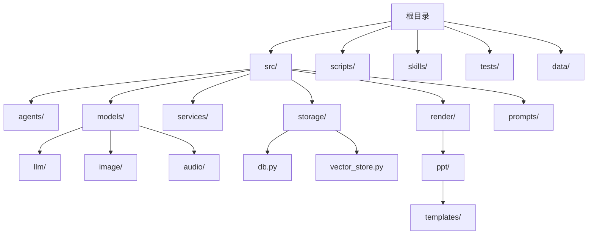
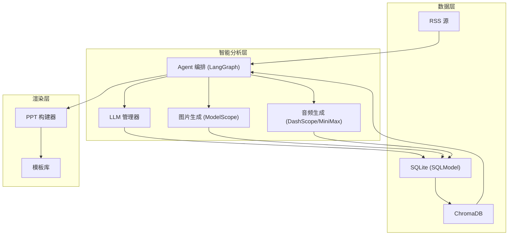
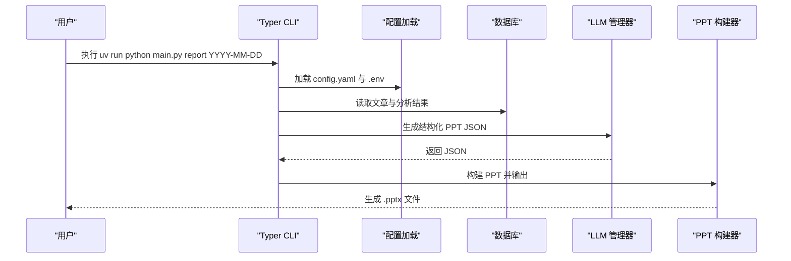
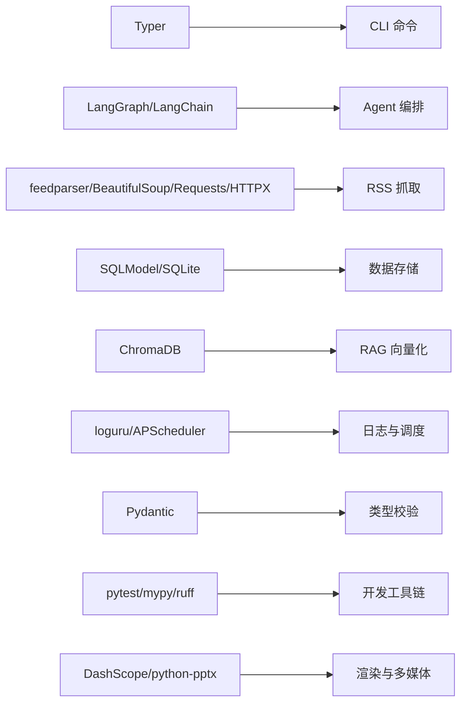

# 开发环境搭建

<cite>
**本文档引用的文件**
- [README.md](file://README.md)
- [pyproject.toml](file://pyproject.toml)
- [uv.toml](file://uv.toml)
- [uv.lock](file://uv.lock)
- [env.example](file://env.example)
- [config.yaml](file://config.yaml)
- [main.py](file://main.py)
- [src/config.py](file://src/config.py)
- [src/storage/db.py](file://src/storage/db.py)
- [scripts/migrate_db.py](file://scripts/migrate_db.py)
- [CLAUDE.md](file://CLAUDE.md)
</cite>

## 目录
1. [简介](#简介)
2. [项目结构](#项目结构)
3. [核心组件](#核心组件)
4. [架构总览](#架构总览)
5. [详细组件分析](#详细组件分析)
6. [依赖关系分析](#依赖关系分析)
7. [性能考量](#性能考量)
8. [故障排除指南](#故障排除指南)
9. [结论](#结论)
10. [附录](#附录)

## 简介
Brief Agent 是一个基于 LangGraph 的多模态内容自动生成与分发平台，支持 RSS 数据采集、AI 智能分析、短视频脚本生成、视频渲染输出、RAG 向量化检索以及日报/周报生成等功能。本文档面向开发者，提供从零开始的开发环境搭建指南，涵盖 Python 3.11+ 环境配置、虚拟环境创建、依赖安装、环境变量配置、包管理工具 uv 的使用、IDE 配置建议、开发工具链安装与配置，以及常见问题排查。

## 项目结构
项目采用清晰的分层结构，便于模块化开发与维护：
- 根目录包含入口脚本、配置文件、环境变量示例、包管理配置与锁文件
- src 目录下按功能域划分：agents（Agent 编排）、models（外部模型 API）、services（业务服务）、storage（数据存储）、render（渲染层）、prompts（提示词模板）
- scripts 目录包含辅助脚本（如数据库迁移）
- skills 目录包含 Claude Code Skills 的说明文档
- tests 目录用于存放测试文件（当前仓库未包含）

**图表来源**
- [main.py](file://main.py#L1-L227)
- [src/config.py](file://src/config.py#L1-L109)
- [src/storage/db.py](file://src/storage/db.py#L1-L251)

**章节来源**
- [README.md](file://README.md#L87-L148)
- [CLAUDE.md](file://CLAUDE.md#L36-L95)

## 核心组件
- CLI 入口与命令：通过 Typer 提供 fetch、parse、report、serve 等命令，支持日志级别控制、PPT 生成等
- 配置系统：支持 YAML 配置文件与环境变量替换，集中管理 LLM、RSS、数据库、向量库、日志与调度器配置
- 数据存储：基于 SQLModel 的 SQLite 数据库，支持 WAL 模式与超时配置；提供文章、分析结果、报告等模型
- 渲染层：支持直接构建与 Marp 构建两种 PPT 生成方式，内置多种模板风格
- 外部模型：统一管理 LLM（MiniMax、ModelScope、DeepSeek）、图片生成（ModelScope Z-Image-Turbo）、音频（DashScope、MiniMax）等

**章节来源**
- [main.py](file://main.py#L1-L227)
- [src/config.py](file://src/config.py#L1-L109)
- [src/storage/db.py](file://src/storage/db.py#L1-L251)
- [config.yaml](file://config.yaml#L1-L54)

## 架构总览
Brief Agent 的整体架构围绕“数据采集 → 智能分析 → 结构化生成 → 渲染输出”的流水线展开，结合 LangGraph 实现多 Agent 协作编排，并通过 RAG 增强内容检索能力。

**图表来源**
- [CLAUDE.md](file://CLAUDE.md#L170-L182)
- [config.yaml](file://config.yaml#L1-L54)
- [src/storage/db.py](file://src/storage/db.py#L1-L251)

## 详细组件分析

### 环境准备与 Python 3.11+
- Python 版本要求：项目 requires-python >= 3.11
- 推荐使用虚拟环境隔离依赖，避免系统 Python 被污染
- 建议使用 uv 作为包管理器，具备更快的安装速度与锁定机制

**章节来源**
- [pyproject.toml](file://pyproject.toml#L6-L6)
- [README.md](file://README.md#L19-L28)

### 包管理工具 uv 的使用
- 安装与同步：使用 uv sync 一键安装所有依赖（含 dev 依赖）
- 运行命令：使用 uv run python main.py ... 以确保在正确的虚拟环境中执行
- 镜像加速：通过 uv.toml 配置阿里云镜像源，提升下载速度
- 锁定文件：uv.lock 记录精确版本，保证团队一致性

**章节来源**
- [README.md](file://README.md#L19-L28)
- [CLAUDE.md](file://CLAUDE.md#L99-L121)
- [uv.toml](file://uv.toml#L1-L4)
- [uv.lock](file://uv.lock#L1-L8)

### 依赖分类与安装方法
- 核心依赖（dependencies）：Typer、LangGraph、LangChain、feedparser、BeautifulSoup、Requests、HTTPX、python-dotenv、PyYAML、sqlite-utils、chromadb、sentence-transformers、APScheduler、loguru、Pydantic、pytest、langchain-openapi、langchain-openai、SQLModel、DashScope、python-pptx
- 开发依赖（dev）：pytest、pytest-asyncio、ruff、mypy
- 安装方式：使用 uv sync 安装全部依赖；如仅需运行，可使用 uv pip install 安装核心依赖

**章节来源**
- [pyproject.toml](file://pyproject.toml#L7-L29)
- [pyproject.toml](file://pyproject.toml#L34-L40)

### 环境变量配置
- 复制示例文件：cp env.example .env
- 填写 API Key：MINIMAX_API_KEY、MODELSCOPE_API_KEY、DEEPSEEK_API_KEY、DASHSCOPE_API_KEY
- 可选配置：CONFIG_PATH（自定义配置文件路径）
- 配置加载：项目通过 dotenv 加载 .env，并在 config.yaml 中使用 ${ENV_VAR} 形式引用

**章节来源**
- [README.md](file://README.md#L30-L35)
- [env.example](file://env.example#L1-L10)
- [src/config.py](file://src/config.py#L9-L11)
- [src/config.py](file://src/config.py#L91-L109)
- [config.yaml](file://config.yaml#L4-L21)

### 配置文件 config.yaml 详解
- LLM 配置：支持 minimax、modelscope、deepseek 三种提供商，默认 provider、base_url、model、api_key（来自环境变量）
- RSS 配置：feeds 列表、抓取间隔、超时
- 数据库配置：SQLite 路径
- 向量数据库配置：ChromaDB 路径与集合名
- 日志配置：日志级别、文件路径、轮转大小与保留天数
- 调度器配置：时区、日报/周报生成时间

**章节来源**
- [config.yaml](file://config.yaml#L1-L54)

### CLI 命令与运行流程
- fetch：抓取 RSS 并保存到数据库
- parse：使用 LLM 解析未处理的文章
- report：生成日报/周报，支持输出到 stdout 与生成 PPT
- serve：预留 Web 服务入口（当前为占位）
- 日志：支持 --verbose 参数切换日志级别

**图表来源**
- [main.py](file://main.py#L107-L141)
- [main.py](file://main.py#L143-L188)
- [src/config.py](file://src/config.py#L74-L88)

**章节来源**
- [main.py](file://main.py#L1-L227)
- [CLAUDE.md](file://CLAUDE.md#L99-L121)

### 数据库与迁移
- 数据库初始化：首次运行会自动创建表结构（WAL 模式 + 超时）
- 迁移脚本：scripts/migrate_db.py 将旧表中的解析字段迁移到新的 article_analysis 表
- 数据模型：Article、ArticleAnalysis、FeedConfig、Report

**章节来源**
- [src/storage/db.py](file://src/storage/db.py#L65-L90)
- [scripts/migrate_db.py](file://scripts/migrate_db.py#L15-L86)

### 渲染与模板
- PPT 构建器：DirectPPBuilder 与 MarpPPBuilder 两种实现
- 模板库：default、minimal、corporate、gradient、dark 五种风格
- JSON 到 Marp 的转换：json_to_marp.py

**章节来源**
- [main.py](file://main.py#L143-L188)
- [CLAUDE.md](file://CLAUDE.md#L76-L89)

## 依赖关系分析
Brief Agent 的依赖关系由 pyproject.toml 定义，核心依赖包括：
- CLI 框架：Typer
- AI/LLM：LangGraph、LangChain、LangChain OpenAI/OpenAPI
- 网络与解析：feedparser、BeautifulSoup、Requests、HTTPX
- 数据持久化：SQLModel（SQLite）、ChromaDB、sqlite-utils
- 日志与调度：loguru、APScheduler
- 类型与测试：Pydantic、pytest、mypy
- 多媒体：DashScope、python-pptx

**图表来源**
- [pyproject.toml](file://pyproject.toml#L7-L29)
- [pyproject.toml](file://pyproject.toml#L34-L40)

**章节来源**
- [pyproject.toml](file://pyproject.toml#L1-L49)

## 性能考量
- 数据库性能：启用 WAL 模式与超时配置，支持并发读写
- 向量化检索：ChromaDB 与 sentence-transformers 提升检索效率
- 日志轮转：按大小轮转与保留策略，避免日志过大影响性能
- LLM 调用：合理设置超时与重试策略，避免阻塞

**章节来源**
- [src/storage/db.py](file://src/storage/db.py#L72-L89)
- [config.yaml](file://config.yaml#L42-L47)

## 故障排除指南
- 依赖安装失败
  - 使用 uv sync 重新安装，确保网络可用
  - 如需使用国内镜像，检查 uv.toml 是否正确配置
- 环境变量未生效
  - 确认 .env 文件存在且包含正确的 API Key
  - 检查 config.yaml 中 ${ENV_VAR} 是否与 .env 中的键一致
- 数据库初始化失败
  - 确认 data/sqlite/ 目录可写
  - 使用 scripts/migrate_db.py 执行迁移
- PPT 生成异常
  - 检查 LLM 返回的 JSON 格式，必要时启用降级方案
  - 确认模板文件存在且路径正确

**章节来源**
- [README.md](file://README.md#L30-L35)
- [src/config.py](file://src/config.py#L91-L109)
- [scripts/migrate_db.py](file://scripts/migrate_db.py#L15-L86)
- [main.py](file://main.py#L143-L188)

## 结论
Brief Agent 提供了一套完整的多模态内容自动化流水线，开发环境搭建的关键在于：使用 uv 管理依赖、正确配置环境变量与配置文件、理解 CLI 命令与数据流、以及掌握数据库初始化与迁移流程。通过合理的 IDE 配置与开发工具链（ruff、mypy、pytest），可以显著提升开发效率与代码质量。

## 附录

### IDE 配置建议（VSCode）
- Python 解释器：选择 uv 创建的虚拟环境中的 Python 解释器
- 扩展推荐：
  - Python（Microsoft）
  - Pylance（类型检查）
  - Ruff（代码格式与检查）
  - YAML（配置文件）
  - GitLens（Git 历史）
- 设置建议：
  - 将 ruff 作为默认 linter
  - 启用 mypy 作为类型检查
  - 配置 pytest 为默认测试框架

### 开发工具链安装与配置
- 代码格式化：ruff check src/ 与 ruff check --fix src/
- 类型检查：mypy src/
- 测试运行：uv run pytest tests/

**章节来源**
- [README.md](file://README.md#L219-L236)
- [CLAUDE.md](file://CLAUDE.md#L116-L121)