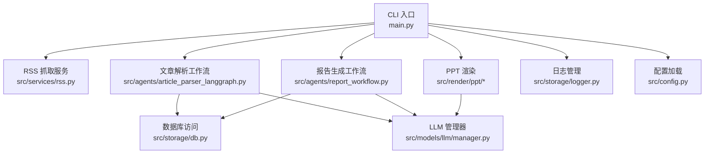
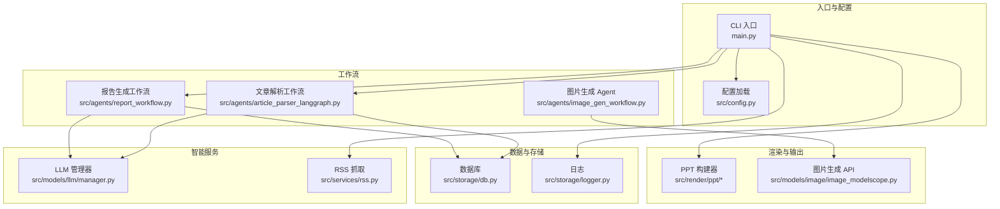
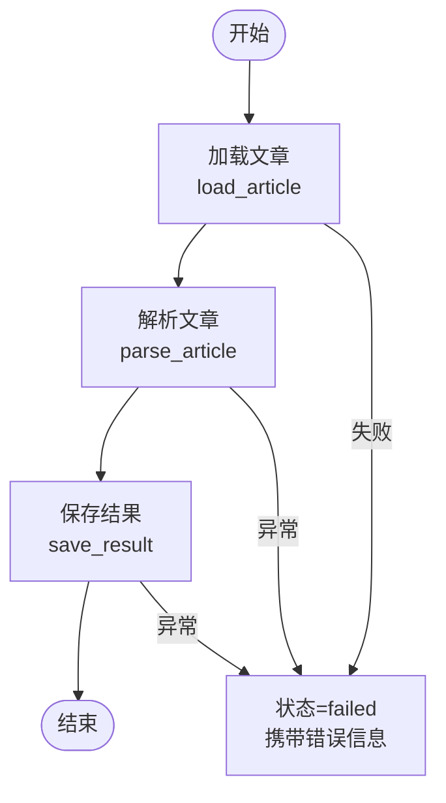
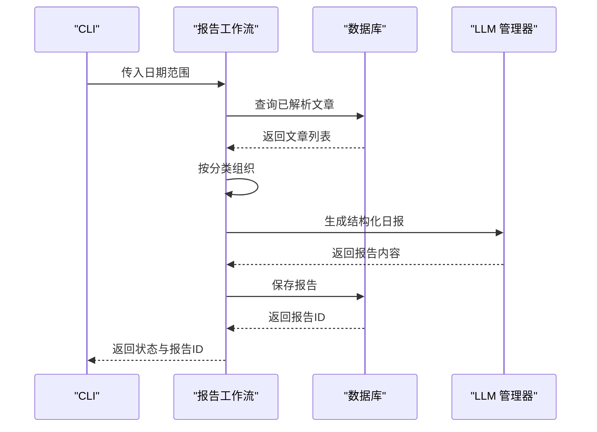
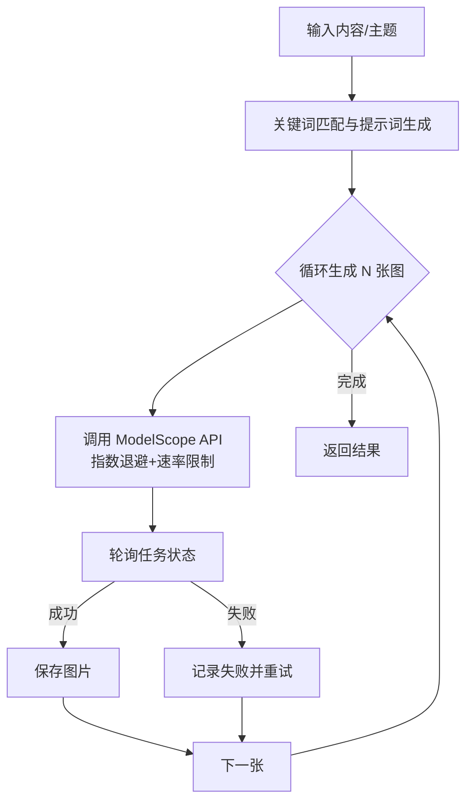
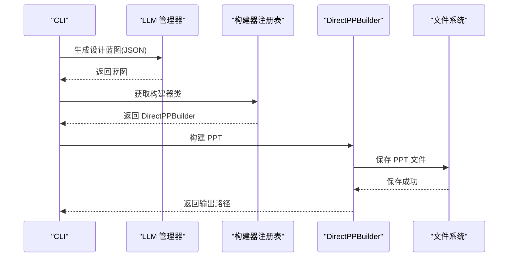
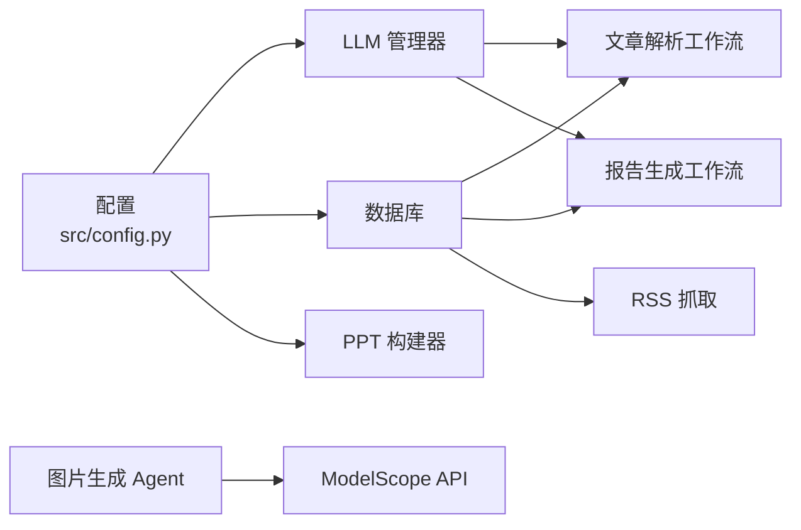

# Agent 工作流扩展开发

<cite>
**本文档引用的文件**
- [README.md](file://README.md)
- [main.py](file://main.py)
- [config.yaml](file://config.yaml)
- [src/config.py](file://src/config.py)
- [src/agents/article_parser_langgraph.py](file://src/agents/article_parser_langgraph.py)
- [src/agents/report_workflow.py](file://src/agents/report_workflow.py)
- [src/agents/image_gen_workflow.py](file://src/agents/image_gen_workflow.py)
- [src/storage/db.py](file://src/storage/db.py)
- [src/services/rss.py](file://src/services/rss.py)
- [src/models/llm/manager.py](file://src/models/llm/manager.py)
- [src/render/ppt/base.py](file://src/render/ppt/base.py)
- [src/render/ppt/builder.py](file://src/render/ppt/builder.py)
- [src/storage/logger.py](file://src/storage/logger.py)
- [src/models/image/image_modelscope.py](file://src/models/image/image_modelscope.py)
</cite>

## 目录
1. [简介](#简介)
2. [项目结构](#项目结构)
3. [核心组件](#核心组件)
4. [架构总览](#架构总览)
5. [详细组件分析](#详细组件分析)
6. [依赖关系分析](#依赖关系分析)
7. [性能考量](#性能考量)
8. [故障排查指南](#故障排查指南)
9. [结论](#结论)
10. [附录](#附录)

## 简介
本指南面向希望基于 LangGraph 扩展 Agent 工作流的开发者，系统讲解工作流设计模式（节点定义、边连接、状态管理、条件路由）、状态机概念（状态转换、错误处理、重试机制、并发控制），并提供从零开发新 Agent 工作流的实践步骤与完整扩展示例（文章解析工作流、报告生成工作流、图片生成 Agent）。同时涵盖调试方法、性能监控与配置管理的最佳实践。

## 项目结构
项目采用分层架构，围绕 RSS 抓取、文章解析、报告生成、PPT 渲染与图片生成等能力构建，核心入口为 CLI 命令行工具，Agent 工作流集中在 src/agents 目录下，配置与模型抽象位于 src/config.py 与 src/models 下，数据持久化与日志分别在 src/storage 中实现。

图表来源
- [main.py](file://main.py#L1-L227)
- [src/services/rss.py](file://src/services/rss.py#L1-L123)
- [src/agents/article_parser_langgraph.py](file://src/agents/article_parser_langgraph.py#L1-L241)
- [src/agents/report_workflow.py](file://src/agents/report_workflow.py#L1-L266)
- [src/storage/db.py](file://src/storage/db.py#L1-L251)
- [src/models/llm/manager.py](file://src/models/llm/manager.py#L1-L318)
- [src/render/ppt/base.py](file://src/render/ppt/base.py#L1-L42)
- [src/render/ppt/builder.py](file://src/render/ppt/builder.py#L1-L194)
- [src/storage/logger.py](file://src/storage/logger.py#L1-L39)
- [src/config.py](file://src/config.py#L1-L109)

章节来源
- [README.md](file://README.md#L87-L148)
- [main.py](file://main.py#L1-L227)

## 核心组件
- 配置系统：集中管理 LLM 提供商、RSS 源、数据库、向量库、日志与调度器配置，支持环境变量注入与类型校验。
- 数据层：基于 SQLModel 的 SQLite 模型与会话封装，提供文章、解析结果、报告等表的 CRUD 操作。
- LLM 管理器：统一抽象不同提供商（MiniMax、ModelScope、DeepSeek），支持单次推理、批量推理与流式生成。
- Agent 工作流：基于 LangGraph 的状态机，包含文章解析与报告生成两个核心工作流。
- 渲染层：PPT 构建器注册机制与直接渲染实现，支持从 JSON 结构化内容生成 PPT。
- 图片生成：ModelScope 图片生成工具，内置指数退避重试、速率限制与并发控制。
- 日志与 CLI：统一日志配置与 Typer CLI 命令入口，支持 fetch、parse、report、serve 等子命令。

章节来源
- [src/config.py](file://src/config.py#L1-L109)
- [src/storage/db.py](file://src/storage/db.py#L1-L251)
- [src/models/llm/manager.py](file://src/models/llm/manager.py#L1-L318)
- [src/agents/article_parser_langgraph.py](file://src/agents/article_parser_langgraph.py#L1-L241)
- [src/agents/report_workflow.py](file://src/agents/report_workflow.py#L1-L266)
- [src/render/ppt/base.py](file://src/render/ppt/base.py#L1-L42)
- [src/render/ppt/builder.py](file://src/render/ppt/builder.py#L1-L194)
- [src/models/image/image_modelscope.py](file://src/models/image/image_modelscope.py#L1-L363)
- [src/storage/logger.py](file://src/storage/logger.py#L1-L39)
- [main.py](file://main.py#L1-L227)

## 架构总览
整体架构遵循“配置驱动 + 模块解耦 + 工作流编排”的设计思想。CLI 作为入口协调各模块；Agent 工作流通过 LangGraph 管理状态流转；数据访问层统一抽象；LLM 管理器屏蔽不同提供商差异；渲染与图片生成模块可插拔扩展。

图表来源
- [main.py](file://main.py#L1-L227)
- [src/config.py](file://src/config.py#L1-L109)
- [src/storage/db.py](file://src/storage/db.py#L1-L251)
- [src/storage/logger.py](file://src/storage/logger.py#L1-L39)
- [src/models/llm/manager.py](file://src/models/llm/manager.py#L1-L318)
- [src/services/rss.py](file://src/services/rss.py#L1-L123)
- [src/agents/article_parser_langgraph.py](file://src/agents/article_parser_langgraph.py#L1-L241)
- [src/agents/report_workflow.py](file://src/agents/report_workflow.py#L1-L266)
- [src/agents/image_gen_workflow.py](file://src/agents/image_gen_workflow.py#L1-L198)
- [src/render/ppt/base.py](file://src/render/ppt/base.py#L1-L42)
- [src/render/ppt/builder.py](file://src/render/ppt/builder.py#L1-L194)
- [src/models/image/image_modelscope.py](file://src/models/image/image_modelscope.py#L1-L363)

## 详细组件分析

### 文章解析工作流（LangGraph）
该工作流以“加载-解析-保存”三节点串联，状态机通过 TypedDict 定义，确保状态字段明确且可追踪。节点函数职责清晰，错误在节点内部捕获并回传状态，便于后续统一处理。

图表来源
- [src/agents/article_parser_langgraph.py](file://src/agents/article_parser_langgraph.py#L66-L151)

章节来源
- [src/agents/article_parser_langgraph.py](file://src/agents/article_parser_langgraph.py#L1-L241)

### 报告生成工作流（LangGraph）
该工作流按“收集-组织-生成-保存”顺序执行，支持按分类组织文章并生成结构化日报内容，最终落库。状态机包含错误字段以便定位问题。

图表来源
- [src/agents/report_workflow.py](file://src/agents/report_workflow.py#L46-L181)
- [src/storage/db.py](file://src/storage/db.py#L227-L239)
- [src/models/llm/manager.py](file://src/models/llm/manager.py#L297-L317)

章节来源
- [src/agents/report_workflow.py](file://src/agents/report_workflow.py#L1-L266)

### 图片生成 Agent
该 Agent 将简报内容映射为无文字提示词，支持批量生成与快速生成两种模式，内部集成 ModelScope API 的指数退避重试、速率限制与并发控制，保证稳定性与吞吐。

图表来源
- [src/agents/image_gen_workflow.py](file://src/agents/image_gen_workflow.py#L48-L139)
- [src/models/image/image_modelscope.py](file://src/models/image/image_modelscope.py#L125-L243)

章节来源
- [src/agents/image_gen_workflow.py](file://src/agents/image_gen_workflow.py#L1-L198)
- [src/models/image/image_modelscope.py](file://src/models/image/image_modelscope.py#L1-L363)

### PPT 渲染工作流
CLI 通过 LLM 将结构化内容转为 PPT 设计蓝图，再由 DirectPPBuilder 直接渲染。构建器注册机制支持扩展多种渲染策略。

图表来源
- [main.py](file://main.py#L143-L188)
- [src/render/ppt/base.py](file://src/render/ppt/base.py#L16-L41)
- [src/render/ppt/builder.py](file://src/render/ppt/builder.py#L22-L151)

章节来源
- [main.py](file://main.py#L1-L227)
- [src/render/ppt/base.py](file://src/render/ppt/base.py#L1-L42)
- [src/render/ppt/builder.py](file://src/render/ppt/builder.py#L1-L194)

## 依赖关系分析
- 配置依赖：所有模块通过 src/config.py 的 Config 模型读取配置，支持环境变量注入与默认值回退。
- 数据依赖：Agent 工作流与 RSS 抓取均依赖 src/storage/db.py 的数据库会话与模型。
- LLM 依赖：文章解析与报告生成通过 src/models/llm/manager.py 统一调用不同提供商。
- 渲染依赖：PPT 渲染依赖构建器注册表与具体实现类。
- 图片依赖：图片生成 Agent 依赖 ModelScope 图片生成 API 与速率限制器。

图表来源
- [src/config.py](file://src/config.py#L74-L109)
- [src/storage/db.py](file://src/storage/db.py#L65-L94)
- [src/models/llm/manager.py](file://src/models/llm/manager.py#L206-L296)
- [src/agents/article_parser_langgraph.py](file://src/agents/article_parser_langgraph.py#L156-L180)
- [src/agents/report_workflow.py](file://src/agents/report_workflow.py#L186-L212)
- [src/agents/image_gen_workflow.py](file://src/agents/image_gen_workflow.py#L1-L198)
- [src/models/image/image_modelscope.py](file://src/models/image/image_modelscope.py#L1-L363)

章节来源
- [src/config.py](file://src/config.py#L1-L109)
- [src/storage/db.py](file://src/storage/db.py#L1-L251)
- [src/models/llm/manager.py](file://src/models/llm/manager.py#L1-L318)
- [src/agents/article_parser_langgraph.py](file://src/agents/article_parser_langgraph.py#L1-L241)
- [src/agents/report_workflow.py](file://src/agents/report_workflow.py#L1-L266)
- [src/agents/image_gen_workflow.py](file://src/agents/image_gen_workflow.py#L1-L198)
- [src/models/image/image_modelscope.py](file://src/models/image/image_modelscope.py#L1-L363)

## 性能考量
- 并发与批处理：LLM 管理器提供批量推理接口，内部使用线程池并发调用，提高吞吐。
- 数据库并发：SQLite 采用 WAL 模式与超时设置，提升并发读写稳定性。
- 图片生成：ModelScope API 实现速率限制与指数退避重试，避免触发限流与失败风暴。
- 日志与可观测性：统一日志配置，支持文件轮转与控制台输出，便于问题定位与性能分析。

章节来源
- [src/models/llm/manager.py](file://src/models/llm/manager.py#L48-L62)
- [src/storage/db.py](file://src/storage/db.py#L72-L90)
- [src/models/image/image_modelscope.py](file://src/models/image/image_modelscope.py#L66-L84)
- [src/storage/logger.py](file://src/storage/logger.py#L8-L39)

## 故障排查指南
- 配置问题：检查 config.yaml 与 .env 文件是否正确，确认环境变量注入是否生效。
- LLM 调用失败：查看 LLM 管理器日志，确认提供商 API Key、Base URL 与模型名配置。
- 数据库锁与超时：关注 SQLite 连接超时与并发冲突，必要时调整超时参数或减少并发。
- 图片生成失败：检查 ModelScope API Key、限流与轮询超时，观察指数退避与重试日志。
- 工作流异常：在节点函数中捕获异常并设置状态为 failed，CLI 会打印错误信息并退出。

章节来源
- [src/config.py](file://src/config.py#L91-L109)
- [src/models/llm/manager.py](file://src/models/llm/manager.py#L276-L296)
- [src/storage/db.py](file://src/storage/db.py#L72-L90)
- [src/models/image/image_modelscope.py](file://src/models/image/image_modelscope.py#L167-L243)
- [src/agents/article_parser_langgraph.py](file://src/agents/article_parser_langgraph.py#L126-L131)
- [src/agents/report_workflow.py](file://src/agents/report_workflow.py#L59-L61)

## 结论
本项目以 LangGraph 为核心，构建了可扩展的 Agent 工作流体系，结合统一配置、数据库抽象、LLM 管理器与渲染模块，形成从数据采集到内容产出的完整链路。通过明确的状态机设计、错误处理与重试机制、并发控制与性能优化，开发者可以在此基础上快速扩展新的 Agent 工作流与输出形态。

## 附录

### 开发新 Agent 工作流的步骤清单
- 明确输入输出：确定初始状态字段、节点输入输出规范与中间状态。
- 设计状态机：使用 TypedDict 定义状态结构，明确节点职责与边连接。
- 实现节点函数：每个节点专注单一职责，捕获异常并设置状态。
- 构建工作流：使用 StateGraph 添加节点与边，编译后复用。
- 集成与测试：接入数据库与 LLM，编写单元测试与端到端测试。
- 配置与部署：完善 config.yaml 与 .env，确保日志与监控可用。

章节来源
- [src/agents/article_parser_langgraph.py](file://src/agents/article_parser_langgraph.py#L24-L170)
- [src/agents/report_workflow.py](file://src/agents/report_workflow.py#L25-L201)
- [src/config.py](file://src/config.py#L74-L109)

### 配置管理最佳实践
- 将敏感信息放入 .env 并通过环境变量注入。
- 使用 Pydantic 模型校验配置，提供默认值与回退策略。
- 在运行时动态替换环境变量引用，避免硬编码。

章节来源
- [config.yaml](file://config.yaml#L1-L54)
- [src/config.py](file://src/config.py#L74-L109)

### 调试与监控建议
- 使用统一日志配置，开启文件轮转与控制台输出。
- 在关键节点打印状态与耗时，便于定位瓶颈。
- 对外部 API 调用增加超时与重试，记录失败原因。

章节来源
- [src/storage/logger.py](file://src/storage/logger.py#L8-L39)
- [src/models/image/image_modelscope.py](file://src/models/image/image_modelscope.py#L167-L243)