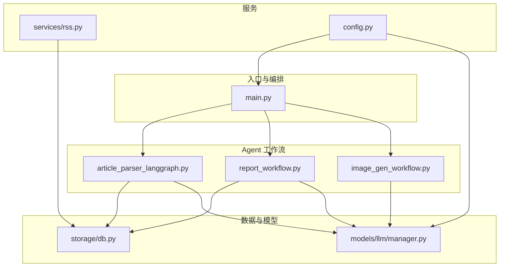
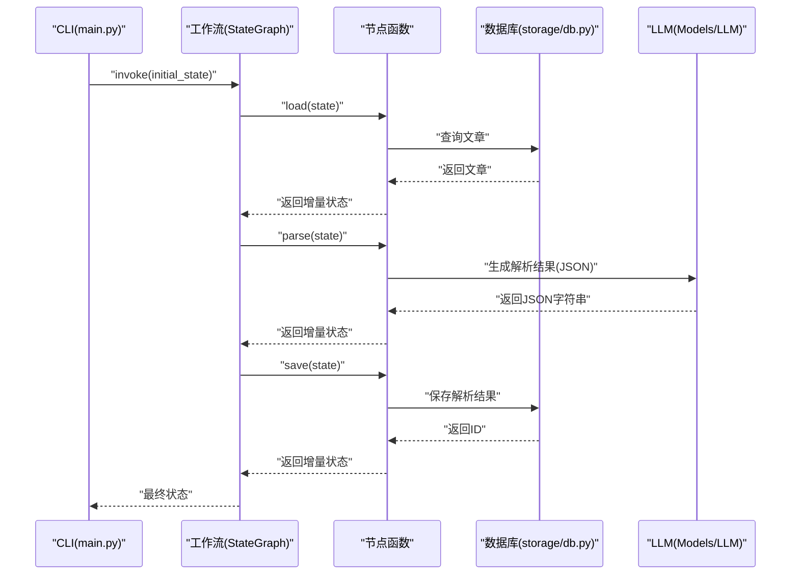
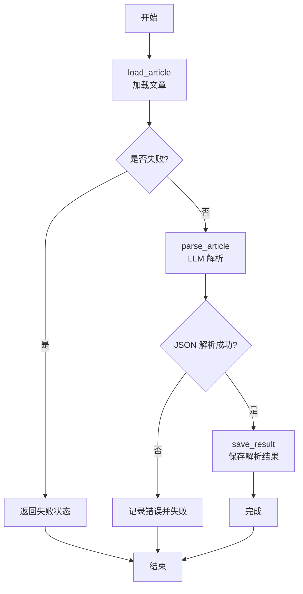
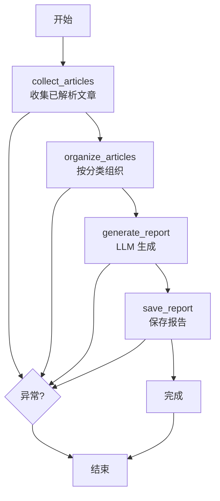
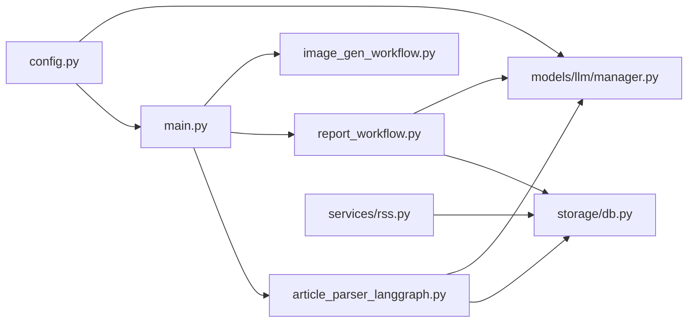

# 工作流设计模式

<cite>
**本文引用的文件**
- [main.py](file://main.py)
- [README.md](file://README.md)
- [src/agents/article_parser_langgraph.py](file://src/agents/article_parser_langgraph.py)
- [src/agents/report_workflow.py](file://src/agents/report_workflow.py)
- [src/agents/image_gen_workflow.py](file://src/agents/image_gen_workflow.py)
- [src/storage/db.py](file://src/storage/db.py)
- [src/models/llm/manager.py](file://src/models/llm/manager.py)
- [src/services/rss.py](file://src/services/rss.py)
- [src/config.py](file://src/config.py)
</cite>

## 目录
1. [简介](#简介)
2. [项目结构](#项目结构)
3. [核心组件](#核心组件)
4. [架构总览](#架构总览)
5. [详细组件分析](#详细组件分析)
6. [依赖关系分析](#依赖关系分析)
7. [性能考量](#性能考量)
8. [故障排查指南](#故障排查指南)
9. [结论](#结论)
10. [附录](#附录)

## 简介
本指南围绕基于 LangGraph 的工作流设计，系统阐述状态机模式、节点设计、边连接规则、TypedDict 状态定义最佳实践、节点函数实现规范、条件路由与分支控制、并行执行与聚合处理、异常处理策略，并结合仓库中的文章解析、日报生成与图片生成工作流，给出可维护、可扩展的工作流架构设计方法论与实操建议。

## 项目结构
该项目采用“分层+功能域”组织方式：
- CLI 入口与命令编排：main.py
- Agent 工作流：src/agents 下的 LangGraph 工作流
- 数据访问与模型：src/storage/db.py
- LLM 管理与多提供商适配：src/models/llm/manager.py
- RSS 抓取与调度：src/services/rss.py
- 配置加载：src/config.py
- README 提供高层说明与项目结构

图表来源
- [main.py](file://main.py#L1-L227)
- [src/agents/article_parser_langgraph.py](file://src/agents/article_parser_langgraph.py#L1-L241)
- [src/agents/report_workflow.py](file://src/agents/report_workflow.py#L1-L266)
- [src/agents/image_gen_workflow.py](file://src/agents/image_gen_workflow.py#L1-L198)
- [src/storage/db.py](file://src/storage/db.py#L1-L251)
- [src/models/llm/manager.py](file://src/models/llm/manager.py#L1-L318)
- [src/services/rss.py](file://src/services/rss.py#L1-L123)
- [src/config.py](file://src/config.py#L1-L109)

章节来源
- [README.md](file://README.md#L87-L148)
- [main.py](file://main.py#L1-L227)

## 核心组件
- LangGraph 工作流：以 TypedDict 定义状态，通过节点函数实现状态流转，使用 StateGraph 组装边连接，最终 compile 后通过 invoke/batch 执行。
- 数据层：SQLModel + SQLite，提供文章、解析结果、报告等表的 CRUD 与查询。
- LLM 管理：统一接口协议，支持多种提供商，提供单次、批量、流式能力。
- RSS 服务：抓取与入库，为工作流提供数据来源。
- CLI 编排：Typer 命令行入口，协调抓取、解析、报告生成与 PPT 导出。

章节来源
- [src/agents/article_parser_langgraph.py](file://src/agents/article_parser_langgraph.py#L24-L202)
- [src/agents/report_workflow.py](file://src/agents/report_workflow.py#L25-L237)
- [src/storage/db.py](file://src/storage/db.py#L12-L251)
- [src/models/llm/manager.py](file://src/models/llm/manager.py#L22-L318)
- [src/services/rss.py](file://src/services/rss.py#L15-L123)
- [main.py](file://main.py#L66-L141)

## 架构总览
LangGraph 工作流遵循“状态机 + 节点函数”的设计范式：
- 状态机模式：以 TypedDict 描述状态字段，包含输入、中间结果、输出与控制字段（如 status、error）。
- 节点设计：每个节点函数接收当前状态，返回增量更新（仅返回需要变更的字段），保持不可变性与幂等性。
- 边连接规则：使用 START/END 标识起止，节点间顺序连接；若需要条件路由，可在节点内部返回不同目标或使用条件边（本仓库未显式使用条件边，但可扩展）。
- 错误处理：节点返回 error 与 status 控制状态机走向，上层可据此决定重试或终止。

图表来源
- [src/agents/article_parser_langgraph.py](file://src/agents/article_parser_langgraph.py#L66-L151)
- [src/storage/db.py](file://src/storage/db.py#L97-L191)
- [src/models/llm/manager.py](file://src/models/llm/manager.py#L297-L317)
- [main.py](file://main.py#L98-L104)

## 详细组件分析

### 文章解析工作流（LangGraph）
- 状态定义：ArticleState 使用 TypedDict，包含输入字段（article_id/title/original_*）、LLM 结果字段（summary/keywords/category/sentiment）、状态控制字段（status/error）。
- 节点函数：
  - load_article：从数据库加载文章，失败时设置 status=failed。
  - parse_article：调用 LLM，构造 JSON prompt，清洗响应，解析 JSON，失败时设置 error。
  - save_result：将解析结果持久化到 article_analysis 表，成功后设置 status=completed。
- 边连接：START → load → parse → save → END，线性流程。
- 并发：提供 parse_batch，底层由 LangGraph 的 batch 支持并发执行。

图表来源
- [src/agents/article_parser_langgraph.py](file://src/agents/article_parser_langgraph.py#L66-L151)

章节来源
- [src/agents/article_parser_langgraph.py](file://src/agents/article_parser_langgraph.py#L24-L202)

### 日报生成工作流（LangGraph）
- 状态定义：DailyReportState 包含日期范围、文章列表、分类组织结果、报告内容、报告ID、状态与错误。
- 节点函数：
  - collect_articles：从数据库按日期范围收集已解析文章。
  - organize_articles：按 category 组织文章并排序。
  - generate_report：拼装提示词，调用 LLM 生成结构化日报。
  - save_report：保存到 reports 表，返回 report_id。
- 边连接：START → collect → organize → generate → save → END。

图表来源
- [src/agents/report_workflow.py](file://src/agents/report_workflow.py#L46-L181)

章节来源
- [src/agents/report_workflow.py](file://src/agents/report_workflow.py#L25-L237)

### 图片生成 Agent（非 LangGraph）
- 虽非 LangGraph，但体现了工作流中的“节点职责单一”与“状态最小化”原则：输入内容 → 提示词分析 → 图片生成 → 结果聚合。
- 该 Agent 适合与 LangGraph 工作流并行协作，作为外部工具节点接入。

章节来源
- [src/agents/image_gen_workflow.py](file://src/agents/image_gen_workflow.py#L1-L198)

### LLM 管理器（多提供商适配）
- 协议化设计：LLMProviderProtocol 定义统一接口，BaseProvider 提供批量推理的通用实现。
- 多提供商：MiniMax、DeepSeek、ModelScope，支持 complete、complete_batch、stream。
- 配置加载：从 config.yaml 读取，支持环境变量回退。

章节来源
- [src/models/llm/manager.py](file://src/models/llm/manager.py#L22-L318)
- [src/config.py](file://src/config.py#L74-L109)

### 数据层（SQLModel + SQLite）
- 模型：Article、ArticleAnalysis、FeedConfig、Report。
- 数据库：WAL 模式、超时配置、upsert、查询、聚合等。
- 与工作流配合：文章解析与报告保存均依赖数据库。

章节来源
- [src/storage/db.py](file://src/storage/db.py#L12-L251)

### RSS 抓取服务
- 抓取：feedparser 解析，BeautifulSoup 清洗，HTTPX 请求。
- 入库：批量 upsert，避免重复。
- 与工作流衔接：为解析与报告工作流提供数据源。

章节来源
- [src/services/rss.py](file://src/services/rss.py#L15-L123)

## 依赖关系分析
- 工作流对数据层与 LLM 的依赖清晰：节点函数通过工厂函数获取单例，避免全局污染。
- CLI 作为编排入口，负责命令解析、日志配置与结果输出。
- 配置模块集中管理 LLM、RSS、数据库、日志等配置。

图表来源
- [main.py](file://main.py#L1-L227)
- [src/agents/article_parser_langgraph.py](file://src/agents/article_parser_langgraph.py#L1-L241)
- [src/agents/report_workflow.py](file://src/agents/report_workflow.py#L1-L266)
- [src/agents/image_gen_workflow.py](file://src/agents/image_gen_workflow.py#L1-L198)
- [src/storage/db.py](file://src/storage/db.py#L1-L251)
- [src/models/llm/manager.py](file://src/models/llm/manager.py#L1-L318)
- [src/services/rss.py](file://src/services/rss.py#L1-L123)
- [src/config.py](file://src/config.py#L1-L109)

## 性能考量
- 并发执行：LangGraph 的 batch 支持并发，适合批量解析与报告生成。
- 数据库并发：SQLite 使用 WAL 模式与超时配置，提升并发读写稳定性。
- LLM 批量：LLMManager 的 complete_batch 使用线程池，减少调用开销。
- I/O 优化：RSS 抓取使用 HTTPX，feedparser 解析，避免阻塞。
- 状态最小化：节点仅返回增量状态，降低序列化与传输成本。

章节来源
- [src/agents/article_parser_langgraph.py](file://src/agents/article_parser_langgraph.py#L205-L225)
- [src/storage/db.py](file://src/storage/db.py#L72-L90)
- [src/models/llm/manager.py](file://src/models/llm/manager.py#L48-L62)

## 故障排查指南
- 文章解析失败：
  - 检查 article_id 是否存在；若不存在，load_article 会返回失败状态。
  - LLM 返回非 JSON 或包含特殊标记时，parse_article 会记录警告并失败。
  - 保存阶段异常，save_result 会返回失败状态。
- 日报生成失败：
  - collect_articles/organize_articles/generate_report/save_report 任一异常都会设置 status=failed。
  - 建议查看对应日志与 error 字段定位问题。
- LLM Provider 配置：
  - 确认 config.yaml 中 providers 配置正确，或环境变量可用。
  - 不同 Provider 的流式支持不同，注意兼容性。
- 数据库问题：
  - WAL 模式与超时配置确保并发稳定；如遇锁等待，检查 busy_timeout 设置。

章节来源
- [src/agents/article_parser_langgraph.py](file://src/agents/article_parser_langgraph.py#L66-L151)
- [src/agents/report_workflow.py](file://src/agents/report_workflow.py#L46-L181)
- [src/models/llm/manager.py](file://src/models/llm/manager.py#L253-L295)
- [src/storage/db.py](file://src/storage/db.py#L72-L90)

## 结论
本项目以 LangGraph 为核心，结合 TypedDict 状态机、节点函数职责单一、状态最小化与错误控制，构建了可维护、可扩展的工作流体系。文章解析与日报生成两条主干工作流展示了从数据采集到结构化产出的完整闭环；LLM 管理器与数据库层提供了稳定的基础设施支撑。通过并发执行与配置化管理，整体架构具备良好的性能与可运维性。

## 附录

### TypedDict 状态定义最佳实践
- 字段设计
  - 输入字段：仅包含当前节点所需的输入，避免跨节点冗余。
  - 中间结果字段：用于缓存 LLM/数据库结果，便于后续节点复用。
  - 输出字段：最终产物，如解析摘要、报告内容等。
  - 控制字段：status（pending/collecting/organizing/generating/completed/failed）、error（错误描述）。
- 类型约束
  - 明确字段类型（str/List/Optional/int），便于静态检查与 IDE 支持。
  - 对可选字段使用 Optional，避免空值导致的运行时异常。
- 状态转换逻辑
  - 节点返回仅包含变更字段，保持不可变性与幂等性。
  - 失败时设置 status=failed 与 error，上层根据状态决定后续动作。

章节来源
- [src/agents/article_parser_langgraph.py](file://src/agents/article_parser_langgraph.py#L26-L42)
- [src/agents/report_workflow.py](file://src/agents/report_workflow.py#L27-L36)

### 节点函数实现规范
- 输入输出约定
  - 输入：当前状态（TypedDict）。
  - 输出：增量状态（仅返回需要更新的字段）。
- 错误处理
  - 捕获异常并设置 error 与 status=failed。
  - 记录日志以便定位问题。
- 状态更新
  - 优先返回增量更新，避免覆盖其他字段。
  - 对复杂对象（如列表/字典）谨慎合并，必要时使用浅拷贝。

章节来源
- [src/agents/article_parser_langgraph.py](file://src/agents/article_parser_langgraph.py#L66-L151)
- [src/agents/report_workflow.py](file://src/agents/report_workflow.py#L46-L181)

### 条件路由与分支控制设计模式
- 并行执行
  - 使用 LangGraph 的 batch 接口对多个初始状态并发执行。
  - 适用于批量解析、批量生成等场景。
- 聚合处理
  - 将多个节点的结果聚合到最终状态字段（如 report_content）。
  - 注意聚合顺序与去重策略。
- 异常处理
  - 节点内部失败时设置 status=failed，上层可选择重试或跳过。
  - 对关键节点增加重试与熔断策略（可扩展）。

章节来源
- [src/agents/article_parser_langgraph.py](file://src/agents/article_parser_langgraph.py#L205-L225)
- [src/agents/report_workflow.py](file://src/agents/report_workflow.py#L163-L181)

### 可维护工作流架构建议
- 单一职责：每个节点只做一件事，便于测试与演进。
- 可观测性：为每个节点添加日志与错误码，便于定位问题。
- 配置化：将外部依赖（LLM、数据库、RSS）配置化，支持多环境切换。
- 并发与限流：合理使用 batch 与线程池，避免外部服务限流。
- 版本化状态：当状态结构变化时，提供迁移策略与兼容逻辑。

章节来源
- [src/models/llm/manager.py](file://src/models/llm/manager.py#L206-L318)
- [src/storage/db.py](file://src/storage/db.py#L65-L90)
- [src/services/rss.py](file://src/services/rss.py#L22-L60)