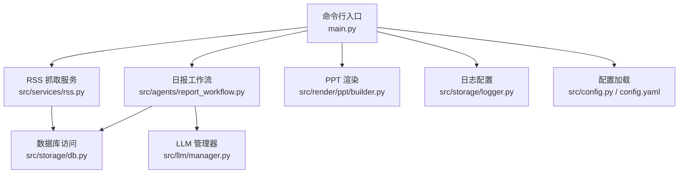
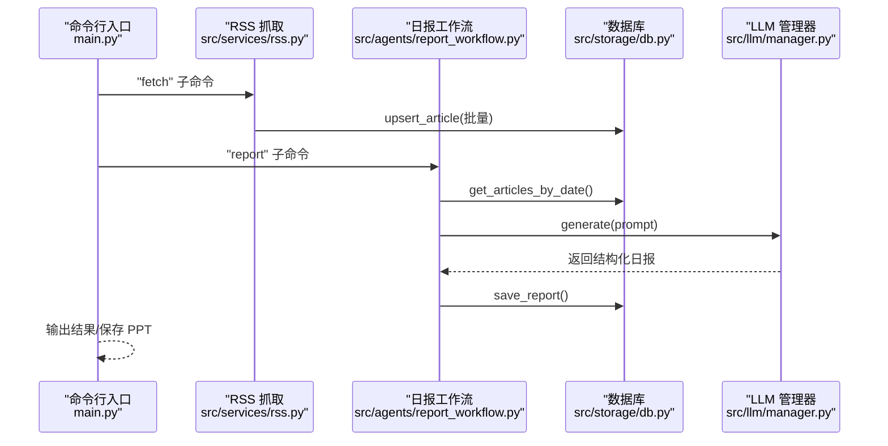
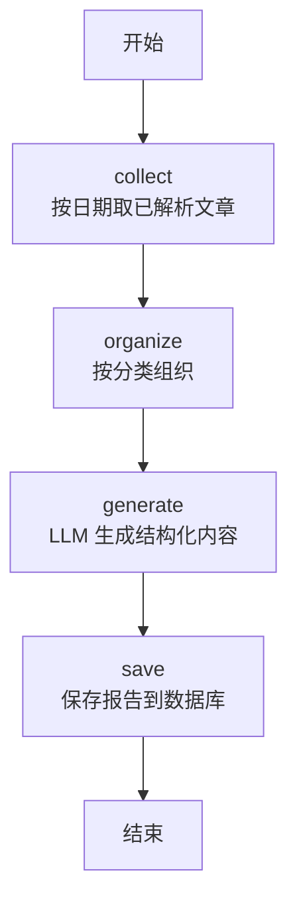
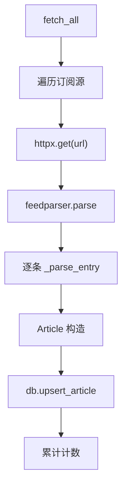
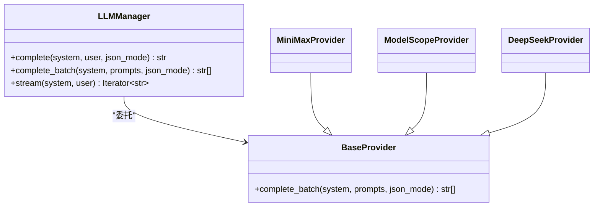
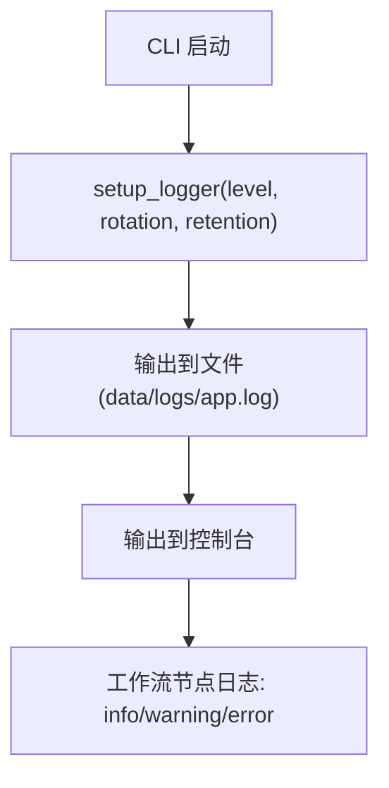
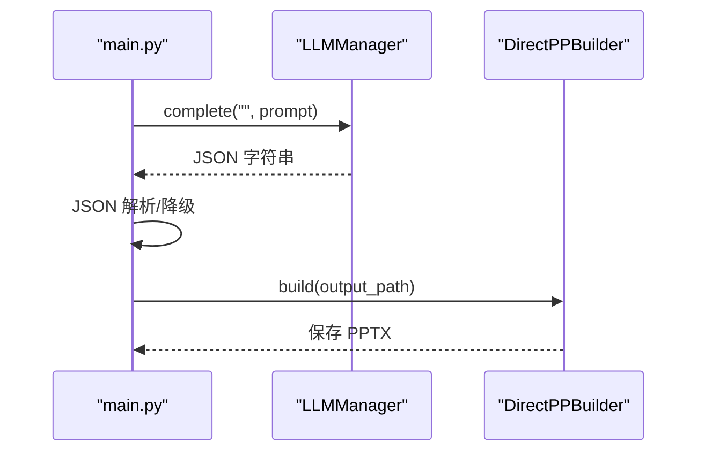
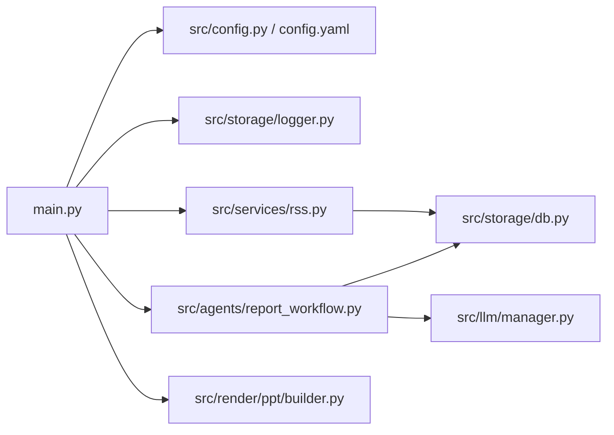

# 工作流调试与监控

<cite>
**本文引用的文件**
- [main.py](file://main.py)
- [src/storage/logger.py](file://src/storage/logger.py)
- [src/agents/report_workflow.py](file://src/agents/report_workflow.py)
- [src/storage/db.py](file://src/storage/db.py)
- [src/services/rss.py](file://src/services/rss.py)
- [src/config.py](file://src/config.py)
- [src/llm/manager.py](file://src/llm/manager.py)
- [src/render/ppt/builder.py](file://src/render/ppt/builder.py)
- [config.yaml](file://config.yaml)
- [README.md](file://README.md)
</cite>

## 目录
1. [简介](#简介)
2. [项目结构](#项目结构)
3. [核心组件](#核心组件)
4. [架构总览](#架构总览)
5. [详细组件分析](#详细组件分析)
6. [依赖关系分析](#依赖关系分析)
7. [性能考量](#性能考量)
8. [故障排除指南](#故障排除指南)
9. [结论](#结论)
10. [附录](#附录)

## 简介
本指南围绕“工作流调试与监控”展开，结合仓库中的日报生成工作流（基于 LangGraph）、RSS 抓取与解析流程、日志体系、LLM 管理器以及 PPT 渲染管线，系统阐述：
- 如何进行工作流状态检查、节点跟踪与执行路径分析
- 日志记录最佳实践（关键信息、错误追踪、性能观测）
- 工作流性能优化技巧（并发控制、资源管理、内存优化）
- 监控指标建议（执行时间、成功率、错误率等）
- 常见问题诊断与解决方案

## 项目结构
该项目采用“命令行入口 + 多模块协作”的结构，核心工作流集中在 agents 目录，数据持久化在 storage，外部服务在 services，模型调用在 llm，渲染在 render。

图表来源
- [main.py](file://main.py#L1-L227)
- [src/services/rss.py](file://src/services/rss.py#L1-L123)
- [src/agents/report_workflow.py](file://src/agents/report_workflow.py#L1-L266)
- [src/storage/db.py](file://src/storage/db.py#L1-L251)
- [src/llm/manager.py](file://src/llm/manager.py#L1-L318)
- [src/render/ppt/builder.py](file://src/render/ppt/builder.py#L1-L194)
- [src/storage/logger.py](file://src/storage/logger.py#L1-L39)
- [src/config.py](file://src/config.py#L1-L109)
- [config.yaml](file://config.yaml#L1-L54)

章节来源
- [README.md](file://README.md#L87-L148)

## 核心组件
- 命令行入口与日志初始化：负责解析 CLI 参数、设置日志级别、路由到具体子命令（抓取、解析、生成日报、生成 PPT）。
- RSS 抓取与解析：拉取订阅源、清洗 HTML、入库（upsert），为后续工作流提供输入数据。
- 日报生成工作流（LangGraph）：定义状态与节点，串联“收集→组织→生成→保存”，并以单例方式编译运行。
- 数据库层：SQLite + SQLModel，提供文章、解析结果、报告的 CRUD；启用 WAL 提升并发。
- LLM 管理器：统一接入多家模型提供商，支持单次/批量/流式调用，并内置线程池并发。
- 日志模块：基于 loguru，支持文件轮转与控制台输出。
- PPT 渲染：将结构化内容渲染为 PPTX，支持多种构建器与风格。

章节来源
- [main.py](file://main.py#L1-L227)
- [src/services/rss.py](file://src/services/rss.py#L1-L123)
- [src/agents/report_workflow.py](file://src/agents/report_workflow.py#L1-L266)
- [src/storage/db.py](file://src/storage/db.py#L1-L251)
- [src/llm/manager.py](file://src/llm/manager.py#L1-L318)
- [src/storage/logger.py](file://src/storage/logger.py#L1-L39)
- [src/render/ppt/builder.py](file://src/render/ppt/builder.py#L1-L194)
- [src/config.py](file://src/config.py#L1-L109)
- [config.yaml](file://config.yaml#L1-L54)

## 架构总览
下图展示了从 CLI 到工作流、数据库与 LLM 的整体交互：

图表来源
- [main.py](file://main.py#L66-L141)
- [src/services/rss.py](file://src/services/rss.py#L22-L60)
- [src/agents/report_workflow.py](file://src/agents/report_workflow.py#L186-L237)
- [src/storage/db.py](file://src/storage/db.py#L147-L151)
- [src/llm/manager.py](file://src/llm/manager.py#L297-L317)

## 详细组件分析

### 日报生成工作流（LangGraph）
- 状态定义：包含日期范围、文章列表、分类组织结果、生成内容、报告 ID、状态机与错误信息。
- 节点职责：
  - collect：从数据库按日期范围取已解析文章，过滤 summary_llm 非空。
  - organize：按 category 分类并排序，便于后续生成。
  - generate：拼装提示词，调用 LLM 生成结构化内容，清理<think>标签。
  - save：入库保存报告，返回 report_id。
- 执行路径：START → collect → organize → generate → save → END。
- 单例编译：工作流仅编译一次，复用以降低开销。

图表来源
- [src/agents/report_workflow.py](file://src/agents/report_workflow.py#L46-L181)
- [src/agents/report_workflow.py](file://src/agents/report_workflow.py#L186-L201)

章节来源
- [src/agents/report_workflow.py](file://src/agents/report_workflow.py#L25-L181)
- [src/agents/report_workflow.py](file://src/agents/report_workflow.py#L186-L237)

### RSS 抓取与解析
- 抓取策略：遍历配置的订阅源，使用 httpx 请求，feedparser 解析，逐条清洗 HTML、提取标签与发布时间。
- 入库策略：Article 去重（按 url），存在则更新，否则插入；批量 upsert。
- 错误处理：网络异常、解析异常均记录日志并跳过该源。

图表来源
- [src/services/rss.py](file://src/services/rss.py#L22-L60)
- [src/services/rss.py](file://src/services/rss.py#L62-L107)
- [src/storage/db.py](file://src/storage/db.py#L97-L122)

章节来源
- [src/services/rss.py](file://src/services/rss.py#L15-L123)
- [src/storage/db.py](file://src/storage/db.py#L97-L122)

### LLM 管理器与并发
- 协议与基类：统一 complete/complete_batch/stream 接口，Batch 默认使用线程池并发执行。
- 多提供商：MiniMax、ModelScope、DeepSeek，按配置或环境变量选择。
- 批量推理：默认最大并发 10，可根据需求调整；记录成功/失败计数。

图表来源
- [src/llm/manager.py](file://src/llm/manager.py#L22-L63)
- [src/llm/manager.py](file://src/llm/manager.py#L106-L158)
- [src/llm/manager.py](file://src/llm/manager.py#L160-L202)
- [src/llm/manager.py](file://src/llm/manager.py#L206-L317)

章节来源
- [src/llm/manager.py](file://src/llm/manager.py#L45-L63)
- [src/llm/manager.py](file://src/llm/manager.py#L253-L295)

### 日志与监控
- 日志配置：移除默认处理器，同时输出到文件与控制台，支持按大小轮转与保留天数。
- 工作流日志：在每个节点记录开始/结束、关键计数与错误，便于定位阻塞点。
- CLI 日志：根据 --verbose 切换日志级别，便于调试。

图表来源
- [src/storage/logger.py](file://src/storage/logger.py#L8-L38)
- [main.py](file://main.py#L54-L63)
- [src/agents/report_workflow.py](file://src/agents/report_workflow.py#L48-L61)

章节来源
- [src/storage/logger.py](file://src/storage/logger.py#L1-L39)
- [main.py](file://main.py#L54-L63)
- [src/agents/report_workflow.py](file://src/agents/report_workflow.py#L46-L181)

### PPT 渲染与降级
- 结构化提示词：通过 LLM 将日报内容拆分为幻灯片结构，若 JSON 解析失败则回退到简单拆分。
- 渲染器：DirectPPBuilder 将结构化数据渲染为 PPTX，支持添加备注与样式。

图表来源
- [main.py](file://main.py#L143-L188)
- [src/render/ppt/builder.py](file://src/render/ppt/builder.py#L75-L83)
- [src/llm/manager.py](file://src/llm/manager.py#L297-L317)

章节来源
- [main.py](file://main.py#L143-L205)
- [src/render/ppt/builder.py](file://src/render/ppt/builder.py#L1-L194)

## 依赖关系分析
- 组件耦合：
  - main.py 依赖配置加载、日志、RSS、LLM、数据库与工作流。
  - 工作流依赖数据库与 LLM 管理器，状态机清晰，节点职责单一。
  - RSS 依赖配置与数据库，解析过程健壮。
- 外部依赖：
  - feedparser、httpx、sqlmodel、loguru、openai/requests 等。
- 潜在循环依赖：未发现直接循环导入；模块间通过函数接口耦合。

图表来源
- [main.py](file://main.py#L14-L20)
- [src/agents/report_workflow.py](file://src/agents/report_workflow.py#L19-L21)
- [src/services/rss.py](file://src/services/rss.py#L10-L12)
- [src/storage/db.py](file://src/storage/db.py#L8-L9)
- [src/llm/manager.py](file://src/llm/manager.py#L17-L17)
- [src/config.py](file://src/config.py#L74-L88)
- [config.yaml](file://config.yaml#L1-L54)

章节来源
- [main.py](file://main.py#L14-L20)
- [src/agents/report_workflow.py](file://src/agents/report_workflow.py#L19-L21)
- [src/services/rss.py](file://src/services/rss.py#L10-L12)
- [src/storage/db.py](file://src/storage/db.py#L8-L9)
- [src/llm/manager.py](file://src/llm/manager.py#L17-L17)
- [src/config.py](file://src/config.py#L74-L88)
- [config.yaml](file://config.yaml#L1-L54)

## 性能考量
- 并发控制
  - LLM 批量推理默认线程池上限 10，可根据 API 限流与资源情况调整。
  - RSS 抓取为串行遍历订阅源，可在外部加队列/并发调度（当前版本为顺序执行）。
- 资源管理
  - 数据库启用 WAL 模式与超时，提升并发读写稳定性。
  - 日志文件按大小轮转，避免磁盘占用过大。
- 内存优化
  - 工作流按节点推进，状态字段明确，避免在节点间传递大对象。
  - RSS 解析仅提取必要字段，限制摘要/正文长度，减少内存压力。
- I/O 优化
  - 批量 upsert 减少事务次数；PPT 渲染前先做结构化，避免重复计算。

章节来源
- [src/llm/manager.py](file://src/llm/manager.py#L57-L62)
- [src/storage/db.py](file://src/storage/db.py#L72-L90)
- [src/storage/logger.py](file://src/storage/logger.py#L20-L29)
- [src/services/rss.py](file://src/services/rss.py#L56-L59)

## 故障排除指南
- 工作流卡在某个节点
  - 检查对应节点日志（info/warning/error），确认上游是否返回空数据或异常。
  - 若 collect 返回空，检查数据库中对应日期的文章是否已解析（summary_llm 非空）。
- LLM 调用失败
  - 检查配置文件与环境变量是否正确加载；查看 LLMProvider 初始化日志。
  - 若批量推理部分失败，关注线程池日志中的成功/失败计数。
- 数据库写入失败
  - 检查 WAL 模式与 busy_timeout 设置；确认 SQLite 文件权限与磁盘空间。
- RSS 抓取异常
  - 检查订阅源 URL 可达性、HTTP 状态码与 feedparser bozo 异常。
  - 调整超时与重试策略（当前版本未内置重试）。
- PPT 生成失败
  - 若 LLM 返回非 JSON，触发降级逻辑；检查降级输出是否可用。
  - 确认输出目录存在且有写权限。

章节来源
- [src/agents/report_workflow.py](file://src/agents/report_workflow.py#L48-L61)
- [src/agents/report_workflow.py](file://src/agents/report_workflow.py#L167-L181)
- [src/llm/manager.py](file://src/llm/manager.py#L276-L280)
- [src/storage/db.py](file://src/storage/db.py#L84-L90)
- [src/services/rss.py](file://src/services/rss.py#L37-L48)
- [main.py](file://main.py#L156-L162)

## 结论
本项目通过清晰的状态机与日志体系，提供了可调试、可观测的工作流实现。结合数据库 WAL、线程池并发与日志轮转，能够在生产环境中稳定运行。建议在现有基础上进一步引入：
- 工作流链路追踪与指标上报（执行时间、吞吐、错误率）
- RSS 抓取的指数退避与重试机制
- LLM 调用的超时与熔断策略
- PPT 渲染的异步化与缓存

## 附录
- CLI 常用命令
  - 抓取：fetch（可选 feed_name 与 --verbose）
  - 解析：parse（可选 --limit 与 --verbose）
  - 生成日报：report（日期参数、--output/--ppt/--builder/--verbose）
  - 启动服务：serve（占位，当前未实现）
- 配置要点
  - LLM 提供商与模型、RSS 订阅源、数据库路径、日志轮转与保留策略、调度时间

章节来源
- [main.py](file://main.py#L66-L141)
- [config.yaml](file://config.yaml#L1-L54)
- [README.md](file://README.md#L78-L86)