# 节点实现指南

<cite>
**本文档引用的文件**
- [README.md](file://README.md)
- [main.py](file://main.py)
- [src/config.py](file://src/config.py)
- [src/agents/article_parser_langgraph.py](file://src/agents/article_parser_langgraph.py)
- [src/agents/report_workflow.py](file://src/agents/report_workflow.py)
- [src/agents/image_gen_workflow.py](file://src/agents/image_gen_workflow.py)
- [src/agents/__init__.py](file://src/agents/__init__.py)
- [src/storage/db.py](file://src/storage/db.py)
- [src/services/rss.py](file://src/services/rss.py)
- [src/models/llm/manager.py](file://src/models/llm/manager.py)
- [src/storage/logger.py](file://src/storage/logger.py)
</cite>

## 目录
1. [简介](#简介)
2. [项目结构](#项目结构)
3. [核心组件](#核心组件)
4. [架构总览](#架构总览)
5. [详细组件分析](#详细组件分析)
6. [节点类型详解](#节点类型详解)
7. [节点实现标准模式](#节点实现标准模式)
8. [状态管理机制](#状态管理机制)
9. [节点间通信机制](#节点间通信机制)
10. [调试技巧](#调试技巧)
11. [性能考虑](#性能考虑)
12. [故障排除指南](#故障排除指南)
13. [结论](#结论)

## 简介

Brief Agent 是一个基于 LangGraph 的多模态内容自动生成与分发系统。该系统通过节点化的处理流程实现RSS内容的采集、解析、分析和报告生成。本文档详细说明了节点函数的标准实现模式，包括参数接收、状态访问、业务逻辑处理和状态返回。

## 项目结构

该项目采用模块化架构，主要包含以下核心模块：

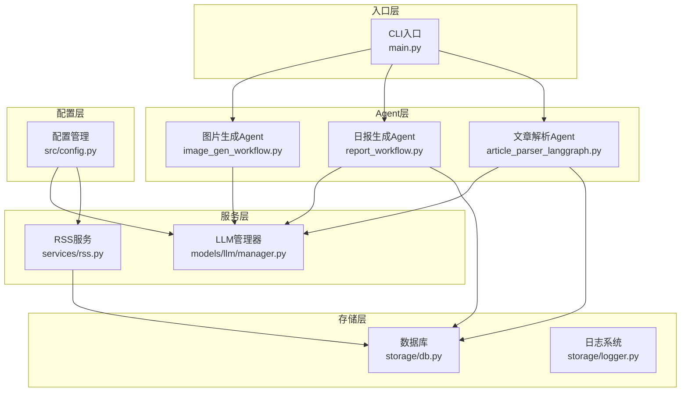

**图表来源**
- [main.py](file://main.py#L1-L227)
- [src/agents/article_parser_langgraph.py](file://src/agents/article_parser_langgraph.py#L1-L241)
- [src/agents/report_workflow.py](file://src/agents/report_workflow.py#L1-L266)
- [src/agents/image_gen_workflow.py](file://src/agents/image_gen_workflow.py#L1-L198)

**章节来源**
- [README.md](file://README.md#L87-L148)
- [main.py](file://main.py#L1-L227)

## 核心组件

### LLM管理器
统一的LLM管理器支持多种提供商，提供标准化的接口用于文本生成、批量推理和流式生成。

### 数据库管理
基于SQLModel的ORM层，提供文章、分析结果和报告的数据持久化能力。

### RSS服务
负责RSS源的抓取、解析和存储，支持定时任务调度。

### 日志系统
基于loguru的日志管理，支持文件输出和控制台输出。

**章节来源**
- [src/models/llm/manager.py](file://src/models/llm/manager.py#L1-L318)
- [src/storage/db.py](file://src/storage/db.py#L1-L251)
- [src/services/rss.py](file://src/services/rss.py#L1-L123)
- [src/storage/logger.py](file://src/storage/logger.py#L1-L39)

## 架构总览

系统采用LangGraph实现的状态机架构，每个Agent由多个节点组成，通过状态传递实现数据流转：

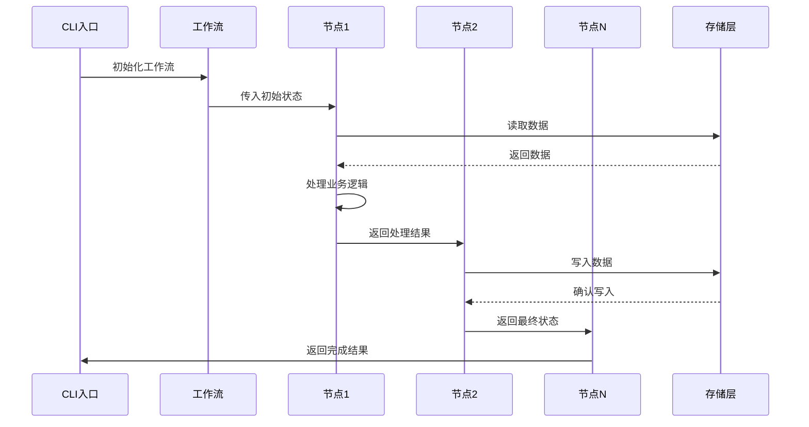

**图表来源**
- [src/agents/article_parser_langgraph.py](file://src/agents/article_parser_langgraph.py#L156-L207)
- [src/agents/report_workflow.py](file://src/agents/report_workflow.py#L186-L213)

## 详细组件分析

### 文章解析Agent

文章解析Agent实现了从数据加载到结果保存的完整流程，展示了典型的三节点工作流模式。

#### 状态定义
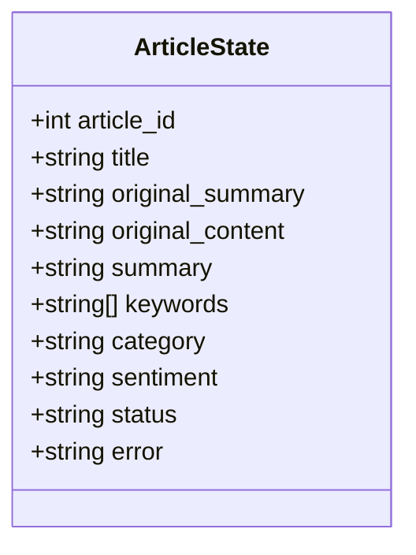

**图表来源**
- [src/agents/article_parser_langgraph.py](file://src/agents/article_parser_langgraph.py#L26-L42)

#### 节点函数实现

**数据加载节点** (`load_article`)
- 接收：`ArticleState`，包含`article_id`
- 处理：从数据库获取文章详情
- 返回：更新`title`、`original_summary`、`original_content`和`status`

**解析节点** (`parse_article`)
- 接收：包含原始数据的`ArticleState`
- 处理：调用LLM进行内容分析，提取摘要、关键词、分类和情感
- 返回：更新分析结果和`status`

**保存节点** (`save_result`)
- 接收：包含分析结果的`ArticleState`
- 处理：将结果保存到`article_analysis`表
- 返回：设置`status`为`completed`

**章节来源**
- [src/agents/article_parser_langgraph.py](file://src/agents/article_parser_langgraph.py#L66-L152)

### 日报生成Agent

日报生成Agent展示了更复杂的状态管理和多步骤处理流程。

#### 状态定义
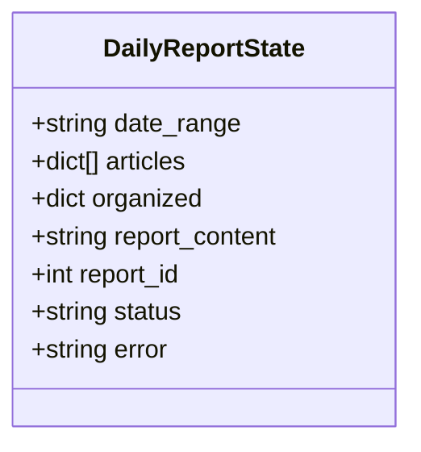

**图表来源**
- [src/agents/report_workflow.py](file://src/agents/report_workflow.py#L27-L36)

#### 节点函数实现

**收集节点** (`collect_articles`)
- 功能：从数据库获取指定日期范围的已解析文章
- 处理：过滤只有有效解析结果的文章
- 返回：更新`articles`列表和`status`

**组织节点** (`organize_articles`)
- 功能：按分类对文章进行组织和排序
- 处理：将文章按`category`字段分组
- 返回：更新`organized`字典和`status`

**生成节点** (`generate_report`)
- 功能：使用LLM生成结构化的日报内容
- 处理：构建提示词，调用LLM生成内容
- 返回：更新`report_content`和`status`

**保存节点** (`save_report`)
- 功能：将生成的日报保存到数据库
- 处理：调用数据库接口保存报告
- 返回：设置`report_id`和`status`

**章节来源**
- [src/agents/report_workflow.py](file://src/agents/report_workflow.py#L46-L182)

### 图片生成Agent

图片生成Agent展示了处理节点的特点，专注于特定业务逻辑的实现。

#### 核心功能
- **提示词分析**：根据内容关键词匹配合适的图片风格
- **批量生成**：支持一次生成多张图片
- **错误处理**：提供详细的生成状态反馈

**章节来源**
- [src/agents/image_gen_workflow.py](file://src/agents/image_gen_workflow.py#L48-L140)

## 节点类型详解

### 数据加载节点
负责从外部数据源或存储中获取数据，是工作流的起点。

**典型特征**：
- 接收：工作流输入参数
- 处理：数据检索、验证
- 返回：更新后的状态对象

**实现要点**：
- 参数校验和错误处理
- 数据完整性检查
- 状态初始化

### 处理节点
执行核心业务逻辑，对数据进行转换、分析或计算。

**典型特征**：
- 接收：前一节点的处理结果
- 处理：业务逻辑处理
- 返回：处理后的状态对象

**实现要点**：
- 输入验证
- 业务逻辑封装
- 结果格式化

### 保存节点
将处理结果持久化到存储系统。

**典型特征**：
- 接收：处理完成的状态
- 处理：数据写入
- 返回：确认状态

**实现要点**：
- 事务处理
- 错误回滚
- 状态确认

### 决策节点
根据条件选择不同的执行路径（在当前代码中未直接体现，但可通过状态判断实现）

**实现模式**：
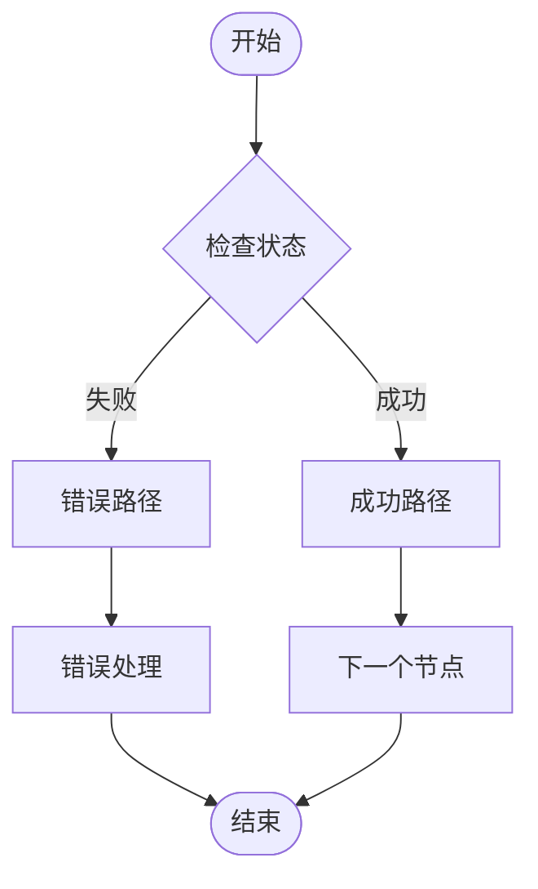

## 节点实现标准模式

### 参数接收模式
所有节点函数都遵循统一的参数签名：

```python
def node_function(state: StateType) -> StateType:
    """节点函数标准实现模式
    
    Args:
        state: 输入状态对象
        
    Returns:
        更新后的状态对象
    """
    # 1. 参数验证
    if state.get("status") == "failed":
        return state
    
    # 2. 业务逻辑处理
    # ... 具体业务逻辑 ...
    
    # 3. 状态更新
    return {"status": "processed", ...}
```

### 状态访问模式
节点函数通过字典访问状态属性：

```python
# 访问输入状态
input_value = state["key"]

# 检查状态
if state.get("status") == "failed":
    return state

# 更新状态
return {"status": "completed", "result": processed_data}
```

### 业务逻辑处理模式
```python
def business_logic(state: StateType) -> StateType:
    # 1. 获取必需数据
    required_data = state["required_key"]
    
    # 2. 执行业务处理
    result = perform_business_operation(required_data)
    
    # 3. 格式化输出
    formatted_result = format_output(result)
    
    # 4. 返回状态
    return {"processed_data": formatted_result, "status": "processed"}
```

### 状态返回模式
节点函数必须返回完整的状态对象：

```python
# 成功返回
return {
    "status": "completed",
    "result": processed_data,
    "timestamp": current_timestamp
}

# 失败返回
return {
    "status": "failed",
    "error": str(error),
    "timestamp": current_timestamp
}
```

**章节来源**
- [src/agents/article_parser_langgraph.py](file://src/agents/article_parser_langgraph.py#L66-L152)
- [src/agents/report_workflow.py](file://src/agents/report_workflow.py#L46-L182)

## 状态管理机制

### 状态生命周期
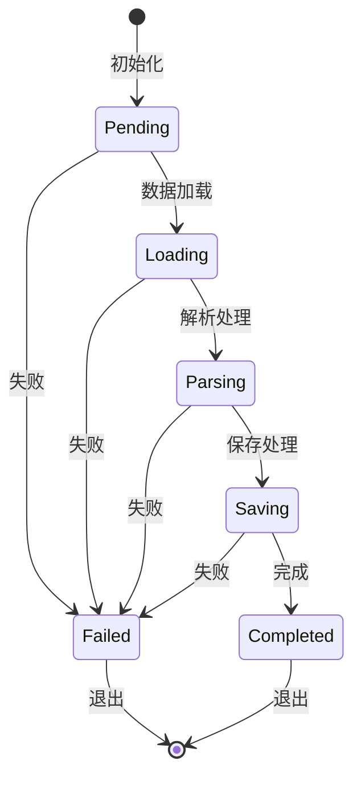

### 状态字段设计
每个状态对象包含以下标准字段：

| 字段名 | 类型 | 用途 | 必填 |
|--------|------|------|------|
| `status` | string | 节点执行状态 | ✓ |
| `error` | string | 错误信息 | ✗ |
| `timestamp` | string | 时间戳 | ✗ |

### 状态传播机制
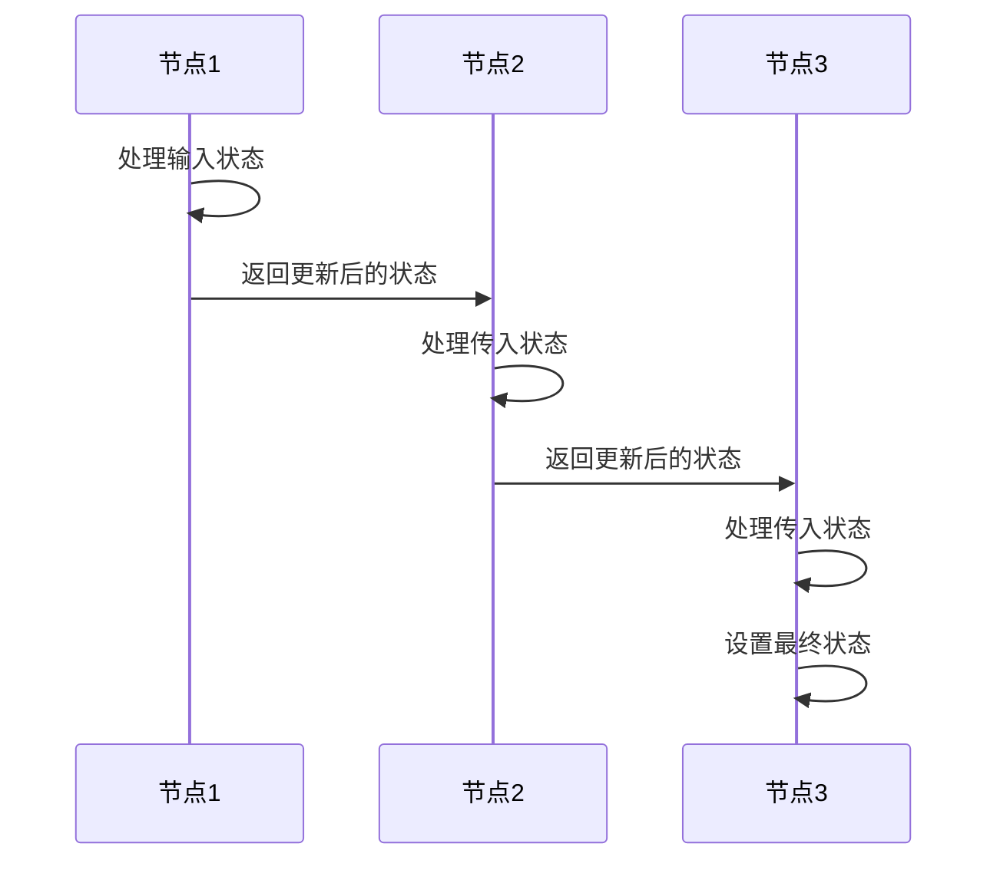

**章节来源**
- [src/agents/article_parser_langgraph.py](file://src/agents/article_parser_langgraph.py#L26-L42)
- [src/agents/report_workflow.py](file://src/agents/report_workflow.py#L27-L36)

## 节点间通信机制

### 状态传递
节点间通过状态对象进行数据传递，每个节点只关心自己需要的数据：

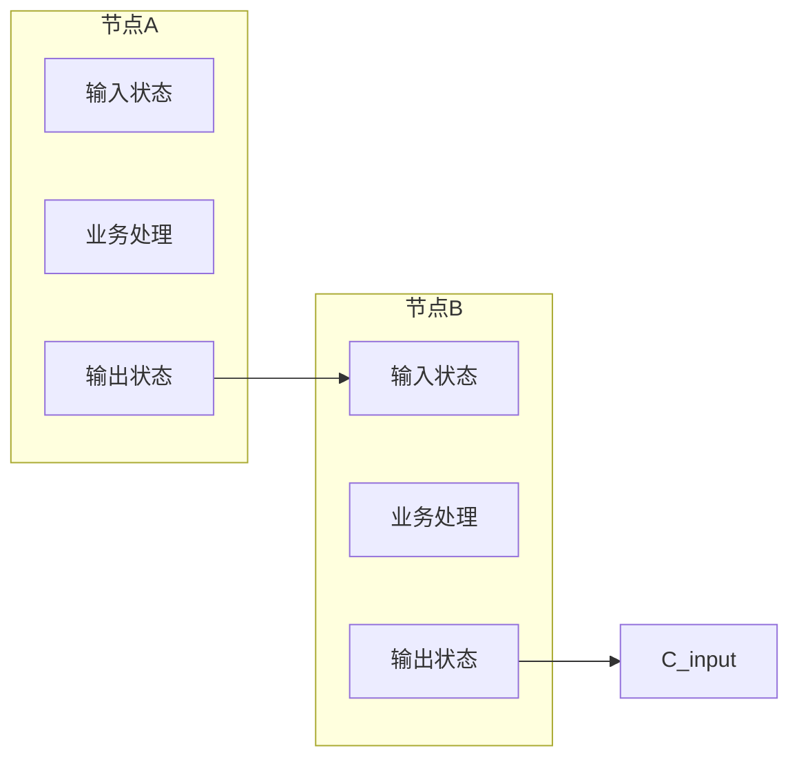

### 数据共享策略
- **显式传递**：通过状态对象显式传递所需数据
- **全局访问**：通过工厂函数访问全局服务实例
- **缓存机制**：利用单例模式缓存昂贵的资源

### 错误传播机制
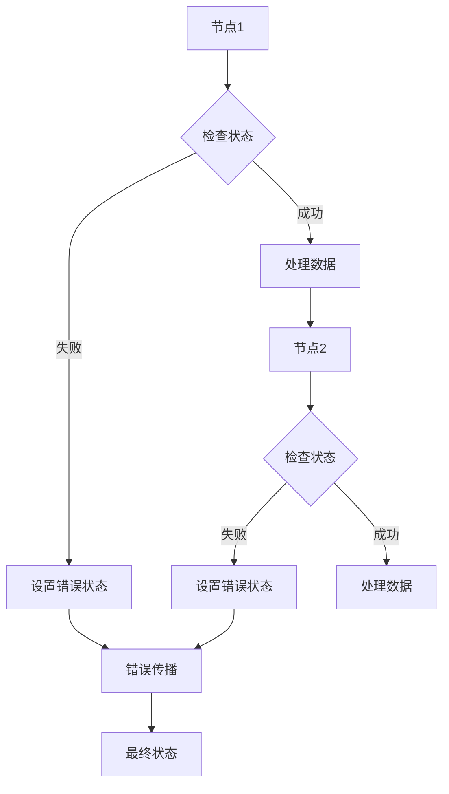

**章节来源**
- [src/agents/article_parser_langgraph.py](file://src/agents/article_parser_langgraph.py#L83-L84)
- [src/agents/report_workflow.py](file://src/agents/report_workflow.py#L68-L69)

## 调试技巧

### 状态检查
```python
def debug_state(state: dict, node_name: str):
    """调试状态检查工具"""
    print(f"=== {node_name} 状态检查 ===")
    print(f"状态: {state.get('status')}")
    print(f"错误: {state.get('error', 'None')}")
    print(f"可用字段: {list(state.keys())}")
    print("========================")
```

### 日志记录最佳实践
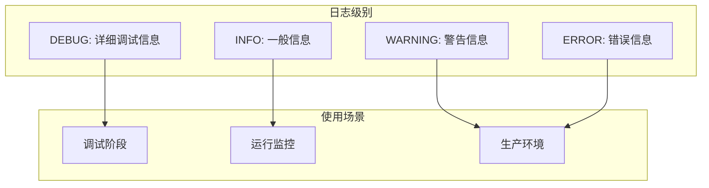

### 错误捕获策略
```python
def robust_node_function(state: StateType) -> StateType:
    """健壮的节点实现模式"""
    try:
        # 业务逻辑
        result = risky_operation()
        return {"status": "completed", "result": result}
    except ValueError as e:
        # 参数错误
        return {"status": "failed", "error": f"参数错误: {str(e)}"}
    except ConnectionError as e:
        # 连接错误
        return {"status": "failed", "error": f"连接失败: {str(e)}"}
    except Exception as e:
        # 未知错误
        return {"status": "failed", "error": f"未知错误: {str(e)}"}
```

### 性能监控
```python
import time
from functools import wraps

def timing_decorator(func):
    @wraps(func)
    def wrapper(*args, **kwargs):
        start_time = time.time()
        result = func(*args, **kwargs)
        end_time = time.time()
        print(f"{func.__name__} 执行时间: {end_time - start_time:.2f}s")
        return result
    return wrapper
```

**章节来源**
- [src/storage/logger.py](file://src/storage/logger.py#L1-L39)
- [src/agents/article_parser_langgraph.py](file://src/agents/article_parser_langgraph.py#L126-L131)

## 性能考虑

### 并发处理
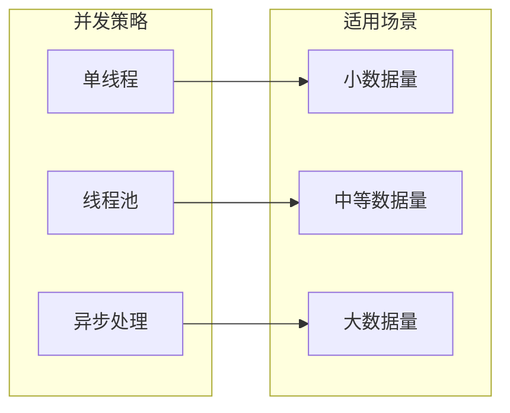

### 缓存机制
- **LLM结果缓存**：避免重复的API调用
- **数据库连接池**：复用数据库连接
- **状态缓存**：缓存昂贵的计算结果

### 内存管理
```python
def memory_efficient_node(state: StateType) -> StateType:
    """内存高效的节点实现"""
    # 1. 及时释放不需要的大对象
    large_data = get_large_data()
    processed_data = process_data(large_data)
    del large_data  # 显式删除
    
    # 2. 使用生成器处理大数据
    for item in process_large_dataset():
        yield item
    
    # 3. 返回必要的状态信息
    return {"status": "completed", "processed_count": len(processed_data)}
```

## 故障排除指南

### 常见错误类型

**配置错误**
- LLM API密钥配置错误
- 数据库连接字符串格式错误
- 环境变量未正确设置

**数据错误**
- 缺失必需字段
- 数据类型不匹配
- 数据范围超出限制

**网络错误**
- API调用超时
- 网络连接中断
- 服务器响应错误

### 错误处理模式
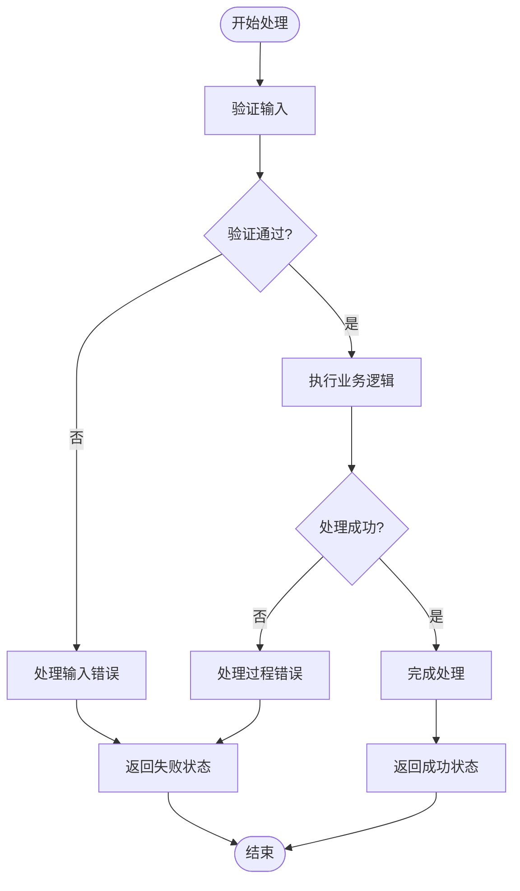

### 调试工具
```python
def comprehensive_debug(state: StateType, node_name: str):
    """综合调试工具"""
    print(f"节点: {node_name}")
    print(f"输入状态: {state}")
    print(f"状态类型: {type(state)}")
    print(f"状态长度: {len(state) if hasattr(state, '__len__') else 'N/A'}")
    
    # 检查关键字段
    required_fields = ['status', 'error']
    for field in required_fields:
        if field in state:
            print(f"{field}: {state[field]}")
        else:
            print(f"缺失字段: {field}")
```

**章节来源**
- [src/agents/article_parser_langgraph.py](file://src/agents/article_parser_langgraph.py#L126-L131)
- [src/agents/report_workflow.py](file://src/agents/report_workflow.py#L59-L61)

## 结论

本文档详细介绍了Brief Agent中节点实现的标准模式和最佳实践。通过分析文章解析Agent、日报生成Agent和图片生成Agent的实现，我们可以总结出以下关键要点：

1. **统一的节点接口**：所有节点函数都遵循相同的参数和返回模式
2. **状态驱动的架构**：通过状态对象实现节点间的解耦和数据传递
3. **错误处理机制**：完善的错误捕获和状态传播机制
4. **性能优化策略**：并发处理、缓存机制和内存管理
5. **调试支持**：全面的日志记录和状态检查工具

这些模式不仅适用于当前的Agent实现，也为未来的扩展和维护提供了清晰的指导原则。通过遵循这些标准，开发者可以快速理解和实现新的节点功能，同时保持系统的稳定性和可维护性。