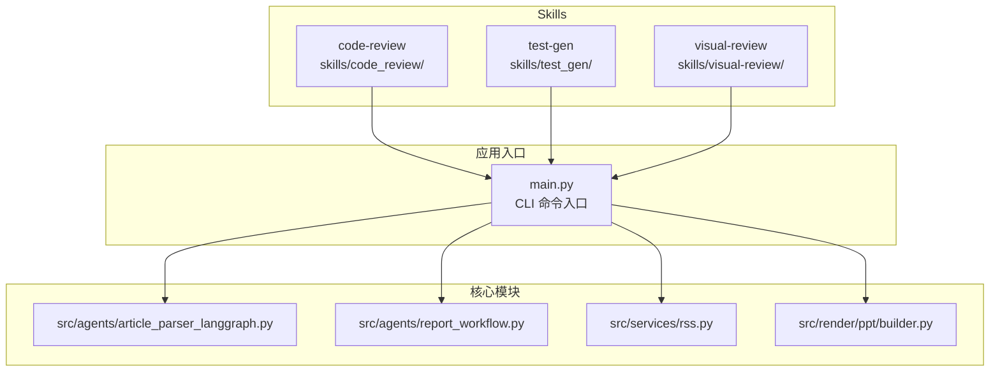
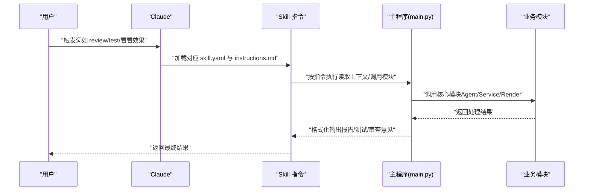
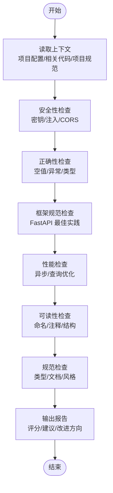
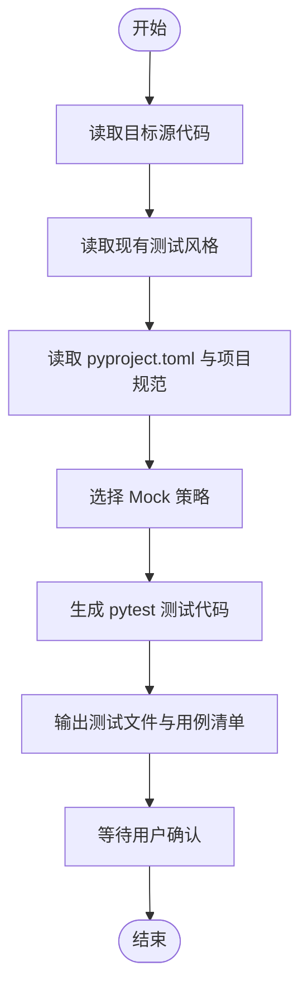
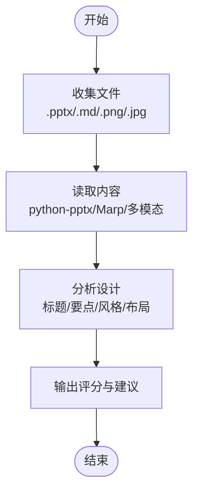
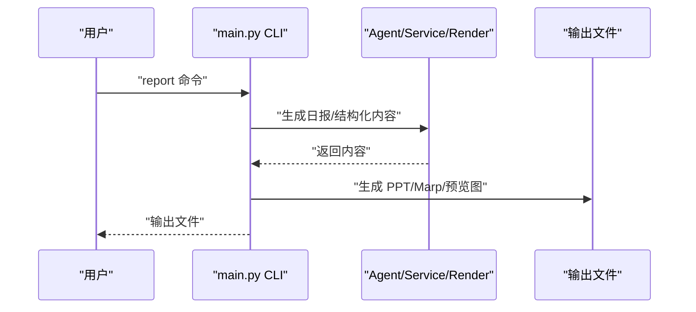
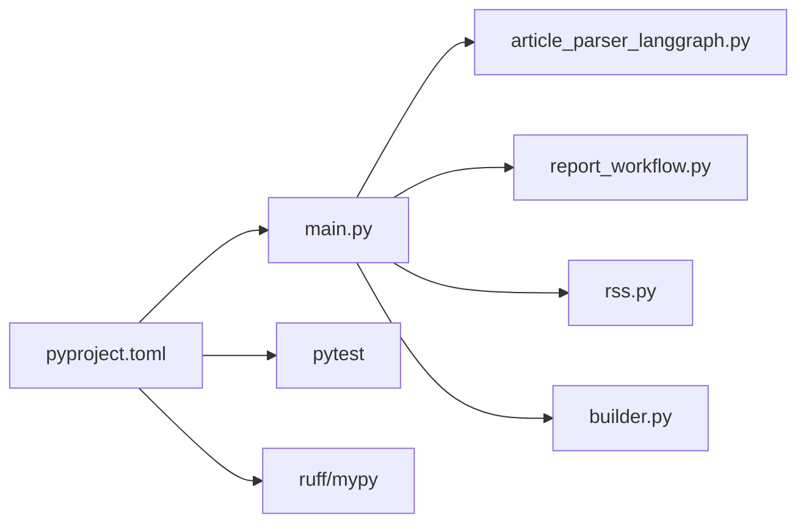

# Claude Code Skills 扩展开发

<cite>
**本文引用的文件**
- [skills/code_review/instructions.md](file://skills/code_review/instructions.md)
- [skills/code_review/skill.yaml](file://skills/code_review/skill.yaml)
- [skills/test_gen/instructions.md](file://skills/test_gen/instructions.md)
- [skills/test_gen/skill.yaml](file://skills/test_gen/skill.yaml)
- [skills/visual-review/instructions.md](file://skills/visual-review/instructions.md)
- [skills/visual-review/skill.yaml](file://skills/visual-review/skill.yaml)
- [CLAUDE.md](file://CLAUDE.md)
- [README.md](file://README.md)
- [main.py](file://main.py)
- [pyproject.toml](file://pyproject.toml)
- [config.yaml](file://config.yaml)
- [src/agents/article_parser_langgraph.py](file://src/agents/article_parser_langgraph.py)
- [src/agents/report_workflow.py](file://src/agents/report_workflow.py)
- [src/render/ppt/builder.py](file://src/render/ppt/builder.py)
- [src/services/rss.py](file://src/services/rss.py)
</cite>

## 目录
1. [简介](#简介)
2. [项目结构](#项目结构)
3. [核心组件](#核心组件)
4. [架构总览](#架构总览)
5. [详细组件分析](#详细组件分析)
6. [依赖分析](#依赖分析)
7. [性能考量](#性能考量)
8. [故障排查指南](#故障排查指南)
9. [结论](#结论)
10. [附录](#附录)

## 简介
本指南面向希望基于 Claude Code Skills 扩展开发的工程师，系统讲解 Skills 的基本结构、配置与调用接口设计，以及三类典型 Skills 的实现要点与扩展方法。内容涵盖：
- Skills 基本结构：instructions.md 指令文件编写规范、skill.yaml 配置文件格式要求、调用接口设计
- 不同类型 Skills 的特点：code-review 的代码审查逻辑、test-gen 的测试生成算法、visual-review 的视觉分析方法
- 新增 Skills 的开发流程：指令设计原则、参数定义、输出格式规范
- 完整扩展示例：自定义指令编写、配置文件更新、测试验证
- 部署方法、调用机制与性能优化建议

## 项目结构
该项目围绕“RSS 内容采集 → AI 分析 → 报告生成 → PPT/视频渲染”的主流程展开，Skills 位于 skills/ 目录，分别对应三种能力：
- code-review：代码审查
- test-gen：测试生成
- visual-review：视觉审查

**图表来源**
- [main.py](file://main.py#L1-L227)
- [skills/code_review/skill.yaml](file://skills/code_review/skill.yaml#L1-L4)
- [skills/test_gen/skill.yaml](file://skills/test_gen/skill.yaml#L1-L4)
- [skills/visual-review/skill.yaml](file://skills/visual-review/skill.yaml#L1-L4)

**章节来源**
- [README.md](file://README.md#L87-L148)
- [CLAUDE.md](file://CLAUDE.md#L125-L166)

## 核心组件
- Skills 目录结构
  - code-review：包含 instructions.md 与 skill.yaml
  - test-gen：包含 instructions.md 与 skill.yaml
  - visual-review：包含 instructions.md 与 skill.yaml
- 指令文件（instructions.md）用于定义 Skills 的行为准则、上下文感知、检查规则、输出格式与最佳实践
- 配置文件（skill.yaml）用于声明技能名称、描述与指令文件路径
- CLI 入口（main.py）提供 fetch、parse、report、serve 等命令，支撑 Skills 的触发与集成

**章节来源**
- [skills/code_review/instructions.md](file://skills/code_review/instructions.md#L1-L664)
- [skills/code_review/skill.yaml](file://skills/code_review/skill.yaml#L1-L4)
- [skills/test_gen/instructions.md](file://skills/test_gen/instructions.md#L1-L262)
- [skills/test_gen/skill.yaml](file://skills/test_gen/skill.yaml#L1-L4)
- [skills/visual-review/instructions.md](file://skills/visual-review/instructions.md#L1-L223)
- [skills/visual-review/skill.yaml](file://skills/visual-review/skill.yaml#L1-L4)
- [main.py](file://main.py#L1-L227)

## 架构总览
Skills 的调用与集成遵循“触发词 → 加载指令 → 执行逻辑 → 输出结果”的通用流程。不同 Skills 的执行侧重点不同：
- code-review：基于上下文读取项目配置、相关代码与规范，执行安全、正确性、性能、可读性与规范检查
- test-gen：基于目标源代码与现有测试风格，生成 pytest 测试代码，包含 Mock 策略
- visual-review：基于生成的 PPT/Marp/预览图，进行布局、视觉层次、内容呈现与设计一致性的分析

**图表来源**
- [skills/code_review/skill.yaml](file://skills/code_review/skill.yaml#L1-L4)
- [skills/test_gen/skill.yaml](file://skills/test_gen/skill.yaml#L1-L4)
- [skills/visual-review/skill.yaml](file://skills/visual-review/skill.yaml#L1-L4)
- [main.py](file://main.py#L1-L227)

## 详细组件分析

### code-review 技能
- 指令文件要点
  - 审查范围与优先级：安全性（30%）、正确性（30%）、性能（20%）、可读性（10%）、规范（10%）
  - 上下文感知：项目配置、相关代码、项目规范
  - 审查规则：安全（密钥泄露、代码注入、命令注入、SQL 注入、路径遍历、敏感泄露、弱加密）、正确性（空值风险、异常处理、资源泄漏、逻辑错误、线程安全、类型错误、边界条件）、性能（重复计算、N+1 查询、内存复制、循环 IO、过度递归）、Python 特有规范（类型比较、None 比较、可变默认、裸 except、魔法数字、导出控制）
  - 修复建议格式：坏示例 → 好示例，提供具体代码片段
  - 输出格式：概览、高风险/中风险/低风险分类、良好实践、总体评分与主要改进方向
  - FastAPI 专项：路径参数验证、响应模型、Pydantic V2 语法、依赖注入安全、异常处理统一、CORS 配置、异步最佳实践、安全配置、API 版本控制、统一响应格式、文档与元数据
  - 适度原则：按项目阶段与场景灵活调整严格度，避免过度设计
- 指令文件路径
  - [skills/code_review/instructions.md](file://skills/code_review/instructions.md#L1-L664)
- 配置文件
  - [skills/code_review/skill.yaml](file://skills/code_review/skill.yaml#L1-L4)

**图表来源**
- [skills/code_review/instructions.md](file://skills/code_review/instructions.md#L39-L664)

**章节来源**
- [skills/code_review/instructions.md](file://skills/code_review/instructions.md#L1-L664)
- [skills/code_review/skill.yaml](file://skills/code_review/skill.yaml#L1-L4)

### test-gen 技能
- 指令文件要点
  - 核心原则：只测核心路径、只生成不运行、遵循项目规范
  - 测试范围优先级：Agents > Services > Storage > Render > Utils
  - 测试文件规范：文件命名、测试类与函数命名规范
  - 上下文感知：目标源代码、现有测试、pyproject.toml、项目规范
  - Mock 策略：LLM 调用、RSS 抓取、文件操作、数据库（SQLite 内存模式）
  - 测试模板：Agent 测试模板、Service 测试模板、PPT 生成测试模板
  - 输出格式：目标模块、测试文件、测试用例清单与完整测试代码
  - 行为准则：先读后写、核心优先、可运行、简洁、等待确认
- 指令文件路径
  - [skills/test_gen/instructions.md](file://skills/test_gen/instructions.md#L1-L262)
- 配置文件
  - [skills/test_gen/skill.yaml](file://skills/test_gen/skill.yaml#L1-L4)

**图表来源**
- [skills/test_gen/instructions.md](file://skills/test_gen/instructions.md#L60-L262)

**章节来源**
- [skills/test_gen/instructions.md](file://skills/test_gen/instructions.md#L1-L262)
- [skills/test_gen/skill.yaml](file://skills/test_gen/skill.yaml#L1-L4)

### visual-review 技能
- 指令文件要点
  - 审查范围：PPT（.pptx）、Marp（.md）、预览图（.png/.jpg）
  - 审查维度：布局结构（30%）、视觉层次（25%）、内容呈现（25%）、设计一致性（20%）
  - 上下文感知：源数据（script.json、slides.json、output/）、设计规范（DirectPPBuilder、Marp 转换规则、提示词模板）、用户要求（风格偏好、目标受众、特殊要求）
  - 审查流程：收集文件 → 读取内容（python-pptx/Marp/多模态）→ 分析设计（标题/要点/风格/布局）
  - 输出格式：总体评分、优点、待改进、改进建议、具体修改方案
  - 行为准则：客观专业、建设性、有据可依、尊重风格、优先级
  - 设计原则速查：PPT 排版原则、Marp 最佳实践
- 指令文件路径
  - [skills/visual-review/instructions.md](file://skills/visual-review/instructions.md#L1-L223)
- 配置文件
  - [skills/visual-review/skill.yaml](file://skills/visual-review/skill.yaml#L1-L4)

**图表来源**
- [skills/visual-review/instructions.md](file://skills/visual-review/instructions.md#L71-L162)

**章节来源**
- [skills/visual-review/instructions.md](file://skills/visual-review/instructions.md#L1-L223)
- [skills/visual-review/skill.yaml](file://skills/visual-review/skill.yaml#L1-L4)

### 调用接口与集成点
- CLI 命令入口
  - main.py 提供 fetch、parse、report、serve 等命令，支撑 Skills 的触发与集成
  - report 命令可生成 PPT，visual-review 可在此基础上进行视觉审查
- Agent/Service/Render 模块
  - article_parser_langgraph：文章解析工作流
  - report_workflow：日报生成工作流
  - rss：RSS 抓取服务
  - render.ppt.builder：PPT 直接渲染构建器
- 调用序列示意

**图表来源**
- [main.py](file://main.py#L107-L188)
- [src/agents/article_parser_langgraph.py](file://src/agents/article_parser_langgraph.py#L185-L226)
- [src/agents/report_workflow.py](file://src/agents/report_workflow.py#L217-L237)
- [src/render/ppt/builder.py](file://src/render/ppt/builder.py#L128-L151)

**章节来源**
- [main.py](file://main.py#L1-L227)
- [src/agents/article_parser_langgraph.py](file://src/agents/article_parser_langgraph.py#L1-L241)
- [src/agents/report_workflow.py](file://src/agents/report_workflow.py#L1-L266)
- [src/render/ppt/builder.py](file://src/render/ppt/builder.py#L1-L194)
- [src/services/rss.py](file://src/services/rss.py#L1-L123)

## 依赖分析
- 项目依赖与脚本
  - pyproject.toml 定义了项目依赖、脚本入口（brief），以及开发依赖（pytest、ruff、mypy）
  - main.py 通过 typer 提供 CLI 命令，依赖 LLM 管理器、RSS 服务、Agent 工作流与渲染器
- 依赖关系示意

**图表来源**
- [pyproject.toml](file://pyproject.toml#L1-L49)
- [main.py](file://main.py#L1-L227)

**章节来源**
- [pyproject.toml](file://pyproject.toml#L1-L49)
- [main.py](file://main.py#L1-L227)

## 性能考量
- 代码审查（code-review）
  - 优先级权重分配：安全性与正确性占比较高，应优先处理
  - FastAPI 专项：统一响应模型、依赖注入安全、CORS 限制、异步最佳实践可显著降低运行时开销与安全风险
- 测试生成（test-gen）
  - 只测核心路径，减少测试运行时间；合理使用 Mock，避免真实外部依赖
  - 使用 SQLite 内存模式进行数据库测试，提高速度
- 视觉审查（visual-review）
  - PPT/Marp/图片读取应尽量缓存中间结果，避免重复解析
  - 设计一致性检查可采用规则化评分，减少复杂计算

[本节为通用指导，无需特定文件引用]

## 故障排查指南
- CLI 命令与配置
  - 确认环境变量与 config.yaml 配置正确（LLM 提供商、RSS 源、数据库、日志等）
  - 使用 CLI 命令进行最小化验证：fetch、parse、report
- 日志与错误处理
  - 使用 loguru 进行日志记录，关注 WARNING/ERROR 级别信息
  - 对 JSON 解析失败、HTTP 请求异常、文件路径错误等进行捕获与回退
- 常见问题定位
  - RSS 抓取失败：检查网络、超时设置、URL 有效性
  - Agent 工作流异常：检查状态流转、LLM 返回格式、数据清洗
  - PPT 渲染失败：检查模板路径、图片路径、文件权限

**章节来源**
- [config.yaml](file://config.yaml#L1-L54)
- [src/agents/article_parser_langgraph.py](file://src/agents/article_parser_langgraph.py#L103-L131)
- [src/agents/report_workflow.py](file://src/agents/report_workflow.py#L59-L61)
- [src/render/ppt/builder.py](file://src/render/ppt/builder.py#L75-L83)
- [src/services/rss.py](file://src/services/rss.py#L37-L48)

## 结论
本指南系统阐述了 Claude Code Skills 的结构与实现方式，结合 code-review、test-gen、visual-review 三类技能的指令设计与最佳实践，给出了新增 Skills 的开发流程与集成方法。通过明确的上下文感知、严格的输出格式与可量化的审查/测试/视觉评估维度，能够有效提升团队的人机协作效率与交付质量。

[本节为总结性内容，无需特定文件引用]

## 附录

### 新增 Skills 开发步骤
- 步骤一：创建目录与文件
  - 在 skills/ 下新建目录与文件：skill.yaml、instructions.md
- 步骤二：编写 skill.yaml
  - name：技能名称（如 new-skill）
  - description：技能描述
  - instructions：指向 instructions.md 的相对路径
- 步骤三：编写 instructions.md
  - 定义触发词、上下文感知、检查/生成/审查规则、输出格式与行为准则
- 步骤四：在主程序中集成
  - 若需要，扩展 main.py 或相关模块以支持新技能的触发与调用
- 步骤五：测试验证
  - 使用 CLI 命令最小化验证，确保输出符合预期
- 步骤六：性能优化
  - 根据技能特性进行规则化评分、缓存与异步优化

**章节来源**
- [skills/code_review/skill.yaml](file://skills/code_review/skill.yaml#L1-L4)
- [skills/test_gen/skill.yaml](file://skills/test_gen/skill.yaml#L1-L4)
- [skills/visual-review/skill.yaml](file://skills/visual-review/skill.yaml#L1-L4)
- [main.py](file://main.py#L1-L227)