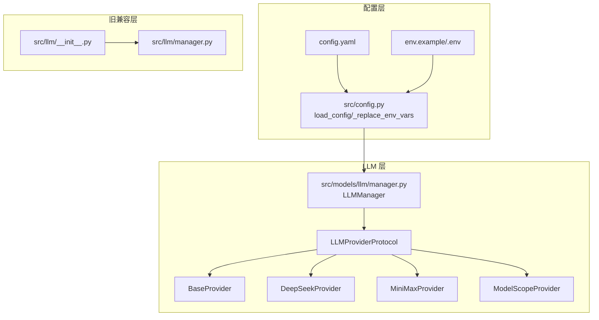
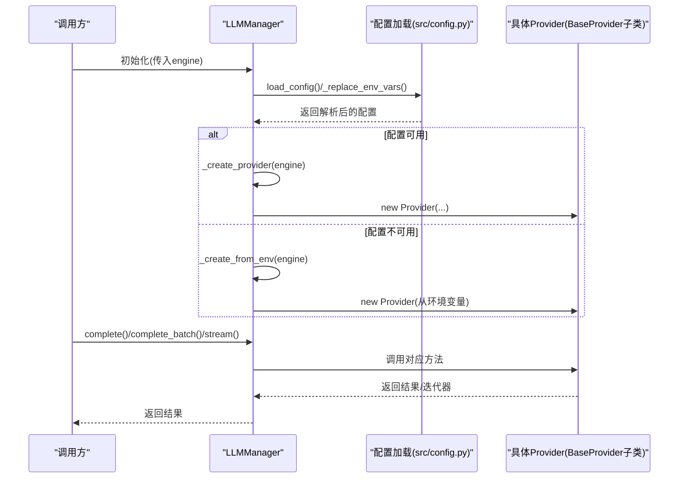
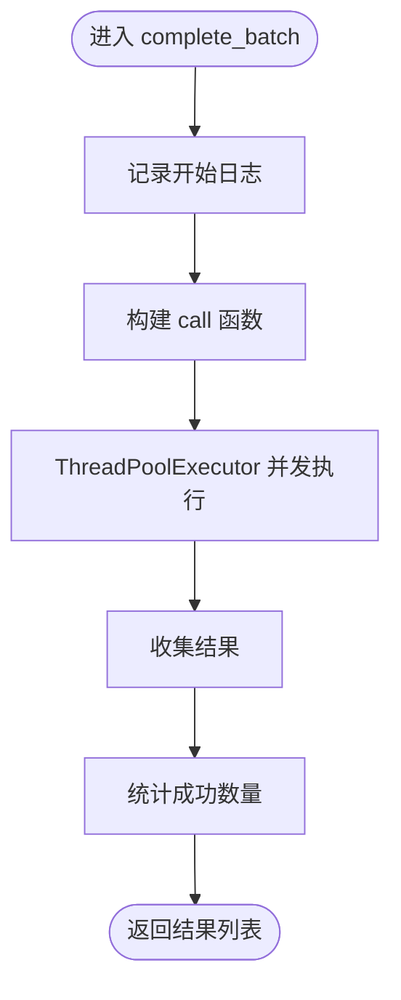
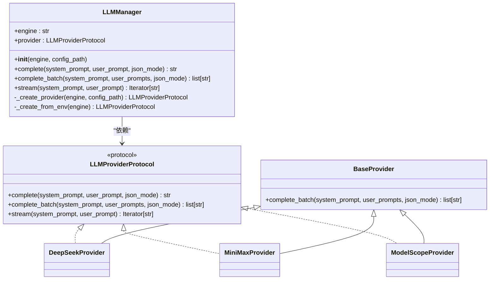
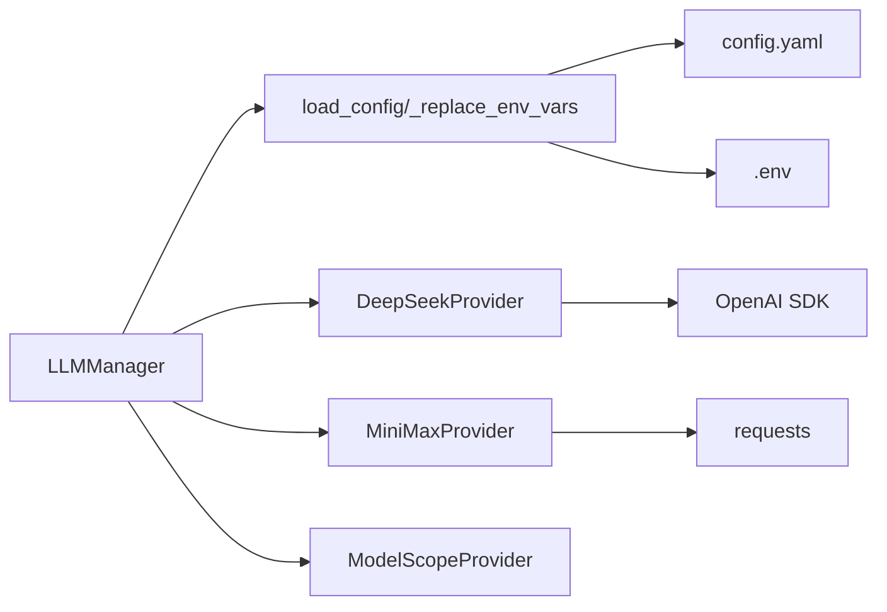
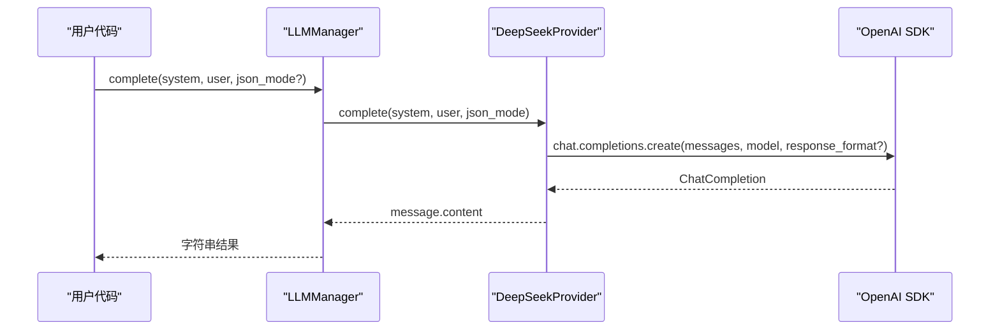

# LLM Provider 扩展开发

<cite>
**本文档引用的文件**
- [src/llm/manager.py](file://src/llm/manager.py)
- [src/models/llm/manager.py](file://src/models/llm/manager.py)
- [src/config.py](file://src/config.py)
- [config.yaml](file://config.yaml)
- [env.example](file://env.example)
- [src/llm/__init__.py](file://src/llm/__init__.py)
- [src/models/llm/__init__.py](file://src/models/llm/__init__.py)
- [README.md](file://README.md)
</cite>

## 目录
1. [简介](#简介)
2. [项目结构](#项目结构)
3. [核心组件](#核心组件)
4. [架构总览](#架构总览)
5. [详细组件分析](#详细组件分析)
6. [依赖关系分析](#依赖关系分析)
7. [性能考量](#性能考量)
8. [故障排查指南](#故障排查指南)
9. [结论](#结论)
10. [附录](#附录)

## 简介
本指南面向希望在现有 LLM Provider 架构基础上扩展新 Provider 的开发者。文档基于仓库中的 LLM 管理器实现，系统阐述了 LLMProviderProtocol 接口的实现要求、BaseProvider 基类的继承方法，以及 complete、complete_batch、stream 三个核心方法的具体实现要点。同时，文档覆盖 Provider 的初始化流程、配置管理（config.yaml 与环境变量）、错误处理机制，并提供完整的扩展示例与最佳实践，帮助快速、安全地集成新的 LLM 供应商。

## 项目结构
该项目采用模块化组织方式，LLM Provider 的核心逻辑集中在 models/llm 子模块中，配置通过 config.yaml 与环境变量共同管理。整体结构如下图所示：

图表来源
- [src/models/llm/manager.py](file://src/models/llm/manager.py#L206-L317)
- [src/config.py](file://src/config.py#L74-L108)
- [config.yaml](file://config.yaml#L1-L54)
- [src/llm/__init__.py](file://src/llm/__init__.py#L1-L28)

章节来源
- [src/models/llm/manager.py](file://src/models/llm/manager.py#L1-L317)
- [src/config.py](file://src/config.py#L1-L109)
- [config.yaml](file://config.yaml#L1-L54)
- [src/llm/__init__.py](file://src/llm/__init__.py#L1-L28)

## 核心组件
- LLMProviderProtocol：定义 Provider 必须实现的接口，包括 complete、complete_batch、stream 三个方法。
- BaseProvider：提供统一的 complete_batch 实现，内部使用线程池并发调用 complete。
- 具体 Provider：DeepSeekProvider、MiniMaxProvider、ModelScopeProvider，分别对接不同供应商的 API。
- LLMManager：负责根据配置或环境变量创建具体的 Provider 实例，并对外暴露统一的 complete、complete_batch、stream 调用入口。

章节来源
- [src/models/llm/manager.py](file://src/models/llm/manager.py#L24-L63)
- [src/models/llm/manager.py](file://src/models/llm/manager.py#L67-L202)
- [src/models/llm/manager.py](file://src/models/llm/manager.py#L206-L317)

## 架构总览
下图展示了 LLMManager 如何从配置与环境变量中选择并实例化 Provider，以及 Provider 如何实现统一的推理接口：

图表来源
- [src/models/llm/manager.py](file://src/models/llm/manager.py#L243-L295)
- [src/config.py](file://src/config.py#L74-L108)

章节来源
- [src/models/llm/manager.py](file://src/models/llm/manager.py#L206-L317)
- [src/config.py](file://src/config.py#L74-L108)

## 详细组件分析

### LLMProviderProtocol 接口实现要求
- complete(system_prompt: str, user_prompt: str, json_mode: bool = False) -> str
  - 单次推理，返回字符串结果
  - json_mode 用于指示模型以 JSON 格式输出（如需要）
- complete_batch(system_prompt: str, user_prompts: list[str], json_mode: bool = False) -> list[str]
  - 批量推理，返回对应数量的结果列表
  - 建议复用 BaseProvider 的实现，避免重复并发逻辑
- stream(system_prompt: str, user_prompt: str) -> Iterator[str]
  - 流式生成，逐块返回增量内容
  - 若供应商不支持流式，应返回空迭代器而非抛错

章节来源
- [src/models/llm/manager.py](file://src/models/llm/manager.py#L24-L41)

### BaseProvider 继承方法
- complete_batch 的统一实现
  - 使用线程池并发调用 self.complete
  - 统计成功数量并记录日志
  - 返回结果列表

图表来源
- [src/models/llm/manager.py](file://src/models/llm/manager.py#L48-L62)

章节来源
- [src/models/llm/manager.py](file://src/models/llm/manager.py#L45-L63)

### 具体 Provider 实现要点

#### DeepSeekProvider
- 初始化
  - 校验 api_key 是否为空，否则抛出异常
  - 使用 OpenAI SDK 客户端，base_url 指向 DeepSeek API
- complete
  - 构造 messages 数组，包含 system 和 user
  - 若 json_mode 为 True，则设置 response_format 为 JSON
  - 调用 chat.completions.create 获取结果
- stream
  - 同样构造 messages，开启 stream=True
  - 遍历 chunk，yield delta.content

章节来源
- [src/models/llm/manager.py](file://src/models/llm/manager.py#L67-L104)

#### MiniMaxProvider
- 初始化
  - 校验 api_key 是否为空，否则抛出异常
  - 设置 headers，包含 Authorization 和 Content-Type
  - 可选 group_id 参数
- complete
  - 构造 payload，包含 model 和 messages
  - 使用 requests.post 调用 /chat_completion_v2
  - 校验状态码，解析 choices[0].message.content
  - 若响应为空，抛出 RuntimeError
- stream
  - 当前不支持流式，返回空迭代器并记录警告

章节来源
- [src/models/llm/manager.py](file://src/models/llm/manager.py#L108-L157)

#### ModelScopeProvider
- 初始化
  - 校验 api_key 是否为空，否则抛出异常
  - 使用 OpenAI SDK 客户端，base_url 指向 ModelScope API
- complete/stream
  - 与 DeepSeekProvider 类似，均基于 OpenAI SDK
  - 支持 json_mode 与流式

章节来源
- [src/models/llm/manager.py](file://src/models/llm/manager.py#L162-L202)

### LLMManager 初始化与配置管理
- 初始化
  - 优先从 config.yaml 加载配置，若加载失败则回退到环境变量
  - 支持的 engine：minimax、deepseek、modelscope
- 配置加载
  - load_config 读取 config.yaml，递归替换 ${VAR} 为环境变量值
  - _get_env_or_default 不存在时返回空字符串
- Provider 创建
  - _create_provider：根据 engine 与配置实例化对应 Provider
  - _create_from_env：从环境变量读取 API Key 与可选参数

图表来源
- [src/models/llm/manager.py](file://src/models/llm/manager.py#L24-L63)
- [src/models/llm/manager.py](file://src/models/llm/manager.py#L206-L317)

章节来源
- [src/models/llm/manager.py](file://src/models/llm/manager.py#L243-L295)
- [src/config.py](file://src/config.py#L74-L108)

## 依赖关系分析
- 配置依赖
  - LLMManager 依赖 load_config 从 config.yaml 读取配置
  - load_config 依赖 _replace_env_vars 递归替换 ${VAR}
- Provider 依赖
  - DeepSeekProvider/ModelScopeProvider 依赖 OpenAI SDK
  - MiniMaxProvider 依赖 requests 库
- 兼容性
  - 旧路径 src/llm/manager.py 已迁移至 src/models/llm/manager.py，保持向后兼容导入

图表来源
- [src/models/llm/manager.py](file://src/models/llm/manager.py#L17-L17)
- [src/config.py](file://src/config.py#L74-L108)

章节来源
- [src/models/llm/manager.py](file://src/models/llm/manager.py#L17-L17)
- [src/config.py](file://src/config.py#L74-L108)

## 性能考量
- 批量推理
  - BaseProvider 使用 ThreadPoolExecutor(max_workers=10) 并发执行
  - 建议根据供应商的并发限制与延迟特征调整并发度
- 流式处理
  - 流式接口仅在支持的 Provider 上有效
  - 对于不支持流式的 Provider，应返回空迭代器，避免阻塞上层逻辑
- 请求超时与重试
  - 建议在具体 Provider 的 HTTP 客户端中配置合理的超时与重试策略（例如 requests 或 OpenAI SDK 的相应参数）

[本节为通用性能建议，无需特定文件引用]

## 故障排查指南
- API Key 未配置
  - 现象：初始化时报错或返回空 API Key
  - 处理：在 .env 中设置对应 API Key，或在 config.yaml 中使用 ${ENV_VAR}
- 配置文件加载失败
  - 现象：LLMManager 回退到环境变量
  - 处理：检查 config.yaml 格式与键名，确认环境变量是否正确导出
- 响应为空或状态码异常
  - MiniMaxProvider：当响应为空或状态码非 200 时抛出异常
  - 处理：检查请求参数、网络连通性与供应商配额
- 流式接口无输出
  - 现象：stream 返回空迭代器
  - 处理：确认供应商是否支持流式；若不支持，上层应降级为 complete

章节来源
- [src/models/llm/manager.py](file://src/models/llm/manager.py#L73-L75)
- [src/models/llm/manager.py](file://src/models/llm/manager.py#L146-L151)
- [src/models/llm/manager.py](file://src/models/llm/manager.py#L155-L157)

## 结论
通过遵循 LLMProviderProtocol 接口、继承 BaseProvider 并实现 complete、complete_batch、stream 三类方法，即可快速扩展新的 LLM Provider。结合 config.yaml 与环境变量的配置体系，可以灵活切换与管理多个供应商。建议在实现过程中关注错误处理、流式支持与性能优化，确保扩展的 Provider 能稳定、高效地服务于上层应用。

[本节为总结性内容，无需特定文件引用]

## 附录

### 扩展新 Provider 的完整步骤
- 定义新 Provider 类
  - 继承 BaseProvider（若需要批量能力）
  - 实现 LLMProviderProtocol 的三个方法
- 初始化与参数校验
  - 校验 API Key 等必需参数
  - 保存客户端与模型信息
- 实现 complete
  - 构建消息数组（system + user）
  - 根据 json_mode 设置响应格式
  - 发起请求并解析响应
- 实现 complete_batch
  - 可直接复用 BaseProvider 的实现
- 实现 stream
  - 若供应商支持流式，逐块产出增量内容
  - 若不支持，返回空迭代器
- 注册到 LLMManager
  - 在 _create_provider 中增加分支，按 engine 选择新 Provider
  - 在 __all__ 中导出新 Provider 类
- 配置与验证
  - 在 config.yaml 中新增 provider 节点
  - 在 .env 中设置 API Key
  - 运行测试，验证 complete、complete_batch、stream 的行为

章节来源
- [src/models/llm/manager.py](file://src/models/llm/manager.py#L24-L63)
- [src/models/llm/manager.py](file://src/models/llm/manager.py#L253-L280)
- [src/models/llm/__init__.py](file://src/models/llm/__init__.py#L10-L26)

### config.yaml 配置要点
- llm.default：默认使用的 engine 名称
- llm.providers.<engine>.provider：engine 对应的 Provider 类型标识
- llm.providers.<engine>.api_key：支持 ${ENV_VAR} 形式的环境变量注入
- llm.providers.<engine>.base_url：供应商 API 基础地址
- llm.providers.<engine>.model：默认模型名称

章节来源
- [config.yaml](file://config.yaml#L4-L21)
- [src/config.py](file://src/config.py#L74-L108)

### 环境变量注入与默认值
- 环境变量示例：env.example 中包含 MINIMAX_API_KEY、MODELSCOPE_API_KEY 等
- 加载顺序：优先使用 config.yaml 中的 ${ENV_VAR}，若未配置则回退到 .env
- 默认值策略：_get_env_or_default 返回空字符串，调用方需自行处理空值

章节来源
- [env.example](file://env.example#L4-L7)
- [src/config.py](file://src/config.py#L105-L108)

### 代码级调用序列（以 DeepSeek 为例）

图表来源
- [src/models/llm/manager.py](file://src/models/llm/manager.py#L297-L304)
- [src/models/llm/manager.py](file://src/models/llm/manager.py#L79-L92)