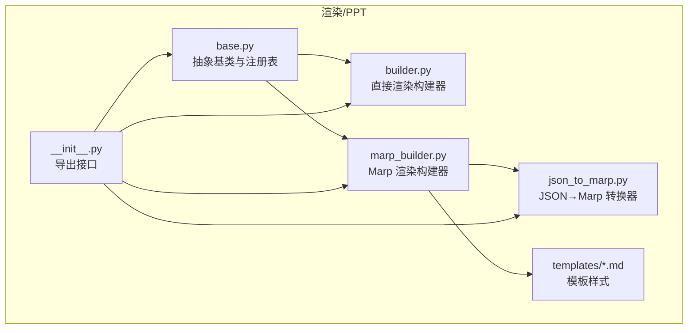
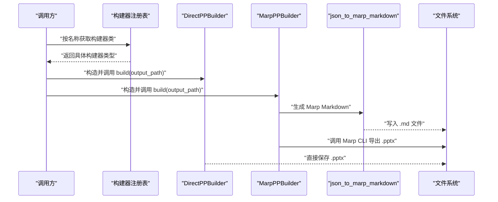
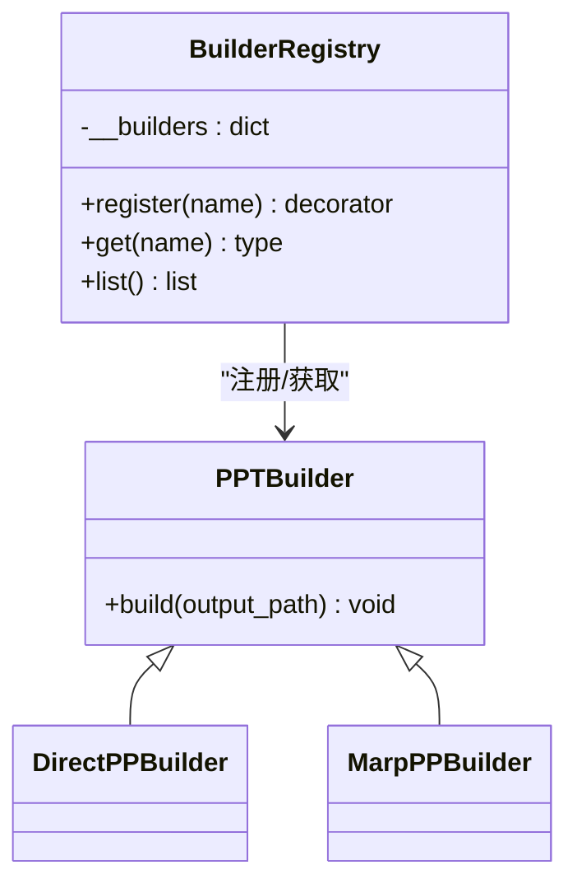
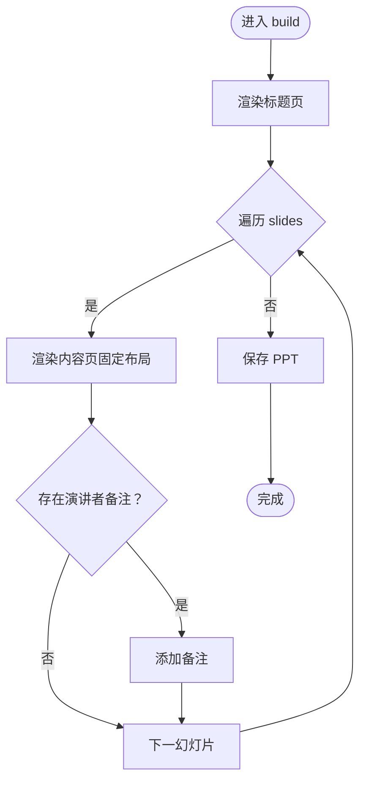
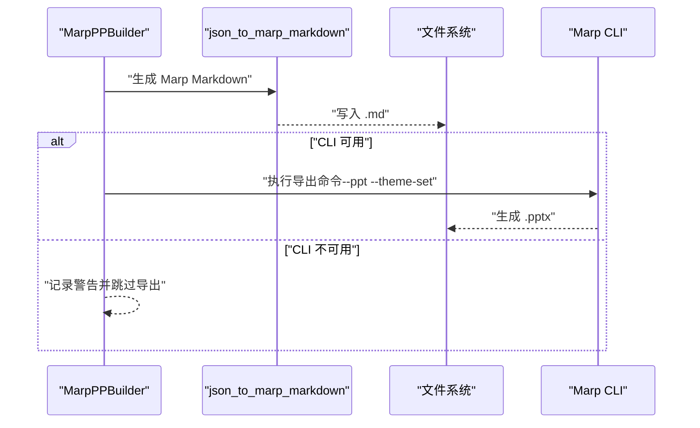
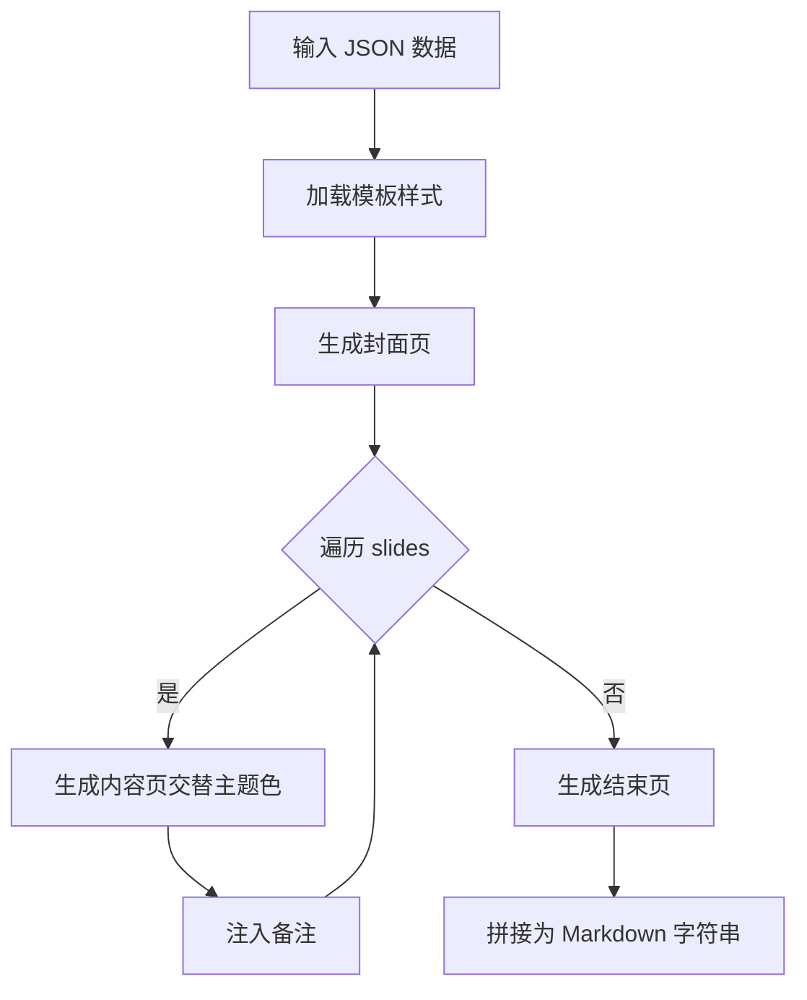
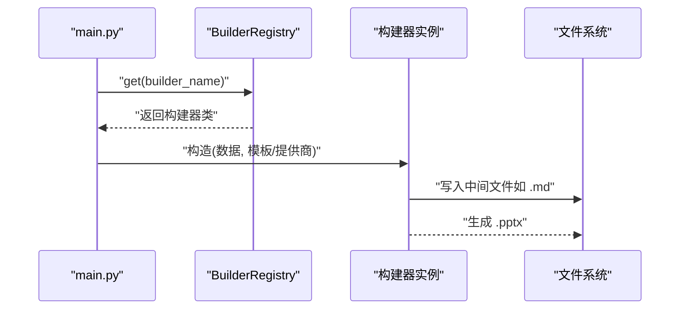
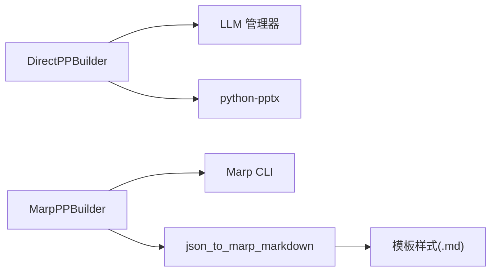

# PPT 构建器扩展开发

<cite>
**本文档引用的文件**
- [src/render/ppt/base.py](file://src/render/ppt/base.py)
- [src/render/ppt/builder.py](file://src/render/ppt/builder.py)
- [src/render/ppt/marp_builder.py](file://src/render/ppt/marp_builder.py)
- [src/render/ppt/json_to_marp.py](file://src/render/ppt/json_to_marp.py)
- [src/render/ppt/__init__.py](file://src/render/ppt/__init__.py)
- [src/render/ppt/templates/default.md](file://src/render/ppt/templates/default.md)
- [src/render/ppt/templates/corporate.md](file://src/render/ppt/templates/corporate.md)
- [src/render/ppt/templates/dark.md](file://src/render/ppt/templates/dark.md)
- [src/render/ppt/templates/minimal.md](file://src/render/ppt/templates/minimal.md)
- [scripts/test_templates.py](file://scripts/test_templates.py)
- [src/prompts/generate_slides_from_script.md](file://src/prompts/generate_slides_from_script.md)
- [src/agents/__init__.py](file://src/agents/__init__.py)
- [main.py](file://main.py)
</cite>

## 目录
1. [简介](#简介)
2. [项目结构](#项目结构)
3. [核心组件](#核心组件)
4. [架构总览](#架构总览)
5. [详细组件分析](#详细组件分析)
6. [依赖关系分析](#依赖关系分析)
7. [性能考虑](#性能考虑)
8. [故障排查指南](#故障排查指南)
9. [结论](#结论)
10. [附录](#附录)

## 简介
本指南面向希望扩展 PPT 构建器的开发者，系统讲解如何基于抽象基类进行扩展、如何实现 build 方法、如何使用模板系统与渲染逻辑，并对比“直接渲染构建器”和“Marp 渲染构建器”的差异与适用场景。同时提供开发新模板的方法、扩展示例（数据结构转换、样式应用、图片处理、动画效果）、构建器注册机制、模板加载流程以及性能优化建议。

## 项目结构
渲染层位于 src/render/ppt，包含抽象基类、两种构建器实现、JSON 到 Marp 的转换器以及多套模板样式文件。入口模块导出构建器与转换器，便于外部调用。

图表来源
- [src/render/ppt/base.py](file://src/render/ppt/base.py#L1-L42)
- [src/render/ppt/builder.py](file://src/render/ppt/builder.py#L1-L194)
- [src/render/ppt/marp_builder.py](file://src/render/ppt/marp_builder.py#L1-L94)
- [src/render/ppt/json_to_marp.py](file://src/render/ppt/json_to_marp.py#L1-L139)
- [src/render/ppt/__init__.py](file://src/render/ppt/__init__.py#L1-L20)

章节来源
- [src/render/ppt/__init__.py](file://src/render/ppt/__init__.py#L1-L20)

## 核心组件
- 抽象基类与注册表
  - 抽象基类定义统一的构建接口，子类必须实现 build 方法。
  - 注册表负责构建器命名注册、按名获取与枚举。
- 直接渲染构建器
  - 通过 LLM 生成设计蓝图，使用 python-pptx 直接绘制 PPT。
  - 支持样式参数与默认风格提示词。
- Marp 渲染构建器
  - 将 JSON 数据转换为 Marp Markdown，再由 Marp CLI 导出 PPT。
  - 支持模板选择与样式注入。
- JSON→Marp 转换器
  - 负责生成封面、内容页、结束页，注入模板样式与备注。
- 模板系统
  - 以 .md 文件承载 CSS 样式，支持默认、极简、商务、渐变、暗黑等风格。

章节来源
- [src/render/ppt/base.py](file://src/render/ppt/base.py#L7-L42)
- [src/render/ppt/builder.py](file://src/render/ppt/builder.py#L22-L194)
- [src/render/ppt/marp_builder.py](file://src/render/ppt/marp_builder.py#L21-L94)
- [src/render/ppt/json_to_marp.py](file://src/render/ppt/json_to_marp.py#L39-L110)
- [src/render/ppt/templates/default.md](file://src/render/ppt/templates/default.md#L1-L36)

## 架构总览
下图展示了从数据到最终 PPT 的两条路径：直接渲染与 Marp 渲染。

图表来源
- [src/render/ppt/base.py](file://src/render/ppt/base.py#L31-L41)
- [src/render/ppt/builder.py](file://src/render/ppt/builder.py#L128-L151)
- [src/render/ppt/marp_builder.py](file://src/render/ppt/marp_builder.py#L59-L94)
- [src/render/ppt/json_to_marp.py](file://src/render/ppt/json_to_marp.py#L39-L110)

## 详细组件分析

### 抽象基类与注册机制
- 抽象基类 PPTBuilder
  - 定义统一的 build 接口，子类必须实现该方法。
- BuilderRegistry
  - 提供装饰器注册、按名获取、枚举可用构建器。
  - 若请求未知名称，抛出异常并列出可用项。

图表来源
- [src/render/ppt/base.py](file://src/render/ppt/base.py#L7-L42)
- [src/render/ppt/builder.py](file://src/render/ppt/builder.py#L22-L24)
- [src/render/ppt/marp_builder.py](file://src/render/ppt/marp_builder.py#L21-L23)

章节来源
- [src/render/ppt/base.py](file://src/render/ppt/base.py#L7-L42)

### 直接渲染构建器（DirectPPBuilder）
- 设计理念
  - 通过 LLM 生成“设计蓝图”，然后直接使用 python-pptx 绘制标题页、内容页与备注。
- 关键实现点
  - 构造函数接收数据、LLM 提供商与可选样式；内部持有 Presentation 实例与空白布局。
  - build 方法：先渲染标题页，再遍历 slides 渲染内容页，最后保存文件。
  - 内容页固定布局：标题、关键信息、要点列表；支持添加演讲者备注。
  - 图片元素通过预存路径插入，位置与尺寸由蓝图控制。
- 样式与提示词
  - 默认风格提示词用于约束视觉风格；可通过构造参数覆盖。
  - 设计蓝图 JSON 字段包含 slide_title、content_elements、image_elements 等。

图表来源
- [src/render/ppt/builder.py](file://src/render/ppt/builder.py#L128-L151)
- [src/render/ppt/builder.py](file://src/render/ppt/builder.py#L161-L179)

章节来源
- [src/render/ppt/builder.py](file://src/render/ppt/builder.py#L22-L194)

### Marp 渲染构建器（MarpPPBuilder）
- 设计理念
  - 将 JSON 数据转换为 Marp Markdown，再由 Marp CLI 导出 PPT。
- 关键实现点
  - 构造函数：接收数据、提供商、模板名与可选 Marp CLI 路径；自动查找 Marp CLI。
  - build 方法：先生成 .md 文件，再调用 Marp CLI 导出 .pptx；若未安装 CLI，则仅生成 .md。
  - 模板加载：通过 --theme-set 参数直接指定模板文件，模板样式注入到 Markdown 中。
- 模板查找与回退
  - 优先查找全局安装的 marp，其次检查用户目录下的 .npm-global；找不到则记录警告。

图表来源
- [src/render/ppt/marp_builder.py](file://src/render/ppt/marp_builder.py#L59-L94)
- [src/render/ppt/json_to_marp.py](file://src/render/ppt/json_to_marp.py#L39-L110)

章节来源
- [src/render/ppt/marp_builder.py](file://src/render/ppt/marp_builder.py#L21-L94)

### JSON→Marp 转换器（json_to_marp_markdown）
- 功能
  - 生成封面、内容页、结束页；注入模板样式；支持交替主题色与备注。
- 模板样式注入
  - 从模板文件中提取  并注入到生成的 Markdown 中。
- 备注处理
  - 封面页可注入第一条幻灯片的 speaker_notes；每页可单独添加 note。
- 输出结构
  - 使用分页符分隔页面；通过 class 或 _class 控制主题与布局。

图表来源
- [src/render/ppt/json_to_marp.py](file://src/render/ppt/json_to_marp.py#L39-L110)

章节来源
- [src/render/ppt/json_to_marp.py](file://src/render/ppt/json_to_marp.py#L1-L139)

### 模板系统与样式定制
- 模板文件
  - 每个模板为一个 .md 文件，包含 CSS 样式与布局规则。
  - 支持 cover、ending、dark 等 class 控制页面主题。
- 样式覆盖策略
  - json_to_marp_markdown 在封面页注入模板样式，确保全局生效。
  - 内容页通过交替 class 实现浅/深色主题切换。
- 可用模板
  - default、minimal、corporate、gradient、dark。

章节来源
- [src/render/ppt/templates/default.md](file://src/render/ppt/templates/default.md#L1-L36)
- [src/render/ppt/templates/corporate.md](file://src/render/ppt/templates/corporate.md#L1-L35)
- [src/render/ppt/templates/dark.md](file://src/render/ppt/templates/dark.md#L1-L37)
- [src/render/ppt/templates/minimal.md](file://src/render/ppt/templates/minimal.md#L1-L35)
- [src/render/ppt/json_to_marp.py](file://src/render/ppt/json_to_marp.py#L26-L36)

### 开发新的 PPT 模板
- 模板语法与布局
  - 使用 CSS 类控制布局与主题，例如 .row/.col-img/.col-text 控制左右分栏。
  - 通过 class 或 _class 控制封面、深色页、结束页等页面主题。
- 样式定制
  - 在模板中定义颜色、字体、阴影、渐变等视觉属性。
  - 注意 16:9 尺寸与排版密度，确保在 PPT 中清晰可读。
- 布局设计
  - 封面居中、结束页居中；内容页采用两列布局时，图片与文字宽度比例可调。
- 示例参考
  - default 模板提供简洁商务风格；minimal 提供极简风格；corporate 强调企业感；dark 提供夜间模式；gradient 提供渐变背景。

章节来源
- [src/render/ppt/templates/default.md](file://src/render/ppt/templates/default.md#L1-L36)
- [src/render/ppt/templates/minimal.md](file://src/render/ppt/templates/minimal.md#L1-L35)
- [src/render/ppt/templates/corporate.md](file://src/render/ppt/templates/corporate.md#L1-L35)
- [src/render/ppt/templates/dark.md](file://src/render/ppt/templates/dark.md#L1-L37)

### 扩展示例：开发新构建器
- 继承与注册
  - 新建类继承 PPTBuilder，并使用 @BuilderRegistry.register("your-name") 进行注册。
  - 实现 build 方法，定义数据输入、渲染流程与输出路径。
- 数据结构转换
  - 若采用 Marp 路线，复用 json_to_marp_markdown 或自定义转换逻辑。
  - 若采用直接渲染，可沿用 DirectPPBuilder 的数据约定，或定义自己的蓝图格式。
- 样式应用
  - Marp 路线：通过模板文件注入 CSS；直接渲染：在绘图时设置字体、颜色、阴影等。
- 图片处理
  - Marp 路线：在 Markdown 中使用图片链接；直接渲染：使用 python-pptx 插入图片并定位。
- 动画效果
  - Marp：可在 Markdown 中使用注释或主题特性表达动态提示（需配合播放端支持）。
  - 直接渲染：python-pptx 支持动画，但当前实现未启用，可按需扩展。
- 性能优化
  - Marp：减少不必要的样式嵌入，避免超大图片；合理分页。
  - 直接渲染：批量插入形状、缓存字体与图片资源。

章节来源
- [src/render/ppt/base.py](file://src/render/ppt/base.py#L21-L41)
- [src/render/ppt/builder.py](file://src/render/ppt/builder.py#L22-L24)
- [src/render/ppt/marp_builder.py](file://src/render/ppt/marp_builder.py#L21-L23)

### 构建器注册机制与模板加载流程
- 注册机制
  - 通过装饰器将构建器类注册到注册表，键名为字符串标识。
  - 外部通过 BuilderRegistry.get("direct"|"marp") 获取具体类。
- 模板加载流程（Marp）
  - 读取模板文件中的  并注入到生成的 Markdown。
  - 通过 Marp CLI 的 --theme-set 参数直接指定模板文件，确保样式生效。
- CLI 集成
  - main.py 中通过 BuilderRegistry.get 获取构建器类并实例化，传入数据与模板参数。

图表来源
- [src/render/ppt/base.py](file://src/render/ppt/base.py#L31-L41)
- [main.py](file://main.py#L178-L179)
- [src/render/ppt/marp_builder.py](file://src/render/ppt/marp_builder.py#L59-L94)

章节来源
- [src/render/ppt/base.py](file://src/render/ppt/base.py#L16-L41)
- [src/render/ppt/__init__.py](file://src/render/ppt/__init__.py#L8-L19)
- [main.py](file://main.py#L178-L179)

## 依赖关系分析
- 组件耦合
  - DirectPPBuilder 依赖 LLM 管理器与 python-pptx；MarpPPBuilder 依赖 Marp CLI 与模板文件。
  - json_to_marp_markdown 与模板文件存在运行时依赖。
- 外部依赖
  - Marp CLI：若未安装，Marp 渲染构建器会记录警告并跳过导出。
  - LLM：Direct 渲染构建器需要可用的 LLM 生成设计蓝图。

图表来源
- [src/render/ppt/builder.py](file://src/render/ppt/builder.py#L16-L17)
- [src/render/ppt/marp_builder.py](file://src/render/ppt/marp_builder.py#L36-L37)
- [src/render/ppt/json_to_marp.py](file://src/render/ppt/json_to_marp.py#L22-L23)

章节来源
- [src/render/ppt/builder.py](file://src/render/ppt/builder.py#L16-L17)
- [src/render/ppt/marp_builder.py](file://src/render/ppt/marp_builder.py#L36-L37)
- [src/render/ppt/json_to_marp.py](file://src/render/ppt/json_to_marp.py#L22-L23)

## 性能考虑
- Marp 路线
  - 减少模板样式复杂度，避免过多嵌套与大范围重绘。
  - 控制图片尺寸与数量，避免导出时内存占用过高。
  - 合理分页，避免单页内容过多导致渲染缓慢。
- 直接渲染
  - 批量操作形状与文本框，减少重复查询布局。
  - 缓存字体与图片资源，避免重复 IO。
  - 控制幻灯片数量与层级，降低 python-pptx 的渲染压力。
- LLM 交互
  - 合理设置提示词长度与结构，减少 LLM 生成时间与失败概率。
  - 对于 Direct 渲染，可对 LLM 响应进行缓存与降级处理。

## 故障排查指南
- Marp CLI 未安装
  - 现象：Marp 渲染构建器仅生成 .md，不生成 .pptx。
  - 处理：安装 Marp CLI 并确保 PATH 可找到；或手动导出。
- 模板样式未生效
  - 现象：导出 PPT 与预期样式不符。
  - 处理：确认模板文件存在且包含有效 <style>；检查 --theme-set 参数指向正确路径。
- JSON 解析失败（Direct 渲染）
  - 现象：设计蓝图 JSON 解析异常，使用空蓝图继续。
  - 处理：检查 LLM 输出是否符合 JSON 格式；必要时增加格式约束与校验。
- 输出路径不存在
  - 现象：保存失败或权限不足。
  - 处理：确保输出目录存在或允许自动创建父目录。

章节来源
- [src/render/ppt/marp_builder.py](file://src/render/ppt/marp_builder.py#L37-L39)
- [src/render/ppt/marp_builder.py](file://src/render/ppt/marp_builder.py#L86-L93)
- [src/render/ppt/builder.py](file://src/render/ppt/builder.py#L79-L84)
- [src/render/ppt/builder.py](file://src/render/ppt/builder.py#L149-L150)

## 结论
本指南提供了从抽象基类到具体实现的完整扩展路径，涵盖两种渲染路线的差异、模板系统与样式定制、数据结构转换与图片处理、动画效果建议、注册机制与模板加载流程，以及性能优化与故障排查。开发者可据此快速扩展新的构建器与模板，满足多样化的 PPT 生成需求。

## 附录
- 模板效果测试脚本
  - scripts/test_templates.py 展示了如何批量测试各模板并生成 PPT 与 Markdown。
- Prompt 参考
  - src/prompts/generate_slides_from_script.md 提供了将 JSON 转为 Marp Markdown 的 Prompt 设计思路，可作为模板开发与数据转换的参考。

章节来源
- [scripts/test_templates.py](file://scripts/test_templates.py#L1-L152)
- [src/prompts/generate_slides_from_script.md](file://src/prompts/generate_slides_from_script.md#L1-L62)