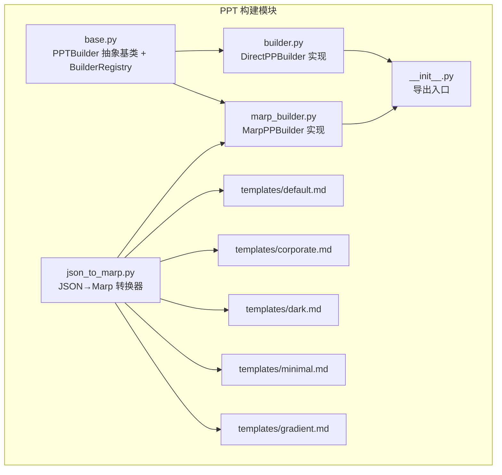
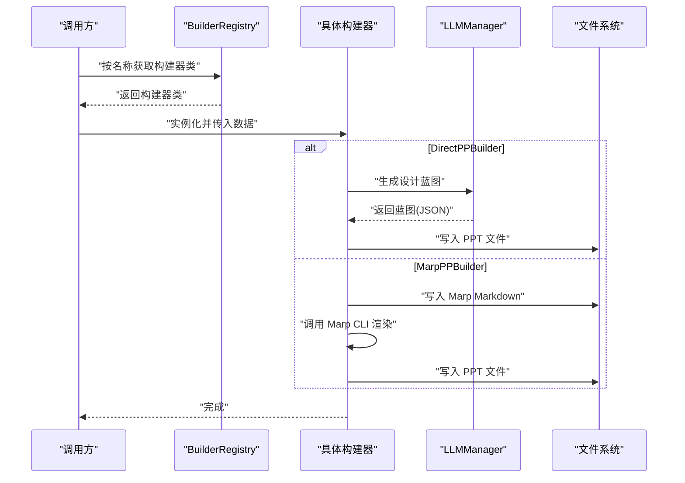
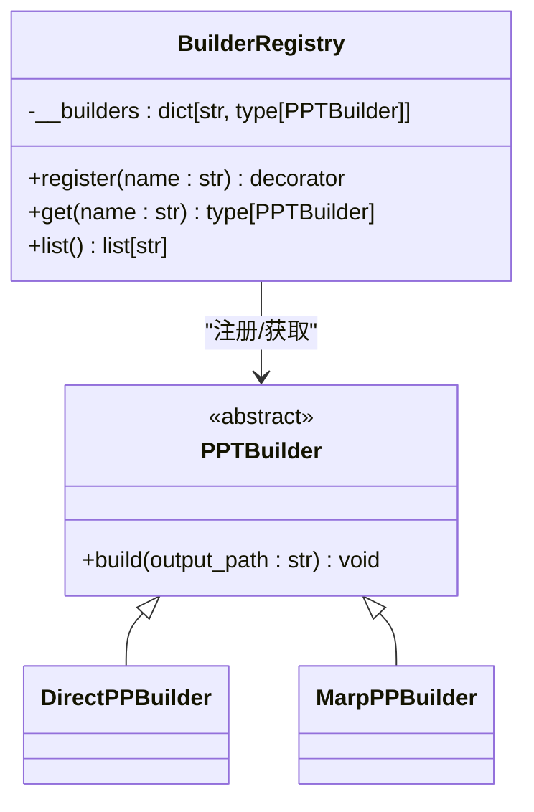
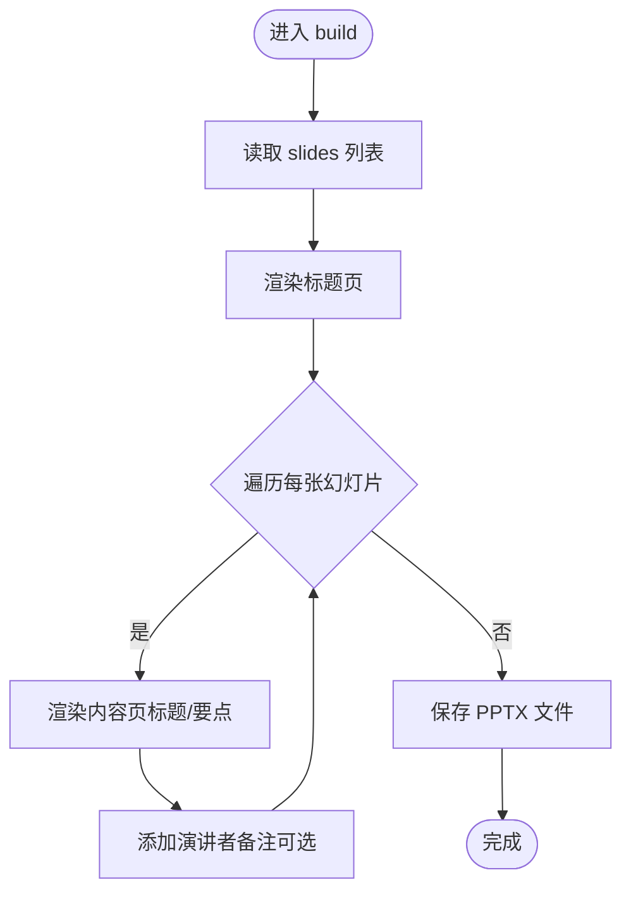
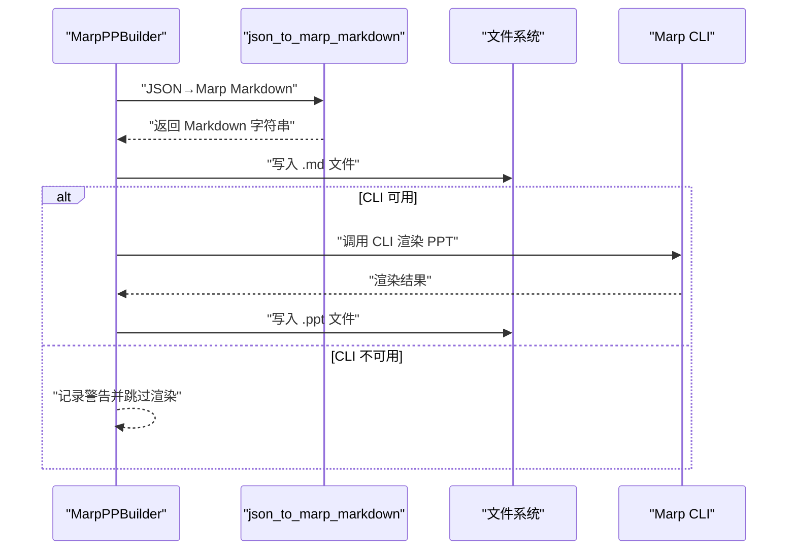
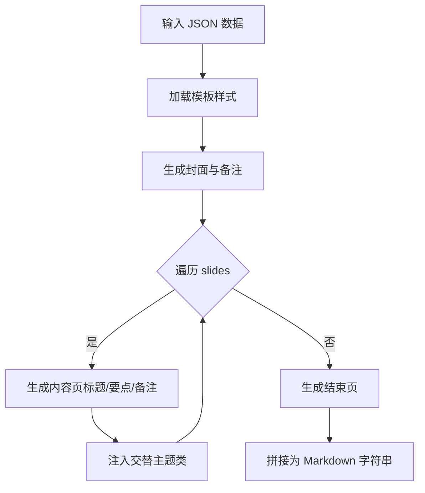
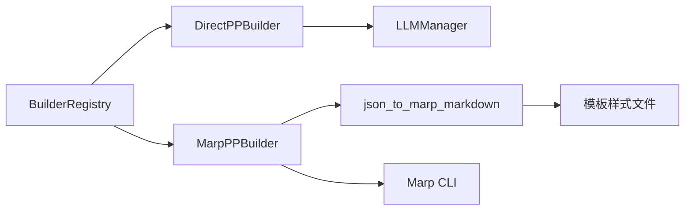

# 构建器类型与实现

<cite>
**本文引用的文件**
- [src/render/ppt/base.py](file://src/render/ppt/base.py)
- [src/render/ppt/builder.py](file://src/render/ppt/builder.py)
- [src/render/ppt/marp_builder.py](file://src/render/ppt/marp_builder.py)
- [src/render/ppt/json_to_marp.py](file://src/render/ppt/json_to_marp.py)
- [src/render/ppt/__init__.py](file://src/render/ppt/__init__.py)
- [src/render/ppt/templates/default.md](file://src/render/ppt/templates/default.md)
- [src/render/ppt/templates/corporate.md](file://src/render/ppt/templates/corporate.md)
- [src/render/ppt/templates/dark.md](file://src/render/ppt/templates/dark.md)
- [src/render/ppt/templates/minimal.md](file://src/render/ppt/templates/minimal.md)
- [src/render/ppt/templates/gradient.md](file://src/render/ppt/templates/gradient.md)
- [src/agents/__init__.py](file://src/agents/__init__.py)
- [src/models/llm/manager.py](file://src/models/llm/manager.py)
</cite>

## 目录
1. [简介](#简介)
2. [项目结构](#项目结构)
3. [核心组件](#核心组件)
4. [架构总览](#架构总览)
5. [详细组件分析](#详细组件分析)
6. [依赖关系分析](#依赖关系分析)
7. [性能考量](#性能考量)
8. [故障排查指南](#故障排查指南)
9. [结论](#结论)
10. [附录：扩展示例与最佳实践](#附录扩展示例与最佳实践)

## 简介
本文件系统性阐述 PPT 构建器体系的设计与实现，覆盖抽象基类 PPTBuilder 的设计理念、BuilderRegistry 注册机制、DirectPPBuilder 与 MarpPPBuilder 的实现差异与适用场景，并提供扩展开发指南与生命周期管理建议。目标是帮助开发者在不深入源码的前提下，快速理解并正确使用与扩展该构建器体系。

## 项目结构
PPT 构建模块位于 src/render/ppt 下，包含抽象基类、注册机制、两种具体构建器以及 JSON 到 Marp 的转换器与模板资源。

图表来源
- [src/render/ppt/base.py](file://src/render/ppt/base.py#L1-L42)
- [src/render/ppt/builder.py](file://src/render/ppt/builder.py#L1-L194)
- [src/render/ppt/marp_builder.py](file://src/render/ppt/marp_builder.py#L1-L94)
- [src/render/ppt/json_to_marp.py](file://src/render/ppt/json_to_marp.py#L1-L139)
- [src/render/ppt/__init__.py](file://src/render/ppt/__init__.py#L1-L20)

章节来源
- [src/render/ppt/__init__.py](file://src/render/ppt/__init__.py#L1-L20)

## 核心组件
- PPTBuilder 抽象基类：定义统一的构建接口，强制子类实现 build 方法。
- BuilderRegistry 注册表：基于装饰器模式的动态注册与获取机制，支持按名称检索构建器类。
- DirectPPBuilder：直接渲染型构建器，通过 LLM 生成设计蓝图，使用 python-pptx 直接绘制幻灯片。
- MarpPPBuilder：中间态渲染型构建器，将数据转换为 Marp Markdown，再由 Marp CLI 渲染为 PPT。
- JSON→Marp 转换器：负责将结构化数据转换为符合 Marp 规范的 Markdown 文档，并注入模板样式。
- 模板系统：内置多套样式模板，用于控制封面、内容页、结束页的视觉风格。

章节来源
- [src/render/ppt/base.py](file://src/render/ppt/base.py#L7-L42)
- [src/render/ppt/builder.py](file://src/render/ppt/builder.py#L22-L194)
- [src/render/ppt/marp_builder.py](file://src/render/ppt/marp_builder.py#L21-L94)
- [src/render/ppt/json_to_marp.py](file://src/render/ppt/json_to_marp.py#L39-L110)

## 架构总览
下图展示了构建器体系的整体交互：调用方通过注册表选择构建器，构建器根据输入数据执行渲染流程，最终输出 PPT 文件。

图表来源
- [src/render/ppt/base.py](file://src/render/ppt/base.py#L16-L42)
- [src/render/ppt/builder.py](file://src/render/ppt/builder.py#L22-L194)
- [src/render/ppt/marp_builder.py](file://src/render/ppt/marp_builder.py#L21-L94)
- [src/render/ppt/json_to_marp.py](file://src/render/ppt/json_to_marp.py#L39-L110)
- [src/agents/__init__.py](file://src/agents/__init__.py#L9-L14)
- [src/models/llm/manager.py](file://src/models/llm/manager.py#L206-L318)

## 详细组件分析

### 抽象基类 PPTBuilder 与注册机制
- 设计理念
  - 以抽象基类约束所有构建器的统一行为，确保 build 方法签名一致。
  - 通过 BuilderRegistry 提供集中式注册与发现，便于扩展新的构建器类型。
- 继承要求
  - 必须实现 build(self, output_path: str) -> None，参数为输出文件路径字符串，无返回值。
  - 可根据需要在构造函数中接收任意初始化参数（如数据、模板、提供商等）。
- 注册机制
  - 使用装饰器 @BuilderRegistry.register(name) 在类定义时完成注册。
  - 通过 BuilderRegistry.get(name) 获取构建器类；不存在时抛出异常并提示可用列表。
  - BuilderRegistry.list() 返回当前已注册的构建器名称列表。

图表来源
- [src/render/ppt/base.py](file://src/render/ppt/base.py#L7-L42)
- [src/render/ppt/builder.py](file://src/render/ppt/builder.py#L22-L23)
- [src/render/ppt/marp_builder.py](file://src/render/ppt/marp_builder.py#L21-L22)

章节来源
- [src/render/ppt/base.py](file://src/render/ppt/base.py#L7-L42)

### DirectPPBuilder（直接渲染）
- 特点
  - 通过 LLM 生成“设计蓝图”（JSON），然后直接使用 python-pptx 绘制幻灯片。
  - 不依赖外部 CLI，渲染过程完全在 Python 中完成。
- 初始化参数
  - data: dict[str, Any]，输入数据（包含标题、幻灯片集合等）。
  - provider: str，默认使用深度学习模型（可通过 LLMManager 配置）。
  - style: str | None，可选的视觉风格提示词。
- build 方法实现要点
  - 生成标题页与内容页，逐页渲染标题、关键要点与要点列表。
  - 支持为最后一页添加演讲者备注（notes）。
  - 输出前确保父目录存在，保存为 PPTX 文件。
- 异常与容错
  - LLM 返回的蓝图若非有效 JSON，会记录错误并回退为空蓝图，保证流程继续。
  - 文件保存失败时记录日志，便于定位问题。

图表来源
- [src/render/ppt/builder.py](file://src/render/ppt/builder.py#L128-L151)

章节来源
- [src/render/ppt/builder.py](file://src/render/ppt/builder.py#L22-L194)
- [src/agents/__init__.py](file://src/agents/__init__.py#L9-L14)
- [src/models/llm/manager.py](file://src/models/llm/manager.py#L206-L318)

### MarpPPBuilder（Marp 渲染）
- 特点
  - 采用“JSON→Marp Markdown→PPT”的中间态渲染路径。
  - 通过 Marp CLI 完成最终 PPT 渲染，模板由内置样式文件控制。
- 初始化参数
  - data: dict[str, Any]，输入数据。
  - provider: str，默认使用深度学习模型（可通过 LLMManager 配置）。
  - template: str，默认模板名（default/corporate/dark/minimal/gradient）。
  - marp_cli_path: str | None，可显式指定 Marp CLI 路径。
- build 方法实现要点
  - 将 JSON 数据转换为 Marp Markdown，并写入临时 .md 文件。
  - 若检测到 Marp CLI，调用其进行 PPT 渲染；否则仅保存 Markdown 文件并记录警告。
- 模板注入
  - 通过 json_to_marp_markdown 将模板样式注入到生成的 Markdown 中，实现统一视觉风格。
- 异常与容错
  - CLI 未安装或不可用时记录警告，避免阻断流程。
  - 子进程执行失败时记录错误信息，便于诊断。

图表来源
- [src/render/ppt/marp_builder.py](file://src/render/ppt/marp_builder.py#L59-L94)
- [src/render/ppt/json_to_marp.py](file://src/render/ppt/json_to_marp.py#L39-L110)

章节来源
- [src/render/ppt/marp_builder.py](file://src/render/ppt/marp_builder.py#L21-L94)
- [src/render/ppt/json_to_marp.py](file://src/render/ppt/json_to_marp.py#L39-L110)

### JSON→Marp 转换器
- 功能
  - 将结构化数据转换为 Marp 兼容的 Markdown，包含封面、内容页、结束页与备注。
  - 自动注入模板样式（从模板文件中提取 <style> 部分）。
- 关键流程
  - 读取模板样式并注入到封面段落。
  - 逐页生成标题、关键要点、要点列表与备注。
  - 支持解析 LLM 返回的 JSON 或从 Markdown 代码块中提取 JSON。
- 模板系统
  - 内置 default、corporate、dark、minimal、gradient 五种模板，分别控制封面、内容页与结束页的视觉风格。

图表来源
- [src/render/ppt/json_to_marp.py](file://src/render/ppt/json_to_marp.py#L39-L110)
- [src/render/ppt/templates/default.md](file://src/render/ppt/templates/default.md#L1-L36)
- [src/render/ppt/templates/corporate.md](file://src/render/ppt/templates/corporate.md#L1-L35)
- [src/render/ppt/templates/dark.md](file://src/render/ppt/templates/dark.md#L1-L37)
- [src/render/ppt/templates/minimal.md](file://src/render/ppt/templates/minimal.md#L1-L35)
- [src/render/ppt/templates/gradient.md](file://src/render/ppt/templates/gradient.md#L1-L35)

章节来源
- [src/render/ppt/json_to_marp.py](file://src/render/ppt/json_to_marp.py#L26-L139)

## 依赖关系分析
- 组件耦合
  - DirectPPBuilder 依赖 LLMManager 生成蓝图，依赖 python-pptx 进行绘图。
  - MarpPPBuilder 依赖 json_to_marp_markdown 进行中间态转换，依赖 Marp CLI 进行最终渲染。
  - BuilderRegistry 作为全局注册中心，被两个具体构建器使用。
- 外部依赖
  - LLMManager：统一的推理管理器，支持多种提供商（minimax/deepseek/modelscope）。
  - Marp CLI：外部工具，需在系统中安装并可被命令行调用。
- 潜在循环依赖
  - 当前模块间为单向依赖，未见循环导入风险。

图表来源
- [src/render/ppt/base.py](file://src/render/ppt/base.py#L16-L42)
- [src/render/ppt/builder.py](file://src/render/ppt/builder.py#L16-L17)
- [src/render/ppt/marp_builder.py](file://src/render/ppt/marp_builder.py#L11-L12)
- [src/render/ppt/json_to_marp.py](file://src/render/ppt/json_to_marp.py#L22-L44)
- [src/models/llm/manager.py](file://src/models/llm/manager.py#L206-L318)

章节来源
- [src/render/ppt/base.py](file://src/render/ppt/base.py#L16-L42)
- [src/render/ppt/builder.py](file://src/render/ppt/builder.py#L16-L17)
- [src/render/ppt/marp_builder.py](file://src/render/ppt/marp_builder.py#L11-L12)
- [src/render/ppt/json_to_marp.py](file://src/render/ppt/json_to_marp.py#L22-L44)
- [src/models/llm/manager.py](file://src/models/llm/manager.py#L206-L318)

## 性能考量
- DirectPPBuilder
  - 优点：无需外部 CLI，渲染过程可控，适合对输出质量有严格要求且希望减少外部依赖的场景。
  - 缺点：依赖 LLM 生成蓝图，整体耗时受 LLM 响应时间影响；python-pptx 绘图可能较慢，尤其在大量图片或复杂布局时。
- MarpPPBuilder
  - 优点：利用 Marp CLI 的成熟渲染能力，模板化程度高，视觉一致性好。
  - 缺点：需要安装并维护 Marp CLI；子进程调用带来额外开销；模板切换与样式注入增加预处理时间。
- 优化建议
  - 合理设置 LLM 的 provider 与模型，平衡速度与质量。
  - 对于 DirectPPBuilder，尽量减少图片数量与复杂度；对 MarpPPBuilder，复用模板文件，避免重复解析。
  - 在 CI/CD 环境中预装 Marp CLI，减少首次运行时的查找与等待。

[本节为通用性能讨论，不直接分析特定文件]

## 故障排查指南
- 未知构建器名称
  - 现象：调用 BuilderRegistry.get(name) 抛出异常，提示可用列表。
  - 处理：确认注册名称是否正确，或先调用 BuilderRegistry.list() 查看可用项。
- LLM 返回无效 JSON
  - 现象：DirectPPBuilder 在解析蓝图时记录错误并回退为空蓝图。
  - 处理：检查系统提示词与 LLM 配置，必要时启用 JSON 模式或调整提示词。
- Marp CLI 未找到
  - 现象：MarpPPBuilder 记录警告，仅保存 Markdown 文件。
  - 处理：安装 Marp CLI 并确保 PATH 可访问；或显式传入 marp_cli_path。
- 文件保存失败
  - 现象：构建完成后未生成预期文件。
  - 处理：检查输出路径权限与磁盘空间；确认父目录已创建。

章节来源
- [src/render/ppt/base.py](file://src/render/ppt/base.py#L32-L36)
- [src/render/ppt/builder.py](file://src/render/ppt/builder.py#L78-L83)
- [src/render/ppt/marp_builder.py](file://src/render/ppt/marp_builder.py#L37-L38)
- [src/render/ppt/marp_builder.py](file://src/render/ppt/marp_builder.py#L86-L93)

## 结论
该构建器体系通过抽象基类与注册机制实现了良好的扩展性，DirectPPBuilder 与 MarpPPBuilder 分别满足“直接控制”与“模板驱动”的不同需求。结合 LLMManager 与模板系统，用户可在保证一致性的同时灵活选择渲染路径。建议在生产环境中优先考虑稳定性与可维护性，合理选择构建器并完善异常处理与日志记录。

[本节为总结性内容，不直接分析特定文件]

## 附录：扩展示例与最佳实践

### 如何继承 PPTBuilder 并实现自定义构建器
- 步骤
  - 定义类并继承 PPTBuilder。
  - 实现构造函数，接收必要的初始化参数（如数据、模板、提供商等）。
  - 实现 build(self, output_path: str) -> None，完成渲染与输出。
  - 使用 @BuilderRegistry.register("your_name") 装饰器注册构建器。
- 参数与返回值约定
  - 构造函数参数：按需定义，建议包含数据源、模板、提供商等。
  - build 方法：接收输出文件路径字符串，无返回值。
- 异常处理
  - 对外部依赖（如 CLI、网络请求）进行容错处理，记录日志并提供回退方案。
- 生命周期与资源清理
  - 在构造函数中初始化资源，在 build 结束后释放临时文件或连接。
  - 对于外部进程（如 Marp CLI），确保捕获并记录错误输出。
- 错误恢复策略
  - 对可重试的操作（如网络请求）设置重试次数与退避策略。
  - 对不可恢复的错误（如模板缺失）提供明确的错误信息与修复建议。

章节来源
- [src/render/ppt/base.py](file://src/render/ppt/base.py#L7-L13)
- [src/render/ppt/base.py](file://src/render/ppt/base.py#L21-L29)
- [src/render/ppt/base.py](file://src/render/ppt/base.py#L31-L36)

### 两种实现的对比与适用场景
- DirectPPBuilder
  - 适用场景：对输出质量与布局有强约束、需要精细控制每一页元素、不希望引入外部依赖。
  - 性能表现：受 LLM 与 python-pptx 影响，适合中小规模演示文稿。
- MarpPPBuilder
  - 适用场景：追求模板化与一致性、快速批量生成、团队协作标准化。
  - 性能表现：模板注入与 CLI 调用带来额外开销，适合大规模、标准化的演示文稿。

章节来源
- [src/render/ppt/builder.py](file://src/render/ppt/builder.py#L22-L194)
- [src/render/ppt/marp_builder.py](file://src/render/ppt/marp_builder.py#L21-L94)