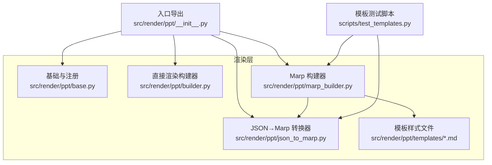
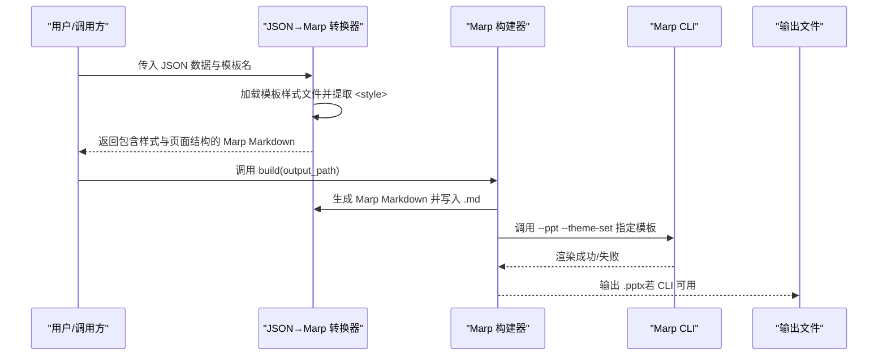
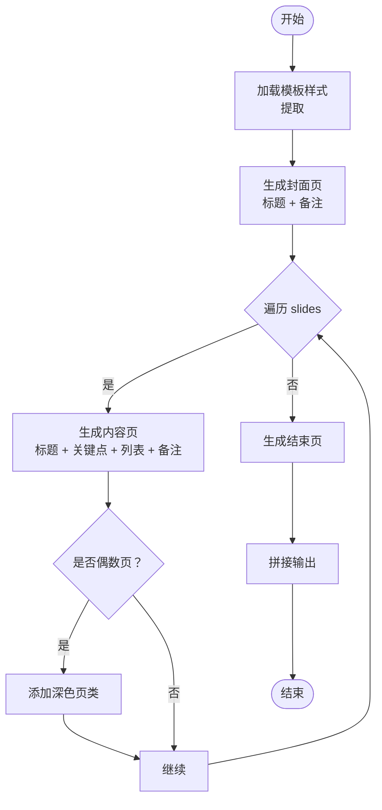
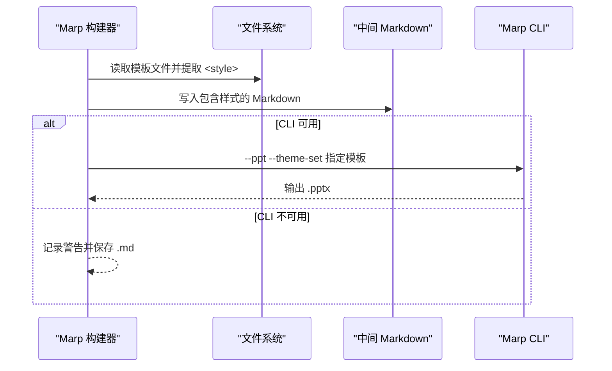
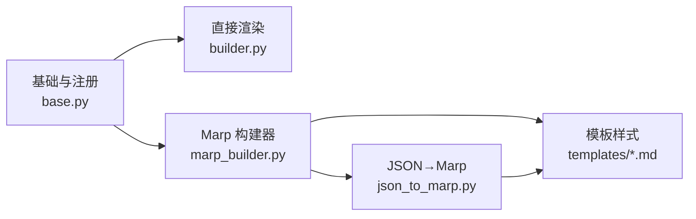

# 模板开发与定制

<cite>
**本文引用的文件**
- [README.md](file://README.md)
- [src/render/ppt/__init__.py](file://src/render/ppt/__init__.py)
- [src/render/ppt/base.py](file://src/render/ppt/base.py)
- [src/render/ppt/builder.py](file://src/render/ppt/builder.py)
- [src/render/ppt/marp_builder.py](file://src/render/ppt/marp_builder.py)
- [src/render/ppt/json_to_marp.py](file://src/render/ppt/json_to_marp.py)
- [src/render/ppt/templates/default.md](file://src/render/ppt/templates/default.md)
- [src/render/ppt/templates/minimal.md](file://src/render/ppt/templates/minimal.md)
- [src/render/ppt/templates/corporate.md](file://src/render/ppt/templates/corporate.md)
- [src/render/ppt/templates/dark.md](file://src/render/ppt/templates/dark.md)
- [src/render/ppt/templates/gradient.md](file://src/render/ppt/templates/gradient.md)
- [scripts/test_templates.py](file://scripts/test_templates.py)
- [src/prompts/generate_slides_from_script.md](file://src/prompts/generate_slides_from_script.md)
</cite>

## 目录
1. [简介](#简介)
2. [项目结构](#项目结构)
3. [核心组件](#核心组件)
4. [架构总览](#架构总览)
5. [详细组件分析](#详细组件分析)
6. [依赖关系分析](#依赖关系分析)
7. [性能与优化](#性能与优化)
8. [故障排查指南](#故障排查指南)
9. [结论](#结论)
10. [附录](#附录)

## 简介
本指南面向希望基于本仓库开发与定制 PPT 模板的工程师与设计师。内容涵盖：
- Markdown 模板语法规范（标题层级、文本格式、列表样式、链接与图片插入等）
- 模板样式定制方法（主题颜色、字体、布局、背景设计）
- 现有模板设计理念与适用场景（default、minimal、corporate、gradient、dark）
- JSON 到 Marp 的转换机制（数据结构映射、字段映射规则、动态内容生成）
- 模板开发最佳实践（响应式设计、可访问性、跨平台兼容）
- 模板加载流程、缓存与性能优化技巧
- 完整模板开发示例（从需求分析到最终实现）

## 项目结构
渲染层位于 src/render/ppt，包含两类构建器与模板系统：
- 直接渲染构建器：通过 LLM 生成设计蓝图，使用 python-pptx 直接绘制
- Marp 构建器：将 JSON 数据转换为 Marp Markdown，并调用 Marp CLI 导出 PPT

图表来源
- [src/render/ppt/__init__.py](file://src/render/ppt/__init__.py#L1-L20)
- [src/render/ppt/base.py](file://src/render/ppt/base.py#L1-L42)
- [src/render/ppt/builder.py](file://src/render/ppt/builder.py#L1-L194)
- [src/render/ppt/marp_builder.py](file://src/render/ppt/marp_builder.py#L1-L94)
- [src/render/ppt/json_to_marp.py](file://src/render/ppt/json_to_marp.py#L1-L139)
- [src/render/ppt/templates/default.md](file://src/render/ppt/templates/default.md#L1-L36)
- [scripts/test_templates.py](file://scripts/test_templates.py#L1-L152)

章节来源
- [README.md](file://README.md#L87-L148)
- [src/render/ppt/__init__.py](file://src/render/ppt/__init__.py#L1-L20)

## 核心组件
- 抽象基类与注册机制：定义统一接口与注册表，便于扩展新的构建器
- 直接渲染构建器：以 LLM 生成的“设计蓝图”为输入，直接绘制 PPT
- Marp 构建器：将 JSON 数据转换为 Marp Markdown，并通过 Marp CLI 导出 PPT
- JSON→Marp 转换器：负责模板样式注入、页面结构生成、备注处理
- 模板样式文件：以 CSS 定义主题风格，支持多套风格切换

章节来源
- [src/render/ppt/base.py](file://src/render/ppt/base.py#L1-L42)
- [src/render/ppt/builder.py](file://src/render/ppt/builder.py#L1-L194)
- [src/render/ppt/marp_builder.py](file://src/render/ppt/marp_builder.py#L1-L94)
- [src/render/ppt/json_to_marp.py](file://src/render/ppt/json_to_marp.py#L1-L139)

## 架构总览
下面的序列图展示了从 JSON 到 PPT 的完整流程，以及模板样式如何被注入与应用。

图表来源
- [src/render/ppt/json_to_marp.py](file://src/render/ppt/json_to_marp.py#L39-L110)
- [src/render/ppt/marp_builder.py](file://src/render/ppt/marp_builder.py#L59-L94)

## 详细组件分析

### JSON 到 Marp 的转换机制
- 数据结构映射
  - 输入 JSON 至少包含标题与幻灯片数组，每张幻灯片包含标识、标题、关键点、要点列表与备注
  - 输出为符合 Marp 规范的 Markdown，包含文件头、封面、内容页与结束页
- 字段映射规则
  - 标题页：使用 JSON 的 title，封面备注可取第一张幻灯片的 speaker_notes
  - 内容页：逐条遍历 slides，交替使用深色页（偶数页）以增强对比
  - 备注：每页的 speaker_notes 以注释形式写入
- 动态内容生成
  - 模板样式通过正则提取模板文件中的 <style> 部分并注入到输出 Markdown
  - 页面分隔符与类名（如 cover、ending、dark）用于控制布局与主题

图表来源
- [src/render/ppt/json_to_marp.py](file://src/render/ppt/json_to_marp.py#L39-L110)

章节来源
- [src/render/ppt/json_to_marp.py](file://src/render/ppt/json_to_marp.py#L1-L139)

### 模板样式与设计理念
- default（默认简洁商务风格）
  - 覆盖页与结束页使用渐变背景，标题与正文采用清晰对比色
  - 使用两列布局，图片与文字并排，强调信息密度
  - 适用于通用商务汇报场景
- minimal（极简风格）
  - 白底黑字，强调留白与可读性
  - 使用左侧强调线突出二级标题，适合强调“轻量化”与“高信息密度”
- corporate（商务风格）
  - 使用蓝色系渐变，强调专业与权威感
  - 二级标题带背景与边框，突出重点
- gradient（渐变风格）
  - 强调视觉冲击力，使用多色渐变背景与装饰符号
  - 适合创意类或品牌展示场景
- dark（暗黑风格）
  - 深色背景配亮色文字与蓝色高光，适合夜间演示或科技感场景
  - 代码块与引用块有专门样式

章节来源
- [src/render/ppt/templates/default.md](file://src/render/ppt/templates/default.md#L1-L36)
- [src/render/ppt/templates/minimal.md](file://src/render/ppt/templates/minimal.md#L1-L35)
- [src/render/ppt/templates/corporate.md](file://src/render/ppt/templates/corporate.md#L1-L35)
- [src/render/ppt/templates/gradient.md](file://src/render/ppt/templates/gradient.md#L1-L35)
- [src/render/ppt/templates/dark.md](file://src/render/ppt/templates/dark.md#L1-L37)

### 模板加载与渲染流程
- 模板加载
  - 通过模板名定位模板文件，读取并提取 <style> 部分
  - 将样式注入到生成的 Marp Markdown 头部
- 渲染流程
  - 生成中间 Markdown 文件
  - 若检测到 Marp CLI，调用 --ppt --theme-set 指定模板文件进行渲染
  - 若未安装 CLI，则仅保存中间 Markdown 以便预览或后续手动渲染

图表来源
- [src/render/ppt/marp_builder.py](file://src/render/ppt/marp_builder.py#L59-L94)
- [src/render/ppt/json_to_marp.py](file://src/render/ppt/json_to_marp.py#L26-L36)

章节来源
- [src/render/ppt/marp_builder.py](file://src/render/ppt/marp_builder.py#L1-L94)
- [src/render/ppt/json_to_marp.py](file://src/render/ppt/json_to_marp.py#L1-L139)

### 直接渲染构建器（对比参考）
- 该构建器通过 LLM 生成“设计蓝图”，然后使用 python-pptx 直接绘制
- 与 Marp 方案相比，直接渲染更可控但开发成本更高
- 了解其设计原则有助于在模板开发中平衡“样式约束”与“内容表达”

章节来源
- [src/render/ppt/builder.py](file://src/render/ppt/builder.py#L1-L194)

## 依赖关系分析
- 组件耦合
  - Marp 构建器依赖 JSON→Marp 转换器与模板样式文件
  - 注册表统一管理构建器类型，便于扩展
- 外部依赖
  - Marp CLI：用于将 Markdown 渲染为 PPT
  - Python 包：python-pptx（直接渲染）、subprocess（调用 CLI）

图表来源
- [src/render/ppt/base.py](file://src/render/ppt/base.py#L1-L42)
- [src/render/ppt/builder.py](file://src/render/ppt/builder.py#L1-L194)
- [src/render/ppt/marp_builder.py](file://src/render/ppt/marp_builder.py#L1-L94)
- [src/render/ppt/json_to_marp.py](file://src/render/ppt/json_to_marp.py#L1-L139)
- [src/render/ppt/templates/default.md](file://src/render/ppt/templates/default.md#L1-L36)

章节来源
- [src/render/ppt/__init__.py](file://src/render/ppt/__init__.py#L1-L20)

## 性能与优化
- 模板样式注入
  - 仅提取 <style> 部分并注入一次，避免重复解析
- 渲染路径选择
  - 优先使用 Marp CLI 一键渲染；若不可用，保存中间 Markdown 以降低重复计算
- 文件 I/O
  - 中间 Markdown 与最终 PPT 分离，便于调试与缓存
- 可选优化建议
  - 对模板样式进行压缩与去重
  - 在批量生成时复用同一模板实例
  - 对外链图片进行本地缓存或预下载

[本节为通用指导，无需特定文件引用]

## 故障排查指南
- Marp CLI 未安装
  - 现象：仅保存中间 Markdown，未生成 PPT
  - 处理：安装 Marp CLI 后重新运行
- 模板样式未生效
  - 现象：PPT 仍为默认样式
  - 处理：确认模板文件存在且包含 <style>；检查模板名与路径
- JSON 格式错误
  - 现象：解析失败或生成内容异常
  - 处理：确保 JSON 包含 title 与 slides；每条幻灯片包含标题与要点列表
- 备注未显示
  - 现象：PPT 中无备注
  - 处理：确认每条幻灯片包含 speaker_notes；或检查生成的注释标记是否正确

章节来源
- [src/render/ppt/marp_builder.py](file://src/render/ppt/marp_builder.py#L38-L57)
- [src/render/ppt/json_to_marp.py](file://src/render/ppt/json_to_marp.py#L113-L139)
- [scripts/test_templates.py](file://scripts/test_templates.py#L134-L147)

## 结论
本项目提供了两种成熟的 PPT 生成路径：Marp 渲染与直接渲染。前者通过模板样式与 Markdown 结构实现高度可定制的视觉风格，后者通过 LLM 设计蓝图实现更灵活的布局控制。结合本指南的语法规范、定制方法与最佳实践，开发者可以快速构建符合业务场景的高质量 PPT 模板，并在团队内形成可复用的设计资产。

[本节为总结性内容，无需特定文件引用]

## 附录

### Markdown 模板语法规范（摘要）
- 标题层级
  - 使用 # 与 ## 表示封面与内容页标题
- 文本格式
  - 引用块用于强调金句或提示
  - 代码块用于展示代码片段（暗黑模板提供专门样式）
- 列表样式
  - 使用短句与关键词，避免长段落
  - 列表项可配合装饰符号或强调线
- 链接与图片
  - 支持标准 Markdown 链接与图片语法
  - 图片建议使用本地路径或已缓存资源
- 页面结构
  - 使用分隔符与类名控制封面、深色页与结束页
  - 备注使用注释标记

章节来源
- [src/prompts/generate_slides_from_script.md](file://src/prompts/generate_slides_from_script.md#L1-L62)
- [src/render/ppt/json_to_marp.py](file://src/render/ppt/json_to_marp.py#L39-L110)

### 模板样式定制方法（步骤）
- 主题颜色
  - 在模板文件中修改 cover、ending、h1/h2、ul/li 等选择器的颜色值
- 字体配置
  - 修改 section 与标题选择器的字体族与字号
- 布局调整
  - 调整 .row/.col-img/.col-text 的 flex 布局参数
- 背景设计
  - 修改 cover 与 section 的背景色或渐变
- 深色页与强调
  - 通过 .dark 与 .highlight 等类名实现对比与强调

章节来源
- [src/render/ppt/templates/default.md](file://src/render/ppt/templates/default.md#L1-L36)
- [src/render/ppt/templates/minimal.md](file://src/render/ppt/templates/minimal.md#L1-L35)
- [src/render/ppt/templates/corporate.md](file://src/render/ppt/templates/corporate.md#L1-L35)
- [src/render/ppt/templates/gradient.md](file://src/render/ppt/templates/gradient.md#L1-L35)
- [src/render/ppt/templates/dark.md](file://src/render/ppt/templates/dark.md#L1-L37)

### 现有模板特点与适用场景
- default：通用商务风格，适合常规汇报
- minimal：极简风格，适合强调可读性与留白
- corporate：商务风格，适合企业内部或对外正式场合
- gradient：强调视觉冲击，适合创意或品牌展示
- dark：科技感与夜间演示，适合技术分享或专题演讲

章节来源
- [src/render/ppt/templates/default.md](file://src/render/ppt/templates/default.md#L1-L36)
- [src/render/ppt/templates/minimal.md](file://src/render/ppt/templates/minimal.md#L1-L35)
- [src/render/ppt/templates/corporate.md](file://src/render/ppt/templates/corporate.md#L1-L35)
- [src/render/ppt/templates/gradient.md](file://src/render/ppt/templates/gradient.md#L1-L35)
- [src/render/ppt/templates/dark.md](file://src/render/ppt/templates/dark.md#L1-L37)

### JSON 到 Marp 的字段映射
- 输入 JSON
  - title：封面标题
  - slides：数组，每项包含 id、title、key_points、bullet_points、speaker_notes
- 输出 Markdown
  - 文件头：分页与类名控制
  - 封面：标题与备注
  - 内容页：标题、关键点、要点列表、备注
  - 结束页：致谢语

章节来源
- [src/render/ppt/json_to_marp.py](file://src/render/ppt/json_to_marp.py#L39-L110)

### 模板开发最佳实践
- 响应式设计
  - 使用相对单位与弹性布局，保证在不同分辨率下的可读性
- 可访问性
  - 保持足够的颜色对比度；为图片提供替代文本
- 跨平台兼容
  - 优先使用通用字体族；避免依赖平台独有特性
- 可维护性
  - 将样式抽取为独立模板文件；统一命名规范与注释

[本节为通用指导，无需特定文件引用]

### 模板加载流程、缓存与性能优化
- 加载流程
  - 通过模板名定位文件，提取 <style> 并注入到输出 Markdown
- 缓存机制
  - 可缓存已解析的样式字符串，减少重复正则匹配
- 性能优化
  - 批量生成时复用模板实例；避免重复 I/O
  - 对外链资源进行本地缓存或预下载

章节来源
- [src/render/ppt/json_to_marp.py](file://src/render/ppt/json_to_marp.py#L26-L36)
- [src/render/ppt/marp_builder.py](file://src/render/ppt/marp_builder.py#L59-L94)

### 完整模板开发示例（从需求分析到实现）
- 需求分析
  - 明确目标受众与场景（如科技分享、产品介绍、内部汇报）
  - 确定风格倾向（商务、极简、创意、暗黑）
- 设计草图
  - 绘制页面结构草图，确定封面、内容页与结束页的元素分布
- 模板实现
  - 在 templates 目录新增模板文件，定义 <style> 与布局类
  - 在 JSON→Marp 转换器中验证样式注入逻辑
- 验证与测试
  - 使用 scripts/test_templates.py 生成示例 PPT，检查视觉效果
  - 如需 CLI 渲染，确保已安装 Marp CLI 并正确配置

章节来源
- [scripts/test_templates.py](file://scripts/test_templates.py#L1-L152)
- [src/render/ppt/json_to_marp.py](file://src/render/ppt/json_to_marp.py#L39-L110)
- [src/render/ppt/marp_builder.py](file://src/render/ppt/marp_builder.py#L59-L94)