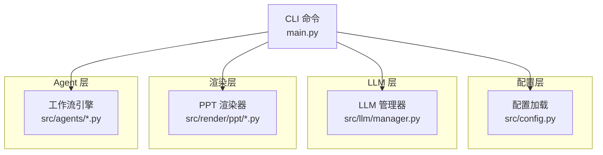
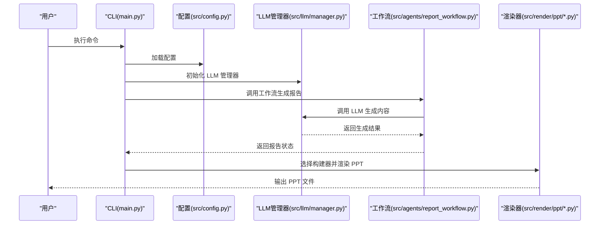
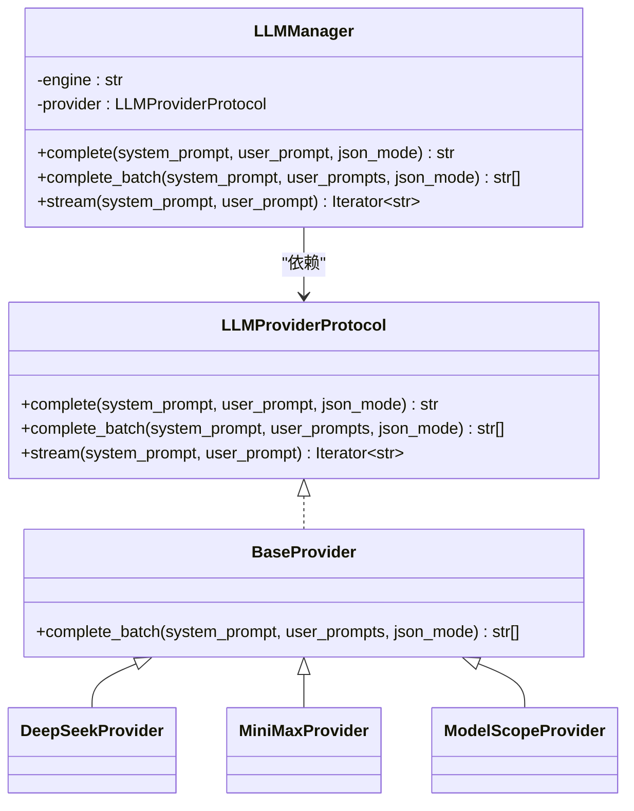
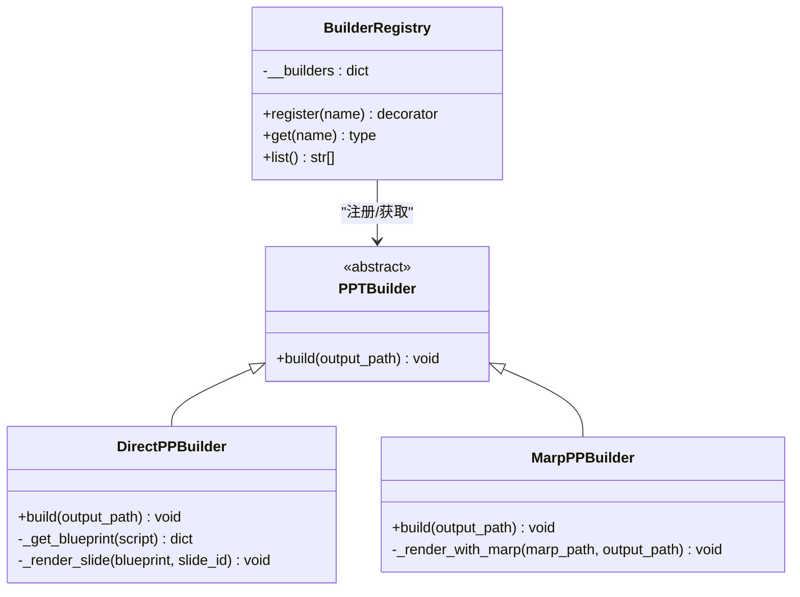
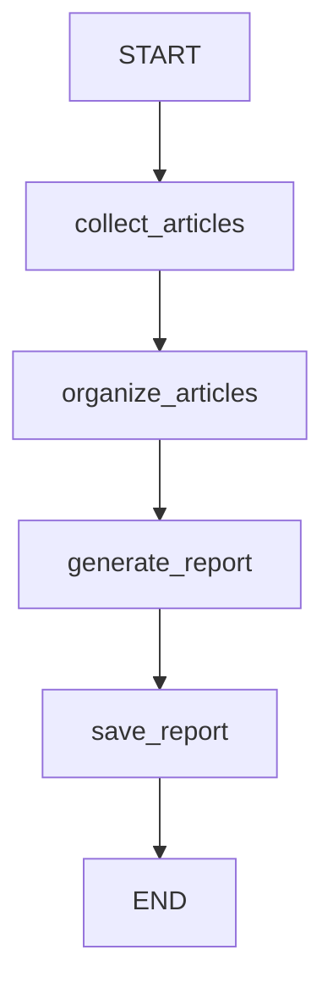
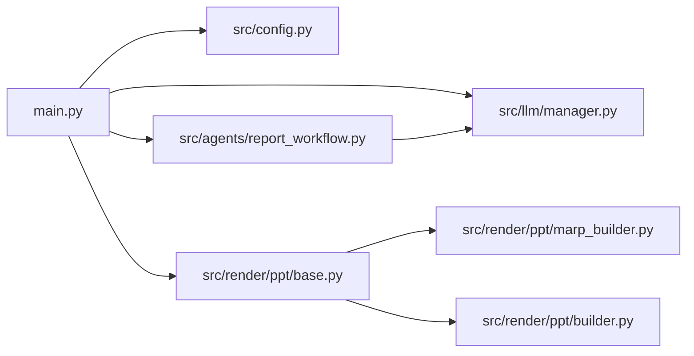

# 扩展开发指南

<cite>
**本文引用的文件**
- [README.md](file://README.md)
- [main.py](file://main.py)
- [config.yaml](file://config.yaml)
- [src/config.py](file://src/config.py)
- [src/llm/manager.py](file://src/llm/manager.py)
- [src/render/ppt/base.py](file://src/render/ppt/base.py)
- [src/render/ppt/builder.py](file://src/render/ppt/builder.py)
- [src/render/ppt/marp_builder.py](file://src/render/ppt/marp_builder.py)
- [src/render/ppt/json_to_marp.py](file://src/render/ppt/json_to_marp.py)
- [src/render/ppt/templates/default.md](file://src/render/ppt/templates/default.md)
- [src/render/ppt/templates/corporate.md](file://src/render/ppt/templates/corporate.md)
- [src/render/ppt/templates/dark.md](file://src/render/ppt/templates/dark.md)
- [src/agents/report_workflow.py](file://src/agents/report_workflow.py)
- [src/agents/article_parser_langgraph.py](file://src/agents/article_parser_langgraph.py)
- [skills/code_review/skill.yaml](file://skills/code_review/skill.yaml)
- [skills/test_gen/skill.yaml](file://skills/test_gen/skill.yaml)
</cite>

## 目录
1. [简介](#简介)
2. [项目结构](#项目结构)
3. [核心组件](#核心组件)
4. [架构总览](#架构总览)
5. [详细组件分析](#详细组件分析)
6. [依赖关系分析](#依赖关系分析)
7. [性能考量](#性能考量)
8. [故障排查指南](#故障排查指南)
9. [结论](#结论)
10. [附录](#附录)

## 简介
本指南面向希望在 Brief Agent 上进行扩展开发的工程师，覆盖以下主题：
- 新增 LLM Provider 的完整流程：接口实现、配置管理、错误处理与回退策略
- PPT 构建器扩展：BaseBuilder 抽象类继承、新模板开发、渲染逻辑实现
- Agent 工作流扩展：LangGraph 工作流设计模式、节点定义、状态管理
- Claude Code Skills 的开发方法：指令编写、技能配置、调用接口
- 插件系统使用指南：注册机制、生命周期管理、依赖注入
- 最佳实践与常见陷阱
- 完整扩展示例与测试方法

## 项目结构
Brief Agent 采用“分层 + 功能域”的组织方式：
- CLI 层：命令入口与参数解析
- 配置层：类型安全的配置加载与环境变量替换
- LLM 层：统一 Provider 协议与多厂商适配
- 渲染层：PPT 构建器抽象与多种实现
- Agent 层：基于 LangGraph 的工作流
- 业务服务与存储：RSS 抓取、数据库、向量库、日志
- 技能层：Claude Code Skills 的指令与配置

图表来源
- [main.py](file://main.py#L1-L227)
- [src/config.py](file://src/config.py#L74-L109)
- [src/llm/manager.py](file://src/llm/manager.py#L206-L318)
- [src/agents/report_workflow.py](file://src/agents/report_workflow.py#L186-L238)
- [src/render/ppt/base.py](file://src/render/ppt/base.py#L16-L42)

章节来源
- [README.md](file://README.md#L87-L148)
- [main.py](file://main.py#L1-L227)

## 核心组件
- 配置系统：基于 Pydantic 的类型安全配置，支持环境变量占位符替换
- LLM 管理器：统一 Provider 协议、批量推理、流式生成、回退到环境变量
- PPT 渲染器：抽象构建器 + 注册机制；Direct 与 Marp 两种实现
- Agent 工作流：LangGraph StateGraph，节点职责清晰，状态字段明确
- 技能系统：技能 YAML + 指令文件，便于扩展 Claude Code Skills

章节来源
- [src/config.py](file://src/config.py#L14-L109)
- [src/llm/manager.py](file://src/llm/manager.py#L22-L318)
- [src/render/ppt/base.py](file://src/render/ppt/base.py#L7-L42)
- [src/render/ppt/builder.py](file://src/render/ppt/builder.py#L22-L194)
- [src/render/ppt/marp_builder.py](file://src/render/ppt/marp_builder.py#L21-L94)
- [src/agents/report_workflow.py](file://src/agents/report_workflow.py#L25-L238)

## 架构总览
Brief Agent 的扩展点主要集中在 LLM Provider、PPT 构建器、Agent 工作流与技能系统四部分。下图展示了 CLI 如何协调这些组件：

图表来源
- [main.py](file://main.py#L107-L188)
- [src/config.py](file://src/config.py#L74-L109)
- [src/llm/manager.py](file://src/llm/manager.py#L243-L318)
- [src/agents/report_workflow.py](file://src/agents/report_workflow.py#L217-L238)
- [src/render/ppt/base.py](file://src/render/ppt/base.py#L16-L42)

## 详细组件分析

### LLM Provider 扩展开发指南
目标：新增一个第三方 LLM Provider，并确保配置、错误处理与回退策略完备。

- Provider 接口与协议
  - 统一协议：定义 complete、complete_batch、stream 方法
  - 基类复用：BaseProvider 提供 complete_batch 的线程池实现
  - 示例参考：DeepSeekProvider、MiniMaxProvider、ModelScopeProvider

- 配置管理
  - 配置结构：llm.default 与 llm.providers 下的 provider 节点
  - 环境变量：支持 ${ENV_VAR} 占位符，运行时替换
  - 加载流程：load_config → _replace_env_vars → Pydantic 校验

- 错误处理与回退
  - 配置加载失败时记录警告并回退到环境变量
  - Provider 初始化失败抛出明确异常
  - API 错误统一捕获并抛出可诊断异常

- 扩展步骤
  1) 在配置文件中新增 provider 节点
  2) 在 LLMManager._create_provider 中增加分支，返回新 Provider 实例
  3) 实现新 Provider 的 complete/stream，遵循协议
  4) 在 CLI 或工作流中通过 LLMManager(engine="your-provider") 使用

图表来源
- [src/llm/manager.py](file://src/llm/manager.py#L22-L318)

章节来源
- [config.yaml](file://config.yaml#L4-L22)
- [src/config.py](file://src/config.py#L74-L109)
- [src/llm/manager.py](file://src/llm/manager.py#L243-L318)

### PPT 构建器扩展开发指南
目标：新增一种 PPT 构建器，支持新模板与渲染逻辑。

- 抽象与注册
  - 抽象基类：PPTBuilder 定义 build 接口
  - 注册机制：BuilderRegistry 提供装饰器注册与按名获取

- 现有实现
  - DirectPPBuilder：直接渲染，使用 python-pptx
  - MarpPPBuilder：JSON → Marp Markdown → PPT，支持模板注入

- 新模板开发
  - 模板文件：位于 templates/ 目录，Marp 模板以 <style> 注入样式
  - 模板加载：json_to_marp.py 读取模板并提取样式注入

- 新构建器实现步骤
  1) 继承 PPTBuilder，实现 build(output_path)
  2) 使用 @BuilderRegistry.register("your-builder") 注册
  3) 在 CLI 或渲染流程中通过 BuilderRegistry.get("your-builder") 获取
  4) 模板样式可复用现有 Marp 模板或自定义

图表来源
- [src/render/ppt/base.py](file://src/render/ppt/base.py#L7-L42)
- [src/render/ppt/builder.py](file://src/render/ppt/builder.py#L22-L194)
- [src/render/ppt/marp_builder.py](file://src/render/ppt/marp_builder.py#L21-L94)

章节来源
- [src/render/ppt/base.py](file://src/render/ppt/base.py#L7-L42)
- [src/render/ppt/builder.py](file://src/render/ppt/builder.py#L22-L194)
- [src/render/ppt/marp_builder.py](file://src/render/ppt/marp_builder.py#L21-L94)
- [src/render/ppt/json_to_marp.py](file://src/render/ppt/json_to_marp.py#L26-L139)
- [src/render/ppt/templates/default.md](file://src/render/ppt/templates/default.md#L1-L36)
- [src/render/ppt/templates/corporate.md](file://src/render/ppt/templates/corporate.md#L1-L35)
- [src/render/ppt/templates/dark.md](file://src/render/ppt/templates/dark.md#L1-L37)

### Agent 工作流扩展开发指南
目标：基于 LangGraph 设计新的 Agent 工作流，定义节点、状态与控制流。

- 设计模式
  - StateGraph：明确的状态类型、节点函数、边连接
  - 单一职责：每个节点只做一件事（加载、解析、生成、保存）

- 状态定义
  - TypedDict：明确字段与含义，便于调试与契约约束
  - 示例：DailyReportState、ArticleState

- 节点函数
  - 输入输出：接收当前状态，返回更新后的状态
  - 错误处理：失败时设置 status 与 error，避免中断整个工作流

- 控制流
  - START → NODES → END
  - 使用 add_node/add_edge 构建有向无环图

- 扩展步骤
  1) 定义新的 State 类型
  2) 编写节点函数（加载/处理/保存）
  3) create_*_workflow 中注册节点与边
  4) 提供 get_workflow 单例与主函数入口

图表来源
- [src/agents/report_workflow.py](file://src/agents/report_workflow.py#L186-L201)

章节来源
- [src/agents/report_workflow.py](file://src/agents/report_workflow.py#L25-L238)
- [src/agents/article_parser_langgraph.py](file://src/agents/article_parser_langgraph.py#L24-L226)

### Claude Code Skills 开发指南
目标：为 Claude Code Skills 新增指令与配置，实现特定场景的自动化辅助。

- 技能结构
  - skill.yaml：声明 name、description、instructions 指向的指令文件
  - instructions.md：具体触发词与检查维度（安全性、正确性、性能等）

- 开发步骤
  1) 在 skills/your_skill/ 下创建 skill.yaml 与 instructions.md
  2) 在 skill.yaml 中配置 name 与 instructions 指向的文件
  3) 在 README 或相关文档中说明触发词与使用场景

章节来源
- [skills/code_review/skill.yaml](file://skills/code_review/skill.yaml#L1-L4)
- [skills/test_gen/skill.yaml](file://skills/test_gen/skill.yaml#L1-L4)
- [README.md](file://README.md#L182-L214)

### 插件系统使用指南
Brief Agent 的插件系统以“注册 + 获取”为核心：
- 注册机制：BuilderRegistry.register(name)(Class) 将构建器注册到全局表
- 生命周期：通过单例缓存（如工作流编译结果）减少重复初始化
- 依赖注入：CLI 与工作流通过工厂函数获取 LLM/DB 实例，便于替换与测试

最佳实践
- 明确职责边界：每个插件只负责单一能力
- 异常显式化：Provider 初始化失败、API 调用失败应抛出可诊断异常
- 配置优先：优先从配置文件加载，失败回退到环境变量
- 模块化：模板、提示词、指令文件分离，便于维护与复用

章节来源
- [src/render/ppt/base.py](file://src/render/ppt/base.py#L16-L42)
- [src/agents/report_workflow.py](file://src/agents/report_workflow.py#L207-L213)

## 依赖关系分析
- 配置依赖：CLI 依赖配置加载；LLM 管理器依赖配置；渲染器依赖模板与配置
- LLM 依赖：Agent 工作流依赖 LLM；CLI 的 PPT 生成也依赖 LLM
- 渲染依赖：CLI 通过 BuilderRegistry 获取构建器；Marp 构建器依赖本地 Marp CLI

图表来源
- [main.py](file://main.py#L14-L21)
- [src/config.py](file://src/config.py#L74-L109)
- [src/llm/manager.py](file://src/llm/manager.py#L243-L318)
- [src/agents/report_workflow.py](file://src/agents/report_workflow.py#L186-L238)
- [src/render/ppt/base.py](file://src/render/ppt/base.py#L16-L42)
- [src/render/ppt/marp_builder.py](file://src/render/ppt/marp_builder.py#L21-L94)
- [src/render/ppt/builder.py](file://src/render/ppt/builder.py#L22-L194)

章节来源
- [main.py](file://main.py#L14-L21)
- [src/render/ppt/base.py](file://src/render/ppt/base.py#L16-L42)

## 性能考量
- 批量推理：BaseProvider.complete_batch 使用线程池并发调用，注意合理设置最大并发
- I/O 密集：PPT 渲染涉及磁盘与外部 CLI（Marp），建议异步化与缓存中间产物
- 状态持久化：工作流节点间传递状态尽量轻量，避免序列化开销
- 配置加载：配置仅在应用启动时加载，避免频繁 IO

## 故障排查指南
- LLM Provider 初始化失败
  - 检查配置文件中的 api_key/base_url/model 是否正确
  - 若配置加载失败，确认环境变量是否设置且可被替换
- API 调用异常
  - 捕获并记录 HTTP 状态码与响应体，定位上游错误
- PPT 渲染失败
  - Marp CLI 未安装：查看日志中的 warning 并安装 Marp CLI
  - 模板样式缺失：确认模板文件存在且包含 <style> 部分
- 工作流卡住
  - 检查节点函数是否设置 status/error
  - 使用日志定位失败节点与异常栈

章节来源
- [src/llm/manager.py](file://src/llm/manager.py#L276-L295)
- [src/render/ppt/marp_builder.py](file://src/render/ppt/marp_builder.py#L37-L94)
- [src/render/ppt/builder.py](file://src/render/ppt/builder.py#L75-L84)
- [src/agents/report_workflow.py](file://src/agents/report_workflow.py#L59-L61)

## 结论
Brief Agent 提供了清晰的扩展点与成熟的工程实践：
- LLM Provider：协议 + 基类 + 配置 + 回退，易于新增与维护
- PPT 构建器：抽象 + 注册 + 模板，支持多种渲染路径
- Agent 工作流：LangGraph + 明确状态 + 单一职责，便于演进
- 技能系统：YAML + 指令文件，降低协作成本

## 附录

### 扩展示例与测试方法
- 新增 LLM Provider
  - 在配置文件中添加 provider 节点
  - 在 LLMManager 中增加分支并返回新 Provider
  - 编写单元测试验证 complete/stream/批量推理
- 新增 PPT 构建器
  - 继承 PPTBuilder，实现 build
  - 使用 @BuilderRegistry.register 注册
  - 编写集成测试：CLI 传入 --builder 参数，验证输出文件
- 新增 Agent 工作流
  - 定义 State 类型，编写节点函数
  - 在 create_*_workflow 中注册节点与边
  - 编写单测：构造初始状态，断言最终状态与关键字段
- 新增 Claude Code Skill
  - 在 skills/your_skill/ 下创建 skill.yaml 与 instructions.md
  - 在 README 中补充触发词与使用说明
- 测试建议
  - 使用 pytest 进行单元与集成测试
  - 使用 patch/mock 替换外部依赖（LLM、文件系统、子进程）

章节来源
- [README.md](file://README.md#L232-L237)
- [main.py](file://main.py#L107-L188)
- [src/llm/manager.py](file://src/llm/manager.py#L243-L318)
- [src/render/ppt/base.py](file://src/render/ppt/base.py#L16-L42)
- [src/agents/report_workflow.py](file://src/agents/report_workflow.py#L186-L238)