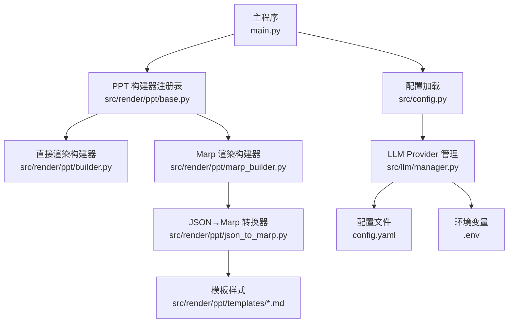
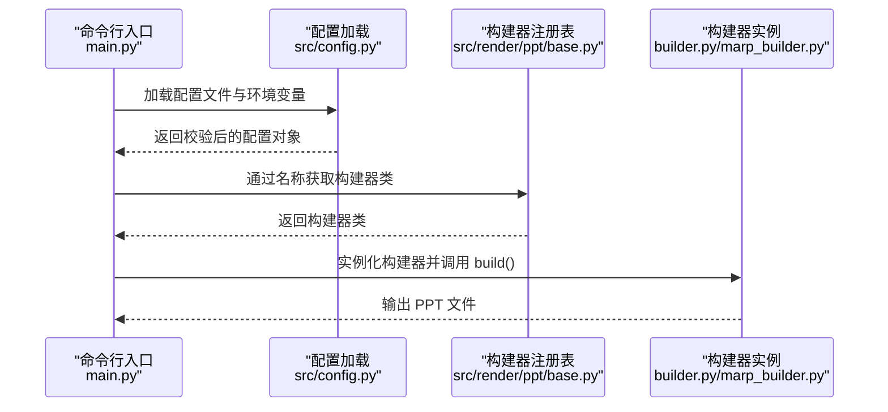
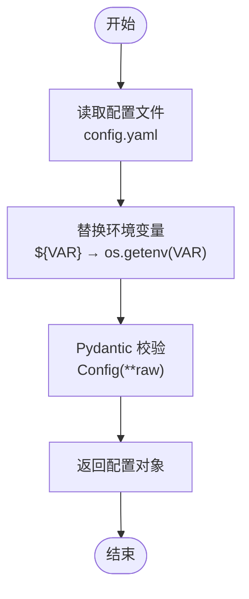
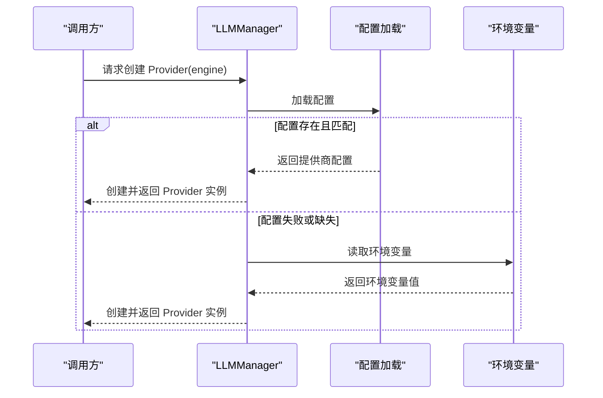
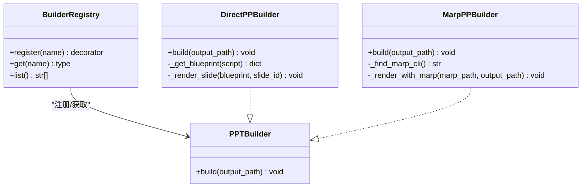
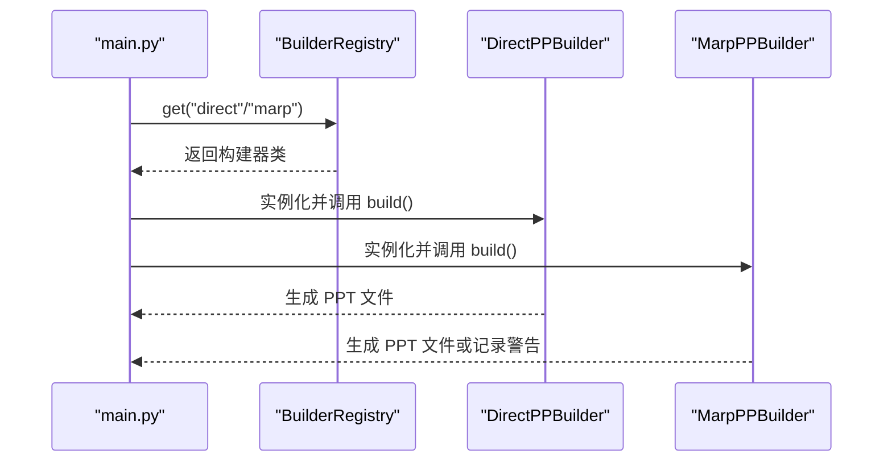
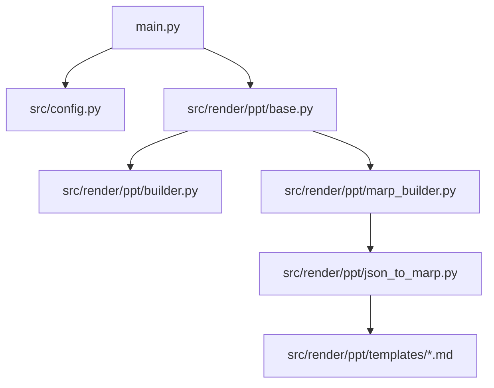

# 插件系统使用指南

<cite>
**本文档引用的文件**
- [main.py](file://main.py)
- [config.py](file://src/config.py)
- [config.yaml](file://config.yaml)
- [base.py](file://src/render/ppt/base.py)
- [builder.py](file://src/render/ppt/builder.py)
- [marp_builder.py](file://src/render/ppt/marp_builder.py)
- [json_to_marp.py](file://src/render/ppt/json_to_marp.py)
- [default.md](file://src/render/ppt/templates/default.md)
- [skill.yaml](file://skills/code_review/skill.yaml)
- [instructions.md](file://skills/code_review/instructions.md)
- [env.example](file://env.example)
- [pyproject.toml](file://pyproject.toml)
</cite>

## 目录
1. [简介](#简介)
2. [项目结构](#项目结构)
3. [核心组件](#核心组件)
4. [架构总览](#架构总览)
5. [详细组件分析](#详细组件分析)
6. [依赖关系分析](#依赖关系分析)
7. [性能考虑](#性能考虑)
8. [故障排除指南](#故障排除指南)
9. [结论](#结论)

## 简介
本指南面向 Brief Agent 的使用者与开发者，系统阐述其插件架构与使用方法，重点覆盖：
- Provider 注册机制与 LLM Provider 配置加载
- PPT 构建器注册表与插件生命周期管理
- 配置文件编写、插件启用/禁用与版本兼容性管理
- 插件开发最佳实践、错误处理与性能优化
- 扩展点识别与安全考虑

Brief Agent 当前实现了两类插件化能力：
- LLM Provider 管理：通过配置文件与环境变量动态选择与加载不同大模型提供商
- PPT 构建器插件：通过注册表机制扩展多种 PPT 渲染方式（直接渲染与基于 Marp 的渲染）

## 项目结构
Brief Agent 采用模块化组织，插件系统主要分布在以下模块：
- 配置加载：src/config.py 与 config.yaml
- LLM Provider 管理：src/llm/manager.py（与配置联动）
- PPT 构建器插件：src/render/ppt/base.py（注册表）、builder.py（直接渲染）、marp_builder.py（Marp 渲染）
- 技能插件：skills/ 下的技能定义与说明

图表来源
- [main.py](file://main.py#L1-L227)
- [config.py](file://src/config.py#L1-L109)
- [base.py](file://src/render/ppt/base.py#L1-L42)
- [builder.py](file://src/render/ppt/builder.py#L1-L194)
- [marp_builder.py](file://src/render/ppt/marp_builder.py#L1-L94)
- [json_to_marp.py](file://src/render/ppt/json_to_marp.py#L1-L139)

章节来源
- [main.py](file://main.py#L1-L227)
- [config.py](file://src/config.py#L1-L109)

## 核心组件
- 配置加载系统
  - 支持 YAML 配置文件与环境变量注入，自动替换 ${VAR} 形式的占位符
  - 通过 Pydantic 模型校验配置结构，确保类型安全
- LLM Provider 管理
  - 基于配置文件中的 providers 字段动态创建 Provider 实例
  - 支持 minimax、modelscope、deepseek 等提供商
- PPT 构建器插件体系
  - 抽象基类 PPTBuilder 与 BuilderRegistry 注册表
  - 内置 direct 与 marp 两种构建器，可通过注册表扩展

章节来源
- [config.py](file://src/config.py#L74-L108)
- [config.yaml](file://config.yaml#L1-L54)
- [base.py](file://src/render/ppt/base.py#L16-L42)
- [builder.py](file://src/render/ppt/builder.py#L22-L24)
- [marp_builder.py](file://src/render/ppt/marp_builder.py#L21-L23)

## 架构总览
Brief Agent 的插件系统围绕“配置驱动 + 注册表”的模式展开：
- 配置驱动：通过 config.yaml 与环境变量提供运行期参数，LLM Provider 与 PPT 构建器均依据配置动态加载
- 注册表：BuilderRegistry 以装饰器方式注册构建器类，运行时按名称获取并实例化
- 生命周期：配置加载（初始化）→ 插件实例化（加载）→ 使用（运行时）→ 错误回退（热更新/兼容）

图表来源
- [main.py](file://main.py#L143-L188)
- [config.py](file://src/config.py#L74-L108)
- [base.py](file://src/render/ppt/base.py#L31-L36)
- [builder.py](file://src/render/ppt/builder.py#L51-L62)
- [marp_builder.py](file://src/render/ppt/marp_builder.py#L25-L36)

## 详细组件分析

### 配置加载系统
- 配置文件位置与加载逻辑
  - 默认从项目根目录加载 config.yaml
  - 支持通过环境变量 CONFIG_PATH 覆盖配置路径
- 环境变量注入
  - 配置中形如 ${VAR} 的字符串会被替换为对应环境变量值
  - 未设置的变量将替换为空字符串
- 配置模型与校验
  - 使用 Pydantic 模型定义各配置段（LLM、RSS、数据库、日志、调度），自动进行类型校验与默认值处理

图表来源
- [config.py](file://src/config.py#L74-L108)
- [config.yaml](file://config.yaml#L1-L54)
- [env.example](file://env.example#L1-L9)

章节来源
- [config.py](file://src/config.py#L74-L108)
- [config.yaml](file://config.yaml#L1-L54)
- [env.example](file://env.example#L1-L9)

### LLM Provider 注册与加载
- Provider 选择策略
  - 优先从配置文件的 providers 字段中读取对应提供商的配置
  - 若配置加载失败或提供商未配置，则回退到环境变量
- 支持的提供商
  - minimax、modelscope、deepseek
- 集成点
  - 在 PPT 构建器中通过统一的 LLM 管理器获取 Provider 实例

图表来源
- [config.py](file://src/config.py#L74-L108)
- [builder.py](file://src/render/ppt/builder.py#L58-L58)
- [marp_builder.py](file://src/render/ppt/marp_builder.py#L28-L28)

章节来源
- [config.py](file://src/config.py#L74-L108)
- [builder.py](file://src/render/ppt/builder.py#L58-L58)
- [marp_builder.py](file://src/render/ppt/marp_builder.py#L28-L28)

### PPT 构建器注册表与插件生命周期
- 注册表机制
  - BuilderRegistry 以装饰器方式注册构建器类，键为字符串名称
  - 提供 get(name) 获取类、list() 列出可用构建器
- 生命周期管理
  - 初始化：main.py 中通过 BuilderRegistry.get(builder_name) 获取构建器类并实例化
  - 加载：构建器构造函数完成依赖注入（如 LLM Provider）
  - 运行：调用 build() 生成 PPT
  - 卸载/热更新：当前实现未提供显式卸载；新增构建器只需在导入时完成注册，即可通过名称热更新使用

图表来源
- [base.py](file://src/render/ppt/base.py#L7-L42)
- [builder.py](file://src/render/ppt/builder.py#L22-L62)
- [marp_builder.py](file://src/render/ppt/marp_builder.py#L21-L36)

章节来源
- [base.py](file://src/render/ppt/base.py#L16-L42)
- [builder.py](file://src/render/ppt/builder.py#L22-L62)
- [marp_builder.py](file://src/render/ppt/marp_builder.py#L21-L36)

### PPT 构建器插件使用指南
- 直接渲染构建器（direct）
  - 通过 LLM 生成设计蓝图，使用 python-pptx 直接渲染
  - 适合无需外部工具链的纯 Python 环境
- Marp 构建器（marp）
  - 将 JSON 数据转换为 Marp Markdown，再调用 marp CLI 生成 PPT
  - 依赖系统安装的 marp CLI，若未安装会记录警告但不中断流程
  - 支持模板样式注入，位于 templates 目录

图表来源
- [main.py](file://main.py#L177-L188)
- [base.py](file://src/render/ppt/base.py#L31-L36)
- [builder.py](file://src/render/ppt/builder.py#L128-L151)
- [marp_builder.py](file://src/render/ppt/marp_builder.py#L59-L94)

章节来源
- [main.py](file://main.py#L143-L188)
- [builder.py](file://src/render/ppt/builder.py#L128-L151)
- [marp_builder.py](file://src/render/ppt/marp_builder.py#L59-L94)

### 技能插件（可选扩展）
- 技能定义
  - skills/ 目录下的 skill.yaml 定义了技能名称、描述与指令文件
  - 指令文件（如 instructions.md）提供技能的具体行为规范与示例
- 使用建议
  - 新增技能时，建议遵循现有结构，保持 instructions.md 的可读性与可维护性
  - 通过统一的技能加载机制（如后续扩展）进行启用/禁用管理

章节来源
- [skill.yaml](file://skills/code_review/skill.yaml#L1-L4)
- [instructions.md](file://skills/code_review/instructions.md#L1-L664)

## 依赖关系分析
- 主程序依赖
  - 配置加载：用于获取 LLM Provider 与 PPT 构建器所需参数
  - PPT 构建器注册表：用于按名称获取构建器类
- 构建器依赖
  - DirectPPBuilder：依赖 LLM 管理器与 python-pptx
  - MarpPPBuilder：依赖 json_to_marp 转换器与系统 marp CLI
- 模板与样式
  - templates 目录提供样式注入，便于统一视觉风格

图表来源
- [main.py](file://main.py#L1-L227)
- [config.py](file://src/config.py#L1-L109)
- [base.py](file://src/render/ppt/base.py#L1-L42)
- [builder.py](file://src/render/ppt/builder.py#L1-L194)
- [marp_builder.py](file://src/render/ppt/marp_builder.py#L1-L94)
- [json_to_marp.py](file://src/render/ppt/json_to_marp.py#L1-L139)

章节来源
- [pyproject.toml](file://pyproject.toml#L1-L49)

## 性能考虑
- 配置加载
  - 配置文件仅在应用启动时加载，避免频繁 I/O
  - 环境变量替换为轻量级字符串处理，复杂度 O(n)（n 为配置大小）
- LLM Provider
  - Provider 实例化成本较低，建议在进程内复用
  - 对外请求建议结合超时与重试策略（当前实现未内置，可在调用层扩展）
- PPT 构建器
  - Direct 方案纯 Python，避免外部进程开销
  - Marp 方案依赖系统 CLI，注意跨平台兼容性与安装成本

## 故障排除指南
- 配置加载失败
  - 检查 config.yaml 语法与字段完整性
  - 确认环境变量文件 .env 是否存在且包含必需键
- LLM Provider 未生效
  - 确认 config.yaml 中对应提供商配置存在且字段正确
  - 检查环境变量 MINIMAX_API_KEY、MODELSCOPE_API_KEY 等是否设置
- Marp 构建器无法生成 PPT
  - 确认系统已安装 marp CLI（可通过 which marp 检查）
  - 若未安装，将记录警告并跳过渲染，但仍会生成中间的 Marp Markdown 文件
- 构建器名称错误
  - 使用 BuilderRegistry.list() 查看可用构建器名称
  - 确保传入名称与注册时一致

章节来源
- [config.py](file://src/config.py#L91-L108)
- [marp_builder.py](file://src/render/ppt/marp_builder.py#L37-L57)
- [base.py](file://src/render/ppt/base.py#L38-L42)

## 结论
Brief Agent 的插件系统以“配置驱动 + 注册表”为核心，提供了清晰的扩展点与良好的可维护性：
- 配置加载系统确保运行期参数可控、类型安全
- Provider 注册机制与 LLM 管理器配合，实现多提供商无缝切换
- PPT 构建器注册表使渲染能力可插拔扩展，满足不同场景需求
- 建议在生产环境中强化错误处理与日志记录，并持续完善模板与样式体系。