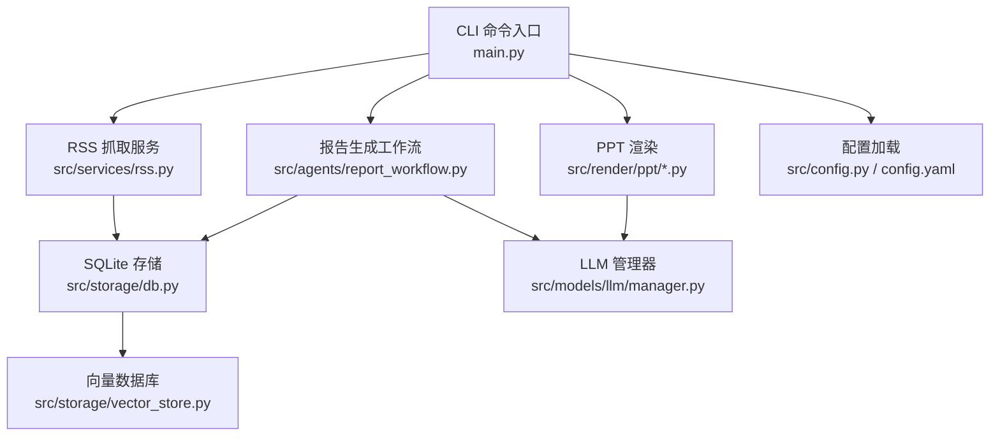
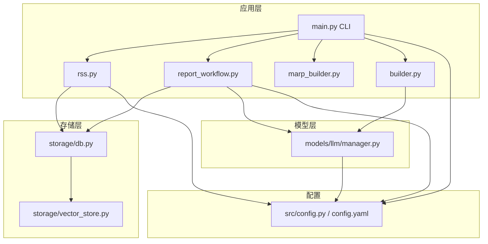
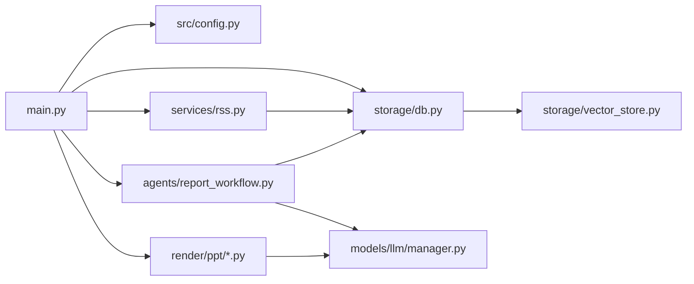
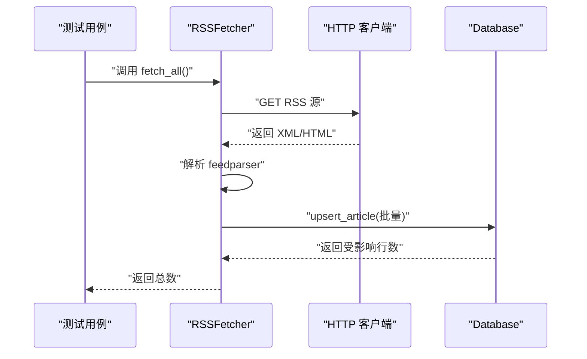
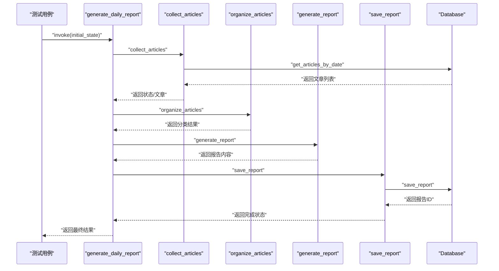
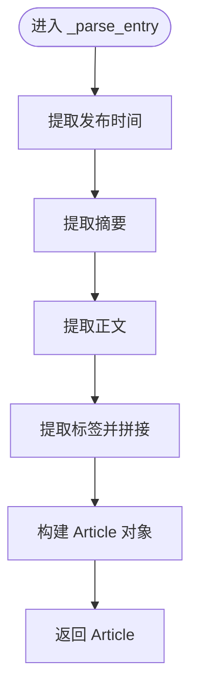

# 测试策略与实践

<cite>
**本文引用的文件**
- [README.md](file://README.md)
- [pyproject.toml](file://pyproject.toml)
- [main.py](file://main.py)
- [config.yaml](file://config.yaml)
- [src/config.py](file://src/config.py)
- [src/storage/db.py](file://src/storage/db.py)
- [src/services/rss.py](file://src/services/rss.py)
- [src/agents/report_workflow.py](file://src/agents/report_workflow.py)
- [src/models/llm/manager.py](file://src/models/llm/manager.py)
- [src/storage/vector_store.py](file://src/storage/vector_store.py)
- [src/render/ppt/marp_builder.py](file://src/render/ppt/marp_builder.py)
- [src/render/ppt/builder.py](file://src/render/ppt/builder.py)
- [scripts/test_image_gen.py](file://scripts/test_image_gen.py)
</cite>

## 目录
1. [引言](#引言)
2. [项目结构](#项目结构)
3. [核心组件](#核心组件)
4. [架构总览](#架构总览)
5. [详细组件分析](#详细组件分析)
6. [依赖分析](#依赖分析)
7. [性能考量](#性能考量)
8. [故障排查指南](#故障排查指南)
9. [结论](#结论)
10. [附录](#附录)

## 引言
本指南面向 Brief Agent 项目，提供系统化的测试策略与实践，覆盖单元测试、集成测试、数据库与外部 API 测试、端到端测试、异步代码测试、性能与压力测试、测试覆盖率统计与提升、测试自动化与 CI/CD 集成，以及调试技巧与常见问题解决方案。文档以仓库现有代码为依据，结合实际模块职责与调用关系，给出可落地的测试建议。

## 项目结构
Brief Agent 采用分层架构：CLI 入口负责命令编排；服务层负责业务流程（RSS 抓取、报告生成等）；模型层封装外部 LLM/API；存储层负责 SQLite 与向量数据库；渲染层负责 PPT 输出。测试应围绕这些层次进行分层验证。

图表来源
- [main.py](file://main.py#L1-L227)
- [src/services/rss.py](file://src/services/rss.py#L1-L123)
- [src/agents/report_workflow.py](file://src/agents/report_workflow.py#L1-L266)
- [src/models/llm/manager.py](file://src/models/llm/manager.py#L1-L318)
- [src/storage/db.py](file://src/storage/db.py#L1-L251)
- [src/storage/vector_store.py](file://src/storage/vector_store.py#L1-L142)
- [src/render/ppt/marp_builder.py](file://src/render/ppt/marp_builder.py#L1-L94)
- [src/render/ppt/builder.py](file://src/render/ppt/builder.py#L1-L194)
- [src/config.py](file://src/config.py#L1-L109)
- [config.yaml](file://config.yaml#L1-L54)

章节来源
- [README.md](file://README.md#L87-L148)

## 核心组件
- 配置系统：集中管理 LLM、RSS、数据库、向量库、日志与调度配置，支持环境变量注入。
- 存储层：SQLite（SQLModel）持久化文章、分析结果与报告；向量库（ChromaDB）用于 RAG 检索。
- 服务层：RSS 抓取与解析，定时调度。
- Agent 工作流：基于 LangGraph 的日报生成流水线。
- LLM 管理器：统一接入多家 LLM 提供商，支持同步/批量/流式接口。
- 渲染层：两种 PPT 渲染路径（Marp CLI 与直接渲染）。

章节来源
- [src/config.py](file://src/config.py#L1-L109)
- [config.yaml](file://config.yaml#L1-L54)
- [src/storage/db.py](file://src/storage/db.py#L1-L251)
- [src/storage/vector_store.py](file://src/storage/vector_store.py#L1-L142)
- [src/services/rss.py](file://src/services/rss.py#L1-L123)
- [src/agents/report_workflow.py](file://src/agents/report_workflow.py#L1-L266)
- [src/models/llm/manager.py](file://src/models/llm/manager.py#L1-L318)
- [src/render/ppt/marp_builder.py](file://src/render/ppt/marp_builder.py#L1-L94)
- [src/render/ppt/builder.py](file://src/render/ppt/builder.py#L1-L194)

## 架构总览
下图展示 CLI、服务、存储与外部依赖之间的交互关系，便于设计测试边界与隔离策略。

图表来源
- [main.py](file://main.py#L1-L227)
- [src/agents/report_workflow.py](file://src/agents/report_workflow.py#L1-L266)
- [src/services/rss.py](file://src/services/rss.py#L1-L123)
- [src/render/ppt/marp_builder.py](file://src/render/ppt/marp_builder.py#L1-L94)
- [src/render/ppt/builder.py](file://src/render/ppt/builder.py#L1-L194)
- [src/storage/db.py](file://src/storage/db.py#L1-L251)
- [src/storage/vector_store.py](file://src/storage/vector_store.py#L1-L142)
- [src/config.py](file://src/config.py#L1-L109)
- [config.yaml](file://config.yaml#L1-L54)

## 详细组件分析

### 单元测试：测试用例设计、Mock 对象与断言策略
- 测试目标
  - 配置加载与环境变量替换的正确性。
  - 数据库模型与 CRUD 操作的幂等性与边界条件。
  - RSS 抓取解析的健壮性与错误处理。
  - LLM 管理器的提供商选择、批量与流式接口行为。
  - Agent 工作流节点的输入输出与状态流转。
  - PPT 渲染构建器的模板与输出路径处理。
- 测试用例设计
  - 参数化：日期范围、RSS 条目字段、LLM 输入长度、PPT 模板类型。
  - 边界：空输入、超长文本、重复 URL、缺失字段、无效 JSON。
  - 异常：HTTP 请求失败、API 返回空、数据库锁等待、向量库不可用。
- Mock 策略
  - 使用 httpx/http.client 的上下文模拟网络请求。
  - 使用 unittest.mock.patch 替换外部 API 调用与环境变量。
  - 使用 in-memory SQLite 或临时数据库文件，避免真实磁盘 IO。
  - 使用 monkeypatch 注入配置对象，绕过文件系统。
- 断言策略
  - 精准断言：返回值类型、字段存在性、长度范围、正则匹配。
  - 状态断言：Agent 工作流状态机的最终状态。
  - 侧写断言：日志级别、错误码、异常类型、调用次数。

章节来源
- [src/config.py](file://src/config.py#L74-L109)
- [src/storage/db.py](file://src/storage/db.py#L97-L251)
- [src/services/rss.py](file://src/services/rss.py#L22-L123)
- [src/models/llm/manager.py](file://src/models/llm/manager.py#L206-L318)
- [src/agents/report_workflow.py](file://src/agents/report_workflow.py#L46-L237)
- [src/render/ppt/marp_builder.py](file://src/render/ppt/marp_builder.py#L59-L94)
- [src/render/ppt/builder.py](file://src/render/ppt/builder.py#L128-L194)

### 集成测试：数据库、外部 API、端到端
- 数据库测试
  - 使用临时数据库文件，测试 upsert、查询、关联查询与清理。
  - 验证事务一致性与并发场景下的 WAL 模式行为。
- 外部 API 测试
  - 使用 httpx 的 HTTP 服务器模拟器，覆盖成功、超时、4xx/5xx 场景。
  - 验证 LLM 提供商的 complete/stream 接口与批量接口。
- 端到端测试
  - 从 CLI 命令出发，覆盖 fetch → parse → report → PPT 生成全流程。
  - 使用最小化 RSS 源与人工可控的 LLM 输出，确保可重复性。

章节来源
- [src/storage/db.py](file://src/storage/db.py#L65-L94)
- [src/services/rss.py](file://src/services/rss.py#L34-L60)
- [src/models/llm/manager.py](file://src/models/llm/manager.py#L297-L318)
- [main.py](file://main.py#L66-L141)

### 测试数据准备与管理
- 测试数据生成
  - 使用工厂模式构造 Article、ArticleAnalysis、Report 等模型实例。
  - 生成多样化的 RSS 条目（含 HTML、标签、时间戳），用于解析测试。
- 数据库初始化与清理
  - 初始化阶段创建临时数据库文件与表结构。
  - 测试结束后删除临时文件，避免污染。
- 向量库测试
  - 使用内存或临时目录的 ChromaDB，测试 add/search/delete/count。
- 日志与输出
  - 重定向日志到内存缓冲，便于断言日志内容与级别。

章节来源
- [src/storage/db.py](file://src/storage/db.py#L80-L90)
- [src/storage/vector_store.py](file://src/storage/vector_store.py#L18-L35)
- [src/services/rss.py](file://src/services/rss.py#L62-L108)

### 异步代码与 asyncio 模式
- 现状
  - pytest 配置启用了 asyncio_mode = auto，适合协程与异步上下文。
- 测试建议
  - 对异步函数使用 await；对异步上下文使用 pytest-asyncio 标记。
  - 对阻塞式外部调用（如 subprocess）使用线程池或超时包装，避免阻塞事件循环。
  - 对 LLM 流式接口进行分块断言，注意 EOF 与异常分支。

章节来源
- [pyproject.toml](file://pyproject.toml#L46-L49)
- [src/models/llm/manager.py](file://src/models/llm/manager.py#L94-L104)

### 性能测试与压力测试
- 单元性能
  - 使用 pytest-benchmark 或 timeit 对热点函数（RSS 解析、LLM 批量、向量检索）进行基准测试。
- 集成压力
  - 构造大量 RSS 条目与文章分析记录，验证数据库写入吞吐与查询延迟。
  - 对 LLM 批量接口进行并发压力测试，观察线程池与超时设置。
- 渲染性能
  - 对 PPT 渲染构建器进行大体量幻灯片的渲染耗时测量。
- 资源监控
  - 监控磁盘 IO、CPU、内存与网络请求配额，识别瓶颈。

章节来源
- [src/services/rss.py](file://src/services/rss.py#L22-L60)
- [src/models/llm/manager.py](file://src/models/llm/manager.py#L48-L62)
- [src/storage/vector_store.py](file://src/storage/vector_store.py#L56-L78)
- [src/render/ppt/builder.py](file://src/render/ppt/builder.py#L128-L151)

### 测试覆盖率统计与提升
- 覆盖率工具
  - 使用 pytest-cov 统计行、分支、函数与指令覆盖率。
- 提升策略
  - 优先补齐关键路径：错误处理、异常分支、边界条件。
  - 对 Agent 工作流的每个节点增加独立测试，确保状态机正确性。
  - 对 PPT 渲染的模板与回退路径分别测试。

章节来源
- [pyproject.toml](file://pyproject.toml#L23-L23)

### 测试自动化与 CI/CD 集成
- 本地执行
  - 使用 uv run pytest tests/ 运行测试套件。
- CI/CD 建议
  - 分层流水线：单元测试（快速）、集成测试（带数据库/向量库）、端到端测试（最小化数据）。
  - 缓存依赖：缓存 Python 依赖与向量模型权重。
  - 并行执行：按模块并行运行测试，缩短总时长。
  - 覆盖率上报：上传覆盖率至平台（如 Codecov）。
  - 安全：在 CI 中使用受控的 API Key 与测试账户。

章节来源
- [README.md](file://README.md#L232-L236)

### 调试技巧与常见问题
- 常见问题
  - RSS 解析失败：检查 feedparser 的 bozo_exception 与 HTTP 状态码。
  - LLM 返回空或非 JSON：增加降级策略与日志断言。
  - PPT 渲染失败：确认 Marp CLI 是否安装，或切换到 direct 构建器。
  - 数据库锁：调整 SQLite 连接参数与事务粒度。
- 调试技巧
  - 使用 pytest --log-cli-level=DEBUG 查看详细日志。
  - 使用 unittest.mock 的 side_effect 模拟不同响应，快速定位问题。
  - 对外部 API 使用本地 mock 服务，减少网络波动影响。

章节来源
- [src/services/rss.py](file://src/services/rss.py#L34-L48)
- [src/models/llm/manager.py](file://src/models/llm/manager.py#L131-L157)
- [src/render/ppt/marp_builder.py](file://src/render/ppt/marp_builder.py#L37-L57)
- [src/storage/db.py](file://src/storage/db.py#L72-L90)

## 依赖分析
- 组件耦合
  - CLI 依赖配置、存储与服务；服务依赖存储与配置；Agent 依赖存储与 LLM；渲染依赖 LLM 与配置。
- 外部依赖
  - httpx/requests、feedparser、chromadb、sentence-transformers、python-pptx 等。
- 循环依赖
  - 通过模块导入顺序与延迟初始化避免循环引用（如工作流单例）。

图表来源
- [main.py](file://main.py#L1-L227)
- [src/config.py](file://src/config.py#L1-L109)
- [src/storage/db.py](file://src/storage/db.py#L1-L251)
- [src/services/rss.py](file://src/services/rss.py#L1-L123)
- [src/agents/report_workflow.py](file://src/agents/report_workflow.py#L1-L266)
- [src/models/llm/manager.py](file://src/models/llm/manager.py#L1-L318)
- [src/storage/vector_store.py](file://src/storage/vector_store.py#L1-L142)
- [src/render/ppt/marp_builder.py](file://src/render/ppt/marp_builder.py#L1-L94)
- [src/render/ppt/builder.py](file://src/render/ppt/builder.py#L1-L194)

## 性能考量
- I/O 密集：RSS 抓取与 LLM 调用为主，建议使用连接池与超时控制。
- CPU 密集：向量嵌入与 PPT 渲染，建议分批处理与缓存中间结果。
- 存储：SQLite 使用 WAL 模式提升并发；向量库使用持久化目录并定期压缩。

章节来源
- [src/storage/db.py](file://src/storage/db.py#L72-L90)
- [src/storage/vector_store.py](file://src/storage/vector_store.py#L18-L35)
- [src/services/rss.py](file://src/services/rss.py#L37-L42)
- [src/models/llm/manager.py](file://src/models/llm/manager.py#L57-L62)

## 故障排查指南
- RSS 抓取失败
  - 检查 URL 可达性、超时设置与 feedparser 解析异常。
- LLM 调用异常
  - 校验 API Key、Base URL 与响应格式；必要时启用降级路径。
- PPT 渲染异常
  - 确认模板文件存在与 Marp CLI 安装；否则回退到 direct 构建器。
- 数据库问题
  - 检查 WAL 模式是否启用、连接超时与事务冲突。

章节来源
- [src/services/rss.py](file://src/services/rss.py#L34-L48)
- [src/models/llm/manager.py](file://src/models/llm/manager.py#L131-L157)
- [src/render/ppt/marp_builder.py](file://src/render/ppt/marp_builder.py#L37-L57)
- [src/storage/db.py](file://src/storage/db.py#L84-L90)

## 结论
通过分层测试策略与完善的 Mock/隔离机制，Brief Agent 可在保证质量的同时提升开发效率。建议优先补齐关键路径与异常分支的单元测试，配合集成测试验证数据库与外部 API，最后以端到端测试确保用户场景闭环。持续改进覆盖率与性能指标，并将测试纳入 CI/CD 流水线，保障版本演进的稳定性。

## 附录

### 测试流程时序图：RSS 抓取与入库

图表来源
- [src/services/rss.py](file://src/services/rss.py#L22-L60)
- [src/storage/db.py](file://src/storage/db.py#L97-L122)

### 测试流程时序图：报告生成工作流

图表来源
- [src/agents/report_workflow.py](file://src/agents/report_workflow.py#L217-L237)
- [src/storage/db.py](file://src/storage/db.py#L227-L239)

### 算法流程图：RSS 条目解析

图表来源
- [src/services/rss.py](file://src/services/rss.py#L62-L108)