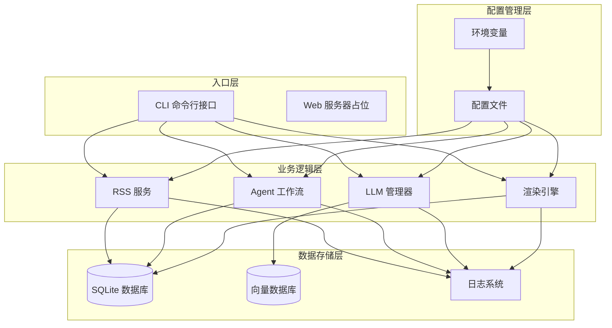
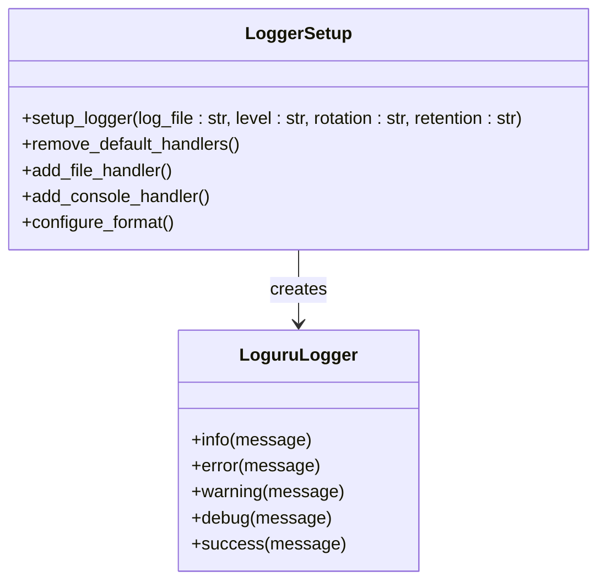
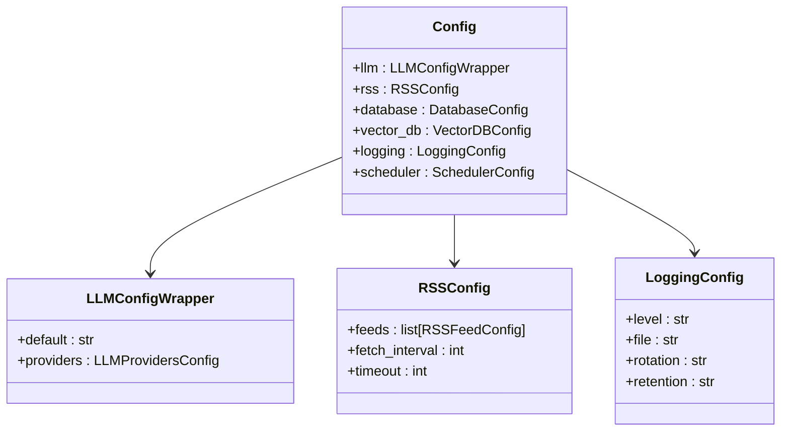
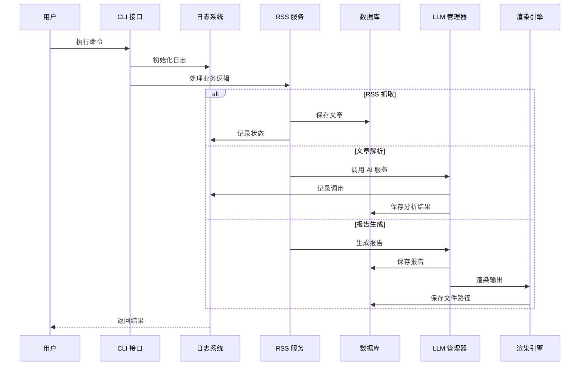
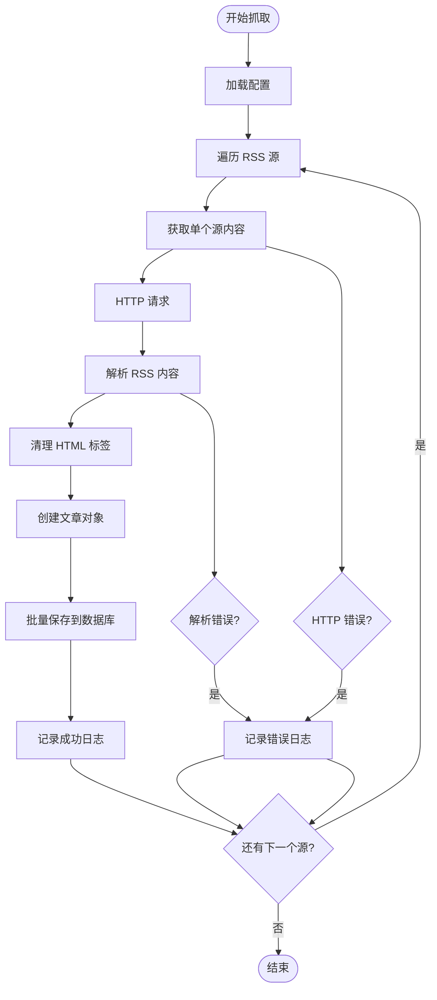
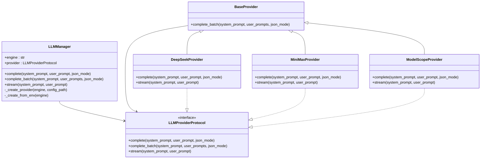
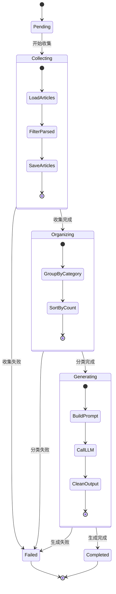
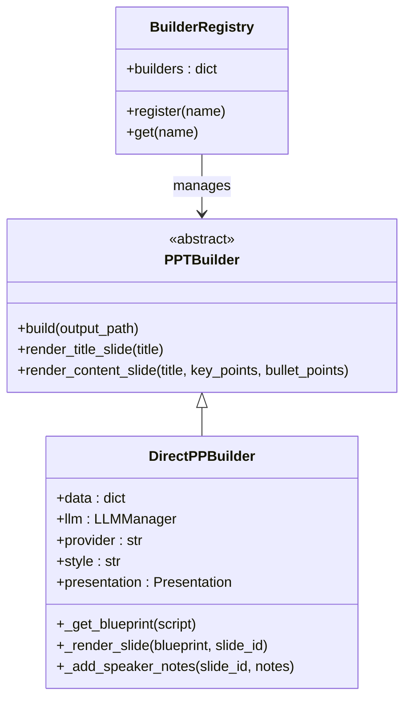
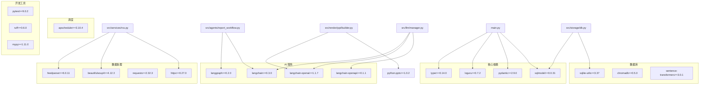

# 调试与性能分析

<cite>
**本文档引用的文件**
- [main.py](file://main.py)
- [src/storage/logger.py](file://src/storage/logger.py)
- [src/config.py](file://src/config.py)
- [config.yaml](file://config.yaml)
- [src/services/rss.py](file://src/services/rss.py)
- [src/llm/manager.py](file://src/llm/manager.py)
- [src/storage/db.py](file://src/storage/db.py)
- [src/agents/report_workflow.py](file://src/agents/report_workflow.py)
- [src/render/ppt/builder.py](file://src/render/ppt/builder.py)
- [pyproject.toml](file://pyproject.toml)
- [README.md](file://README.md)
</cite>

## 目录
1. [简介](#简介)
2. [项目结构](#项目结构)
3. [核心组件](#核心组件)
4. [架构总览](#架构总览)
5. [详细组件分析](#详细组件分析)
6. [依赖关系分析](#依赖关系分析)
7. [性能考量](#性能考量)
8. [故障排除指南](#故障排除指南)
9. [结论](#结论)

## 简介

Brief Agent 是一个基于 LangGraph 的企业级多模态知识内生 Agent 平台，专注于 RSS 内容的自动化采集、分析和报告生成。该项目采用模块化架构设计，集成了多种 AI 服务提供商，支持定时任务调度和多种输出格式。

本指南将详细介绍该系统的调试与性能分析方法，包括日志系统配置、Python 调试器使用、IDE 调试功能、性能分析工具应用、内存泄漏检测、网络请求调试、并发和异步代码调试，以及生产环境问题排查的系统性方法。

## 项目结构

Brief Agent 采用清晰的分层架构，主要包含以下核心模块：



**图表来源**
- [main.py](file://main.py#L22-L26)
- [src/services/rss.py](file://src/services/rss.py#L15-L21)
- [src/agents/report_workflow.py](file://src/agents/report_workflow.py#L186-L201)
- [src/llm/manager.py](file://src/llm/manager.py#L206-L251)

**章节来源**
- [main.py](file://main.py#L1-L227)
- [README.md](file://README.md#L87-L148)

## 核心组件

### 日志系统

项目采用 Loguru 作为日志框架，提供了强大的日志记录功能和灵活的配置选项：



**图表来源**
- [src/storage/logger.py](file://src/storage/logger.py#L8-L38)

### 配置管理系统

配置系统采用 Pydantic 模型定义，支持环境变量替换和类型安全：



**图表来源**
- [src/config.py](file://src/config.py#L65-L72)
- [src/config.py](file://src/config.py#L27-L30)
- [src/config.py](file://src/config.py#L37-L41)
- [src/config.py](file://src/config.py#L52-L57)

**章节来源**
- [src/storage/logger.py](file://src/storage/logger.py#L1-L39)
- [src/config.py](file://src/config.py#L1-L109)
- [config.yaml](file://config.yaml#L1-L54)

## 架构总览

Brief Agent 的整体架构采用事件驱动的设计模式，通过 Typer CLI 提供命令行接口，支持多种业务场景：



**图表来源**
- [main.py](file://main.py#L66-L82)
- [main.py](file://main.py#L84-L104)
- [main.py](file://main.py#L107-L140)

**章节来源**
- [main.py](file://main.py#L1-L227)

## 详细组件分析

### RSS 抓取服务

RSS 抓取服务负责从多个 RSS 源获取内容，并进行数据清洗和存储：



**图表来源**
- [src/services/rss.py](file://src/services/rss.py#L22-L32)
- [src/services/rss.py](file://src/services/rss.py#L34-L60)

**章节来源**
- [src/services/rss.py](file://src/services/rss.py#L1-L123)

### LLM 管理器

LLM 管理器提供了统一的接口来访问不同的 AI 服务提供商：



**图表来源**
- [src/llm/manager.py](file://src/llm/manager.py#L206-L318)
- [src/llm/manager.py](file://src/llm/manager.py#L45-L63)

**章节来源**
- [src/llm/manager.py](file://src/llm/manager.py#L1-L318)

### 报告生成工作流

报告生成工作流采用 LangGraph 实现状态机模式，支持复杂的多步骤处理：



**图表来源**
- [src/agents/report_workflow.py](file://src/agents/report_workflow.py#L27-L36)
- [src/agents/report_workflow.py](file://src/agents/report_workflow.py#L186-L201)

**章节来源**
- [src/agents/report_workflow.py](file://src/agents/report_workflow.py#L1-L266)

### PPT 渲染引擎

PPT 渲染引擎支持多种构建器，提供灵活的输出格式：



**图表来源**
- [src/render/ppt/builder.py](file://src/render/ppt/builder.py#L22-L24)
- [src/render/ppt/builder.py](file://src/render/ppt/builder.py#L51-L62)

**章节来源**
- [src/render/ppt/builder.py](file://src/render/ppt/builder.py#L1-L194)

## 依赖关系分析

项目依赖关系清晰，采用了松耦合的设计模式：



**图表来源**
- [pyproject.toml](file://pyproject.toml#L7-L29)
- [pyproject.toml](file://pyproject.toml#L34-L40)

**章节来源**
- [pyproject.toml](file://pyproject.toml#L1-L49)

## 性能考量

### 日志性能优化

项目采用 Loguru 提供高性能的日志记录，支持异步处理和文件轮转：

- **异步日志处理**：避免阻塞主线程
- **文件轮转**：自动管理日志文件大小和保留策略
- **编码优化**：UTF-8 编码确保多语言支持
- **格式化**：结构化的日志格式便于分析

### 数据库性能优化

SQLite 数据库采用 WAL 模式提升并发性能：

- **WAL 模式**：支持并发读写，提升性能
- **连接超时**：30 秒超时避免长时间阻塞
- **事务管理**：批量操作减少磁盘 I/O
- **索引设计**：合理的主键和外键设计

### LLM 调用优化

LLM 管理器实现了智能的并发控制和错误处理：

- **线程池管理**：最大 10 个并发线程
- **批量处理**：统一的批量推理接口
- **错误恢复**：自动重试和降级策略
- **流式输出**：支持实时响应

### 网络请求优化

RSS 抓取服务采用高效的 HTTP 客户端：

- **连接复用**：HTTPX 客户端支持连接池
- **超时控制**：可配置的请求超时时间
- **跟随重定向**：自动处理重定向
- **错误处理**：完善的异常捕获机制

## 故障排除指南

### 日志调试技巧

1. **启用详细日志**
   ```bash
   uv run python main.py fetch -v
   uv run python main.py parse -v
   uv run python main.py report 2026-01-11 -v
   ```

2. **查看日志文件**
   - 日志文件位置：`data/logs/app.log`
   - 支持自动轮转和保留策略

3. **日志级别设置**
   - INFO：正常运行信息
   - DEBUG：详细调试信息
   - ERROR：错误信息
   - WARNING：警告信息

### Python 调试器使用

1. **pdb 调试**
   ```bash
   python -m pdb main.py fetch
   ```

2. **IDE 调试配置**
   - VS Code：配置 launch.json
   - PyCharm：设置断点和调试配置
   - Vim/Neovim：使用 vim-debug 或 other debug plugins

3. **条件断点**
   ```python
   # 在可能出错的地方设置断点
   if condition:
       breakpoint()
   ```

### 网络请求调试

1. **HTTP 请求监控**
   ```python
   import httpx
   import logging
   
   logging.basicConfig(level=logging.DEBUG)
   httpx.Client()
   ```

2. **API 调用跟踪**
   - 检查 API Key 配置
   - 验证网络连接
   - 监控请求响应时间

3. **RSS 源验证**
   ```bash
   curl -I https://www.36kr.com/feed
   ```

### 内存泄漏检测

1. **内存使用监控**
   ```bash
   pip install memory_profiler
   python -m memory_profiler main.py fetch
   ```

2. **常见内存问题**
   - 未关闭的数据库连接
   - 未释放的 HTTP 客户端
   - 未清理的缓存数据

3. **优化建议**
   - 使用上下文管理器
   - 及时释放资源
   - 监控内存使用趋势

### 性能分析工具

1. **cProfile 分析**
   ```bash
   python -m cProfile -o profile_output main.py report 2026-01-11
   ```

2. **line_profiler**
   ```bash
   pip install line_profiler
   kernprof -l -o profile_output main.py report 2026-01-11
   ```

3. **性能热点识别**
   - 分析 LLM 调用耗时
   - 监控数据库查询性能
   - 优化网络请求

### 并发和异步代码调试

1. **线程池调试**
   ```python
   from concurrent.futures import ThreadPoolExecutor
   import threading
   
   def debug_worker():
       print(f"Thread: {threading.current_thread().name}")
       return worker_function()
   ```

2. **异步代码监控**
   - 使用 asyncio.run() 包装
   - 监控协程状态
   - 捕获异步异常

3. **死锁检测**
   - 检查数据库连接池
   - 验证线程同步机制
   - 监控资源竞争

### 常见问题诊断

1. **配置问题**
   - 检查 config.yaml 格式
   - 验证环境变量设置
   - 确认 API Key 有效性

2. **数据库问题**
   - 检查数据库文件权限
   - 验证表结构完整性
   - 监控数据库连接数

3. **LLM 服务问题**
   - 验证 API Key 配置
   - 检查网络连接
   - 监控服务可用性

**章节来源**
- [src/storage/logger.py](file://src/storage/logger.py#L8-L38)
- [src/services/rss.py](file://src/services/rss.py#L37-L42)
- [src/llm/manager.py](file://src/llm/manager.py#L57-L62)
- [src/storage/db.py](file://src/storage/db.py#L72-L89)

## 结论

Brief Agent 项目展现了现代 Python 应用的最佳实践，包括：

1. **模块化架构**：清晰的分层设计和职责分离
2. **配置管理**：类型安全的配置系统和环境变量支持
3. **日志系统**：高性能的 Loguru 集成和灵活配置
4. **并发处理**：智能的线程池管理和异步支持
5. **错误处理**：完善的异常捕获和降级策略

通过本指南提供的调试和性能分析方法，开发者可以有效地定位和解决各种问题，优化系统性能，并确保生产环境的稳定运行。建议在开发过程中持续监控关键指标，定期进行性能基准测试，并建立完善的监控告警机制。