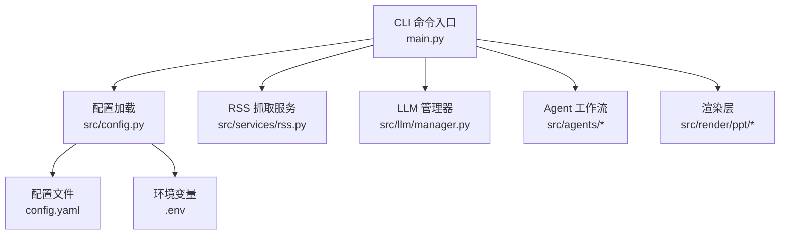
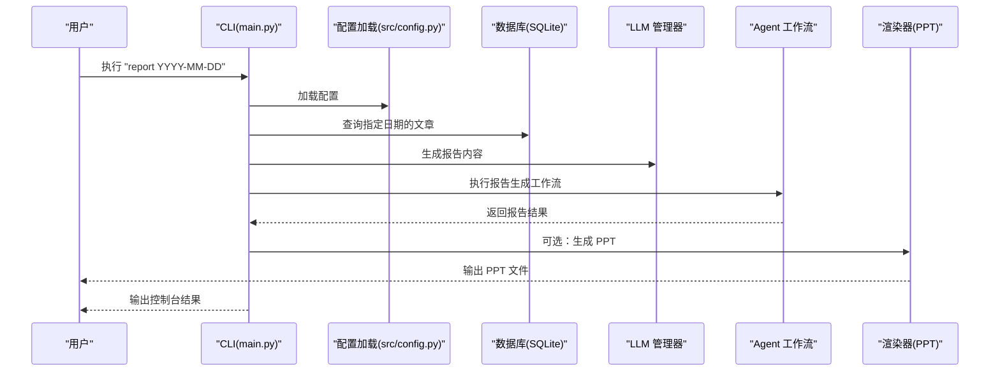
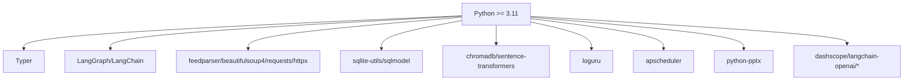

# 快速开始

<cite>
**本文引用的文件**
- [README.md](file://README.md)
- [main.py](file://main.py)
- [config.py](file://src/config.py)
- [config.yaml](file://config.yaml)
- [env.example](file://env.example)
- [pyproject.toml](file://pyproject.toml)
- [uv.lock](file://uv.lock)
- [uv.toml](file://uv.toml)
- [scripts/fetch_sample.py](file://scripts/fetch_sample.py)
- [scripts/test_templates.py](file://scripts/test_templates.py)
</cite>

## 目录
1. [简介](#简介)
2. [项目结构](#项目结构)
3. [核心组件](#核心组件)
4. [架构总览](#架构总览)
5. [详细组件分析](#详细组件分析)
6. [依赖关系分析](#依赖关系分析)
7. [性能注意事项](#性能注意事项)
8. [故障排除指南](#故障排除指南)
9. [结论](#结论)
10. [附录](#附录)

## 简介
Brief Agent 是一个基于 LangGraph 的多模态内容自动生成与分发平台，支持 RSS 多源采集、AI 智能分析、短视频脚本生成、视频渲染输出、RAG 向量化检索、日报/周报生成以及定时任务调度等能力。本文档提供“15 分钟上手”的快速开始指南，帮助你在最短时间内完成环境准备、配置与运行第一个工作流。

## 项目结构
项目采用清晰的分层组织：
- CLI 入口与命令：main.py
- 配置加载：src/config.py
- 配置文件：config.yaml
- 环境变量模板：env.example
- 项目元信息与依赖：pyproject.toml
- 依赖锁定：uv.lock
- 示例脚本：scripts/fetch_sample.py、scripts/test_templates.py

图表来源
- [main.py](file://main.py#L1-L227)
- [config.py](file://src/config.py#L74-L109)
- [config.yaml](file://config.yaml#L1-L54)

章节来源
- [README.md](file://README.md#L87-L148)

## 核心组件
- CLI 命令
  - fetch：抓取 RSS 源并入库
  - parse：调用 LLM 解析未处理文章
  - report：生成日报/周报，并可选生成 PPT
  - serve：占位命令（当前未实现）
- 配置系统
  - 通过 config.yaml 统一管理 LLM 提供商、RSS 源、数据库、向量库、日志与调度等配置
  - 通过 .env 注入敏感信息（如 API Key），并在配置中以 ${VAR} 形式引用
- 存储与 RAG
  - SQLite 数据库存储文章与元数据
  - ChromaDB 向量库用于 RAG 检索
- 渲染与输出
  - PPT 构建器支持多种模板风格（default/minimal/corporate/gradient/dark）

章节来源
- [main.py](file://main.py#L66-L141)
- [config.py](file://src/config.py#L74-L109)
- [config.yaml](file://config.yaml#L1-L54)

## 架构总览
下面的序列图展示了从 CLI 到数据处理与输出的典型流程（以 report 命令为例）：

图表来源
- [main.py](file://main.py#L107-L141)
- [config.py](file://src/config.py#L74-L109)

## 详细组件分析

### 环境准备与依赖安装
- Python 版本要求
  - 项目要求 Python >= 3.11
- 推荐工具：uv
  - 使用 uv 创建虚拟环境并安装依赖
  - 激活虚拟环境后即可运行 CLI
- 依赖安装步骤
  - 使用 uv sync 安装所有依赖
  - 如需开发依赖，可使用 uv 运行 pytest 或其他 dev 工具

章节来源
- [README.md](file://README.md#L19-L28)
- [pyproject.toml](file://pyproject.toml#L6-L29)

### 配置文件设置
- 复制环境变量模板
  - 将 env.example 复制为 .env，并填入你的 API Key
- 编辑配置文件 config.yaml
  - LLM 提供商：支持 minimax、modelscope、deepseek
  - RSS 订阅源：添加多个 RSS 源及抓取间隔
  - 数据库与向量库：SQLite 路径与 ChromaDB 路径、集合名
  - 日志级别与轮转策略
  - 定时任务时区与日报/周报生成时间

章节来源
- [README.md](file://README.md#L30-L41)
- [README.md](file://README.md#L43-L76)
- [env.example](file://env.example#L1-L10)
- [config.yaml](file://config.yaml#L1-L54)

### CLI 命令详解
- fetch
  - 作用：抓取 RSS 源并保存到数据库
  - 参数：可选 feed_name（特定 RSS 源名称），可选 --verbose 输出详细日志
  - 输出：打印抓取到的文章数量
- parse
  - 作用：调用 LLM 解析未处理文章
  - 参数：--limit 限制解析数量，默认 50；可选 --verbose
  - 输出：打印解析成功/失败的数量统计
- report
  - 作用：生成指定日期的日报/周报
  - 参数：日期（YYYY-MM-DD），--output 打印报告内容到 stdout，--ppt 生成 PPT，--builder 指定 PPT 构建器（direct/marp），--verbose
  - 输出：报告生成状态、报告 ID；若启用 --ppt，输出 PPT 保存路径
- serve
  - 作用：占位命令（当前未实现），提示使用 CLI 命令

章节来源
- [main.py](file://main.py#L66-L141)

### 实际运行示例与预期输出
- 抓取 RSS
  - 命令：uv run python main.py fetch
  - 预期输出：打印抓取到的文章数量
- 解析文章
  - 命令：uv run python main.py parse --limit 50
  - 预期输出：打印解析成功/失败的数量统计
- 生成日报
  - 命令：uv run python main.py report 2026-01-11 --ppt --builder direct
  - 预期输出：打印报告生成状态与报告 ID；若启用 --ppt，打印 PPT 保存路径
- 生成周报
  - 命令：uv run python main.py report 2026-01-11 --ppt --builder marp
  - 预期输出：打印报告生成状态与报告 ID；若启用 --ppt，打印 PPT 保存路径

章节来源
- [README.md](file://README.md#L78-L85)
- [main.py](file://main.py#L107-L141)

### 示例脚本与模板测试
- scripts/fetch_sample.py
  - 作用：演示如何直接调用 RSS 抓取器抓取真实 RSS 源并展示部分文章
- scripts/test_templates.py
  - 作用：测试 Marp 模板渲染效果，生成不同风格的 PPT 示例
  - 输出：每个模板生成对应的 PPTX 和 Markdown 文件，便于预览样式

章节来源
- [scripts/fetch_sample.py](file://scripts/fetch_sample.py#L1-L69)
- [scripts/test_templates.py](file://scripts/test_templates.py#L1-L152)

## 依赖关系分析
- 语言与框架
  - Python >= 3.11
  - Typer：CLI 框架
  - LangGraph/LangChain：多 Agent 工作流与链式调用
- 网络与数据
  - feedparser、beautifulsoup4：RSS 解析与 HTML 处理
  - requests/httpx：HTTP 请求
- 存储与检索
  - sqlite-utils、sqlmodel：SQLite ORM
  - chromadb、sentence-transformers：向量检索
- 日志与调度
  - loguru：日志
  - apscheduler：定时任务
- 渲染与多媒体
  - python-pptx：PPT 渲染
  - dashscope、langchain-openai 等：LLM 提供商集成

图表来源
- [pyproject.toml](file://pyproject.toml#L6-L29)

章节来源
- [pyproject.toml](file://pyproject.toml#L6-L29)
- [uv.lock](file://uv.lock#L1-L619)

## 性能注意事项
- RSS 抓取间隔与超时
  - 在 config.yaml 中设置 fetch_interval 与 timeout，避免频繁请求导致限流
- LLM 调用频率
  - parse 命令支持 --limit 控制批量解析规模，避免一次性触发过多 LLM 调用
- 向量库与数据库
  - 合理设置向量库路径与集合名，避免磁盘空间不足
- 日志轮转
  - 使用 rotation 与 retention 控制日志大小与保留周期

章节来源
- [config.yaml](file://config.yaml#L23-L54)

## 故障排除指南
- Python 版本不满足要求
  - 症状：安装依赖时报错或运行时报错
  - 处理：确保使用 Python >= 3.11
- uv 未安装或未同步依赖
  - 症状：uv 命令不可用或依赖缺失
  - 处理：安装 uv 并执行 uv sync
- API Key 未配置
  - 症状：LLM 调用失败或报错
  - 处理：在 .env 中填入对应提供商的 API Key，并确认 config.yaml 中引用了正确的变量名
- RSS 抓取失败
  - 症状：抓取不到文章或超时
  - 处理：检查 RSS 源 URL 是否有效，适当调整 timeout 与 fetch_interval
- PPT 生成失败
  - 症状：PPT 未生成或仅生成 Markdown
  - 处理：安装 Marp CLI（如使用 marp 构建器），或改用 direct 构建器
- 权限与路径问题
  - 症状：无法写入数据库或向量库
  - 处理：确认 data/sqlite 与 data/chroma 目录存在且具有写权限

章节来源
- [README.md](file://README.md#L19-L28)
- [README.md](file://README.md#L30-L41)
- [README.md](file://README.md#L78-L85)
- [scripts/test_templates.py](file://scripts/test_templates.py#L134-L147)

## 结论
通过本快速开始指南，你已经完成了 Brief Agent 的环境准备、配置与依赖安装，并成功运行了 fetch、parse、report 等核心命令。建议在掌握基础操作后，进一步探索配置中的 LLM 提供商选择、RSS 源扩展、模板风格定制与定时任务配置，以满足更复杂的业务需求。

## 附录
- 常用命令速查
  - 环境准备与依赖安装：uv sync
  - 激活虚拟环境：source .venv/bin/activate（Linux/macOS）或 .venv\Scripts\activate（Windows）
  - 抓取 RSS：uv run python main.py fetch
  - 解析文章：uv run python main.py parse --limit 50
  - 生成日报：uv run python main.py report 2026-01-11 --ppt --builder direct
  - 生成周报：uv run python main.py report 2026-01-11 --ppt --builder marp
- 参考文件
  - README.md：项目说明与命令示例
  - config.yaml：配置文件
  - env.example：环境变量模板
  - main.py：CLI 命令实现
  - src/config.py：配置加载逻辑
  - scripts/fetch_sample.py：RSS 抓取示例
  - scripts/test_templates.py：PPT 模板测试脚本