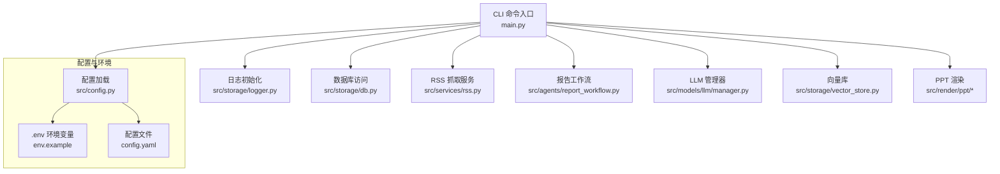
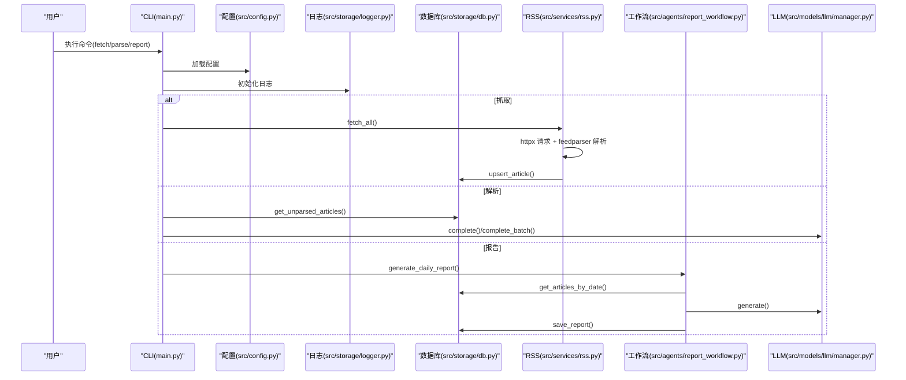
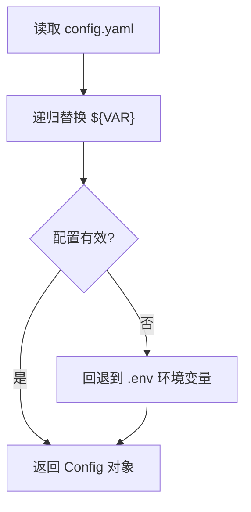
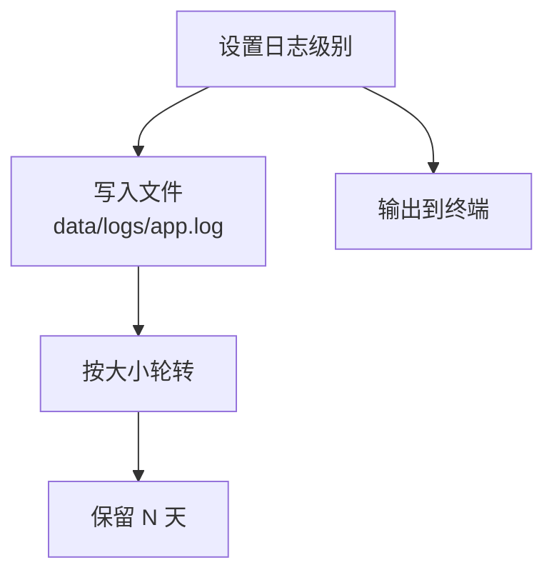
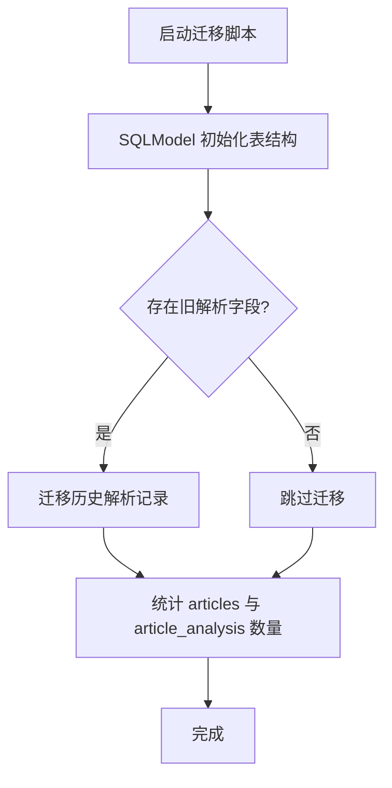
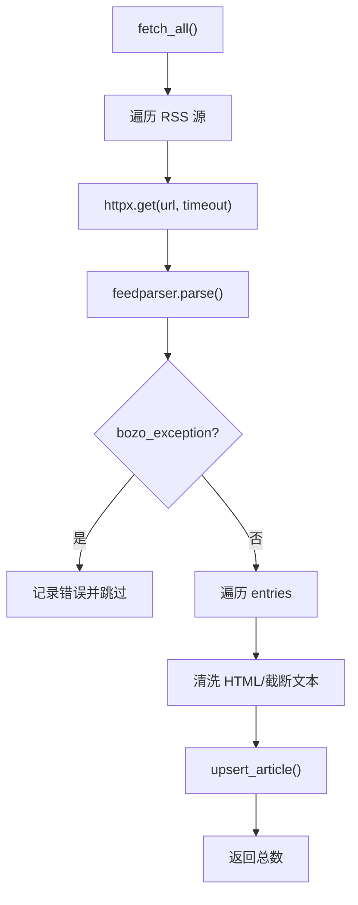
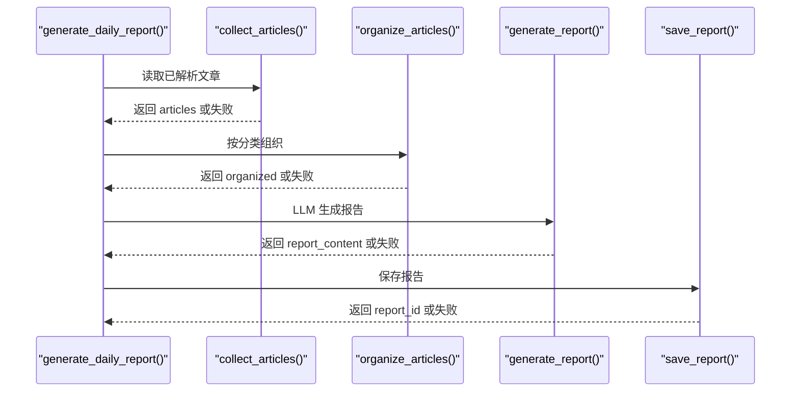
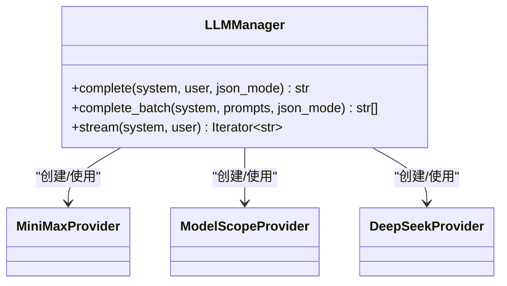
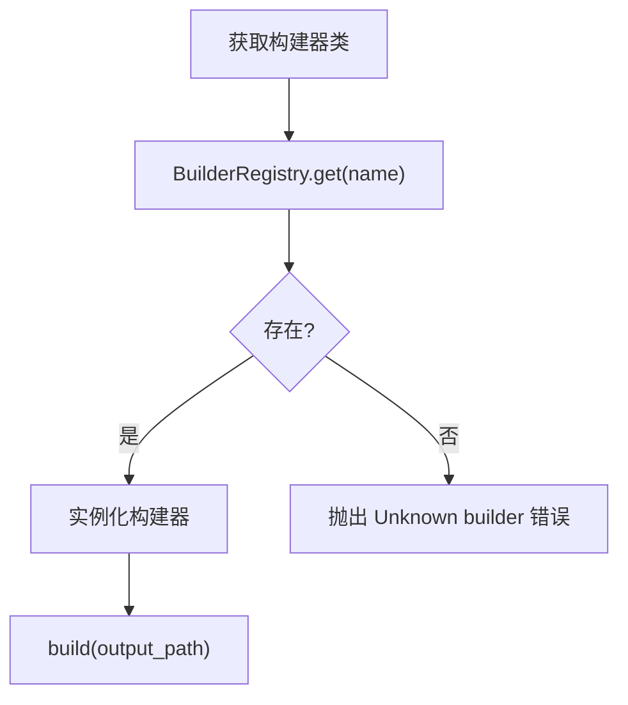
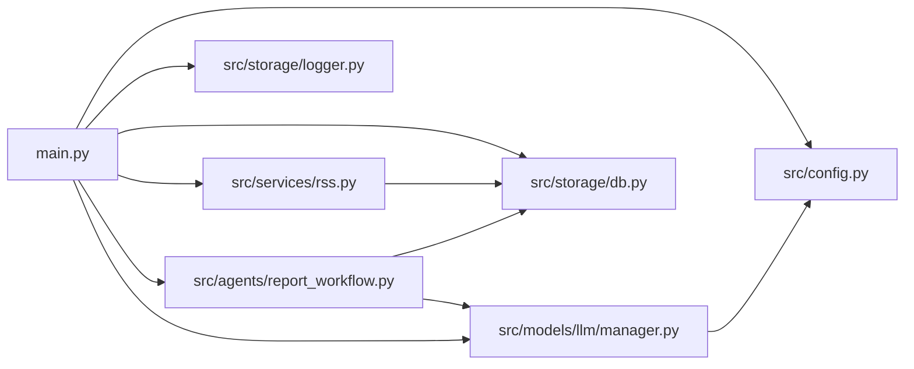

# 故障排除

<cite>
**本文引用的文件**
- [README.md](file://README.md)
- [CLAUDE.md](file://CLAUDE.md)
- [config.yaml](file://config.yaml)
- [main.py](file://main.py)
- [src/config.py](file://src/config.py)
- [src/storage/logger.py](file://src/storage/logger.py)
- [src/storage/db.py](file://src/storage/db.py)
- [src/services/rss.py](file://src/services/rss.py)
- [src/agents/report_workflow.py](file://src/agents/report_workflow.py)
- [src/models/llm/manager.py](file://src/models/llm/manager.py)
- [src/llm/manager.py](file://src/llm/manager.py)
- [src/storage/vector_store.py](file://src/storage/vector_store.py)
- [src/render/ppt/base.py](file://src/render/ppt/base.py)
- [src/render/ppt/builder.py](file://src/render/ppt/builder.py)
- [scripts/migrate_db.py](file://scripts/migrate_db.py)
- [pyproject.toml](file://pyproject.toml)
</cite>

## 目录
1. [简介](#简介)
2. [项目结构](#项目结构)
3. [核心组件](#核心组件)
4. [架构总览](#架构总览)
5. [详细组件分析](#详细组件分析)
6. [依赖关系分析](#依赖关系分析)
7. [性能考量](#性能考量)
8. [故障排除指南](#故障排除指南)
9. [结论](#结论)
10. [附录](#附录)

## 简介
本指南面向 Brief Agent 用户与维护者，系统化梳理安装、配置、运行与排错流程，覆盖网络连接、API 密钥、数据库与向量库、日志与错误定位、性能问题排查与优化建议，并提供社区与问题反馈渠道及紧急处置方案，帮助用户独立高效地解决常见问题。

## 项目结构
Brief Agent 采用“配置驱动 + 模块化”的分层设计：CLI 入口负责命令解析与流程编排；配置模块负责 YAML/环境变量加载；服务层负责 RSS 抓取与业务逻辑；存储层负责 SQLite、向量库与日志；渲染层负责 PPT 输出；模型层封装多家 LLM 提供商。

图表来源
- [main.py](file://main.py#L1-L227)
- [src/config.py](file://src/config.py#L74-L109)
- [src/storage/logger.py](file://src/storage/logger.py#L8-L39)
- [src/storage/db.py](file://src/storage/db.py#L65-L94)
- [src/services/rss.py](file://src/services/rss.py#L15-L61)
- [src/agents/report_workflow.py](file://src/agents/report_workflow.py#L186-L202)
- [src/models/llm/manager.py](file://src/models/llm/manager.py#L206-L318)
- [src/storage/vector_store.py](file://src/storage/vector_store.py#L15-L35)
- [src/render/ppt/base.py](file://src/render/ppt/base.py#L16-L42)
- [src/render/ppt/builder.py](file://src/render/ppt/builder.py#L22-L63)

章节来源
- [README.md](file://README.md#L87-L148)
- [CLAUDE.md](file://CLAUDE.md#L36-L95)

## 核心组件
- 配置加载与校验：支持 YAML + 环境变量，自动替换 ${VAR}，缺失键回退为空字符串。
- 日志系统：基于 loguru，同时输出至文件与控制台，支持轮转与保留策略。
- 数据存储：SQLite（SQLModel）+ ChromaDB（向量库），WAL 模式提升并发。
- RSS 抓取：基于 feedparser + httpx，超时与 Bozo 异常处理。
- 报告工作流：LangGraph 状态机，按分类组织文章，LLM 生成结构化日报。
- LLM 管理：统一接口封装 MiniMax/ModelScope/DeepSeek，支持批量与流式。
- PPT 渲染：DirectPPBuilder 与 BuilderRegistry，支持多种构建器。
- 数据库迁移：脚本化迁移 article_analysis 新表与历史解析数据。

章节来源
- [src/config.py](file://src/config.py#L74-L109)
- [src/storage/logger.py](file://src/storage/logger.py#L8-L39)
- [src/storage/db.py](file://src/storage/db.py#L65-L94)
- [src/services/rss.py](file://src/services/rss.py#L15-L61)
- [src/agents/report_workflow.py](file://src/agents/report_workflow.py#L186-L202)
- [src/models/llm/manager.py](file://src/models/llm/manager.py#L206-L318)
- [src/render/ppt/base.py](file://src/render/ppt/base.py#L16-L42)
- [scripts/migrate_db.py](file://scripts/migrate_db.py#L15-L86)

## 架构总览

图表来源
- [main.py](file://main.py#L66-L141)
- [src/config.py](file://src/config.py#L74-L88)
- [src/storage/logger.py](file://src/storage/logger.py#L8-L39)
- [src/storage/db.py](file://src/storage/db.py#L97-L123)
- [src/services/rss.py](file://src/services/rss.py#L22-L61)
- [src/agents/report_workflow.py](file://src/agents/report_workflow.py#L217-L237)
- [src/models/llm/manager.py](file://src/models/llm/manager.py#L297-L318)

## 详细组件分析

### 配置加载与环境变量替换
- 从 config.yaml 读取，递归替换 ${VAR} 为环境变量，不存在时回退为空字符串。
- LLM 提供商配置来自 YAML，若加载失败则回退到 .env 环境变量。
- 日志级别、轮转大小与保留天数由 YAML 控制。

图表来源
- [src/config.py](file://src/config.py#L74-L109)
- [config.yaml](file://config.yaml#L4-L21)

章节来源
- [src/config.py](file://src/config.py#L74-L109)
- [config.yaml](file://config.yaml#L4-L21)

### 日志系统
- 同时输出到文件与控制台，支持旋转与保留策略。
- CLI 支持 --verbose 切换日志级别。

图表来源
- [src/storage/logger.py](file://src/storage/logger.py#L8-L39)
- [main.py](file://main.py#L54-L63)
- [config.yaml](file://config.yaml#L42-L47)

章节来源
- [src/storage/logger.py](file://src/storage/logger.py#L8-L39)
- [main.py](file://main.py#L54-L63)
- [config.yaml](file://config.yaml#L42-L47)

### 数据库与迁移
- SQLite 使用 WAL 模式与 busy_timeout，提升并发与稳定性。
- 迁移脚本先用 SQLModel 创建新表，再迁移旧解析数据到 article_analysis。

图表来源
- [scripts/migrate_db.py](file://scripts/migrate_db.py#L15-L86)
- [src/storage/db.py](file://src/storage/db.py#L65-L94)

章节来源
- [src/storage/db.py](file://src/storage/db.py#L65-L94)
- [scripts/migrate_db.py](file://scripts/migrate_db.py#L15-L86)

### RSS 抓取与解析
- 使用 httpx + feedparser，超时与 Bozo 异常均记录错误日志。
- 文章入库前清洗 HTML，限制摘要/正文长度。

图表来源
- [src/services/rss.py](file://src/services/rss.py#L22-L61)
- [src/storage/db.py](file://src/storage/db.py#L97-L123)

章节来源
- [src/services/rss.py](file://src/services/rss.py#L22-L61)
- [src/storage/db.py](file://src/storage/db.py#L97-L123)

### 报告生成工作流（LangGraph）
- 状态机：START → collect → organize → generate → save → END。
- 失败路径：任一节点异常都会设置 status=failed 并携带 error。

图表来源
- [src/agents/report_workflow.py](file://src/agents/report_workflow.py#L186-L202)
- [src/agents/report_workflow.py](file://src/agents/report_workflow.py#L217-L237)

章节来源
- [src/agents/report_workflow.py](file://src/agents/report_workflow.py#L186-L202)
- [src/agents/report_workflow.py](file://src/agents/report_workflow.py#L217-L237)

### LLM 管理器
- 统一接口：complete、complete_batch、stream。
- 支持 MiniMax/ModelScope/DeepSeek，批量推理使用线程池。
- 配置优先 YAML，失败回退 .env。

图表来源
- [src/models/llm/manager.py](file://src/models/llm/manager.py#L206-L318)
- [src/llm/manager.py](file://src/llm/manager.py#L206-L318)

章节来源
- [src/models/llm/manager.py](file://src/models/llm/manager.py#L206-L318)
- [src/llm/manager.py](file://src/llm/manager.py#L206-L318)

### PPT 渲染与构建器注册
- BuilderRegistry 注册与获取构建器，未知名称抛出异常。
- DirectPPBuilder 通过 LLM 生成设计蓝图并使用 python-pptx 渲染。

图表来源
- [src/render/ppt/base.py](file://src/render/ppt/base.py#L16-L42)
- [src/render/ppt/builder.py](file://src/render/ppt/builder.py#L128-L151)

章节来源
- [src/render/ppt/base.py](file://src/render/ppt/base.py#L16-L42)
- [src/render/ppt/builder.py](file://src/render/ppt/builder.py#L128-L151)

## 依赖关系分析
- CLI 依赖配置、日志、数据库、RSS、工作流与 LLM。
- 工作流依赖数据库与 LLM。
- RSS 依赖 httpx、feedparser 与数据库。
- LLM 依赖 OpenAI/requests 客户端与配置。
- 渲染依赖 python-pptx 与 LLM。

图表来源
- [main.py](file://main.py#L14-L21)
- [src/agents/report_workflow.py](file://src/agents/report_workflow.py#L19-L21)
- [src/services/rss.py](file://src/services/rss.py#L10-L12)
- [src/models/llm/manager.py](file://src/models/llm/manager.py#L17-L18)

章节来源
- [main.py](file://main.py#L14-L21)
- [pyproject.toml](file://pyproject.toml#L7-L29)

## 性能考量
- 数据库：启用 WAL 模式与 busy_timeout，减少锁等待；批量 upsert/insert 提升吞吐。
- LLM：批量推理使用线程池，合理设置并发；流式生成按提供商能力使用。
- RSS：合理设置 timeout，避免阻塞；Bozo 异常不影响整体抓取。
- 日志：轮转与保留避免磁盘膨胀；生产环境建议 INFO 级别。
- 向量库：SentenceTransformer 嵌入初始化成本高，建议复用；查询时限制 n_results。

章节来源
- [src/storage/db.py](file://src/storage/db.py#L84-L90)
- [src/models/llm/manager.py](file://src/models/llm/manager.py#L48-L62)
- [src/services/rss.py](file://src/services/rss.py#L37-L48)
- [src/storage/logger.py](file://src/storage/logger.py#L20-L29)
- [src/storage/vector_store.py](file://src/storage/vector_store.py#L34-L34)

## 故障排除指南

### 一、安装与环境准备
- 症状：依赖安装失败或 Python 版本不满足。
- 排查步骤：
  - 确认 Python 版本满足要求。
  - 使用包管理器安装依赖，确保网络可达。
- 解决方案：
  - 按照项目说明使用包管理器同步依赖。
  - 如遇网络问题，配置镜像源或代理。
- 相关文件
  - [pyproject.toml](file://pyproject.toml#L6-L29)
  - [README.md](file://README.md#L19-L28)

章节来源
- [pyproject.toml](file://pyproject.toml#L6-L29)
- [README.md](file://README.md#L19-L28)

### 二、配置错误
- 症状：LLM 无法调用、RSS 抓取失败、日志不输出。
- 排查步骤：
  - 检查配置文件路径与权限。
  - 校验 YAML 语法与缩进。
  - 确认环境变量已正确加载（.env）。
- 解决方案：
  - 复制示例环境文件并填写密钥。
  - 使用配置加载函数验证键值是否被替换。
- 相关文件
  - [config.yaml](file://config.yaml#L4-L54)
  - [src/config.py](file://src/config.py#L74-L109)
  - [.env 示例](file://env.example)

章节来源
- [config.yaml](file://config.yaml#L4-L54)
- [src/config.py](file://src/config.py#L74-L109)

### 三、运行时异常
- 症状：命令执行报错、工作流中断、PPT 生成失败。
- 排查步骤：
  - 使用 --verbose 提升日志级别，查看详细堆栈。
  - 检查数据库连接与表结构是否初始化。
  - 校验 LLM 提供商 API Key 是否正确。
- 解决方案：
  - 通过日志定位异常节点，修复对应模块。
  - 若为网络异常，重试或调整超时。
- 相关文件
  - [main.py](file://main.py#L54-L63)
  - [src/storage/db.py](file://src/storage/db.py#L65-L94)
  - [src/models/llm/manager.py](file://src/models/llm/manager.py#L276-L281)

章节来源
- [main.py](file://main.py#L54-L63)
- [src/storage/db.py](file://src/storage/db.py#L65-L94)
- [src/models/llm/manager.py](file://src/models/llm/manager.py#L276-L281)

### 四、网络连接与 API 密钥
- 症状：HTTP 请求失败、LLM 调用报错、RSS 解析异常。
- 排查步骤：
  - 检查代理与防火墙设置。
  - 校验 API Key 是否存在于 .env 或 YAML。
  - 验证提供商 base_url 与模型名称。
- 解决方案：
  - 为不同提供商分别配置密钥与 base_url。
  - 对 MiniMax/ModelScope/DeepSeek 分别检查可用性。
- 相关文件
  - [src/services/rss.py](file://src/services/rss.py#L37-L48)
  - [src/models/llm/manager.py](file://src/models/llm/manager.py#L70-L77)
  - [src/llm/manager.py](file://src/llm/manager.py#L70-L77)

章节来源
- [src/services/rss.py](file://src/services/rss.py#L37-L48)
- [src/models/llm/manager.py](file://src/models/llm/manager.py#L70-L77)
- [src/llm/manager.py](file://src/llm/manager.py#L70-L77)

### 五、数据库与向量库
- 症状：表不存在、迁移失败、向量库查询异常。
- 排查步骤：
  - 确认数据库路径存在且可写。
  - 运行迁移脚本初始化表结构。
  - 检查向量库路径与集合名。
- 解决方案：
  - 使用迁移脚本完成初始化与数据迁移。
  - 重新创建向量库集合以修复损坏。
- 相关文件
  - [scripts/migrate_db.py](file://scripts/migrate_db.py#L15-L86)
  - [src/storage/db.py](file://src/storage/db.py#L65-L94)
  - [src/storage/vector_store.py](file://src/storage/vector_store.py#L15-L35)

章节来源
- [scripts/migrate_db.py](file://scripts/migrate_db.py#L15-L86)
- [src/storage/db.py](file://src/storage/db.py#L65-L94)
- [src/storage/vector_store.py](file://src/storage/vector_store.py#L15-L35)

### 六、日志分析与错误定位
- 症状：难以定位问题根因。
- 排查步骤：
  - 使用 --verbose 提升日志级别。
  - 查看日志文件轮转与保留策略。
  - 关注关键节点（collect/organize/generate/save）的错误信息。
- 解决方案：
  - 结合 CLI 输出与日志文件定位异常。
  - 对网络与 API 调用增加重试与超时控制。
- 相关文件
  - [src/storage/logger.py](file://src/storage/logger.py#L8-L39)
  - [src/agents/report_workflow.py](file://src/agents/report_workflow.py#L46-L61)

章节来源
- [src/storage/logger.py](file://src/storage/logger.py#L8-L39)
- [src/agents/report_workflow.py](file://src/agents/report_workflow.py#L46-L61)

### 七、性能问题排查与优化
- 症状：RSS 抓取慢、LLM 调用耗时长、PPT 渲染卡顿。
- 排查步骤：
  - 检查数据库并发与 WAL 模式。
  - 评估批量推理并发与线程池大小。
  - 优化 RSS 抓取超时与重试策略。
- 解决方案：
  - 调整 fetch_interval 与 timeout。
  - 合理设置 LLM 批量大小与 JSON 模式。
  - 使用更高效的模板与渲染策略。
- 相关文件
  - [src/storage/db.py](file://src/storage/db.py#L84-L90)
  - [src/models/llm/manager.py](file://src/models/llm/manager.py#L48-L62)
  - [config.yaml](file://config.yaml#L30-L31)

章节来源
- [src/storage/db.py](file://src/storage/db.py#L84-L90)
- [src/models/llm/manager.py](file://src/models/llm/manager.py#L48-L62)
- [config.yaml](file://config.yaml#L30-L31)

### 八、PPT 生成与模板问题
- 症状：PPT 无法生成、模板缺失、构建器名称错误。
- 排查步骤：
  - 检查构建器名称是否在注册表中。
  - 确认输出目录可写。
  - 校验 LLM 返回的 JSON 结构。
- 解决方案：
  - 使用已知构建器名称（如 direct/marp）。
  - 降级方案：当 LLM 返回非 JSON 时，使用简单拆分。
- 相关文件
  - [src/render/ppt/base.py](file://src/render/ppt/base.py#L32-L36)
  - [src/render/ppt/builder.py](file://src/render/ppt/builder.py#L128-L151)
  - [main.py](file://main.py#L143-L205)

章节来源
- [src/render/ppt/base.py](file://src/render/ppt/base.py#L32-L36)
- [src/render/ppt/builder.py](file://src/render/ppt/builder.py#L128-L151)
- [main.py](file://main.py#L143-L205)

### 九、紧急情况应急处理
- 立即措施：
  - 降低日志级别为 ERROR，减少 I/O。
  - 临时禁用 LLM 相关功能，仅做数据抓取与存储验证。
  - 回滚到最近一次成功的配置快照。
- 通知与支持：
  - 收集日志文件、配置片段与最小复现命令。
  - 通过项目文档提供的社区渠道反馈问题。
- 相关文件
  - [src/storage/logger.py](file://src/storage/logger.py#L8-L39)
  - [README.md](file://README.md#L1-L265)

章节来源
- [src/storage/logger.py](file://src/storage/logger.py#L8-L39)
- [README.md](file://README.md#L1-L265)

## 结论
通过本指南，您可以在安装、配置、运行与排错全流程中快速定位问题并采取针对性措施。建议在日常运维中：
- 建立定期备份与迁移演练；
- 使用 --verbose 与日志轮转；
- 对关键依赖（网络、API、数据库）建立健康检查；
- 保持配置与密钥的安全与最小暴露原则。

## 附录

### 常见命令与用途
- 安装与运行：使用包管理器同步依赖与运行 CLI。
- 抓取与解析：执行 RSS 抓取与文章解析命令。
- 报告生成：指定日期生成日报并可选导出 PPT。
- 测试与开发：运行测试、类型检查与代码风格检查。

章节来源
- [README.md](file://README.md#L17-L85)
- [CLAUDE.md](file://CLAUDE.md#L99-L121)