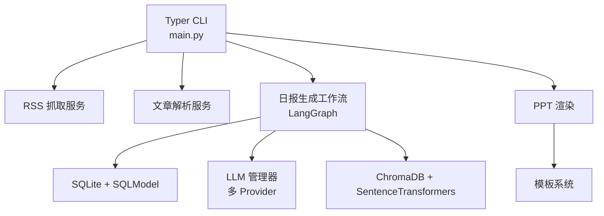
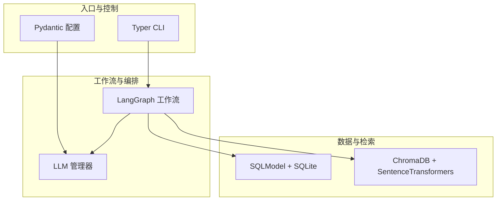
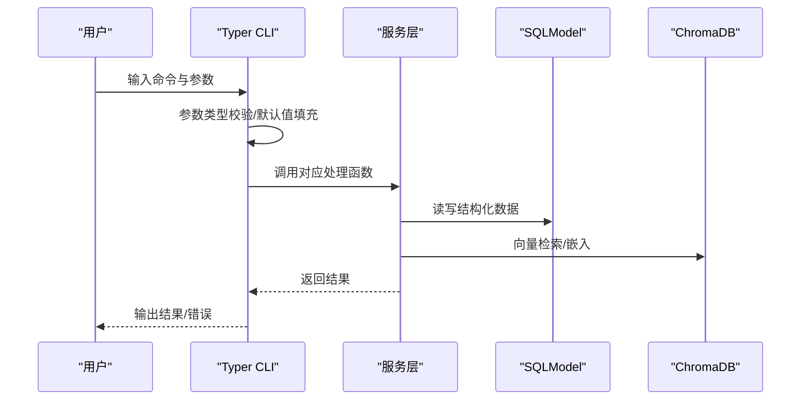
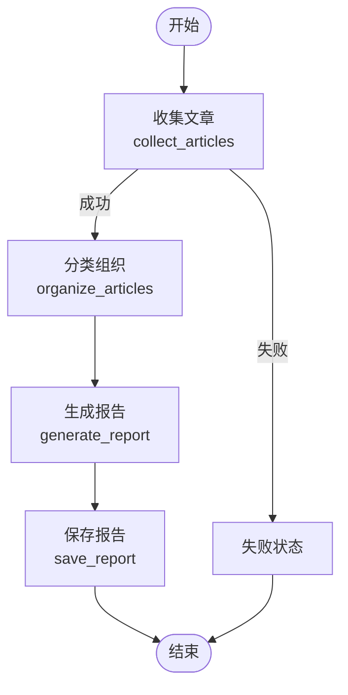
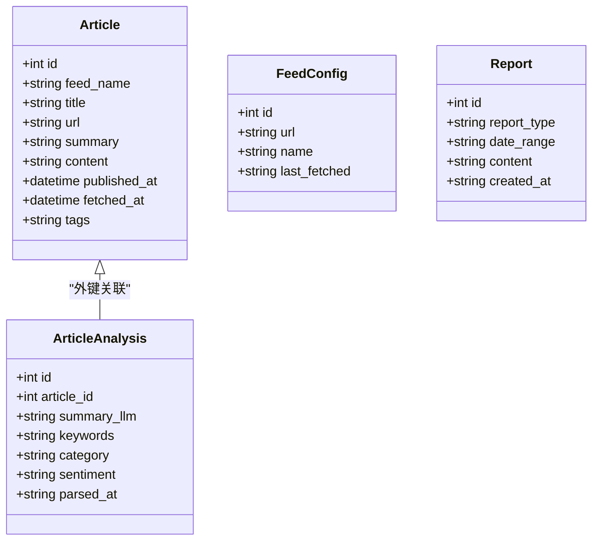
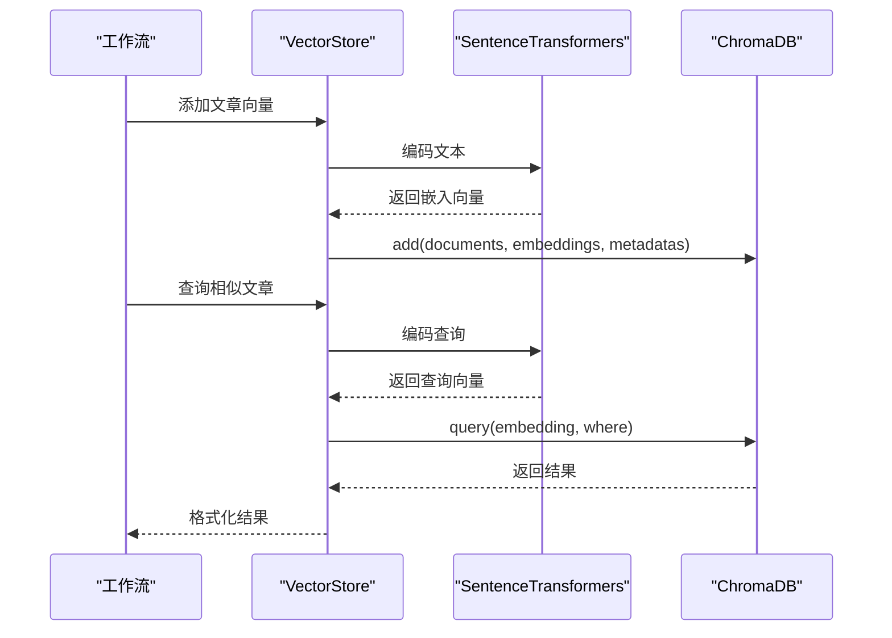
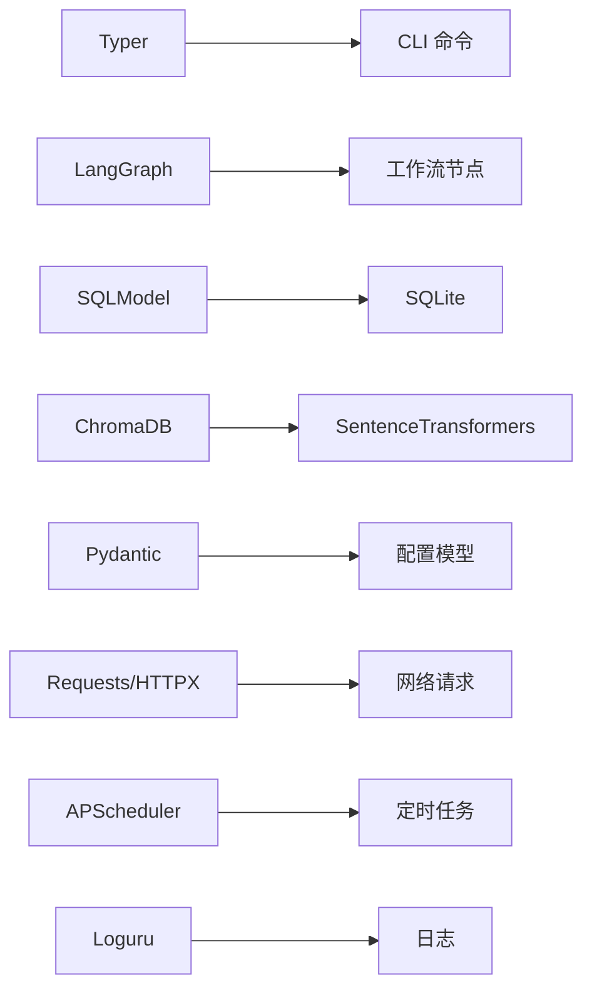

# 技术栈选型

<cite>
**本文档引用的文件**
- [pyproject.toml](file://pyproject.toml)
- [main.py](file://main.py)
- [src/config.py](file://src/config.py)
- [src/storage/vector_store.py](file://src/storage/vector_store.py)
- [src/models/llm/manager.py](file://src/models/llm/manager.py)
- [src/agents/report_workflow.py](file://src/agents/report_workflow.py)
- [src/storage/db.py](file://src/storage/db.py)
- [uv.lock](file://uv.lock)
- [uv.toml](file://uv.toml)
- [README.md](file://README.md)
</cite>

## 目录
1. [引言](#引言)
2. [项目结构](#项目结构)
3. [核心组件](#核心组件)
4. [架构总览](#架构总览)
5. [详细组件分析](#详细组件分析)
6. [依赖关系分析](#依赖关系分析)
7. [性能考虑](#性能考虑)
8. [故障排查指南](#故障排查指南)
9. [结论](#结论)

## 引言
本技术栈选型文档聚焦 Brief Agent 项目的技术决策与权衡，围绕 CLI 框架 Typer、工作流编排 LangGraph、ORM SQLModel、向量数据库 ChromaDB，以及 Python 3.11+ 的技术选型展开，结合项目实际代码与依赖锁定文件，系统阐述各技术选型的原因、优势与潜在影响，并提供版本兼容性与安全性的建议。

## 项目结构
Brief Agent 采用“功能域+分层”的混合组织方式：
- CLI 层：通过 Typer 提供命令行入口，负责 RSS 抓取、文章解析、报告生成等子命令。
- 业务层：LangGraph 工作流负责“收集→组织→生成→保存”的日报生成流程。
- 数据层：SQLite + SQLModel 作为持久化存储；ChromaDB + SentenceTransformers 作为向量检索与 RAG 基础设施。
- 配置与运行：基于 Pydantic 的配置模型，结合 .env 与 config.yaml，支持多 LLM Provider（MiniMax/DeepSeek/ModelScope）。

图表来源
- [main.py](file://main.py#L1-L227)
- [src/agents/report_workflow.py](file://src/agents/report_workflow.py#L1-L266)
- [src/storage/db.py](file://src/storage/db.py#L1-L251)
- [src/storage/vector_store.py](file://src/storage/vector_store.py#L1-L142)
- [src/models/llm/manager.py](file://src/models/llm/manager.py#L1-L318)

章节来源
- [README.md](file://README.md#L87-L148)

## 核心组件
- CLI 框架：Typer，提供类型安全、自动帮助与子命令组织，简化命令行交互与参数校验。
- 工作流编排：LangGraph，以状态图形式表达“收集→组织→生成→保存”的流程，便于扩展与调试。
- ORM：SQLModel，融合 Pydantic 的数据验证与 SQLAlchemy 的 ORM 能力，降低样板代码。
- 向量数据库：ChromaDB + SentenceTransformers，提供本地化的嵌入与检索能力，适配中小规模 RAG 场景。
- 配置与类型：Pydantic，统一配置模型与运行时类型约束，提升健壮性与可维护性。
- LLM Provider：多厂商适配，统一接口抽象，便于切换与扩展。

章节来源
- [pyproject.toml](file://pyproject.toml#L1-L49)
- [src/config.py](file://src/config.py#L1-L109)
- [src/storage/db.py](file://src/storage/db.py#L1-L251)
- [src/storage/vector_store.py](file://src/storage/vector_store.py#L1-L142)
- [src/models/llm/manager.py](file://src/models/llm/manager.py#L1-L318)
- [src/agents/report_workflow.py](file://src/agents/report_workflow.py#L1-L266)

## 架构总览
Brief Agent 的技术栈围绕“CLI → 工作流 → 数据/向量 → LLM Provider”的主干展开。CLI 作为入口，LangGraph 工作流串联数据与 LLM，SQLModel 负责结构化数据持久化，ChromaDB 提供语义检索能力，多 LLM Provider 保证推理能力的多样性与可用性。

图表来源
- [main.py](file://main.py#L1-L227)
- [src/agents/report_workflow.py](file://src/agents/report_workflow.py#L1-L266)
- [src/storage/db.py](file://src/storage/db.py#L1-L251)
- [src/storage/vector_store.py](file://src/storage/vector_store.py#L1-L142)
- [src/models/llm/manager.py](file://src/models/llm/manager.py#L1-L318)
- [src/config.py](file://src/config.py#L1-L109)

## 详细组件分析

### CLI 框架：Typer 的类型安全与易用性
- 类型安全与自动帮助：Typer 在命令定义中使用类型注解与默认值，自动生成帮助信息与参数校验，减少手动参数处理与错误。
- 子命令组织：通过 Typer.Typer(name, help) 组织子命令，清晰表达“RSS Daily”职责边界。
- 与项目契合点：
  - fetch/parse/report/serve 子命令与 main.py 的命令注册一致，体现“单一职责”的 CLI 设计。
  - 参数校验（如日期格式）在 CLI 层完成，降低下游处理复杂度。

图表来源
- [main.py](file://main.py#L66-L141)
- [src/storage/db.py](file://src/storage/db.py#L95-L166)
- [src/storage/vector_store.py](file://src/storage/vector_store.py#L80-L116)

章节来源
- [main.py](file://main.py#L1-L227)
- [pyproject.toml](file://pyproject.toml#L8-L28)

### 工作流编排：LangGraph 的优势与选择理由
- 明确的状态图：DailyReportState 定义了“收集→组织→生成→保存”的状态流转，便于理解与扩展。
- 可观测性与调试：节点函数分离，便于日志记录与单元测试；支持 START/END 边界，利于流程可视化。
- 与项目契合点：
  - collect_articles/organize_articles/generate_report/save_report 节点职责清晰，符合“单一职责”原则。
  - 与 LLMManager 和 Database 的协作，体现了“数据→推理→持久化”的闭环。

图表来源
- [src/agents/report_workflow.py](file://src/agents/report_workflow.py#L27-L201)

章节来源
- [src/agents/report_workflow.py](file://src/agents/report_workflow.py#L1-L266)

### ORM 选择：SQLModel 与 Pydantic 的集成优势
- 类型安全与自动验证：SQLModel 基于 Pydantic，模型字段具备类型约束与默认值，减少运行时错误。
- 低样板代码：SQLModel 既提供 ORM 能力，又避免传统 SQLAlchemy 的复杂装饰器与声明式语法。
- 与项目契合点：
  - Article/ArticleAnalysis/FeedConfig/Report 模型字段明确，外键关系清晰。
  - Database 封装 Session/Engine，提供 upsert/get/query/save 等常用方法，降低重复代码。

图表来源
- [src/storage/db.py](file://src/storage/db.py#L14-L61)

章节来源
- [src/storage/db.py](file://src/storage/db.py#L1-L251)
- [pyproject.toml](file://pyproject.toml#L26-L26)

### 向量数据库：ChromaDB 的选择考量
- 本地化与易部署：ChromaDB 支持 PersistentClient，配合 SentenceTransformers 的 all-MiniLM-L6-v2，可在本地快速搭建 RAG 基础设施。
- 与项目契合点：
  - VectorStore 提供 add_article/add_articles/search/delete/count 等方法，满足基本检索需求。
  - 支持按 feed_name 与日期范围过滤，便于后续扩展。

图表来源
- [src/storage/vector_store.py](file://src/storage/vector_store.py#L36-L116)

章节来源
- [src/storage/vector_store.py](file://src/storage/vector_store.py#L1-L142)
- [pyproject.toml](file://pyproject.toml#L18-L19)

### Python 3.11+ 技术选型的影响
- 语言特性：Python 3.11+ 提供更优的异常链、更快的启动速度与更好的类型检查支持，有利于大型项目的稳定性与性能。
- 依赖生态：uv.lock 显示 requires-python >= 3.11，且针对不同 Python 版本（3.11/3.12/3.13）提供不同的解析标记，确保跨版本兼容与锁定一致性。
- 项目契合点：main.py 中使用类型注解与现代语法，与 3.11+ 的类型系统相得益彰。

章节来源
- [pyproject.toml](file://pyproject.toml#L6-L6)
- [uv.lock](file://uv.lock#L3-L8)

### 第三方依赖的版本兼容性与安全性
- 版本锁定：uv.lock 记录了精确版本与哈希，确保依赖一致性与可复现构建。
- 镜像加速：uv.toml 指定阿里云镜像源，提升下载速度与稳定性。
- 安全建议：
  - 定期运行安全扫描工具（如 pip-audit），关注 CVE 与过期依赖。
  - 对敏感 API Key 通过 .env 与 Pydantic 的环境变量替换机制管理，避免硬编码。
  - 对外部 LLM Provider 的调用增加超时与重试策略，提升鲁棒性。

章节来源
- [uv.lock](file://uv.lock#L1-L619)
- [uv.toml](file://uv.toml#L1-L4)
- [src/config.py](file://src/config.py#L85-L108)

## 依赖关系分析
Brief Agent 的依赖关系围绕“CLI → 工作流 → 数据/向量 → LLM Provider”展开，核心依赖如下：
- CLI：Typer
- 工作流：LangGraph
- 数据：SQLModel + SQLite
- 向量：ChromaDB + SentenceTransformers
- 配置：Pydantic
- 网络与解析：Requests/HTTPX、BeautifulSoup4、feedparser
- 调度与日志：APScheduler、Loguru
- 其他：DashScope、python-pptx、PyYAML、python-dotenv

图表来源
- [pyproject.toml](file://pyproject.toml#L7-L29)

章节来源
- [pyproject.toml](file://pyproject.toml#L1-L49)

## 性能考虑
- 向量检索：ChromaDB 的 PersistentClient 与 SentenceTransformers 的本地嵌入模型适合中小规模场景；若未来数据量增长，可考虑分片、索引优化或迁移到云端向量服务。
- ORM 事务：SQLModel 的 Session 管理与 SQLite 的 WAL 模式有助于并发读写；建议对批量写入使用上下文管理与事务封装。
- LLM 调用：LLMManager 的批量推理与线程池实现可提升吞吐；注意限流与重试策略，避免触发上游速率限制。
- CLI 与工作流：Typer 的类型校验与 LangGraph 的节点化设计，使错误尽早暴露，减少无效计算。

## 故障排查指南
- 配置加载失败：检查 .env 与 config.yaml 的键名与值，确认 Pydantic 的环境变量替换是否生效。
- LLM Provider 未配置：确保至少配置一个 Provider 的 API Key，或在 config.yaml 中设置 default。
- 向量检索无结果：确认 VectorStore 的 collection 是否存在，嵌入模型是否正确加载。
- 数据库锁/并发问题：检查 SQLite 的 WAL 模式与 busy_timeout 设置，避免长时间阻塞。
- CLI 参数错误：利用 Typer 的自动帮助与类型校验，优先修正参数格式（如日期格式）。

章节来源
- [src/config.py](file://src/config.py#L74-L108)
- [src/models/llm/manager.py](file://src/models/llm/manager.py#L253-L295)
- [src/storage/vector_store.py](file://src/storage/vector_store.py#L18-L34)
- [src/storage/db.py](file://src/storage/db.py#L84-L90)
- [main.py](file://main.py#L118-L124)

## 结论
Brief Agent 的技术栈选型体现了“类型安全 + 易用 + 可扩展”的平衡：
- Typer 提升 CLI 的类型安全与可维护性；
- LangGraph 将复杂流程模块化，便于调试与扩展；
- SQLModel 以 Pydantic 为基础，降低 ORM 复杂度；
- ChromaDB + SentenceTransformers 提供轻量级 RAG 能力；
- Python 3.11+ 与 uv 生态保障了版本一致性与开发体验。

在后续演进中，建议持续关注依赖安全扫描、向量检索性能优化与 LLM Provider 的成本控制，以支撑更大规模的生产化应用。