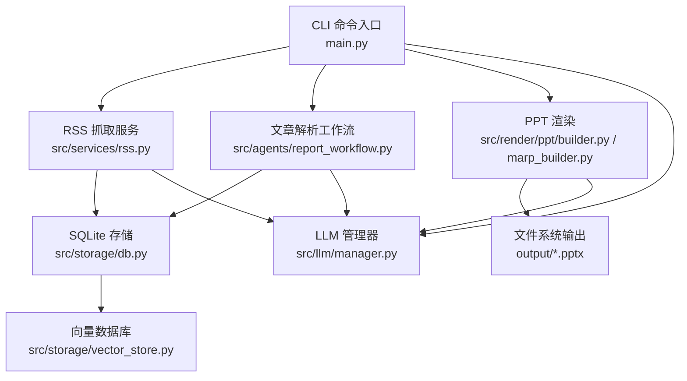
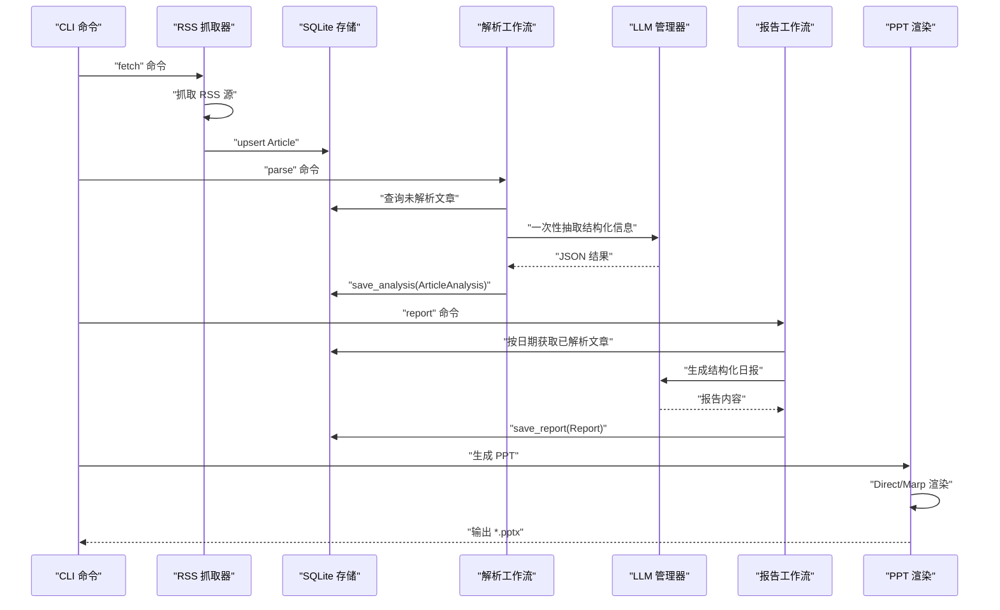
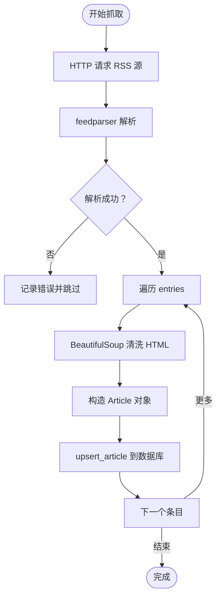
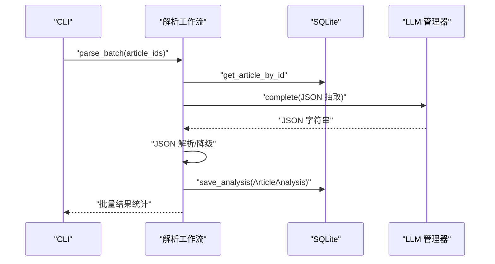
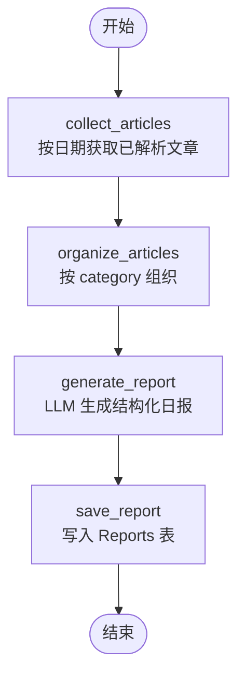
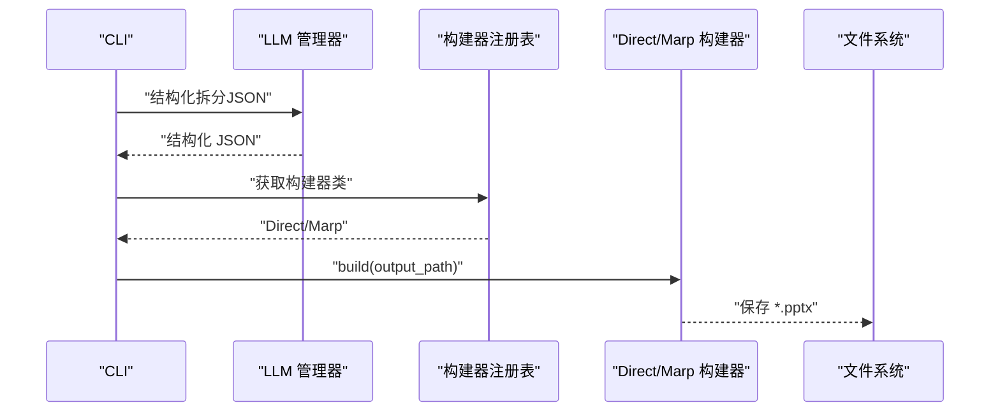
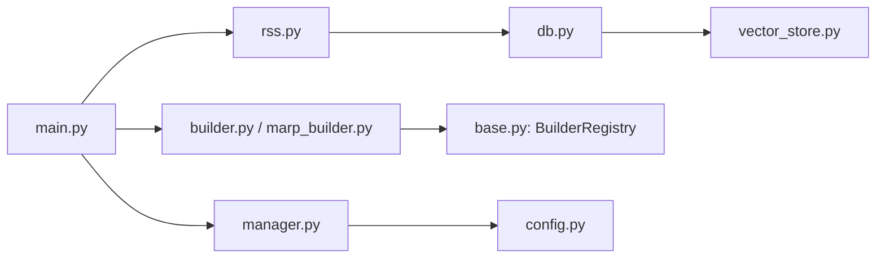
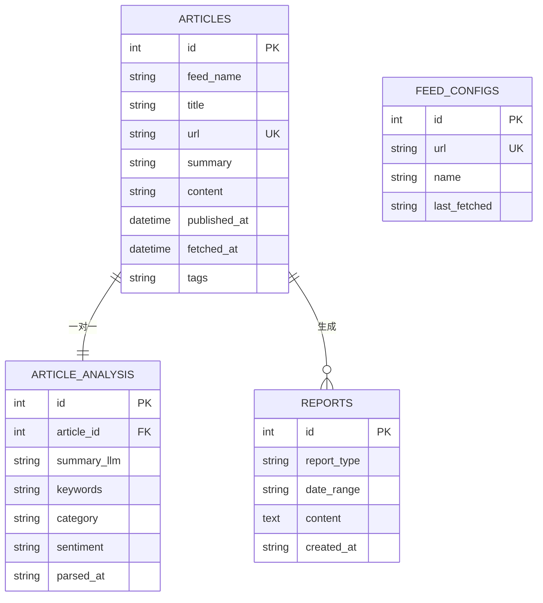
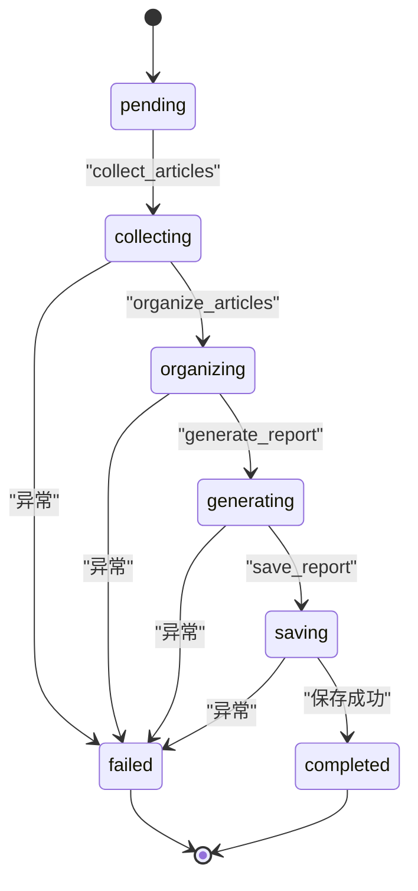

# 数据流设计

<cite>
**本文引用的文件**
- [main.py](file://main.py)
- [rss.py](file://src/services/rss.py)
- [db.py](file://src/storage/db.py)
- [report_workflow.py](file://src/agents/report_workflow.py)
- [builder.py](file://src/render/ppt/builder.py)
- [base.py](file://src/render/ppt/base.py)
- [marp_builder.py](file://src/render/ppt/marp_builder.py)
- [manager.py](file://src/llm/manager.py)
- [vector_store.py](file://src/storage/vector_store.py)
- [config.py](file://src/config.py)
- [migrate_db.py](file://scripts/migrate_db.py)
</cite>

## 目录
1. [简介](#简介)
2. [项目结构](#项目结构)
3. [核心组件](#核心组件)
4. [架构总览](#架构总览)
5. [详细组件分析](#详细组件分析)
6. [依赖关系分析](#依赖关系分析)
7. [性能考量](#性能考量)
8. [故障排查指南](#故障排查指南)
9. [结论](#结论)
10. [附录](#附录)

## 简介
本设计文档围绕 Brief Agent 的数据流进行系统化梳理，覆盖 RSS 数据从抓取、解析、清洗到存储的完整生命周期；文章分析数据的流转与持久化；报告生成过程中的数据转换与聚合；以及 PPT 渲染阶段的数据结构变化与最终输出格式。同时提供数据流图与状态转换图，讨论数据一致性与错误处理机制，帮助读者快速理解并扩展该系统。

## 项目结构
Brief Agent 采用模块化分层设计：
- CLI 层：命令入口与用户交互（RSS 抓取、解析、报告生成、PPT 渲染）
- 服务层：RSS 抓取与解析（LangGraph 工作流）
- 存储层：SQLite ORM 模型与向量数据库（ChromaDB）
- LLM 层：统一 LLM 管理器与多提供商适配
- 渲染层：PPT 构建器（Direct 与 Marp 两种策略）

图表来源
- [main.py](file://main.py#L66-L141)
- [rss.py](file://src/services/rss.py#L15-L60)
- [db.py](file://src/storage/db.py#L65-L94)
- [report_workflow.py](file://src/agents/report_workflow.py#L186-L237)
- [builder.py](file://src/render/ppt/builder.py#L128-L151)
- [manager.py](file://src/llm/manager.py#L206-L318)
- [vector_store.py](file://src/storage/vector_store.py#L15-L35)

章节来源
- [main.py](file://main.py#L1-L227)
- [config.py](file://src/config.py#L65-L88)

## 核心组件
- RSS 抓取器：负责从多个 RSS 源抓取内容，解析为 Article，并去重入库
- 文章解析工作流：从数据库读取未解析文章，调用 LLM 一次性抽取摘要、关键词、分类、情感等，写入 ArticleAnalysis
- 报告生成工作流：按日期筛选已解析文章，按分类组织，调用 LLM 生成结构化日报，保存为 Report
- PPT 渲染：将结构化的幻灯片数据渲染为 PPTX（Direct 方案）或通过 Marp 转换（Marp 方案）
- 存储层：SQLite ORM（Articles、ArticleAnalysis、Reports、FeedConfigs）与向量数据库（ChromaDB）

章节来源
- [rss.py](file://src/services/rss.py#L15-L108)
- [db.py](file://src/storage/db.py#L14-L61)
- [report_workflow.py](file://src/agents/report_workflow.py#L27-L36)
- [builder.py](file://src/render/ppt/builder.py#L22-L61)
- [vector_store.py](file://src/storage/vector_store.py#L15-L35)

## 架构总览
Brief Agent 的数据流遵循“采集-解析-聚合-渲染”的闭环：
- 采集：RSS 抓取器解析 RSS 内容，清洗 HTML，构造 Article，upsert 到 SQLite
- 解析：LangGraph 工作流加载文章，调用 LLM 一次性抽取结构化信息，写入 ArticleAnalysis
- 聚合：按日期与分类组织文章，生成日报草稿，再由 LLM 优化为正式报告，保存为 Report
- 渲染：将结构化幻灯片数据转为 PPTX（Direct/Marp），输出到文件系统

图表来源
- [main.py](file://main.py#L66-L141)
- [rss.py](file://src/services/rss.py#L22-L60)
- [db.py](file://src/storage/db.py#L97-L123)
- [report_workflow.py](file://src/agents/report_workflow.py#L46-L182)
- [builder.py](file://src/render/ppt/builder.py#L128-L151)

## 详细组件分析

### RSS 数据采集与存储
- 输入：RSS 源 URL 列表
- 处理：HTTP 请求、feedparser 解析、BeautifulSoup 清洗、时间解析、标签提取
- 输出：Article 对象，去重后 upsert 到 SQLite
- 关键点：超时控制、Bozo 异常处理、HTML 清洗、唯一约束（url）

图表来源
- [rss.py](file://src/services/rss.py#L34-L108)
- [db.py](file://src/storage/db.py#L97-L123)

章节来源
- [rss.py](file://src/services/rss.py#L15-L108)
- [db.py](file://src/storage/db.py#L97-L123)

### 文章解析数据流（LLM 抽取）
- 输入：Article 原始摘要与正文
- 处理：LangGraph 三节点工作流（load → parse → save）
- 输出：ArticleAnalysis（summary_llm、keywords、category、sentiment、parsed_at）
- 关键点：一次性 JSON 抽取、JSON 解析降级、错误状态回传

图表来源
- [report_workflow.py](file://src/agents/report_workflow.py#L105-L151)
- [db.py](file://src/storage/db.py#L169-L191)
- [manager.py](file://src/llm/manager.py#L297-L314)

章节来源
- [report_workflow.py](file://src/agents/report_workflow.py#L66-L151)
- [db.py](file://src/storage/db.py#L169-L191)
- [manager.py](file://src/llm/manager.py#L206-L318)

### 报告生成与聚合
- 输入：按日期筛选的已解析文章（Article + ArticleAnalysis）
- 处理：按 category 分类、组织摘要与链接、调用 LLM 生成结构化日报
- 输出：Report（report_type、date_range、content、created_at）
- 关键点：LangGraph 状态机、正则清理、错误传播

图表来源
- [report_workflow.py](file://src/agents/report_workflow.py#L46-L182)
- [db.py](file://src/storage/db.py#L227-L239)

章节来源
- [report_workflow.py](file://src/agents/report_workflow.py#L27-L182)
- [db.py](file://src/storage/db.py#L52-L61)

### PPT 渲染阶段的数据结构变化
- 输入：Markdown 日报（来自报告生成）
- 处理：LLM 结构化拆分（降级方案）、Direct/Marp 渲染
- 输出：PPTX 文件
- 关键点：Direct 直接使用 python-pptx；Marp 通过 Marp CLI 转换；模板选择与降级

图表来源
- [main.py](file://main.py#L143-L188)
- [base.py](file://src/render/ppt/base.py#L16-L42)
- [builder.py](file://src/render/ppt/builder.py#L128-L151)
- [marp_builder.py](file://src/render/ppt/marp_builder.py#L59-L94)

章节来源
- [main.py](file://main.py#L143-L188)
- [base.py](file://src/render/ppt/base.py#L16-L42)
- [builder.py](file://src/render/ppt/builder.py#L22-L61)
- [marp_builder.py](file://src/render/ppt/marp_builder.py#L21-L94)

### 数据一致性与错误处理
- 一致性
  - SQLite 使用 WAL 模式与超时设置，提升并发读写稳定性
  - upsert 逻辑避免重复插入，基于 url 唯一性
  - ArticleAnalysis 与 Article 一对一映射，外键约束保障
- 错误处理
  - RSS 抓取：HTTP 异常捕获、Bozo 异常记录、逐源容错
  - 解析：JSON 解析失败降级为自然语言摘要
  - 报告：状态机传播错误，失败分支终止后续步骤
  - PPT：Marp CLI 未安装时记录警告并保存 Markdown

章节来源
- [db.py](file://src/storage/db.py#L71-L94)
- [rss.py](file://src/services/rss.py#L37-L48)
- [report_workflow.py](file://src/agents/report_workflow.py#L59-L61)
- [main.py](file://main.py#L156-L161)
- [marp_builder.py](file://src/render/ppt/marp_builder.py#L37-L57)

## 依赖关系分析
- 组件耦合
  - CLI 依赖 RSS、LLM、DB、PPT 构建器
  - RSS 依赖 HTTP 客户端与 feedparser
  - 解析与报告均依赖 LLM 管理器
  - PPT 渲染依赖构建器注册表与模板
- 外部依赖
  - feedparser、httpx、BeautifulSoup、SQLModel、ChromaDB、Marp CLI

图表来源
- [main.py](file://main.py#L14-L21)
- [rss.py](file://src/services/rss.py#L10-L12)
- [db.py](file://src/storage/db.py#L8-L9)
- [vector_store.py](file://src/storage/vector_store.py#L11-L12)
- [base.py](file://src/render/ppt/base.py#L16-L42)

章节来源
- [main.py](file://main.py#L14-L21)
- [config.py](file://src/config.py#L74-L88)

## 性能考量
- 数据库
  - WAL 模式与 busy_timeout 提升并发能力
  - upsert 与批量查询减少 N+1 问题
- LLM
  - 批量推理使用线程池，限制并发度
  - JSON 模式减少后处理开销
- 渲染
  - Direct 方案直接生成 PPTX，避免中间格式转换
  - Marp 方案依赖外部 CLI，需确保可用性

[本节为通用性能建议，无需特定文件引用]

## 故障排查指南
- RSS 抓取失败
  - 检查网络与目标站点可达性
  - 查看 Bozo 异常与 HTTP 状态码
- 解析 JSON 失败
  - 检查 LLM 输出格式，启用降级方案
  - 核对 JSON 模式开关
- 报告生成失败
  - 检查日期格式与数据库中已解析文章数量
  - 关注状态机错误字段
- PPT 渲染失败
  - 确认 Marp CLI 是否安装
  - 检查构建器名称与模板路径

章节来源
- [rss.py](file://src/services/rss.py#L40-L48)
- [main.py](file://main.py#L156-L161)
- [report_workflow.py](file://src/agents/report_workflow.py#L59-L61)
- [marp_builder.py](file://src/render/ppt/marp_builder.py#L37-L57)

## 结论
Brief Agent 的数据流设计清晰地实现了“采集-解析-聚合-渲染”的闭环：RSS 抓取器负责高质量的原始数据采集，LangGraph 工作流将原始内容转化为结构化分析结果，报告工作流进一步聚合为可读性强的日报，PPT 渲染则将结构化信息转化为演示材料。通过 SQLite 与向量数据库的组合，系统兼顾了结构化查询与语义检索能力。在错误处理与降级策略方面，系统具备良好的鲁棒性，能够应对 LLM 输出不稳定与外部依赖缺失等问题。

[本节为总结性内容，无需特定文件引用]

## 附录

### 数据模型与状态转换

图表来源
- [db.py](file://src/storage/db.py#L14-L61)

### 状态转换图（报告工作流）

图表来源
- [report_workflow.py](file://src/agents/report_workflow.py#L27-L36)

### 数据迁移与兼容性
- 使用 SQLModel 初始化表结构
- 迁移旧 articles 表中的解析字段到 article_analysis
- 保持向后兼容，逐步过渡

章节来源
- [migrate_db.py](file://scripts/migrate_db.py#L15-L50)