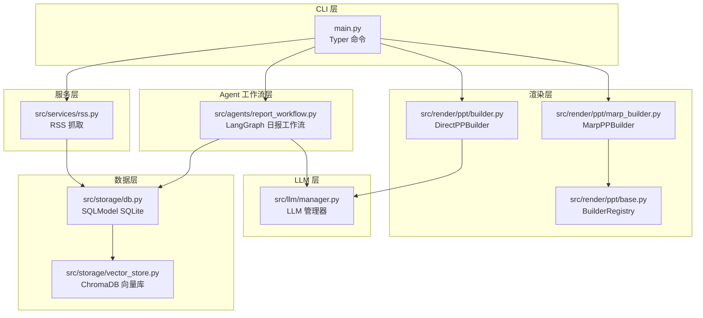
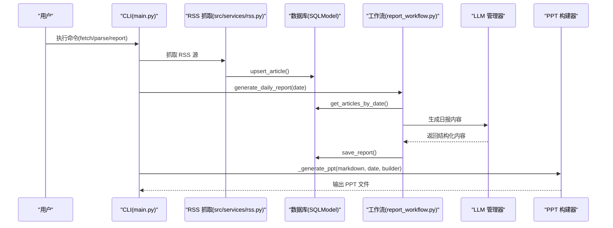
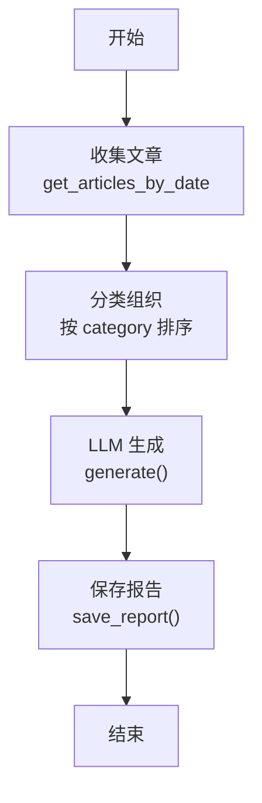
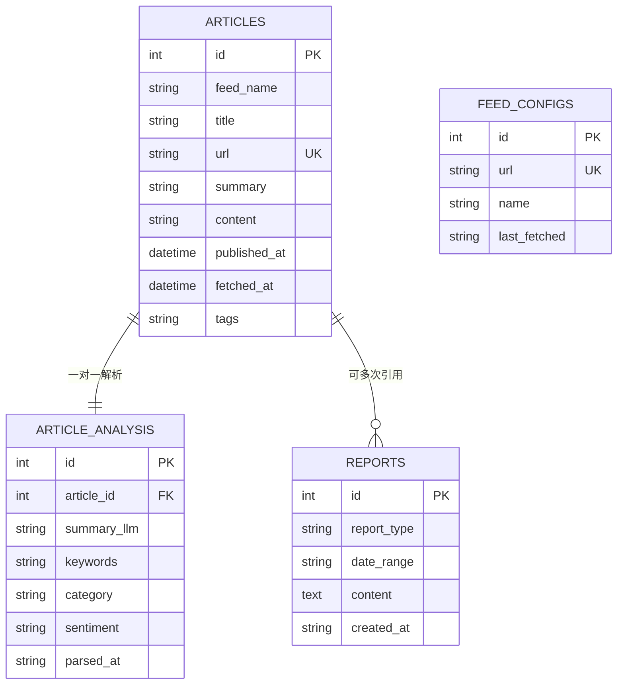
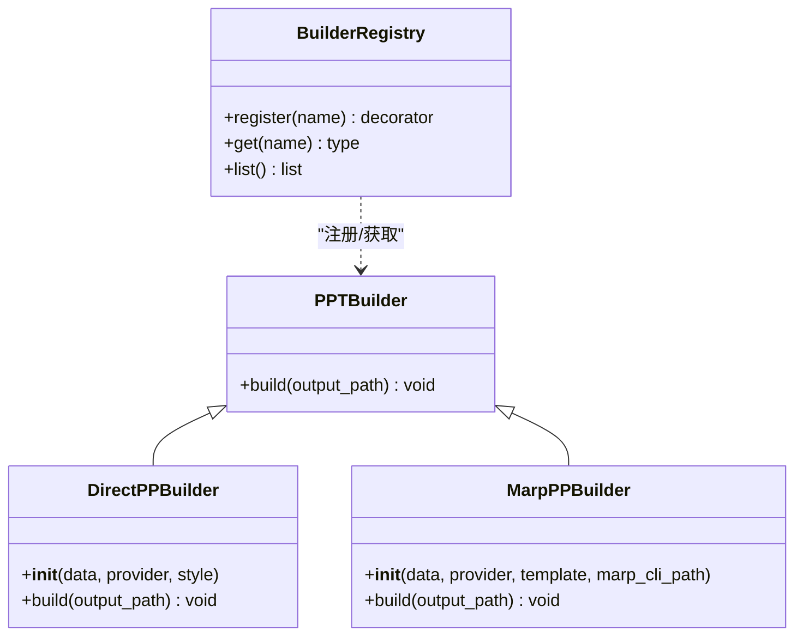
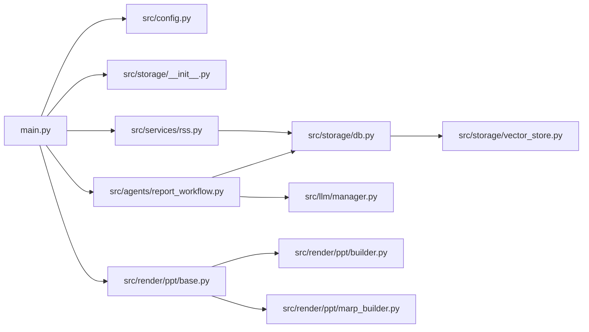

# 整体架构概览

<cite>
**本文档引用的文件**
- [main.py](file://main.py)
- [README.md](file://README.md)
- [pyproject.toml](file://pyproject.toml)
- [src/config.py](file://src/config.py)
- [config.yaml](file://config.yaml)
- [src/storage/db.py](file://src/storage/db.py)
- [src/storage/vector_store.py](file://src/storage/vector_store.py)
- [src/services/rss.py](file://src/services/rss.py)
- [src/agents/report_workflow.py](file://src/agents/report_workflow.py)
- [src/render/ppt/base.py](file://src/render/ppt/base.py)
- [src/render/ppt/builder.py](file://src/render/ppt/builder.py)
- [src/render/ppt/marp_builder.py](file://src/render/ppt/marp_builder.py)
- [src/llm/manager.py](file://src/llm/manager.py)
- [src/storage/__init__.py](file://src/storage/__init__.py)
</cite>

## 目录
1. [简介](#简介)
2. [项目结构](#项目结构)
3. [核心组件](#核心组件)
4. [架构总览](#架构总览)
5. [详细组件分析](#详细组件分析)
6. [依赖关系分析](#依赖关系分析)
7. [性能考量](#性能考量)
8. [故障排查指南](#故障排查指南)
9. [结论](#结论)
10. [附录](#附录)

## 简介
Brief Agent 是一个基于 Typer 的 CLI 应用，围绕 LangGraph 工作流与分层设计模式构建，实现从 RSS 抓取、LLM 解析、结构化报告生成到 PPT 输出的完整流水线。系统采用“CLI 层—服务层—Agent 工作流层—数据层—渲染层”的五层架构，结合 SQLModel、ChromaDB、LangGraph 等关键技术，形成可扩展、可维护的企业级多模态内容生成平台。

## 项目结构
项目采用按功能域划分的分层组织方式：
- CLI 层：Typer 命令入口，负责用户交互与流程编排
- 服务层：RSS 抓取、定时调度等业务服务
- Agent 工作流层：基于 LangGraph 的状态机工作流
- 数据层：SQLite + ChromaDB，分别承担结构化数据与向量检索
- 渲染层：PPT 直接渲染与 Marp 渲染两种构建器

图表来源
- [main.py](file://main.py#L22-L227)
- [src/services/rss.py](file://src/services/rss.py#L15-L123)
- [src/agents/report_workflow.py](file://src/agents/report_workflow.py#L1-L266)
- [src/storage/db.py](file://src/storage/db.py#L1-L251)
- [src/storage/vector_store.py](file://src/storage/vector_store.py#L1-L142)
- [src/render/ppt/builder.py](file://src/render/ppt/builder.py#L1-L194)
- [src/render/ppt/marp_builder.py](file://src/render/ppt/marp_builder.py#L1-L94)
- [src/render/ppt/base.py](file://src/render/ppt/base.py#L1-L42)
- [src/llm/manager.py](file://src/llm/manager.py#L1-L318)

章节来源
- [README.md](file://README.md#L87-L148)
- [pyproject.toml](file://pyproject.toml#L1-L49)

## 核心组件
- CLI 层：Typer 应用提供 fetch、parse、report、serve 等命令，负责日志初始化、配置加载、调用工作流与渲染器
- 服务层：RSS 抓取器封装 feedparser、HTTPX、BeautifulSoup，统一入库
- Agent 工作流层：LangGraph 工作流定义“收集—组织—生成—保存”四阶段，状态 TypedDict 驱动
- 数据层：SQLModel 管理 SQLite 表结构；ChromaDB 提供向量检索能力
- 渲染层：DirectPPBuilder 使用 python-pptx 直接渲染；MarpPPBuilder 通过 Marp CLI 渲染 PPT，并支持模板

章节来源
- [main.py](file://main.py#L66-L141)
- [src/services/rss.py](file://src/services/rss.py#L15-L123)
- [src/agents/report_workflow.py](file://src/agents/report_workflow.py#L25-L238)
- [src/storage/db.py](file://src/storage/db.py#L14-L251)
- [src/storage/vector_store.py](file://src/storage/vector_store.py#L15-L142)
- [src/render/ppt/builder.py](file://src/render/ppt/builder.py#L22-L194)
- [src/render/ppt/marp_builder.py](file://src/render/ppt/marp_builder.py#L21-L94)
- [src/render/ppt/base.py](file://src/render/ppt/base.py#L16-L42)

## 架构总览
Brief Agent 的整体数据流与控制流如下：

图表来源
- [main.py](file://main.py#L66-L141)
- [src/services/rss.py](file://src/services/rss.py#L22-L60)
- [src/storage/db.py](file://src/storage/db.py#L97-L151)
- [src/agents/report_workflow.py](file://src/agents/report_workflow.py#L217-L237)
- [src/llm/manager.py](file://src/llm/manager.py#L206-L318)
- [src/render/ppt/builder.py](file://src/render/ppt/builder.py#L128-L151)

## 详细组件分析

### CLI 层（Typer）
- 职责：命令解析、日志初始化、配置加载、工作流与渲染器编排
- 关键命令：
  - fetch：抓取 RSS 并入库
  - parse：批量解析未处理文章
  - report：生成日报并可选输出 PPT
  - serve：占位命令（预留 Web 服务）
- 控制流：report 命令内部先生成工作流结果，再根据选项决定是否结构化生成 PPT

章节来源
- [main.py](file://main.py#L22-L227)

### 服务层（RSS 抓取）
- 职责：遍历配置的 RSS 源，解析 XML，清洗 HTML，入库
- 关键点：超时控制、异常记录、去重入库、摘要与正文长度限制
- 与数据层交互：通过 Database.upsert_article 批量写入

章节来源
- [src/services/rss.py](file://src/services/rss.py#L15-L123)
- [src/storage/db.py](file://src/storage/db.py#L97-L122)

### Agent 工作流层（LangGraph）
- 职责：以状态机形式串联“收集—组织—生成—保存”，将结构化文章汇总为日报
- 状态：TypedDict 包含日期范围、文章列表、分类组织、报告内容、状态与错误
- 节点：
  - collect_articles：按日期获取已解析文章
  - organize_articles：按 category 分类并排序
  - generate_report：构造提示词并调用 LLM 生成内容
  - save_report：持久化到 reports 表
- 单例工作流：全局缓存编译后的工作流实例

图表来源
- [src/agents/report_workflow.py](file://src/agents/report_workflow.py#L46-L182)

章节来源
- [src/agents/report_workflow.py](file://src/agents/report_workflow.py#L25-L238)

### 数据层（SQLModel + ChromaDB）
- SQLModel（SQLite）：
  - 表：articles、article_analysis、feed_configs、reports
  - 特性：WAL 模式、超时设置、upsert、子查询筛选未解析文章、批量查询与关联查询
- ChromaDB：
  - 向量集合：rss_articles
  - 能力：添加/批量添加文章向量、按 feed_name 与日期范围检索、删除、计数
  - 嵌入模型：SentenceTransformer(all-MiniLM-L6-v2)

图表来源
- [src/storage/db.py](file://src/storage/db.py#L14-L61)

章节来源
- [src/storage/db.py](file://src/storage/db.py#L65-L251)
- [src/storage/vector_store.py](file://src/storage/vector_store.py#L15-L142)

### 渲染层（PPT 构建器）
- DirectPPBuilder：通过 LLM 生成设计蓝图，直接使用 python-pptx 渲染，支持标题页、内容页与备注
- MarpPPBuilder：将 JSON 数据转为 Marp Markdown，借助 Marp CLI 渲染为 PPT，支持模板切换
- 注册机制：BuilderRegistry 统一注册与获取构建器类型

图表来源
- [src/render/ppt/base.py](file://src/render/ppt/base.py#L7-L42)
- [src/render/ppt/builder.py](file://src/render/ppt/builder.py#L22-L194)
- [src/render/ppt/marp_builder.py](file://src/render/ppt/marp_builder.py#L21-L94)

章节来源
- [src/render/ppt/base.py](file://src/render/ppt/base.py#L1-L42)
- [src/render/ppt/builder.py](file://src/render/ppt/builder.py#L1-L194)
- [src/render/ppt/marp_builder.py](file://src/render/ppt/marp_builder.py#L1-L94)

### LLM 层（统一管理器）
- 支持 Provider：MiniMax、ModelScope（Qwen）、DeepSeek
- 能力：单次推理、批量推理（线程池）、流式生成（部分 Provider）
- 配置来源：config.yaml 与 .env，支持回退到环境变量

章节来源
- [src/llm/manager.py](file://src/llm/manager.py#L206-L318)
- [src/config.py](file://src/config.py#L74-L109)
- [config.yaml](file://config.yaml#L4-L21)

## 依赖关系分析
- CLI 依赖：配置加载、数据库单例、RSS 服务、LLM 管理器、PPT 构建器注册表
- 工作流依赖：数据库访问、LLM 管理器、状态 TypedDict
- 数据层依赖：SQLModel、SQLAlchemy、ChromaDB、SentenceTransformer
- 渲染层依赖：python-pptx、Marp CLI（可选）

图表来源
- [main.py](file://main.py#L14-L21)
- [src/agents/report_workflow.py](file://src/agents/report_workflow.py#L19-L22)
- [src/storage/__init__.py](file://src/storage/__init__.py#L8-L14)
- [src/storage/db.py](file://src/storage/db.py#L65-L94)
- [src/storage/vector_store.py](file://src/storage/vector_store.py#L15-L35)
- [src/render/ppt/base.py](file://src/render/ppt/base.py#L16-L42)

章节来源
- [pyproject.toml](file://pyproject.toml#L7-L29)

## 性能考量
- 数据库并发：SQLite 启用 WAL 模式与 busy_timeout，提升并发读写稳定性
- 批量入库：RSS 抓取后批量 upsert，减少事务开销
- 批量 LLM：Provider 基类提供线程池批量推理，提高吞吐
- 向量检索：ChromaDB 持久化客户端，SentenceTransformer 嵌入模型，支持按 feed_name 与日期范围检索
- 渲染性能：DirectPPBuilder 直接渲染，避免额外中间格式；Marp 渲染依赖系统 CLI，需确保安装与路径正确

## 故障排查指南
- RSS 抓取失败：检查网络与 feed URL，查看日志错误；确认超时与重定向设置
- LLM 推理失败：核对 API Key 与 Provider 配置；检查流式生成支持情况
- 数据库锁/忙等待：确认 WAL 模式启用与 busy_timeout 设置；避免长时间长事务
- PPT 渲染失败：确认 Marp CLI 是否安装；DirectPPBuilder 不依赖外部工具，优先使用
- 工作流状态异常：关注状态字段与错误信息，定位具体节点（collect/organize/generate/save）

章节来源
- [src/services/rss.py](file://src/services/rss.py#L34-L60)
- [src/llm/manager.py](file://src/llm/manager.py#L253-L295)
- [src/storage/db.py](file://src/storage/db.py#L84-L90)
- [src/render/ppt/marp_builder.py](file://src/render/ppt/marp_builder.py#L40-L57)
- [src/agents/report_workflow.py](file://src/agents/report_workflow.py#L59-L61)

## 结论
Brief Agent 通过清晰的五层架构与 LangGraph 工作流，实现了从 RSS 到 PPT 的自动化内容管线。Typer 提供简洁的 CLI 体验，SQLModel 与 ChromaDB 提供可靠的数据基础设施，LLM 管理器统一多提供商接入，渲染层支持多种输出策略。该架构具备良好的扩展性与可维护性，适合持续演进为企业级内容智能平台。

## 附录
- 技术栈选择理由
  - Typer：命令行解析与子命令组织，CLI 开发效率高
  - LangGraph：状态机式工作流，便于扩展与调试
  - SQLModel：轻量 ORM，SQLite 易部署、易迁移
  - ChromaDB：嵌入式向量库，易于集成与扩展
  - feedparser/BeautifulSoup/HTTPX：RSS 解析与网络请求稳定生态
  - python-pptx/Marp：PPT 渲染双通道，兼顾灵活性与模板化

章节来源
- [README.md](file://README.md#L3-L16)
- [pyproject.toml](file://pyproject.toml#L7-L29)