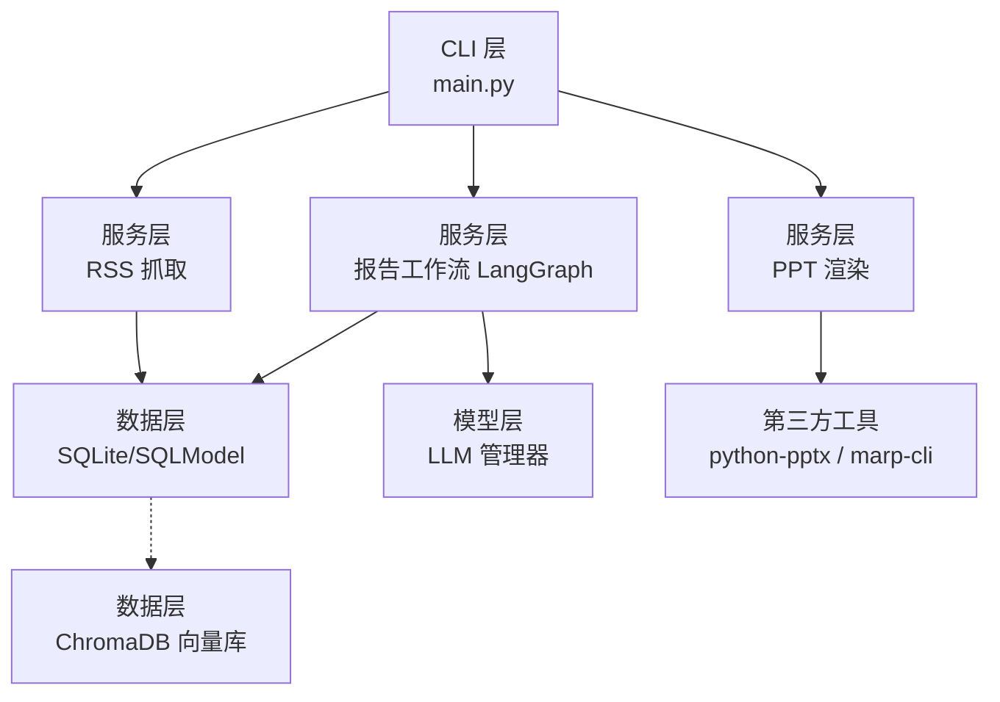
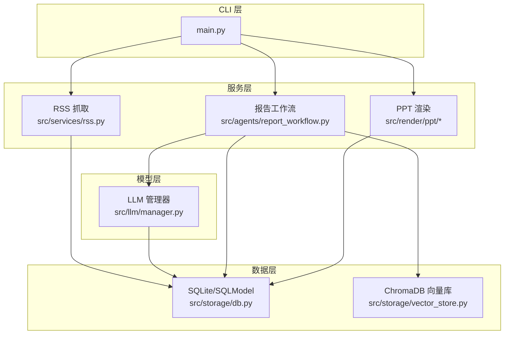
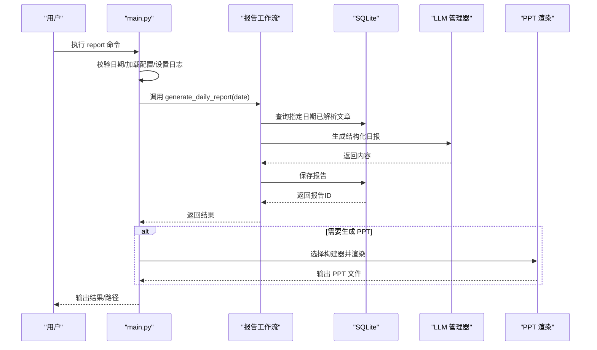
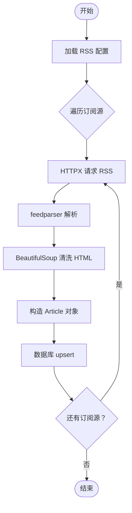
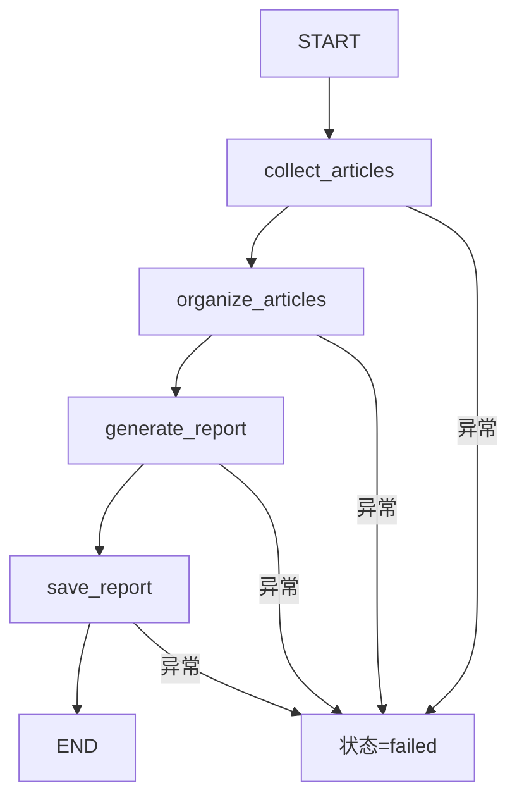
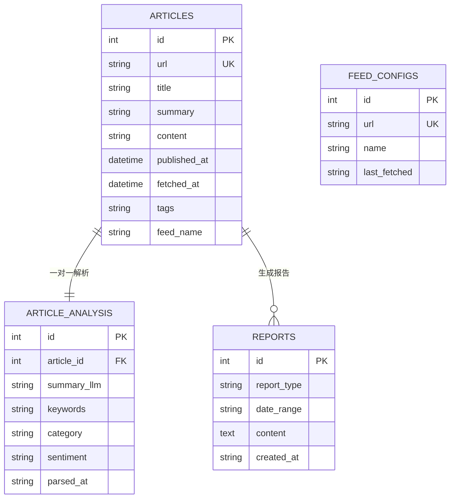
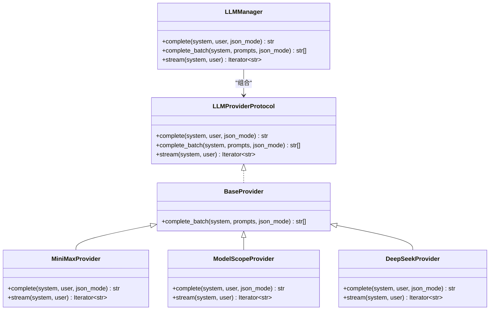
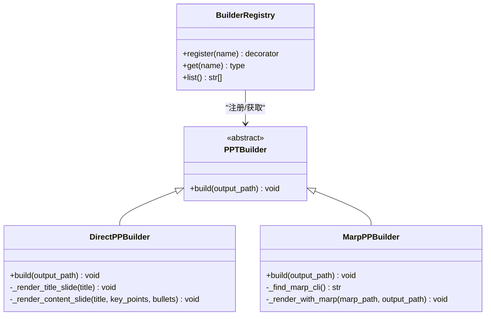
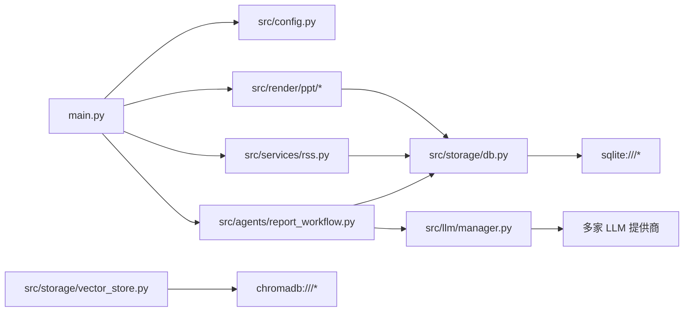

# 架构设计

<cite>
**本文引用的文件**
- [README.md](file://README.md)
- [main.py](file://main.py)
- [src/config.py](file://src/config.py)
- [config.yaml](file://config.yaml)
- [pyproject.toml](file://pyproject.toml)
- [src/agents/report_workflow.py](file://src/agents/report_workflow.py)
- [src/agents/__init__.py](file://src/agents/__init__.py)
- [src/services/rss.py](file://src/services/rss.py)
- [src/storage/db.py](file://src/storage/db.py)
- [src/storage/vector_store.py](file://src/storage/vector_store.py)
- [src/llm/manager.py](file://src/llm/manager.py)
- [src/models/llm/manager.py](file://src/models/llm/manager.py)
- [src/render/ppt/base.py](file://src/render/ppt/base.py)
- [src/render/ppt/builder.py](file://src/render/ppt/builder.py)
- [src/render/ppt/marp_builder.py](file://src/render/ppt/marp_builder.py)
</cite>

## 目录
1. [简介](#简介)
2. [项目结构](#项目结构)
3. [核心组件](#核心组件)
4. [架构总览](#架构总览)
5. [组件详解](#组件详解)
6. [依赖关系分析](#依赖关系分析)
7. [性能考量](#性能考量)
8. [故障排查指南](#故障排查指南)
9. [结论](#结论)
10. [附录](#附录)

## 简介
Brief Agent 是一个基于 LangGraph 的多模态内容自动生成与分发平台，围绕“RSS 抓取 → 文章解析 → 日报生成 → PPT 渲染”的端到端工作流展开。系统采用分层架构：CLI 层负责用户入口与命令编排；服务层承载业务逻辑（RSS 抓取、报告生成、渲染）；数据层负责持久化与向量化检索；模型层统一接入多家 LLM 提供商。技术选型上，LangGraph 用于声明式工作流编排，SQLModel/SQLite 用于结构化数据持久化，ChromaDB 用于 RAG 向量检索，Marp/Python-PPTX 用于 PPT 渲染。

## 项目结构
项目采用按职责分层的模块化组织方式：
- CLI 层：命令行入口与参数解析，负责调度 RSS 抓取、文章解析、报告生成与 PPT 渲染。
- 服务层：RSS 抓取与定时调度、报告生成工作流（LangGraph）、PPT 渲染（Direct 与 Marp 两种构建器）。
- 数据层：SQLite（SQLModel）与 ChromaDB（向量库），分别承担结构化数据与语义检索。
- 模型层：统一 LLM 管理器，支持多家提供商（MiniMax、ModelScope、DeepSeek）。

图表来源
- [main.py](file://main.py#L1-L227)
- [src/services/rss.py](file://src/services/rss.py#L1-L123)
- [src/agents/report_workflow.py](file://src/agents/report_workflow.py#L1-L266)
- [src/storage/db.py](file://src/storage/db.py#L1-L251)
- [src/storage/vector_store.py](file://src/storage/vector_store.py#L1-L142)
- [src/llm/manager.py](file://src/llm/manager.py#L1-L318)

章节来源
- [README.md](file://README.md#L87-L148)
- [pyproject.toml](file://pyproject.toml#L1-L49)

## 核心组件
- CLI 与命令编排：Typer 定义 fetch、parse、report、serve 等命令，集中处理日志、配置加载与调用链。
- RSS 抓取服务：基于 feedparser 解析 RSS，BeautifulSoup 清洗 HTML，HTTPX 请求，批量入库。
- 报告生成工作流（LangGraph）：以状态机形式串联“收集→分类→生成→保存”，支持错误传播与状态管理。
- LLM 管理器：Provider 模式抽象多家大模型，统一接口（单次/批量/流式），支持配置与回退。
- 数据层：SQLModel 定义四张表（articles、article_analysis、feed_configs、reports），支持 Upsert、查询与聚合。
- 向量库：ChromaDB + SentenceTransformer，提供标题+摘要的向量索引与语义检索。
- PPT 渲染：Direct 构建器（python-pptx）与 Marp 构建器（Marp CLI），支持模板与蓝图驱动。

章节来源
- [main.py](file://main.py#L1-L227)
- [src/services/rss.py](file://src/services/rss.py#L1-L123)
- [src/agents/report_workflow.py](file://src/agents/report_workflow.py#L1-L266)
- [src/llm/manager.py](file://src/llm/manager.py#L1-L318)
- [src/storage/db.py](file://src/storage/db.py#L1-L251)
- [src/storage/vector_store.py](file://src/storage/vector_store.py#L1-L142)
- [src/render/ppt/base.py](file://src/render/ppt/base.py#L1-L42)
- [src/render/ppt/builder.py](file://src/render/ppt/builder.py#L1-L194)
- [src/render/ppt/marp_builder.py](file://src/render/ppt/marp_builder.py#L1-L94)

## 架构总览
系统采用“分层 + 工作流 + 注册表”的组合架构：
- 分层架构：CLI → 服务层 → 数据层，职责清晰、耦合可控。
- 工作流编排：LangGraph 将复杂流程状态化、可观察、可扩展。
- 注册表与工厂：构建器注册表实现“工厂模式”式扩展，便于新增渲染方案。
- Provider 模式：LLM 管理器屏蔽不同提供商差异，统一调用接口。
- Repository 模式：数据库访问封装在 Database 类中，面向领域对象而非原始 SQL。

图表来源
- [main.py](file://main.py#L1-L227)
- [src/services/rss.py](file://src/services/rss.py#L1-L123)
- [src/agents/report_workflow.py](file://src/agents/report_workflow.py#L1-L266)
- [src/storage/db.py](file://src/storage/db.py#L1-L251)
- [src/storage/vector_store.py](file://src/storage/vector_store.py#L1-L142)
- [src/llm/manager.py](file://src/llm/manager.py#L1-L318)
- [src/render/ppt/base.py](file://src/render/ppt/base.py#L1-L42)

## 组件详解

### CLI 层（命令编排）
- 职责：Typer 定义 fetch、parse、report、serve 命令；加载配置与日志；调度工作流与渲染。
- 关键流程：report 命令调用报告工作流生成内容，再根据参数决定是否生成 PPT；PPT 通过 BuilderRegistry 获取具体构建器。
- 错误处理：参数校验、异常捕获与退出码控制。

图表来源
- [main.py](file://main.py#L107-L141)
- [src/agents/report_workflow.py](file://src/agents/report_workflow.py#L217-L237)
- [src/storage/db.py](file://src/storage/db.py#L227-L239)
- [src/llm/manager.py](file://src/llm/manager.py#L297-L317)
- [src/render/ppt/base.py](file://src/render/ppt/base.py#L31-L36)

章节来源
- [main.py](file://main.py#L66-L141)

### 服务层：RSS 抓取与定时调度
- RSS 抓取：feedparser 解析 XML，BeautifulSoup 清洗摘要/正文，构造 Article 对象，批量 upsert 到数据库。
- 定时调度：轮询间隔由配置控制，持续抓取所有订阅源。

图表来源
- [src/services/rss.py](file://src/services/rss.py#L22-L60)
- [src/storage/db.py](file://src/storage/db.py#L97-L122)

章节来源
- [src/services/rss.py](file://src/services/rss.py#L1-L123)

### 服务层：报告生成工作流（LangGraph）
- 状态机：START → collect → organize → generate → save → END。
- 节点职责：collect 从数据库按日期筛选已解析文章；organize 按类别聚合；generate 使用 LLM 生成结构化日报；save 写入 reports 表。
- 错误传播：任一节点失败将状态置为 failed，并携带错误信息。

图表来源
- [src/agents/report_workflow.py](file://src/agents/report_workflow.py#L186-L201)
- [src/agents/report_workflow.py](file://src/agents/report_workflow.py#L46-L181)

章节来源
- [src/agents/report_workflow.py](file://src/agents/report_workflow.py#L1-L266)

### 数据层：SQLite 与向量库
- SQLite（SQLModel）：四张表支撑全文与元数据存储，提供 upsert、分页、子查询、聚合等能力。
- 向量库（ChromaDB）：基于 SentenceTransformer 生成标题+摘要向量，支持按 feed_name 与日期范围检索。

图表来源
- [src/storage/db.py](file://src/storage/db.py#L14-L61)

章节来源
- [src/storage/db.py](file://src/storage/db.py#L1-L251)
- [src/storage/vector_store.py](file://src/storage/vector_store.py#L1-L142)

### 模型层：LLM 管理器（Provider 模式）
- Provider 抽象：统一 complete、complete_batch、stream 接口；BaseProvider 提供批量默认实现。
- 多提供商：MiniMax、ModelScope（OpenAI 兼容）、DeepSeek（OpenAI 兼容）。
- 配置加载：优先从 config.yaml 读取，失败回退至环境变量。

图表来源
- [src/llm/manager.py](file://src/llm/manager.py#L24-L63)
- [src/llm/manager.py](file://src/llm/manager.py#L108-L158)
- [src/llm/manager.py](file://src/llm/manager.py#L162-L202)
- [src/llm/manager.py](file://src/llm/manager.py#L206-L317)

章节来源
- [src/llm/manager.py](file://src/llm/manager.py#L1-L318)
- [src/models/llm/manager.py](file://src/models/llm/manager.py#L1-L318)

### 渲染层：PPT 构建器（工厂/注册表）
- 工厂/注册表：BuilderRegistry.register 与 get 实现“工厂模式”扩展，支持 direct 与 marp 两种构建器。
- Direct 构建器：基于 python-pptx，按固定布局渲染标题页与内容页。
- Marp 构建器：将 JSON 转换为 Marp Markdown，调用 marp-cli 渲染为 PPT，支持模板切换。

图表来源
- [src/render/ppt/base.py](file://src/render/ppt/base.py#L7-L42)
- [src/render/ppt/builder.py](file://src/render/ppt/builder.py#L22-L194)
- [src/render/ppt/marp_builder.py](file://src/render/ppt/marp_builder.py#L21-L94)

章节来源
- [src/render/ppt/base.py](file://src/render/ppt/base.py#L1-L42)
- [src/render/ppt/builder.py](file://src/render/ppt/builder.py#L1-L194)
- [src/render/ppt/marp_builder.py](file://src/render/ppt/marp_builder.py#L1-L94)

## 依赖关系分析
- 外部依赖：Typer、LangGraph、feedparser、beautifulsoup4、requests/httpx、python-dotenv、pyyaml、sqlite-utils、chromadb、sentence-transformers、apscheduler、loguru、pydantic、pytest、langchain-*、sqlmodel、dashscope、python-pptx。
- 内部依赖：CLI 依赖配置与日志；RSS 依赖数据库；报告工作流依赖数据库与 LLM；渲染依赖构建器注册表与第三方工具。

图表来源
- [pyproject.toml](file://pyproject.toml#L7-L29)
- [main.py](file://main.py#L14-L21)
- [src/agents/report_workflow.py](file://src/agents/report_workflow.py#L17-L22)
- [src/storage/db.py](file://src/storage/db.py#L8-L9)
- [src/storage/vector_store.py](file://src/storage/vector_store.py#L7-L9)

章节来源
- [pyproject.toml](file://pyproject.toml#L1-L49)

## 性能考量
- 数据库并发：SQLite 启用 WAL 模式与 busy_timeout，提升并发读写稳定性。
- 批量推理：Provider 基类使用线程池并发调用，减少等待时间。
- 向量检索：ChromaDB 持久化客户端，SentenceTransformer 本地嵌入，避免频繁网络往返。
- 渲染路径：Direct 构建器无需外部 CLI，Marp 构建器依赖系统安装，建议在 CI/CD 环境预装 marp-cli。
- 日志与可观测：loguru 配置轮转与保留策略，便于生产环境问题定位。

## 故障排查指南
- RSS 抓取失败：检查 feedparser 解析异常与 HTTP 请求状态；确认超时与重定向设置。
- 数据库锁/写入冲突：确认 WAL 模式已启用；避免同一进程多线程共享 Session。
- LLM 调用异常：检查配置文件与环境变量；验证提供商 API Key 与模型名。
- PPT 渲染失败：确认构建器名称正确；Direct 构建器依赖 python-pptx；Marp 构建器依赖 marp-cli 安装与路径。
- 报告工作流中断：查看状态字段与错误信息，定位失败节点并重试。

章节来源
- [src/services/rss.py](file://src/services/rss.py#L34-L60)
- [src/storage/db.py](file://src/storage/db.py#L84-L89)
- [src/llm/manager.py](file://src/llm/manager.py#L253-L295)
- [src/render/ppt/marp_builder.py](file://src/render/ppt/marp_builder.py#L40-L57)
- [src/agents/report_workflow.py](file://src/agents/report_workflow.py#L59-L61)

## 结论
Brief Agent 通过 LangGraph 将复杂的“RSS → 解析 → 报告 → 渲染”流程状态化、可观测化，结合 Provider/工厂/注册表等设计模式实现了高内聚、低耦合的模块化架构。SQLite 与 ChromaDB 的组合满足结构化数据与语义检索需求，LLM 管理器提供了跨提供商的统一抽象。未来可在令牌与费用追踪、多 Agent 并行、缓存与批处理等方面进一步优化。

## 附录
- 配置文件位置与关键字段：config.yaml 中包含 LLM 提供商、RSS 订阅、数据库与向量库路径、日志与调度配置。
- CLI 常用命令：fetch（抓取）、parse（解析）、report（生成报告/PPT）、serve（占位）。

章节来源
- [config.yaml](file://config.yaml#L1-L54)
- [main.py](file://main.py#L66-L141)