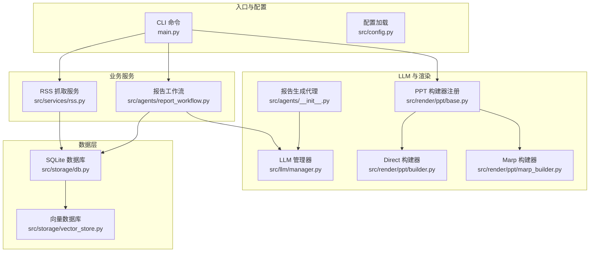
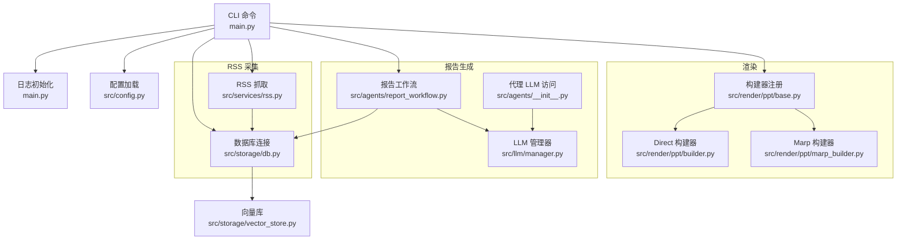
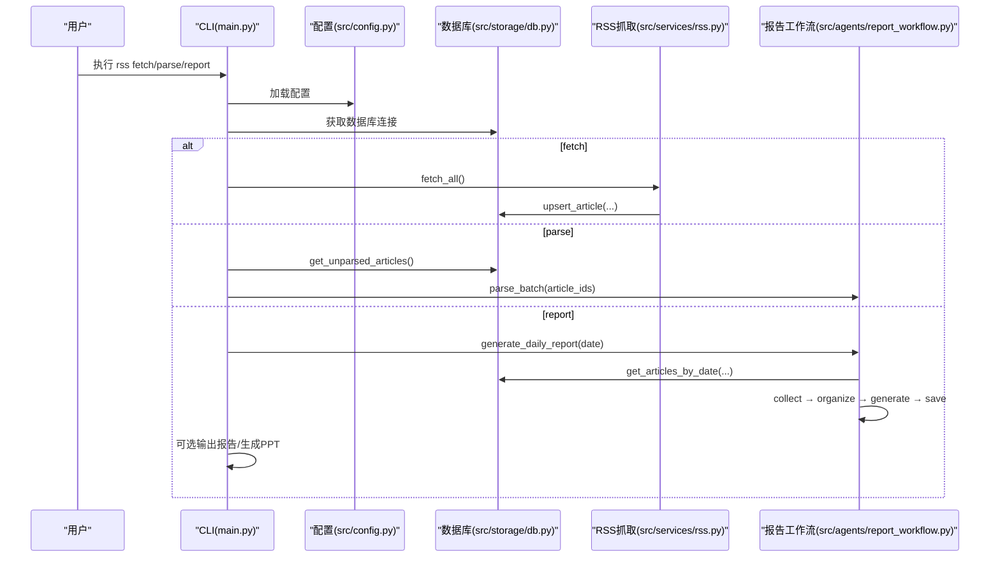
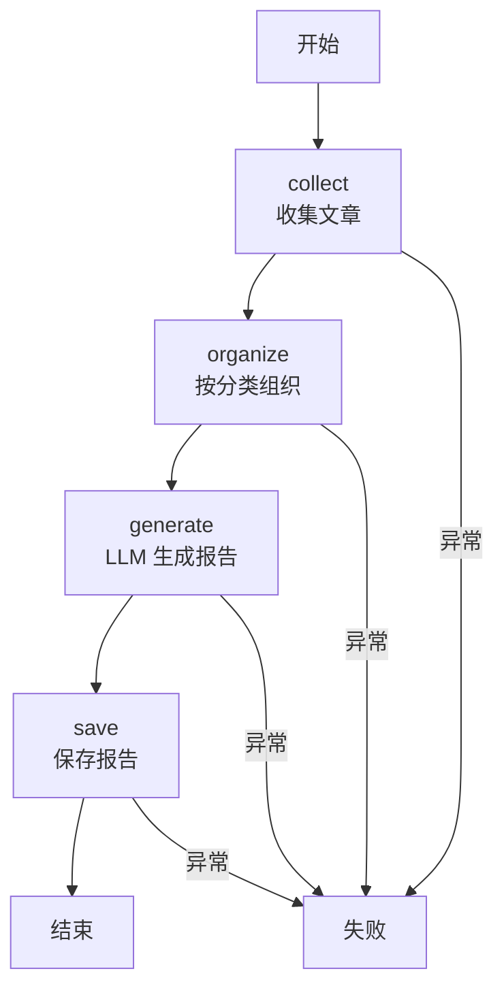
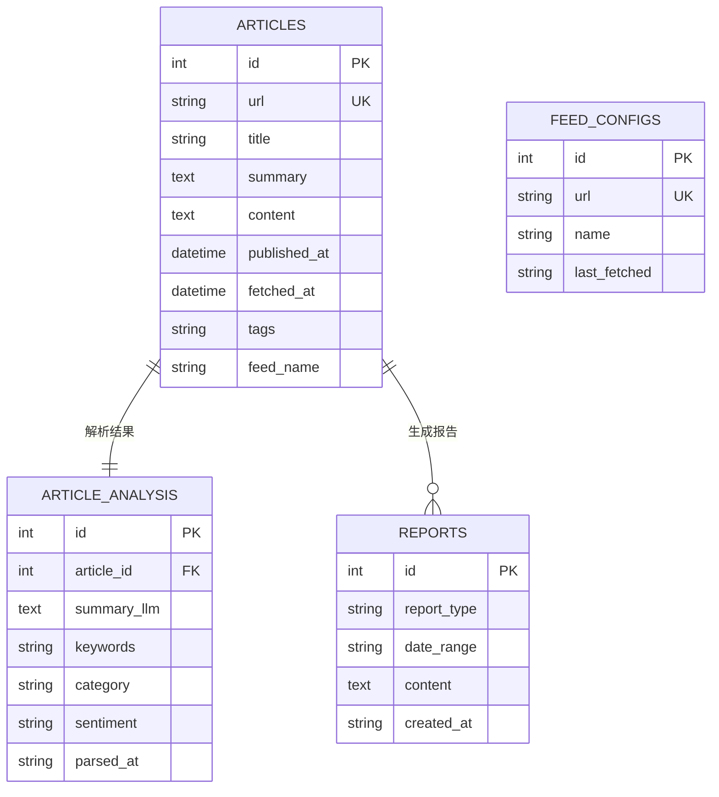
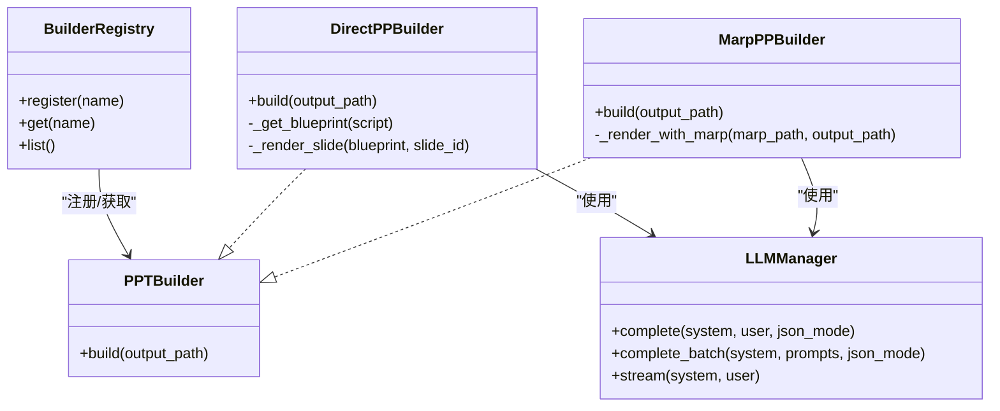
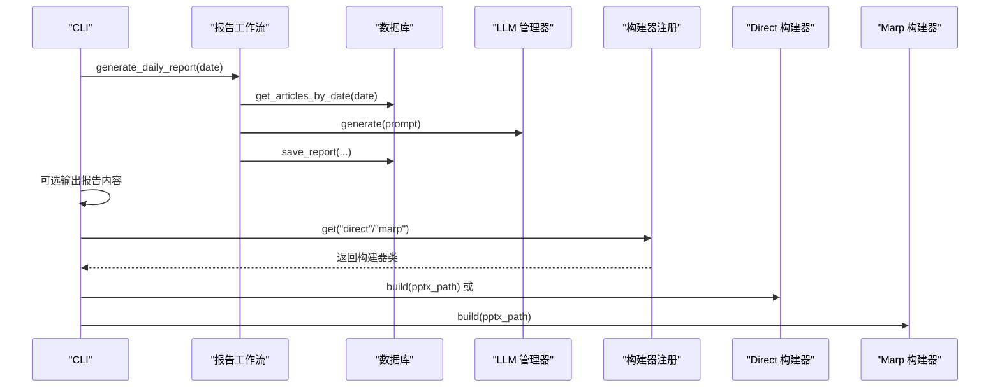
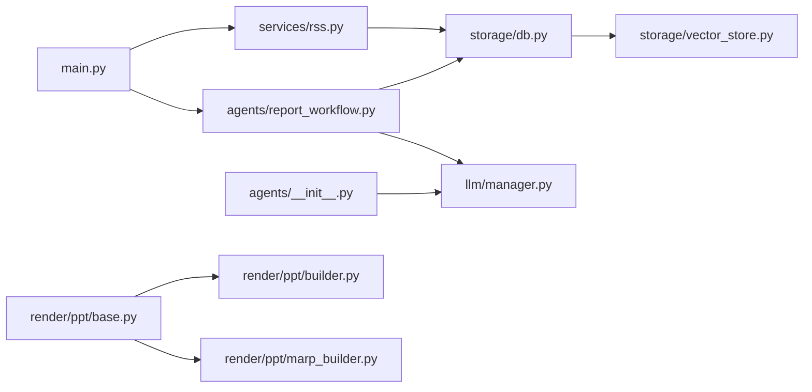

# 组件交互关系

<cite>
**本文引用的文件**
- [main.py](file://main.py)
- [README.md](file://README.md)
- [src/config.py](file://src/config.py)
- [src/agents/report_workflow.py](file://src/agents/report_workflow.py)
- [src/agents/__init__.py](file://src/agents/__init__.py)
- [src/services/rss.py](file://src/services/rss.py)
- [src/storage/db.py](file://src/storage/db.py)
- [src/storage/vector_store.py](file://src/storage/vector_store.py)
- [src/llm/manager.py](file://src/llm/manager.py)
- [src/models/llm/manager.py](file://src/models/llm/manager.py)
- [src/render/ppt/base.py](file://src/render/ppt/base.py)
- [src/render/ppt/builder.py](file://src/render/ppt/builder.py)
- [src/render/ppt/marp_builder.py](file://src/render/ppt/marp_builder.py)
- [config.yaml](file://config.yaml)
</cite>

## 目录
1. [简介](#简介)
2. [项目结构](#项目结构)
3. [核心组件](#核心组件)
4. [架构总览](#架构总览)
5. [详细组件分析](#详细组件分析)
6. [依赖关系分析](#依赖关系分析)
7. [性能考量](#性能考量)
8. [故障排查指南](#故障排查指南)
9. [结论](#结论)
10. [附录](#附录)

## 简介
本文件面向 Brief Agent 的组件交互关系，聚焦 CLI 命令如何串联 RSS 抓取、文章解析、报告生成、PPT 渲染等环节，形成从数据采集到内容产出的完整工作流。文档同时阐述 Agent 工作流内部的状态流转与节点间数据传递、服务层与数据层的交互模式（数据库与向量库）、以及渲染层与 LLM 管理器的协作关系，并提供时序图与交互图以直观展示调用链与数据流向。

## 项目结构
Brief Agent 采用“入口 CLI → 业务服务 → 数据层 → 渲染层”的分层组织方式，配合 LLM 管理器与 Agent 工作流实现端到端自动化内容生产。

图表来源
- [main.py](file://main.py#L66-L141)
- [src/services/rss.py](file://src/services/rss.py#L15-L61)
- [src/agents/report_workflow.py](file://src/agents/report_workflow.py#L186-L237)
- [src/storage/db.py](file://src/storage/db.py#L65-L90)
- [src/storage/vector_store.py](file://src/storage/vector_store.py#L15-L35)
- [src/llm/manager.py](file://src/llm/manager.py#L206-L318)
- [src/agents/__init__.py](file://src/agents/__init__.py#L9-L14)
- [src/render/ppt/base.py](file://src/render/ppt/base.py#L16-L42)
- [src/render/ppt/builder.py](file://src/render/ppt/builder.py#L22-L151)
- [src/render/ppt/marp_builder.py](file://src/render/ppt/marp_builder.py#L21-L94)

章节来源
- [README.md](file://README.md#L87-L148)
- [config.yaml](file://config.yaml#L1-L54)

## 核心组件
- CLI 入口与命令
  - 提供 fetch、parse、report、serve 等子命令，负责日志初始化、配置加载、数据库连接与工作流触发。
- RSS 抓取服务
  - 从配置的 RSS 源拉取内容，解析条目，清洗 HTML，批量写入数据库。
- 报告工作流（Agent）
  - 基于 LangGraph 的状态机，按节点顺序完成“收集→组织→生成→保存”，并与 LLM 管理器协作生成结构化报告。
- 数据层
  - SQLite（SQLModel）持久化文章、解析结果与报告；ChromaDB 基于 SentenceTransformer 嵌入实现 RAG 检索。
- LLM 管理器
  - 统一接入 MiniMax、ModelScope、DeepSeek，提供单次、批量与流式接口。
- 渲染层
  - PPT 构建器注册表与多种实现（Direct、Marp），支持 JSON→PPT 的不同路径。

章节来源
- [main.py](file://main.py#L66-L141)
- [src/services/rss.py](file://src/services/rss.py#L15-L61)
- [src/agents/report_workflow.py](file://src/agents/report_workflow.py#L25-L237)
- [src/storage/db.py](file://src/storage/db.py#L12-L251)
- [src/storage/vector_store.py](file://src/storage/vector_store.py#L15-L142)
- [src/llm/manager.py](file://src/llm/manager.py#L206-L318)
- [src/render/ppt/base.py](file://src/render/ppt/base.py#L16-L42)

## 架构总览
Brief Agent 的整体架构围绕“CLI → 服务 → 数据 → LLM → 渲染”的主干展开，其中 Agent 工作流在“收集→组织→生成→保存”之间以状态机推进，LLM 管理器贯穿解析与报告生成阶段，数据层同时支撑结构化存储与向量检索。

图表来源
- [main.py](file://main.py#L54-L82)
- [src/config.py](file://src/config.py#L74-L109)
- [src/storage/db.py](file://src/storage/db.py#L65-L90)
- [src/services/rss.py](file://src/services/rss.py#L22-L61)
- [src/agents/report_workflow.py](file://src/agents/report_workflow.py#L186-L237)
- [src/llm/manager.py](file://src/llm/manager.py#L206-L318)
- [src/agents/__init__.py](file://src/agents/__init__.py#L9-L14)
- [src/render/ppt/base.py](file://src/render/ppt/base.py#L16-L42)
- [src/render/ppt/builder.py](file://src/render/ppt/builder.py#L22-L151)
- [src/render/ppt/marp_builder.py](file://src/render/ppt/marp_builder.py#L21-L94)
- [src/storage/vector_store.py](file://src/storage/vector_store.py#L15-L35)

## 详细组件分析

### CLI 命令与工作流触发
- fetch：加载配置与日志，初始化数据库与 RSS 抓取器，批量抓取并入库。
- parse：获取未解析文章，按批调用解析流程（此处由 CLI 触发，具体解析逻辑在工作流中体现）。
- report：校验日期格式，调用报告生成工作流，成功后可选输出到 stdout 并触发 PPT 生成。
- serve：占位命令，当前未实现 Web UI。

图表来源
- [main.py](file://main.py#L66-L141)
- [src/config.py](file://src/config.py#L74-L109)
- [src/storage/db.py](file://src/storage/db.py#L97-L166)
- [src/services/rss.py](file://src/services/rss.py#L22-L61)
- [src/agents/report_workflow.py](file://src/agents/report_workflow.py#L46-L182)

章节来源
- [main.py](file://main.py#L66-L141)

### Agent 工作流状态与数据传递
- 状态类型：包含日期范围、文章集合、分类组织结果、报告内容、报告 ID、状态与错误信息。
- 节点职责：
  - collect：从数据库按日期范围获取已解析文章。
  - organize：按分类聚合文章，便于后续生成。
  - generate：构造提示词，调用 LLM 生成报告正文。
  - save：将报告写入数据库并返回 ID。
- 状态流转：START → collect → organize → generate → save → END；任一节点失败将设置状态为 failed 并携带错误信息。

图表来源
- [src/agents/report_workflow.py](file://src/agents/report_workflow.py#L27-L182)
- [src/agents/report_workflow.py](file://src/agents/report_workflow.py#L186-L237)

章节来源
- [src/agents/report_workflow.py](file://src/agents/report_workflow.py#L25-L237)

### 服务层与数据层交互（数据库与缓存策略）
- 数据库（SQLite + SQLModel）
  - 表结构：articles、article_analysis、feed_configs、reports。
  - 操作：upsert_article、get_articles_by_date、get_unparsed_articles、save_analysis、save_report 等。
  - 事务与并发：启用 WAL 模式与超时配置，提升并发读写能力。
- 向量库（ChromaDB + SentenceTransformer）
  - 用于 RAG 检索，支持按 feed_name 与日期范围检索，提供增删改查与计数接口。
- 缓存策略
  - RSS 抓取结果以 upsert 方式去重入库，避免重复抓取。
  - 文章解析结果以 article_analysis 表缓存，支持重跑与增量更新。
  - 报告生成结果以 reports 表缓存，便于复用与审计。

图表来源
- [src/storage/db.py](file://src/storage/db.py#L14-L61)

章节来源
- [src/storage/db.py](file://src/storage/db.py#L65-L251)
- [src/storage/vector_store.py](file://src/storage/vector_store.py#L15-L142)

### 渲染层与 LLM 管理器协作
- PPT 构建器注册表
  - 通过装饰器注册不同构建器（如 direct、marp），运行时按名称获取对应实现。
- Direct 构建器
  - 直接使用 python-pptx 渲染，支持从 LLM 获取设计蓝图并绘制图片与文本框。
- Marp 构建器
  - 将 JSON 数据转为 Marp Markdown，再通过 marp CLI 渲染为 PPT，支持模板样式。
- LLM 管理器
  - 统一提供 complete、complete_batch、stream 接口，支持 MiniMax、ModelScope、DeepSeek。

图表来源
- [src/render/ppt/base.py](file://src/render/ppt/base.py#L7-L42)
- [src/render/ppt/builder.py](file://src/render/ppt/builder.py#L22-L151)
- [src/render/ppt/marp_builder.py](file://src/render/ppt/marp_builder.py#L21-L94)
- [src/llm/manager.py](file://src/llm/manager.py#L206-L318)

章节来源
- [src/render/ppt/base.py](file://src/render/ppt/base.py#L16-L42)
- [src/render/ppt/builder.py](file://src/render/ppt/builder.py#L22-L151)
- [src/render/ppt/marp_builder.py](file://src/render/ppt/marp_builder.py#L21-L94)
- [src/llm/manager.py](file://src/llm/manager.py#L206-L318)

### 报告生成与 PPT 渲染的完整调用链
- CLI report 命令
  - 校验日期 → 调用 generate_daily_report → 若成功可打印报告内容 → 触发 PPT 生成。
- PPT 生成流程
  - LLM 将报告内容结构化为幻灯片 JSON（降级方案：按标题拆分）→ 选择构建器（direct/marp）→ 输出 .pptx。

图表来源
- [main.py](file://main.py#L107-L141)
- [src/agents/report_workflow.py](file://src/agents/report_workflow.py#L217-L237)
- [src/storage/db.py](file://src/storage/db.py#L147-L151)
- [src/render/ppt/base.py](file://src/render/ppt/base.py#L32-L36)
- [src/render/ppt/builder.py](file://src/render/ppt/builder.py#L128-L151)
- [src/render/ppt/marp_builder.py](file://src/render/ppt/marp_builder.py#L59-L94)

章节来源
- [main.py](file://main.py#L107-L141)
- [src/render/ppt/base.py](file://src/render/ppt/base.py#L32-L36)

## 依赖关系分析
- 组件耦合与内聚
  - CLI 与服务层解耦，通过配置与数据库接口交互；Agent 工作流通过统一 LLM 访问接口与数据层交互。
  - 渲染层通过注册表与 LLM 管理器松耦合，便于扩展新的构建器。
- 外部依赖
  - RSS 解析依赖 feedparser、BeautifulSoup、httpx；数据库依赖 SQLModel/SQLAlchemy；向量库依赖 ChromaDB/SentenceTransformer；PPT 渲染依赖 python-pptx 与可选 marp CLI。

图表来源
- [main.py](file://main.py#L14-L21)
- [src/services/rss.py](file://src/services/rss.py#L10-L12)
- [src/agents/report_workflow.py](file://src/agents/report_workflow.py#L19-L20)
- [src/storage/db.py](file://src/storage/db.py#L8-L9)
- [src/storage/vector_store.py](file://src/storage/vector_store.py#L7-L9)
- [src/llm/manager.py](file://src/llm/manager.py#L17-L18)
- [src/agents/__init__.py](file://src/agents/__init__.py#L3)

章节来源
- [src/models/llm/manager.py](file://src/models/llm/manager.py#L206-L318)

## 性能考量
- 数据库并发
  - 启用 WAL 模式与 busy_timeout，减少锁等待，提升并发读写稳定性。
- LLM 批处理
  - Provider 基类提供线程池批量推理，降低多次调用开销。
- RSS 抓取
  - 单源抓取后批量 upsert，减少数据库往返；超时与重定向控制保障鲁棒性。
- 向量检索
  - 使用预训练嵌入模型，支持按 feed_name 与日期范围过滤，提高检索相关性与性能。

章节来源
- [src/storage/db.py](file://src/storage/db.py#L84-L90)
- [src/llm/manager.py](file://src/llm/manager.py#L48-L62)
- [src/services/rss.py](file://src/services/rss.py#L37-L40)
- [src/storage/vector_store.py](file://src/storage/vector_store.py#L34-L34)

## 故障排查指南
- 配置与环境
  - 确认 .env 与 config.yaml 中 LLM 与 RSS 参数正确；日志级别与文件路径配置有效。
- 数据库问题
  - 检查数据库路径与 WAL 模式是否生效；确认 reports、articles、article_analysis 表存在。
- LLM 调用失败
  - 核对 API Key 与模型名；关注 Provider 的流式支持差异；必要时切换默认引擎。
- RSS 抓取异常
  - 检查网络超时、HTTP 状态码与 bozo 异常；确认 URL 与重定向设置。
- PPT 渲染失败
  - Direct 构建器依赖 python-pptx；Marp 构建器依赖 marp CLI 安装与模板文件存在。

章节来源
- [src/config.py](file://src/config.py#L74-L109)
- [src/storage/db.py](file://src/storage/db.py#L80-L90)
- [src/llm/manager.py](file://src/llm/manager.py#L253-L295)
- [src/services/rss.py](file://src/services/rss.py#L37-L48)
- [src/render/ppt/marp_builder.py](file://src/render/ppt/marp_builder.py#L40-L57)

## 结论
Brief Agent 通过 CLI 驱动 RSS 抓取与报告生成，借助 LangGraph 工作流实现结构化内容生产，并以 LLM 管理器与多构建器渲染层完成从文本到 PPT 的落地。数据层采用 SQLite 与 ChromaDB 双轨存储，兼顾结构化与语义检索。整体架构清晰、模块边界明确，具备良好的扩展性与可维护性。

## 附录
- CLI 常用命令
  - rss fetch：抓取 RSS 并入库
  - rss parse：解析未解析文章（批量）
  - rss report YYYY-MM-DD：生成指定日期报告并可选生成 PPT
- 配置要点
  - LLM 提供商与模型、RSS 源、数据库路径、向量库路径、日志轮转与保留策略、定时任务时间

章节来源
- [README.md](file://README.md#L78-L86)
- [config.yaml](file://config.yaml#L1-L54)