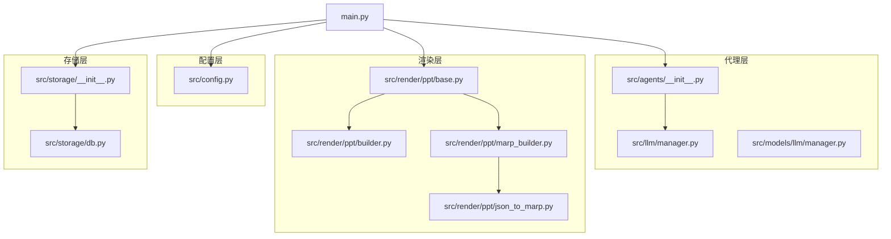
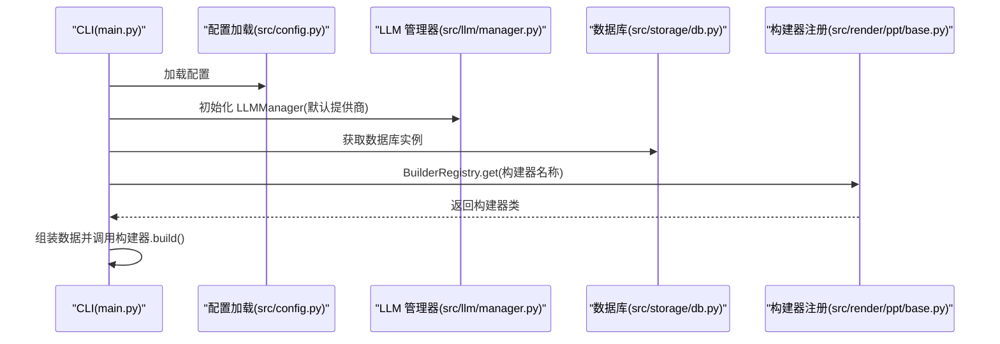
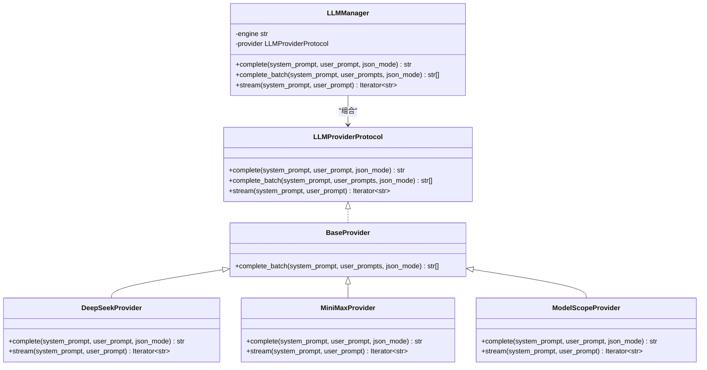
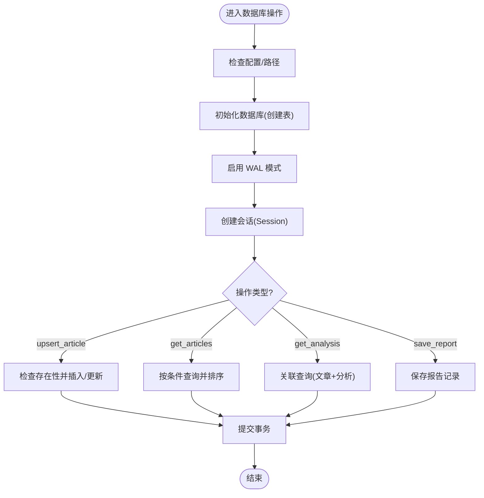
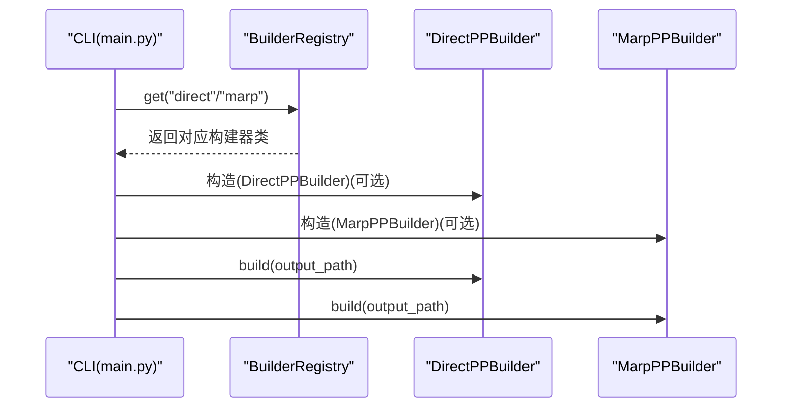
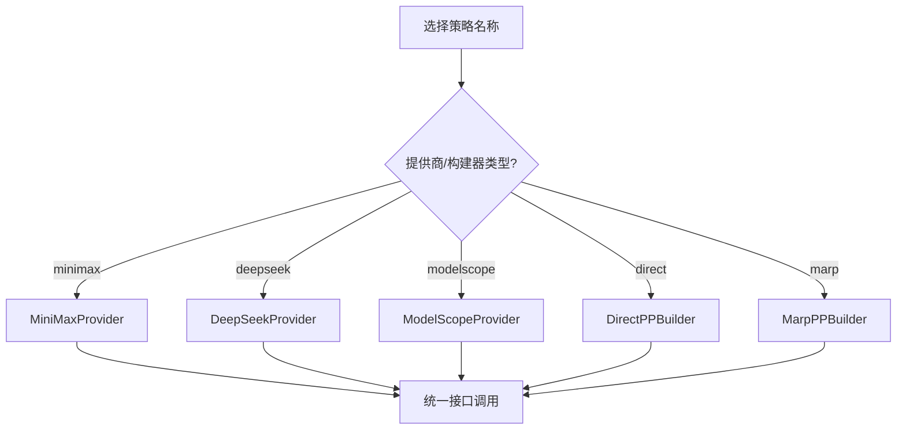
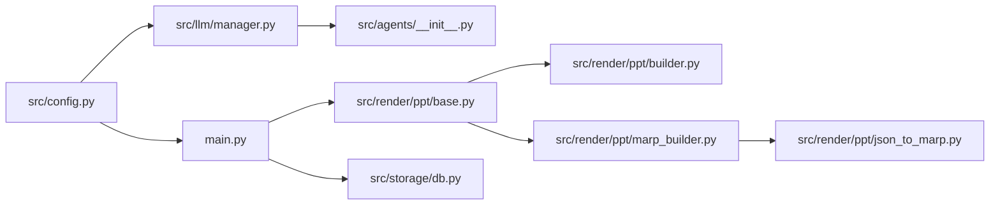

# 设计模式应用

<cite>
**本文档引用的文件**
- [src/llm/manager.py](file://src/llm/manager.py)
- [src/models/llm/manager.py](file://src/models/llm/manager.py)
- [src/render/ppt/base.py](file://src/render/ppt/base.py)
- [src/render/ppt/builder.py](file://src/render/ppt/builder.py)
- [src/render/ppt/marp_builder.py](file://src/render/ppt/marp_builder.py)
- [src/render/ppt/json_to_marp.py](file://src/render/ppt/json_to_marp.py)
- [src/storage/db.py](file://src/storage/db.py)
- [src/agents/__init__.py](file://src/agents/__init__.py)
- [src/config.py](file://src/config.py)
- [src/storage/__init__.py](file://src/storage/__init__.py)
- [main.py](file://main.py)
</cite>

## 目录
1. [简介](#简介)
2. [项目结构](#项目结构)
3. [核心组件](#核心组件)
4. [架构总览](#架构总览)
5. [详细组件分析](#详细组件分析)
6. [依赖关系分析](#依赖关系分析)
7. [性能考量](#性能考量)
8. [故障排查指南](#故障排查指南)
9. [结论](#结论)

## 简介
本文件系统性梳理 Brief Agent 项目中应用的设计模式，重点覆盖 Provider 模式（LLM Provider 接口抽象与多提供商切换）、Repository 模式（数据库访问层统一抽象）、工厂模式（Agent 工作流与构建器注册）、策略模式（不同 LLM 提供商与 PPT 构建器）。文档以“模式识别—实现映射—流程图解—最佳实践”的方式呈现，帮助读者快速理解代码结构与扩展点。

## 项目结构
Brief Agent 采用分层清晰的模块组织：
- 配置层：集中于配置加载与环境变量替换
- 代理层：封装 LLM 管理器与 Agent 工作流
- 渲染层：PPT 构建器抽象与注册机制
- 存储层：SQLite 访问与 ORM 模型
- CLI 入口：命令行入口与工作流编排

图表来源
- [src/config.py](file://src/config.py#L74-L109)
- [src/agents/__init__.py](file://src/agents/__init__.py#L9-L15)
- [src/llm/manager.py](file://src/llm/manager.py#L206-L318)
- [src/models/llm/manager.py](file://src/models/llm/manager.py#L206-L318)
- [src/render/ppt/base.py](file://src/render/ppt/base.py#L1-L42)
- [src/render/ppt/builder.py](file://src/render/ppt/builder.py#L1-L194)
- [src/render/ppt/marp_builder.py](file://src/render/ppt/marp_builder.py#L1-L94)
- [src/render/ppt/json_to_marp.py](file://src/render/ppt/json_to_marp.py#L1-L139)
- [src/storage/db.py](file://src/storage/db.py#L65-L251)
- [src/storage/__init__.py](file://src/storage/__init__.py#L8-L14)
- [main.py](file://main.py#L143-L189)

章节来源
- [main.py](file://main.py#L1-L227)
- [src/config.py](file://src/config.py#L1-L109)
- [src/storage/db.py](file://src/storage/db.py#L1-L251)

## 核心组件
- LLM Provider 抽象与多提供商切换：通过协议与基类统一接口，结合管理器按配置选择具体提供商
- PPT 构建器抽象与注册：通过抽象基类与注册表实现构建器的动态选择
- 数据库访问层：统一的 Database 类封装 CRUD 与会话管理
- Agent 工作流：通过全局 LLM 管理器与工作流编排实现任务执行

章节来源
- [src/llm/manager.py](file://src/llm/manager.py#L24-L318)
- [src/models/llm/manager.py](file://src/models/llm/manager.py#L24-L318)
- [src/render/ppt/base.py](file://src/render/ppt/base.py#L7-L42)
- [src/storage/db.py](file://src/storage/db.py#L65-L251)
- [src/agents/__init__.py](file://src/agents/__init__.py#L9-L15)

## 架构总览
Brief Agent 的核心是“配置驱动 + 抽象统一 + 动态选择”的架构。配置文件决定默认提供商与参数；抽象层屏蔽差异；运行时通过注册表或管理器进行选择与调用。

图表来源
- [main.py](file://main.py#L143-L189)
- [src/config.py](file://src/config.py#L74-L109)
- [src/llm/manager.py](file://src/llm/manager.py#L243-L318)
- [src/storage/db.py](file://src/storage/db.py#L65-L94)
- [src/render/ppt/base.py](file://src/render/ppt/base.py#L31-L42)

## 详细组件分析

### Provider 模式：LLM Provider 接口抽象与多提供商切换
- 协议与基类
  - 协议定义统一接口：complete、complete_batch、stream
  - 基类提供批量推理的统一实现，减少重复代码
- 具体提供商
  - DeepSeekProvider、MiniMaxProvider、ModelScopeProvider 分别封装不同 SDK/HTTP 请求
- 管理器选择
  - LLMManager 根据配置或环境变量选择具体提供商，并对外暴露一致接口

图表来源
- [src/llm/manager.py](file://src/llm/manager.py#L24-L318)
- [src/models/llm/manager.py](file://src/models/llm/manager.py#L24-L318)

最佳实践
- 使用协议约束接口，确保不同提供商可互换
- 批量处理统一由基类实现，避免重复逻辑
- 管理器优先读取配置，回退到环境变量，增强部署灵活性

章节来源
- [src/llm/manager.py](file://src/llm/manager.py#L24-L318)
- [src/models/llm/manager.py](file://src/models/llm/manager.py#L24-L318)

### Repository 模式：数据库访问层统一抽象
- 抽象与封装
  - Database 类封装引擎创建、WAL 模式启用、会话管理
  - 提供 upsert、查询、关联查询等方法，隐藏 SQLModel 细节
- 模型定义
  - Article、ArticleAnalysis、FeedConfig、Report 等模型定义表结构与字段约束
- 会话与并发
  - 通过 Session 管理会话生命周期，支持超时与线程安全设置

图表来源
- [src/storage/db.py](file://src/storage/db.py#L65-L251)

最佳实践
- 将数据库初始化与模式配置集中在构造阶段，保证幂等
- 使用会话封装事务，避免跨函数状态泄漏
- 查询条件与排序在方法内集中处理，便于维护

章节来源
- [src/storage/db.py](file://src/storage/db.py#L65-L251)
- [src/storage/__init__.py](file://src/storage/__init__.py#L8-L14)

### 工厂模式：Agent 工作流与构建器注册
- 构建器注册表
  - BuilderRegistry 维护名称到构建器类的映射，提供注册与获取能力
- 构建器实现
  - DirectPPBuilder：基于 python-pptx 直接渲染
  - MarpPPBuilder：JSON → Marp Markdown → PPT，依赖外部 CLI
- Agent 工作流
  - 全局 LLM 管理器通过 get_llm() 提供单例，简化调用

图表来源
- [src/render/ppt/base.py](file://src/render/ppt/base.py#L16-L42)
- [src/render/ppt/builder.py](file://src/render/ppt/builder.py#L22-L194)
- [src/render/ppt/marp_builder.py](file://src/render/ppt/marp_builder.py#L21-L94)
- [main.py](file://main.py#L143-L189)

最佳实践
- 使用装饰器注册构建器，避免硬编码映射
- 构建器内部职责单一：负责将数据渲染为 PPT
- CLI 仅负责编排与参数传递，降低耦合

章节来源
- [src/render/ppt/base.py](file://src/render/ppt/base.py#L16-L42)
- [src/render/ppt/builder.py](file://src/render/ppt/builder.py#L22-L194)
- [src/render/ppt/marp_builder.py](file://src/render/ppt/marp_builder.py#L21-L94)
- [src/agents/__init__.py](file://src/agents/__init__.py#L9-L15)

### 策略模式：不同 LLM 提供商与 PPT 构建器
- LLM 提供商策略
  - 通过 LLMManager 在运行时选择不同提供商，实现算法替换
- PPT 构建器策略
  - 通过 BuilderRegistry 选择不同的渲染策略（直接渲染 vs Marp）

图表来源
- [src/llm/manager.py](file://src/llm/manager.py#L253-L295)
- [src/render/ppt/base.py](file://src/render/ppt/base.py#L31-L36)

最佳实践
- 将“如何选择策略”与“如何执行策略”分离，便于扩展新提供商或构建器
- 保持策略对象的无状态或最小状态，避免副作用影响

章节来源
- [src/llm/manager.py](file://src/llm/manager.py#L253-L295)
- [src/render/ppt/base.py](file://src/render/ppt/base.py#L31-L36)

## 依赖关系分析
- 配置依赖：配置模块被多个模块依赖，形成中心化配置源
- 代理依赖：CLI 与 Agent 依赖 LLM 管理器；PPT 构建器依赖 LLM 管理器
- 存储依赖：存储模块被 RSS 服务与 Agent 使用
- 渲染依赖：PPT 构建器依赖抽象基类与注册表

图表来源
- [src/config.py](file://src/config.py#L74-L109)
- [src/llm/manager.py](file://src/llm/manager.py#L243-L318)
- [src/agents/__init__.py](file://src/agents/__init__.py#L9-L15)
- [src/render/ppt/base.py](file://src/render/ppt/base.py#L1-L42)
- [src/render/ppt/builder.py](file://src/render/ppt/builder.py#L1-L194)
- [src/render/ppt/marp_builder.py](file://src/render/ppt/marp_builder.py#L1-L94)
- [src/render/ppt/json_to_marp.py](file://src/render/ppt/json_to_marp.py#L1-L139)
- [src/storage/db.py](file://src/storage/db.py#L65-L251)
- [main.py](file://main.py#L143-L189)

章节来源
- [src/config.py](file://src/config.py#L74-L109)
- [src/llm/manager.py](file://src/llm/manager.py#L243-L318)
- [src/render/ppt/base.py](file://src/render/ppt/base.py#L1-L42)
- [src/storage/db.py](file://src/storage/db.py#L65-L251)
- [main.py](file://main.py#L143-L189)

## 性能考量
- Provider 批量处理：BaseProvider 使用线程池并发调用，提高吞吐
- 数据库并发：启用 WAL 模式与超时配置，提升并发读写稳定性
- 构建器选择：Direct 方案无需外部 CLI，Marp 方案依赖外部工具，需考虑可用性与失败回退

章节来源
- [src/llm/manager.py](file://src/llm/manager.py#L48-L62)
- [src/models/llm/manager.py](file://src/models/llm/manager.py#L48-L62)
- [src/storage/db.py](file://src/storage/db.py#L84-L90)

## 故障排查指南
- LLM Provider 初始化失败
  - 检查配置文件与环境变量是否正确
  - 管理器会回退到环境变量，确认相关变量已设置
- PPT 构建失败
  - Marp 构建器需要安装 CLI，若未安装会记录警告并跳过渲染
  - Direct 构建器依赖 python-pptx，确认依赖已安装
- 数据库异常
  - 检查数据库路径权限与 WAL 模式启用情况
  - 确认表结构已初始化

章节来源
- [src/llm/manager.py](file://src/llm/manager.py#L276-L295)
- [src/render/ppt/marp_builder.py](file://src/render/ppt/marp_builder.py#L37-L57)
- [src/storage/db.py](file://src/storage/db.py#L84-L90)

## 结论
Brief Agent 通过 Provider、Repository、工厂与策略等设计模式，实现了“可插拔的提供商、统一的数据访问、灵活的构建器选择与稳定的执行流程”。这些模式共同提升了系统的可扩展性、可维护性与可测试性。建议在新增提供商或构建器时遵循现有抽象与注册机制，确保一致的扩展体验。