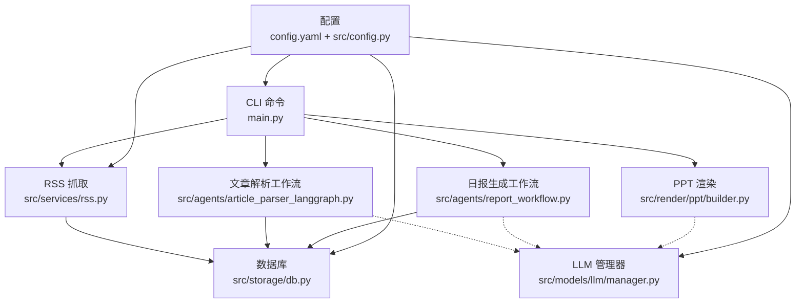
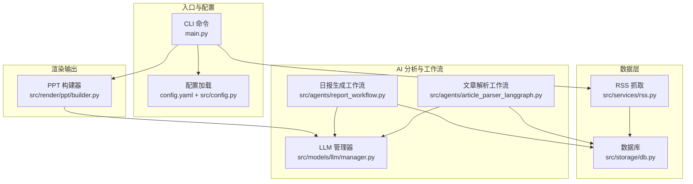
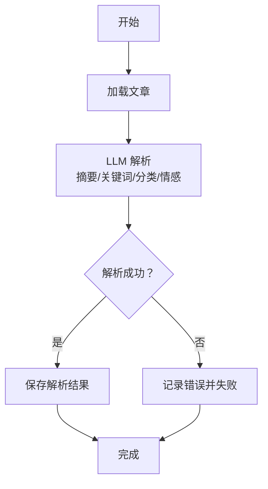
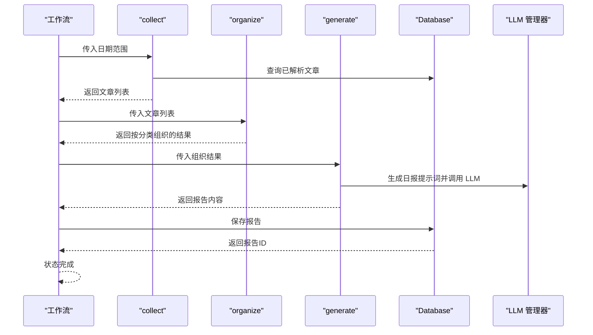
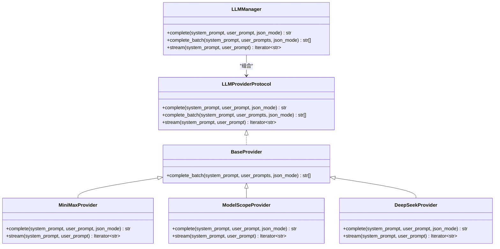
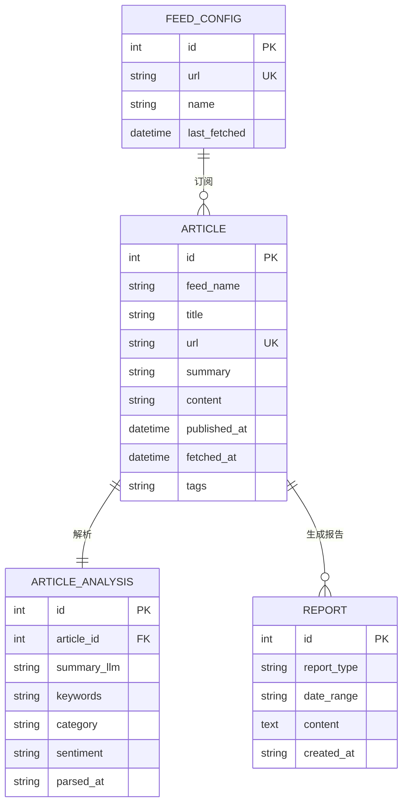
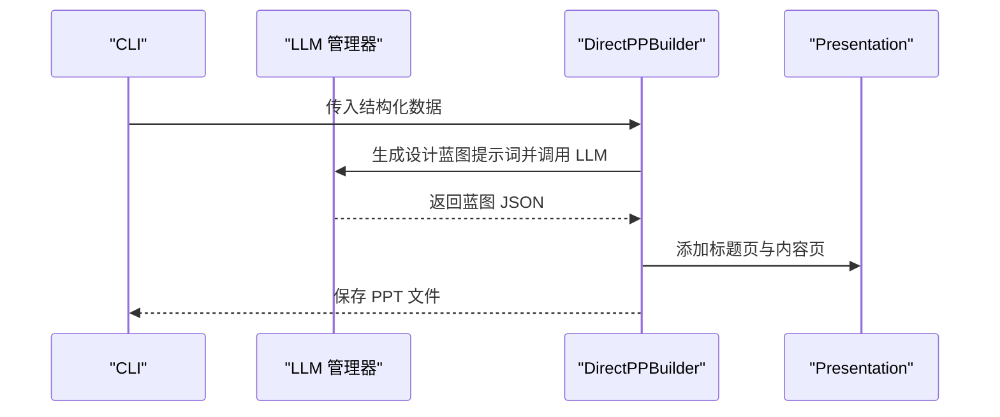
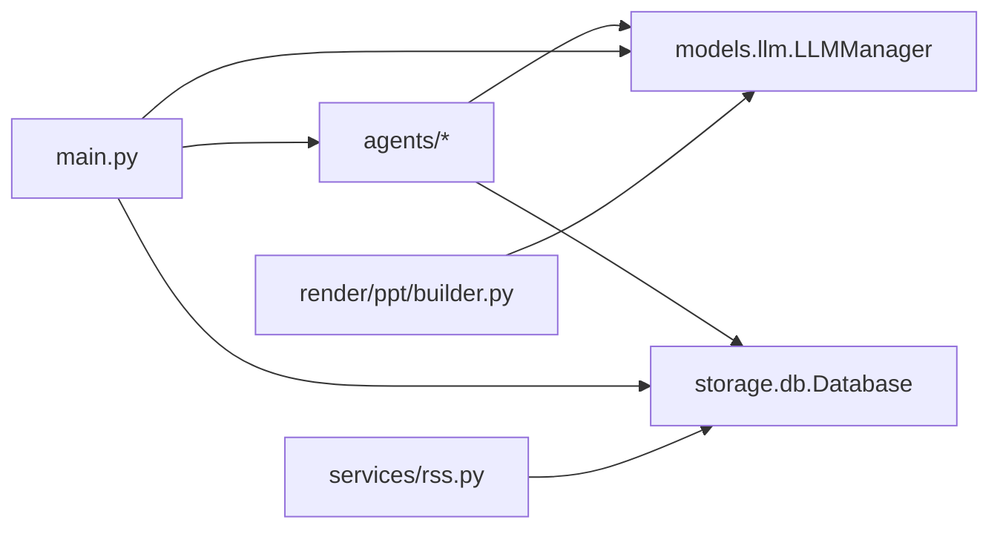

# AI 智能分析系统

<cite>
**本文档引用的文件**
- [README.md](file://README.md)
- [main.py](file://main.py)
- [config.yaml](file://config.yaml)
- [src/config.py](file://src/config.py)
- [src/agents/article_parser_langgraph.py](file://src/agents/article_parser_langgraph.py)
- [src/agents/report_workflow.py](file://src/agents/report_workflow.py)
- [src/agents/__init__.py](file://src/agents/__init__.py)
- [src/llm/manager.py](file://src/llm/manager.py)
- [src/models/llm/manager.py](file://src/models/llm/manager.py)
- [src/services/rss.py](file://src/services/rss.py)
- [src/storage/db.py](file://src/storage/db.py)
- [src/render/ppt/builder.py](file://src/render/ppt/builder.py)
</cite>

## 目录
1. [简介](#简介)
2. [项目结构](#项目结构)
3. [核心组件](#核心组件)
4. [架构总览](#架构总览)
5. [详细组件分析](#详细组件分析)
6. [依赖关系分析](#依赖关系分析)
7. [性能考量](#性能考量)
8. [故障排查指南](#故障排查指南)
9. [结论](#结论)
10. [附录](#附录)

## 简介
本项目是一个基于 LangGraph 的企业级多模态内容智能分析与自动生成平台，围绕“RSS 内容采集—文章解析—报告生成—PPT 渲染”的完整链路展开。系统采用状态机模式的 LangGraph 工作流，结合多提供商 LLM 管理器，实现关键词提取、情感分析、主题分类与摘要生成等 AI 分析能力，并提供 CLI 命令入口与 PPT 输出能力。

## 项目结构
项目采用分层与功能域划分相结合的组织方式：
- CLI 入口与命令：main.py 提供 fetch、parse、report、serve 等命令
- 配置管理：config.yaml + src/config.py 提供类型安全的配置加载
- 数据采集：src/services/rss.py 负责 RSS 抓取与入库
- 数据存储：src/storage/db.py 基于 SQLModel 的 SQLite 管理
- AI 分析与工作流：src/agents 下的 LangGraph 工作流（文章解析、报告生成）
- LLM 管理：src/models/llm/manager.py 提供统一的多提供商 LLM 抽象与批量/流式能力
- 渲染输出：src/render/ppt/ 提供 PPT 构建器

图表来源
- [main.py](file://main.py#L1-L227)
- [src/services/rss.py](file://src/services/rss.py#L1-L123)
- [src/storage/db.py](file://src/storage/db.py#L1-L251)
- [src/agents/article_parser_langgraph.py](file://src/agents/article_parser_langgraph.py#L1-L241)
- [src/agents/report_workflow.py](file://src/agents/report_workflow.py#L1-L266)
- [src/models/llm/manager.py](file://src/models/llm/manager.py#L1-L318)
- [src/render/ppt/builder.py](file://src/render/ppt/builder.py#L1-L194)
- [config.yaml](file://config.yaml#L1-L54)
- [src/config.py](file://src/config.py#L1-L109)

章节来源
- [README.md](file://README.md#L87-L148)
- [main.py](file://main.py#L1-L227)
- [config.yaml](file://config.yaml#L1-L54)
- [src/config.py](file://src/config.py#L1-L109)

## 核心组件
- LangGraph 工作流：以状态机为核心，节点间通过状态传递实现端到端的数据处理
- 多提供商 LLM 管理器：统一抽象不同 LLM 提供商的接口，支持单次推理、批量推理与流式生成
- 数据采集与存储：RSS 抓取、去重入库、结构化查询与报告持久化
- 渲染输出：将结构化结果转为 PPT 并输出

章节来源
- [src/agents/article_parser_langgraph.py](file://src/agents/article_parser_langgraph.py#L1-L241)
- [src/agents/report_workflow.py](file://src/agents/report_workflow.py#L1-L266)
- [src/models/llm/manager.py](file://src/models/llm/manager.py#L1-L318)
- [src/services/rss.py](file://src/services/rss.py#L1-L123)
- [src/storage/db.py](file://src/storage/db.py#L1-L251)
- [src/render/ppt/builder.py](file://src/render/ppt/builder.py#L1-L194)

## 架构总览
系统以 CLI 为入口，通过 RSS 抓取与数据库存储形成数据基础；文章解析与报告生成两条 LangGraph 工作流分别完成 AI 分析与内容组织；LLM 管理器贯穿其中，提供统一的推理能力；最终通过 PPT 构建器输出可视化内容。

图表来源
- [main.py](file://main.py#L1-L227)
- [src/services/rss.py](file://src/services/rss.py#L1-L123)
- [src/storage/db.py](file://src/storage/db.py#L1-L251)
- [src/agents/article_parser_langgraph.py](file://src/agents/article_parser_langgraph.py#L1-L241)
- [src/agents/report_workflow.py](file://src/agents/report_workflow.py#L1-L266)
- [src/models/llm/manager.py](file://src/models/llm/manager.py#L1-L318)
- [src/render/ppt/builder.py](file://src/render/ppt/builder.py#L1-L194)
- [config.yaml](file://config.yaml#L1-L54)
- [src/config.py](file://src/config.py#L1-L109)

## 详细组件分析

### LangGraph 文章解析 Agent（状态机与节点连接）
- 状态定义：ArticleState 包含文章标识、原始内容、LLM 结果字段与状态标志
- 节点职责：
  - load：从数据库加载文章
  - parse：一次 LLM 调用完成摘要、关键词、分类、情感的抽取与结构化输出
  - save：将解析结果写入 article_analysis 表
- 控制流：START → load → parse → save → END，状态在节点间传递
- 并发：支持 batch 并发执行多个文章解析

图表来源
- [src/agents/article_parser_langgraph.py](file://src/agents/article_parser_langgraph.py#L66-L151)

章节来源
- [src/agents/article_parser_langgraph.py](file://src/agents/article_parser_langgraph.py#L24-L181)

### LangGraph 日报生成工作流（组织与生成）
- 状态定义：DailyReportState 包含日期范围、文章集合、分类组织、报告内容、状态与错误
- 节点职责：
  - collect：按日期范围从数据库获取已解析文章
  - organize：按分类组织文章并排序
  - generate：构造提示词，调用 LLM 生成结构化日报
  - save：将报告保存至 reports 表
- 控制流：START → collect → organize → generate → save → END

图表来源
- [src/agents/report_workflow.py](file://src/agents/report_workflow.py#L46-L181)

章节来源
- [src/agents/report_workflow.py](file://src/agents/report_workflow.py#L25-L213)

### 多提供商 LLM 管理器（Provider 抽象、批量推理、流式生成）
- 接口设计：LLMProviderProtocol 定义 complete、complete_batch、stream 三类能力
- Provider 抽象：BaseProvider 提供统一的批量推理实现；各提供商（MiniMax、ModelScope、DeepSeek）实现具体调用
- 管理器：LLMManager 负责根据配置选择 Provider，并暴露统一的 complete、batch、stream 接口
- 配置来源：config.yaml 中的 llm.default 与 providers 字段

图表来源
- [src/models/llm/manager.py](file://src/models/llm/manager.py#L24-L317)

章节来源
- [src/models/llm/manager.py](file://src/models/llm/manager.py#L206-L317)
- [src/llm/manager.py](file://src/llm/manager.py#L206-L317)
- [src/agents/__init__.py](file://src/agents/__init__.py#L8-L14)

### 数据采集与存储（RSS 抓取、数据库模型与查询）
- RSS 抓取：解析 RSS/Atom，清洗 HTML，去重入库，支持超时与错误处理
- 数据库模型：Article、ArticleAnalysis、FeedConfig、Report
- 查询与更新：upsert_article、get_articles_by_date、get_unparsed_articles、save_analysis、save_report 等

图表来源
- [src/storage/db.py](file://src/storage/db.py#L14-L61)

章节来源
- [src/services/rss.py](file://src/services/rss.py#L15-L108)
- [src/storage/db.py](file://src/storage/db.py#L65-L251)

### 渲染输出（PPT 构建器）
- 直接渲染构建器：基于固定布局与占位符，将标题、要点、备注写入 PPT
- LLM 协助：通过提示词将旁白转换为设计蓝图，再由构建器渲染图片与文本元素

图表来源
- [src/render/ppt/builder.py](file://src/render/ppt/builder.py#L128-L151)

章节来源
- [src/render/ppt/builder.py](file://src/render/ppt/builder.py#L22-L194)

## 依赖关系分析
- 组件耦合：
  - agents 与 models.llm：通过 get_llm 获取 LLMManager 实例
  - agents 与 storage：通过 get_db 获取 Database 实例
  - main.py 与 agents：调用 parse_batch 与 generate_daily_report
- 外部依赖：
  - LangGraph：工作流编译与执行
  - SQLModel：ORM 映射与事务
  - feedparser/httpx：RSS 抓取
  - requests/OpenAI SDK：LLM 提供商调用

图表来源
- [src/agents/article_parser_langgraph.py](file://src/agents/article_parser_langgraph.py#L50-L61)
- [src/agents/report_workflow.py](file://src/agents/report_workflow.py#L40-L43)
- [src/agents/__init__.py](file://src/agents/__init__.py#L8-L14)
- [src/services/rss.py](file://src/services/rss.py#L18-L20)
- [src/storage/db.py](file://src/storage/db.py#L65-L78)
- [src/render/ppt/builder.py](file://src/render/ppt/builder.py#L16-L17)
- [main.py](file://main.py#L18-L20)

章节来源
- [src/agents/article_parser_langgraph.py](file://src/agents/article_parser_langgraph.py#L1-L241)
- [src/agents/report_workflow.py](file://src/agents/report_workflow.py#L1-L266)
- [src/render/ppt/builder.py](file://src/render/ppt/builder.py#L1-L194)
- [main.py](file://main.py#L1-L227)

## 性能考量
- 批量推理：LLMManager 的 BaseProvider.complete_batch 使用线程池并发调用，适合高吞吐场景
- 数据库并发：SQLite 启用 WAL 模式与超时设置，提升并发读写稳定性
- LLM 调用优化：
  - 控制输入长度（文章内容截断），减少 token 消耗
  - JSON 模式输出（json_mode）降低后处理成本
  - 流式生成用于实时反馈（部分提供商支持）
- 工作流并发：LangGraph 支持 batch 并发执行多个文章解析，提高吞吐

章节来源
- [src/models/llm/manager.py](file://src/models/llm/manager.py#L48-L62)
- [src/storage/db.py](file://src/storage/db.py#L72-L89)
- [src/agents/article_parser_langgraph.py](file://src/agents/article_parser_langgraph.py#L88-L101)

## 故障排查指南
- LLM 配置错误：
  - 检查 config.yaml 中 llm.providers 的 api_key、base_url、model 是否正确
  - 确认环境变量是否与配置一致
- RSS 抓取失败：
  - 检查网络连通性与 RSS 源可用性，查看日志中的 HTTP 错误
  - 调整 timeout 参数
- 数据库锁与并发：
  - 确保 WAL 模式已启用，避免长时间阻塞
  - 避免同时进行大量写入与复杂查询
- JSON 解析失败：
  - 文章解析与报告生成中均包含 JSON 清洗与降级逻辑，若 LLM 输出非标准 JSON，系统会记录警告并尝试清理
- PPT 渲染异常：
  - 确认 python-pptx 安装与版本兼容
  - 检查输出路径权限与磁盘空间

章节来源
- [src/models/llm/manager.py](file://src/models/llm/manager.py#L276-L295)
- [src/services/rss.py](file://src/services/rss.py#L37-L48)
- [src/storage/db.py](file://src/storage/db.py#L84-L89)
- [src/agents/article_parser_langgraph.py](file://src/agents/article_parser_langgraph.py#L126-L131)
- [src/agents/report_workflow.py](file://src/agents/report_workflow.py#L154-L156)
- [src/render/ppt/builder.py](file://src/render/ppt/builder.py#L79-L83)

## 结论
本系统通过 LangGraph 的状态机模式实现了清晰、可扩展的 AI 分析与内容生成链路，结合多提供商 LLM 管理器与完善的数据库与渲染模块，形成了从数据采集到可视化输出的闭环。其模块化设计便于维护与扩展，适合在企业环境中进行持续演进与规模化部署。

## 附录

### 使用示例与最佳实践
- CLI 使用
  - 抓取 RSS：uv run python main.py fetch
  - 解析文章：uv run python main.py parse --limit N
  - 生成日报：uv run python main.py report YYYY-MM-DD [--output] [--ppt --builder direct|marp]
- 提示词工程
  - 文章解析：限定输出格式为 JSON，明确字段含义与长度约束
  - 日报生成：提供结构化模板与字数要求，确保输出可读性
- 参数调优
  - 控制输入长度（content preview 截断）
  - 启用 JSON 模式输出，减少后处理成本
  - 合理设置并发度（batch 与线程池大小）
- 性能优化
  - 使用 WAL 模式与超时设置
  - 批量推理与并发工作流
  - 适当缓存与降级策略（JSON 解析失败时的降级）

章节来源
- [README.md](file://README.md#L78-L85)
- [main.py](file://main.py#L66-L140)
- [src/agents/article_parser_langgraph.py](file://src/agents/article_parser_langgraph.py#L88-L101)
- [src/agents/report_workflow.py](file://src/agents/report_workflow.py#L119-L150)
- [src/models/llm/manager.py](file://src/models/llm/manager.py#L48-L62)
- [src/storage/db.py](file://src/storage/db.py#L72-L89)