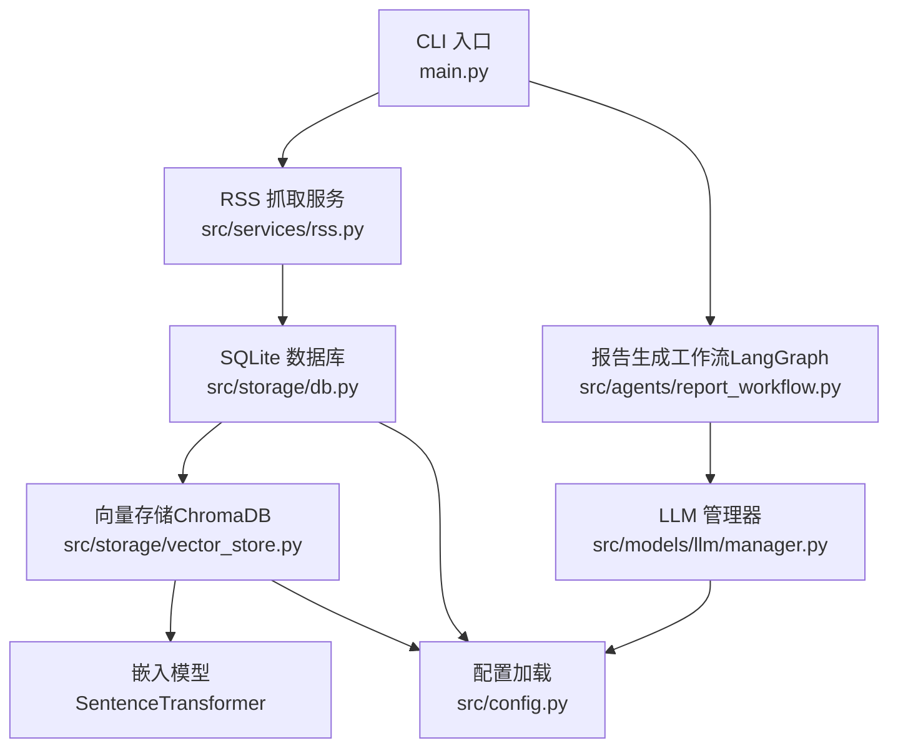
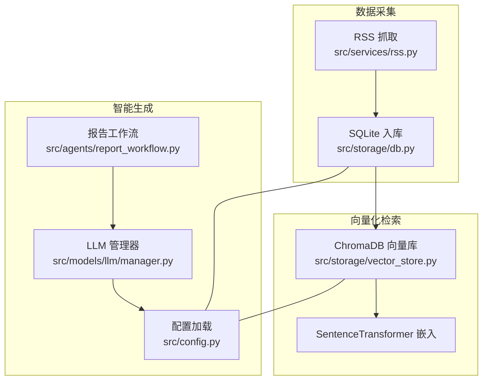
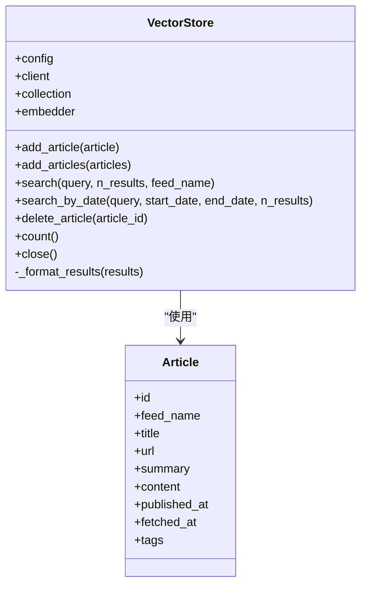
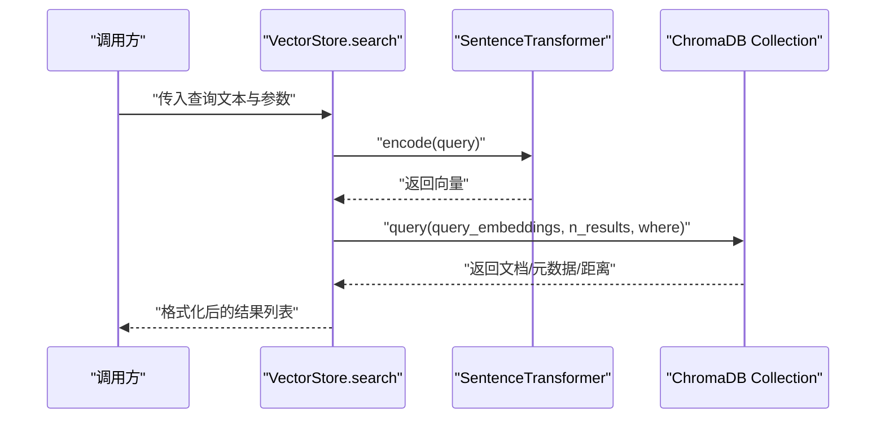
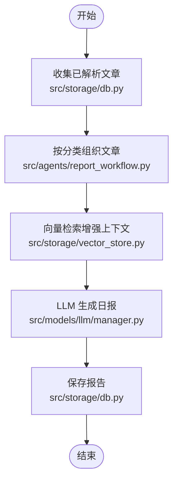
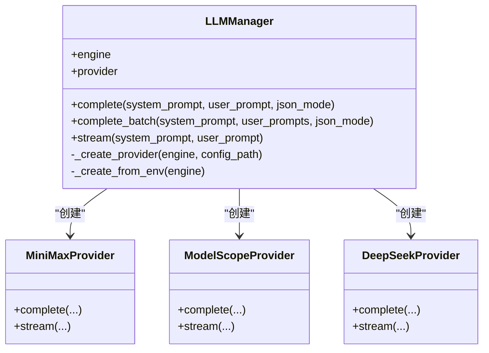
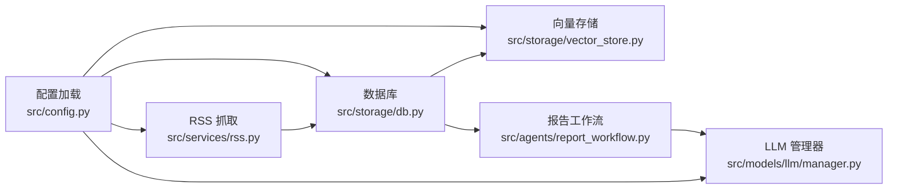

# RAG 向量化检索系统

<cite>
**本文档引用的文件**
- [README.md](file://README.md)
- [config.yaml](file://config.yaml)
- [src/config.py](file://src/config.py)
- [src/storage/vector_store.py](file://src/storage/vector_store.py)
- [src/storage/db.py](file://src/storage/db.py)
- [src/storage/__init__.py](file://src/storage/__init__.py)
- [src/services/rss.py](file://src/services/rss.py)
- [src/models/llm/manager.py](file://src/models/llm/manager.py)
- [src/llm/manager.py](file://src/llm/manager.py)
- [src/agents/report_workflow.py](file://src/agents/report_workflow.py)
- [src/agents/__init__.py](file://src/agents/__init__.py)
- [main.py](file://main.py)
</cite>

## 目录
1. [简介](#简介)
2. [项目结构](#项目结构)
3. [核心组件](#核心组件)
4. [架构总览](#架构总览)
5. [详细组件分析](#详细组件分析)
6. [依赖关系分析](#依赖关系分析)
7. [性能考量](#性能考量)
8. [故障排查指南](#故障排查指南)
9. [结论](#结论)
10. [附录](#附录)

## 简介
本项目是一个基于 LangGraph 的多模态内容自动生成与分发平台，其中包含“RAG 向量化检索”能力，用于对 RSS 文章进行语义检索与知识增强。系统通过 ChromaDB 作为向量数据库，SentenceTransformer 生成文本嵌入，结合 SQLite 数据库存储原始与解析结果，形成“结构化数据 + 向量检索”的混合知识体系。同时，系统支持多种 LLM 提供商（MiniMax、ModelScope、DeepSeek），并通过统一的 LLM 管理器实现模型切换与调用。

## 项目结构
项目采用模块化分层设计，围绕“配置加载、数据存储、服务抓取、智能工作流、渲染输出”展开。与 RAG 相关的关键模块包括：
- 配置层：加载 YAML 配置与环境变量，统一模型与数据库、向量库参数
- 存储层：SQLite ORM 模型与操作；ChromaDB 向量存储与嵌入编码
- 服务层：RSS 抓取与入库
- 智能层：LLM 管理器与报告生成工作流
- CLI 入口：提供 fetch、parse、report 等命令

图表来源
- [main.py](file://main.py#L66-L141)
- [src/services/rss.py](file://src/services/rss.py#L15-L61)
- [src/storage/db.py](file://src/storage/db.py#L65-L94)
- [src/storage/vector_store.py](file://src/storage/vector_store.py#L15-L35)
- [src/agents/report_workflow.py](file://src/agents/report_workflow.py#L186-L201)
- [src/models/llm/manager.py](file://src/models/llm/manager.py#L206-L318)
- [src/config.py](file://src/config.py#L65-L88)

章节来源
- [README.md](file://README.md#L87-L148)
- [config.yaml](file://config.yaml#L1-L54)
- [src/config.py](file://src/config.py#L65-L109)

## 核心组件
- 配置系统：集中管理 LLM、RSS、数据库、向量库、日志与调度等配置，支持环境变量占位符替换
- SQLite 数据库：ORM 模型定义与常用 CRUD 操作，启用 WAL 模式以提升并发性能
- ChromaDB 向量库：持久化客户端、集合创建、嵌入编码、增删改查与结果格式化
- RSS 抓取服务：HTTP 客户端抓取、HTML 清洗、批量入库
- LLM 管理器：统一接口封装多家 LLM 提供商，支持同步/批量/流式调用
- 报告生成工作流：LangGraph 工作流，从数据库收集已解析文章，组织分类，调用 LLM 生成结构化日报

章节来源
- [src/config.py](file://src/config.py#L14-L109)
- [src/storage/db.py](file://src/storage/db.py#L65-L251)
- [src/storage/vector_store.py](file://src/storage/vector_store.py#L15-L142)
- [src/services/rss.py](file://src/services/rss.py#L15-L123)
- [src/models/llm/manager.py](file://src/models/llm/manager.py#L206-L318)
- [src/agents/report_workflow.py](file://src/agents/report_workflow.py#L25-L201)

## 架构总览
系统以“结构化数据 + 向量检索”双通道协同工作：
- 结构化数据：RSS 原文与解析结果存于 SQLite，便于精确过滤与统计
- 向量检索：文章标题+摘要经嵌入编码后存入 ChromaDB，支持语义相似度检索
- 智能增强：工作流在生成日报时，可结合向量检索结果进行上下文增强与引用标注

图表来源
- [src/services/rss.py](file://src/services/rss.py#L22-L61)
- [src/storage/db.py](file://src/storage/db.py#L97-L123)
- [src/storage/vector_store.py](file://src/storage/vector_store.py#L36-L78)
- [src/agents/report_workflow.py](file://src/agents/report_workflow.py#L95-L161)
- [src/models/llm/manager.py](file://src/models/llm/manager.py#L243-L251)
- [src/config.py](file://src/config.py#L74-L88)

## 详细组件分析

### 向量数据库与嵌入模型（ChromaDB + SentenceTransformer）
- ChromaDB 客户端采用持久化模式，集合名称可配置，元数据包含描述信息
- 嵌入模型固定为“all-MiniLM-L6-v2”，输入为“标题 + 空行 + 摘要”
- 支持单条/批量添加文章，支持按 feed_name 与日期范围过滤的语义检索
- 结果包含文档、元数据与距离，便于后续排序与引用

图表来源
- [src/storage/vector_store.py](file://src/storage/vector_store.py#L15-L142)
- [src/storage/db.py](file://src/storage/db.py#L14-L27)

章节来源
- [src/storage/vector_store.py](file://src/storage/vector_store.py#L18-L96)
- [src/storage/vector_store.py](file://src/storage/vector_store.py#L98-L137)

### 语义搜索流程（文本嵌入、相似度计算与排序）
- 输入查询文本经嵌入模型编码为向量
- ChromaDB 查询时可附加 where 条件（如 feed_name、published_at 范围）
- 返回结果包含文档、元数据与距离，距离越小表示越相似
- 可在上层逻辑中按距离阈值过滤与排序

图表来源
- [src/storage/vector_store.py](file://src/storage/vector_store.py#L80-L96)
- [src/storage/vector_store.py](file://src/storage/vector_store.py#L104-L115)

章节来源
- [src/storage/vector_store.py](file://src/storage/vector_store.py#L80-L115)

### RAG 流程在 AI 分析中的应用
- 上下文增强：在生成日报前，可先对用户问题或主题进行向量检索，将相关文章摘要拼接为上下文
- 答案生成：将上下文与提示词组合，交由 LLM 生成结构化内容
- 引用标注：利用元数据中的标题、URL、发布源等信息，为生成内容添加来源标注
- 工作流整合：LangGraph 工作流负责从数据库收集已解析文章，按类别组织，再调用 LLM 生成最终报告

图表来源
- [src/agents/report_workflow.py](file://src/agents/report_workflow.py#L46-L161)
- [src/storage/db.py](file://src/storage/db.py#L147-L165)
- [src/storage/vector_store.py](file://src/storage/vector_store.py#L80-L96)
- [src/models/llm/manager.py](file://src/models/llm/manager.py#L297-L317)

章节来源
- [src/agents/report_workflow.py](file://src/agents/report_workflow.py#L95-L161)
- [src/storage/db.py](file://src/storage/db.py#L147-L165)

### 嵌入模型适配与提供商切换
- LLM 管理器支持 MiniMax、ModelScope、DeepSeek 三家提供商，统一接口 complete、complete_batch、stream
- 可通过配置文件选择默认提供商，或在运行时按需切换
- 与向量检索的嵌入模型相互独立：向量检索使用 SentenceTransformer，LLM 使用 OpenAI 兼容接口或 HTTP 请求

图表来源
- [src/models/llm/manager.py](file://src/models/llm/manager.py#L206-L318)
- [src/llm/manager.py](file://src/llm/manager.py#L206-L318)

章节来源
- [src/models/llm/manager.py](file://src/models/llm/manager.py#L243-L295)
- [src/llm/manager.py](file://src/llm/manager.py#L243-L295)

### 与传统数据库的协同与一致性
- SQLite 作为主数据存储，ORM 模型定义清晰，支持 upsert、分页、条件查询与 JOIN
- 启用 WAL 模式与超时设置，提升并发读写稳定性
- 向量库与关系库通过文章 ID 关联，既可做精确过滤，也可做语义召回
- 删除文章时建议同时清理向量库对应记录，避免悬挂数据

章节来源
- [src/storage/db.py](file://src/storage/db.py#L68-L90)
- [src/storage/db.py](file://src/storage/db.py#L97-L123)
- [src/storage/vector_store.py](file://src/storage/vector_store.py#L117-L123)

## 依赖关系分析
- 配置层被多个模块依赖：向量库、数据库、RSS 抓取、LLM 管理器
- 向量库依赖嵌入模型；RSS 抓取依赖数据库；工作流依赖数据库与 LLM
- CLI 入口串联 RSS 抓取、文章解析与报告生成

图表来源
- [src/config.py](file://src/config.py#L74-L88)
- [src/storage/vector_store.py](file://src/storage/vector_store.py#L18-L31)
- [src/storage/db.py](file://src/storage/db.py#L68-L78)
- [src/services/rss.py](file://src/services/rss.py#L18-L21)
- [src/models/llm/manager.py](file://src/models/llm/manager.py#L243-L251)
- [src/agents/report_workflow.py](file://src/agents/report_workflow.py#L40-L43)

章节来源
- [src/config.py](file://src/config.py#L74-L109)
- [main.py](file://main.py#L14-L26)

## 性能考量
- 向量检索性能
  - 嵌入维度：SentenceTransformer 模型决定向量维度，建议在硬件允许范围内选择更高质量模型
  - 索引优化：ChromaDB 默认使用 HNSW，可通过集合元数据与 where 条件减少候选集
  - 查询加速：按 feed_name 或日期范围过滤可显著缩小搜索空间
  - 内存管理：合理设置 n_results，避免一次性返回过多结果；定期清理不再使用的集合或文档
- LLM 推理性能
  - 批量推理：使用 complete_batch 并发线程池提升吞吐
  - 流式输出：对长文本生成可采用流式接口降低首屏延迟
- 数据库性能
  - WAL 模式与超时设置提升并发稳定性
  - 适当分页与条件过滤，避免全表扫描

## 故障排查指南
- 向量库连接失败
  - 检查向量库路径是否存在且可写
  - 确认集合名称正确，必要时重建集合
- 嵌入编码异常
  - 确保输入文本非空；检查 SentenceTransformer 模型是否可用
- LLM 调用失败
  - 核对 API Key、Base URL 与模型名
  - 对 MiniMax/ModelScope/DeepSeek 分别检查其特定接口与响应格式
- RSS 抓取失败
  - 检查网络连通性与超时设置
  - 关注 bozo 异常与解析错误
- 工作流执行异常
  - 查看日志定位具体节点（collect/organize/generate/save）
  - 确认数据库中存在已解析文章

章节来源
- [src/storage/vector_store.py](file://src/storage/vector_store.py#L23-L31)
- [src/models/llm/manager.py](file://src/models/llm/manager.py#L131-L152)
- [src/services/rss.py](file://src/services/rss.py#L37-L48)
- [src/agents/report_workflow.py](file://src/agents/report_workflow.py#L59-L61)

## 结论
本系统通过“结构化数据 + 向量检索”的双通道设计，实现了对 RSS 内容的高效采集、解析与语义增强。ChromaDB 与 SentenceTransformer 提供了稳定可靠的向量检索能力，SQLite 则保障了数据的一致性与可维护性。LLM 管理器与 LangGraph 工作流进一步提升了内容生成的智能化水平。通过合理的配置与性能优化策略，系统可在生产环境中稳定运行并持续演进。

## 附录

### 配置示例与参数说明
- LLM 配置
  - default：默认提供商名称
  - providers：各提供商的 api_key、base_url、model
- RSS 配置
  - feeds：订阅源列表（url、name）
  - fetch_interval：抓取间隔（秒）
  - timeout：HTTP 超时（秒）
- 数据库配置
  - path：SQLite 路径
- 向量库配置
  - path：ChromaDB 持久化路径
  - collection：集合名称
- 日志配置
  - level、file、rotation、retention
- 调度配置
  - timezone、report_daily_hour、report_weekly_hour

章节来源
- [config.yaml](file://config.yaml#L4-L54)
- [src/config.py](file://src/config.py#L14-L72)

### 向量检索参数建议
- 向量维度：由嵌入模型决定（SentenceTransformer 模型固定）
- 相似度阈值：可基于距离字段进行过滤（例如距离小于某个阈值）
- 检索数量：n_results 控制返回条数，建议结合业务场景调整
- 过滤条件：feed_name、published_at 范围可显著影响召回质量与性能

章节来源
- [src/storage/vector_store.py](file://src/storage/vector_store.py#L80-L115)

### 实际应用场景与最佳实践
- 场景一：AI 日报生成
  - 先抓取并解析文章，再按分类组织，最后调用 LLM 生成结构化日报
  - 可结合向量检索增强上下文，提高内容相关性
- 场景二：主题检索与聚合
  - 针对特定主题进行语义检索，筛选 feed_name 或日期范围，聚合结果用于专题报告
- 最佳实践
  - 明确数据生命周期：定期清理过期文章与向量记录
  - 分层缓存：对热点查询结果进行短期缓存
  - 监控与日志：关注向量库与 LLM 调用指标，及时发现异常

章节来源
- [src/agents/report_workflow.py](file://src/agents/report_workflow.py#L95-L161)
- [src/services/rss.py](file://src/services/rss.py#L22-L61)