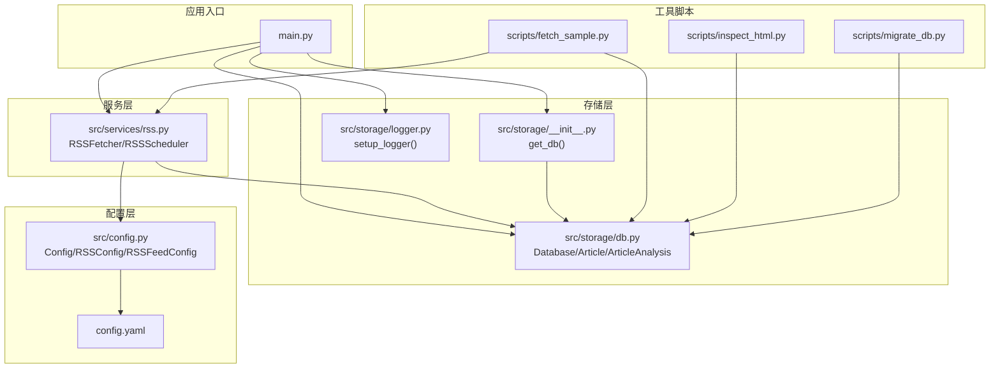
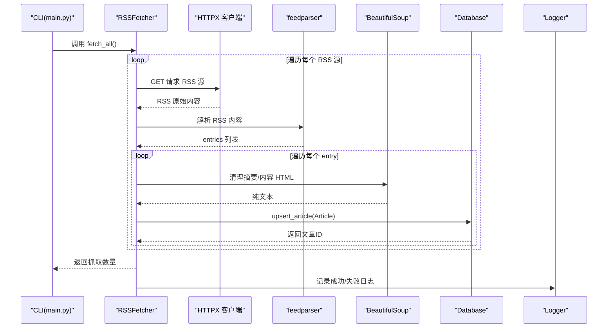
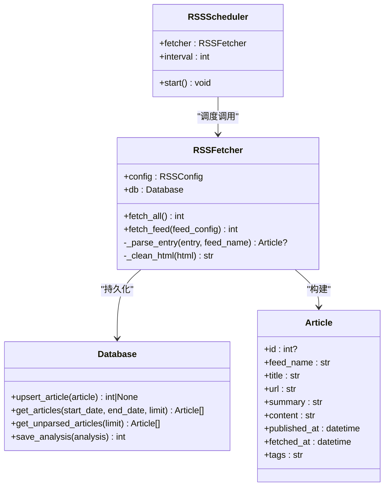
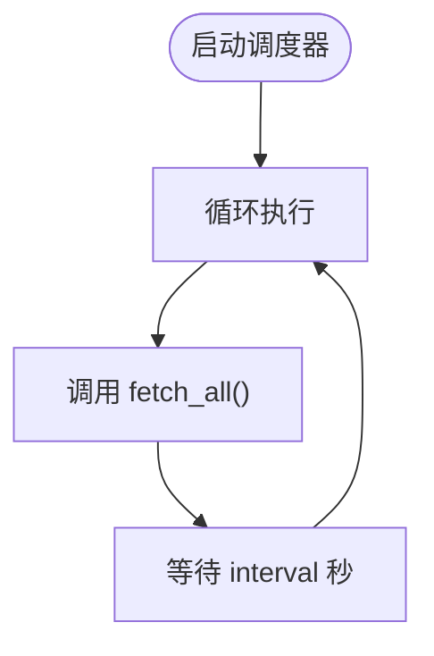
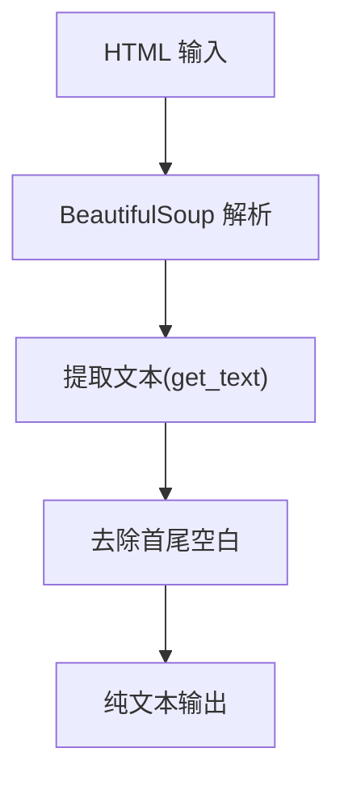
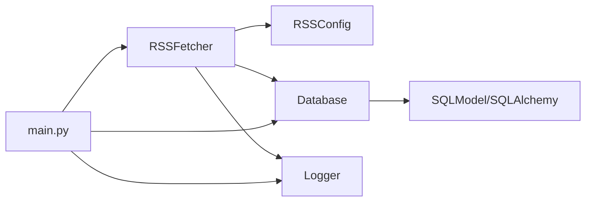
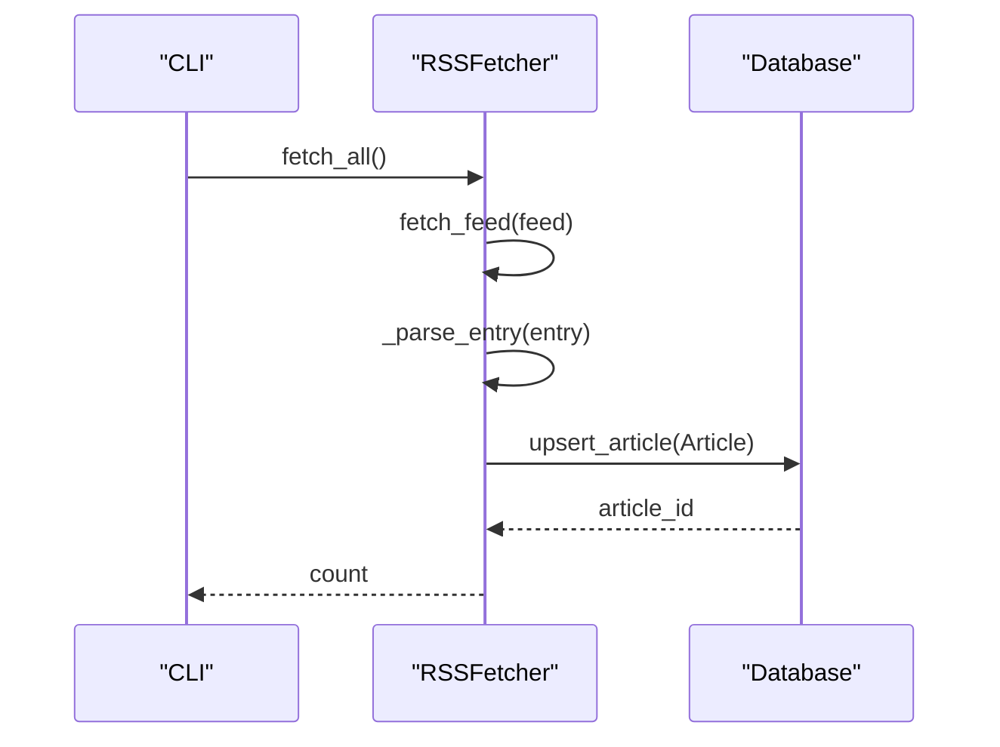

# RSS 数据采集服务

<cite>
**本文档引用的文件**
- [src/services/rss.py](file://src/services/rss.py)
- [src/storage/db.py](file://src/storage/db.py)
- [src/config.py](file://src/config.py)
- [config.yaml](file://config.yaml)
- [src/storage/logger.py](file://src/storage/logger.py)
- [src/storage/__init__.py](file://src/storage/__init__.py)
- [main.py](file://main.py)
- [scripts/fetch_sample.py](file://scripts/fetch_sample.py)
- [scripts/inspect_html.py](file://scripts/inspect_html.py)
- [scripts/migrate_db.py](file://scripts/migrate_db.py)
</cite>

## 目录
1. [简介](#简介)
2. [项目结构](#项目结构)
3. [核心组件](#核心组件)
4. [架构总览](#架构总览)
5. [详细组件分析](#详细组件分析)
6. [依赖关系分析](#依赖关系分析)
7. [性能考虑](#性能考虑)
8. [故障排除指南](#故障排除指南)
9. [结论](#结论)
10. [附录](#附录)

## 简介
本项目是一个基于 Python 的 RSS 数据采集与报告生成服务，提供多源 RSS 订阅抓取、HTTP 请求处理、RSS 内容解析、HTML 清理、数据库持久化以及定时调度能力。通过命令行接口（CLI）支持手动抓取、批量解析和报告生成；同时具备可扩展的配置体系与日志系统，便于在生产环境中部署与维护。

## 项目结构
项目采用模块化设计，核心模块包括：
- 服务层：RSS 抓取与解析逻辑
- 存储层：SQLite 数据库与 ORM 模型
- 配置层：YAML 配置与 Pydantic 模型
- 工具脚本：示例抓取、HTML 结构检查、数据库迁移
- CLI 入口：主程序入口与命令子命令



图表来源
- [main.py](file://main.py#L1-L227)
- [src/services/rss.py](file://src/services/rss.py#L1-L123)
- [src/storage/db.py](file://src/storage/db.py#L1-L251)
- [src/storage/__init__.py](file://src/storage/__init__.py#L1-L14)
- [src/storage/logger.py](file://src/storage/logger.py#L1-L39)
- [src/config.py](file://src/config.py#L1-L109)
- [config.yaml](file://config.yaml#L1-L54)
- [scripts/fetch_sample.py](file://scripts/fetch_sample.py#L1-L68)
- [scripts/inspect_html.py](file://scripts/inspect_html.py#L1-L91)
- [scripts/migrate_db.py](file://scripts/migrate_db.py#L1-L90)

章节来源
- [main.py](file://main.py#L1-L227)
- [src/services/rss.py](file://src/services/rss.py#L1-L123)
- [src/storage/db.py](file://src/storage/db.py#L1-L251)
- [src/storage/__init__.py](file://src/storage/__init__.py#L1-L14)
- [src/storage/logger.py](file://src/storage/logger.py#L1-L39)
- [src/config.py](file://src/config.py#L1-L109)
- [config.yaml](file://config.yaml#L1-L54)
- [scripts/fetch_sample.py](file://scripts/fetch_sample.py#L1-L68)
- [scripts/inspect_html.py](file://scripts/inspect_html.py#L1-L91)
- [scripts/migrate_db.py](file://scripts/migrate_db.py#L1-L90)

## 核心组件
- RSSFetcher：负责多源 RSS 抓取、HTTP 请求、RSS 解析与数据库持久化。
- RSSScheduler：提供定时调度器，周期性触发抓取任务。
- Database：封装 SQLite 数据库访问，提供 Upsert、查询与分析结果管理。
- 配置系统：YAML 配置文件与 Pydantic 模型，支持环境变量注入。
- 日志系统：Loguru 配置，支持文件轮转与控制台输出。
- CLI：Typer 命令行入口，支持 fetch、parse、report 等子命令。

章节来源
- [src/services/rss.py](file://src/services/rss.py#L15-L123)
- [src/storage/db.py](file://src/storage/db.py#L65-L251)
- [src/config.py](file://src/config.py#L32-L72)
- [src/storage/logger.py](file://src/storage/logger.py#L8-L39)
- [main.py](file://main.py#L66-L141)

## 架构总览
RSS 数据采集服务的整体流程如下：
- CLI 接收用户输入，加载配置与数据库实例。
- RSSFetcher 从多个 RSS 源拉取内容，使用 feedparser 解析，使用 BeautifulSoup 清理 HTML。
- 解析后的 Article 对象通过 Database.upsert_article 去重并持久化。
- RSSScheduler 提供定时调度，按配置间隔执行抓取。
- 日志系统统一记录运行状态与错误信息。



图表来源
- [main.py](file://main.py#L66-L82)
- [src/services/rss.py](file://src/services/rss.py#L22-L60)
- [src/storage/db.py](file://src/storage/db.py#L97-L122)
- [src/storage/logger.py](file://src/storage/logger.py#L8-L39)

## 详细组件分析

### RSSFetcher 组件
- 多源 RSS 订阅管理：遍历配置中的 RSS 源，逐个抓取并解析。
- HTTP 请求处理：使用 httpx.Client，设置超时与跟随重定向。
- RSS 内容解析：使用 feedparser 解析，处理 bozo 异常。
- HTML 内容清理：使用 BeautifulSoup 提取纯文本，去除标签与多余空白。
- 数据库持久化：逐条 upsert Article，保证 URL 唯一性。



图表来源
- [src/services/rss.py](file://src/services/rss.py#L15-L123)
- [src/storage/db.py](file://src/storage/db.py#L14-L122)

章节来源
- [src/services/rss.py](file://src/services/rss.py#L15-L123)
- [src/storage/db.py](file://src/storage/db.py#L97-L122)

### RSSScheduler 定时调度器
- 工作原理：循环执行 fetch_all，每次完成后等待指定间隔。
- 定时任务配置：从 RSSConfig.fetch_interval 读取间隔（秒）。
- 异常处理与重试：当前实现未内置重试机制，异常会被记录并跳过该源；可在上层调用处增加重试策略。
- 适用场景：轻量级定时任务，适合本地开发与小规模部署。



图表来源
- [src/services/rss.py](file://src/services/rss.py#L110-L123)

章节来源
- [src/services/rss.py](file://src/services/rss.py#L110-L123)

### HTML 内容清理算法
- BeautifulSoup 使用：解析 HTML 字符串，提取纯文本。
- 标签过滤与文本提取策略：移除标签，保留可见文本；对摘要与内容分别清理。
- 性能与准确性：清理逻辑简单高效，适合 RSS 摘要与正文的标准化处理。



图表来源
- [src/services/rss.py](file://src/services/rss.py#L102-L107)

章节来源
- [src/services/rss.py](file://src/services/rss.py#L102-L107)
- [scripts/inspect_html.py](file://scripts/inspect_html.py#L13-L88)

### 数据库持久化机制
- Article 模型：存储原始 RSS 文章，包含唯一 URL、标题、摘要、正文、发布时间、抓取时间与标签。
- Upsert 逻辑：以 URL 为键进行存在性检查，存在则更新，否则插入。
- 查询接口：支持按时间范围、ID、未解析文章等条件查询。
- 分析结果表：ArticleAnalysis 支持后续 LLM 解析结果的持久化与重跑。

```mermaid
erDiagram
ARTICLE {
int id PK
string feed_name
string title
string url UK
string summary
string content
datetime published_at
datetime fetched_at
string tags
}
ARTICLE_ANALYSIS {
int id PK
int article_id UK FK
string summary_llm
string keywords
string category
string sentiment
string parsed_at
}
FEED_CONFIG {
int id PK
string url UK
string name
string last_fetched
}
REPORT {
int id PK
string report_type
string date_range
string content
string created_at
}
ARTICLE ||--|| ARTICLE_ANALYSIS : "一对一关联"
```

图表来源
- [src/storage/db.py](file://src/storage/db.py#L14-L61)

章节来源
- [src/storage/db.py](file://src/storage/db.py#L14-L251)

### 配置系统与 CLI
- 配置文件：config.yaml 定义 RSS 源、超时、抓取间隔、数据库路径、日志与调度参数。
- 配置加载：src/config.py 使用 Pydantic 模型校验与类型转换，支持环境变量注入。
- CLI 命令：
  - rss fetch：抓取所有 RSS 源并保存至数据库。
  - rss parse：批量解析未处理文章。
  - rss report：生成日报/周报并可选生成 PPT。
- 示例脚本：fetch_sample.py 展示如何直接调用 RSSFetcher 进行抓取与查看结果。

章节来源
- [config.yaml](file://config.yaml#L23-L31)
- [src/config.py](file://src/config.py#L32-L72)
- [main.py](file://main.py#L66-L141)
- [scripts/fetch_sample.py](file://scripts/fetch_sample.py#L16-L68)

## 依赖关系分析
- 组件耦合：
  - RSSFetcher 依赖 RSSConfig、Database、Logger。
  - Database 依赖 SQLModel 与 SQLAlchemy。
  - CLI 依赖 Typer 与 LLMManager（用于报告生成）。
- 外部依赖：
  - feedparser：RSS 解析。
  - httpx：HTTP 客户端。
  - beautifulsoup4：HTML 清理。
  - sqlmodel：ORM 与 SQLite。
  - loguru：日志。
  - pydantic：配置模型。
  - typer：CLI。



图表来源
- [src/services/rss.py](file://src/services/rss.py#L10-L12)
- [src/storage/db.py](file://src/storage/db.py#L8-L9)
- [main.py](file://main.py#L14-L21)

章节来源
- [src/services/rss.py](file://src/services/rss.py#L10-L12)
- [src/storage/db.py](file://src/storage/db.py#L8-L9)
- [main.py](file://main.py#L14-L21)

## 性能考虑
- HTTP 超时与连接复用：httpx.Client 在每次抓取时创建，建议在 RSSFetcher 中复用客户端以减少连接开销。
- 批量写入：当前逐条 upsert，建议改为批量插入/更新以降低数据库往返次数。
- 数据库并发：已启用 WAL 模式与 busy_timeout，适合并发读写；仍需注意锁竞争。
- HTML 清理：BeautifulSoup 解析对大段 HTML 较快，但建议限制摘要/正文最大长度以控制内存占用。
- 日志级别：生产环境建议使用 INFO 或更高级别，避免过多 I/O。

[本节为通用性能建议，不直接分析具体文件]

## 故障排除指南
- RSS 源无法访问：
  - 检查网络连通性与代理设置。
  - 查看日志中 HTTP 错误信息。
  - 调整超时参数与 follow_redirects。
- RSS 解析失败：
  - 关注 bozo_exception 日志，确认 RSS 格式兼容性。
  - 尝试使用 scripts/inspect_html.py 检查目标站点的 HTML 结构。
- 数据库写入冲突：
  - 确认 URL 唯一约束是否被破坏。
  - 使用 scripts/migrate_db.py 迁移历史数据或修复表结构。
- 日志输出问题：
  - 检查日志文件路径与权限。
  - 确认 rotation 与 retention 设置是否合理。

章节来源
- [src/services/rss.py](file://src/services/rss.py#L36-L48)
- [src/storage/logger.py](file://src/storage/logger.py#L8-L39)
- [scripts/inspect_html.py](file://scripts/inspect_html.py#L13-L88)
- [scripts/migrate_db.py](file://scripts/migrate_db.py#L15-L90)

## 结论
本项目提供了完整的 RSS 数据采集与报告生成能力，具备清晰的模块划分与可扩展的配置体系。RSSFetcher 与 Database 协同实现了高可靠的数据采集与持久化；RSSScheduler 提供了基础的定时调度能力；BeautifulSoup 与 feedparser 的组合确保了内容解析的稳定性。建议在生产环境中进一步增强重试机制、批量写入与并发控制，以提升整体吞吐量与稳定性。

[本节为总结性内容，不直接分析具体文件]

## 附录

### 配置示例与参数说明
- RSS 源配置
  - feeds：数组，包含多个 RSSFeedConfig，每个包含 url 与 name。
  - fetch_interval：抓取间隔（秒），用于调度器。
  - timeout：HTTP 请求超时（秒）。
- 数据库配置
  - path：SQLite 文件路径。
- 日志配置
  - level：日志级别。
  - file：日志文件路径。
  - rotation：日志轮转大小。
  - retention：日志保留天数。
- 调度配置
  - timezone：时区。
  - report_daily_hour：日报生成小时。
  - report_weekly_hour：周报生成小时（周一）。

章节来源
- [config.yaml](file://config.yaml#L23-L53)
- [src/config.py](file://src/config.py#L32-L72)

### 数据流转过程（从 RSS 抓取到 Article 模型创建）
- CLI 调用 RSSFetcher.fetch_all()。
- 遍历 RSS 源，使用 httpx 获取内容并 feedparser 解析。
- 遍历 entries，使用 BeautifulSoup 清理摘要与内容。
- 构建 Article 对象并调用 Database.upsert_article()。
- 返回抓取数量并记录日志。



图表来源
- [main.py](file://main.py#L66-L82)
- [src/services/rss.py](file://src/services/rss.py#L22-L60)
- [src/storage/db.py](file://src/storage/db.py#L97-L122)

### 常见问题与解决方案
- 抓取速度慢：调整 fetch_interval 与 timeout，启用批量写入。
- 内存占用高：限制摘要/正文最大长度，优化 HTML 清理逻辑。
- 并发写入冲突：使用 WAL 模式与合理的 busy_timeout，避免长时间事务。
- 日志文件过大：调整 rotation 与 retention，必要时使用异步日志。

[本节为通用指导，不直接分析具体文件]