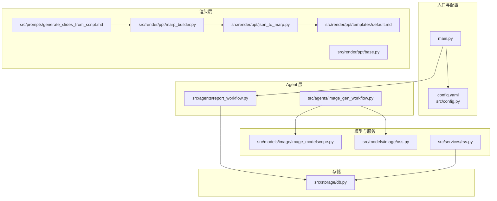
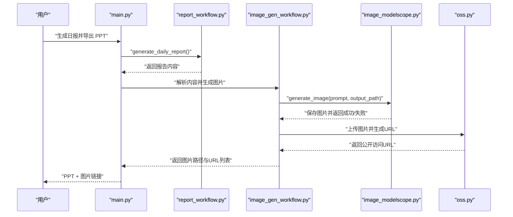
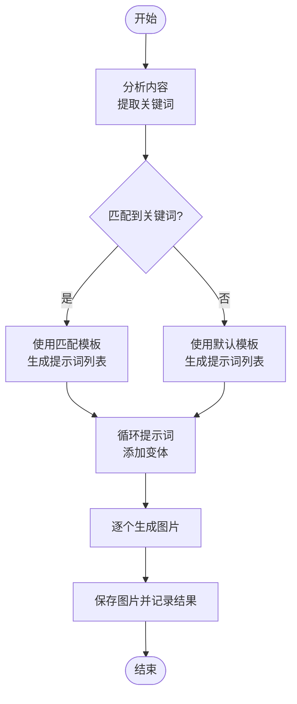
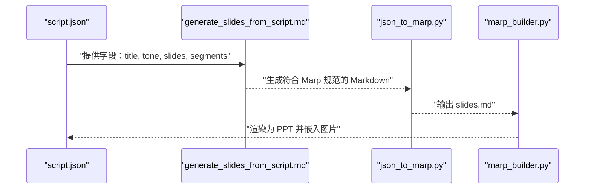
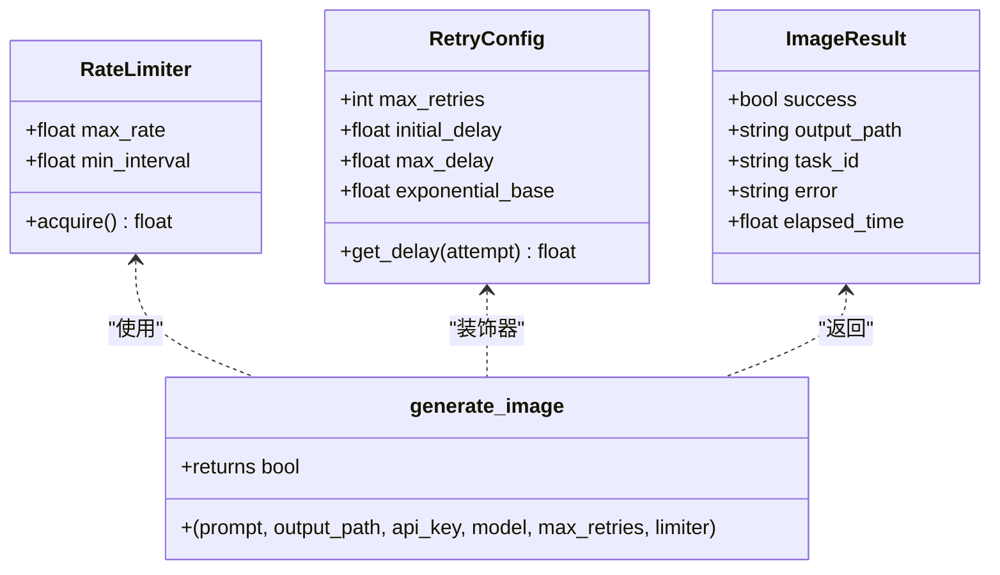
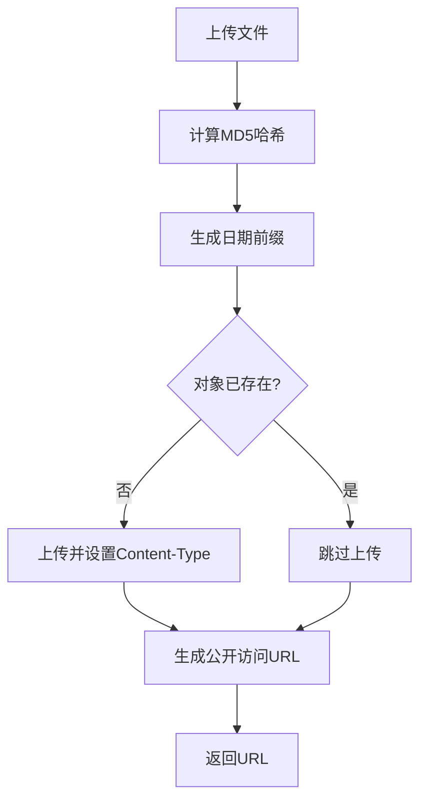
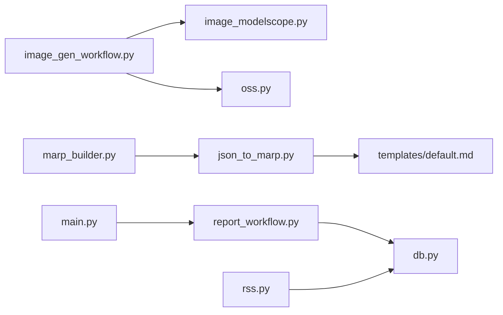

# 图片脚本生成系统

<cite>
**本文档引用的文件**
- [README.md](file://README.md)
- [main.py](file://main.py)
- [config.yaml](file://config.yaml)
- [src/config.py](file://src/config.py)
- [scripts/test_image_gen.py](file://scripts/test_image_gen.py)
- [src/agents/image_gen_workflow.py](file://src/agents/image_gen_workflow.py)
- [src/models/image/image_modelscope.py](file://src/models/image/image_modelscope.py)
- [src/models/image/oss.py](file://src/models/image/oss.py)
- [src/render/ppt/marp_builder.py](file://src/render/ppt/marp_builder.py)
- [src/render/ppt/json_to_marp.py](file://src/render/ppt/json_to_marp.py)
- [src/render/ppt/base.py](file://src/render/ppt/base.py)
- [src/render/ppt/templates/default.md](file://src/render/ppt/templates/default.md)
- [src/prompts/generate_slides_from_script.md](file://src/prompts/generate_slides_from_script.md)
- [src/services/rss.py](file://src/services/rss.py)
- [src/storage/db.py](file://src/storage/db.py)
- [src/agents/report_workflow.py](file://src/agents/report_workflow.py)
</cite>

## 目录
1. [简介](#简介)
2. [项目结构](#项目结构)
3. [核心组件](#核心组件)
4. [架构总览](#架构总览)
5. [详细组件分析](#详细组件分析)
6. [依赖关系分析](#依赖关系分析)
7. [性能考量](#性能考量)
8. [故障排除指南](#故障排除指南)
9. [结论](#结论)
10. [附录](#附录)

## 简介
本系统是一个基于 LangGraph 的多模态内容自动生成与分发平台，支持将资讯类文章转化为具备短视频逻辑的脚本，并通过图片生成 Agent 为内容配图。系统提供从 RSS 抓取、文章解析、结构化报告生成，到 PPT 渲染与图片生成的完整流水线。本文档聚焦“图片脚本生成”子系统，详细说明图片生成 Agent 的工作流程、短视频脚本到图像生成的转换逻辑、多提供商图像生成服务的集成方案、OSS 对象存储集成、使用示例、与视频编辑流程的集成方式以及性能优化与故障排除建议。

## 项目结构
系统采用模块化分层设计，图片脚本生成相关的关键模块如下：
- agents：工作流与 Agent 层，包含图片生成 Agent 的核心逻辑
- models：外部模型 API 封装，包含图像生成与 OSS 上传
- render：PPT 渲染层，包含 Marp 渲染与模板系统
- services：业务服务，包含 RSS 抓取
- storage：数据存储，包含 SQLite 与向量数据库
- scripts：测试脚本，包含图片生成 Agent 的测试用例

**图表来源**
- [main.py](file://main.py#L1-L227)
- [config.yaml](file://config.yaml#L1-L54)
- [src/config.py](file://src/config.py#L1-L109)
- [src/agents/image_gen_workflow.py](file://src/agents/image_gen_workflow.py#L1-L198)
- [src/agents/report_workflow.py](file://src/agents/report_workflow.py#L1-L266)
- [src/models/image/image_modelscope.py](file://src/models/image/image_modelscope.py#L1-L363)
- [src/models/image/oss.py](file://src/models/image/oss.py#L1-L158)
- [src/render/ppt/marp_builder.py](file://src/render/ppt/marp_builder.py#L1-L94)
- [src/render/ppt/json_to_marp.py](file://src/render/ppt/json_to_marp.py#L1-L139)
- [src/render/ppt/base.py](file://src/render/ppt/base.py#L1-L42)
- [src/render/ppt/templates/default.md](file://src/render/ppt/templates/default.md#L1-L36)
- [src/prompts/generate_slides_from_script.md](file://src/prompts/generate_slides_from_script.md#L1-L62)
- [src/services/rss.py](file://src/services/rss.py#L1-L123)
- [src/storage/db.py](file://src/storage/db.py#L1-L251)

**章节来源**
- [README.md](file://README.md#L87-L148)
- [main.py](file://main.py#L1-L227)
- [config.yaml](file://config.yaml#L1-L54)
- [src/config.py](file://src/config.py#L1-L109)

## 核心组件
- 图片生成 Agent：负责将输入脚本解析为图像生成提示词，并调用图像生成服务生成图片，最后处理输出结果
- 图像生成服务封装：以 ModelScope Z-Image-Turbo 为例，提供指数退避重试、速率限制、并发控制与轮询机制
- OSS 对象存储：提供文件上传、URL 生成与访问权限管理
- PPT 渲染与脚本集成：将 JSON 脚本转换为 Marp Markdown，并与图片路径集成，支撑视频口播与字幕叠加
- RSS 与数据库：为图片生成提供素材来源与状态持久化

**章节来源**
- [src/agents/image_gen_workflow.py](file://src/agents/image_gen_workflow.py#L1-L198)
- [src/models/image/image_modelscope.py](file://src/models/image/image_modelscope.py#L1-L363)
- [src/models/image/oss.py](file://src/models/image/oss.py#L1-L158)
- [src/render/ppt/marp_builder.py](file://src/render/ppt/marp_builder.py#L1-L94)
- [src/render/ppt/json_to_marp.py](file://src/render/ppt/json_to_marp.py#L1-L139)
- [src/services/rss.py](file://src/services/rss.py#L1-L123)
- [src/storage/db.py](file://src/storage/db.py#L1-L251)

## 架构总览
图片脚本生成系统围绕“脚本 → 提示词 → 图像生成 → 输出处理”的主干流程展开，同时与 RSS 抓取、文章解析、报告生成、PPT 渲染形成闭环。

**图表来源**
- [main.py](file://main.py#L107-L141)
- [src/agents/report_workflow.py](file://src/agents/report_workflow.py#L217-L237)
- [src/agents/image_gen_workflow.py](file://src/agents/image_gen_workflow.py#L82-L139)
- [src/models/image/image_modelscope.py](file://src/models/image/image_modelscope.py#L125-L243)
- [src/models/image/oss.py](file://src/models/image/oss.py#L54-L93)

## 详细组件分析

### 图片生成 Agent 工作流
- 输入脚本解析：根据内容关键词匹配预设提示词模板，生成多张图片所需的提示词
- 图像生成调用：逐个调用图像生成服务，支持失败重试与进度记录
- 输出结果处理：返回成功生成的图片路径与提示词索引，便于后续 PPT 集成

**图表来源**
- [src/agents/image_gen_workflow.py](file://src/agents/image_gen_workflow.py#L48-L79)
- [src/agents/image_gen_workflow.py](file://src/agents/image_gen_workflow.py#L104-L139)

**章节来源**
- [src/agents/image_gen_workflow.py](file://src/agents/image_gen_workflow.py#L1-L198)

### 短视频脚本到图像生成的转换逻辑
- 场景描述提取：从脚本 JSON 的 segments 中提炼关键短句，形成每页的 key_points 与文案
- 视觉元素识别：通过 image_path 指定图片路径，结合 Marp 两列布局实现图文并茂
- 生成参数配置：根据 tone 与主题选择合适的提示词模板（如 tech/business/medical/ai/abstract/nature/gradient）

**图表来源**
- [src/prompts/generate_slides_from_script.md](file://src/prompts/generate_slides_from_script.md#L1-L62)
- [src/render/ppt/json_to_marp.py](file://src/render/ppt/json_to_marp.py#L39-L110)
- [src/render/ppt/marp_builder.py](file://src/render/ppt/marp_builder.py#L59-L93)

**章节来源**
- [src/prompts/generate_slides_from_script.md](file://src/prompts/generate_slides_from_script.md#L1-L62)
- [src/render/ppt/json_to_marp.py](file://src/render/ppt/json_to_marp.py#L1-L139)
- [src/render/ppt/marp_builder.py](file://src/render/ppt/marp_builder.py#L1-L94)

### 多提供商图像生成服务集成方案
- API 调用封装：以 ModelScope Z-Image-Turbo 为例，封装异步任务提交、轮询与结果下载
- 错误处理：指数退避重试、429 限流等待、超时处理与状态轮询
- 成本控制：速率限制器与并发控制，避免超出配额或触发限流

**图表来源**
- [src/models/image/image_modelscope.py](file://src/models/image/image_modelscope.py#L46-L94)
- [src/models/image/image_modelscope.py](file://src/models/image/image_modelscope.py#L125-L243)

**章节来源**
- [src/models/image/image_modelscope.py](file://src/models/image/image_modelscope.py#L1-L363)

### OSS 对象存储集成实现
- 文件上传：支持单文件与目录上传，自动计算 MD5 哈希避免重复上传
- URL 生成：支持自定义域名与默认 Bucket 域名，返回公开访问 URL
- 访问权限管理：通过 OSS 授权对象与 Bucket 实例进行上传与访问控制

**图表来源**
- [src/models/image/oss.py](file://src/models/image/oss.py#L54-L93)

**章节来源**
- [src/models/image/oss.py](file://src/models/image/oss.py#L1-L158)

### 使用示例与最佳实践
- 脚本格式规范：遵循 generate_slides_from_script.md 的字段与输出要求，确保 slides.md 符合 Marp 渲染规范
- 生成参数调优：根据 tone 与主题选择合适的提示词模板，必要时调整变体编号以避免重复
- 质量评估方法：对比生成图片与提示词的相关性，检查分辨率与风格一致性；通过 OSS URL 验证公开访问

**章节来源**
- [src/prompts/generate_slides_from_script.md](file://src/prompts/generate_slides_from_script.md#L1-L62)
- [src/render/ppt/json_to_marp.py](file://src/render/ppt/json_to_marp.py#L39-L110)
- [src/render/ppt/templates/default.md](file://src/render/ppt/templates/default.md#L1-L36)

### 与视频编辑流程的集成方式
- 数据流转：RSS 抓取 → 文章解析 → 报告生成 → PPT 渲染 → 图片生成 → OSS 上传 → 视频口播与字幕叠加
- 关键接口：image_gen_workflow 与 oss 上传器为视频编辑提供图片资源；marp_builder 与 json_to_marp 为视频画面提供结构化脚本

**章节来源**
- [src/services/rss.py](file://src/services/rss.py#L1-L123)
- [src/agents/report_workflow.py](file://src/agents/report_workflow.py#L1-L266)
- [src/render/ppt/marp_builder.py](file://src/render/ppt/marp_builder.py#L1-L94)
- [src/render/ppt/json_to_marp.py](file://src/render/ppt/json_to_marp.py#L1-L139)
- [src/agents/image_gen_workflow.py](file://src/agents/image_gen_workflow.py#L1-L198)
- [src/models/image/oss.py](file://src/models/image/oss.py#L1-L158)

## 依赖关系分析
- 组件耦合：image_gen_workflow 依赖 models/image 下的具体实现；render 层依赖模板与构建器注册机制；storage 层提供数据持久化
- 外部依赖：requests、PIL、oss2、feedparser、httpx 等第三方库
- 配置依赖：config.yaml 与 src/config.py 提供统一配置加载与环境变量替换

**图表来源**
- [src/agents/image_gen_workflow.py](file://src/agents/image_gen_workflow.py#L1-L198)
- [src/models/image/image_modelscope.py](file://src/models/image/image_modelscope.py#L1-L363)
- [src/models/image/oss.py](file://src/models/image/oss.py#L1-L158)
- [src/render/ppt/marp_builder.py](file://src/render/ppt/marp_builder.py#L1-L94)
- [src/render/ppt/json_to_marp.py](file://src/render/ppt/json_to_marp.py#L1-L139)
- [src/render/ppt/templates/default.md](file://src/render/ppt/templates/default.md#L1-L36)
- [src/agents/report_workflow.py](file://src/agents/report_workflow.py#L1-L266)
- [src/storage/db.py](file://src/storage/db.py#L1-L251)
- [src/services/rss.py](file://src/services/rss.py#L1-L123)
- [main.py](file://main.py#L1-L227)

**章节来源**
- [src/agents/image_gen_workflow.py](file://src/agents/image_gen_workflow.py#L1-L198)
- [src/render/ppt/base.py](file://src/render/ppt/base.py#L1-L42)
- [src/render/ppt/marp_builder.py](file://src/render/ppt/marp_builder.py#L1-L94)
- [src/render/ppt/json_to_marp.py](file://src/render/ppt/json_to_marp.py#L1-L139)
- [src/render/ppt/templates/default.md](file://src/render/ppt/templates/default.md#L1-L36)
- [src/agents/report_workflow.py](file://src/agents/report_workflow.py#L1-L266)
- [src/storage/db.py](file://src/storage/db.py#L1-L251)
- [src/services/rss.py](file://src/services/rss.py#L1-L123)
- [main.py](file://main.py#L1-L227)

## 性能考量
- 并发与速率限制：image_modelscope 提供并发执行与速率限制，建议根据 API 配额合理设置 workers 与 rate
- 超时与重试：合理的超时与指数退避策略可减少失败重试带来的抖动
- 存储与缓存：OSS 上传前先检查对象是否存在，避免重复上传；输出图片命名采用哈希前缀，便于去重
- 渲染优化：Marp 渲染依赖本地 CLI，建议提前安装并验证可用性，减少运行时查找开销

[本节为通用指导，无需特定文件来源]

## 故障排除指南
- API Key 未配置：检查环境变量 MODELSCOPE_API_KEY 是否正确设置
- 429 限流：系统内置等待与重试，若仍失败，请降低并发或速率
- 超时与轮询：若长时间处于轮询状态，检查网络与服务端状态
- OSS 上传失败：确认 OSS 相关环境变量齐全，检查 Bucket 权限与 Endpoint
- PPT 渲染不可用：确认已安装 Marp CLI，或接受仅生成 Markdown 的降级模式

**章节来源**
- [scripts/test_image_gen.py](file://scripts/test_image_gen.py#L54-L62)
- [src/models/image/image_modelscope.py](file://src/models/image/image_modelscope.py#L176-L195)
- [src/models/image/oss.py](file://src/models/image/oss.py#L131-L155)
- [src/render/ppt/marp_builder.py](file://src/render/ppt/marp_builder.py#L37-L57)

## 结论
本系统通过清晰的模块划分与稳健的错误处理机制，实现了从脚本到图片再到 PPT 的完整流水线。图片生成 Agent 以关键词驱动的提示词生成为核心，结合 ModelScope 的异步生成与 OSS 的对象存储，为短视频内容生产提供了高性价比的解决方案。配合 PPT 渲染与脚本规范，系统能够稳定地支撑视频口播与字幕叠加的制作需求。

[本节为总结性内容，无需特定文件来源]

## 附录
- 快速测试：使用 scripts/test_image_gen.py 运行图片生成 Agent 的端到端测试
- 配置说明：参考 config.yaml 与 src/config.py 的配置项，确保各服务正常启动
- 模板系统：Marp 模板位于 templates 目录，可根据品牌风格定制

**章节来源**
- [scripts/test_image_gen.py](file://scripts/test_image_gen.py#L1-L99)
- [config.yaml](file://config.yaml#L1-L54)
- [src/config.py](file://src/config.py#L74-L109)
- [src/render/ppt/templates/default.md](file://src/render/ppt/templates/default.md#L1-L36)