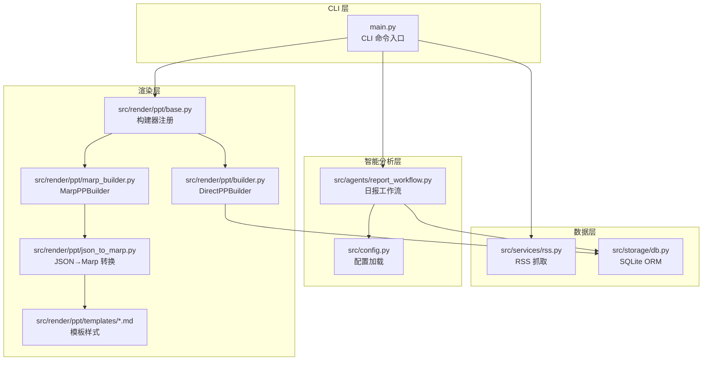
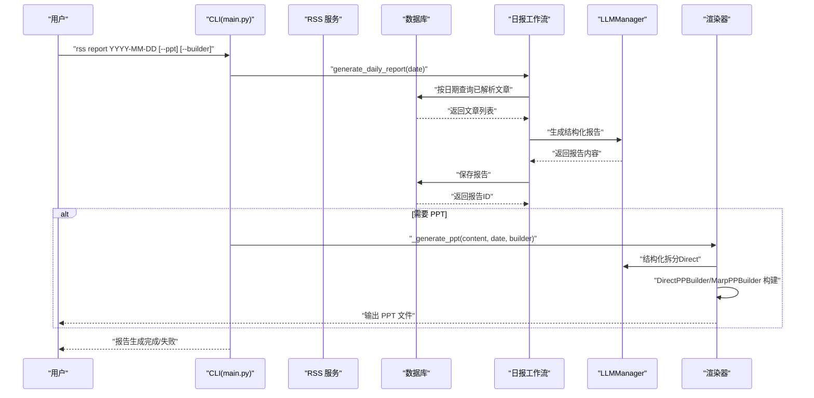
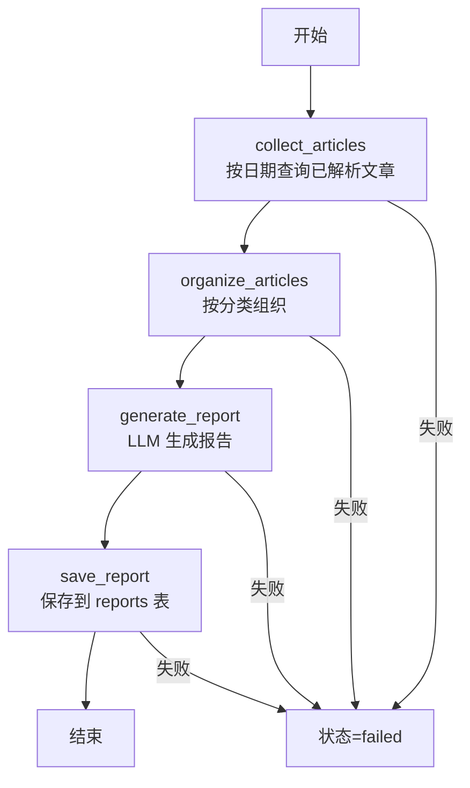
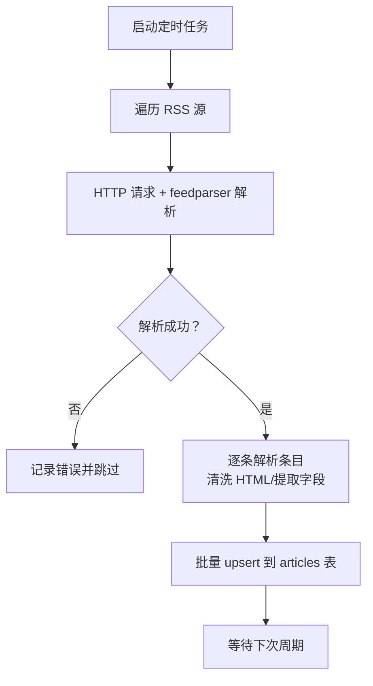
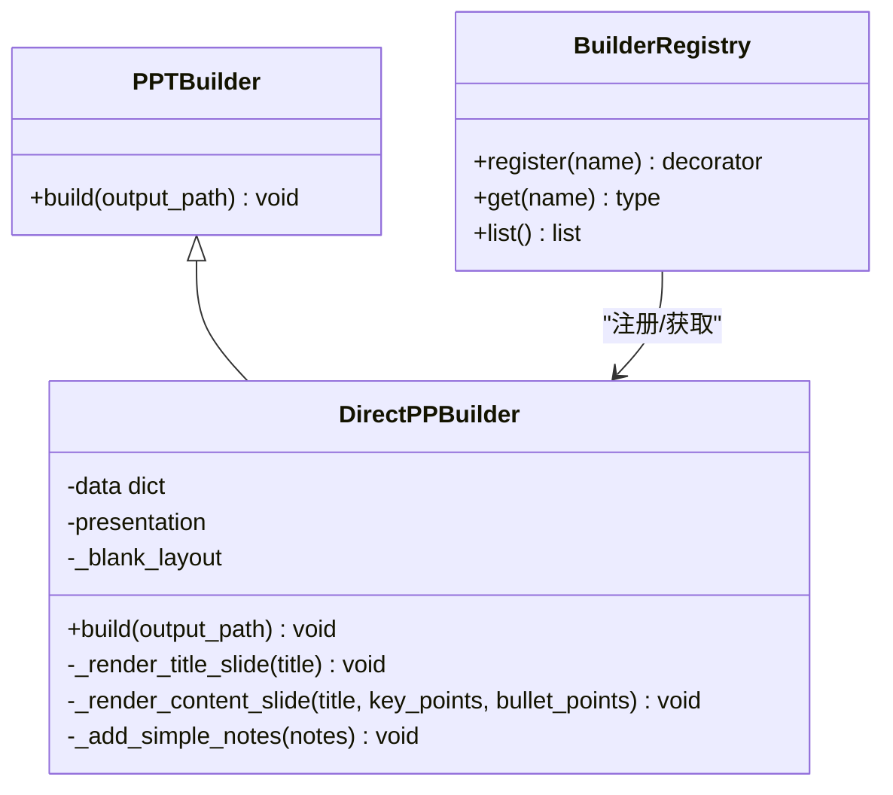
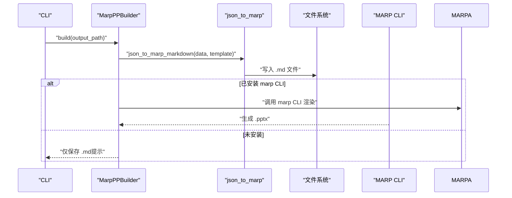
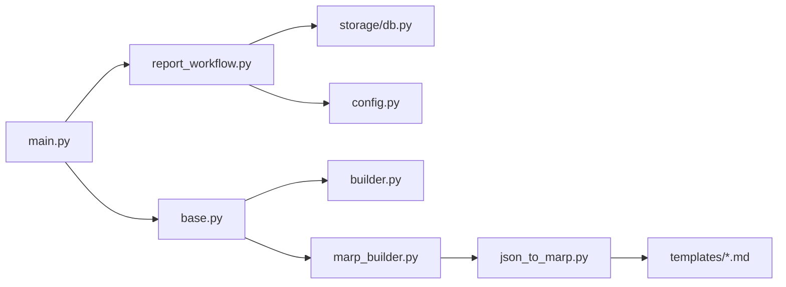

# 报告生成系统

<cite>
**本文档引用的文件**
- [README.md](file://README.md)
- [config.yaml](file://config.yaml)
- [src/config.py](file://src/config.py)
- [main.py](file://main.py)
- [src/agents/report_workflow.py](file://src/agents/report_workflow.py)
- [src/storage/db.py](file://src/storage/db.py)
- [src/services/rss.py](file://src/services/rss.py)
- [src/render/ppt/base.py](file://src/render/ppt/base.py)
- [src/render/ppt/builder.py](file://src/render/ppt/builder.py)
- [src/render/ppt/marp_builder.py](file://src/render/ppt/marp_builder.py)
- [src/render/ppt/json_to_marp.py](file://src/render/ppt/json_to_marp.py)
- [src/render/ppt/templates/default.md](file://src/render/ppt/templates/default.md)
- [src/render/ppt/templates/minimal.md](file://src/render/ppt/templates/minimal.md)
- [src/render/ppt/templates/corporate.md](file://src/render/ppt/templates/corporate.md)
- [src/render/ppt/templates/gradient.md](file://src/render/ppt/templates/gradient.md)
- [src/render/ppt/templates/dark.md](file://src/render/ppt/templates/dark.md)
- [scripts/test_templates.py](file://scripts/test_templates.py)
- [src/prompts/generate_slides_from_script.md](file://src/prompts/generate_slides_from_script.md)
</cite>

## 目录
1. [简介](#简介)
2. [项目结构](#项目结构)
3. [核心组件](#核心组件)
4. [架构总览](#架构总览)
5. [详细组件分析](#详细组件分析)
6. [依赖关系分析](#依赖关系分析)
7. [性能考量](#性能考量)
8. [故障排查指南](#故障排查指南)
9. [结论](#结论)
10. [附录](#附录)

## 简介
本系统是一个基于 LangGraph 的企业级多模态报告生成平台，核心能力包括：
- 多源 RSS 数据采集与解析
- AI 智能分析与结构化输出
- 日报/周报自动生成
- PPT 直接渲染与 Marp Markdown 渲染双模式
- 报告模板系统与样式定制
- 定时任务调度与质量保障

系统通过 CLI 命令提供完整的数据采集、报告生成与 PPT 输出能力，并支持灵活的模板选择与构建器切换。

## 项目结构
项目采用“分层+功能模块”组织方式，核心目录与职责如下：
- src/agents：LangGraph 工作流与智能分析节点
- src/render/ppt：PPT 渲染层，包含直接渲染与 Marp 渲染两种构建器
- src/services：业务服务（RSS 抓取等）
- src/storage：数据存储（SQLite/ChromaDB）
- src/models：外部模型 API（LLM/图像/TTS）
- scripts：模板测试与演示脚本
- config.yaml/env.example：配置与环境变量

图表来源
- [main.py](file://main.py#L107-L141)
- [src/agents/report_workflow.py](file://src/agents/report_workflow.py#L186-L201)
- [src/render/ppt/base.py](file://src/render/ppt/base.py#L16-L41)
- [src/render/ppt/builder.py](file://src/render/ppt/builder.py#L22-L24)
- [src/render/ppt/marp_builder.py](file://src/render/ppt/marp_builder.py#L21-L23)
- [src/render/ppt/json_to_marp.py](file://src/render/ppt/json_to_marp.py#L39-L110)
- [src/render/ppt/templates/default.md](file://src/render/ppt/templates/default.md#L1-L36)

章节来源
- [README.md](file://README.md#L87-L148)
- [main.py](file://main.py#L107-L141)

## 核心组件
- CLI 命令与入口：提供 fetch、parse、report、serve 等命令，支持日志配置与 PPT 输出
- 日报工作流（LangGraph）：从数据库收集文章→分类组织→LLM 生成→保存报告
- RSS 服务：抓取 RSS 源，清洗 HTML，批量入库
- 渲染层：DirectPPBuilder（直接渲染）、MarpPPBuilder（Marp 渲染），模板系统
- 配置系统：YAML 配置 + 环境变量注入，类型安全的 Pydantic 模型

章节来源
- [main.py](file://main.py#L107-L141)
- [src/agents/report_workflow.py](file://src/agents/report_workflow.py#L25-L36)
- [src/services/rss.py](file://src/services/rss.py#L15-L32)
- [src/render/ppt/base.py](file://src/render/ppt/base.py#L7-L14)
- [src/render/ppt/builder.py](file://src/render/ppt/builder.py#L22-L24)
- [src/render/ppt/marp_builder.py](file://src/render/ppt/marp_builder.py#L21-L23)
- [src/config.py](file://src/config.py#L65-L72)

## 架构总览
系统整体流程：
1. CLI 接收用户指令（生成报告/抓取/解析）
2. RSS 服务抓取并入库
3. 日报工作流读取已解析文章，调用 LLM 生成结构化报告
4. 报告保存至数据库
5. 可选：调用 PPT 构建器（Direct 或 Marp）进行渲染输出

图表来源
- [main.py](file://main.py#L107-L141)
- [src/agents/report_workflow.py](file://src/agents/report_workflow.py#L217-L237)
- [src/storage/db.py](file://src/storage/db.py#L227-L239)
- [src/render/ppt/builder.py](file://src/render/ppt/builder.py#L128-L151)
- [src/render/ppt/marp_builder.py](file://src/render/ppt/marp_builder.py#L59-L94)

## 详细组件分析

### 报告生成工作流（LangGraph）
- 状态机：START → collect → organize → generate → save → END
- 数据来源：数据库中已解析的文章（ArticleAnalysis）
- 输出：结构化报告内容与报告 ID
- 质量控制：过滤无解析结果的文章，正则清理 LLM 输出中的思考标签

图表来源
- [src/agents/report_workflow.py](file://src/agents/report_workflow.py#L46-L93)
- [src/agents/report_workflow.py](file://src/agents/report_workflow.py#L95-L160)
- [src/agents/report_workflow.py](file://src/agents/report_workflow.py#L163-L182)
- [src/agents/report_workflow.py](file://src/agents/report_workflow.py#L186-L201)

章节来源
- [src/agents/report_workflow.py](file://src/agents/report_workflow.py#L25-L36)
- [src/agents/report_workflow.py](file://src/agents/report_workflow.py#L46-L93)
- [src/agents/report_workflow.py](file://src/agents/report_workflow.py#L95-L160)
- [src/agents/report_workflow.py](file://src/agents/report_workflow.py#L163-L182)
- [src/agents/report_workflow.py](file://src/agents/report_workflow.py#L186-L201)
- [src/agents/report_workflow.py](file://src/agents/report_workflow.py#L217-L237)

### RSS 数据采集与入库
- 支持多源 RSS 订阅，自动定时抓取
- 清洗 HTML，提取标题、摘要、正文与标签
- 批量去重入库（upsert），记录抓取时间与发布时间

图表来源
- [src/services/rss.py](file://src/services/rss.py#L22-L60)
- [src/services/rss.py](file://src/services/rss.py#L62-L107)

章节来源
- [src/services/rss.py](file://src/services/rss.py#L15-L32)
- [src/services/rss.py](file://src/services/rss.py#L22-L60)
- [src/services/rss.py](file://src/services/rss.py#L62-L107)

### PPT 渲染与模板系统
系统提供两种 PPT 渲染模式，均通过 BuilderRegistry 注册与选择。

#### 直接渲染（DirectPPBuilder）
- 设计思路：将旁白文本转换为 PPT 设计蓝图（JSON），再由 python-pptx 直接绘制
- 适用场景：无需外部工具，完全本地渲染
- 关键点：固定布局（标题页/内容页），支持演讲者备注写入 PPT 备注区

图表来源
- [src/render/ppt/base.py](file://src/render/ppt/base.py#L7-L14)
- [src/render/ppt/base.py](file://src/render/ppt/base.py#L16-L41)
- [src/render/ppt/builder.py](file://src/render/ppt/builder.py#L22-L24)
- [src/render/ppt/builder.py](file://src/render/ppt/builder.py#L128-L151)

章节来源
- [src/render/ppt/builder.py](file://src/render/ppt/builder.py#L22-L24)
- [src/render/ppt/builder.py](file://src/render/ppt/builder.py#L75-L84)
- [src/render/ppt/builder.py](file://src/render/ppt/builder.py#L128-L151)
- [src/render/ppt/builder.py](file://src/render/ppt/builder.py#L153-L184)

#### Marp 渲染（MarpPPBuilder）
- 设计思路：JSON → Marp Markdown → PPT（依赖 marp CLI）
- 模板系统：通过模板文件注入 CSS 样式，支持多风格（default/minimal/corporate/gradient/dark）
- 关键点：模板样式从 .md 文件中提取 <style> 部分注入；支持讲者备注（notes）

图表来源
- [src/render/ppt/marp_builder.py](file://src/render/ppt/marp_builder.py#L59-L94)
- [src/render/ppt/json_to_marp.py](file://src/render/ppt/json_to_marp.py#L39-L110)
- [src/render/ppt/templates/default.md](file://src/render/ppt/templates/default.md#L1-L36)

章节来源
- [src/render/ppt/marp_builder.py](file://src/render/ppt/marp_builder.py#L21-L36)
- [src/render/ppt/marp_builder.py](file://src/render/ppt/marp_builder.py#L59-L94)
- [src/render/ppt/json_to_marp.py](file://src/render/ppt/json_to_marp.py#L26-L37)
- [src/render/ppt/json_to_marp.py](file://src/render/ppt/json_to_marp.py#L39-L110)
- [src/render/ppt/templates/minimal.md](file://src/render/ppt/templates/minimal.md#L1-L35)
- [src/render/ppt/templates/corporate.md](file://src/render/ppt/templates/corporate.md#L1-L35)
- [src/render/ppt/templates/gradient.md](file://src/render/ppt/templates/gradient.md#L1-L35)
- [src/render/ppt/templates/dark.md](file://src/render/ppt/templates/dark.md#L1-L37)

#### 模板语法与样式定制
- 模板文件：每个模板以 .md 文件形式提供，包含 <style> 样式块
- 注入机制：json_to_marp_markdown 读取模板文件，提取并注入样式
- 页面结构：封面页、内容页（交替深色页）、结束页，支持讲者备注注释
- 变量替换：标题、要点、列表项、备注均来自 JSON 数据

章节来源
- [src/render/ppt/json_to_marp.py](file://src/render/ppt/json_to_marp.py#L26-L37)
- [src/render/ppt/json_to_marp.py](file://src/render/ppt/json_to_marp.py#L39-L110)
- [src/render/ppt/templates/default.md](file://src/render/ppt/templates/default.md#L1-L36)
- [src/render/ppt/templates/minimal.md](file://src/render/ppt/templates/minimal.md#L1-L35)
- [src/render/ppt/templates/corporate.md](file://src/render/ppt/templates/corporate.md#L1-L35)
- [src/render/ppt/templates/gradient.md](file://src/render/ppt/templates/gradient.md#L1-L35)
- [src/render/ppt/templates/dark.md](file://src/render/ppt/templates/dark.md#L1-L37)

### 报告内容结构化组织
- 标题层级：封面页标题、二级标题（分类）、三级标题（话题）
- 段落格式：要点列表（每条 10-15 字），关键信息加粗强调
- 多媒体元素：Direct 模式支持图片占位（需外部图片路径），Marp 模式通过模板样式统一视觉风格
- 讲者备注：Direct 模式写入 PPT 备注区；Marp 模式通过注释标记

章节来源
- [src/render/ppt/builder.py](file://src/render/ppt/builder.py#L161-L179)
- [src/render/ppt/json_to_marp.py](file://src/render/ppt/json_to_marp.py#L69-L102)

### 配置选项说明
- LLM 提供商：支持 minimax、modelscope、deepseek，可配置默认提供商与模型
- RSS 订阅：feeds 列表、抓取间隔与超时
- 数据库：SQLite 路径
- 向量数据库：ChromaDB 路径与集合名
- 日志：级别、轮转大小、保留天数
- 调度：时区、日报/周报生成时间

章节来源
- [config.yaml](file://config.yaml#L4-L21)
- [config.yaml](file://config.yaml#L23-L31)
- [config.yaml](file://config.yaml#L33-L41)
- [config.yaml](file://config.yaml#L42-L47)
- [config.yaml](file://config.yaml#L49-L54)
- [src/config.py](file://src/config.py#L14-L72)

### 与 AI 分析系统的数据对接与质量保证
- 数据对接：工作流从数据库读取已解析文章（ArticleAnalysis），确保上游解析质量
- 质量保证：LLM 输出后清理思考标签；PPT 渲染失败时提供降级方案（标题拆分）
- 可观测性：日志配置支持文件轮转与保留策略

章节来源
- [src/agents/report_workflow.py](file://src/agents/report_workflow.py#L50-L61)
- [src/agents/report_workflow.py](file://src/agents/report_workflow.py#L154-L156)
- [main.py](file://main.py#L151-L162)
- [config.yaml](file://config.yaml#L42-L47)

### 实际使用案例与自定义扩展指南
- 使用案例
  - 生成日报：rss report 2026-01-11
  - 输出报告内容：rss report 2026-01-11 --output
  - 生成 PPT（Direct）：rss report 2026-01-11 --ppt --builder direct
  - 生成 PPT（Marp）：rss report 2026-01-11 --ppt --builder marp
- 自定义扩展
  - 新增 PPT 构建器：继承 PPTBuilder 并通过 BuilderRegistry.register 注册
  - 新增 Marp 模板：在 templates 目录新增 .md 文件，包含 <style> 样式块
  - 调整提示词：修改工作流中的提示词模板或 PPT 设计蓝图提示词

章节来源
- [README.md](file://README.md#L78-L85)
- [main.py](file://main.py#L107-L141)
- [src/render/ppt/base.py](file://src/render/ppt/base.py#L22-L29)
- [src/render/ppt/templates/default.md](file://src/render/ppt/templates/default.md#L1-L36)

## 依赖关系分析
- 组件耦合
  - CLI 依赖工作流与渲染器注册表
  - 工作流依赖数据库与 LLM 管理器
  - 渲染器依赖模板与 JSON→Marp 转换
- 外部依赖
  - python-pptx（Direct 模式）
  - marp CLI（Marp 模式）
  - feedparser/httpx（RSS 抓取）
  - SQLModel/SQLite（数据持久化）

图表来源
- [main.py](file://main.py#L14-L20)
- [src/agents/report_workflow.py](file://src/agents/report_workflow.py#L19-L20)
- [src/render/ppt/base.py](file://src/render/ppt/base.py#L16-L41)
- [src/render/ppt/builder.py](file://src/render/ppt/builder.py#L16-L17)
- [src/render/ppt/marp_builder.py](file://src/render/ppt/marp_builder.py#L11-L12)
- [src/render/ppt/json_to_marp.py](file://src/render/ppt/json_to_marp.py#L18-L23)

章节来源
- [main.py](file://main.py#L14-L20)
- [src/agents/report_workflow.py](file://src/agents/report_workflow.py#L19-L20)
- [src/render/ppt/base.py](file://src/render/ppt/base.py#L16-L41)

## 性能考量
- 数据库：WAL 模式与超时配置提升并发读写稳定性
- RSS 抓取：批量 upsert，减少事务开销
- 渲染性能：Direct 模式纯 Python，Marp 模式依赖外部 CLI；建议在 CI/本地开发环境安装 Marp CLI 以获得最佳体验
- LLM 调用：提示词模板明确输出格式，减少后处理成本

## 故障排查指南
- Marp CLI 未安装
  - 现象：仅生成 Markdown，未生成 PPTX
  - 处理：安装 marp CLI 或改用 Direct 模式
- LLM 输出格式错误
  - 现象：JSON 解析失败，触发降级方案
  - 处理：检查提示词与 LLM 配置，确保返回标准 JSON
- 数据为空
  - 现象：工作流收集阶段无文章
  - 处理：确认 RSS 抓取是否成功，数据库中是否存在已解析文章
- 日志定位
  - 使用 --verbose 或调整 logging.level 与 rotation/retention

章节来源
- [src/render/ppt/marp_builder.py](file://src/render/ppt/marp_builder.py#L37-L57)
- [src/render/ppt/marp_builder.py](file://src/render/ppt/marp_builder.py#L86-L93)
- [main.py](file://main.py#L151-L162)
- [src/agents/report_workflow.py](file://src/agents/report_workflow.py#L50-L61)
- [config.yaml](file://config.yaml#L42-L47)

## 结论
本系统通过清晰的分层架构与可扩展的渲染体系，实现了从数据采集到报告输出的全链路自动化。Direct 与 Marp 两种渲染模式满足不同场景需求，模板系统提供了丰富的视觉定制能力。配合 LangGraph 工作流与 LLM 提示词工程，系统在可维护性与可扩展性方面具备良好基础。

## 附录
- 模板测试脚本：scripts/test_templates.py 提供了各模板的渲染示例与使用说明
- 视频脚本到幻灯片的提示词：src/prompts/generate_slides_from_script.md 用于视频口播场景的 Marp 幻灯片生成

章节来源
- [scripts/test_templates.py](file://scripts/test_templates.py#L58-L104)
- [src/prompts/generate_slides_from_script.md](file://src/prompts/generate_slides_from_script.md#L1-L62)