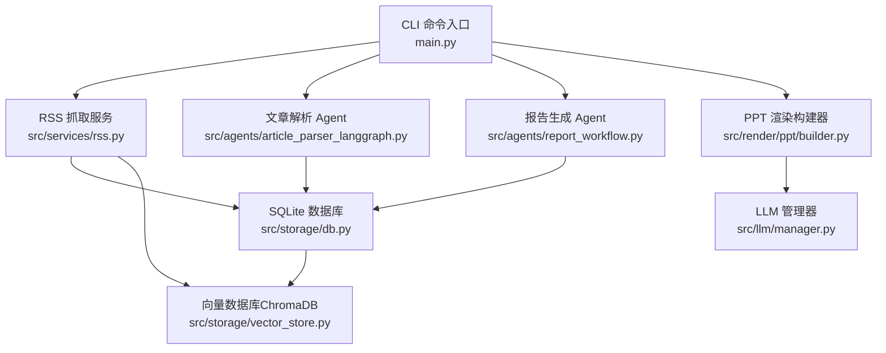
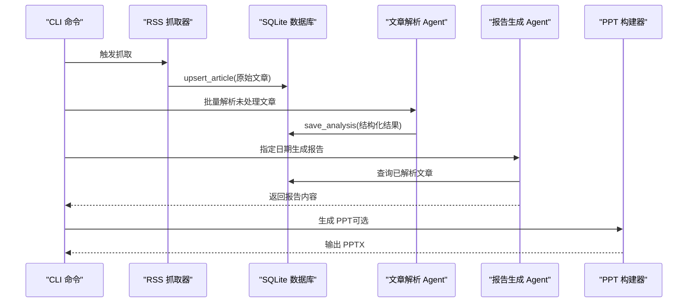
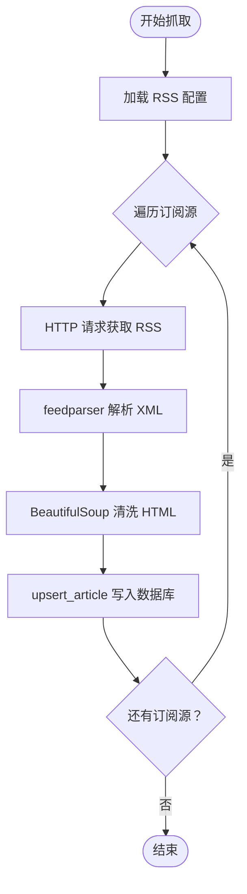
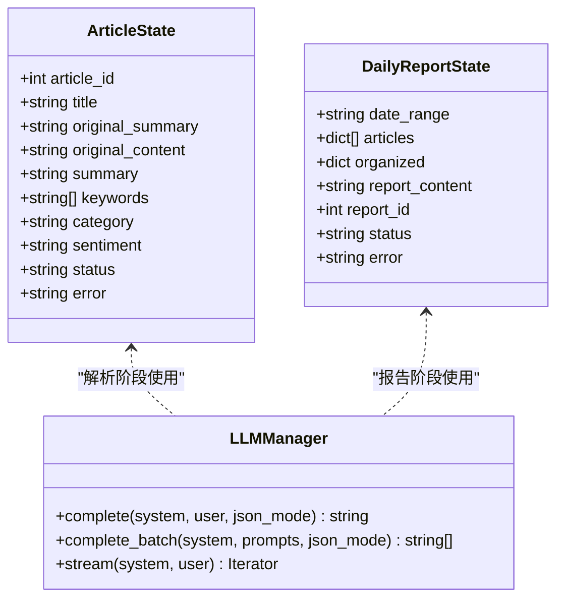
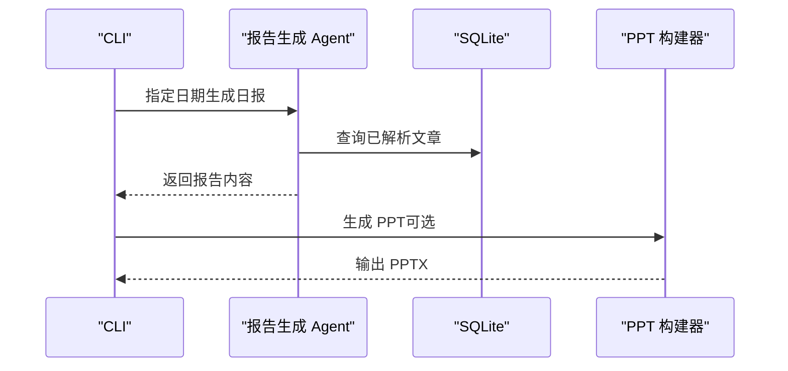
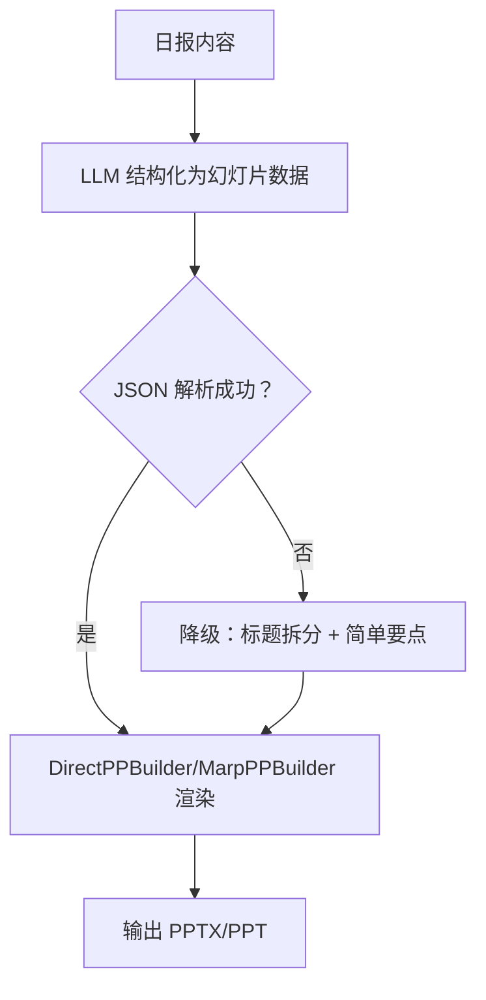
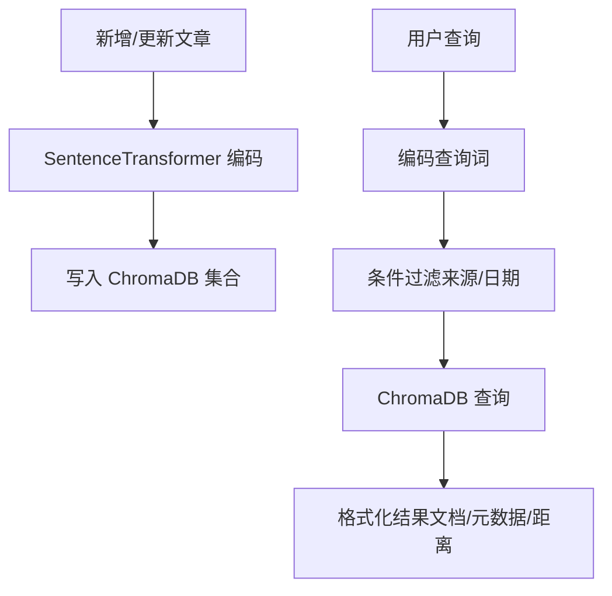
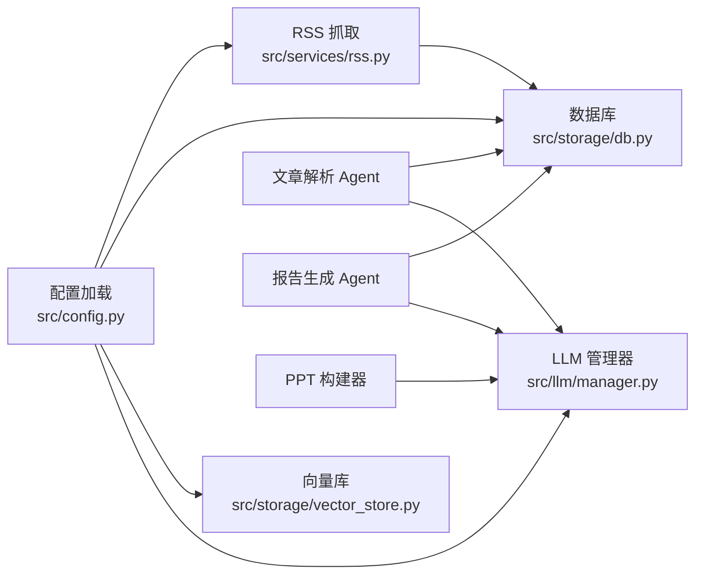

# 核心功能

<cite>
**本文档引用的文件**
- [README.md](file://README.md)
- [main.py](file://main.py)
- [config.yaml](file://config.yaml)
- [src/config.py](file://src/config.py)
- [src/services/rss.py](file://src/services/rss.py)
- [src/storage/db.py](file://src/storage/db.py)
- [src/storage/vector_store.py](file://src/storage/vector_store.py)
- [src/agents/article_parser_langgraph.py](file://src/agents/article_parser_langgraph.py)
- [src/agents/report_workflow.py](file://src/agents/report_workflow.py)
- [src/render/ppt/builder.py](file://src/render/ppt/builder.py)
- [src/llm/manager.py](file://src/llm/manager.py)
- [scripts/fetch_sample.py](file://scripts/fetch_sample.py)
- [scripts/test_templates.py](file://scripts/test_templates.py)
</cite>

## 目录
1. [简介](#简介)
2. [项目结构](#项目结构)
3. [核心组件](#核心组件)
4. [架构总览](#架构总览)
5. [详细组件分析](#详细组件分析)
6. [依赖关系分析](#依赖关系分析)
7. [性能考量](#性能考量)
8. [故障排查指南](#故障排查指南)
9. [结论](#结论)
10. [附录](#附录)

## 简介
Brief Agent 是一个基于 LangGraph 的多模态内容自动生成与分发平台，面向企业级知识内生场景。其核心能力包括：
- 多源 RSS 数据采集与定时抓取
- HTML 内容清洗与数据库持久化
- AI 智能分析（多 Agent 协作：文章解析、报告生成等）
- 日报/周报自动化生成与模板化输出
- 短视频脚本生成与渲染协议
- 基于 ChromaDB 的 RAG 向量化检索

该文档聚焦于上述核心功能的实现细节、使用方式、配置选项与最佳实践，并解释各功能之间的协作关系与数据流转。

## 项目结构
项目采用“配置-服务-存储-代理-渲染”的分层组织，CLI 入口负责编排任务，配置文件集中管理 LLM、RSS、数据库与调度参数，核心业务由服务层与存储层协同完成，AI 分析通过 LangGraph Agent 工作流实现，渲染层支持多种输出格式。

**图表来源**
- [main.py](file://main.py#L66-L141)
- [src/services/rss.py](file://src/services/rss.py#L15-L61)
- [src/storage/db.py](file://src/storage/db.py#L65-L90)
- [src/storage/vector_store.py](file://src/storage/vector_store.py#L15-L35)
- [src/agents/article_parser_langgraph.py](file://src/agents/article_parser_langgraph.py#L156-L181)
- [src/agents/report_workflow.py](file://src/agents/report_workflow.py#L186-L202)
- [src/render/ppt/builder.py](file://src/render/ppt/builder.py#L22-L63)
- [src/llm/manager.py](file://src/llm/manager.py#L206-L251)

**章节来源**
- [README.md](file://README.md#L87-L148)
- [main.py](file://main.py#L22-L26)

## 核心组件
- 配置系统：集中管理 LLM 提供商、RSS 源、数据库、向量库、日志与调度参数，支持环境变量注入与 YAML 配置。
- RSS 采集与清洗：多源订阅抓取、HTML 清洗、去重入库、定时调度。
- 数据持久化：SQLite（SQLModel）存储原始文章、解析结果与报告；ChromaDB 存储向量索引。
- AI 分析与报告：LangGraph 工作流驱动的“文章解析”和“日报生成”，统一 LLM 管理器抽象不同提供商。
- 报告与渲染：CLI 支持生成 PPT 输出，内置模板系统与两种构建器（DirectPPBuilder、MarpPPBuilder）。
- RAG 检索：基于 SentenceTransformer 的嵌入与 ChromaDB 查询，支持按来源与时间范围过滤。

**章节来源**
- [src/config.py](file://src/config.py#L65-L109)
- [config.yaml](file://config.yaml#L3-L54)
- [src/services/rss.py](file://src/services/rss.py#L15-L61)
- [src/storage/db.py](file://src/storage/db.py#L14-L62)
- [src/storage/vector_store.py](file://src/storage/vector_store.py#L15-L35)
- [src/agents/article_parser_langgraph.py](file://src/agents/article_parser_langgraph.py#L24-L43)
- [src/agents/report_workflow.py](file://src/agents/report_workflow.py#L25-L36)
- [src/render/ppt/builder.py](file://src/render/ppt/builder.py#L22-L63)
- [src/llm/manager.py](file://src/llm/manager.py#L206-L251)

## 架构总览
Brief Agent 的运行时架构围绕“数据采集—结构化分析—报告生成—多模态渲染”的闭环展开。CLI 命令触发 RSS 抓取与文章解析，随后由报告 Agent 生成结构化日报，最后通过 PPT 构建器输出。

**图表来源**
- [main.py](file://main.py#L66-L141)
- [src/services/rss.py](file://src/services/rss.py#L22-L61)
- [src/storage/db.py](file://src/storage/db.py#L97-L123)
- [src/agents/article_parser_langgraph.py](file://src/agents/article_parser_langgraph.py#L134-L151)
- [src/agents/report_workflow.py](file://src/agents/report_workflow.py#L217-L237)
- [src/render/ppt/builder.py](file://src/render/ppt/builder.py#L128-L151)

## 详细组件分析

### RSS 数据采集与定时抓取
- 多源订阅管理：支持在配置中声明多个 RSS 源，包含名称与 URL；抓取器遍历并逐源抓取。
- 定时抓取机制：提供调度器类，按配置的间隔循环执行抓取。
- HTML 内容清洗：使用 BeautifulSoup 清理 RSS 条目中的 HTML 标签，提取纯文本摘要与正文。
- 数据库持久化：使用 upsert 保证重复 URL 不重复入库，记录抓取时间与发布时间。

**图表来源**
- [src/services/rss.py](file://src/services/rss.py#L22-L61)
- [src/services/rss.py](file://src/services/rss.py#L102-L108)
- [src/storage/db.py](file://src/storage/db.py#L97-L123)

**章节来源**
- [src/services/rss.py](file://src/services/rss.py#L15-L123)
- [src/storage/db.py](file://src/storage/db.py#L95-L123)
- [config.yaml](file://config.yaml#L24-L31)

使用示例
- 抓取命令：通过 CLI 执行抓取，支持指定订阅源名称与详细日志开关。
- 示例脚本：提供快速抓取示例数据的脚本，便于验证数据库写入与数据清洗效果。

最佳实践
- 合理设置抓取间隔与超时，避免频繁请求导致限流。
- 对 RSS 源进行健康检查与错误日志监控，确保稳定性。
- 定期清理过期或重复内容，保持数据库整洁。

**章节来源**
- [main.py](file://main.py#L66-L82)
- [scripts/fetch_sample.py](file://scripts/fetch_sample.py#L16-L68)

### AI 智能分析与多 Agent 协作
- 文章解析工作流（LangGraph）：单次 LLM 调用完成摘要、关键词、分类与情感分析，结果写回数据库。
- 报告生成工作流（LangGraph）：按日期收集已解析文章，按分类组织，生成结构化日报并保存至数据库。
- LLM 管理器：统一抽象不同提供商（MiniMax、ModelScope、DeepSeek），支持单次、批量与流式调用。

**图表来源**
- [src/agents/article_parser_langgraph.py](file://src/agents/article_parser_langgraph.py#L26-L42)
- [src/agents/report_workflow.py](file://src/agents/report_workflow.py#L27-L36)
- [src/llm/manager.py](file://src/llm/manager.py#L206-L251)

**章节来源**
- [src/agents/article_parser_langgraph.py](file://src/agents/article_parser_langgraph.py#L66-L151)
- [src/agents/report_workflow.py](file://src/agents/report_workflow.py#L46-L182)
- [src/llm/manager.py](file://src/llm/manager.py#L206-L318)

使用示例
- CLI 批量解析：限制解析数量，查看成功/失败统计。
- 命令行工作流：直接调用解析与报告生成，支持输出到标准输出与生成 PPT。

最佳实践
- 控制单次 LLM 输入长度，避免截断影响解析质量。
- 对解析失败的条目进行重试与人工复核。
- 使用“已解析文章”集合进行报告生成，确保数据完整性。

**章节来源**
- [main.py](file://main.py#L84-L105)

### 报告生成与模板系统
- 日报生成：按日期范围收集已解析文章，按分类组织，生成结构化日报内容，保存至数据库。
- 模板系统：支持多种 PPT 模板（default/minimal/corporate/gradient/dark），通过 Marp 渲染或 DirectPPBuilder 直接绘制。
- CLI 输出：支持将报告内容打印到标准输出，并可选生成 PPTX 文件。

**图表来源**
- [src/agents/report_workflow.py](file://src/agents/report_workflow.py#L217-L237)
- [src/storage/db.py](file://src/storage/db.py#L227-L239)
- [src/render/ppt/builder.py](file://src/render/ppt/builder.py#L128-L151)
- [main.py](file://main.py#L107-L141)

**章节来源**
- [src/agents/report_workflow.py](file://src/agents/report_workflow.py#L95-L182)
- [scripts/test_templates.py](file://scripts/test_templates.py#L58-L105)

使用示例
- CLI 生成日报：指定日期，可选输出到标准输出与生成 PPT。
- 模板测试：脚本演示各模板渲染效果，输出 PPTX 与 Markdown。

最佳实践
- 为报告内容设定合理的字数与格式约束，确保可读性。
- 使用模板系统统一视觉风格，便于跨团队协作与审阅。

**章节来源**
- [main.py](file://main.py#L107-L141)
- [scripts/test_templates.py](file://scripts/test_templates.py#L107-L152)

### 短视频脚本生成与渲染协议
- 脚本生成：CLI 通过 LLM 将日报内容结构化为 PPT 幻灯片数据（标题、要点、讲稿等），支持降级方案以应对 LLM 输出异常。
- 渲染协议：DirectPPBuilder 使用 python-pptx 直接绘制；MarpBuilder 生成 Markdown 并交由 Marp CLI 渲染为 PPTX。
- 讲稿备注：支持将讲稿内容写入 PPT 备注区，便于演讲者使用。

**图表来源**
- [main.py](file://main.py#L143-L189)
- [main.py](file://main.py#L191-L205)
- [src/render/ppt/builder.py](file://src/render/ppt/builder.py#L128-L151)

**章节来源**
- [main.py](file://main.py#L28-L51)
- [main.py](file://main.py#L143-L189)
- [src/render/ppt/builder.py](file://src/render/ppt/builder.py#L22-L63)

使用示例
- CLI 生成 PPT：选择构建器（direct/marp），输出到 output 目录。
- 模板测试：验证各模板渲染效果，输出 PPTX 与 Markdown。

最佳实践
- 在 LLM 输出不稳定时启用降级方案，保证可用性。
- 使用 Marp 模板时确保已安装 Marp CLI，否则回退到 Markdown 预览。

**章节来源**
- [main.py](file://main.py#L134-L189)
- [scripts/test_templates.py](file://scripts/test_templates.py#L58-L105)

### RAG 向量化检索
- 向量化：使用 SentenceTransformer 将文章标题与摘要编码为向量，写入 ChromaDB 集合。
- 检索：支持按关键词语义检索，可限定来源或日期范围；返回文档、元数据与距离。
- 应用场景：在报告生成或内容筛选阶段，结合 RAG 结果增强信息密度与相关性。

**图表来源**
- [src/storage/vector_store.py](file://src/storage/vector_store.py#L36-L54)
- [src/storage/vector_store.py](file://src/storage/vector_store.py#L80-L96)
- [src/storage/vector_store.py](file://src/storage/vector_store.py#L98-L115)

**章节来源**
- [src/storage/vector_store.py](file://src/storage/vector_store.py#L15-L142)
- [config.yaml](file://config.yaml#L37-L41)

使用示例
- 新增文章向量：在文章入库后同步写入向量库。
- 语义检索：按关键词检索，可按来源或日期范围过滤，用于内容筛选与增强。

最佳实践
- 定期维护向量库，清理无效或重复条目。
- 在检索前对查询词进行预处理，提升召回质量。

**章节来源**
- [src/storage/vector_store.py](file://src/storage/vector_store.py#L117-L124)

## 依赖关系分析
- 配置依赖：所有组件通过统一配置加载器读取 LLM、RSS、数据库与调度参数。
- 存储依赖：RSS 抓取与文章解析均依赖 SQLite；RAG 依赖 ChromaDB。
- LLM 依赖：文章解析与报告生成均依赖 LLM 管理器，支持多提供商切换。
- 渲染依赖：PPT 构建器依赖 LLM 生成设计蓝图或直接绘制。

**图表来源**
- [src/config.py](file://src/config.py#L74-L109)
- [src/services/rss.py](file://src/services/rss.py#L18-L21)
- [src/storage/db.py](file://src/storage/db.py#L68-L79)
- [src/storage/vector_store.py](file://src/storage/vector_store.py#L18-L35)
- [src/llm/manager.py](file://src/llm/manager.py#L253-L281)

**章节来源**
- [src/config.py](file://src/config.py#L74-L109)
- [src/llm/manager.py](file://src/llm/manager.py#L206-L251)

## 性能考量
- 数据库并发：SQLite 启用 WAL 模式与超时配置，提升并发读写性能。
- LLM 调用：批量解析使用线程池并发调用，减少等待时间；注意不同提供商的流式支持差异。
- 向量检索：合理设置 n_results 与过滤条件，避免大规模扫描；定期维护集合大小。
- 渲染性能：DirectPPBuilder 直接绘制，适合大批量；Marp 渲染依赖外部工具，需确保环境可用。

[本节为通用指导，无需列出具体文件来源]

## 故障排查指南
- RSS 抓取失败：检查网络连通性、订阅源可用性与超时设置；查看日志定位具体错误。
- HTML 清洗异常：确认 BeautifulSoup 安装与版本兼容；必要时调整清洗策略。
- LLM 调用失败：检查 API Key 与提供商配置；在流式接口不可用时回退到非流式模式。
- 数据库锁冲突：SQLite 已启用 WAL 与超时，若仍出现锁冲突，降低并发或增加超时。
- PPT 渲染失败：确认已安装 Marp CLI（若使用 MarpBuilder）；DirectPPBuilder 需要 python-pptx。
- RAG 检索异常：检查向量维度与嵌入模型一致性；确保集合存在且未被破坏。

**章节来源**
- [src/services/rss.py](file://src/services/rss.py#L37-L48)
- [src/storage/db.py](file://src/storage/db.py#L84-L90)
- [src/llm/manager.py](file://src/llm/manager.py#L106-L158)
- [src/render/ppt/builder.py](file://src/render/ppt/builder.py#L128-L151)
- [src/storage/vector_store.py](file://src/storage/vector_store.py#L139-L142)

## 结论
Brief Agent 通过清晰的分层架构与标准化组件，实现了从 RSS 数据采集到 AI 结构化分析再到多模态输出的完整闭环。其配置驱动的设计便于扩展与维护，LangGraph 工作流提升了 AI 分析的可控性与可追溯性，而 PPT 模板系统与 RAG 检索进一步增强了内容生产与知识增强的能力。建议在实际部署中结合业务场景持续优化配置与流程，确保稳定性与可扩展性。

[本节为总结性内容，无需列出具体文件来源]

## 附录

### 配置选项总览
- LLM 提供商：支持 MiniMax、ModelScope、DeepSeek，可通过默认提供商与环境变量控制。
- RSS 订阅：支持多源订阅、抓取间隔与超时配置。
- 数据库：SQLite 路径配置。
- 向量库：ChromaDB 路径与集合名。
- 日志：日志级别、轮转大小与保留天数。
- 调度：时区与日报/周报生成时间。

**章节来源**
- [config.yaml](file://config.yaml#L3-L54)
- [src/config.py](file://src/config.py#L65-L109)

### CLI 使用示例
- 抓取 RSS：执行抓取命令，支持详细日志。
- 解析文章：批量解析未处理文章，限制解析数量。
- 生成报告：指定日期生成日报，可选输出到标准输出与生成 PPT。
- 启动服务：预留 Web 服务入口（当前占位）。

**章节来源**
- [main.py](file://main.py#L66-L141)