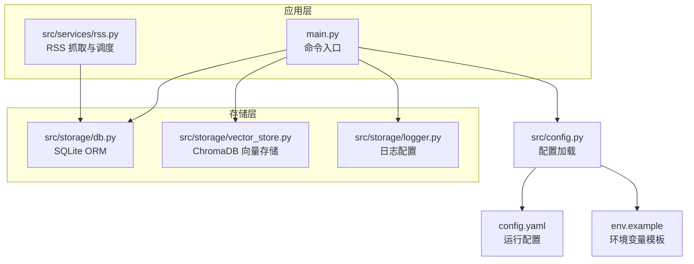
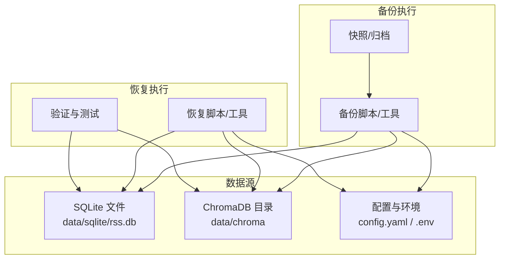
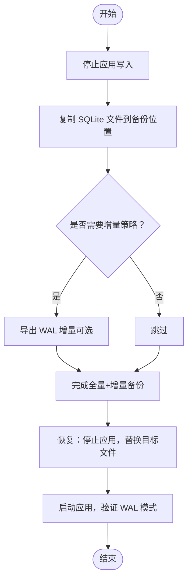
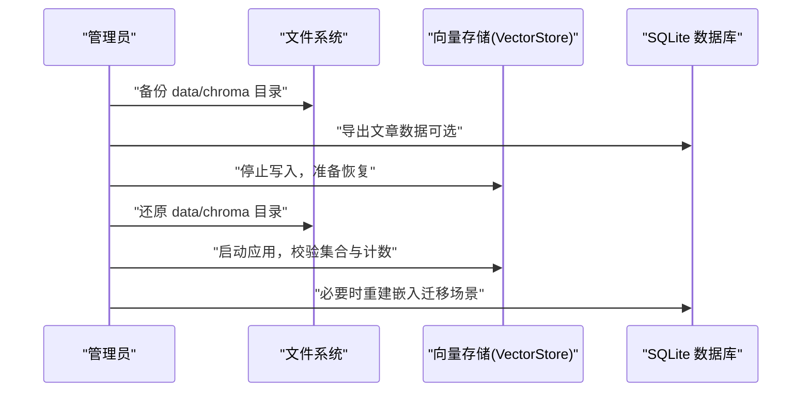
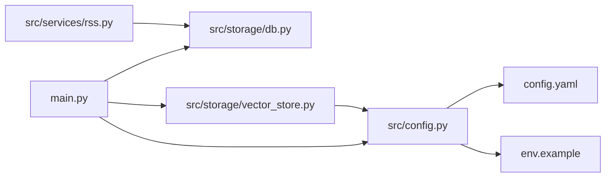

# 备份恢复

<cite>
**本文引用的文件**
- [src/storage/db.py](file://src/storage/db.py)
- [src/storage/vector_store.py](file://src/storage/vector_store.py)
- [src/config.py](file://src/config.py)
- [config.yaml](file://config.yaml)
- [env.example](file://env.example)
- [scripts/migrate_db.py](file://scripts/migrate_db.py)
- [src/services/rss.py](file://src/services/rss.py)
- [src/storage/logger.py](file://src/storage/logger.py)
- [main.py](file://main.py)
</cite>

## 目录
1. [简介](#简介)
2. [项目结构](#项目结构)
3. [核心组件](#核心组件)
4. [架构总览](#架构总览)
5. [详细组件分析](#详细组件分析)
6. [依赖关系分析](#依赖关系分析)
7. [性能考量](#性能考量)
8. [故障排查指南](#故障排查指南)
9. [结论](#结论)
10. [附录](#附录)

## 简介
本文件为 Brief Agent 的数据备份与恢复策略文档，覆盖以下方面：
- SQLite 数据库的备份与恢复流程
- 向量数据库（ChromaDB）的备份策略与数据迁移方法
- 配置文件与环境变量的安全备份建议
- 增量与全量备份的配置思路
- 备份数据的加密与存储安全
- 灾难恢复计划与业务连续性保障
- 备份验证与恢复测试流程
- 备份监控与告警配置思路
- 备份数据生命周期管理与清理策略

## 项目结构
Brief Agent 的数据持久化涉及三类数据：
- 关系型数据：SQLite 数据库存储文章、解析结果、报告等
- 向量数据：ChromaDB 持久化目录存储文章向量与元数据
- 配置与日志：配置文件、日志文件与环境变量

图表来源
- [main.py](file://main.py#L1-L227)
- [src/services/rss.py](file://src/services/rss.py#L1-L123)
- [src/storage/db.py](file://src/storage/db.py#L1-L251)
- [src/storage/vector_store.py](file://src/storage/vector_store.py#L1-L142)
- [src/storage/logger.py](file://src/storage/logger.py#L1-L39)
- [src/config.py](file://src/config.py#L1-L109)
- [config.yaml](file://config.yaml#L1-L54)
- [env.example](file://env.example#L1-L10)

章节来源
- [main.py](file://main.py#L1-L227)
- [src/config.py](file://src/config.py#L1-L109)
- [config.yaml](file://config.yaml#L1-L54)
- [env.example](file://env.example#L1-L10)

## 核心组件
- SQLite 数据库模块：提供文章、解析结果、报告等表的增删改查与事务支持；启用 WAL 模式以提升并发读写能力。
- ChromaDB 向量存储模块：基于持久化客户端，维护集合与嵌入索引；支持按条件检索与统计。
- 配置系统：统一加载 YAML 配置与环境变量，暴露数据库与向量库路径、集合名等关键参数。
- 日志系统：基于 loguru 的日志轮转与保留策略。

章节来源
- [src/storage/db.py](file://src/storage/db.py#L65-L93)
- [src/storage/vector_store.py](file://src/storage/vector_store.py#L15-L35)
- [src/config.py](file://src/config.py#L65-L72)
- [src/storage/logger.py](file://src/storage/logger.py#L8-L39)

## 架构总览
下图展示备份与恢复相关的数据流与组件交互：

图表来源
- [src/storage/db.py](file://src/storage/db.py#L68-L78)
- [src/storage/vector_store.py](file://src/storage/vector_store.py#L18-L31)
- [config.yaml](file://config.yaml#L33-L47)
- [env.example](file://env.example#L1-L10)

## 详细组件分析

### SQLite 数据库备份与恢复
- 数据位置与模式
  - SQLite 文件路径由配置提供，默认位于 data/sqlite/rss.db
  - 应用启动时自动创建表结构，并启用 WAL 模式
- 备份策略
  - 全量备份：直接复制 SQLite 文件；建议在应用停止或数据库空闲时进行
  - 增量备份：基于 WAL 日志的增量导出（需结合 SQLite 工具），或定期全量+周期性差异导出
- 恢复流程
  - 停止应用写入
  - 将备份文件还原到原路径
  - 启动应用，确认 WAL 模式与连接参数正常
- 迁移与兼容
  - 迁移脚本演示了表结构初始化与历史数据迁移逻辑，可用于恢复后验证一致性

图表来源
- [src/storage/db.py](file://src/storage/db.py#L68-L93)
- [config.yaml](file://config.yaml#L33-L35)
- [scripts/migrate_db.py](file://scripts/migrate_db.py#L15-L26)

章节来源
- [src/storage/db.py](file://src/storage/db.py#L65-L93)
- [config.yaml](file://config.yaml#L33-L35)
- [scripts/migrate_db.py](file://scripts/migrate_db.py#L15-L26)

### ChromaDB 向量数据库备份与迁移
- 数据位置与模式
  - ChromaDB 持久化目录由配置提供，默认位于 data/chroma
  - 集合名称由配置提供，默认 rss_articles
- 备份策略
  - 全量备份：直接复制整个数据目录
  - 增量备份：基于目录级快照或版本化存储；对集合进行增量同步（需结合外部工具）
- 恢复流程
  - 停止应用写入
  - 将备份目录还原到原路径
  - 启动应用，确认集合存在且可查询
- 数据迁移
  - 可通过应用侧读取 SQLite 中的文章数据，重新计算嵌入并写回 ChromaDB，实现跨环境迁移

图表来源
- [src/storage/vector_store.py](file://src/storage/vector_store.py#L18-L31)
- [config.yaml](file://config.yaml#L37-L40)
- [src/storage/db.py](file://src/storage/db.py#L97-L122)

章节来源
- [src/storage/vector_store.py](file://src/storage/vector_store.py#L15-L35)
- [config.yaml](file://config.yaml#L37-L40)

### 配置文件与环境变量的安全备份
- 配置文件
  - config.yaml：包含 LLM、RSS、数据库、向量库、日志、调度等配置项
  - 建议对 config.yaml 进行版本化管理与密钥隔离
- 环境变量
  - env.example 提供 API Key 等敏感信息的占位模板
  - 实际 .env 文件不应纳入版本库；备份时仅备份模板与变更记录
- 最佳实践
  - 使用密钥管理服务（如 KMS/HashiCorp Vault）存储真实密钥
  - 对备份文件进行访问控制与审计

章节来源
- [config.yaml](file://config.yaml#L1-L54)
- [env.example](file://env.example#L1-L10)
- [src/config.py](file://src/config.py#L74-L109)

### 增量备份与全量备份配置思路
- 全量备份
  - 周期性执行：每日/每周全量复制 SQLite 与 ChromaDB 目录
  - 自动化：结合系统计划任务或 CI/CD 触发
- 增量备份
  - SQLite：基于 WAL 的增量导出（需外部工具配合）
  - ChromaDB：目录级快照或版本化对象存储
- 配置要点
  - 在配置中记录备份策略参数（如备份周期、保留天数）
  - 通过环境变量注入备份目标与凭据

章节来源
- [src/storage/db.py](file://src/storage/db.py#L84-L89)
- [src/storage/vector_store.py](file://src/storage/vector_store.py#L18-L31)
- [src/config.py](file://src/config.py#L65-L72)

### 备份数据的加密与存储安全
- 传输与存储加密
  - 使用加密通道（如 SFTP/TLS/HTTPS）传输备份文件
  - 对备份文件进行压缩并加密（如 GPG/AES）
- 访问控制
  - 限制备份存储位置的访问权限（最小权限原则）
  - 对密钥与证书进行严格管控与轮换
- 完整性校验
  - 生成并校验哈希值（如 SHA-256）
  - 定期进行恢复演练与交叉验证

（本节为通用指导，不直接分析具体文件）

### 灾难恢复计划与业务连续性保障
- DR 场景
  - 数据库损坏：使用最近可用的全量+增量备份恢复
  - 向量库损坏：使用备份目录恢复；必要时重建嵌入
  - 配置丢失：使用模板与密钥管理服务恢复
- 业务连续性
  - 快速恢复优先级：数据库 > 向量库 > 配置
  - 多地备份与异地容灾：将备份存储至不同地理区域
  - 自动化恢复脚本与演练计划

（本节为通用指导，不直接分析具体文件）

### 备份验证与恢复测试执行流程
- 验证清单
  - SQLite：连接数据库，查询关键表计数与代表性记录
  - ChromaDB：查询集合计数与样本元数据
  - 配置：加载配置，检查路径与集合名
- 测试步骤
  - 从备份中恢复到隔离环境
  - 执行最小化功能测试（如抓取、解析、检索）
  - 回归验证（如生成报告、日志轮转）
- 记录与评审
  - 记录测试结果与问题
  - 评审并优化恢复流程

章节来源
- [src/storage/db.py](file://src/storage/db.py#L227-L250)
- [src/storage/vector_store.py](file://src/storage/vector_store.py#L121-L123)
- [src/storage/logger.py](file://src/storage/logger.py#L8-L39)

### 备份监控与告警机制配置
- 监控指标
  - 备份任务状态（成功/失败）、耗时、大小
  - 数据库与向量库健康状态（连接、计数、延迟）
  - 配置加载与环境变量注入状态
- 告警策略
  - 失败即告警；延迟阈值告警；容量预警
  - 通知渠道：邮件/IM/值班系统
- 工具建议
  - 使用系统计划任务或作业编排工具（如 Cron/Argo Workflows）
  - 集成日志与指标系统（如 Prometheus/ELK）

（本节为通用指导，不直接分析具体文件）

### 备份数据生命周期管理与清理策略
- 保留策略
  - 全量备份：短期保留（如 7 天）+ 长期归档（如 30/90 天）
  - 增量备份：短期保留（如 1 天）+ 周/月归档
- 清理策略
  - 自动清理过期备份
  - 定期清理无效或重复备份
  - 保留最少可用恢复点（RPO/RTO）

（本节为通用指导，不直接分析具体文件）

## 依赖关系分析
- 组件耦合
  - 主程序通过配置加载模块获取数据库与向量库路径
  - RSS 抓取服务依赖数据库模块进行数据持久化
  - 向量存储模块依赖配置中的集合名与路径
- 外部依赖
  - SQLite 引擎与 WAL 模式
  - ChromaDB 持久化客户端
  - 环境变量注入与 YAML 解析

图表来源
- [main.py](file://main.py#L14-L16)
- [src/config.py](file://src/config.py#L74-L88)
- [src/storage/db.py](file://src/storage/db.py#L68-L78)
- [src/storage/vector_store.py](file://src/storage/vector_store.py#L18-L31)
- [src/services/rss.py](file://src/services/rss.py#L18-L21)
- [config.yaml](file://config.yaml#L33-L40)
- [env.example](file://env.example#L1-L10)

章节来源
- [main.py](file://main.py#L14-L16)
- [src/config.py](file://src/config.py#L74-L88)
- [src/storage/db.py](file://src/storage/db.py#L68-L78)
- [src/storage/vector_store.py](file://src/storage/vector_store.py#L18-L31)
- [src/services/rss.py](file://src/services/rss.py#L18-L21)
- [config.yaml](file://config.yaml#L33-L40)
- [env.example](file://env.example#L1-L10)

## 性能考量
- SQLite
  - WAL 模式提升并发读写性能，但备份时仍需考虑一致性
- ChromaDB
  - 持久化目录规模较大，建议使用高性能存储与并行处理
- 日志
  - 合理设置轮转与保留策略，避免磁盘压力影响备份

章节来源
- [src/storage/db.py](file://src/storage/db.py#L84-L89)
- [src/storage/logger.py](file://src/storage/logger.py#L8-L39)

## 故障排查指南
- 备份失败
  - 检查磁盘空间与权限
  - 校验备份路径与配置一致性
- 恢复异常
  - 确认应用未运行或已停止写入
  - 校验 SQLite 与 ChromaDB 目录完整性
- 配置问题
  - 使用配置加载函数验证路径与集合名
  - 检查环境变量注入是否生效

章节来源
- [src/storage/db.py](file://src/storage/db.py#L68-L78)
- [src/storage/vector_store.py](file://src/storage/vector_store.py#L18-L31)
- [src/config.py](file://src/config.py#L74-L109)

## 结论
Brief Agent 的备份与恢复应围绕 SQLite、ChromaDB 与配置/环境变量三类数据展开。通过全量+增量策略、严格的加密与访问控制、完善的验证与恢复测试、以及持续的监控与告警，可有效保障数据安全与业务连续性。建议将上述策略纳入运维规范并定期演练。

## 附录
- 关键配置项参考
  - 数据库路径：见配置项 database.path
  - 向量库路径与集合：见配置项 vector_db.path 与 vector_db.collection
  - 日志路径与轮转：见配置项 logging.file、logging.rotation、logging.retention

章节来源
- [config.yaml](file://config.yaml#L33-L47)