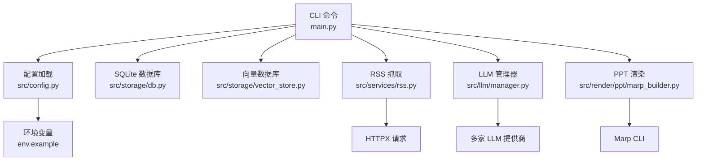
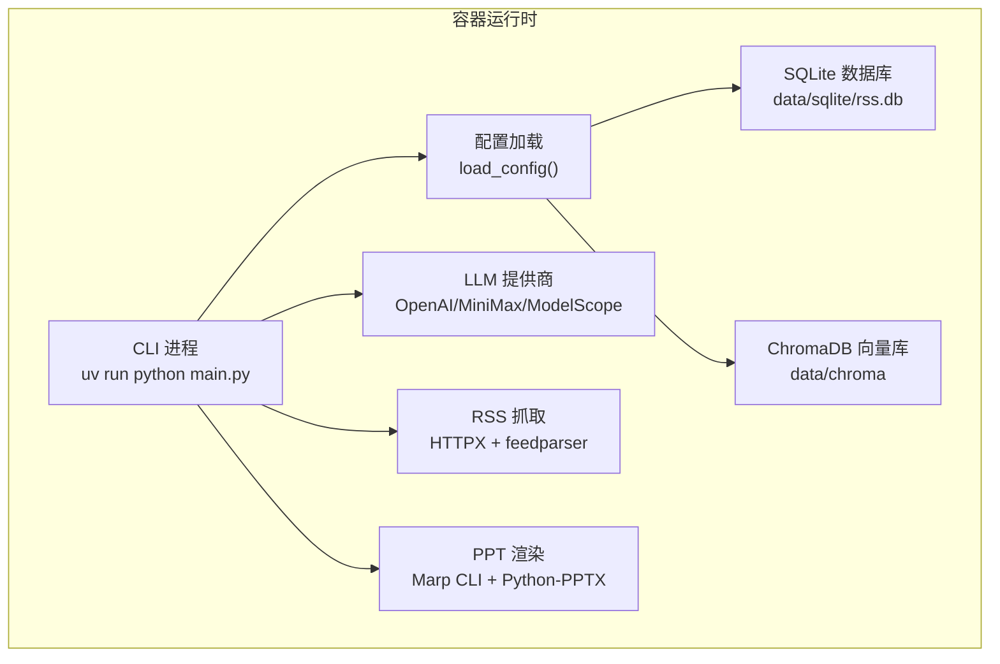
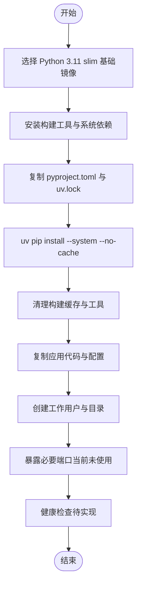
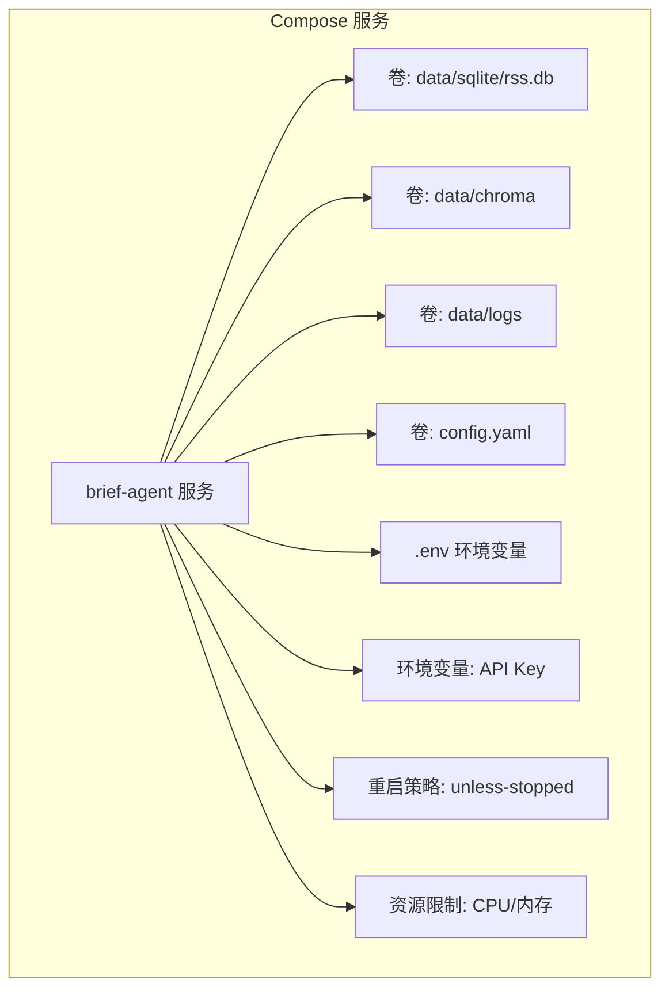
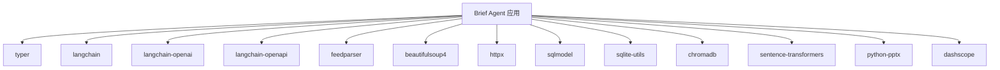

# 容器化部署

<cite>
**本文档引用的文件**
- [README.md](file://README.md)
- [config.yaml](file://config.yaml)
- [env.example](file://env.example)
- [pyproject.toml](file://pyproject.toml)
- [main.py](file://main.py)
- [src/config.py](file://src/config.py)
- [src/storage/db.py](file://src/storage/db.py)
- [src/storage/vector_store.py](file://src/storage/vector_store.py)
- [src/services/rss.py](file://src/services/rss.py)
- [src/llm/manager.py](file://src/llm/manager.py)
- [src/storage/logger.py](file://src/storage/logger.py)
- [src/render/ppt/marp_builder.py](file://src/render/ppt/marp_builder.py)
- [src/render/ppt/base.py](file://src/render/ppt/base.py)
- [uv.lock](file://uv.lock)
</cite>

## 目录
1. [简介](#简介)
2. [项目结构](#项目结构)
3. [核心组件](#核心组件)
4. [架构总览](#架构总览)
5. [详细组件分析](#详细组件分析)
6. [依赖关系分析](#依赖关系分析)
7. [性能考虑](#性能考虑)
8. [故障排除指南](#故障排除指南)
9. [结论](#结论)

## 简介
Brief Agent 是一个基于 LangGraph 的多模态内容自动生成与分发平台，支持 RSS 抓取、文章解析、报告生成、PPT 渲染等功能。本文档提供面向生产环境的容器化部署方案，涵盖 Dockerfile 编写、Docker Compose 配置、多阶段构建优化、网络与端口映射、健康检查与重启策略、资源限制与性能调优、以及日志收集与监控配置。

## 项目结构
Brief Agent 采用模块化设计，核心模块包括：
- CLI 入口与命令：通过 Typer 提供 fetch、parse、report、serve 等命令
- 配置系统：基于 Pydantic 的配置模型，支持 YAML 配置与环境变量注入
- 数据存储：SQLite（SQLModel）+ ChromaDB 向量数据库
- LLM 管理：统一接口封装多家大模型提供商
- RSS 服务：HTTPX + feedparser 抓取与解析
- 渲染层：Marp + Python-PPTX 生成 PPT

**图表来源**
- [main.py](file://main.py#L1-L227)
- [src/config.py](file://src/config.py#L1-L109)
- [src/storage/db.py](file://src/storage/db.py#L1-L251)
- [src/storage/vector_store.py](file://src/storage/vector_store.py#L1-L142)
- [src/services/rss.py](file://src/services/rss.py#L1-L123)
- [src/llm/manager.py](file://src/llm/manager.py#L1-L318)
- [src/render/ppt/marp_builder.py](file://src/render/ppt/marp_builder.py#L1-L94)

**章节来源**
- [README.md](file://README.md#L1-L265)
- [main.py](file://main.py#L1-L227)
- [src/config.py](file://src/config.py#L1-L109)

## 核心组件
- CLI 与命令：Typer 提供 fetch、parse、report、serve 命令；serve 当前占位未实现
- 配置系统：支持 YAML 配置文件与环境变量，自动替换 ${VAR} 引用
- 数据存储：SQLite 用于文章与报告元数据，ChromaDB 用于 RAG 向量检索
- LLM 管理：统一接口封装 MiniMax、ModelScope、DeepSeek
- RSS 服务：HTTPX + feedparser 抓取 RSS，BeautifulSoup 清洗 HTML
- 渲染层：Marp + Python-PPTX 生成 PPT，支持多种模板

**章节来源**
- [main.py](file://main.py#L66-L141)
- [src/config.py](file://src/config.py#L74-L109)
- [src/storage/db.py](file://src/storage/db.py#L65-L90)
- [src/storage/vector_store.py](file://src/storage/vector_store.py#L15-L35)
- [src/services/rss.py](file://src/services/rss.py#L15-L60)
- [src/llm/manager.py](file://src/llm/manager.py#L206-L241)
- [src/render/ppt/marp_builder.py](file://src/render/ppt/marp_builder.py#L21-L39)

## 架构总览
Brief Agent 的运行时由 CLI 驱动，通过配置加载器读取 YAML 与环境变量，访问 SQLite 和 ChromaDB，调用 LLM 提供商进行内容解析与生成，并通过渲染层输出报告与 PPT。

**图表来源**
- [main.py](file://main.py#L14-L26)
- [src/config.py](file://src/config.py#L74-L88)
- [config.yaml](file://config.yaml#L34-L40)
- [src/storage/db.py](file://src/storage/db.py#L68-L78)
- [src/storage/vector_store.py](file://src/storage/vector_store.py#L23-L31)
- [src/llm/manager.py](file://src/llm/manager.py#L243-L251)
- [src/services/rss.py](file://src/services/rss.py#L37-L39)
- [src/render/ppt/marp_builder.py](file://src/render/ppt/marp_builder.py#L40-L57)

## 详细组件分析

### Dockerfile 编写指南
- 基础镜像选择
  - 推荐使用官方 Python 3.11 slim 镜像作为基础，确保兼容性与体积平衡
  - 若需要渲染 PPT，需在镜像中安装 Marp CLI（npm），以便使用 marp-builder
- 依赖安装
  - 使用 uv（pyproject.toml + uv.lock）进行确定性安装，避免版本漂移
  - 在多阶段构建中，仅在构建阶段安装编译工具，最终镜像保持精简
- 应用配置
  - 设置工作目录与用户（非 root），提升安全性
  - 挂载数据目录（SQLite、ChromaDB、日志）以持久化
  - 配置环境变量文件（.env）与配置文件（config.yaml）的挂载点

**图表来源**
- [pyproject.toml](file://pyproject.toml#L1-L49)
- [uv.lock](file://uv.lock#L1-L619)

**章节来源**
- [pyproject.toml](file://pyproject.toml#L1-L49)
- [uv.lock](file://uv.lock#L1-L619)

### Docker Compose 配置
- 服务定义
  - brief-agent：运行 CLI 命令，支持定时任务与批处理
- 卷挂载
  - data/sqlite/rss.db：SQLite 数据库持久化
  - data/chroma：ChromaDB 向量库持久化
  - data/logs：日志文件持久化
  - config.yaml：配置文件挂载
  - .env：环境变量文件挂载
- 环境变量传递
  - 通过 environment 或 env_file 传递 API Key 与配置路径
- 网络与端口
  - 当前 CLI 不暴露端口，无需映射
- 健康检查与重启策略
  - 由于 serve 命令占位且未实现，建议使用 restart: unless-stopped 或 on-failure
- 资源限制
  - 通过 deploy.resources.limits 设置 CPU/内存上限，结合 LLM 调用频率控制

**图表来源**
- [config.yaml](file://config.yaml#L34-L47)
- [env.example](file://env.example#L4-L9)

**章节来源**
- [config.yaml](file://config.yaml#L34-L47)
- [env.example](file://env.example#L4-L9)

### 多阶段构建优化
- 目标
  - 减少镜像体积、降低攻击面、提升构建速度
- 策略
  - 第一阶段：安装构建工具与依赖，使用 uv 进行确定性安装
  - 第二阶段：仅复制运行时所需文件，最小化运行时镜像
  - 清理：移除构建缓存、临时文件与开发工具
- 安全性
  - 使用非 root 用户运行应用进程
  - 限制文件权限，避免敏感信息泄露

**章节来源**
- [pyproject.toml](file://pyproject.toml#L1-L49)
- [uv.lock](file://uv.lock#L1-L619)

### 容器网络与端口映射
- 现状
  - CLI 命令未实现 Web 服务，不暴露端口
- 建议
  - 如需扩展为 Web 服务，可在 main.py 中实现 serve 命令，绑定 host/port 参数
  - Compose 中映射端口并配置反向代理（Nginx/Traefik）

**章节来源**
- [main.py](file://main.py#L208-L217)

### 健康检查与重启策略
- 健康检查
  - 当前未实现健康检查，建议在 CLI 中增加轻量级探针（如 ping 数据库、检查配置）
- 重启策略
  - 推荐 restart: unless-stopped，保证服务在容器重启后自动恢复

**章节来源**
- [main.py](file://main.py#L208-L217)

### 容器资源限制与性能调优
- 资源限制
  - CPU/内存上限：根据 LLM 推理与数据库负载设置合理配额
  - I/O 限制：为 SQLite 与 ChromaDB 配置合适的磁盘 I/O
- 性能调优
  - SQLite：WAL 模式 + 连接超时，提升并发读写性能
  - LLM：批量推理线程池大小（ThreadPoolExecutor），避免过度并发导致限流
  - 渲染：Marp CLI 仅在存在时启用，避免阻塞主流程

**章节来源**
- [src/storage/db.py](file://src/storage/db.py#L72-L89)
- [src/llm/manager.py](file://src/llm/manager.py#L48-L62)
- [src/render/ppt/marp_builder.py](file://src/render/ppt/marp_builder.py#L40-L57)

### 日志收集与监控
- 日志配置
  - 使用 loguru 输出到文件与控制台，支持轮转与保留策略
- 监控建议
  - 结合 Prometheus/Grafana 监控容器指标（CPU/内存/IO）
  - 结合 OpenTelemetry 追踪 LLM 调用链路与延迟

**章节来源**
- [src/storage/logger.py](file://src/storage/logger.py#L8-L38)
- [config.yaml](file://config.yaml#L42-L47)

## 依赖关系分析
Brief Agent 的依赖主要来自 pyproject.toml 与 uv.lock，核心依赖包括：
- CLI：typer
- LLM：langchain、langchain-openai、langchain-openapi、openai
- RSS：feedparser、beautifulsoup4、httpx
- 数据库：sqlmodel、sqlite-utils、chromadb、sentence-transformers
- 渲染：python-pptx、dashscope

**图表来源**
- [pyproject.toml](file://pyproject.toml#L7-L29)
- [uv.lock](file://uv.lock#L270-L332)

**章节来源**
- [pyproject.toml](file://pyproject.toml#L1-L49)
- [uv.lock](file://uv.lock#L270-L332)

## 性能考虑
- 数据库性能
  - SQLite 启用 WAL 模式与连接超时，支持并发读写
  - ChromaDB 使用持久化客户端，减少启动开销
- LLM 调用
  - 批量推理使用线程池，避免频繁创建线程
  - JSON 模式与流式生成按需启用，降低延迟
- 渲染性能
  - Marp CLI 仅在可用时启用，避免阻塞主流程
  - 模板样式预加载，减少渲染时间

**章节来源**
- [src/storage/db.py](file://src/storage/db.py#L72-L89)
- [src/storage/vector_store.py](file://src/storage/vector_store.py#L23-L31)
- [src/llm/manager.py](file://src/llm/manager.py#L48-L62)
- [src/render/ppt/marp_builder.py](file://src/render/ppt/marp_builder.py#L40-L57)

## 故障排除指南
- 配置加载失败
  - 检查 config.yaml 与 .env 是否正确挂载，确认环境变量替换逻辑
- 数据库连接问题
  - 确认 data/sqlite/rss.db 卷权限与路径
- 向量库初始化失败
  - 检查 data/chroma 权限与磁盘空间
- LLM 调用错误
  - 核对 API Key 与提供商配置，检查网络连通性
- 渲染失败
  - 确认 Marp CLI 是否安装，模板文件是否存在

**章节来源**
- [src/config.py](file://src/config.py#L74-L109)
- [src/storage/db.py](file://src/storage/db.py#L68-L78)
- [src/storage/vector_store.py](file://src/storage/vector_store.py#L23-L31)
- [src/llm/manager.py](file://src/llm/manager.py#L253-L295)
- [src/render/ppt/marp_builder.py](file://src/render/ppt/marp_builder.py#L40-L57)

## 结论
Brief Agent 的容器化部署应围绕“最小化运行时、确定性依赖、持久化数据与可观测性”展开。通过多阶段构建减小镜像体积，结合 Docker Compose 的卷与环境变量管理，配合资源限制与健康检查策略，可实现稳定高效的生产部署。未来可扩展 Web 服务与监控体系，进一步提升可观测性与运维效率。