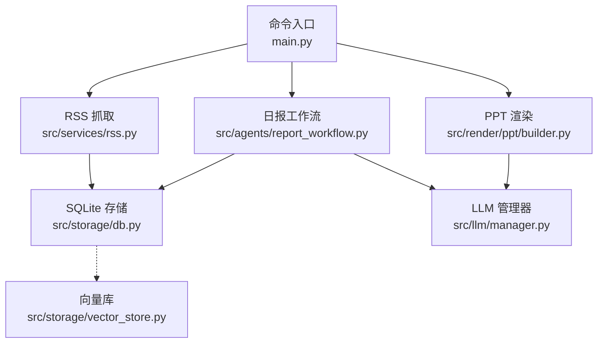
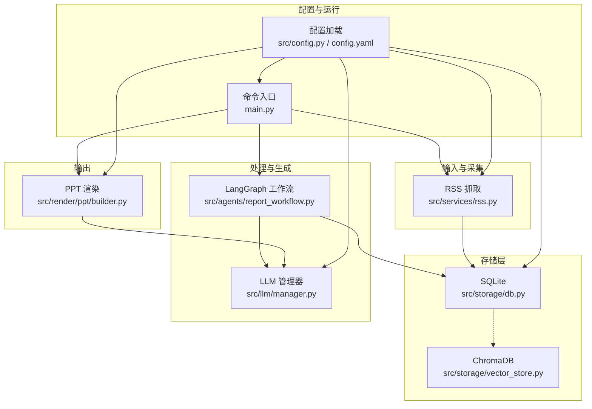
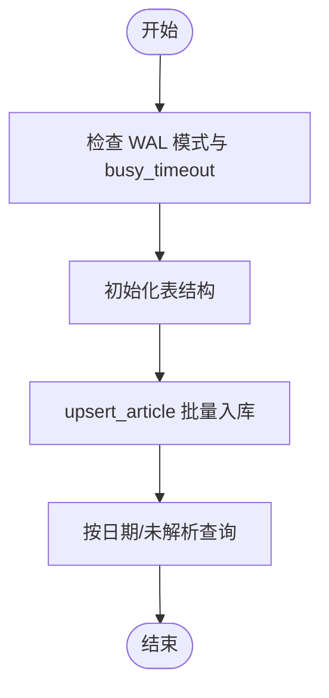
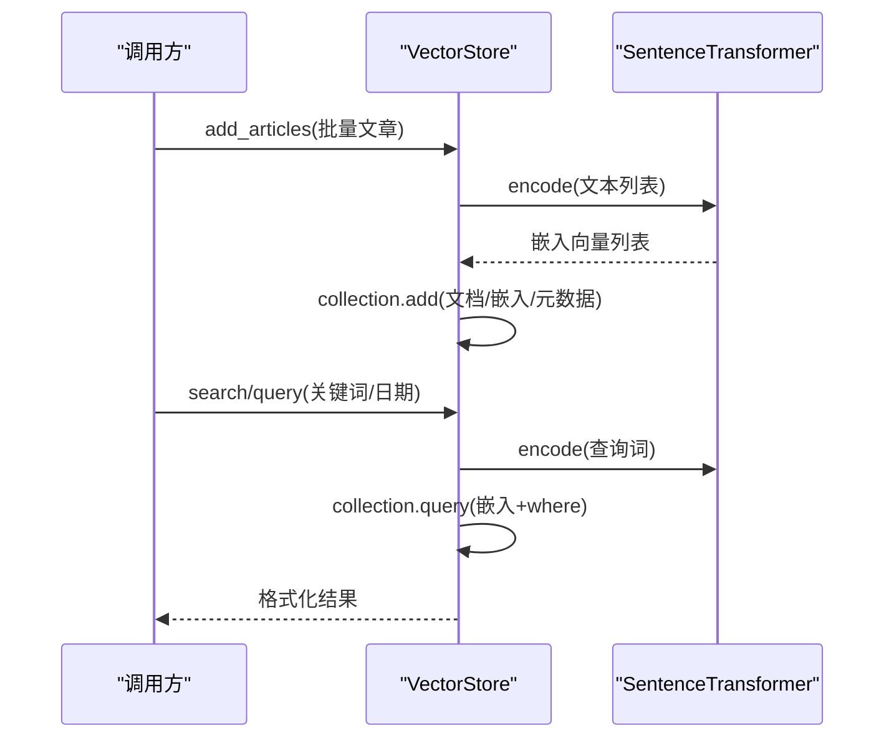
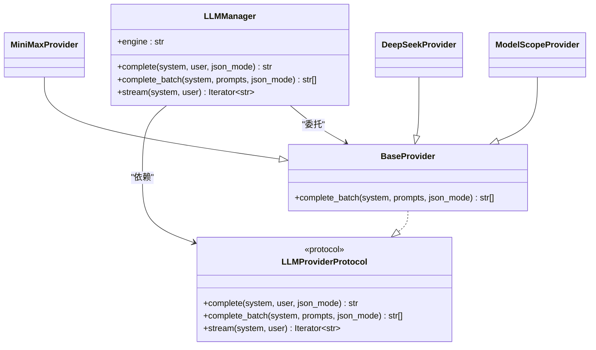
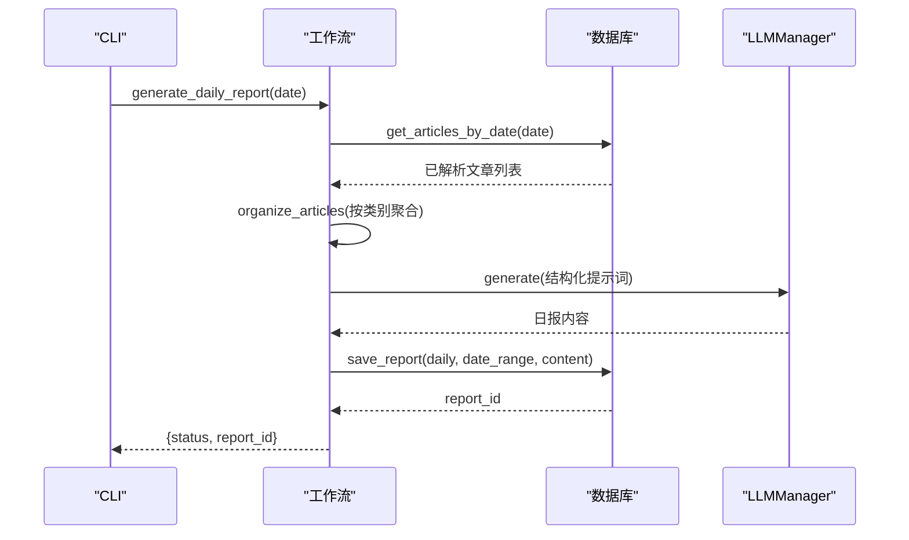
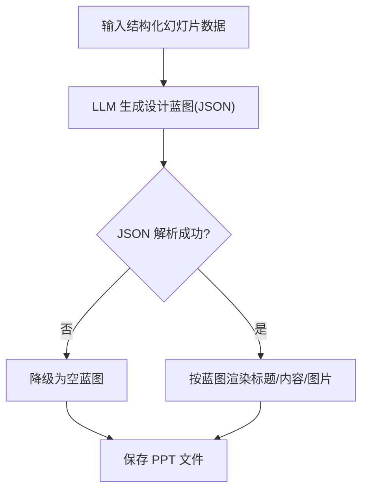
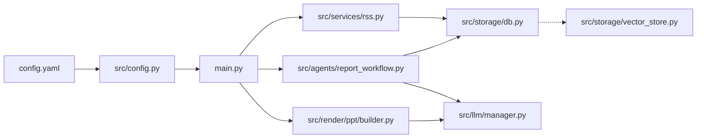

# 性能优化

<cite>
**本文引用的文件**
- [main.py](file://main.py)
- [config.yaml](file://config.yaml)
- [src/config.py](file://src/config.py)
- [src/storage/db.py](file://src/storage/db.py)
- [src/storage/vector_store.py](file://src/storage/vector_store.py)
- [src/llm/manager.py](file://src/llm/manager.py)
- [src/services/rss.py](file://src/services/rss.py)
- [src/agents/report_workflow.py](file://src/agents/report_workflow.py)
- [src/render/ppt/builder.py](file://src/render/ppt/builder.py)
- [scripts/migrate_db.py](file://scripts/migrate_db.py)
- [pyproject.toml](file://pyproject.toml)
- [uv.toml](file://uv.toml)
</cite>

## 目录
1. [简介](#简介)
2. [项目结构](#项目结构)
3. [核心组件](#核心组件)
4. [架构总览](#架构总览)
5. [详细组件分析](#详细组件分析)
6. [依赖关系分析](#依赖关系分析)
7. [性能考虑与优化建议](#性能考虑与优化建议)
8. [故障排查指南](#故障排查指南)
9. [结论](#结论)
10. [附录](#附录)

## 简介
本指南面向 Brief Agent 的性能优化，聚焦以下方面：
- 系统性能瓶颈识别与分析方法
- 数据库查询优化与索引策略
- LLM Provider 的并发与缓存调优
- 内存使用与垃圾回收配置建议
- 网络请求优化与超时设置
- 磁盘 I/O 优化与文件系统配置
- 进程/线程池配置优化
- 缓存策略设计与实现
- 性能监控指标与分析方法
- 负载与压力测试执行指南

## 项目结构
Brief Agent 采用模块化分层设计：命令入口负责 CLI 生命周期；RSS 抓取与解析链路负责数据采集；LangGraph 工作流负责结构化生成；PPT 渲染负责输出；存储层包含 SQLite 与向量库；LLM 管理器负责多 Provider 调度。

**图表来源**
- [main.py](file://main.py#L66-L141)
- [src/services/rss.py](file://src/services/rss.py#L15-L61)
- [src/storage/db.py](file://src/storage/db.py#L65-L94)
- [src/agents/report_workflow.py](file://src/agents/report_workflow.py#L186-L237)
- [src/llm/manager.py](file://src/llm/manager.py#L206-L318)
- [src/render/ppt/builder.py](file://src/render/ppt/builder.py#L22-L151)
- [src/storage/vector_store.py](file://src/storage/vector_store.py#L15-L35)

**章节来源**
- [main.py](file://main.py#L1-L227)
- [src/services/rss.py](file://src/services/rss.py#L1-L123)
- [src/storage/db.py](file://src/storage/db.py#L1-L251)
- [src/agents/report_workflow.py](file://src/agents/report_workflow.py#L1-L266)
- [src/llm/manager.py](file://src/llm/manager.py#L1-L318)
- [src/render/ppt/builder.py](file://src/render/ppt/builder.py#L1-L194)
- [src/storage/vector_store.py](file://src/storage/vector_store.py#L1-L142)

## 核心组件
- 命令入口与 CLI 生命周期：负责日志初始化、子命令分发与 PPT 生成流程。
- RSS 抓取与解析：HTTP 请求、RSS 解析、HTML 清洗、批量入库。
- 数据库层：SQLModel + SQLite，WAL 模式与超时配置，支持并发读写。
- 向量库：ChromaDB + SentenceTransformer，用于 RAG 搜索。
- LLM 管理器：统一 Provider 接口，支持批量与流式推理，内置线程池。
- 日报工作流：LangGraph 状态机，串联收集、组织、生成、保存。
- PPT 渲染：基于 LLM 的设计蓝图与 python-pptx 的直绘。

**章节来源**
- [main.py](file://main.py#L54-L188)
- [src/services/rss.py](file://src/services/rss.py#L15-L108)
- [src/storage/db.py](file://src/storage/db.py#L65-L94)
- [src/storage/vector_store.py](file://src/storage/vector_store.py#L15-L35)
- [src/llm/manager.py](file://src/llm/manager.py#L206-L318)
- [src/agents/report_workflow.py](file://src/agents/report_workflow.py#L186-L237)
- [src/render/ppt/builder.py](file://src/render/ppt/builder.py#L22-L151)

## 架构总览

**图表来源**
- [src/services/rss.py](file://src/services/rss.py#L15-L61)
- [src/storage/db.py](file://src/storage/db.py#L65-L94)
- [src/storage/vector_store.py](file://src/storage/vector_store.py#L15-L35)
- [src/agents/report_workflow.py](file://src/agents/report_workflow.py#L186-L237)
- [src/llm/manager.py](file://src/llm/manager.py#L206-L318)
- [src/render/ppt/builder.py](file://src/render/ppt/builder.py#L22-L151)
- [src/config.py](file://src/config.py#L74-L88)
- [config.yaml](file://config.yaml#L1-L54)
- [main.py](file://main.py#L14-L22)

## 详细组件分析

### 数据库层（SQLite + SQLModel）
- WAL 模式与 busy_timeout：提升并发读写能力，减少锁等待。
- 事务与批量写入：upsert_article/save_analysis 采用单事务提交，降低写放大。
- 查询路径：get_articles_by_date/get_unparsed_articles 使用子查询与限制，避免全表扫描。
- 建议索引（见“性能考虑”）：对高频过滤字段建立索引，如 published_at、url、tags 等。

**图表来源**
- [src/storage/db.py](file://src/storage/db.py#L65-L94)
- [src/storage/db.py](file://src/storage/db.py#L97-L123)
- [src/storage/db.py](file://src/storage/db.py#L147-L165)

**章节来源**
- [src/storage/db.py](file://src/storage/db.py#L65-L251)

### 向量库（ChromaDB + SentenceTransformer）
- 文档嵌入：标题+摘要拼接，SentenceTransformer 编码。
- 批量添加：一次编码与批量 add，降低网络往返。
- 查询：按关键词编码，支持 where 条件过滤与日期范围过滤。

**图表来源**
- [src/storage/vector_store.py](file://src/storage/vector_store.py#L36-L78)
- [src/storage/vector_store.py](file://src/storage/vector_store.py#L80-L115)

**章节来源**
- [src/storage/vector_store.py](file://src/storage/vector_store.py#L1-L142)

### LLM 管理器（Provider 统一调度）
- Provider 协议：complete/complete_batch/stream 三类接口。
- 批量推理：ThreadPoolExecutor(max_workers=10) 统一实现，便于扩展。
- Provider 实现：MiniMax/DeepSeek/ModelScope，分别适配 OpenAI 兼容与原生接口。
- 流式生成：部分 Provider 支持，注意客户端流式消费。

**图表来源**
- [src/llm/manager.py](file://src/llm/manager.py#L22-L63)
- [src/llm/manager.py](file://src/llm/manager.py#L106-L158)
- [src/llm/manager.py](file://src/llm/manager.py#L160-L202)
- [src/llm/manager.py](file://src/llm/manager.py#L206-L318)

**章节来源**
- [src/llm/manager.py](file://src/llm/manager.py#L1-L318)

### 日报工作流（LangGraph）
- 状态机：collect → organize → generate → save。
- 数据来源：数据库中已解析文章，按 category 组织。
- LLM 生成：将组织后的文章汇总为提示词，生成结构化日报。
- 保存：写入 reports 表，返回 report_id。

**图表来源**
- [src/agents/report_workflow.py](file://src/agents/report_workflow.py#L186-L237)
- [src/agents/report_workflow.py](file://src/agents/report_workflow.py#L46-L92)
- [src/agents/report_workflow.py](file://src/agents/report_workflow.py#L95-L160)
- [src/agents/report_workflow.py](file://src/agents/report_workflow.py#L163-L181)

**章节来源**
- [src/agents/report_workflow.py](file://src/agents/report_workflow.py#L1-L266)

### PPT 渲染（DirectPPBuilder）
- 设计蓝图：LLM 将旁白转为 JSON 设计蓝图（标题、内容元素、图片位置）。
- 直绘：python-pptx 按蓝图渲染，支持图片插入与备注。
- 性能关注：LLM 调用次数与提示词长度，建议缓存蓝图或复用中间结果。

**图表来源**
- [src/render/ppt/builder.py](file://src/render/ppt/builder.py#L75-L84)
- [src/render/ppt/builder.py](file://src/render/ppt/builder.py#L128-L151)

**章节来源**
- [src/render/ppt/builder.py](file://src/render/ppt/builder.py#L1-L194)

### RSS 抓取（并发与超时）
- HTTP 客户端：httpx.Client(timeout=配置)，follow_redirects。
- RSS 解析：feedparser，异常记录。
- 批量入库：逐条 upsert_article，建议改为批量事务以减少开销。

**章节来源**
- [src/services/rss.py](file://src/services/rss.py#L34-L61)

## 依赖关系分析
- 配置来源：config.yaml 与 src/config.py，支持环境变量替换。
- 依赖管理：pyproject.toml 指定核心依赖，uv.toml 指定镜像源。
- 存储与向量：SQLModel/SQLite 与 ChromaDB/SentenceTransformer。
- LLM：OpenAI 兼容（DeepSeek/ModelScope）与原生接口（MiniMax）。

**图表来源**
- [config.yaml](file://config.yaml#L1-L54)
- [src/config.py](file://src/config.py#L74-L88)
- [main.py](file://main.py#L14-L22)
- [src/services/rss.py](file://src/services/rss.py#L15-L61)
- [src/storage/db.py](file://src/storage/db.py#L65-L94)
- [src/agents/report_workflow.py](file://src/agents/report_workflow.py#L186-L237)
- [src/llm/manager.py](file://src/llm/manager.py#L206-L318)
- [src/render/ppt/builder.py](file://src/render/ppt/builder.py#L22-L151)
- [src/storage/vector_store.py](file://src/storage/vector_store.py#L15-L35)

**章节来源**
- [config.yaml](file://config.yaml#L1-L54)
- [src/config.py](file://src/config.py#L1-L109)
- [pyproject.toml](file://pyproject.toml#L1-L49)
- [uv.toml](file://uv.toml#L1-L4)

## 性能考虑与优化建议

### 1. 系统性能瓶颈识别与分析方法
- CPU 密集：向量嵌入（SentenceTransformer）、LLM 推理、PPT 渲染。
- I/O 密集：RSS 网络请求、SQLite 写入、ChromaDB 持久化。
- 内存热点：批量文章对象、嵌入向量、LLM 响应累积。
- 建议工具：cProfile、py-spy、memory_profiler、perfetto、pprof（Go/uvloop 仅用于 CPython 扩展场景）。

[本节为通用指导，无需特定文件来源]

### 2. 数据库查询优化与索引策略
- 当前实现优势
  - WAL 模式与 busy_timeout 已开启，提升并发读写稳定性。
  - upsert/save_analysis 使用单事务提交，减少写放大。
- 查询路径优化
  - get_articles_by_date：按 published_at 降序 + limit，建议在 published_at 建立索引。
  - get_unparsed_articles：not_in 子查询可能产生全表扫描，建议在 article_analysis.article_id 建索引，或改用 LEFT JOIN 并 WHERE ISNULL。
  - get_articles：条件过滤 + 限制，建议对 url/tags 等常用过滤字段建立索引。
- 批量写入
  - RSS 抓取入库：逐条 upsert，建议改为批量事务（一次性 commit），减少锁竞争。
- 迁移与兼容
  - scripts/migrate_db.py 展示了 SQLModel 初始化与旧数据迁移，建议在迁移后重建缺失索引。

**章节来源**
- [src/storage/db.py](file://src/storage/db.py#L84-L94)
- [src/storage/db.py](file://src/storage/db.py#L147-L165)
- [scripts/migrate_db.py](file://scripts/migrate_db.py#L15-L91)

### 3. LLM Provider 的性能调优（并发与缓存）
- 并发处理
  - LLMManager.BaseProvider 使用 ThreadPoolExecutor(max_workers=10) 统一实现批量推理，适合 CPU 友好型任务；若 Provider 调用为 IO 密集，可按 Provider 自定义线程池大小。
  - 建议：根据 Provider 的 QPS 与延迟，动态调整 max_workers；对长文本分块并行处理。
- 缓存策略
  - Prompt 缓存：对相同输入的结构化提示词进行哈希缓存，避免重复 LLM 调用。
  - 嵌入缓存：对重复文章标题/摘要的嵌入结果进行本地缓存（如 pickle 或 Redis）。
  - PPT 设计蓝图缓存：对同一脚本生成的蓝图进行缓存，避免重复 LLM 调用。
- 超时与重试
  - 在 LLMProvider 中增加请求超时与指数退避重试，避免雪崩。
- 流式生成
  - 对支持流式的 Provider（如 DeepSeek/ModelScope）启用流式消费，降低首字延迟。

**章节来源**
- [src/llm/manager.py](file://src/llm/manager.py#L44-L63)
- [src/llm/manager.py](file://src/llm/manager.py#L67-L104)
- [src/llm/manager.py](file://src/llm/manager.py#L162-L202)

### 4. 内存使用优化与垃圾回收配置
- 向量嵌入：批量编码后及时释放中间变量，避免大对象长期驻留。
- 文本处理：BeautifulSoup 清洗 HTML 后尽快丢弃临时字符串。
- LLM 响应：分块消费流式响应，避免一次性拼接大字符串。
- 垃圾回收：生产环境可适当降低 gc.set_threshold，缩短 GC 周期，减少峰值内存占用。

**章节来源**
- [src/services/rss.py](file://src/services/rss.py#L102-L107)
- [src/storage/vector_store.py](file://src/storage/vector_store.py#L56-L78)

### 5. 网络请求优化与超时设置
- RSS 抓取：httpx.Client(timeout=配置)，建议为不同 Provider 设置合理的超时与并发上限。
- LLM Provider：为 OpenAI 兼容与原生接口分别设置超时与重试，避免阻塞。
- DNS 与连接池：复用 httpx.Client，避免频繁握手。

**章节来源**
- [src/services/rss.py](file://src/services/rss.py#L37-L42)
- [src/llm/manager.py](file://src/llm/manager.py#L70-L77)
- [src/llm/manager.py](file://src/llm/manager.py#L165-L174)

### 6. 磁盘 I/O 优化与文件系统配置
- SQLite：WAL 模式已启用，建议使用 SSD；合理设置 busy_timeout；避免小事务频繁提交。
- ChromaDB：持久化目录与日志分离，确保磁盘空间充足；定期 compact 与清理。
- PPT 输出：输出目录提前创建，避免运行时权限与路径开销。

**章节来源**
- [src/storage/db.py](file://src/storage/db.py#L84-L94)
- [src/storage/vector_store.py](file://src/storage/vector_store.py#L18-L31)
- [src/render/ppt/builder.py](file://src/render/ppt/builder.py#L149-L151)

### 7. 进程池与线程池配置优化
- 当前：BaseProvider 使用固定线程池（max_workers=10），适合中小规模批量。
- 建议：根据 CPU 核心数与任务类型（CPU vs IO）动态调整；对 IO 密集型任务可提高线程数；对 CPU 密集型任务可使用进程池（concurrent.futures.ProcessPoolExecutor）。

**章节来源**
- [src/llm/manager.py](file://src/llm/manager.py#L57-L62)

### 8. 缓存策略设计与实现
- 结构化缓存
  - Prompt 缓存：对系统提示 + 用户提示的哈希作为键，值为 LLM 响应。
  - 嵌入缓存：对标题+摘要的哈希映射到向量，避免重复编码。
  - PPT 蓝图缓存：对脚本的哈希映射到蓝图 JSON。
- 缓存介质
  - 本地：pickle/shelve；Redis/Memcached（可选）。
  - 失效策略：TTL + LRU；对热点数据可常驻。
- 命中率监控：统计缓存命中率，动态调整缓存大小与淘汰策略。

**章节来源**
- [src/render/ppt/builder.py](file://src/render/ppt/builder.py#L75-L84)
- [src/storage/vector_store.py](file://src/storage/vector_store.py#L36-L54)

### 9. 性能监控指标与分析方法
- 指标建议
  - 数据库：查询耗时（p50/p95）、事务提交次数、WAL checkpoint 频率。
  - LLM：请求耗时、Token 使用量、错误率、缓存命中率。
  - 网络：DNS 解析时间、TLS 握手时间、传输时间。
  - I/O：磁盘读写速率、文件句柄数、ChromaDB compaction 时间。
- 分析方法
  - 使用日志埋点（info/warning/error）与结构化字段（duration/ms、status、provider）。
  - 使用性能剖析工具定位热点函数与内存分配点。
  - 压力测试后对比基线与优化后的指标变化。

**章节来源**
- [src/services/rss.py](file://src/services/rss.py#L30-L32)
- [src/agents/report_workflow.py](file://src/agents/report_workflow.py#L58-L61)

### 10. 负载测试与压力测试执行指南
- 测试目标
  - RSS 抓取：模拟 N 个源，验证吞吐与延迟。
  - 日报生成：模拟 M 篇已解析文章，验证工作流吞吐。
  - LLM 调用：模拟并发请求，观察延迟与错误率。
- 执行步骤
  - 准备数据：使用 scripts/migrate_db.py 初始化表结构与样本数据。
  - 基线测试：记录未优化状态下的指标。
  - 逐项优化：针对瓶颈逐一实施优化，记录指标变化。
  - 回归测试：对比优化前后指标，确认收益与回归。
- 工具建议
  - Locust/JMeter（HTTP/CLI 场景）
  - pytest-benchmark（Python 代码级基准）
  - perf/htop/iostat/iotop（系统级观测）

**章节来源**
- [scripts/migrate_db.py](file://scripts/migrate_db.py#L15-L91)
- [config.yaml](file://config.yaml#L24-L31)

## 故障排查指南
- RSS 抓取失败
  - 检查 timeout 与 follow_redirects；查看 httpx 异常日志。
- LLM 调用异常
  - 检查 API Key、base_url、模型名称；增加超时与重试。
- 数据库锁/超时
  - 检查 busy_timeout；确认事务大小；避免长时间持有锁。
- 向量库查询慢
  - 检查集合数量与索引；确认嵌入模型版本一致。
- PPT 渲染失败
  - 检查 LLM 蓝图 JSON 解析；确认 python-pptx 版本兼容。

**章节来源**
- [src/services/rss.py](file://src/services/rss.py#L37-L48)
- [src/llm/manager.py](file://src/llm/manager.py#L70-L77)
- [src/storage/db.py](file://src/storage/db.py#L84-L94)
- [src/storage/vector_store.py](file://src/storage/vector_store.py#L80-L96)
- [src/render/ppt/builder.py](file://src/render/ppt/builder.py#L79-L83)

## 结论
Brief Agent 的性能优化应围绕“数据库并发、LLM 调用、I/O 与缓存”三大方向展开。通过 WAL 模式、批量事务、Prompt/嵌入/PPT 蓝图缓存、线程池与超时配置等手段，可在保证正确性的前提下显著提升吞吐与降低延迟。建议以指标驱动持续优化，并结合压力测试验证效果。

[本节为总结性内容，无需特定文件来源]

## 附录
- 配置参考
  - LLM Provider：default 与 providers 字段，支持 minimax/modelscope/deepseek。
  - RSS：feeds、fetch_interval、timeout。
  - Database/VectorDB：路径与集合名。
  - Logging：级别、轮转大小与保留天数。
- 依赖清单
  - 核心依赖：typer、langgraph、langchain、feedparser、requests/httpx、sqlite-utils、chromadb、sentence-transformers、apscheduler、loguru、pydantic、dashscope、python-pptx 等。

**章节来源**
- [config.yaml](file://config.yaml#L1-L54)
- [src/config.py](file://src/config.py#L14-L72)
- [pyproject.toml](file://pyproject.toml#L1-L49)