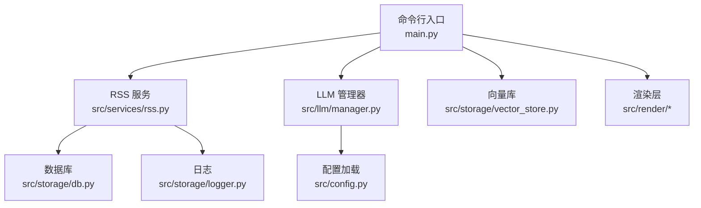
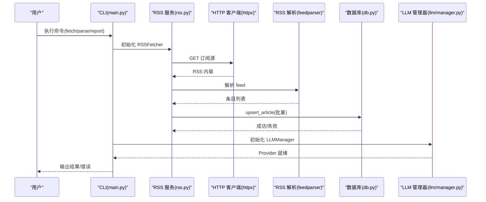
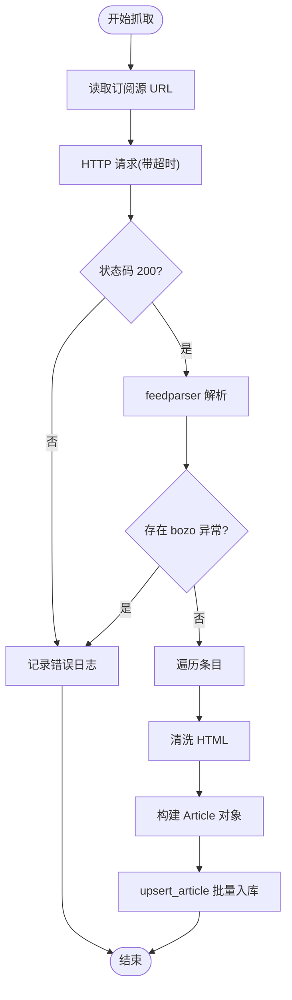
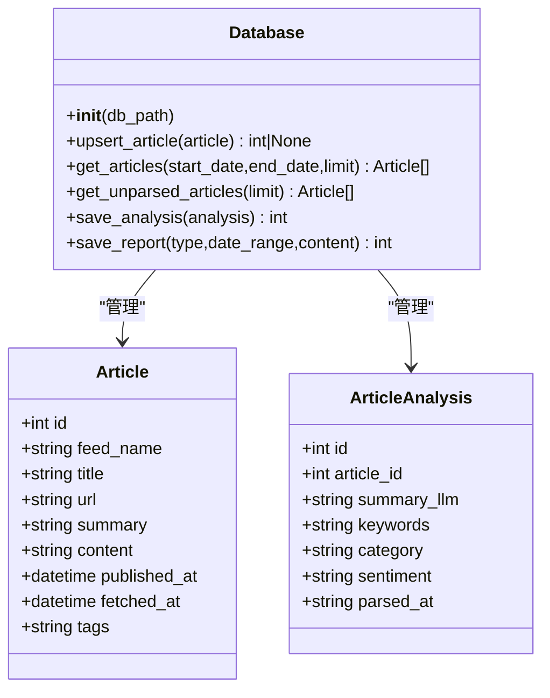
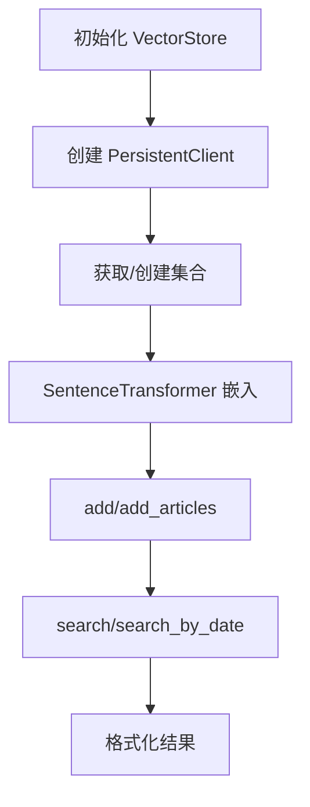
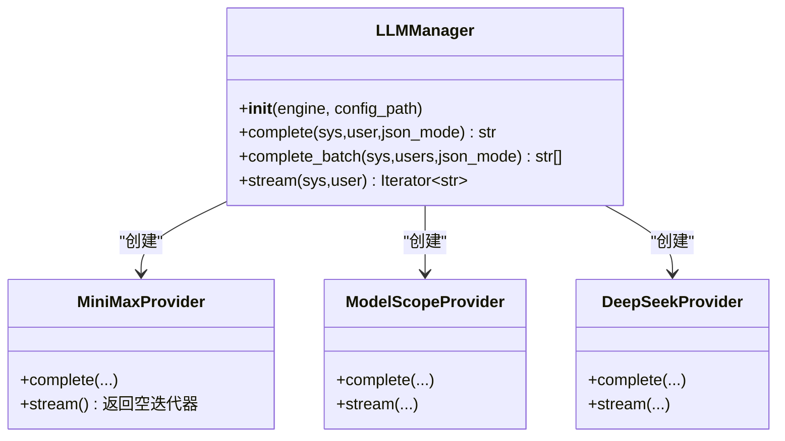
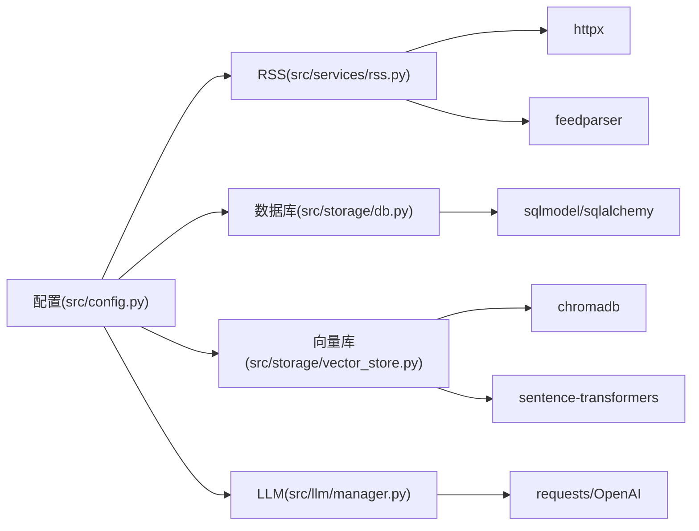

# 故障排除

<cite>
**本文引用的文件**
- [README.md](file://README.md)
- [config.yaml](file://config.yaml)
- [src/config.py](file://src/config.py)
- [src/storage/db.py](file://src/storage/db.py)
- [src/storage/vector_store.py](file://src/storage/vector_store.py)
- [src/services/rss.py](file://src/services/rss.py)
- [src/storage/logger.py](file://src/storage/logger.py)
- [src/llm/manager.py](file://src/llm/manager.py)
- [src/models/llm/manager.py](file://src/models/llm/manager.py)
- [main.py](file://main.py)
- [scripts/migrate_db.py](file://scripts/migrate_db.py)
</cite>

## 目录
1. [简介](#简介)
2. [项目结构](#项目结构)
3. [核心组件](#核心组件)
4. [架构总览](#架构总览)
5. [详细组件分析](#详细组件分析)
6. [依赖关系分析](#依赖关系分析)
7. [性能考量](#性能考量)
8. [故障排除指南](#故障排除指南)
9. [结论](#结论)
10. [附录](#附录)

## 简介
本手册面向 Brief Agent 的运维与开发人员，提供系统性故障排除流程与解决方案，覆盖 RSS 抓取失败、LLM 调用错误、数据库与向量存储问题、日志分析与错误定位、网络与 API 调用问题、容器化部署常见问题、紧急故障应急响应、故障预防与风险控制以及故障报告与问题跟踪流程。

## 项目结构
Brief Agent 采用模块化分层设计：命令行入口负责调度；服务层负责业务流程（RSS 抓取、报告生成）；存储层负责数据库与日志；模型层封装 LLM Provider；渲染层负责输出。

图表来源
- [main.py](file://main.py#L1-L227)
- [src/services/rss.py](file://src/services/rss.py#L1-L123)
- [src/storage/db.py](file://src/storage/db.py#L1-L251)
- [src/storage/vector_store.py](file://src/storage/vector_store.py#L1-L142)
- [src/storage/logger.py](file://src/storage/logger.py#L1-L39)
- [src/llm/manager.py](file://src/llm/manager.py#L1-L318)
- [src/config.py](file://src/config.py#L1-L109)

章节来源
- [README.md](file://README.md#L87-L148)
- [main.py](file://main.py#L1-L227)

## 核心组件
- 配置系统：集中管理 LLM Provider、RSS、数据库、向量库、日志与调度配置，并支持环境变量替换。
- RSS 服务：基于 feedparser 与 httpx 抓取订阅源，解析条目并入库。
- 数据库存储：基于 SQLModel 的 SQLite 管理，WAL 模式提升并发；提供文章、解析结果、报告等表。
- 向量存储：基于 ChromaDB 的持久化集合，SentenceTransformer 嵌入。
- LLM 管理器：统一接口，支持 MiniMax、ModelScope、DeepSeek，支持批量与流式。
- 日志系统：基于 loguru，支持文件轮转与控制台输出。
- CLI：提供 fetch、parse、report 等子命令，便于排障与验证。

章节来源
- [src/config.py](file://src/config.py#L74-L109)
- [config.yaml](file://config.yaml#L1-L54)
- [src/services/rss.py](file://src/services/rss.py#L1-L123)
- [src/storage/db.py](file://src/storage/db.py#L65-L251)
- [src/storage/vector_store.py](file://src/storage/vector_store.py#L1-L142)
- [src/llm/manager.py](file://src/llm/manager.py#L206-L318)
- [src/storage/logger.py](file://src/storage/logger.py#L8-L39)
- [main.py](file://main.py#L66-L141)

## 架构总览

图表来源
- [main.py](file://main.py#L66-L141)
- [src/services/rss.py](file://src/services/rss.py#L22-L60)
- [src/storage/db.py](file://src/storage/db.py#L97-L122)
- [src/llm/manager.py](file://src/llm/manager.py#L243-L296)

## 详细组件分析

### RSS 抓取组件
- 关键点：超时控制、HTTP 错误捕获、RSS 解析异常、HTML 清洗、批量入库。
- 常见问题：网络超时、订阅源不可达、RSS 格式异常、HTML 解析失败。
- 排查步骤：检查 RSS 配置、网络连通性、超时设置、日志错误堆栈。

图表来源
- [src/services/rss.py](file://src/services/rss.py#L22-L60)
- [src/storage/db.py](file://src/storage/db.py#L97-L122)

章节来源
- [src/services/rss.py](file://src/services/rss.py#L1-L123)
- [src/storage/db.py](file://src/storage/db.py#L97-L122)

### 数据库组件
- 关键点：WAL 模式、busy_timeout、事务提交、唯一约束冲突处理。
- 常见问题：锁等待超时、唯一键冲突、并发写入竞争。
- 排查步骤：检查 WAL 是否启用、连接超时、唯一键冲突日志、表结构一致性。

图表来源
- [src/storage/db.py](file://src/storage/db.py#L14-L62)

章节来源
- [src/storage/db.py](file://src/storage/db.py#L65-L251)

### 向量存储组件
- 关键点：ChromaDB 持久化、集合创建、SentenceTransformer 嵌入、查询过滤。
- 常见问题：嵌入模型加载失败、集合元数据缺失、查询超时。
- 排查步骤：确认嵌入模型可用、集合存在且元数据正确、磁盘空间充足。

图表来源
- [src/storage/vector_store.py](file://src/storage/vector_store.py#L18-L142)

章节来源
- [src/storage/vector_store.py](file://src/storage/vector_store.py#L1-L142)

### LLM 管理器组件
- 关键点：Provider 选择、API Key 校验、批量与流式接口、回退到环境变量。
- 常见问题：API Key 缺失、Provider 不可用、响应为空、流式不支持。
- 排查步骤：检查配置文件与环境变量、Provider 端点可达性、响应格式。

图表来源
- [src/llm/manager.py](file://src/llm/manager.py#L206-L318)

章节来源
- [src/llm/manager.py](file://src/llm/manager.py#L1-L318)
- [src/models/llm/manager.py](file://src/models/llm/manager.py#L1-L318)

### 日志与 CLI
- 关键点：日志轮转、控制台输出、命令行参数解析。
- 常见问题：日志文件不可写、路径不存在、命令参数错误。
- 排查步骤：检查日志路径权限、轮转策略、命令帮助与参数。

章节来源
- [src/storage/logger.py](file://src/storage/logger.py#L8-L39)
- [main.py](file://main.py#L54-L141)

## 依赖关系分析

图表来源
- [src/config.py](file://src/config.py#L74-L109)
- [src/services/rss.py](file://src/services/rss.py#L4-L12)
- [src/llm/manager.py](file://src/llm/manager.py#L67-L104)
- [src/storage/vector_store.py](file://src/storage/vector_store.py#L7-L9)
- [src/storage/db.py](file://src/storage/db.py#L8-L9)

章节来源
- [src/config.py](file://src/config.py#L74-L109)
- [config.yaml](file://config.yaml#L1-L54)

## 性能考量
- 数据库：启用 WAL 模式与 busy_timeout，避免锁竞争；批量入库减少事务次数。
- LLM：批量推理使用线程池，合理设置并发；流式生成按 Provider 支持情况使用。
- RSS：合理设置超时与重试；解析 HTML 时注意内容长度截断。
- 向量库：批量添加与查询，避免频繁小批量操作；确保嵌入模型缓存命中。

章节来源
- [src/storage/db.py](file://src/storage/db.py#L72-L90)
- [src/llm/manager.py](file://src/llm/manager.py#L48-L62)
- [src/services/rss.py](file://src/services/rss.py#L37-L42)
- [src/storage/vector_store.py](file://src/storage/vector_store.py#L56-L78)

## 故障排除指南

### 通用排障流程
- 明确症状与影响范围（RSS、LLM、数据库、向量库、渲染）。
- 检查日志：定位错误发生阶段与异常类型。
- 验证配置：确认 config.yaml 与环境变量一致。
- 验证网络：订阅源可达性、Provider 端点连通性。
- 逐层隔离：先 CLI 验证，再服务层与存储层验证。

章节来源
- [src/storage/logger.py](file://src/storage/logger.py#L8-L39)
- [main.py](file://main.py#L54-L141)

### RSS 抓取失败
- 症状：抓取数量为 0、日志出现 HTTP 错误或解析异常。
- 排查清单
  - 检查订阅源 URL 与网络连通性。
  - 调整超时与重试策略（配置文件 timeout）。
  - 查看 RSS bozo 异常与 HTML 清洗结果。
  - 确认数据库入库成功，避免唯一键冲突。
- 相关实现位置
  - [src/services/rss.py](file://src/services/rss.py#L22-L60)
  - [src/storage/db.py](file://src/storage/db.py#L97-L122)

章节来源
- [src/services/rss.py](file://src/services/rss.py#L22-L60)
- [src/storage/db.py](file://src/storage/db.py#L97-L122)

### LLM 调用错误
- 症状：API Key 缺失、Provider 响应为空、流式不支持、批量失败。
- 排查清单
  - 检查 config.yaml 与环境变量中的 API Key。
  - 确认默认 Provider 与模型配置正确。
  - 验证 Provider 端点可达与响应格式。
  - 对 MiniMax 使用非流式接口，ModelScope/DeepSeek 使用流式接口。
- 相关实现位置
  - [src/llm/manager.py](file://src/llm/manager.py#L253-L296)
  - [src/models/llm/manager.py](file://src/models/llm/manager.py#L253-L296)

章节来源
- [src/llm/manager.py](file://src/llm/manager.py#L253-L296)
- [src/models/llm/manager.py](file://src/models/llm/manager.py#L253-L296)

### 数据库连接与并发问题
- 症状：锁等待超时、唯一键冲突、并发写入失败。
- 排查清单
  - 确认 WAL 模式与 busy_timeout 已启用。
  - 检查数据库文件权限与磁盘空间。
  - 使用批量写入减少锁竞争。
  - 如需迁移，使用迁移脚本保证表结构与数据一致性。
- 相关实现位置
  - [src/storage/db.py](file://src/storage/db.py#L72-L90)
  - [scripts/migrate_db.py](file://scripts/migrate_db.py#L15-L86)

章节来源
- [src/storage/db.py](file://src/storage/db.py#L72-L90)
- [scripts/migrate_db.py](file://scripts/migrate_db.py#L15-L86)

### 向量存储问题
- 症状：嵌入模型加载失败、集合不存在、查询无结果。
- 排查清单
  - 确认嵌入模型缓存可用，首次加载可能较慢。
  - 检查集合名称与元数据，确保创建成功。
  - 验证磁盘空间与权限。
- 相关实现位置
  - [src/storage/vector_store.py](file://src/storage/vector_store.py#L18-L34)

章节来源
- [src/storage/vector_store.py](file://src/storage/vector_store.py#L18-L34)

### 日志分析与错误定位
- 日志配置：文件路径、轮转大小、保留天数、控制台输出。
- 分析方法：按时间顺序查看错误级别，定位异常堆栈；结合 CLI 输出与服务日志交叉验证。
- 相关实现位置
  - [src/storage/logger.py](file://src/storage/logger.py#L8-L39)
  - [main.py](file://main.py#L54-L63)

章节来源
- [src/storage/logger.py](file://src/storage/logger.py#L8-L39)
- [main.py](file://main.py#L54-L63)

### 网络连接与 API 调用故障
- 订阅源：检查 DNS、代理、防火墙；调整超时与重定向。
- LLM Provider：检查 API Key、地域限制、速率限制；必要时使用代理。
- 向量库：确认 ChromaDB 本地路径可写，端口未被占用。
- 相关实现位置
  - [src/services/rss.py](file://src/services/rss.py#L37-L42)
  - [src/llm/manager.py](file://src/llm/manager.py#L70-L77)

章节来源
- [src/services/rss.py](file://src/services/rss.py#L37-L42)
- [src/llm/manager.py](file://src/llm/manager.py#L70-L77)

### 容器化部署常见问题
- 症状：日志文件无法写入、环境变量未生效、网络访问受限。
- 排查清单
  - 挂载日志目录与数据库目录为持久卷。
  - 确保 .env 或容器环境变量正确注入。
  - 检查容器网络策略与出站代理。
- 相关实现位置
  - [src/storage/logger.py](file://src/storage/logger.py#L15-L16)
  - [src/config.py](file://src/config.py#L91-L108)

章节来源
- [src/storage/logger.py](file://src/storage/logger.py#L15-L16)
- [src/config.py](file://src/config.py#L91-L108)

### 紧急故障应急响应流程
- 快速评估：确定影响范围与严重等级。
- 降级措施：暂停高负载任务、回退到稳定 Provider、临时禁用向量检索。
- 修复与恢复：定位根因、修复配置或网络、验证服务可用性。
- 复盘与改进：记录故障原因、改进监控与告警、更新应急预案。
- 相关实现位置
  - [main.py](file://main.py#L54-L63)
  - [src/storage/logger.py](file://src/storage/logger.py#L8-L39)

章节来源
- [main.py](file://main.py#L54-L63)
- [src/storage/logger.py](file://src/storage/logger.py#L8-L39)

### 故障预防与风险控制
- 配置治理：集中管理配置与密钥，定期审计。
- 监控告警：关键指标（RSS 抓取成功率、LLM 延迟、数据库锁等待）。
- 备份策略：数据库与日志定期备份，向量库快照。
- 容灾演练：模拟 Provider 不可用、网络中断场景。
- 相关实现位置
  - [config.yaml](file://config.yaml#L42-L54)
  - [src/config.py](file://src/config.py#L74-L109)

章节来源
- [config.yaml](file://config.yaml#L42-L54)
- [src/config.py](file://src/config.py#L74-L109)

### 故障报告与问题跟踪流程
- 问题登记：描述现象、复现步骤、影响范围、已尝试的措施。
- 分类分级：按严重等级与影响面分类，分配责任人。
- 跟踪闭环：记录修复进展、验证结果、归档总结。
- 相关实现位置
  - [README.md](file://README.md#L1-L265)

章节来源
- [README.md](file://README.md#L1-L265)

## 结论
通过标准化的排障流程、完善的日志与配置体系、以及对关键组件的深入理解，Brief Agent 可以在生产环境中保持稳定运行。建议持续完善监控与告警、定期演练应急响应，并将每次故障经验沉淀为知识资产，持续降低风险。

## 附录
- 常用命令与用途
  - 抓取 RSS：uv run python main.py fetch
  - 解析未处理文章：uv run python main.py parse
  - 生成报告：uv run python main.py report YYYY-MM-DD
- 关键配置项
  - LLM Provider：default、providers.minimax、providers.modelscope、providers.deepseek
  - RSS：feeds、fetch_interval、timeout
  - 数据库：path
  - 向量库：path、collection
  - 日志：level、file、rotation、retention
  - 调度：timezone、report_daily_hour、report_weekly_hour

章节来源
- [README.md](file://README.md#L17-L85)
- [config.yaml](file://config.yaml#L1-L54)