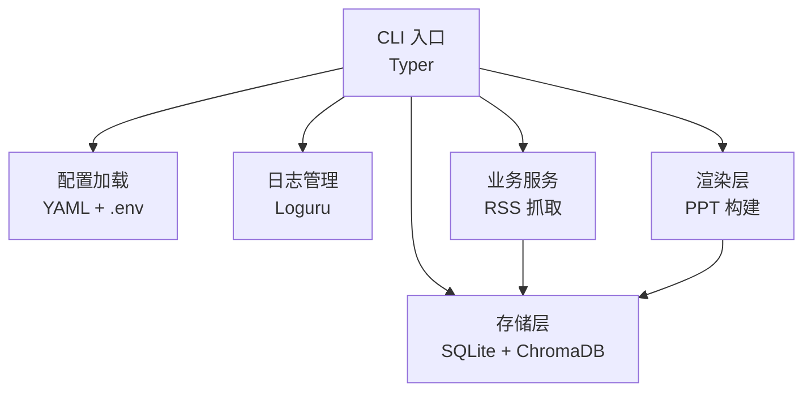
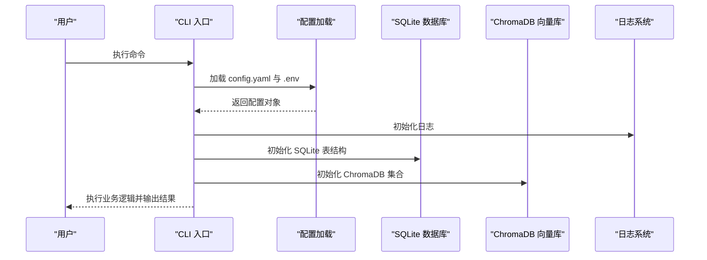
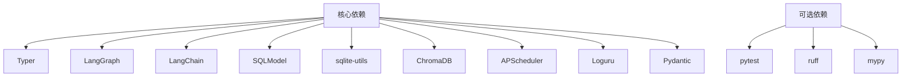

# 环境准备

<cite>
**本文档引用的文件**
- [README.md](file://README.md)
- [CLAUDE.md](file://CLAUDE.md)
- [pyproject.toml](file://pyproject.toml)
- [config.yaml](file://config.yaml)
- [env.example](file://env.example)
- [uv.toml](file://uv.toml)
- [uv.lock](file://uv.lock)
- [main.py](file://main.py)
- [src/config.py](file://src/config.py)
- [src/storage/db.py](file://src/storage/db.py)
- [src/storage/vector_store.py](file://src/storage/vector_store.py)
- [src/storage/logger.py](file://src/storage/logger.py)
- [scripts/migrate_db.py](file://scripts/migrate_db.py)
</cite>

## 目录
1. [简介](#简介)
2. [项目结构](#项目结构)
3. [核心组件](#核心组件)
4. [架构总览](#架构总览)
5. [详细组件分析](#详细组件分析)
6. [依赖关系分析](#依赖关系分析)
7. [性能考虑](#性能考虑)
8. [故障排除指南](#故障排除指南)
9. [结论](#结论)
10. [附录](#附录)

## 简介
Brief Agent 是一个基于 LangGraph 的多模态内容自动生成与分发系统，支持 RSS 数据采集、AI 智能分析、短视频脚本生成、视频渲染输出、RAG 向量化检索、日报/周报生成以及定时任务调度。本指南专注于帮助您完成环境准备，确保项目能够顺利运行。

## 项目结构
Brief Agent 采用清晰的分层架构，主要包含以下模块：
- CLI 入口：通过 Typer 提供命令行接口
- 配置管理：支持 YAML 配置文件与环境变量
- 数据存储：SQLite（SQLModel）+ ChromaDB 向量库
- 业务服务：RSS 抓取、文章解析、报告生成
- 渲染层：PPT 构建与模板系统
- 日志管理：基于 Loguru 的结构化日志

图表来源
- [main.py](file://main.py#L1-L227)
- [src/config.py](file://src/config.py#L1-L109)
- [src/storage/db.py](file://src/storage/db.py#L1-L251)
- [src/storage/vector_store.py](file://src/storage/vector_store.py#L1-L142)
- [src/storage/logger.py](file://src/storage/logger.py#L1-L39)

章节来源
- [README.md](file://README.md#L87-L148)
- [CLAUDE.md](file://CLAUDE.md#L36-L95)

## 核心组件
- Python 版本要求：Python 3.11+
- 包管理器：uv（支持镜像加速）
- 依赖管理：pyproject.toml + uv.lock
- 配置系统：config.yaml + .env
- 数据库：SQLite（SQLModel）+ ChromaDB
- 日志系统：Loguru（结构化日志）

章节来源
- [pyproject.toml](file://pyproject.toml#L6-L29)
- [uv.toml](file://uv.toml#L1-L4)
- [uv.lock](file://uv.lock#L1-L8)

## 架构总览
Brief Agent 的运行时架构围绕 CLI 命令展开，通过配置加载、数据库初始化、向量库初始化、日志配置等步骤完成环境准备，随后执行具体的业务流程（RSS 抓取、文章解析、报告生成等）。

图表来源
- [main.py](file://main.py#L54-L63)
- [src/config.py](file://src/config.py#L74-L88)
- [src/storage/db.py](file://src/storage/db.py#L65-L93)
- [src/storage/vector_store.py](file://src/storage/vector_store.py#L15-L35)
- [src/storage/logger.py](file://src/storage/logger.py#L8-L38)

## 详细组件分析

### Python 环境与包管理
- Python 版本：要求 Python 3.11+
- 包管理：推荐使用 uv，支持阿里云镜像加速
- 依赖同步：使用 uv sync 安装所有依赖
- 开发依赖：可通过可选组 dev 安装开发工具

章节来源
- [pyproject.toml](file://pyproject.toml#L6-L29)
- [uv.toml](file://uv.toml#L1-L4)
- [uv.lock](file://uv.lock#L1-L8)

### 配置系统
- 主配置文件：config.yaml，包含 LLM 提供商、RSS 源、数据库、向量库、日志、调度器等配置
- 环境变量：env.example，包含 API Key 等敏感信息
- 配置加载：支持从环境变量替换占位符（如 ${MINIMAX_API_KEY}）

章节来源
- [config.yaml](file://config.yaml#L1-L54)
- [env.example](file://env.example#L1-L10)
- [src/config.py](file://src/config.py#L74-L108)

### 数据存储层
- SQLite 数据库：使用 SQLModel ORM，自动创建表结构，启用 WAL 模式提升并发性能
- ChromaDB 向量库：用于 RAG 搜索，支持语义相似度检索
- 日志系统：Loguru 提供结构化日志，支持文件轮转与控制台输出

章节来源
- [src/storage/db.py](file://src/storage/db.py#L65-L93)
- [src/storage/vector_store.py](file://src/storage/vector_store.py#L15-L35)
- [src/storage/logger.py](file://src/storage/logger.py#L8-L38)

### CLI 命令与工作流
- CLI 入口：Typer 提供 fetch、parse、report、serve 等命令
- 日志初始化：根据配置设置日志级别、文件路径、轮转策略
- 业务流程：RSS 抓取 → 文章解析 → 报告生成 → PPT 渲染

章节来源
- [main.py](file://main.py#L22-L227)
- [src/storage/logger.py](file://src/storage/logger.py#L8-L38)

## 依赖关系分析
Brief Agent 的依赖关系主要体现在核心库与可选库的组合上，核心依赖包括 Typer、LangGraph、LangChain、SQLite 工具链、ChromaDB、调度器等；可选依赖包括开发工具链（pytest、ruff、mypy）。

图表来源
- [pyproject.toml](file://pyproject.toml#L7-L29)
- [uv.lock](file://uv.lock#L270-L332)

章节来源
- [pyproject.toml](file://pyproject.toml#L34-L40)
- [uv.lock](file://uv.lock#L270-L332)

## 性能考虑
- SQLite 并发：启用 WAL 模式与超时配置，提升并发读写性能
- 向量检索：使用 SentenceTransformer 初始化嵌入模型，支持批量添加与查询
- 日志轮转：配置文件大小轮转与保留策略，避免日志过大影响性能
- 依赖版本锁定：通过 uv.lock 锁定依赖版本，确保环境一致性

章节来源
- [src/storage/db.py](file://src/storage/db.py#L72-L90)
- [src/storage/vector_store.py](file://src/storage/vector_store.py#L34-L34)
- [src/storage/logger.py](file://src/storage/logger.py#L10-L12)
- [uv.lock](file://uv.lock#L1-L8)

## 故障排除指南
- 数据库迁移：使用迁移脚本将旧表结构升级为 SQLModel 新结构，并迁移历史解析数据
- 配置校验：确保 config.yaml 中的路径与环境变量正确，特别是数据库与向量库路径
- 权限问题：确保数据目录（data/sqlite、data/chroma、data/logs）具有写权限
- 网络问题：检查代理设置与 DNS 解析，确保能够访问外部 API（LLM、RSS 源等）

章节来源
- [scripts/migrate_db.py](file://scripts/migrate_db.py#L15-L86)
- [src/storage/db.py](file://src/storage/db.py#L68-L78)
- [src/storage/vector_store.py](file://src/storage/vector_store.py#L20-L21)

## 结论
通过以上环境准备步骤，您可以成功搭建 Brief Agent 的运行环境。建议按照“Python 环境 → 包管理 → 配置文件 → 数据库与向量库 → 日志与网络”的顺序进行准备，并在完成后执行环境验证与连通性测试，确保各项功能正常运行。

## 附录

### 环境准备步骤清单
- 安装 Python 3.11+ 并配置 PATH
- 安装 uv 包管理器并配置阿里云镜像
- 克隆项目仓库并进入项目根目录
- 使用 uv sync 同步依赖
- 创建 .env 文件并填写 API Key
- 编辑 config.yaml 配置 LLM 提供商、RSS 源、数据库与向量库路径
- 初始化数据库与向量库（首次运行时自动创建）
- 验证环境与连通性（执行 CLI 命令）

章节来源
- [README.md](file://README.md#L19-L85)
- [CLAUDE.md](file://CLAUDE.md#L99-L121)

### 环境变量配置说明
- MINIMAX_API_KEY：MiniMax LLM + TTS
- MODELSCOPE_API_KEY：ModelScope/Qwen LLM + Z-Image 图片生成
- DEEPSEEK_API_KEY：DeepSeek LLM
- DASHSCOPE_API_KEY：DashScope 音频
- LANGCHAIN_API_KEY：LangSmith 追踪
- REDIS_URL：任务队列（可选）
- OSS_*：阿里云 OSS（可选）

章节来源
- [env.example](file://env.example#L1-L10)
- [CLAUDE.md](file://CLAUDE.md#L197-L207)

### 数据库与向量库初始化
- SQLite：首次运行时自动创建表结构，启用 WAL 模式
- ChromaDB：首次运行时自动创建集合，初始化嵌入模型
- 日志：自动创建日志目录并配置轮转策略

章节来源
- [src/storage/db.py](file://src/storage/db.py#L68-L93)
- [src/storage/vector_store.py](file://src/storage/vector_store.py#L23-L35)
- [src/storage/logger.py](file://src/storage/logger.py#L15-L29)

### 环境验证与连通性测试
- 执行 CLI 命令：uv run python main.py fetch、parse、report
- 检查数据目录：确认 data/sqlite、data/chroma、data/logs 是否存在
- 验证日志输出：检查日志文件是否按配置轮转
- 测试网络连通性：确保能够访问 RSS 源与外部 API

章节来源
- [README.md](file://README.md#L78-L85)
- [CLAUDE.md](file://CLAUDE.md#L99-L121)