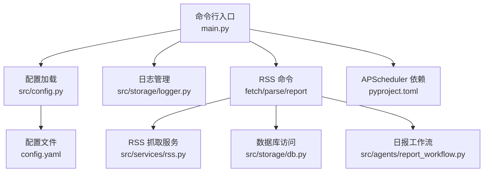
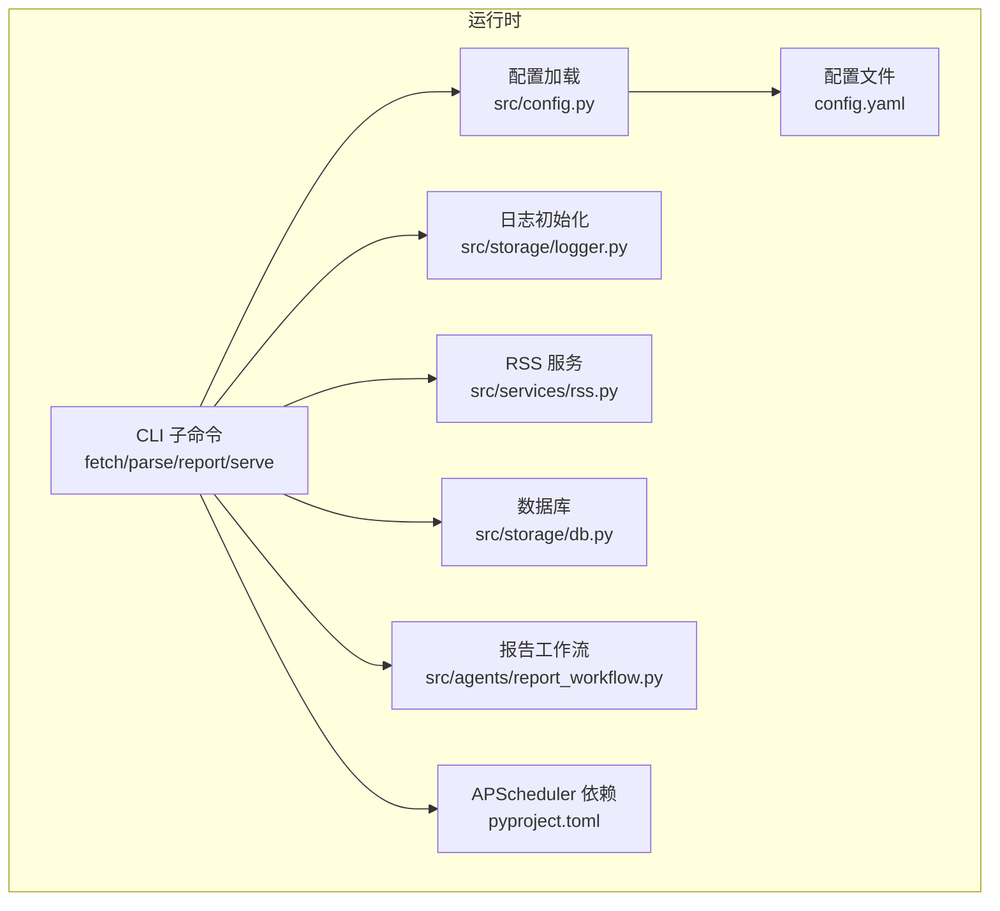
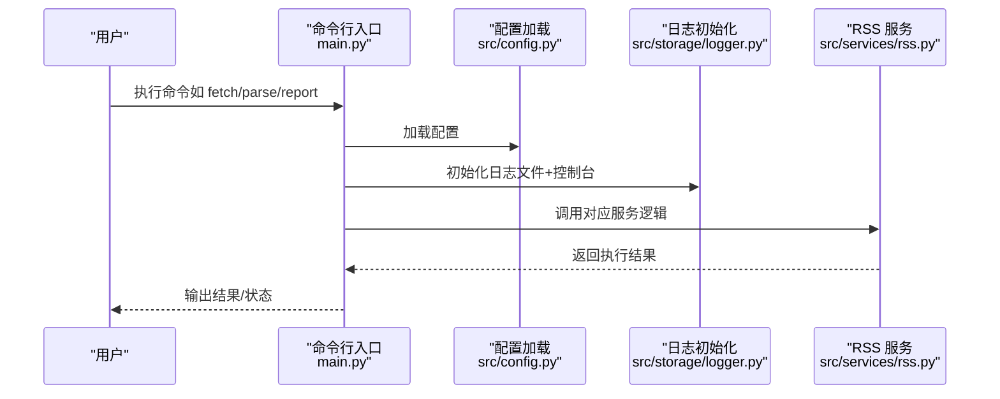
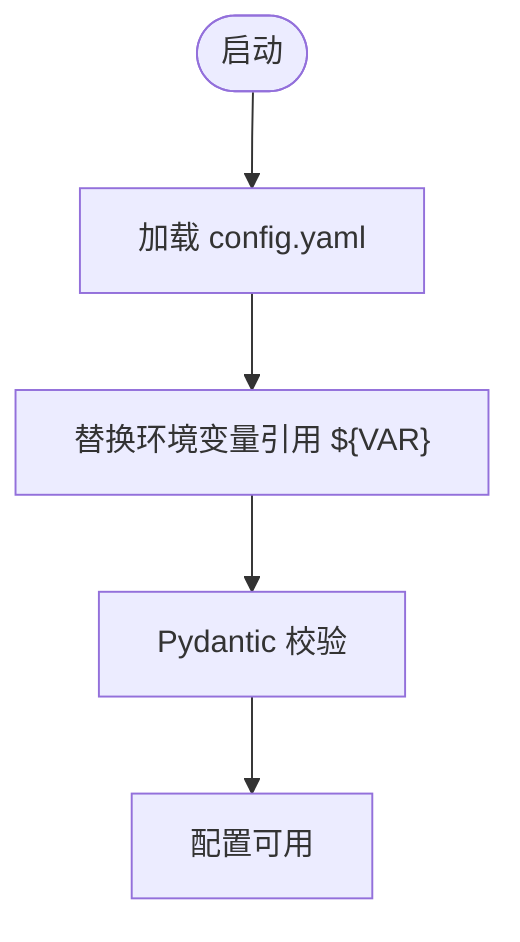
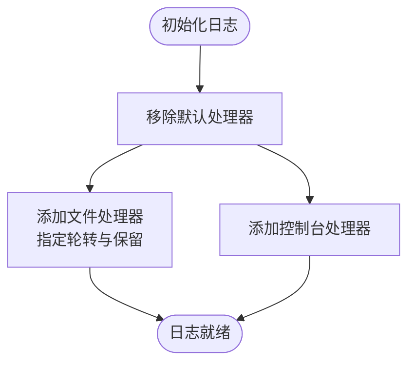
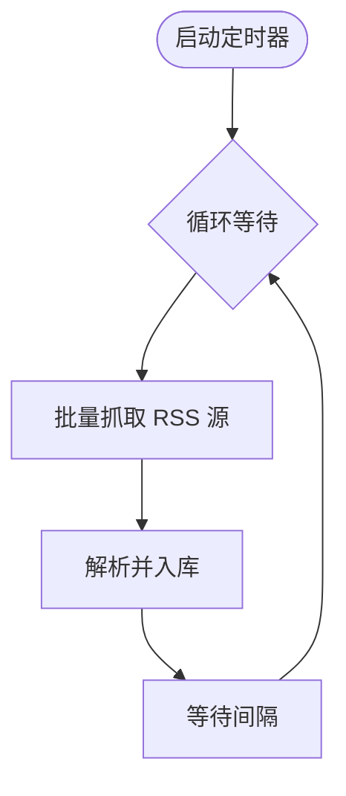
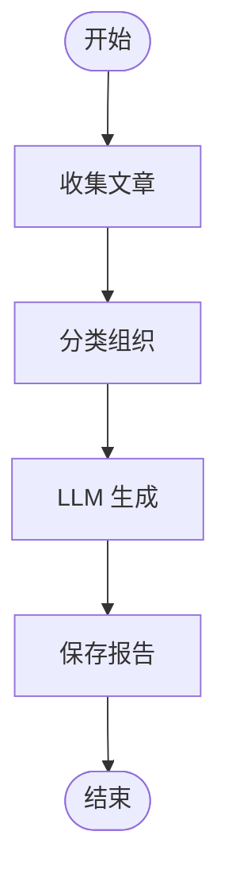
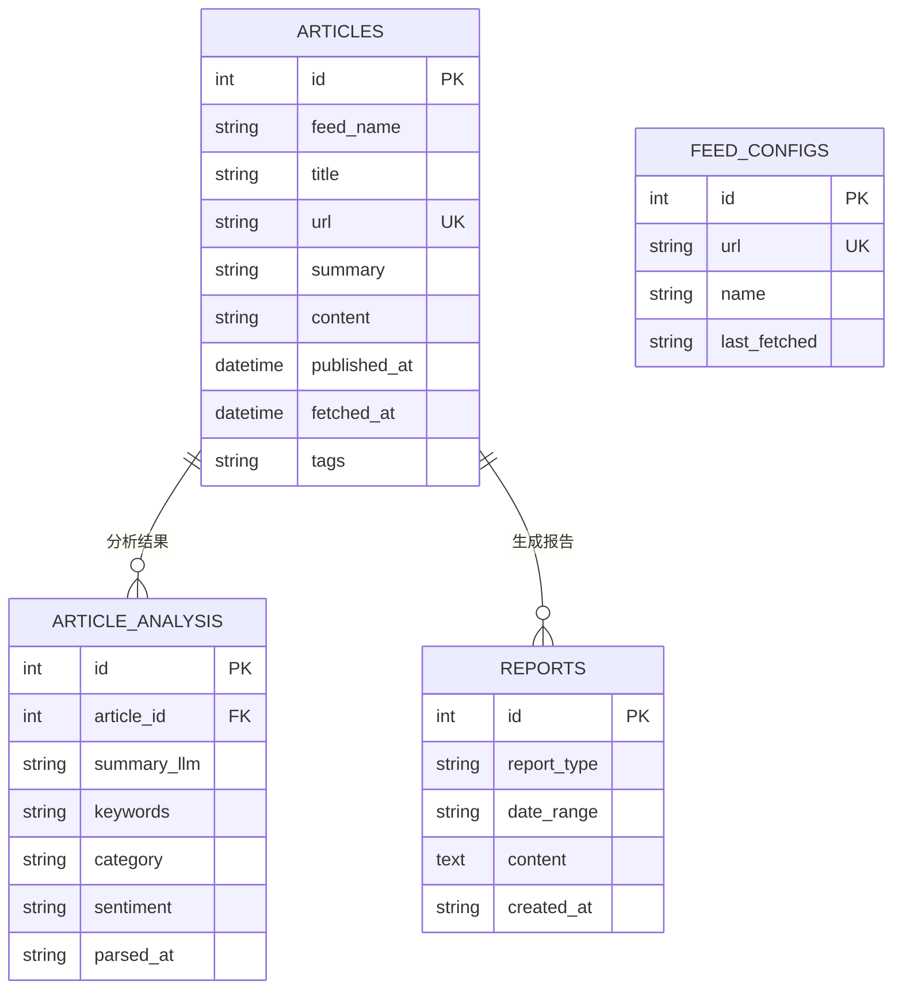
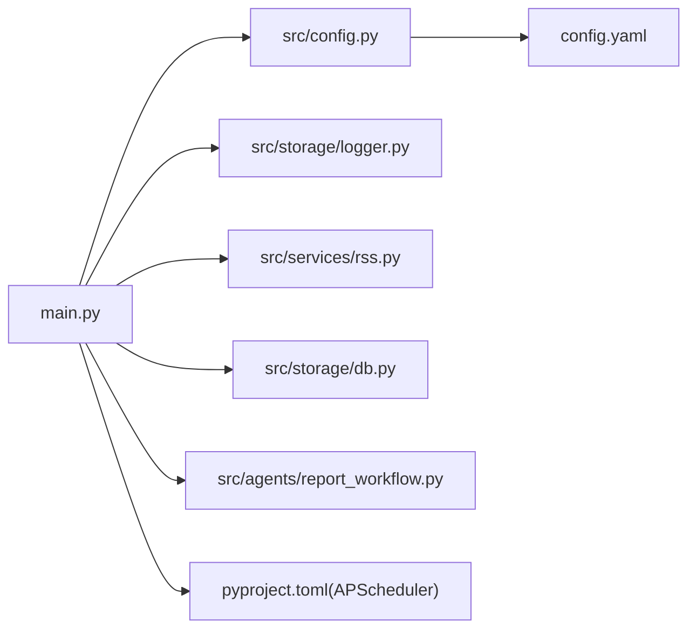

# 进程监控

<cite>
**本文引用的文件**
- [README.md](file://README.md)
- [main.py](file://main.py)
- [config.yaml](file://config.yaml)
- [pyproject.toml](file://pyproject.toml)
- [src/config.py](file://src/config.py)
- [src/storage/logger.py](file://src/storage/logger.py)
- [src/services/rss.py](file://src/services/rss.py)
- [src/agents/report_workflow.py](file://src/agents/report_workflow.py)
- [src/storage/db.py](file://src/storage/db.py)
</cite>

## 目录
1. [简介](#简介)
2. [项目结构](#项目结构)
3. [核心组件](#核心组件)
4. [架构总览](#架构总览)
5. [详细组件分析](#详细组件分析)
6. [依赖关系分析](#依赖关系分析)
7. [性能考量](#性能考量)
8. [故障排查指南](#故障排查指南)
9. [结论](#结论)
10. [附录](#附录)

## 简介
本文件面向 Brief Agent 的运维与开发团队，提供一套系统化的“进程监控与管理系统”实践指南。内容覆盖：
- 使用 systemd 或 supervisor 管理服务进程的启动、停止与重启
- 进程状态监控与自动重启配置
- 定时任务配置与管理（APScheduler 与 crontab）
- 进程资源监控（CPU、内存、磁盘）的配置思路
- 日志管理与日志轮转策略
- 进程性能指标采集与分析方法
- 异常检测与告警机制配置
- 故障排查与恢复操作指南

本指南以仓库现有实现为基础，结合配置文件与代码模块，给出可落地的运维方案。

## 项目结构
Brief Agent 采用 CLI 驱动的多模块架构，核心入口通过 Typer 提供命令子命令，配置由 YAML 驱动并通过 Pydantic 校验，日志由 loguru 管理，数据库基于 SQLite/SQLModel，定时任务由 APScheduler 提供。

图表来源
- [main.py](file://main.py#L1-L227)
- [src/config.py](file://src/config.py#L1-L109)
- [src/storage/logger.py](file://src/storage/logger.py#L1-L39)
- [src/services/rss.py](file://src/services/rss.py#L1-L123)
- [src/agents/report_workflow.py](file://src/agents/report_workflow.py#L1-L266)
- [src/storage/db.py](file://src/storage/db.py#L1-L251)
- [config.yaml](file://config.yaml#L1-L54)
- [pyproject.toml](file://pyproject.toml#L1-L49)

章节来源
- [README.md](file://README.md#L87-L148)
- [main.py](file://main.py#L1-L227)
- [src/config.py](file://src/config.py#L1-L109)
- [src/storage/logger.py](file://src/storage/logger.py#L1-L39)
- [src/services/rss.py](file://src/services/rss.py#L1-L123)
- [src/agents/report_workflow.py](file://src/agents/report_workflow.py#L1-L266)
- [src/storage/db.py](file://src/storage/db.py#L1-L251)
- [config.yaml](file://config.yaml#L1-L54)
- [pyproject.toml](file://pyproject.toml#L1-L49)

## 核心组件
- 命令行入口与子命令：提供 fetch、parse、report、serve 等命令，集中于主入口文件。
- 配置系统：YAML 配置 + 环境变量替换 + Pydantic 校验，确保运行期配置一致可靠。
- 日志系统：loguru 统一日志输出与轮转，支持文件与控制台双通道。
- RSS 服务：封装 RSS 抓取、解析与入库，支持定时循环。
- 数据库：SQLite + SQLModel，提供文章、解析结果、报告等表结构与常用操作。
- 定时任务：APScheduler 依赖存在，可扩展为生产级调度器；当前仓库包含基础循环定时器实现。

章节来源
- [main.py](file://main.py#L66-L141)
- [src/config.py](file://src/config.py#L74-L109)
- [src/storage/logger.py](file://src/storage/logger.py#L8-L38)
- [src/services/rss.py](file://src/services/rss.py#L15-L123)
- [src/storage/db.py](file://src/storage/db.py#L65-L251)
- [pyproject.toml](file://pyproject.toml#L20-L20)

## 架构总览
Brief Agent 的运行时由“命令行驱动 + 配置驱动 + 日志驱动 + 数据持久化 + 定时任务”构成。CLI 子命令负责触发业务流程，配置文件决定行为参数，日志模块保障可观测性，数据库模块承载数据资产，定时任务模块负责周期性任务。

图表来源
- [main.py](file://main.py#L1-L227)
- [src/config.py](file://src/config.py#L74-L109)
- [src/storage/logger.py](file://src/storage/logger.py#L8-L38)
- [src/services/rss.py](file://src/services/rss.py#L15-L123)
- [src/agents/report_workflow.py](file://src/agents/report_workflow.py#L186-L237)
- [src/storage/db.py](file://src/storage/db.py#L65-L251)
- [config.yaml](file://config.yaml#L1-L54)
- [pyproject.toml](file://pyproject.toml#L20-L20)

## 详细组件分析

### 命令行与进程生命周期
- CLI 子命令：fetch、parse、report、serve。其中 serve 为占位命令，当前未实现 Web 服务。
- 进程启动：通过命令行入口启动，日志在命令执行前初始化，确保从一开始就具备可观测性。
- 进程停止：命令行任务完成后退出；若需后台守护，建议使用 systemd/supervisor 管理。

图表来源
- [main.py](file://main.py#L54-L82)
- [src/config.py](file://src/config.py#L74-L88)
- [src/storage/logger.py](file://src/storage/logger.py#L8-L38)
- [src/services/rss.py](file://src/services/rss.py#L22-L60)

章节来源
- [main.py](file://main.py#L66-L141)
- [src/config.py](file://src/config.py#L74-L88)
- [src/storage/logger.py](file://src/storage/logger.py#L8-L38)
- [src/services/rss.py](file://src/services/rss.py#L22-L60)

### 配置与环境变量
- 配置来源：config.yaml，支持 LLM、RSS、数据库、向量库、日志、调度等模块化配置。
- 环境变量：通过配置加载器替换 ${VAR} 形式的引用，确保敏感信息不硬编码在仓库中。
- 配置验证：使用 Pydantic 模型对配置进行强类型校验，降低运行期错误概率。

图表来源
- [src/config.py](file://src/config.py#L74-L109)
- [config.yaml](file://config.yaml#L1-L54)

章节来源
- [src/config.py](file://src/config.py#L74-L109)
- [config.yaml](file://config.yaml#L1-L54)

### 日志与日志轮转
- 日志初始化：统一移除默认处理器，新增文件与控制台处理器，支持按大小轮转与保留天数。
- 日志位置：由配置文件指定，便于运维集中管理。
- 建议：在 systemd/supervisor 中设置标准输出/错误输出重定向，避免与应用日志冲突。

图表来源
- [src/storage/logger.py](file://src/storage/logger.py#L8-L38)
- [config.yaml](file://config.yaml#L42-L47)

章节来源
- [src/storage/logger.py](file://src/storage/logger.py#L8-L38)
- [config.yaml](file://config.yaml#L42-L47)

### RSS 抓取与定时任务
- 抓取流程：解析 RSS 源，清洗内容，入库。
- 定时方式：仓库提供了基于循环的定时器实现；同时项目声明了 APScheduler 依赖，可用于更复杂的调度场景。
- 建议：将循环定时器改为 APScheduler 的 Cron 触发器，结合配置文件中的时区与时间窗口，实现更可靠的定时任务。

图表来源
- [src/services/rss.py](file://src/services/rss.py#L110-L123)
- [config.yaml](file://config.yaml#L24-L31)
- [pyproject.toml](file://pyproject.toml#L20-L20)

章节来源
- [src/services/rss.py](file://src/services/rss.py#L110-L123)
- [config.yaml](file://config.yaml#L24-L31)
- [pyproject.toml](file://pyproject.toml#L20-L20)

### 报告生成工作流
- 工作流节点：collect → organize → generate → save。
- 状态机：通过状态字段记录执行进度与错误，便于观测与重试。
- 建议：在工作流中增加中间状态的日志与指标上报，便于监控与告警。

图表来源
- [src/agents/report_workflow.py](file://src/agents/report_workflow.py#L186-L201)

章节来源
- [src/agents/report_workflow.py](file://src/agents/report_workflow.py#L46-L182)

### 数据持久化
- 表结构：articles、article_analysis、feed_configs、reports。
- 事务与并发：启用 WAL 模式与超时配置，提升并发读写能力。
- 建议：定期备份数据库文件，监控磁盘空间，设置合理的保留策略。

图表来源
- [src/storage/db.py](file://src/storage/db.py#L14-L61)

章节来源
- [src/storage/db.py](file://src/storage/db.py#L65-L251)

## 依赖关系分析
- CLI 依赖配置与日志模块；RSS 命令依赖 RSS 服务与数据库；报告命令依赖工作流与数据库。
- APScheduler 依赖存在于项目配置中，可用于替换当前的循环定时器实现。
- 日志模块与配置模块耦合度低，便于独立部署与运维。

图表来源
- [main.py](file://main.py#L1-L227)
- [src/config.py](file://src/config.py#L74-L88)
- [src/storage/logger.py](file://src/storage/logger.py#L8-L38)
- [src/services/rss.py](file://src/services/rss.py#L15-L123)
- [src/agents/report_workflow.py](file://src/agents/report_workflow.py#L186-L237)
- [src/storage/db.py](file://src/storage/db.py#L65-L251)
- [config.yaml](file://config.yaml#L1-L54)
- [pyproject.toml](file://pyproject.toml#L20-L20)

章节来源
- [main.py](file://main.py#L1-L227)
- [src/config.py](file://src/config.py#L74-L88)
- [src/storage/logger.py](file://src/storage/logger.py#L8-L38)
- [src/services/rss.py](file://src/services/rss.py#L15-L123)
- [src/agents/report_workflow.py](file://src/agents/report_workflow.py#L186-L237)
- [src/storage/db.py](file://src/storage/db.py#L65-L251)
- [config.yaml](file://config.yaml#L1-L54)
- [pyproject.toml](file://pyproject.toml#L20-L20)

## 性能考量
- CPU 与内存：RSS 抓取与 LLM 生成属于 I/O 与计算密集混合场景，建议在 systemd/supervisor 中设置资源限制与 OOM 保护。
- 磁盘：日志文件与数据库文件增长较快，建议结合日志轮转与数据库清理策略，定期压缩与归档。
- 网络：RSS 抓取需设置合理超时与重试，避免阻塞主线程。
- 指标采集：建议引入轻量级指标导出（如 Prometheus Pushgateway），在关键节点埋点（抓取耗时、解析数量、生成耗时等）。

## 故障排查指南
- 启动失败
  - 检查配置文件语法与必需字段是否齐全。
  - 确认环境变量是否正确注入。
  - 查看日志文件与控制台输出定位错误。
- 抓取异常
  - 检查 RSS 源可达性与响应格式。
  - 查看解析异常日志，确认 bozo 异常原因。
- 报告生成失败
  - 检查工作流状态字段与错误信息。
  - 确认 LLM 可用性与配额。
- 数据库问题
  - 检查 WAL 模式与 busy_timeout 是否生效。
  - 定期备份数据库，监控磁盘空间。
- 定时任务不执行
  - 若使用循环定时器，检查循环间隔与异常捕获。
  - 若使用 APScheduler，检查 Cron 表达式与时区配置。

章节来源
- [src/services/rss.py](file://src/services/rss.py#L34-L60)
- [src/agents/report_workflow.py](file://src/agents/report_workflow.py#L59-L61)
- [src/storage/db.py](file://src/storage/db.py#L84-L89)

## 结论
Brief Agent 的进程监控与管理系统应围绕“可观测性（日志）、可靠性（配置与定时）、稳定性（数据库与资源）”三方面展开。通过 systemd/supervisor 实现进程生命周期管理，结合 APScheduler 与 crontab 构建稳定可靠的定时任务体系，并以日志轮转与指标采集为抓手，持续优化系统健康度与可维护性。

## 附录

### systemd 管理服务（建议步骤）
- 创建服务单元文件，设置 ExecStart 指向命令行入口，Environment 指向 .env。
- 设置 Restart=always 与 RestartSec 参数，实现自动重启。
- 使用 StandardOutput/StandardError 重定向至日志文件，配合 loguru 轮转。
- 使用 LimitNOFILE/LimitNPROC 等限制资源，防止资源滥用。

章节来源
- [main.py](file://main.py#L220-L227)
- [src/storage/logger.py](file://src/storage/logger.py#L8-L38)
- [config.yaml](file://config.yaml#L42-L47)

### supervisor 管理服务（建议步骤）
- 在配置中定义进程，设置 command 指向命令行入口。
- 设置 autostart/autorestart/enabled=true。
- 设置 stdout_logfile/stderr_logfile 与 loglevel，结合 loguru 轮转策略。
- 设置 user/group 与环境变量，确保与本地一致。

章节来源
- [main.py](file://main.py#L220-L227)
- [src/storage/logger.py](file://src/storage/logger.py#L8-L38)
- [config.yaml](file://config.yaml#L42-L47)

### 定时任务配置（APScheduler 与 crontab）
- APScheduler：在应用中注册 Cron 触发器，绑定 fetch/parse/report 等任务，结合配置文件的时区与时间窗口。
- crontab：适用于简单周期任务，如每日/每周报告生成的触发器，建议与应用内部调度互斥或隔离。

章节来源
- [pyproject.toml](file://pyproject.toml#L20-L20)
- [config.yaml](file://config.yaml#L49-L54)

### 进程资源监控（CPU、内存、磁盘）
- CPU/内存：通过 systemd/supervisor 的资源限制与 OOM 保护，结合系统级监控工具（如 cAdvisor/Prometheus Node Exporter）采集。
- 磁盘：监控 data/logs 与数据库目录的容量变化，设置阈值告警与自动清理策略。

章节来源
- [config.yaml](file://config.yaml#L34-L47)
- [src/storage/db.py](file://src/storage/db.py#L65-L89)

### 日志管理与日志轮转
- 文件轮转：由 loguru 配置 rotation 与 retention；建议与 systemd/supervisor 的日志重定向策略协同。
- 控制台输出：便于实时调试，生产环境建议关闭或限制级别。

章节来源
- [src/storage/logger.py](file://src/storage/logger.py#L8-L38)
- [config.yaml](file://config.yaml#L42-L47)

### 性能指标采集与分析
- 埋点建议：抓取耗时、解析数量、报告生成耗时、数据库写入耗时。
- 导出方式：Prometheus Pushgateway 或应用内指标端点。
- 分析维度：成功率、延迟分布、错误类型占比、资源使用峰值。

章节来源
- [src/services/rss.py](file://src/services/rss.py#L22-L60)
- [src/agents/report_workflow.py](file://src/agents/report_workflow.py#L95-L160)
- [src/storage/db.py](file://src/storage/db.py#L97-L122)

### 异常检测与告警
- 告警维度：进程存活、日志错误率、抓取失败率、报告生成失败率、数据库写入异常、磁盘空间不足。
- 告警渠道：邮件/IM/Webhook，建议分级处理（Warn/Error/Critical）。

章节来源
- [src/storage/logger.py](file://src/storage/logger.py#L8-L38)
- [src/services/rss.py](file://src/services/rss.py#L30-L31)
- [src/agents/report_workflow.py](file://src/agents/report_workflow.py#L60-L61)