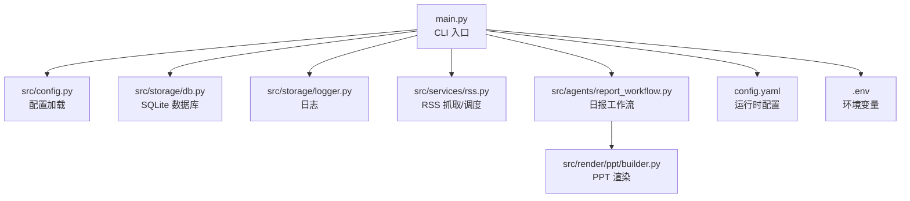
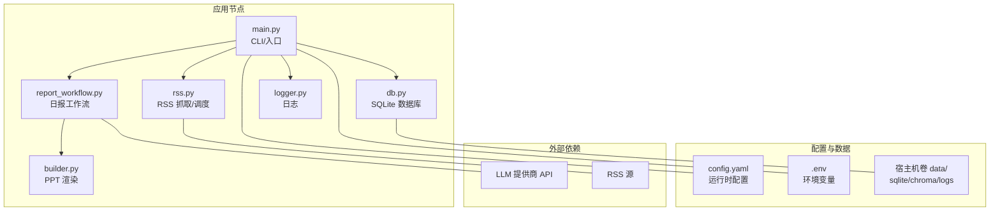
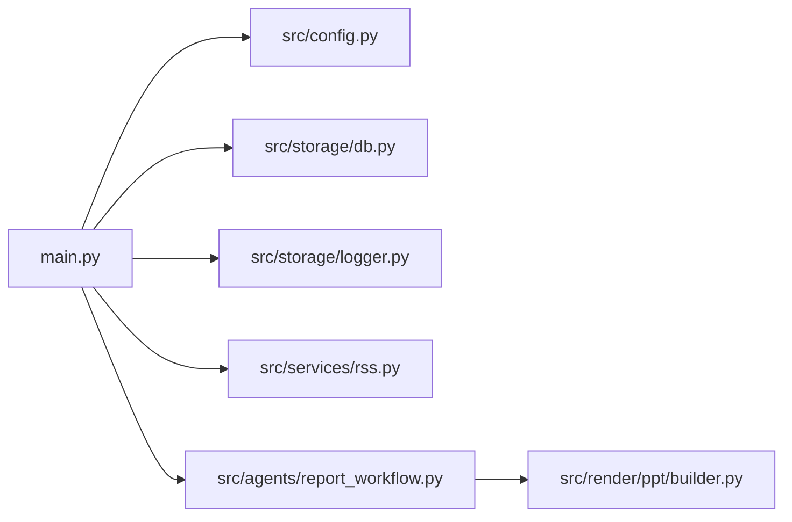

# 部署运维

<cite>
**本文引用的文件**
- [README.md](file://README.md)
- [config.yaml](file://config.yaml)
- [env.example](file://env.example)
- [pyproject.toml](file://pyproject.toml)
- [uv.toml](file://uv.toml)
- [main.py](file://main.py)
- [src/config.py](file://src/config.py)
- [src/storage/logger.py](file://src/storage/logger.py)
- [src/storage/db.py](file://src/storage/db.py)
- [src/services/rss.py](file://src/services/rss.py)
- [src/agents/report_workflow.py](file://src/agents/report_workflow.py)
- [src/render/ppt/builder.py](file://src/render/ppt/builder.py)
- [scripts/migrate_db.py](file://scripts/migrate_db.py)
- [scripts/fetch_sample.py](file://scripts/fetch_sample.py)
</cite>

## 目录
1. [简介](#简介)
2. [项目结构](#项目结构)
3. [核心组件](#核心组件)
4. [架构总览](#架构总览)
5. [详细组件分析](#详细组件分析)
6. [依赖关系分析](#依赖关系分析)
7. [性能考量](#性能考量)
8. [故障排除指南](#故障排除指南)
9. [结论](#结论)
10. [附录](#附录)

## 简介
本指南面向生产环境部署与运维 Brief Agent，覆盖服务器环境准备、依赖安装、服务配置、容器化部署、定时任务与进程监控、日志轮转、性能监控与日志管理最佳实践、故障排除与应急响应、备份与恢复策略、安全配置与访问控制、以及运维脚本与自动化工具的使用方法。目标是确保系统稳定可靠地运行。

## 项目结构
Brief Agent 是基于 Python 的命令行应用，采用模块化设计，围绕 RSS 抓取、文章解析、报告生成与 PPT 渲染形成闭环。核心模块包括配置加载、数据库（SQLite）、日志、RSS 抓取与调度、报告工作流、PPT 渲染等。

图表来源
- [main.py](file://main.py#L1-L227)
- [src/config.py](file://src/config.py#L74-L109)
- [src/storage/db.py](file://src/storage/db.py#L65-L94)
- [src/storage/logger.py](file://src/storage/logger.py#L8-L39)
- [src/services/rss.py](file://src/services/rss.py#L15-L123)
- [src/agents/report_workflow.py](file://src/agents/report_workflow.py#L186-L238)
- [src/render/ppt/builder.py](file://src/render/ppt/builder.py#L22-L194)
- [config.yaml](file://config.yaml#L1-L54)
- [env.example](file://env.example#L1-L10)

章节来源
- [README.md](file://README.md#L87-L148)
- [main.py](file://main.py#L1-L227)
- [src/config.py](file://src/config.py#L74-L109)
- [config.yaml](file://config.yaml#L1-L54)
- [env.example](file://env.example#L1-L10)

## 核心组件
- 配置系统：集中管理 LLM 提供商、RSS 源、数据库、向量库、日志、调度器等配置，并支持环境变量注入。
- 数据存储：SQLite + SQLModel，内置 WAL 模式与超时设置，适配并发读写。
- 日志系统：基于 loguru，支持文件轮转与保留策略，同时输出到控制台。
- RSS 抓取与调度：HTTP 抓取、HTML 清洗、入库；提供简单轮询调度器。
- 报告工作流：LangGraph 状态机，按分类组织文章，调用 LLM 生成结构化日报。
- PPT 渲染：DirectPPBuilder 使用 python-pptx 直接渲染，支持标题页与内容页布局。

章节来源
- [src/config.py](file://src/config.py#L14-L109)
- [src/storage/db.py](file://src/storage/db.py#L65-L94)
- [src/storage/logger.py](file://src/storage/logger.py#L8-L39)
- [src/services/rss.py](file://src/services/rss.py#L15-L123)
- [src/agents/report_workflow.py](file://src/agents/report_workflow.py#L186-L238)
- [src/render/ppt/builder.py](file://src/render/ppt/builder.py#L22-L194)

## 架构总览
下图展示了生产环境下的典型部署形态：应用容器承载 CLI 与工作流，配置由 config.yaml 与 .env 提供，数据持久化在宿主机卷，日志落盘并轮转，外部 LLM 与 RSS 源通过网络访问。

图表来源
- [main.py](file://main.py#L1-L227)
- [src/agents/report_workflow.py](file://src/agents/report_workflow.py#L186-L238)
- [src/services/rss.py](file://src/services/rss.py#L15-L123)
- [src/storage/db.py](file://src/storage/db.py#L65-L94)
- [src/storage/logger.py](file://src/storage/logger.py#L8-L39)
- [src/render/ppt/builder.py](file://src/render/ppt/builder.py#L22-L194)
- [config.yaml](file://config.yaml#L1-L54)
- [env.example](file://env.example#L1-L10)

## 详细组件分析

### 配置与环境准备
- 依赖安装：使用 uv 管理依赖与虚拟环境，支持阿里云镜像加速。
- 环境变量：复制示例文件为 .env，填入 LLM API Key 与可选配置路径。
- 运行方式：使用 uv run 执行 CLI 命令，或通过项目脚本入口 brief 调用。

章节来源
- [README.md](file://README.md#L17-L86)
- [pyproject.toml](file://pyproject.toml#L1-L49)
- [uv.toml](file://uv.toml#L1-L4)
- [env.example](file://env.example#L1-L10)

### 服务配置与数据持久化
- 数据库：SQLite 路径在配置中定义，首次运行自动创建表结构；启用 WAL 模式与超时以提升并发能力。
- 向量库：ChromaDB 路径与集合名可配置，用于 RAG 检索。
- 日志：日志级别、文件路径、轮转大小与保留天数均可配置，落盘到 data/logs。

章节来源
- [config.yaml](file://config.yaml#L33-L47)
- [src/storage/db.py](file://src/storage/db.py#L65-L94)
- [src/storage/logger.py](file://src/storage/logger.py#L8-L39)

### RSS 抓取与定时任务
- 抓取流程：解析 RSS 源，清洗 HTML，入库 Articles；支持超时与错误处理。
- 调度器：提供简单轮询调度器，按配置的间隔循环抓取。
- 定时任务：配置文件支持调度器时区与日报/周报生成时间。

章节来源
- [src/services/rss.py](file://src/services/rss.py#L15-L123)
- [config.yaml](file://config.yaml#L23-L31)
- [config.yaml](file://config.yaml#L49-L54)

### 报告工作流与 PPT 渲染
- 工作流：LangGraph 状态机，按分类组织文章，调用 LLM 生成结构化日报，保存到 reports 表。
- PPT 渲染：DirectPPBuilder 使用 python-pptx 直接渲染，支持标题页与内容页布局，输出到 output 目录。

章节来源
- [src/agents/report_workflow.py](file://src/agents/report_workflow.py#L186-L238)
- [src/render/ppt/builder.py](file://src/render/ppt/builder.py#L22-L194)

### CLI 命令与运行模式
- fetch：抓取 RSS 并入库。
- parse：批量解析未处理文章。
- report：生成指定日期的日报，可选输出到 stdout 或生成 PPT。
- serve：预留 Web 服务入口（当前为占位）。

章节来源
- [main.py](file://main.py#L66-L141)
- [main.py](file://main.py#L208-L217)

### 数据库迁移脚本
- 功能：使用 SQLModel 初始化表结构；检测并迁移旧解析数据到 article_analysis；统计验证迁移结果。

章节来源
- [scripts/migrate_db.py](file://scripts/migrate_db.py#L15-L87)

### 示例抓取脚本
- 功能：快速抓取示例 RSS 源，展示数据入库与示例输出。

章节来源
- [scripts/fetch_sample.py](file://scripts/fetch_sample.py#L16-L66)

## 依赖关系分析
- 应用入口依赖配置加载、数据库、日志、RSS 服务、报告工作流与 PPT 渲染。
- 配置模块负责解析 YAML 并注入环境变量。
- 数据库模块负责表初始化、WAL 模式与会话管理。
- 日志模块负责文件轮转与控制台输出。
- RSS 模块负责抓取与调度。
- 报告工作流模块负责状态机与 LLM 调用。
- PPT 渲染模块负责 PowerPoint 输出。

图表来源
- [main.py](file://main.py#L1-L227)
- [src/config.py](file://src/config.py#L74-L109)
- [src/storage/db.py](file://src/storage/db.py#L65-L94)
- [src/storage/logger.py](file://src/storage/logger.py#L8-L39)
- [src/services/rss.py](file://src/services/rss.py#L15-L123)
- [src/agents/report_workflow.py](file://src/agents/report_workflow.py#L186-L238)
- [src/render/ppt/builder.py](file://src/render/ppt/builder.py#L22-L194)

## 性能考量
- 数据库并发：启用 WAL 模式与 busy_timeout，减少锁等待；合理设置连接超时。
- 抓取性能：控制 RSS 抓取超时与并发；对解析失败进行降级与重试策略。
- 日志性能：使用文件轮转与保留策略，避免单文件过大；控制日志级别。
- LLM 调用：合理设置提示词长度与批处理大小，避免超时；必要时引入缓存与限流。
- 渲染性能：PPT 渲染涉及 IO，建议在专用渲染节点或容器中执行，避免阻塞主流程。

章节来源
- [src/storage/db.py](file://src/storage/db.py#L84-L90)
- [src/services/rss.py](file://src/services/rss.py#L37-L48)
- [src/storage/logger.py](file://src/storage/logger.py#L20-L29)
- [src/agents/report_workflow.py](file://src/agents/report_workflow.py#L95-L160)
- [src/render/ppt/builder.py](file://src/render/ppt/builder.py#L128-L151)

## 故障排除指南
- 配置问题
  - 确认 .env 已正确复制并填写 API Key。
  - 检查 config.yaml 中路径与参数是否正确。
- 数据库问题
  - 首次运行自动建表；若历史数据迁移，使用迁移脚本。
  - 若出现锁或超时，检查 WAL 模式与 busy_timeout 设置。
- 抓取失败
  - 检查网络连通性与 RSS 源可用性；查看日志错误堆栈。
  - 调整超时与重试策略。
- 报告生成失败
  - 检查是否有已解析文章；确认 LLM 提供商可用与配额充足。
  - 查看工作流状态与错误信息。
- PPT 渲染失败
  - 检查 python-pptx 是否安装；确认输出目录权限。
- 日志问题
  - 检查日志轮转与保留策略；确认 data/logs 目录存在且可写。

章节来源
- [scripts/migrate_db.py](file://scripts/migrate_db.py#L15-L87)
- [src/storage/db.py](file://src/storage/db.py#L84-L90)
- [src/services/rss.py](file://src/services/rss.py#L30-L48)
- [src/agents/report_workflow.py](file://src/agents/report_workflow.py#L58-L61)
- [src/render/ppt/builder.py](file://src/render/ppt/builder.py#L149-L151)
- [src/storage/logger.py](file://src/storage/logger.py#L15-L29)

## 结论
Brief Agent 的生产部署应重点关注配置与环境变量管理、数据库与日志的持久化与轮转、RSS 抓取与调度的稳定性、报告工作流与 LLM 调用的可靠性，以及 PPT 渲染的资源隔离。通过合理的运维脚本与监控策略，可显著提升系统的稳定性与可维护性。

## 附录

### 生产环境部署步骤
- 服务器环境准备
  - 安装 Python 3.11+ 与 uv。
  - 准备数据目录 data/sqlite、data/chroma、data/logs。
- 依赖安装
  - 使用 uv 同步依赖与创建虚拟环境。
- 配置与环境变量
  - 复制 env.example 为 .env，填入 LLM API Key。
  - 编辑 config.yaml，配置 RSS 源、数据库、向量库、日志与调度器。
- 首次运行
  - 执行 RSS 抓取与解析，确认数据库表创建与数据入库。
  - 生成日报并导出 PPT，验证工作流与渲染。

章节来源
- [README.md](file://README.md#L17-L86)
- [config.yaml](file://config.yaml#L1-L54)
- [env.example](file://env.example#L1-L10)

### 容器化部署方案与 Docker 配置示例
- 建议使用多阶段构建，基础镜像选择官方 Python slim 版本，安装系统依赖（如 python-pptx 所需的 Office 相关库），再安装 Python 依赖。
- 挂载 data 目录到宿主机卷，持久化 SQLite、ChromaDB 与日志。
- 使用 .env 与 config.yaml 注入配置，避免硬编码敏感信息。
- 通过 entrypoint 暴露 CLI 命令，结合定时任务或进程管理器实现自动化。

章节来源
- [pyproject.toml](file://pyproject.toml#L1-L49)
- [config.yaml](file://config.yaml#L33-L47)
- [env.example](file://env.example#L1-L10)

### 定时任务配置与管理
- crontab 设置
  - 使用 crontab 调度 RSS 抓取与报告生成任务，结合时区配置。
- 进程监控
  - 使用 systemd 或容器编排工具（如 Docker Compose/Swarm/Kubernetes）管理进程生命周期与健康检查。
- 日志轮转
  - 使用 loguru 的轮转与保留策略，或结合系统 logrotate。

章节来源
- [config.yaml](file://config.yaml#L49-L54)
- [src/storage/logger.py](file://src/storage/logger.py#L20-L29)

### 性能监控与日志管理最佳实践
- 监控指标
  - RSS 抓取成功率与耗时、数据库查询延迟、LLM 调用耗时与错误率、PPT 渲染耗时。
- 日志管理
  - 控制日志级别，开启文件轮转与保留；集中化收集与检索（如 ELK/Fluentd）。
- 资源隔离
  - 将渲染任务放在独立容器或节点，避免影响主流程。

章节来源
- [src/services/rss.py](file://src/services/rss.py#L22-L32)
- [src/agents/report_workflow.py](file://src/agents/report_workflow.py#L95-L160)
- [src/render/ppt/builder.py](file://src/render/ppt/builder.py#L128-L151)
- [src/storage/logger.py](file://src/storage/logger.py#L20-L29)

### 故障排除与应急响应
- 快速定位
  - 检查日志文件与错误堆栈；确认配置与环境变量。
- 应急回滚
  - 回退到上一版本镜像；恢复数据库快照。
- 降级策略
  - 降低批处理大小、禁用非关键功能（如 PPT 渲染）。

章节来源
- [src/services/rss.py](file://src/services/rss.py#L30-L48)
- [src/agents/report_workflow.py](file://src/agents/report_workflow.py#L58-L61)
- [src/storage/logger.py](file://src/storage/logger.py#L15-L29)

### 备份与恢复策略
- 数据库备份
  - 定期备份 SQLite 文件与 ChromaDB 目录；验证恢复流程。
- 配置备份
  - 备份 config.yaml 与 .env；变更前打标签或版本化。
- 恢复演练
  - 定期进行恢复演练，验证数据完整性与可用性。

章节来源
- [src/storage/db.py](file://src/storage/db.py#L65-L94)
- [config.yaml](file://config.yaml#L33-L47)

### 安全配置与访问控制
- 密钥管理
  - 使用 .env 管理 API Key，避免硬编码；最小权限原则。
- 网络访问
  - 限制对外出站访问，仅允许必要的 LLM 与 RSS 源域名。
- 文件权限
  - data 目录仅授予应用所需用户读写权限。
- 审计与合规
  - 记录关键操作日志，定期审计配置变更。

章节来源
- [env.example](file://env.example#L1-L10)
- [config.yaml](file://config.yaml#L4-L21)

### 运维脚本与自动化工具使用指南
- 数据库迁移
  - 使用迁移脚本初始化表结构并迁移历史解析数据。
- 示例抓取
  - 使用示例脚本快速验证 RSS 源与入库流程。
- 自动化
  - 结合 crontab 与进程管理器，实现 RSS 抓取与报告生成的自动化。

章节来源
- [scripts/migrate_db.py](file://scripts/migrate_db.py#L15-L87)
- [scripts/fetch_sample.py](file://scripts/fetch_sample.py#L16-L66)