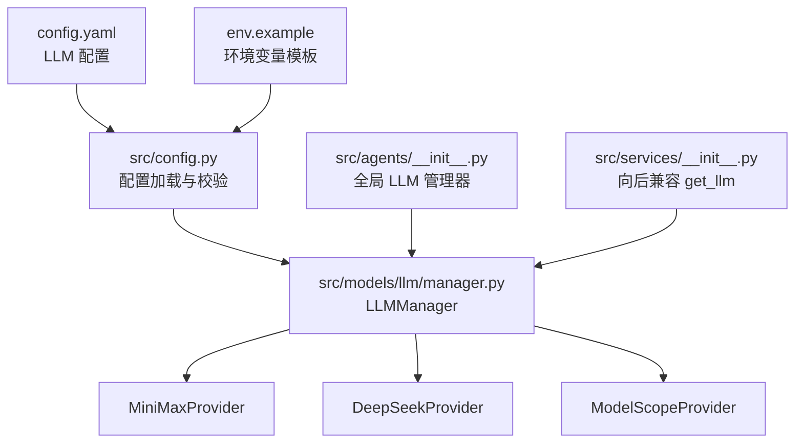
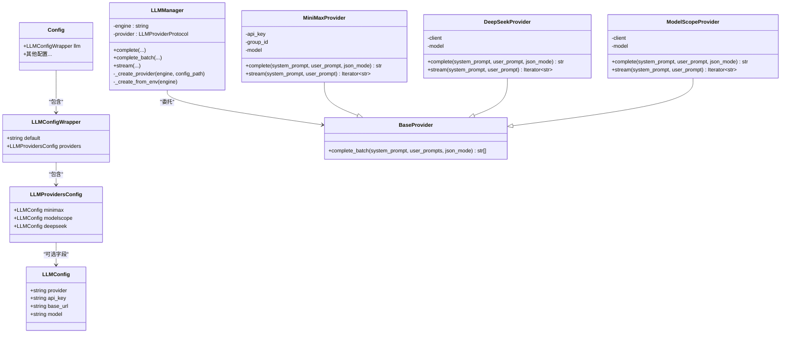
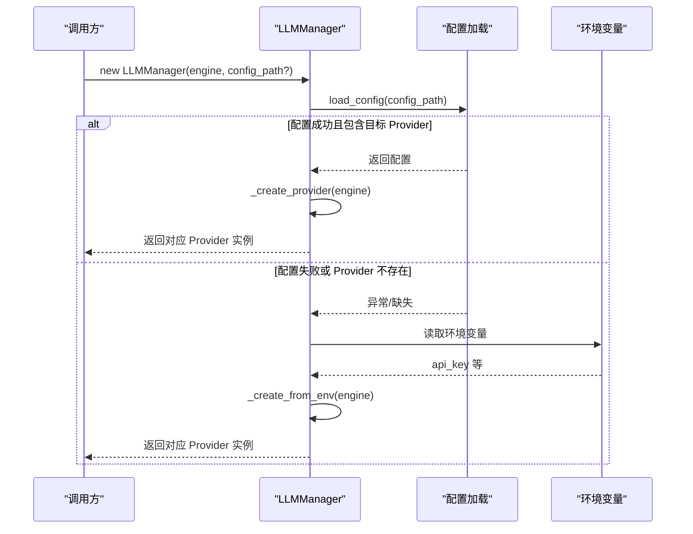
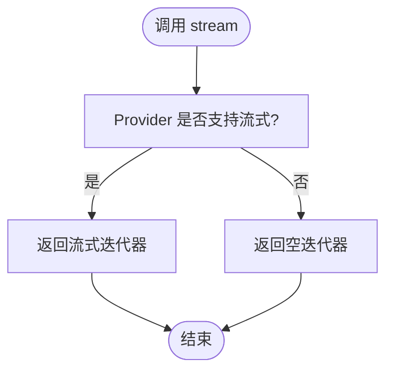
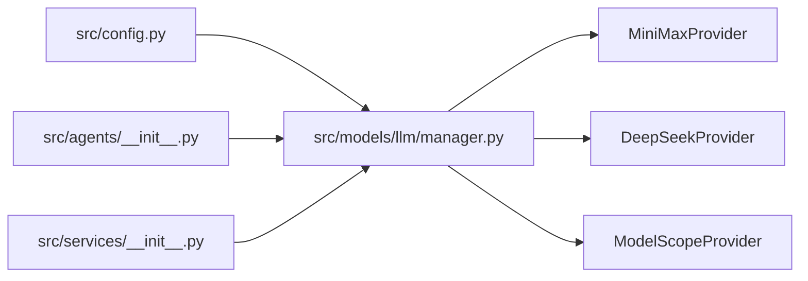

# LLM Provider 配置

<cite>
**本文引用的文件**
- [config.yaml](file://config.yaml)
- [env.example](file://env.example)
- [src/config.py](file://src/config.py)
- [src/llm/manager.py](file://src/llm/manager.py)
- [src/models/llm/manager.py](file://src/models/llm/manager.py)
- [src/agents/__init__.py](file://src/agents/__init__.py)
- [src/services/__init__.py](file://src/services/__init__.py)
- [README.md](file://README.md)
</cite>

## 目录
1. [简介](#简介)
2. [项目结构](#项目结构)
3. [核心组件](#核心组件)
4. [架构总览](#架构总览)
5. [详细组件分析](#详细组件分析)
6. [依赖关系分析](#依赖关系分析)
7. [性能考量](#性能考量)
8. [故障排查指南](#故障排查指南)
9. [结论](#结论)
10. [附录](#附录)

## 简介
本指南聚焦于 LLM Provider 的配置与使用，覆盖以下主题：
- 如何为 Minimax、ModelScope、DeepSeek 配置 API Key、Base URL、模型名称等
- Provider 切换机制与默认 Provider 的选择逻辑
- 配置示例与性能对比要点
- 配置热更新与验证方法
- 故障转移与降级策略
- 多 Provider 并行使用的配置思路

## 项目结构
与 LLM Provider 配置相关的关键文件与职责如下：
- 配置文件：config.yaml
- 环境变量模板：env.example
- 配置加载与校验：src/config.py
- Provider 实现与统一管理：src/models/llm/manager.py（主实现）、src/llm/manager.py（兼容层）
- 使用入口与示例：src/agents/__init__.py、src/services/__init__.py
- 项目文档与示例：README.md

**图示来源**
- [config.yaml](file://config.yaml#L3-L22)
- [src/config.py](file://src/config.py#L74-L108)
- [src/models/llm/manager.py](file://src/models/llm/manager.py#L206-L318)
- [src/agents/__init__.py](file://src/agents/__init__.py#L1-L15)
- [src/services/__init__.py](file://src/services/__init__.py#L1-L11)

**章节来源**
- [config.yaml](file://config.yaml#L1-L54)
- [src/config.py](file://src/config.py#L1-L109)
- [src/models/llm/manager.py](file://src/models/llm/manager.py#L1-L318)
- [src/llm/manager.py](file://src/llm/manager.py#L1-L318)
- [src/agents/__init__.py](file://src/agents/__init__.py#L1-L15)
- [src/services/__init__.py](file://src/services/__init__.py#L1-L11)
- [README.md](file://README.md#L43-L76)

## 核心组件
- 配置模型与加载
  - LLMConfig、LLMProvidersConfig、LLMConfigWrapper：定义配置结构
  - load_config：加载 config.yaml，替换环境变量占位符
  - _replace_env_vars/_get_env_or_default：递归替换 ${VAR} 为环境变量值
- Provider 实现
  - BaseProvider：提供统一的批量推理实现
  - MiniMaxProvider、DeepSeekProvider、ModelScopeProvider：分别对接不同提供商
- 统一管理器
  - LLMManager：根据 engine 参数选择 Provider；优先从配置加载，失败回退到环境变量

**章节来源**
- [src/config.py](file://src/config.py#L14-L108)
- [src/models/llm/manager.py](file://src/models/llm/manager.py#L45-L318)

## 架构总览
下图展示配置、Provider 与管理器之间的交互关系。

**图示来源**
- [src/config.py](file://src/config.py#L14-L30)
- [src/models/llm/manager.py](file://src/models/llm/manager.py#L45-L318)

## 详细组件分析

### 配置文件与环境变量
- 配置文件位置与默认加载
  - 默认从项目根目录加载 config.yaml
  - 可通过传入 config_path 自定义路径
- 环境变量替换
  - 支持 ${VAR} 形式的占位符，加载时递归替换
  - 若环境变量缺失，默认替换为空字符串
- 示例配置项
  - default：默认 Provider 名称（minimax、modelscope、deepseek）
  - providers.minimax/modelscope/deepseek：包含 provider、api_key、base_url、model 等

**章节来源**
- [src/config.py](file://src/config.py#L74-L108)
- [config.yaml](file://config.yaml#L3-L22)
- [env.example](file://env.example#L1-L10)

### Provider 切换与默认选择逻辑
- 初始化流程
  - LLMManager(engine, config_path)：engine 指定要使用的 Provider
  - _create_provider：尝试从配置加载对应 Provider 的 api_key、model 等
  - 若配置加载失败或 Provider 未配置，则回退到环境变量
- 默认 Provider 选择
  - 配置中的 default 字段用于标识默认 Provider 名称
  - 实际切换由调用方传入 engine 参数决定
- 兼容层
  - src/llm/manager.py 与 src/models/llm/manager.py 结构一致，后者为主实现

**图示来源**
- [src/models/llm/manager.py](file://src/models/llm/manager.py#L243-L295)
- [src/config.py](file://src/config.py#L74-L108)

**章节来源**
- [src/models/llm/manager.py](file://src/models/llm/manager.py#L243-L295)
- [src/llm/manager.py](file://src/llm/manager.py#L243-L295)

### Provider 实现差异与能力
- MiniMaxProvider
  - 支持 complete 与 complete_batch
  - stream 暂不支持，返回空迭代器
  - 通过 HTTP 请求调用，需要 api_key 与可选 group_id
- DeepSeekProvider
  - 基于 OpenAI SDK，支持 complete、complete_batch、stream
  - 默认 base_url 为 DeepSeek 官方地址
- ModelScopeProvider
  - 基于 OpenAI SDK，支持 complete、complete_batch、stream
  - 默认 base_url 为 ModelScope 官方地址

**图示来源**
- [src/models/llm/manager.py](file://src/models/llm/manager.py#L154-L157)
- [src/models/llm/manager.py](file://src/models/llm/manager.py#L94-L103)
- [src/models/llm/manager.py](file://src/models/llm/manager.py#L192-L201)

**章节来源**
- [src/models/llm/manager.py](file://src/models/llm/manager.py#L67-L202)

### 使用示例与最佳实践
- 基本使用
  - 通过 LLMManager("deepseek") 获取实例，随后调用 complete、complete_batch、stream
- 全局管理器
  - src/agents/__init__.py 提供全局 LLM 管理器，首次访问时以默认 engine 初始化
- 向后兼容
  - src/services/__init__.py 提供 get_llm(engine) 函数，便于旧代码迁移

**章节来源**
- [src/models/llm/manager.py](file://src/models/llm/manager.py#L206-L241)
- [src/agents/__init__.py](file://src/agents/__init__.py#L1-L15)
- [src/services/__init__.py](file://src/services/__init__.py#L1-L11)

## 依赖关系分析
- 配置到 Provider 的依赖
  - LLMManager 依赖 src/config.py 的配置加载
  - 各 Provider 依赖对应的 SDK 或 HTTP 库
- 模块耦合
  - LLMManager 与 Provider 通过协议接口解耦
  - BaseProvider 提供统一的批量推理实现，降低重复代码

**图示来源**
- [src/config.py](file://src/config.py#L74-L108)
- [src/models/llm/manager.py](file://src/models/llm/manager.py#L17-L18)
- [src/agents/__init__.py](file://src/agents/__init__.py#L1-L15)
- [src/services/__init__.py](file://src/services/__init__.py#L1-L11)

**章节来源**
- [src/config.py](file://src/config.py#L74-L108)
- [src/models/llm/manager.py](file://src/models/llm/manager.py#L17-L18)
- [src/agents/__init__.py](file://src/agents/__init__.py#L1-L15)
- [src/services/__init__.py](file://src/services/__init__.py#L1-L11)

## 性能考量
- 批量推理
  - BaseProvider 使用线程池并发调用，适合短文本批量处理
- 流式生成
  - DeepSeek 与 ModelScope 支持流式，实时输出更友好
  - MiniMax 当前不支持流式，如需实时性可结合轮询或改用其他 Provider
- 模型选择
  - 不同 Provider 的模型名称与能力不同，应根据任务选择合适模型
- 网络与限流
  - 外部 API 存在限流与延迟波动，建议在上层增加重试与超时控制

[本节为通用指导，无需特定文件来源]

## 故障排查指南
- 配置加载失败
  - 现象：日志出现警告并回退到环境变量
  - 排查：确认 config.yaml 路径与权限、环境变量是否正确设置
- API Key 缺失
  - 现象：初始化 Provider 时抛出异常
  - 排查：确保 env.example 中的 API Key 已填入 .env，并被加载
- Provider 未配置
  - 现象：_create_provider 返回环境变量回退
  - 排查：检查 config.yaml 中 providers 节点是否包含目标 Provider
- 流式不生效
  - 现象：MiniMax 返回空迭代器
  - 排查：确认使用的是支持流式的 Provider（DeepSeek/ModelScope）

**章节来源**
- [src/models/llm/manager.py](file://src/models/llm/manager.py#L276-L280)
- [src/models/llm/manager.py](file://src/models/llm/manager.py#L73-L77)
- [src/models/llm/manager.py](file://src/models/llm/manager.py#L154-L157)

## 结论
- 通过 config.yaml 与环境变量双通道配置，实现灵活的 Provider 管理
- LLMManager 提供统一接口，支持按需切换与回退
- 建议在生产环境中结合重试、超时与监控，保障稳定性

[本节为总结，无需特定文件来源]

## 附录

### 配置示例与要点
- 示例：Minimax
  - provider：minimax
  - api_key：从环境变量读取
  - base_url：官方地址
  - model：指定模型名称
- 示例：ModelScope
  - provider：modelscope
  - api_key：从环境变量读取
  - base_url：官方地址
  - model：指定模型名称
- 示例：DeepSeek
  - provider：deepseek
  - api_key：从环境变量读取
  - base_url：官方地址
  - model：指定模型名称

**章节来源**
- [config.yaml](file://config.yaml#L7-L21)
- [env.example](file://env.example#L5-L6)

### 默认 Provider 与切换逻辑
- default 字段用于标识默认 Provider 名称
- 实际切换由调用方传入 engine 参数决定
- 兼容层与主实现保持一致行为

**章节来源**
- [config.yaml](file://config.yaml#L5)
- [src/models/llm/manager.py](file://src/models/llm/manager.py#L243-L295)

### 配置热更新与验证
- 热更新
  - 当前实现未内置热更新机制；可通过重启进程重新加载配置
- 验证方法
  - 使用最小化调用链：LLMManager 初始化 → complete → 检查返回内容
  - 对比不同 Provider 的响应时间与稳定性

**章节来源**
- [src/models/llm/manager.py](file://src/models/llm/manager.py#L243-L295)

### 故障转移与降级策略
- 策略建议
  - 主 Provider 失败时，自动切换到备用 Provider
  - 对 MiniMax 的流式不支持场景，可降级为轮询或切换到支持流式的 Provider
- 实施方式
  - 在应用层封装一层“智能路由”，根据错误类型与指标动态选择 Provider

[本节为通用指导，无需特定文件来源]

### 多 Provider 并行使用
- 思路
  - 同时创建多个 LLMManager 实例，分别指向不同 Provider
  - 在上层根据任务特征选择合适的实例
- 注意事项
  - 控制并发与资源占用，避免同时请求过多外部 API

**章节来源**
- [src/models/llm/manager.py](file://src/models/llm/manager.py#L206-L241)