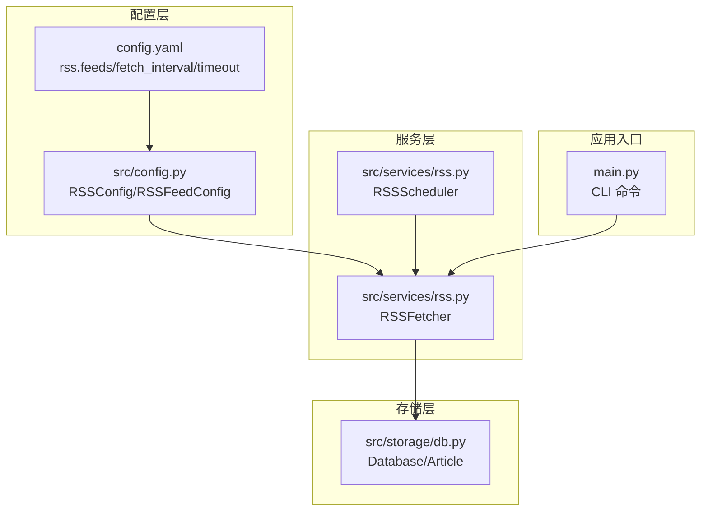
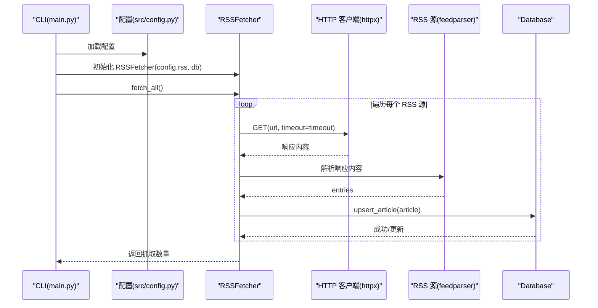
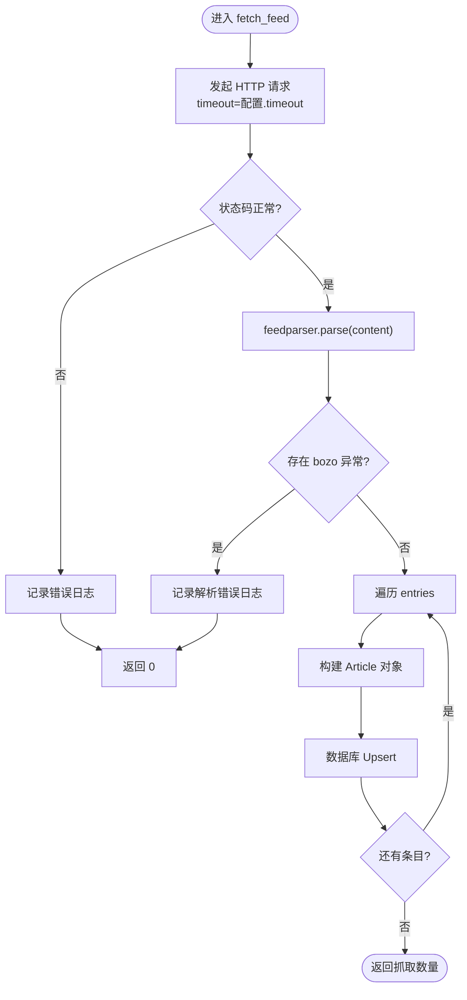
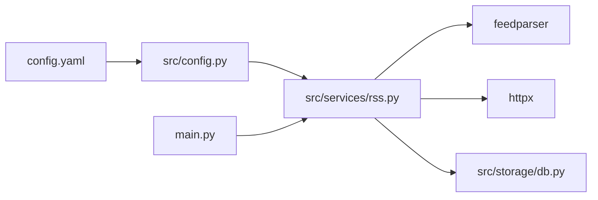

# RSS 订阅源配置

<cite>
**本文档引用的文件**
- [config.yaml](file://config.yaml)
- [src/config.py](file://src/config.py)
- [src/services/rss.py](file://src/services/rss.py)
- [src/storage/db.py](file://src/storage/db.py)
- [main.py](file://main.py)
- [README.md](file://README.md)
- [scripts/fetch_sample.py](file://scripts/fetch_sample.py)
</cite>

## 目录
1. [简介](#简介)
2. [项目结构](#项目结构)
3. [核心组件](#核心组件)
4. [架构总览](#架构总览)
5. [详细组件分析](#详细组件分析)
6. [依赖关系分析](#依赖关系分析)
7. [性能考量](#性能考量)
8. [故障排除指南](#故障排除指南)
9. [结论](#结论)

## 简介
本指南面向希望配置和管理 RSS 订阅源的用户，涵盖 RSS feeds 数组的配置格式、URL 与 name 字段设置、抓取行为参数（fetch_interval 与 timeout）的影响、常见 RSS 源配置示例与最佳实践、频率控制与资源限制、RSS 源验证方法、故障排除以及如何添加自定义 RSS 源与处理特殊格式的 RSS feeds。通过本指南，您将能够安全、高效地集成 RSS 数据到系统中，并获得稳定的抓取体验。

## 项目结构
RSS 功能由配置模块、服务模块、存储模块与主程序入口共同组成，形成清晰的分层架构：
- 配置层：定义 RSSConfig、RSSFeedConfig 等数据结构，负责从 YAML 加载并校验配置。
- 服务层：RSSFetcher 负责抓取与解析，RSSScheduler 负责定时调度。
- 存储层：Database 提供 SQLite 存储与 Upsert 机制，Article 模型承载文章数据。
- 应用入口：main.py 提供 CLI 命令，支持手动触发抓取、解析与报告生成。

图表来源
- [src/config.py](file://src/config.py#L32-L41)
- [config.yaml](file://config.yaml#L23-L31)
- [src/services/rss.py](file://src/services/rss.py#L15-L122)
- [src/storage/db.py](file://src/storage/db.py#L65-L123)
- [main.py](file://main.py#L66-L82)

章节来源
- [config.yaml](file://config.yaml#L23-L31)
- [src/config.py](file://src/config.py#L32-L41)
- [src/services/rss.py](file://src/services/rss.py#L15-L122)
- [src/storage/db.py](file://src/storage/db.py#L65-L123)
- [main.py](file://main.py#L66-L82)

## 核心组件
- RSSConfig：顶层 RSS 配置对象，包含 feeds 列表、抓取间隔（秒）、超时（秒）。
- RSSFeedConfig：单个 RSS 源配置，包含 url 与 name。
- RSSFetcher：负责抓取、解析与入库，支持超时控制与错误记录。
- RSSScheduler：基于时间间隔的定时抓取调度器。
- Database：SQLite 存储，提供文章 Upsert 与查询能力。

章节来源
- [src/config.py](file://src/config.py#L32-L41)
- [src/services/rss.py](file://src/services/rss.py#L15-L122)
- [src/storage/db.py](file://src/storage/db.py#L65-L123)

## 架构总览
RSS 抓取流程从配置加载开始，经由 RSSFetcher 抓取并解析，最终写入数据库；RSSScheduler 可按配置周期性触发抓取。

图表来源
- [main.py](file://main.py#L74-L81)
- [src/config.py](file://src/config.py#L32-L41)
- [src/services/rss.py](file://src/services/rss.py#L22-L60)
- [src/storage/db.py](file://src/storage/db.py#L97-L122)

## 详细组件分析

### RSS 配置格式与字段说明
- rss.feeds：数组，每个元素包含两个必需字段：
  - url：RSS 源地址，支持标准 RSS/Atom 格式。
  - name：订阅源名称，用于标识来源。
- rss.fetch_interval：整数，单位秒，控制定时抓取周期。
- rss.timeout：整数，单位秒，控制 HTTP 请求超时。

章节来源
- [config.yaml](file://config.yaml#L23-L31)
- [src/config.py](file://src/config.py#L32-L41)

### RSS 抓取器（RSSFetcher）
- 功能职责
  - 抓取所有配置的 RSS 源并聚合结果。
  - 对单个 RSS 源发起 HTTP 请求，解析 feedparser 输出。
  - 解析条目为 Article 对象，执行数据库 Upsert。
- 关键行为
  - 使用 httpx.Client 并传入 timeout 配置。
  - 解析顺序：published_parsed > updated_parsed；摘要优先 summary，其次 content 或 description。
  - 标签提取为逗号分隔字符串。
  - 文章内容与摘要截断长度限制，避免过大数据入库。
- 错误处理
  - HTTP 请求异常与 RSS 解析异常均记录日志并跳过该源。

图表来源
- [src/services/rss.py](file://src/services/rss.py#L34-L60)
- [src/services/rss.py](file://src/services/rss.py#L62-L100)

章节来源
- [src/services/rss.py](file://src/services/rss.py#L15-L122)

### 定时调度器（RSSScheduler）
- 功能职责
  - 基于 fetch_interval 启动循环抓取。
  - 每次循环调用 RSSFetcher.fetch_all()。
- 注意事项
  - 当前实现为阻塞式循环，适合单线程场景。
  - 若需更复杂的调度策略（如多进程、异步），可在上层封装。

章节来源
- [src/services/rss.py](file://src/services/rss.py#L110-L122)

### 数据模型与存储（Database/Article）
- Article 模型
  - 字段：feed_name、title、url（唯一）、summary、content、published_at、fetched_at、tags。
  - Upsert 逻辑：若 url 已存在则更新，否则插入新记录。
- Database
  - 使用 SQLite + WAL 模式，支持并发读写。
  - 提供文章查询、未解析文章筛选等辅助方法。

章节来源
- [src/storage/db.py](file://src/storage/db.py#L14-L26)
- [src/storage/db.py](file://src/storage/db.py#L97-L122)

### 配置加载与 CLI 集成
- 配置加载
  - 从 config.yaml 读取，支持环境变量替换。
  - 使用 Pydantic 模型校验类型与结构。
- CLI 命令
  - rss fetch：抓取所有 RSS 源并写入数据库。
  - rss parse：批量解析未处理文章。
  - rss report：生成日报/周报。

章节来源
- [src/config.py](file://src/config.py#L74-L88)
- [main.py](file://main.py#L66-L82)

## 依赖关系分析
RSS 功能的关键依赖关系如下：
- 配置层依赖 YAML 文件与环境变量。
- 服务层依赖 feedparser 解析 RSS，httpx 发起 HTTP 请求。
- 存储层依赖 SQLite 与 SQLModel。
- 应用入口依赖配置与服务层。

图表来源
- [config.yaml](file://config.yaml#L23-L31)
- [src/config.py](file://src/config.py#L74-L88)
- [src/services/rss.py](file://src/services/rss.py#L4-L12)
- [src/storage/db.py](file://src/storage/db.py#L65-L78)
- [main.py](file://main.py#L14-L18)

章节来源
- [src/config.py](file://src/config.py#L74-L88)
- [src/services/rss.py](file://src/services/rss.py#L4-L12)
- [src/storage/db.py](file://src/storage/db.py#L65-L78)
- [main.py](file://main.py#L14-L18)

## 性能考量
- 超时控制（timeout）
  - 影响单个 RSS 源的请求等待时间，建议根据网络状况与源稳定性设置（例如 30-60 秒）。
- 抓取间隔（fetch_interval）
  - 控制定时抓取周期，建议结合源更新频率与带宽限制合理设置（如 1800-7200 秒）。
- 数据库写入
  - 使用 Upsert 减少重复写入，WAL 模式提升并发性能。
- 内容截断
  - 摘要与正文截断避免大字段占用过多存储与内存。
- 并发与扩展
  - 当前为单线程循环；若需高吞吐，可考虑多线程/异步或外部调度器（如 Celery、APScheduler）。

章节来源
- [src/services/rss.py](file://src/services/rss.py#L37-L39)
- [src/storage/db.py](file://src/storage/db.py#L72-L89)

## 故障排除指南
- 常见问题与诊断步骤
  - HTTP 请求失败
    - 现象：日志出现“请求失败”错误。
    - 排查：检查网络连通性、代理设置、源地址可达性；适当提高 timeout。
  - RSS 解析失败
    - 现象：日志出现“RSS 解析失败”错误。
    - 排查：确认 RSS 地址正确且返回有效内容；检查 feedparser 版本兼容性。
  - 条目为空或缺失
    - 现象：抓取数量为 0。
    - 排查：确认 RSS 源是否包含 entries；检查字段映射（published_parsed/updated_parsed/summary/content/description）。
  - 重复数据
    - 现象：数据库中出现重复 URL。
    - 排查：确认 Upsert 逻辑正常；检查 URL 是否一致。
- 诊断工具与方法
  - 使用 CLI 命令手动抓取：python main.py fetch。
  - 查看日志文件：config.yaml 中 logging.file 指定位置。
  - 验证 RSS 源有效性：在浏览器或 curl 中访问 RSS 地址，确认返回 XML/Atom 内容。
- 修复建议
  - 调整 fetch_interval 与 timeout 以适配网络环境。
  - 为不稳定源增加重试逻辑（可在上层封装）。
  - 对于特殊格式 RSS，确保 feedparser 能正确解析；必要时在解析阶段做字段兼容处理。

章节来源
- [src/services/rss.py](file://src/services/rss.py#L34-L60)
- [config.yaml](file://config.yaml#L42-L47)
- [main.py](file://main.py#L66-L82)

## 结论
通过本指南，您可以：
- 正确配置 RSS feeds 数组，设置 URL 与 name 字段；
- 合理调整 fetch_interval 与 timeout，平衡抓取频率与资源消耗；
- 使用常见 RSS 源示例与最佳实践，确保稳定抓取；
- 通过日志与 CLI 工具进行验证与故障排除；
- 为自定义 RSS 源与特殊格式提供扩展思路。