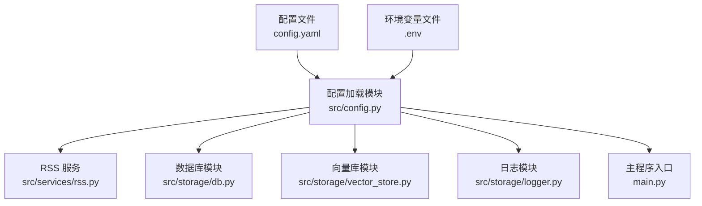
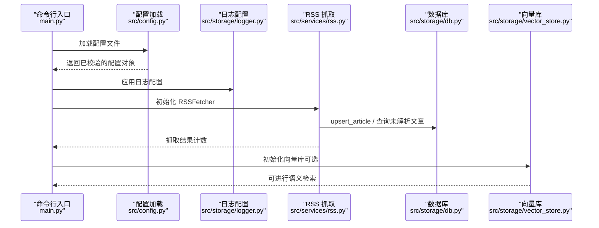
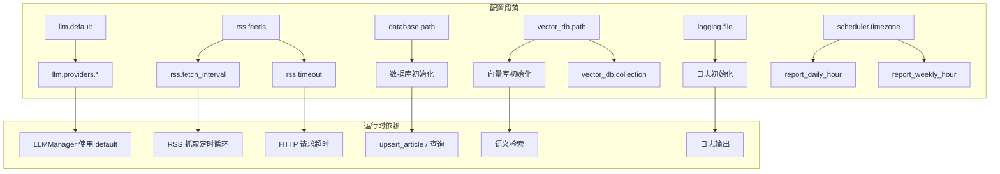

# 主配置文件详解

<cite>
**本文档引用的文件**
- [config.yaml](file://config.yaml)
- [src/config.py](file://src/config.py)
- [src/storage/db.py](file://src/storage/db.py)
- [src/storage/vector_store.py](file://src/storage/vector_store.py)
- [src/services/rss.py](file://src/services/rss.py)
- [src/storage/logger.py](file://src/storage/logger.py)
- [main.py](file://main.py)
- [env.example](file://env.example)
</cite>

## 目录
1. [简介](#简介)
2. [项目结构](#项目结构)
3. [核心组件](#核心组件)
4. [架构总览](#架构总览)
5. [详细组件分析](#详细组件分析)
6. [依赖关系分析](#依赖关系分析)
7. [性能考虑](#性能考虑)
8. [故障排除指南](#故障排除指南)
9. [结论](#结论)

## 简介
本文件为 Brief Agent 的主配置文件 config.yaml 的权威说明文档。内容涵盖 LLM Provider 配置、RSS Feeds 配置、Database 配置、Vector Database 配置、Logging 配置以及 Scheduler 配置等六大模块，逐项解释各配置段落的作用与配置项含义，并给出配置项之间的依赖关系、约束条件、配置验证方法与常见问题排查指南，同时明确配置文件的加载顺序与优先级规则。

## 项目结构
Brief Agent 采用“配置驱动”的设计模式：应用通过统一的配置加载模块读取 YAML 配置文件，结合 Pydantic 数据模型进行类型校验与默认值处理；随后由各子系统（RSS 抓取、数据库、向量库、日志、调度器）按需使用配置参数。

图表来源
- [config.yaml](file://config.yaml#L1-L54)
- [src/config.py](file://src/config.py#L74-L109)
- [src/services/rss.py](file://src/services/rss.py#L15-L123)
- [src/storage/db.py](file://src/storage/db.py#L65-L94)
- [src/storage/vector_store.py](file://src/storage/vector_store.py#L15-L35)
- [src/storage/logger.py](file://src/storage/logger.py#L8-L39)
- [main.py](file://main.py#L14-L64)

章节来源
- [config.yaml](file://config.yaml#L1-L54)
- [src/config.py](file://src/config.py#L74-L109)

## 核心组件
本节对 config.yaml 中的六大配置段落进行逐项解读，说明其作用、字段含义、默认行为与使用场景。

- LLM Provider 配置（llm）
  - default：默认使用的 LLM 提供商名称，必须与 providers 下的某个键一致。
  - providers：提供多个 LLM 提供商的具体配置，支持 minimax、modelscope、deepseek 等键。每个提供商包含 provider、api_key、base_url、model 四个字段。
  - 依赖与约束：
    - default 必须存在于 providers 的键集合中。
    - api_key 支持通过环境变量引用（形如 ${VAR}），若环境变量缺失，将被替换为空字符串。
    - base_url 与 model 为必填项，用于 LLMManager 初始化与调用。
  - 使用场景：在生成 PPT 的 LLM 智能拆分环节选择默认提供商。

- RSS Feeds 配置（rss）
  - feeds：RSS 订阅源列表，每个元素包含 url 与 name 两个字段。
  - fetch_interval：RSS 抓取间隔（秒），用于定时抓取任务的周期设置。
  - timeout：HTTP 请求超时时间（秒），用于 RSS 抓取网络请求的超时控制。
  - 依赖与约束：
    - fetch_interval 与 timeout 均为正整数。
    - feeds 列表至少包含一个订阅源。
  - 使用场景：RSSFetcher 在定时循环中按 fetch_interval 抓取 feeds 列表中的每个源。

- Database 配置（database）
  - path：SQLite 数据库存储路径，支持相对路径与绝对路径。首次使用会自动创建目录与数据库文件。
  - 依赖与约束：
    - 路径父目录会被自动创建。
    - 连接参数包含超时与线程安全设置，以支持并发读写。
  - 使用场景：RSS 抓取结果与文章解析结果持久化存储。

- Vector Database 配置（vector_db）
  - path：ChromaDB 持久化目录路径。
  - collection：ChromaDB 集合名称，用于存储 RSS 文章的向量表示。
  - 依赖与约束：
    - path 目录会在初始化时自动创建。
    - collection 名称唯一且用于检索与查询。
  - 使用场景：RAG 检索与语义搜索。

- Logging 配置（logging）
  - level：日志级别（如 INFO、DEBUG 等）。
  - file：日志文件路径，支持相对路径与绝对路径。
  - rotation：日志轮转大小阈值（如 "10 MB"）。
  - retention：日志保留天数（如 "7 days"）。
  - 依赖与约束：
    - file 路径父目录会被自动创建。
    - rotation 与 retention 为字符串格式，遵循 loguru 的轮转与保留策略。
  - 使用场景：全局日志输出与控制台输出。

- Scheduler 配置（scheduler）
  - timezone：时区标识符（如 "Asia/Shanghai"），用于定时任务的时间基准。
  - report_daily_hour：每日报告生成的小时（24 小时制）。
  - report_weekly_hour：每周报告生成的小时（24 小时制，周一生效）。
  - 依赖与约束：
    - timezone 为合法时区字符串。
    - report_daily_hour 与 report_weekly_hour 为 0-23 的整数。
  - 使用场景：定时生成日报与周报（当前代码中主要体现为命令行接口与日志配置）。

章节来源
- [config.yaml](file://config.yaml#L3-L54)
- [src/config.py](file://src/config.py#L14-L71)
- [src/services/rss.py](file://src/services/rss.py#L110-L123)
- [src/storage/db.py](file://src/storage/db.py#L65-L94)
- [src/storage/vector_store.py](file://src/storage/vector_store.py#L15-L35)
- [src/storage/logger.py](file://src/storage/logger.py#L8-L39)

## 架构总览
下图展示了配置文件如何驱动各子系统的运行流程，以及配置项之间的耦合关系。

图表来源
- [main.py](file://main.py#L54-L64)
- [src/config.py](file://src/config.py#L74-L89)
- [src/storage/logger.py](file://src/storage/logger.py#L8-L39)
- [src/services/rss.py](file://src/services/rss.py#L15-L61)
- [src/storage/db.py](file://src/storage/db.py#L97-L123)
- [src/storage/vector_store.py](file://src/storage/vector_store.py#L15-L35)

## 详细组件分析

### LLM Provider 配置（llm）
- 结构与字段
  - default：字符串，指定默认提供商键名。
  - providers：字典，包含 minimax、modelscope、deepseek 等键，每个键对应一个 LLMConfig 对象，包含 provider、api_key、base_url、model。
- 关键实现点
  - 配置加载时会递归替换形如 ${VAR} 的环境变量引用，若环境变量不存在则替换为空字符串。
  - LLMManager 在生成 PPT 的智能拆分阶段使用 default 指定的提供商。
- 依赖关系
  - default 必须出现在 providers 的键集合中。
  - api_key 通过环境变量注入，确保敏感信息不硬编码在仓库中。
- 常见问题
  - default 与 providers 键不匹配会导致运行时无法选择正确提供商。
  - 缺失 API Key 会导致 LLM 调用失败，需检查 .env 文件与环境变量是否正确加载。

章节来源
- [config.yaml](file://config.yaml#L4-L21)
- [src/config.py](file://src/config.py#L14-L30)
- [src/config.py](file://src/config.py#L91-L109)
- [main.py](file://main.py#L148-L152)

### RSS Feeds 配置（rss）
- 结构与字段
  - feeds：列表，每个元素为 RSSFeedConfig，包含 url 与 name。
  - fetch_interval：整数，抓取周期（秒）。
  - timeout：整数，HTTP 请求超时（秒）。
- 关键实现点
  - RSSFetcher 在定时循环中遍历 feeds，使用 timeout 控制请求超时。
  - 抓取成功后批量写入数据库，避免重复记录。
- 依赖关系
  - feeds 至少包含一个订阅源。
  - fetch_interval 与 timeout 必须为正整数。
- 常见问题
  - RSS 源 URL 不可用或返回非标准格式会导致解析失败。
  - 超时过小可能导致网络波动时频繁失败。

章节来源
- [config.yaml](file://config.yaml#L23-L31)
- [src/config.py](file://src/config.py#L32-L41)
- [src/services/rss.py](file://src/services/rss.py#L22-L61)

### Database 配置（database）
- 结构与字段
  - path：字符串，SQLite 数据库存储路径。
- 关键实现点
  - 首次初始化会自动创建目录与数据库文件。
  - 使用 WAL 模式与超时设置，提升并发读写性能。
- 依赖关系
  - 路径父目录会被自动创建。
  - 连接参数包含超时与线程安全设置。
- 常见问题
  - 权限不足导致无法创建数据库文件。
  - 路径为只读挂载时初始化失败。

章节来源
- [config.yaml](file://config.yaml#L33-L35)
- [src/config.py](file://src/config.py#L43-L45)
- [src/storage/db.py](file://src/storage/db.py#L65-L94)

### Vector Database 配置（vector_db）
- 结构与字段
  - path：字符串，ChromaDB 持久化目录路径。
  - collection：字符串，集合名称。
- 关键实现点
  - 初始化时自动创建目录并获取/创建集合。
  - 使用 SentenceTransformer 生成嵌入向量，支持语义检索与按日期范围检索。
- 依赖关系
  - path 目录会在初始化时自动创建。
  - collection 名称唯一，用于检索与查询。
- 常见问题
  - 集合元数据变更后需要重建索引。
  - 嵌入模型初始化耗时较长，建议预热。

章节来源
- [config.yaml](file://config.yaml#L37-L41)
- [src/config.py](file://src/config.py#L47-L50)
- [src/storage/vector_store.py](file://src/storage/vector_store.py#L15-L35)

### Logging 配置（logging）
- 结构与字段
  - level：字符串，日志级别。
  - file：字符串，日志文件路径。
  - rotation：字符串，日志轮转大小阈值。
  - retention：字符串，日志保留天数。
- 关键实现点
  - 日志文件路径父目录会被自动创建。
  - 同时输出到文件与控制台，便于开发调试。
- 依赖关系
  - file 路径父目录会被自动创建。
  - rotation 与 retention 为字符串格式，遵循 loguru 的轮转与保留策略。
- 常见问题
  - 文件权限不足导致无法写入日志。
  - 轮转阈值过小导致频繁轮转影响性能。

章节来源
- [config.yaml](file://config.yaml#L42-L48)
- [src/config.py](file://src/config.py#L52-L57)
- [src/storage/logger.py](file://src/storage/logger.py#L8-L39)

### Scheduler 配置（scheduler）
- 结构与字段
  - timezone：字符串，时区标识符。
  - report_daily_hour：整数，每日报告生成小时。
  - report_weekly_hour：整数，每周报告生成小时（周一生效）。
- 关键实现点
  - 当前代码中主要体现为命令行接口与日志配置，定时生成日报与周报的逻辑在主程序中通过命令触发。
- 依赖关系
  - timezone 为合法时区字符串。
  - report_daily_hour 与 report_weekly_hour 为 0-23 的整数。
- 常见问题
  - 时区设置错误导致报告生成时间偏差。
  - 小时设置超出范围导致逻辑异常。

章节来源
- [config.yaml](file://config.yaml#L49-L54)
- [src/config.py](file://src/config.py#L59-L63)
- [main.py](file://main.py#L107-L141)

## 依赖关系分析
下图展示配置项之间的依赖关系与约束条件，帮助理解配置的合理性与一致性。

图表来源
- [src/config.py](file://src/config.py#L27-L30)
- [src/config.py](file://src/config.py#L37-L41)
- [src/config.py](file://src/config.py#L43-L50)
- [src/config.py](file://src/config.py#L52-L63)
- [src/services/rss.py](file://src/services/rss.py#L110-L123)
- [src/storage/db.py](file://src/storage/db.py#L97-L123)
- [src/storage/vector_store.py](file://src/storage/vector_store.py#L15-L35)
- [src/storage/logger.py](file://src/storage/logger.py#L8-L39)

## 性能考虑
- RSS 抓取
  - fetch_interval 与 timeout 的合理设置可平衡抓取频率与网络开销。
  - 批量写入数据库可减少事务开销。
- 数据库
  - WAL 模式与超时设置有助于提升并发读写性能。
- 向量库
  - 嵌入模型初始化耗时较长，建议在应用启动时预热。
  - 按需检索与限制返回结果数量可降低查询成本。
- 日志
  - 合理的日志级别与轮转策略可避免磁盘空间占用过大。

## 故障排除指南
- 配置加载失败
  - 确认 config.yaml 语法正确（缩进、冒号、引号）。
  - 检查环境变量文件 .env 是否存在且包含必要的 API Key。
  - 若使用自定义配置路径，确认 CONFIG_PATH 环境变量设置正确。
- LLM 调用失败
  - 检查 default 指向的提供商是否在 providers 中存在。
  - 确认对应提供商的 api_key 已正确注入。
- RSS 抓取异常
  - 检查 feeds 中的 URL 是否可访问。
  - 调整 timeout 以适应网络环境。
  - 查看日志中关于 HTTP 请求与 RSS 解析的错误信息。
- 数据库初始化失败
  - 检查 database.path 的父目录权限。
  - 确认 SQLite 文件未被其他进程锁定。
- 向量库初始化失败
  - 检查 vector_db.path 的父目录权限。
  - 确认 ChromaDB 依赖已安装。
- 日志输出异常
  - 检查 logging.file 的父目录权限。
  - 确认日志轮转与保留策略符合预期。

章节来源
- [src/config.py](file://src/config.py#L74-L109)
- [src/storage/logger.py](file://src/storage/logger.py#L8-L39)
- [src/services/rss.py](file://src/services/rss.py#L34-L61)
- [src/storage/db.py](file://src/storage/db.py#L65-L94)
- [src/storage/vector_store.py](file://src/storage/vector_store.py#L15-L35)
- [env.example](file://env.example#L1-L10)

## 结论
config.yaml 是 Brief Agent 的配置中枢，通过严格的字段定义与类型校验，确保各子系统在运行期获得一致、可靠的参数。遵循本文档的配置说明、依赖关系与故障排除指南，可有效提升系统的稳定性与可维护性。建议在生产环境中：
- 将敏感信息（API Key）置于 .env 文件并通过环境变量注入。
- 根据业务需求调整 RSS 抓取频率与超时时间。
- 定期检查数据库与向量库的存储空间与性能指标。
- 合理设置日志级别与轮转策略，平衡可观测性与资源消耗。