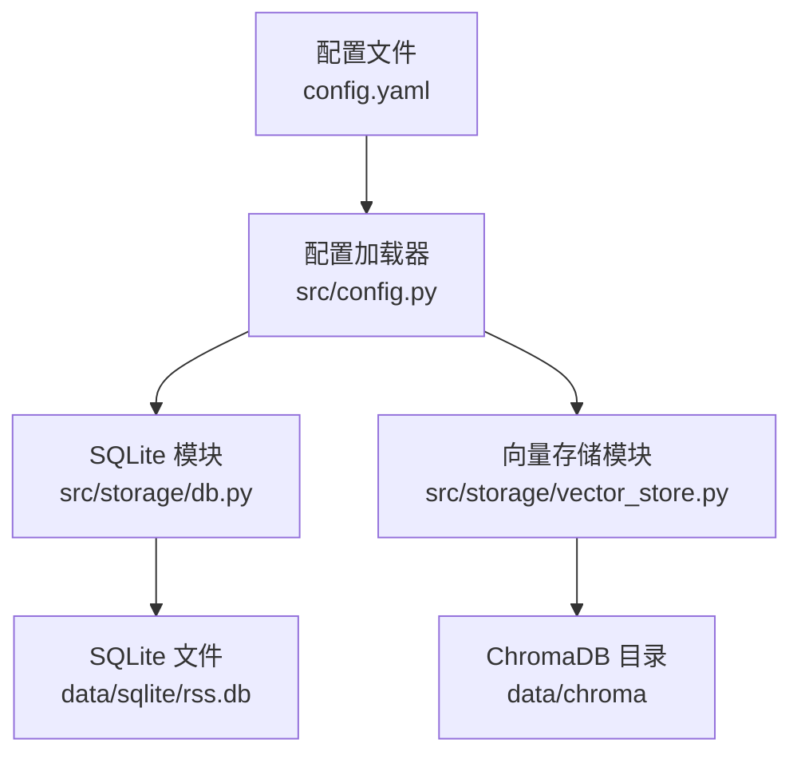
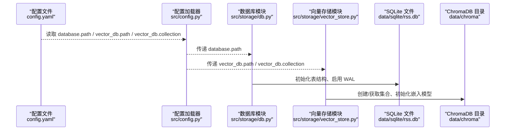
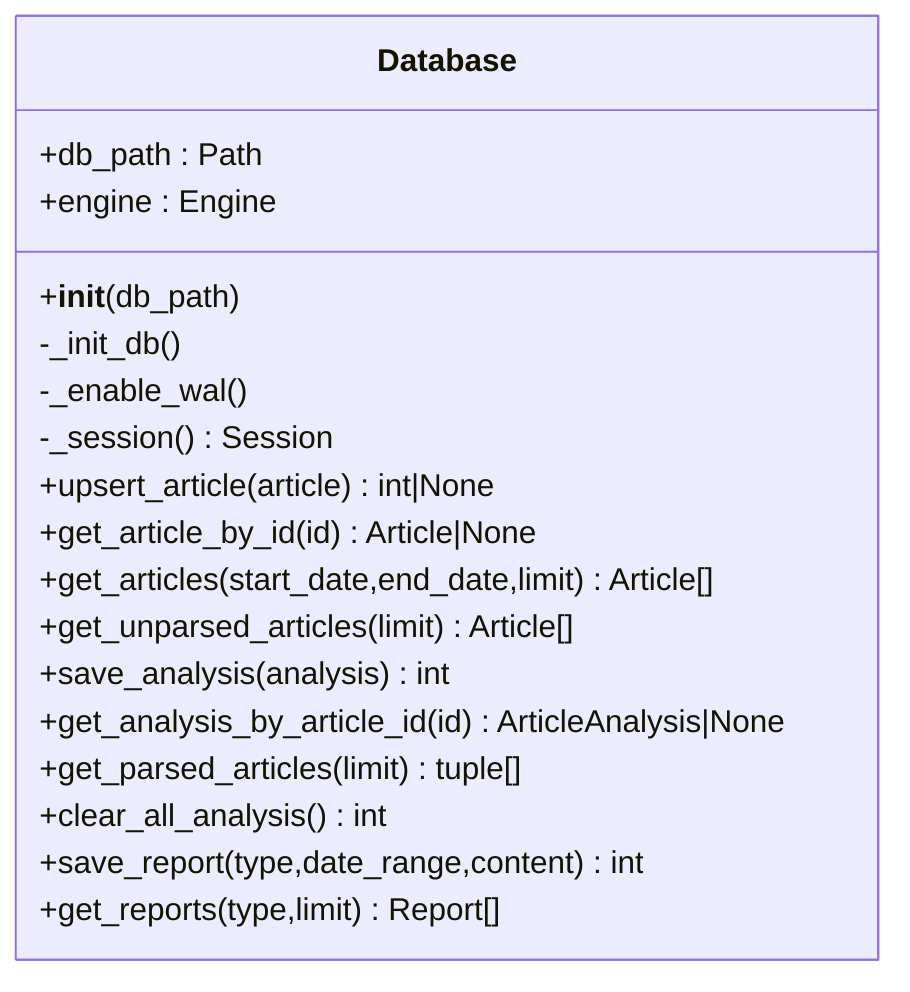
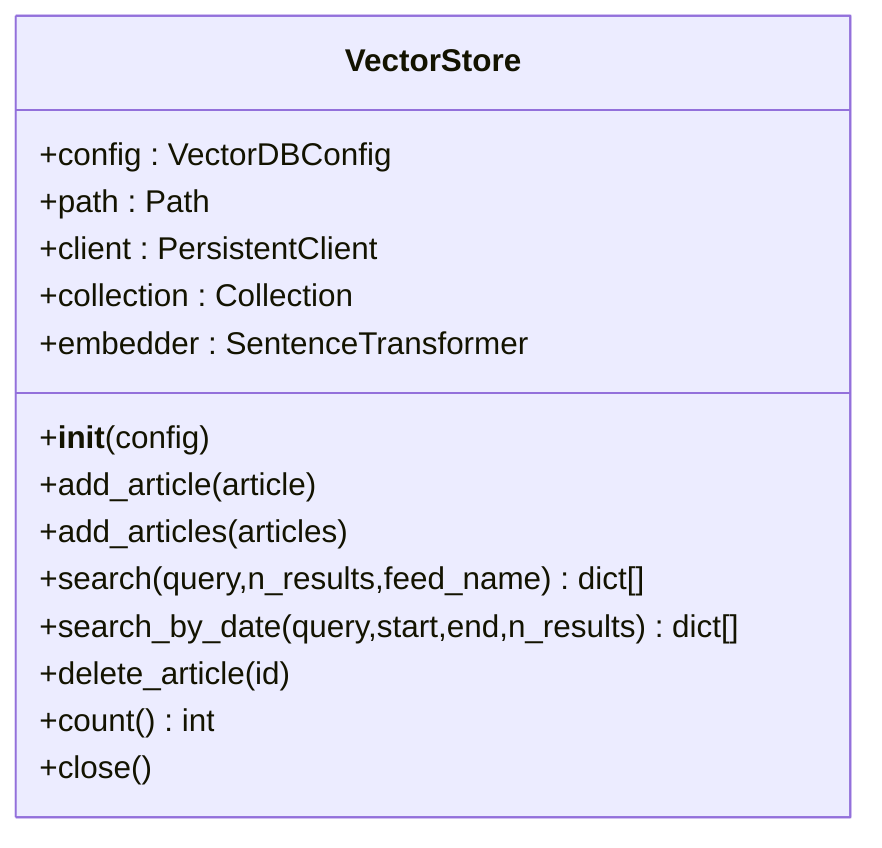
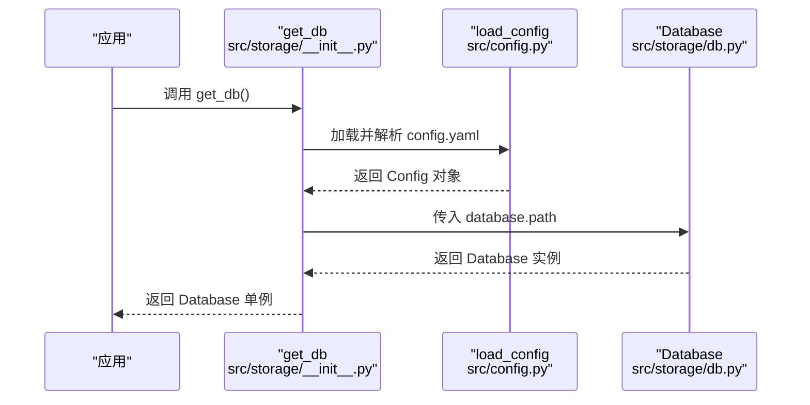
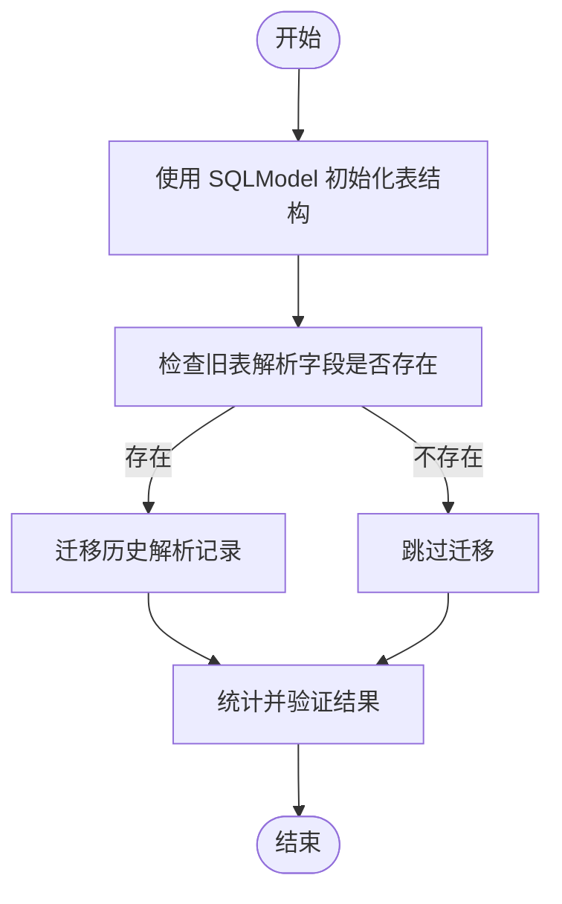
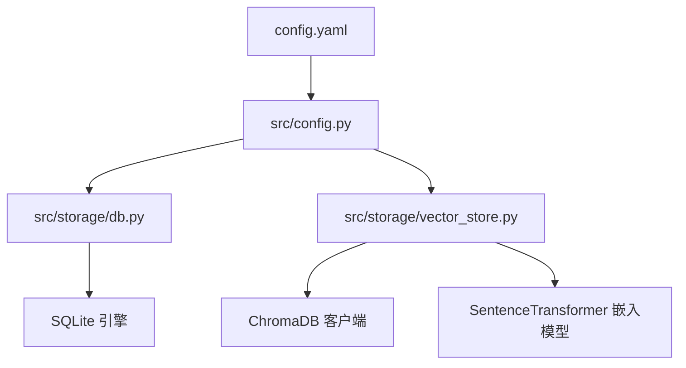

# 数据库配置

<cite>
**本文档引用的文件**
- [config.yaml](file://config.yaml)
- [src/config.py](file://src/config.py)
- [src/storage/db.py](file://src/storage/db.py)
- [src/storage/vector_store.py](file://src/storage/vector_store.py)
- [src/storage/__init__.py](file://src/storage/__init__.py)
- [scripts/migrate_db.py](file://scripts/migrate_db.py)
- [env.example](file://env.example)
- [pyproject.toml](file://pyproject.toml)
</cite>

## 目录
1. [简介](#简介)
2. [项目结构](#项目结构)
3. [核心组件](#核心组件)
4. [架构总览](#架构总览)
5. [详细组件分析](#详细组件分析)
6. [依赖关系分析](#依赖关系分析)
7. [性能考虑](#性能考虑)
8. [故障排除指南](#故障排除指南)
9. [结论](#结论)
10. [附录](#附录)

## 简介
本指南面向数据库管理员与开发者，系统性说明本项目的数据库配置与运维实践，重点覆盖：
- SQLite 数据库配置（database.path）
- ChromaDB 向量数据库配置（vector_db.path、vector_db.collection）
- 数据库文件存储位置与权限要求
- 数据库初始化与迁移机制
- 不同数据库类型的配置示例与性能调优建议
- 数据库备份与恢复策略
- 数据库连接池与并发访问控制
- 故障排除与维护指南

## 项目结构
本项目采用“配置驱动 + 模块化存储”的设计：
- 配置文件通过 YAML 定义数据库与向量数据库路径、集合名等参数，并由 Python 模块进行类型校验与加载。
- 存储层分为两部分：
  - SQLite：基于 SQLModel 的 ORM 层，负责结构化数据持久化。
  - ChromaDB：基于 PersistentClient 的向量存储，负责 RAG 场景的语义检索。

图表来源
- [config.yaml](file://config.yaml#L33-L41)
- [src/config.py](file://src/config.py#L65-L88)
- [src/storage/db.py](file://src/storage/db.py#L68-L93)
- [src/storage/vector_store.py](file://src/storage/vector_store.py#L18-L35)

章节来源
- [config.yaml](file://config.yaml#L33-L41)
- [src/config.py](file://src/config.py#L65-L88)

## 核心组件
- 数据库配置模型：定义 database.path 字段，用于 SQLite 文件路径。
- 向量数据库配置模型：定义 vector_db.path 与 vector_db.collection，分别指向 ChromaDB 持久化目录与集合名称。
- 数据库管理类：封装 SQLite 初始化、WAL 模式启用、会话管理与常用 CRUD 操作。
- 向量存储类：封装 ChromaDB 客户端、集合创建、嵌入编码、增删改查与关闭连接。

章节来源
- [src/config.py](file://src/config.py#L43-L50)
- [src/storage/db.py](file://src/storage/db.py#L65-L93)
- [src/storage/vector_store.py](file://src/storage/vector_store.py#L15-L35)

## 架构总览
下图展示从配置到数据库实例的构建流程，以及两类数据库的职责边界。

图表来源
- [config.yaml](file://config.yaml#L33-L41)
- [src/config.py](file://src/config.py#L65-L88)
- [src/storage/db.py](file://src/storage/db.py#L68-L93)
- [src/storage/vector_store.py](file://src/storage/vector_store.py#L18-L35)

## 详细组件分析

### SQLite 数据库配置与初始化
- 配置项
  - database.path：SQLite 文件绝对或相对路径，默认位于 data/sqlite/rss.db。
- 初始化机制
  - 在构造函数中自动创建父目录，确保路径存在。
  - 使用 SQLModel 元数据创建所有表。
  - 启用 WAL 模式与忙等待超时，提升并发读写能力。
- 会话与事务
  - 提供会话工厂方法，所有操作在显式上下文中执行，保证事务一致性。
- 常用操作
  - 文章去重插入/更新、按日期范围查询、未解析文章筛选、分析结果保存与查询、报告保存与查询等。

图表来源
- [src/storage/db.py](file://src/storage/db.py#L65-L251)

章节来源
- [src/storage/db.py](file://src/storage/db.py#L68-L93)
- [src/storage/db.py](file://src/storage/db.py#L97-L123)
- [src/storage/db.py](file://src/storage/db.py#L129-L151)
- [src/storage/db.py](file://src/storage/db.py#L169-L191)
- [src/storage/db.py](file://src/storage/db.py#L227-L250)

### ChromaDB 向量数据库配置与使用
- 配置项
  - vector_db.path：ChromaDB 持久化目录，默认 data/chroma。
  - vector_db.collection：集合名称，默认 rss_articles。
- 初始化机制
  - 自动创建持久化目录。
  - 通过 PersistentClient 连接，若集合不存在则创建。
  - 内置嵌入模型初始化，用于文本向量化。
- 常用操作
  - 单条/批量添加文章向量。
  - 基于语义的相似度检索，支持按来源或日期范围过滤。
  - 删除指定文章向量、统计集合大小、关闭客户端。

图表来源
- [src/storage/vector_store.py](file://src/storage/vector_store.py#L15-L142)

章节来源
- [src/storage/vector_store.py](file://src/storage/vector_store.py#L18-L35)
- [src/storage/vector_store.py](file://src/storage/vector_store.py#L36-L78)
- [src/storage/vector_store.py](file://src/storage/vector_store.py#L80-L115)
- [src/storage/vector_store.py](file://src/storage/vector_store.py#L117-L141)

### 配置加载与单例获取
- 配置加载
  - 从 config.yaml 读取原始配置，递归替换 ${ENV_VAR} 形式的环境变量占位符。
  - 使用 Pydantic 模型对配置进行类型校验与结构化封装。
- 数据库单例
  - 提供 get_db 工厂方法，按需加载配置并返回 Database 实例，避免重复初始化。

图表来源
- [src/storage/__init__.py](file://src/storage/__init__.py#L8-L13)
- [src/config.py](file://src/config.py#L74-L88)
- [src/storage/db.py](file://src/storage/db.py#L68-L78)

章节来源
- [src/config.py](file://src/config.py#L74-L108)
- [src/storage/__init__.py](file://src/storage/__init__.py#L8-L13)

### 数据库迁移机制
- 目标
  - 使用 SQLModel 创建新表结构；若旧表存在解析相关字段，则迁移历史解析数据至新表。
- 流程
  - 先用 SQLModel 初始化表结构。
  - 检查旧表列是否存在解析字段，存在则迁移非空记录。
  - 最后统计验证迁移结果。

图表来源
- [scripts/migrate_db.py](file://scripts/migrate_db.py#L15-L86)

章节来源
- [scripts/migrate_db.py](file://scripts/migrate_db.py#L15-L86)

## 依赖关系分析
- 配置依赖
  - config.yaml 定义 database.path 与 vector_db.path/collection。
  - src/config.py 将 YAML 映射为 Pydantic 模型，提供类型安全的访问接口。
- 存储模块依赖
  - src/storage/db.py 依赖 SQLModel/SQLAlchemy，负责 SQLite 表结构与数据操作。
  - src/storage/vector_store.py 依赖 chromadb 与 sentence-transformers，负责向量索引与检索。
- 运行时依赖
  - pyproject.toml 声明了 sqlite-utils、chromadb、sentence-transformers、sqlmodel 等核心依赖。

图表来源
- [config.yaml](file://config.yaml#L33-L41)
- [src/config.py](file://src/config.py#L65-L88)
- [src/storage/db.py](file://src/storage/db.py#L8-L9)
- [src/storage/vector_store.py](file://src/storage/vector_store.py#L7-L9)
- [pyproject.toml](file://pyproject.toml#L17-L28)

章节来源
- [pyproject.toml](file://pyproject.toml#L17-L28)

## 性能考虑
- SQLite
  - WAL 模式：启用 WAL 模式以提升并发读写性能，减少锁竞争。
  - 忙等待超时：设置合理的 busy_timeout，避免因锁冲突导致的快速失败。
  - 事务边界：将多次写入合并为单个事务，降低磁盘写入次数。
  - 索引与查询：对高频查询字段（如 published_at、url）建立索引，必要时使用复合索引。
  - 连接复用：通过会话工厂统一管理连接，避免频繁创建销毁。
- ChromaDB
  - 嵌入模型：选择合适的嵌入模型（如 all-MiniLM-L6-v2），平衡精度与性能。
  - 批量操作：批量添加/查询可显著降低网络与序列化开销。
  - 查询过滤：合理使用 where 条件（来源、日期范围），缩小检索空间。
  - 磁盘与内存：确保持久化目录所在磁盘具备足够空间与吞吐能力。
- 并发与连接池
  - SQLite：默认使用 SQLAlchemy 引擎，未内置连接池。可通过外部连接池库（如 sqlalchemy-pool）扩展，但需谨慎处理线程安全与事务隔离。
  - ChromaDB：PersistentClient 为进程内客户端，建议在应用生命周期内复用，避免频繁重建。

章节来源
- [src/storage/db.py](file://src/storage/db.py#L84-L93)
- [src/storage/vector_store.py](file://src/storage/vector_store.py#L33-L34)
- [src/storage/vector_store.py](file://src/storage/vector_store.py#L56-L78)

## 故障排除指南
- SQLite 文件无法创建/写入
  - 检查 database.path 所在目录是否存在且具备写权限。
  - 确认路径为可写目录，避免部署用户无权写入。
- 迁移失败或数据不一致
  - 使用迁移脚本前，先备份 SQLite 文件。
  - 查看迁移日志输出，确认旧表字段存在且历史记录被正确迁移。
- ChromaDB 集合异常
  - 确认 vector_db.path 目录可写，且集合名称未被其他进程占用。
  - 若出现嵌入编码错误，检查 sentence-transformers 模型缓存与网络代理设置。
- 查询性能差
  - SQLite：为高频查询字段建立索引；拆分大事务为小事务。
  - ChromaDB：减少查询过滤条件数量；优先使用来源过滤；评估批量查询的粒度。
- 连接问题
  - SQLite：避免多进程同时写入同一数据库文件；必要时引入 WAL+锁策略。
  - ChromaDB：确保客户端实例复用，避免频繁 close/reopen。

章节来源
- [scripts/migrate_db.py](file://scripts/migrate_db.py#L15-L86)
- [src/storage/db.py](file://src/storage/db.py#L68-L93)
- [src/storage/vector_store.py](file://src/storage/vector_store.py#L18-L35)

## 结论
本项目通过清晰的配置模型与模块化的存储实现，提供了 SQLite 与 ChromaDB 的一体化数据库方案。遵循本文档的配置与运维建议，可在保证数据一致性的同时，获得良好的并发性能与可维护性。

## 附录

### 数据库文件存储位置与权限要求
- SQLite 文件
  - 默认路径：data/sqlite/rss.db
  - 权限：运行用户需对该文件及其父目录具有读写权限。
- ChromaDB 目录
  - 默认路径：data/chroma
  - 权限：运行用户需对该目录具有读写权限，且具备足够的磁盘空间。

章节来源
- [config.yaml](file://config.yaml#L34-L40)
- [src/storage/db.py](file://src/storage/db.py#L69-L70)
- [src/storage/vector_store.py](file://src/storage/vector_store.py#L20-L21)

### 配置示例与最佳实践
- 示例一：本地开发（默认）
  - database.path：data/sqlite/rss.db
  - vector_db.path：data/chroma
  - vector_db.collection：rss_articles
- 示例二：生产部署（建议）
  - database.path：/var/lib/rss-agent/data/sqlite/rss.db
  - vector_db.path：/var/lib/rss-agent/data/chroma
  - vector_db.collection：rss_articles
- 最佳实践
  - 将数据库文件与向量库目录置于独立挂载点，便于备份与扩容。
  - 使用只读挂载的向量库目录，仅在写入阶段临时切换为可写。

章节来源
- [config.yaml](file://config.yaml#L34-L40)

### 备份与恢复策略
- SQLite
  - 备份：直接复制 rss.db 文件；或使用 sqlite3 的 .backup 命令。
  - 恢复：停止服务后，将备份文件替换为当前文件，重启服务。
- ChromaDB
  - 备份：复制整个 data/chroma 目录。
  - 恢复：停止服务后，将备份目录整体还原，重启服务。
- 迁移与回滚
  - 迁移前务必备份；若迁移失败，可用备份回滚。

章节来源
- [scripts/migrate_db.py](file://scripts/migrate_db.py#L15-L86)

### 连接池与并发访问控制
- SQLite
  - 当前实现未使用连接池；建议在高并发场景引入外部连接池库，并确保线程安全。
  - 避免多进程同时写入同一数据库文件；可考虑 WAL+锁策略。
- ChromaDB
  - 客户端实例应复用；避免频繁 close/reopen。
  - 批量操作可显著降低延迟与资源消耗。

章节来源
- [src/storage/db.py](file://src/storage/db.py#L91-L93)
- [src/storage/vector_store.py](file://src/storage/vector_store.py#L139-L141)

### 环境变量与密钥
- 环境变量示例
  - MINIMAX_API_KEY、MODELSCOPE_API_KEY 等 LLM 提供商密钥。
- 注意事项
  - 将 .env 文件置于项目根目录，确保运行时可见。
  - 配置加载器会自动替换 ${VAR} 占位符。

章节来源
- [env.example](file://env.example#L1-L10)
- [src/config.py](file://src/config.py#L91-L108)