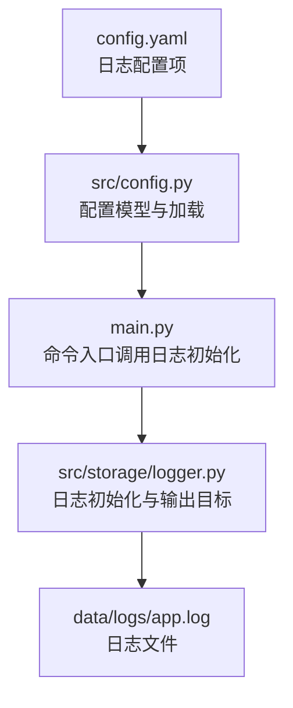
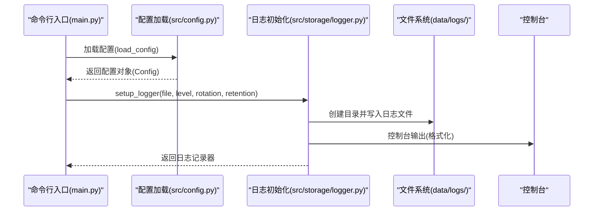
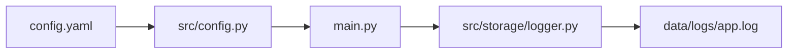

# 日志配置

<cite>
**本文档引用的文件**
- [config.yaml](file://config.yaml)
- [src/config.py](file://src/config.py)
- [src/storage/logger.py](file://src/storage/logger.py)
- [main.py](file://main.py)
- [src/models/image/image_modelscope.py](file://src/models/image/image_modelscope.py)
- [src/render/ppt/builder.py](file://src/render/ppt/builder.py)
- [env.example](file://env.example)
</cite>

## 目录
1. [简介](#简介)
2. [项目结构](#项目结构)
3. [核心组件](#核心组件)
4. [架构总览](#架构总览)
5. [详细组件分析](#详细组件分析)
6. [依赖关系分析](#依赖关系分析)
7. [性能考虑](#性能考虑)
8. [故障排查指南](#故障排查指南)
9. [结论](#结论)
10. [附录](#附录)

## 简介
本指南围绕项目中的日志配置进行系统性说明，重点覆盖以下方面：
- logging.level、logging.file、logging.rotation、logging.retention 的作用与配置方法
- 不同日志级别的含义与适用场景
- 日志文件轮转策略与保留周期配置
- 日志格式与输出目标的配置选项
- 日志性能优化与磁盘空间管理最佳实践
- 日志分析与监控的配置建议
- 调试模式与生产环境的日志配置差异

## 项目结构
该项目采用 YAML 配置文件集中管理日志参数，并通过 Python 模块在应用启动时加载与初始化日志记录器。日志配置位于顶层配置文件中，日志初始化逻辑集中在存储层模块中，应用入口在命令行子命令中统一调用日志初始化函数。

图表来源
- [config.yaml](file://config.yaml#L42-L47)
- [src/config.py](file://src/config.py#L52-L71)
- [main.py](file://main.py#L54-L63)
- [src/storage/logger.py](file://src/storage/logger.py#L8-L38)

章节来源
- [config.yaml](file://config.yaml#L42-L47)
- [src/config.py](file://src/config.py#L52-L71)
- [main.py](file://main.py#L54-L63)
- [src/storage/logger.py](file://src/storage/logger.py#L8-L38)

## 核心组件
- 配置模型与加载：通过 Pydantic 定义日志配置模型，并从 YAML 文件加载配置，支持环境变量替换。
- 日志初始化：封装 Loguru 初始化流程，设置文件输出、控制台输出、轮转与保留策略、编码与格式。
- 应用入口：在各命令执行前调用日志初始化函数，根据是否启用调试模式动态调整日志级别。

章节来源
- [src/config.py](file://src/config.py#L52-L71)
- [src/storage/logger.py](file://src/storage/logger.py#L8-L38)
- [main.py](file://main.py#L54-L63)

## 架构总览
下图展示了日志配置在应用中的流转过程：配置文件被加载并解析为配置对象，随后在命令入口处调用日志初始化函数，最终由 Loguru 将日志同时写入文件与控制台，并按配置进行轮转与保留。

图表来源
- [main.py](file://main.py#L54-L63)
- [src/config.py](file://src/config.py#L74-L88)
- [src/storage/logger.py](file://src/storage/logger.py#L8-L38)

## 详细组件分析

### 日志配置项详解
- logging.level
  - 作用：设置日志记录的最低级别，低于该级别的消息将被忽略。
  - 默认值：在配置文件中为 INFO。
  - 动态调整：当命令行启用调试模式时，会将日志级别提升为 DEBUG。
  - 适用场景：开发调试阶段使用 DEBUG；生产环境使用 INFO 或更高级别以减少噪声。
- logging.file
  - 作用：指定日志文件的输出路径。
  - 默认值：在配置文件中为 data/logs/app.log。
  - 注意事项：初始化时会自动创建父级目录，确保路径存在。
- logging.rotation
  - 作用：设置日志文件大小达到阈值后触发轮转。
  - 默认值：在配置文件中为 10 MB。
  - 典型取值：支持字节单位（如 10MB）、时间单位（如 12:00）等，具体取决于所用库的解析能力。
- logging.retention
  - 作用：设置日志文件的保留周期，过期文件会被清理。
  - 默认值：在配置文件中为 7 天。
  - 典型取值：支持天数、周数、月数等，具体取决于所用库的解析能力。

章节来源
- [config.yaml](file://config.yaml#L42-L47)
- [src/config.py](file://src/config.py#L52-L56)
- [src/storage/logger.py](file://src/storage/logger.py#L15-L29)
- [main.py](file://main.py#L57-L58)

### 日志级别与适用场景
- DEBUG：用于开发调试，输出最详细的运行信息。适用于本地开发与问题定位。
- INFO：用于记录常规运行状态与关键流程节点。适用于生产环境的基础观测。
- WARNING：用于记录潜在问题但不影响正常流程的情况。适用于告警与异常恢复。
- ERROR：用于记录错误事件，通常伴随异常堆栈或错误描述。适用于问题追踪与监控。
- SUCCESS：用于记录成功完成的操作或流程。适用于审计与确认类事件。

章节来源
- [src/models/image/image_modelscope.py](file://src/models/image/image_modelscope.py#L111-L115)
- [src/render/ppt/builder.py](file://src/render/ppt/builder.py#L81-L83)

### 日志格式与输出目标
- 文件输出：将格式化的日志写入指定文件，编码为 UTF-8，便于跨平台兼容。
- 控制台输出：同时将格式化的日志输出到终端，便于实时观察。
- 格式字段：包含时间戳、日志级别、消息体等，便于快速定位问题。

章节来源
- [src/storage/logger.py](file://src/storage/logger.py#L20-L36)

### 日志轮转策略与保留周期
- 轮转策略：基于文件大小阈值进行轮转，避免单个日志文件过大导致读写性能下降与管理困难。
- 保留周期：按设定的保留时间清理旧日志文件，防止磁盘空间被长期占用。
- 建议：根据业务吞吐量与磁盘容量合理设置轮转阈值与保留周期，平衡性能与存储成本。

章节来源
- [src/storage/logger.py](file://src/storage/logger.py#L20-L29)
- [config.yaml](file://config.yaml#L46-L47)

### 调试模式与生产环境差异
- 调试模式：通过命令行开关启用，将日志级别提升为 DEBUG，输出更详细的信息，便于问题排查。
- 生产环境：默认使用较低的日志级别，减少冗余日志对性能的影响，同时保留关键错误与警告信息。

章节来源
- [main.py](file://main.py#L54-L63)

### 日志使用示例与最佳实践
- 在各模块中使用统一的日志记录器输出运行状态、错误与警告信息，保持一致性。
- 对于网络请求、重试与超时等关键流程，记录明确的状态标识与耗时信息，便于问题定位。
- 对于批量处理与并发场景，记录进度与结果统计，便于监控与审计。

章节来源
- [src/models/image/image_modelscope.py](file://src/models/image/image_modelscope.py#L157-L195)
- [src/models/image/image_modelscope.py](file://src/models/image/image_modelscope.py#L270-L299)
- [src/render/ppt/builder.py](file://src/render/ppt/builder.py#L81-L83)
- [src/render/ppt/builder.py](file://src/render/ppt/builder.py#L149-L151)

## 依赖关系分析
日志配置在项目中的依赖关系如下：配置文件提供参数，配置模块负责解析与校验，入口模块在命令执行前初始化日志，日志模块负责实际的输出与轮转。

图表来源
- [config.yaml](file://config.yaml#L42-L47)
- [src/config.py](file://src/config.py#L74-L88)
- [main.py](file://main.py#L54-L63)
- [src/storage/logger.py](file://src/storage/logger.py#L8-L38)

章节来源
- [config.yaml](file://config.yaml#L42-L47)
- [src/config.py](file://src/config.py#L74-L88)
- [main.py](file://main.py#L54-L63)
- [src/storage/logger.py](file://src/storage/logger.py#L8-L38)

## 性能考虑
- 日志级别选择：生产环境优先使用 INFO 或更高级别，避免 DEBUG 带来的额外开销。
- 轮转阈值设置：根据业务峰值流量调整轮转大小，避免频繁轮转造成 I/O 抖动。
- 编码与格式：UTF-8 编码与简洁格式有助于减少字符处理开销。
- 输出目标：同时输出到文件与控制台会增加 I/O 压力，可根据需要关闭控制台输出以降低开销。
- 磁盘空间管理：合理设置保留周期，定期清理旧日志，避免磁盘空间不足影响服务稳定性。

## 故障排查指南
- 日志文件未生成：检查日志文件路径是否存在父级目录权限问题，确认初始化函数已正确调用。
- 日志级别不生效：确认命令行调试开关是否启用，以及配置文件中的默认级别是否被覆盖。
- 轮转不触发：检查轮转阈值设置是否合理，确认日志文件大小增长情况。
- 保留策略无效：检查保留周期设置是否正确，确认系统时间与日志时间一致。
- 控制台输出异常：检查格式化字符串与编码设置，确保输出目标可用。

章节来源
- [src/storage/logger.py](file://src/storage/logger.py#L15-L16)
- [main.py](file://main.py#L57-L58)
- [src/storage/logger.py](file://src/storage/logger.py#L20-L29)

## 结论
本项目通过集中配置与模块化初始化实现了灵活且高效的日志体系。通过合理设置日志级别、轮转阈值与保留周期，结合统一的格式与输出目标，能够在开发调试与生产环境中兼顾可观测性与性能。建议在生产环境中遵循“低级别、高保留、适度轮转”的原则，并结合监控与告警机制实现持续优化。

## 附录

### 配置项对照表
- logging.level：日志级别（默认：INFO；调试模式：DEBUG）
- logging.file：日志文件路径（默认：data/logs/app.log）
- logging.rotation：轮转阈值（默认：10 MB）
- logging.retention：保留周期（默认：7 天）

章节来源
- [config.yaml](file://config.yaml#L42-L47)
- [src/config.py](file://src/config.py#L52-L56)
- [src/storage/logger.py](file://src/storage/logger.py#L15-L29)
- [main.py](file://main.py#L57-L58)

### 环境变量与配置文件
- 环境变量示例文件提供了 API Key 等敏感配置的占位符，便于在不同环境间切换。
- 配置加载模块支持递归替换环境变量引用，确保配置的灵活性与安全性。

章节来源
- [env.example](file://env.example#L1-L10)
- [src/config.py](file://src/config.py#L91-L108)